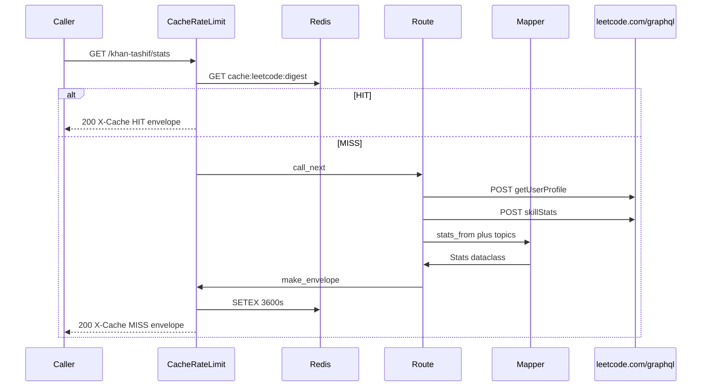

# Envelope and schemas

Wire contract from `~/Projects/Stats APIs/CANONICAL_SCHEMA.md`, implemented as dataclasses in `models/canonical/`. `PLATFORM = "leetcode"`, `CATEGORY = "dsa"`.

Try it live: [playground](https://leetcode-stats.tashif.codes/playground), [OpenAPI](https://leetcode-stats.tashif.codes/docs), sample JSON [khan-tashif profile](https://leetcode-stats.tashif.codes/khan-tashif/profile). The HTML playground placeholder is `demo` (`TRY_PATH = /demo/profile`). Use a real handle.

## Input

Caller sends no body and no auth. CORS `*`.

Path:

| Param | Type | Where |
| --- | --- | --- |
| `username` | string | first path segment, lowercased by middleware |

Query (heatmap):

| Param | Values | Default |
| --- | --- | --- |
| `view` | `all` \| `last_365` \| `year` | `all` |
| `year` | integer | required when `view=year` |

Aliases still accepted: `365`, `last365`, `last365days`, `days`, `last_year`. Unknown `view`, or `view=year` without `year`, is HTTP 400.

Query (SVG):

| Param | Values | Default |
| --- | --- | --- |
| `theme` | `dark` \| `light` | `dark` |
| `exclude` | comma-separated topic names | empty |

```http
GET /khan-tashif/stats HTTP/1.1
Host: leetcode-stats.tashif.codes

GET /khan-tashif/heatmap?view=year&year=2026 HTTP/1.1
Host: leetcode-stats.tashif.codes

GET /khan-tashif/stats/svg?theme=dark&exclude=Arrays,Strings HTTP/1.1
Host: leetcode-stats.tashif.codes
```

Server-side GraphQL input (not sent by the caller):

```json
{
  "operationName": "getUserProfile",
  "query": "query getUserProfile($username: String!) { ... }",
  "variables": { "username": "khan-tashif" }
}
```

Posted to `https://leetcode.com/graphql/` with `referer: https://leetcode.com/{username}/`. See [GraphQL and decoders](5.2-graphql-and-decoders).

## Output envelope

Every JSON route. `make_envelope` copies any legacy dict first, then always sets these keys.

```json
{
  "status": "success",
  "message": "retrieved",
  "platform": "leetcode",
  "username": "khan-tashif",
  "cached": false,
  "data": {}
}
```

`cached` is usually `false` from the mapper. Redis hits show as `X-Cache: HIT` on the response, not as this field flipping.

`/{username}` and `/{username}/stats` also flatten older LeetCode fields next to `data`: `totalSolved`, `easySolved`, `mediumSolved`, `hardSolved`, `acceptanceRate`, `ranking`, `submissionCalendar`. Read `data` for new clients.

Missing user: HTTP 200, `status: "error"`, `data: null` on JSON. SVG is HTTP 404. After Redis caches the miss, later JSON is 404 `X-Cache: NEGATIVE-HIT`.

## `data` by route

### Summary `GET /{username}`

```json
{
  "totalSolved": 1263,
  "totalActiveDays": 608,
  "totalContests": 57,
  "currentRating": 1745,
  "maxRating": 1803,
  "rank": "Knight",
  "badgesCount": 24
}
```

### Profile `GET /{username}/profile`

```json
{
  "displayName": "Tashif",
  "username": "khan-tashif",
  "avatar": "https://...",
  "country": "India",
  "countryFlag": "https://...",
  "institution": null,
  "company": null,
  "bio": null,
  "websites": [],
  "social": { "github": null, "twitter": null, "linkedin": null },
  "verified": false
}
```

### Stats `GET /{username}/stats`

```json
{
  "totalSolved": 859,
  "totalQuestions": 3000,
  "acceptanceRate": 65.5,
  "byDifficulty": {
    "fundamental": 0,
    "school": 0,
    "basic": 0,
    "easy": 267,
    "medium": 472,
    "hard": 120
  },
  "topicAnalysis": [
    { "topic": "Arrays", "count": 506 }
  ]
}
```

LeetCode fills `easy` / `medium` / `hard`. `school`, `basic`, `fundamental` stay 0 so GFG can use the same dict.

`GET /{username}/topics` returns only the topic list as `data`, not the full stats object.

### Contests `GET /{username}/contests`

```json
{
  "count": 28,
  "rating": 1745,
  "maxRating": 1803,
  "rank": "Knight",
  "globalRanking": 38357,
  "topPercentage": 5.0,
  "history": [
    {
      "name": "Biweekly Contest 175",
      "date": "2026-01-31",
      "timestamp": 1769817600,
      "rating": 1745,
      "ranking": 38357,
      "problemsSolved": 3,
      "totalProblems": 4
    }
  ]
}
```

History is attended contests only. GraphQL includes unattended rows. `contests_from` drops them. Rating 0 becomes `null`.

### Rating `GET /{username}/rating`

```json
{
  "current": 1745,
  "max": 1803,
  "history": [
    { "timestamp": 1769817600, "rating": 1745, "contestName": "Biweekly 175" }
  ]
}
```

### Heatmap `GET /{username}/heatmap`

Windowed fields describe the selected view. `yearlyContributions` and `availableYears` always describe full history.

```json
{
  "totalSubmissions": 592,
  "totalActiveDays": 608,
  "currentStreak": 4,
  "longestStreak": 138,
  "maxDailySubmissions": 12,
  "firstActiveDate": "2024-01-03",
  "lastActiveDate": "2026-05-29",
  "dailyContributions": [
    { "date": "2024-01-03", "count": 3, "level": 1 }
  ],
  "yearlyContributions": [
    { "year": 2025, "totalSubmissions": 320, "activeDays": 120 }
  ],
  "availableYears": [2026, 2025, 2024],
  "view": "all",
  "year": null,
  "startDate": "2024-01-03",
  "endDate": "2026-05-29"
}
```

`level` is 0 to 4 from `ceil((count/max)*4)`.

### Badges `GET /{username}/badges`

```json
{
  "count": 24,
  "active": { "id": "...", "name": "Knight", "icon": "https://...", "level": null },
  "list": [
    { "id": "1", "name": "Problem Solver", "icon": "https://...", "level": null }
  ]
}
```

LeetCode `level` is always `null`.

### SVG `GET /{username}/stats/svg`

Not JSON. `Content-Type: image/svg+xml`. `Cache-Control: public, max-age=86400`. Accent `#ffa116`. Missing user is an error SVG at HTTP 404, `max-age=300`.

## Errors

| HTTP | When |
| --- | --- |
| 200 `status: error` | GraphQL `matchedUser: null` on JSON routes |
| 400 | bad heatmap window |
| 404 | SVG miss, or Redis `NEGATIVE-HIT` |
| 429 | this API's IP/handle limiter. `Retry-After` |

429 body:

```json
{
  "status": "error",
  "message": "Rate limit exceeded",
  "retryAfter": 5,
  "limitedBy": "ip"
}
```

## Request / response cycle



Full numbered walk: [Request path](5.1-request-path).
