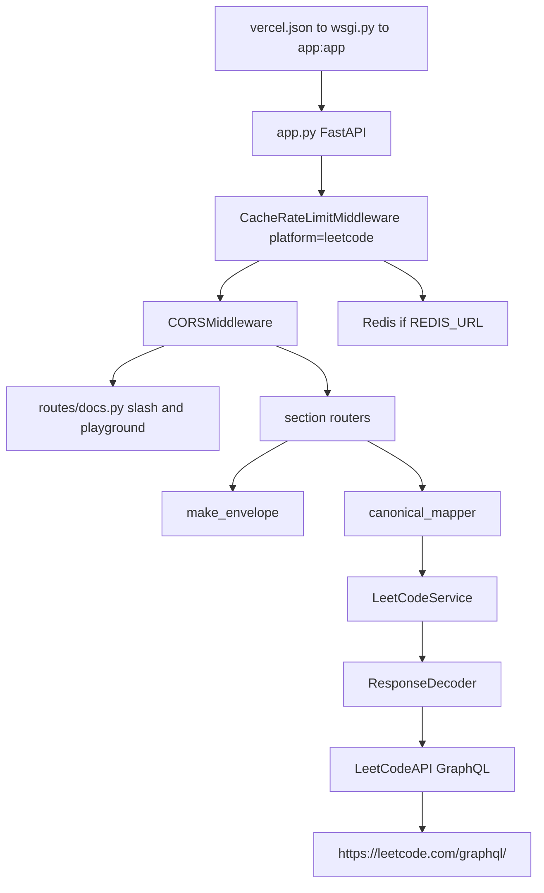

# Architecture

This service is a FastAPI proxy in front of LeetCode GraphQL. It does not store accounts. A GET with a public username becomes one or more GraphQL POSTs, then a JSON envelope CodeTrace can merge with six other platforms.

The same layout is copied across the family: `app.py` mounts routers, `core/` owns Redis cache and rate limits, `services/` talks upstream, `models/canonical/` is the shared card, `routes/docs.py` ships the HTML playground. Full Redis walk is on [Request path](5.1-request-path). Env table and bind ports are on [Cache, rate limit, and deploy](6-cache-rate-limit-and-deploy).

## Why FastAPI

Typed query params for heatmap `view`/`year` and SVG `theme`/`exclude`. `HTTPException` for a bad window. HTML and `image/svg+xml` on the same app as JSON. OpenAPI at `/docs`. Vercel `@vercel/python` serves the ASGI app from `wsgi.py`.

The GraphQL client is still blocking `requests`. Middleware is async. Flask leftovers remain: `FLASK_ENV` fallback, `config.py` style. That is history, not a second framework.

## Why an additive envelope

Old clients already parsed `totalSolved` at the top level. New clients (CodeTrace) read `data`. `make_envelope` copies the legacy dict first, then always sets `platform`, `username`, `cached`, `data`. Tests pin that contract in `tests/test_canonical.py`.

A missing LeetCode user is GraphQL `matchedUser: null`, not a missing HTTP resource. JSON routes therefore return HTTP 200 with `status: "error"` and `data: null`. SVG returns 404 so a README badge is not a 200 image of a lie. After Redis caches that miss, later JSON hits become 404 with `X-Cache: NEGATIVE-HIT`.

## Layout on disk

| Path | Job |
| --- | --- |
| `app.py` | FastAPI app, CORS, middleware, router order |
| `core/` | Redis, rate limit, cache middleware |
| `services/client.py` | GraphQL operations |
| `services/decoders/` | GraphQL JSON to dataclasses |
| `services/canonical_mapper.py` | dataclasses to shared card sections |
| `services/heatmap_window.py` | `all` / `last_365` / `year` |
| `services/stats_svg.py` | README card |
| `routes/` | one file per section |
| `models/canonical/` | shared shapes, `PLATFORM = "leetcode"` |
| `routes/docs.py` | `/` and `/playground` HTML |

Router mount order matters. Docs first. Section paths next. `GET /{username}` last so it does not swallow `/playground`.
