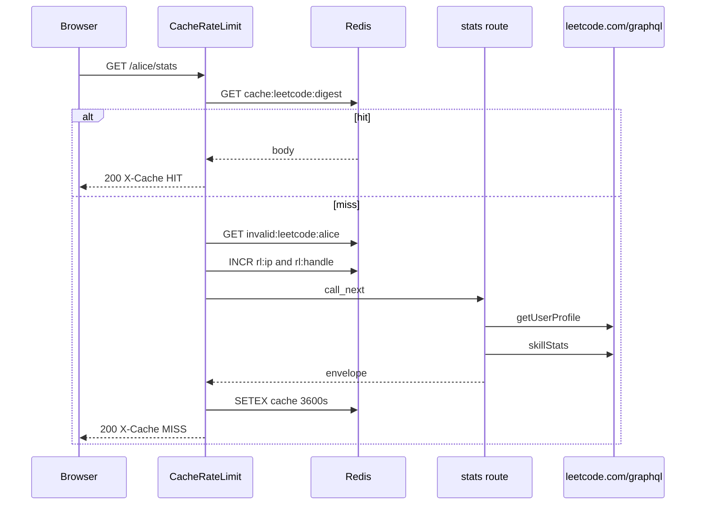

# Request path

Walk of `GET /alice/stats` with Redis on.

1. CORS middleware (added first, runs second).
2. `CacheRateLimitMiddleware` with `platform="leetcode"` (added last, runs first).
3. Skip check. Path is not `/`, `/docs`, `/redoc`, `/openapi.json`, `/favicon.ico`. Method is GET. Redis is on.
4. Handle is the first path segment, lowercased: `alice`.
5. Cache key is `cache:leetcode:{sha256(GET:/alice/stats:sorted_query)}`.
6. On HIT, body is base64-decoded and returned with `X-Cache: HIT`. Done.
7. Negative key `invalid:leetcode:alice`. On HIT, HTTP 404 `User does not exist`, `X-Cache: NEGATIVE-HIT`. Invalid-user rate limits apply (10/IP and 5/handle per 10 minutes).
8. Live limits: 60 req/min per IP, 30 req/min per handle. Over: 429 with `Retry-After` and exponential backoff 5s to 300s.
9. Route `get_stats` calls `get_user_stats` (GraphQL `getUserProfile`) and `_topics` (GraphQL `skillStats`).
10. `stats_from` builds canonical `Stats` including `topicAnalysis`.
11. `make_envelope` wraps it. HTTP 200 cached for 3600s unless `Cache-Control` says otherwise. `X-Cache: MISS`.

Without Redis, steps 5 to 8 disappear. Every GET hits GraphQL. Rate limits disappear too. That is fine on a laptop and noisy on a public host.

IP is `X-Forwarded-For` first hop, else `X-Real-IP`, else `request.client.host`. Vercel sits in front, so the forwarded header is the one that matters.

`/playground` is not in `SKIP_PATHS`. With Redis on, the first path segment is treated as handle `playground`. Harmless, slightly weird. `/ph/...` becomes handle `ph` for the same reason.

## Redis env

`REDIS_URL` turns the middleware on. There is no in-process HTTP cache on LeetCode (CodeChef is the sibling that also has `TTLCache`). Redis errors fail open: cache miss, rate limit allow. Bind ports and HTML routes stay on [Cache, rate limit, and deploy](6-cache-rate-limit-and-deploy).

| Env | Default |
| --- | --- |
| `API_CACHE_TTL_SECONDS` | 3600 |
| `INVALID_USER_CACHE_TTL_SECONDS` | 300 |
| `RATE_LIMIT_IP_REQUESTS` | 60 per 60s |
| `RATE_LIMIT_HANDLE_REQUESTS` | 30 per 60s |
| `INVALID_RATE_LIMIT_IP_REQUESTS` | 10 per 600s |
| `INVALID_RATE_LIMIT_HANDLE_REQUESTS` | 5 per 600s |
| `RATE_LIMIT_BACKOFF_BASE_SECONDS` | 5 |
| `RATE_LIMIT_BACKOFF_MAX_SECONDS` | 300 |

Keys:

- `cache:leetcode:{sha256}`
- `invalid:leetcode:{handle}`
- `rl:ip:leetcode:{ip}` / `rl:handle:leetcode:{handle}`
- `backoff:{same}` / `violations:{same}`

Invalid-user markers: `user does not exist`, `user not found`, `not found on`, `invalid username`. Contest-empty is not one of them.
