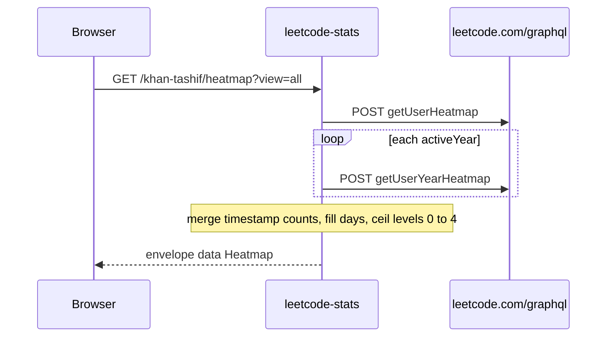

# GraphQL and decoders

Not a scrape. Public GraphQL only. No LeetCode session cookie.

Playground: [leetcode-stats.tashif.codes/playground](https://leetcode-stats.tashif.codes/playground). OpenAPI: [leetcode-stats.tashif.codes/docs](https://leetcode-stats.tashif.codes/docs).

Upstream is `https://leetcode.com/graphql/`. `LeetCodeAPI` POSTs with `requests` and `referer: https://leetcode.com/{username}/`. GraphQL `errors` become `"user does not exist"`. Non-200 becomes `"HTTP {code}"`. `matchedUser: null` is the same miss. JSON routes then return HTTP 200 `status: "error"`. SVG returns 404.

## Operations

| Client method | Operation | What it pulls |
| --- | --- | --- |
| `fetch_user_stats` | `getUserProfile` | `allQuestionsCount`, submitStats, ranking, calendar |
| `fetch_contest_ranking` | `getUserContestRanking` | rating, global rank, history |
| `fetch_user_profile` | `getUserProfile` (wider) | profile, social, badges, recent 20 |
| `fetch_user_badges` | `getUserBadges` | badges, upcoming, active |
| `fetch_user_heatmap` | `getUserHeatmap` then `getUserYearHeatmap` | merged calendars |
| `fetch_skill_stats` | `skillStats` | `tagProblemCounts` |

`LeetCodeService` is a thin wrapper. Routes and `canonical_mapper` call that class. Decoders live in `services/decoders/` and re-export `ResponseDecoder` methods.

## Heatmap years

LeetCode's flat `matchedUser.submissionCalendar` only returns about the last 12 months. Inactive users look empty. The client reads `userCalendar.activeYears`, fetches `userCalendar(year:)` per year, and merges timestamp counts. `decode_heatmap` then UTC-dates those stamps, fills every day from January 1 of first activity through today, and assigns levels 0 to 4 with `ceil((count/max)*4)`.

That is why a first heatmap GET is slower than stats. It is N GraphQL calls, not one.

## Contests vs missing users

`decode_contest_ranking` treats `userContestRanking is None` as `"user has no contest history"`. That string is not in the invalid-user markers. A real account that never sat a contest is not a 404.

History from GraphQL includes unattended contests. `contests_from` keeps attended rows only. Tests in `tests/test_contests.py` pin both behaviors.

## Topics

`decode_skill_stats` merges advanced / intermediate / fundamental tags, drops `solved <= 0`, sorts by count desc. `/stats` and `/topics` both call `build_stats`, so both hit `getUserProfile` and `skillStats`. `/topics` is not cheaper. It is a smaller JSON.

## End-to-end walk

```http
POST https://leetcode.com/graphql/ HTTP/1.1
Content-Type: application/json
Referer: https://leetcode.com/khan-tashif/

{
  "query": "query getUserProfile($username: String!) { matchedUser(username: $username) { ... } }",
  "variables": { "username": "khan-tashif" }
}
```



The blocking `requests` client runs inside async middleware. That is history. Flask leftovers (`FLASK_ENV`) are not a second framework.
