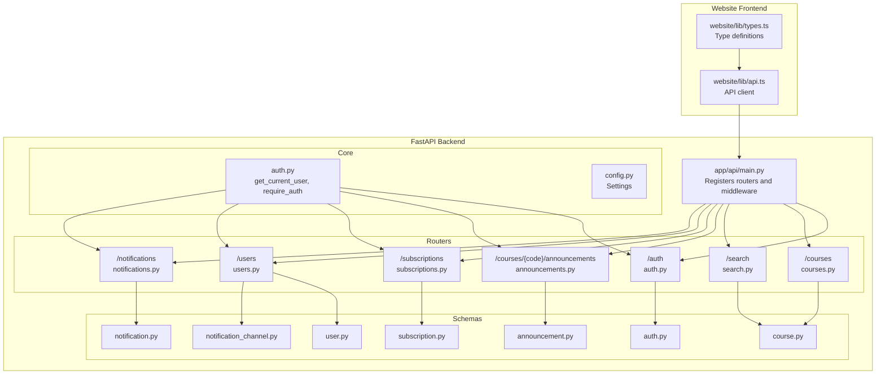
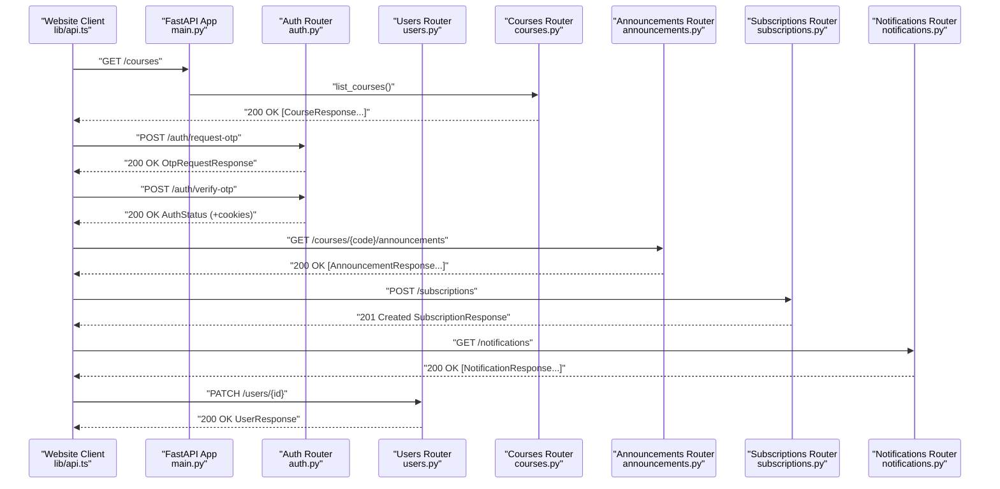
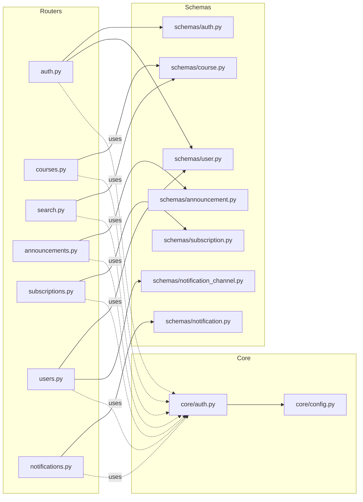

# API Reference

<cite>
**Referenced Files in This Document**
- [app/api/main.py](file://notice-reminders/app/api/main.py)
- [app/api/routers/auth.py](file://notice-reminders/app/api/routers/auth.py)
- [app/api/routers/courses.py](file://notice-reminders/app/api/routers/courses.py)
- [app/api/routers/announcements.py](file://notice-reminders/app/api/routers/announcements.py)
- [app/api/routers/search.py](file://notice-reminders/app/api/routers/search.py)
- [app/api/routers/subscriptions.py](file://notice-reminders/app/api/routers/subscriptions.py)
- [app/api/routers/users.py](file://notice-reminders/app/api/routers/users.py)
- [app/api/routers/notifications.py](file://notice-reminders/app/api/routers/notifications.py)
- [app/schemas/auth.py](file://notice-reminders/app/schemas/auth.py)
- [app/schemas/user.py](file://notice-reminders/app/schemas/user.py)
- [app/schemas/course.py](file://notice-reminders/app/schemas/course.py)
- [app/schemas/announcement.py](file://notice-reminders/app/schemas/announcement.py)
- [app/schemas/notification.py](file://notice-reminders/app/schemas/notification.py)
- [app/schemas/subscription.py](file://notice-reminders/app/schemas/subscription.py)
- [app/schemas/notification_channel.py](file://notice-reminders/app/schemas/notification_channel.py)
- [app/core/auth.py](file://notice-reminders/app/core/auth.py)
- [app/core/config.py](file://notice-reminders/app/core/config.py)
- [website/lib/api.ts](file://website/lib/api.ts)
- [website/lib/types.ts](file://website/lib/types.ts)
</cite>

## Table of Contents
1. [Introduction](#introduction)
2. [Project Structure](#project-structure)
3. [Core Components](#core-components)
4. [Architecture Overview](#architecture-overview)
5. [Detailed Component Analysis](#detailed-component-analysis)
6. [Dependency Analysis](#dependency-analysis)
7. [Performance Considerations](#performance-considerations)
8. [Troubleshooting Guide](#troubleshooting-guide)
9. [Conclusion](#conclusion)
10. [Appendices](#appendices)

## Introduction
This document provides comprehensive API documentation for the Notice Reminders system. It covers all RESTful endpoints, including authentication (login via OTP, logout, session refresh), course search and management, announcement retrieval, subscription management, and user profile operations. For each endpoint, you will find HTTP methods, URL patterns, request/response schemas, authentication requirements, error codes, and example requests/responses. Additionally, it documents the API client implementation used by the website and highlights security and rate-limiting considerations.

## Project Structure
The API is implemented as a FastAPI application with modular routers grouped by domain. The website’s Next.js frontend consumes the API through a dedicated client that manages cookies and handles errors.

**Diagram sources**
- [app/api/main.py](file://notice-reminders/app/api/main.py#L17-L42)
- [app/api/routers/auth.py](file://notice-reminders/app/api/routers/auth.py#L12-L126)
- [app/api/routers/courses.py](file://notice-reminders/app/api/routers/courses.py#L7-L32)
- [app/api/routers/search.py](file://notice-reminders/app/api/routers/search.py#L7-L17)
- [app/api/routers/announcements.py](file://notice-reminders/app/api/routers/announcements.py#L10-L33)
- [app/api/routers/subscriptions.py](file://notice-reminders/app/api/routers/subscriptions.py#L13-L71)
- [app/api/routers/users.py](file://notice-reminders/app/api/routers/users.py#L14-L151)
- [app/api/routers/notifications.py](file://notice-reminders/app/api/routers/notifications.py#L10-L62)
- [app/schemas/auth.py](file://notice-reminders/app/schemas/auth.py#L8-L26)
- [app/schemas/user.py](file://notice-reminders/app/schemas/user.py#L6-L24)
- [app/schemas/course.py](file://notice-reminders/app/schemas/course.py#L6-L19)
- [app/schemas/announcement.py](file://notice-reminders/app/schemas/announcement.py#L6-L16)
- [app/schemas/notification.py](file://notice-reminders/app/schemas/notification.py)
- [app/schemas/subscription.py](file://notice-reminders/app/schemas/subscription.py)
- [app/schemas/notification_channel.py](file://notice-reminders/app/schemas/notification_channel.py)
- [app/core/auth.py](file://notice-reminders/app/core/auth.py#L14-L72)
- [app/core/config.py](file://notice-reminders/app/core/config.py#L4-L32)
- [website/lib/api.ts](file://website/lib/api.ts#L16-L53)
- [website/lib/types.ts](file://website/lib/types.ts#L1-L97)

**Section sources**
- [app/api/main.py](file://notice-reminders/app/api/main.py#L17-L42)
- [website/lib/api.ts](file://website/lib/api.ts#L16-L53)

## Core Components
- Authentication and Authorization
  - Access tokens are validated via a dependency that reads the access_token cookie and verifies JWT claims.
  - Decorators enforce authentication for protected endpoints.
- Cookie-Based Session Management
  - Login and refresh set httponly cookies for access_token and refresh_token with appropriate expiration and security attributes.
- CORS
  - Cross-origin requests are permitted from configured origins with credentials allowed.
- Settings
  - Token expirations, cache TTL, and external service URLs are configurable.

**Section sources**
- [app/core/auth.py](file://notice-reminders/app/core/auth.py#L14-L72)
- [app/api/routers/auth.py](file://notice-reminders/app/api/routers/auth.py#L15-L41)
- [app/core/config.py](file://notice-reminders/app/core/config.py#L4-L32)
- [app/api/main.py](file://notice-reminders/app/api/main.py#L21-L27)

## Architecture Overview
The API follows a layered architecture:
- Routers define endpoints and bind request/response schemas.
- Services encapsulate business logic.
- Models and schemas define data contracts.
- Authentication middleware and decorators protect endpoints.
- The website client communicates over HTTPS with cookie-based sessions.

**Diagram sources**
- [app/api/main.py](file://notice-reminders/app/api/main.py#L29-L35)
- [app/api/routers/auth.py](file://notice-reminders/app/api/routers/auth.py#L43-L76)
- [app/api/routers/courses.py](file://notice-reminders/app/api/routers/courses.py#L10-L15)
- [app/api/routers/announcements.py](file://notice-reminders/app/api/routers/announcements.py#L15-L32)
- [app/api/routers/subscriptions.py](file://notice-reminders/app/api/routers/subscriptions.py#L16-L34)
- [app/api/routers/notifications.py](file://notice-reminders/app/api/routers/notifications.py#L13-L20)
- [app/api/routers/users.py](file://notice-reminders/app/api/routers/users.py#L41-L64)
- [website/lib/api.ts](file://website/lib/api.ts#L76-L91)

## Detailed Component Analysis

### Authentication Endpoints
- Base Path: /auth
- Authentication Requirement:
  - request-otp: Not authenticated.
  - verify-otp, refresh, logout, me: Requires access token via cookie.

Endpoints:
- POST /auth/request-otp
  - Description: Requests an OTP for the given email. Returns whether the user is new and expiry time.
  - Authentication: Not required.
  - Request Body: OtpRequest
    - email: string (Email)
  - Response: OtpRequestResponse
    - message: string
    - is_new_user: boolean
    - expires_at: datetime (ISO 8601)
  - Example Request:
    - POST /auth/request-otp with JSON {"email":"user@example.com"}
  - Example Response:
    - 200 OK {"message":"OTP sent","is_new_user":true,"expires_at":"2025-01-01T12:00:00Z"}

- POST /auth/verify-otp
  - Description: Verifies OTP and creates access and refresh tokens, setting cookies.
  - Authentication: Not required.
  - Request Body: OtpVerify
    - email: string (Email)
    - code: string
  - Response: AuthStatus
    - user: UserResponse
    - is_new_user: boolean
  - Cookies Set:
    - access_token: httponly, sameSite lax, path "/", secure unless debug
    - refresh_token: httponly, sameSite lax, path "/", secure unless debug
  - Example Request:
    - POST /auth/verify-otp with JSON {"email":"user@example.com","code":"123456"}
  - Example Response:
    - 200 OK {"user":{"id":1,"email":"user@example.com",...},"is_new_user":false}

- POST /auth/refresh
  - Description: Refreshes access token using a valid refresh token cookie.
  - Authentication: Not required (uses refresh cookie).
  - Response: AuthStatus
  - Cookies Updated: Sets new access_token and refresh_token.
  - Example Request:
    - POST /auth/refresh with cookies containing refresh_token
  - Example Response:
    - 200 OK {"user":{"id":1,...},"is_new_user":false}

- POST /auth/logout
  - Description: Revokes refresh token and deletes cookies.
  - Authentication: Not required (reads refresh cookie).
  - Response: 204 No Content
  - Example Request:
    - POST /auth/logout with cookies containing refresh_token
  - Example Response:
    - 204 No Content

- GET /auth/me
  - Description: Returns currently authenticated user.
  - Authentication: Required (access token cookie).
  - Response: UserResponse
  - Example Request:
    - GET /auth/me with access_token cookie
  - Example Response:
    - 200 OK {"id":1,"email":"user@example.com",...}

Schemas:
- OtpRequest: email (EmailStr)
- OtpVerify: email (EmailStr), code (str)
- OtpRequestResponse: message (str), is_new_user (bool), expires_at (datetime)
- AuthStatus: user (UserResponse), is_new_user (bool)

Security Notes:
- Access and refresh tokens are stored as httponly cookies with SameSite lax and path "/".
- Secure flag is enabled unless debug is true.
- Access token expiration and refresh token expiration are configured in settings.

**Section sources**
- [app/api/routers/auth.py](file://notice-reminders/app/api/routers/auth.py#L43-L126)
- [app/schemas/auth.py](file://notice-reminders/app/schemas/auth.py#L8-L26)
- [app/schemas/user.py](file://notice-reminders/app/schemas/user.py#L13-L24)
- [app/core/auth.py](file://notice-reminders/app/core/auth.py#L14-L51)
- [app/core/config.py](file://notice-reminders/app/core/config.py#L22-L26)

### Course Endpoints
- Base Path: /courses
- Authentication: Not required for listing and retrieving by code.

Endpoints:
- GET /courses
  - Description: Lists all courses.
  - Response: array of CourseResponse
  - Example Request:
    - GET /courses
  - Example Response:
    - 200 OK [{"id":1,"code":"CS101",...},...]

- GET /courses/{course_code}
  - Description: Retrieves a course by its code.
  - Path Parameters:
    - course_code: string
  - Response: CourseResponse
  - Errors:
    - 404 Not Found if course does not exist
  - Example Request:
    - GET /courses/CS101
  - Example Response:
    - 200 OK {"id":1,"code":"CS101","title":"Intro to CS",...}

Schemas:
- CourseResponse: id (int), code (str), title (str), url (str), instructor (str), institute (str), nc_code (str), created_at (datetime), updated_at (datetime)

**Section sources**
- [app/api/routers/courses.py](file://notice-reminders/app/api/routers/courses.py#L10-L32)
- [app/schemas/course.py](file://notice-reminders/app/schemas/course.py#L6-L19)

### Course Search Endpoint
- Base Path: /search
- Authentication: Not required.

Endpoints:
- GET /search?q={query}
  - Description: Searches courses by query string and caches results.
  - Query Parameters:
    - q: string (required)
  - Response: array of CourseResponse
  - Example Request:
    - GET /search?q=computer
  - Example Response:
    - 200 OK [{"id":1,"code":"CS101",...},...]

**Section sources**
- [app/api/routers/search.py](file://notice-reminders/app/api/routers/search.py#L10-L17)
- [app/schemas/course.py](file://notice-reminders/app/schemas/course.py#L6-L19)

### Course Announcement Retrieval
- Base Path: /courses/{course_code}/announcements
- Authentication: Required.

Endpoints:
- GET /courses/{course_code}/announcements
  - Description: Fetches and caches announcements for a course.
  - Path Parameters:
    - course_code: string
  - Response: array of AnnouncementResponse
  - Errors:
    - 404 Not Found if course does not exist
  - Example Request:
    - GET /courses/CS101/announcements with access_token cookie
  - Example Response:
    - 200 OK [{"id":1,"course_id":1,"title":"Welcome",...},...]

Schemas:
- AnnouncementResponse: id (int), course_id (int), title (str), date (str), content (str), fetched_at (datetime)

**Section sources**
- [app/api/routers/announcements.py](file://notice-reminders/app/api/routers/announcements.py#L15-L32)
- [app/schemas/announcement.py](file://notice-reminders/app/schemas/announcement.py#L6-L16)

### Subscription Management
- Base Path: /subscriptions
- Authentication: Required.

Endpoints:
- POST /subscriptions
  - Description: Creates a subscription for the authenticated user to a course.
  - Request Body: SubscriptionCreate
    - course_code: string
  - Response: SubscriptionResponse
  - Errors:
    - 404 Not Found if course does not exist
  - Status Codes:
    - 201 Created on success
  - Example Request:
    - POST /subscriptions with {"course_code":"CS101"} and access_token cookie
  - Example Response:
    - 201 Created {"id":1,"user_id":1,"course_id":1,"is_active":true,...}

- GET /subscriptions
  - Description: Lists subscriptions for the authenticated user.
  - Response: array of SubscriptionResponse
  - Example Request:
    - GET /subscriptions with access_token cookie
  - Example Response:
    - 200 OK [{"id":1,"user_id":1,"course_id":1,"is_active":true},...]

- DELETE /subscriptions/{subscription_id}
  - Description: Deletes a subscription owned by the authenticated user.
  - Path Parameters:
    - subscription_id: integer
  - Errors:
    - 404 Not Found if subscription does not exist
    - 403 Forbidden if subscription does not belong to the user
  - Status Codes:
    - 204 No Content on success
  - Example Request:
    - DELETE /subscriptions/1 with access_token cookie
  - Example Response:
    - 204 No Content

Schemas:
- SubscriptionCreate: course_code (string)
- SubscriptionResponse: id (int), user_id (int), course_id (int), is_active (boolean), created_at (string)

**Section sources**
- [app/api/routers/subscriptions.py](file://notice-reminders/app/api/routers/subscriptions.py#L16-L71)
- [app/schemas/subscription.py](file://notice-reminders/app/schemas/subscription.py)

### User Profile and Channels
- Base Path: /users
- Authentication: Required for all user endpoints.

Endpoints:
- GET /users/{user_id}
  - Description: Retrieves a user by ID.
  - Path Parameters:
    - user_id: integer
  - Errors:
    - 403 Forbidden if requesting another user’s data
    - 404 Not Found if user does not exist
  - Response: UserResponse
  - Example Request:
    - GET /users/1 with access_token cookie
  - Example Response:
    - 200 OK {"id":1,"email":"user@example.com",...}

- PATCH /users/{user_id}
  - Description: Updates user profile fields.
  - Path Parameters:
    - user_id: integer
  - Request Body: UserUpdate
    - email?: string
    - name?: string
    - telegram_id?: string
    - is_active?: boolean
  - Errors:
    - 403 Forbidden if updating another user’s data
    - 404 Not Found if user does not exist
  - Response: UserResponse
  - Example Request:
    - PATCH /users/1 with {"name":"Updated Name"} and access_token cookie
  - Example Response:
    - 200 OK {"id":1,"email":"user@example.com","name":"Updated Name",...}

- DELETE /users/{user_id}
  - Description: Deletes the user account.
  - Path Parameters:
    - user_id: integer
  - Errors:
    - 403 Forbidden if deleting another user’s account
    - 404 Not Found if user does not exist
  - Status Codes:
    - 204 No Content
  - Example Request:
    - DELETE /users/1 with access_token cookie
  - Example Response:
    - 204 No Content

- POST /users/{user_id}/channels
  - Description: Adds a notification channel for the user.
  - Path Parameters:
    - user_id: integer
  - Request Body: NotificationChannelCreate
    - channel: "email" | "telegram"
    - address: string (required for telegram)
    - is_active?: boolean
  - Errors:
    - 403 Forbidden if acting on another user
    - 400 Bad Request if telegram channel lacks address
    - 404 Not Found if user does not exist
  - Response: NotificationChannelResponse
  - Example Request:
    - POST /users/1/channels with {"channel":"telegram","address":"123456789"} and access_token cookie
  - Example Response:
    - 201 Created {"id":1,"user_id":1,"channel":"telegram","address":"123456789",...}

- GET /users/{user_id}/channels
  - Description: Lists notification channels for the user.
  - Path Parameters:
    - user_id: integer
  - Errors:
    - 403 Forbidden if listing another user’s channels
    - 404 Not Found if user does not exist
  - Response: array of NotificationChannelResponse
  - Example Request:
    - GET /users/1/channels with access_token cookie
  - Example Response:
    - 200 OK [{"id":1,"user_id":1,"channel":"telegram","address":"123456789"},...]

Schemas:
- UserUpdate: email (EmailStr?), name (string?), telegram_id (string?), is_active (boolean?)
- UserResponse: id (int), email (EmailStr), name (string?), telegram_id (string?), is_active (boolean), created_at (datetime), updated_at (datetime)
- NotificationChannelCreate: channel ("email"|"telegram"), address (string), is_active (boolean?)
- NotificationChannelResponse: id (int), user_id (int), channel ("email"|"telegram"), address (string), is_active (boolean), created_at (string)

**Section sources**
- [app/api/routers/users.py](file://notice-reminders/app/api/routers/users.py#L17-L151)
- [app/schemas/user.py](file://notice-reminders/app/schemas/user.py#L6-L24)
- [app/schemas/notification_channel.py](file://notice-reminders/app/schemas/notification_channel.py)

### Notifications
- Base Path: /notifications
- Authentication: Required.

Endpoints:
- GET /notifications
  - Description: Lists notifications for the authenticated user.
  - Response: array of NotificationResponse
  - Example Request:
    - GET /notifications with access_token cookie
  - Example Response:
    - 200 OK [{"id":1,"user_id":1,"subscription_id":1,"announcement_id":1,"channel_id":null,...},...]

- GET /notifications/users/{user_id}
  - Description: Lists notifications for a specific user (self-only).
  - Path Parameters:
    - user_id: integer
  - Errors:
    - 403 Forbidden if accessing another user’s notifications
  - Response: array of NotificationResponse
  - Example Request:
    - GET /notifications/users/1 with access_token cookie
  - Example Response:
    - 200 OK [...]
- PATCH /notifications/{notification_id}/read
  - Description: Marks a notification as read for its owner.
  - Path Parameters:
    - notification_id: integer
  - Errors:
    - 404 Not Found if notification does not exist
    - 403 Forbidden if notification does not belong to the user
  - Response: NotificationResponse
  - Example Request:
    - PATCH /notifications/1/read with access_token cookie
  - Example Response:
    - 200 OK {"id":1,"user_id":1,"is_read":true,...}

Schemas:
- NotificationResponse: id (int), user_id (int), subscription_id (int), announcement_id (int), channel_id (int|null), sent_at (string), is_read (boolean)

**Section sources**
- [app/api/routers/notifications.py](file://notice-reminders/app/api/routers/notifications.py#L13-L62)
- [app/schemas/notification.py](file://notice-reminders/app/schemas/notification.py)

## Dependency Analysis
The API is composed of loosely coupled routers, each depending on services and schemas. Authentication is centralized via a dependency that validates access tokens and enforces protection via decorators.

**Diagram sources**
- [app/api/routers/auth.py](file://notice-reminders/app/api/routers/auth.py#L1-L126)
- [app/api/routers/courses.py](file://notice-reminders/app/api/routers/courses.py#L1-L32)
- [app/api/routers/search.py](file://notice-reminders/app/api/routers/search.py#L1-L17)
- [app/api/routers/announcements.py](file://notice-reminders/app/api/routers/announcements.py#L1-L33)
- [app/api/routers/subscriptions.py](file://notice-reminders/app/api/routers/subscriptions.py#L1-L71)
- [app/api/routers/users.py](file://notice-reminders/app/api/routers/users.py#L1-L151)
- [app/api/routers/notifications.py](file://notice-reminders/app/api/routers/notifications.py#L1-L62)
- [app/schemas/auth.py](file://notice-reminders/app/schemas/auth.py#L1-L26)
- [app/schemas/user.py](file://notice-reminders/app/schemas/user.py#L1-L24)
- [app/schemas/course.py](file://notice-reminders/app/schemas/course.py#L1-L19)
- [app/schemas/announcement.py](file://notice-reminders/app/schemas/announcement.py#L1-L16)
- [app/schemas/notification.py](file://notice-reminders/app/schemas/notification.py)
- [app/schemas/subscription.py](file://notice-reminders/app/schemas/subscription.py)
- [app/schemas/notification_channel.py](file://notice-reminders/app/schemas/notification_channel.py)
- [app/core/auth.py](file://notice-reminders/app/core/auth.py#L1-L72)
- [app/core/config.py](file://notice-reminders/app/core/config.py#L1-L32)

**Section sources**
- [app/core/auth.py](file://notice-reminders/app/core/auth.py#L14-L72)
- [app/api/routers/auth.py](file://notice-reminders/app/api/routers/auth.py#L15-L41)

## Performance Considerations
- Caching
  - Course search and announcement retrieval are cached with a configurable TTL to reduce repeated scraping and database load.
- Token Expirations
  - Access tokens expire after a short period; refresh tokens rotate periodically to balance security and UX.
- Database Initialization
  - In debug mode, schemas are generated automatically to aid development.

Recommendations:
- Prefer batch operations where possible (listing subscriptions, notifications).
- Use pagination if lists grow large.
- Monitor cache hit rates for search and announcements.

**Section sources**
- [app/core/config.py](file://notice-reminders/app/core/config.py#L12-L12)
- [app/api/routers/search.py](file://notice-reminders/app/api/routers/search.py#L15-L15)
- [app/api/routers/announcements.py](file://notice-reminders/app/api/routers/announcements.py#L31-L31)

## Troubleshooting Guide
Common Errors and Causes:
- 401 Unauthorized
  - Missing or invalid access_token cookie.
  - Expired access token.
- 403 Forbidden
  - Attempting to access another user’s data or resources.
- 404 Not Found
  - Resource does not exist (course, subscription, notification).
- 400 Bad Request
  - Validation errors (e.g., missing telegram address when adding channel).

Frontend Client Behavior:
- The client sends credentials with each request and throws a typed error on non-OK responses.
- 204 No Content responses are handled explicitly.

**Section sources**
- [app/core/auth.py](file://notice-reminders/app/core/auth.py#L18-L51)
- [app/api/routers/users.py](file://notice-reminders/app/api/routers/users.py#L24-L28)
- [app/api/routers/subscriptions.py](file://notice-reminders/app/api/routers/subscriptions.py#L56-L68)
- [app/api/routers/notifications.py](file://notice-reminders/app/api/routers/notifications.py#L46-L58)
- [website/lib/api.ts](file://website/lib/api.ts#L18-L53)

## Conclusion
The Notice Reminders API provides a cohesive set of endpoints for authentication, course discovery, announcements, subscriptions, and user/channel management. It leverages cookie-based sessions, JWT tokens, and strict authorization checks to maintain security while offering a straightforward developer experience. The website client integrates seamlessly with these endpoints, handling cookies and errors consistently.

## Appendices

### API Client Implementation Details
- Base URL
  - Determined by NEXT_PUBLIC_API_URL environment variable; defaults to http://localhost:8000.
- Credentials
  - credentials: "include" ensures cookies are sent/received.
- Error Handling
  - Non-OK responses raise a typed APIError with status and message.
  - 204 No Content is supported and returns undefined.

Key Functions:
- Authentication: requestOtp, verifyOtp, refreshSession, logout, getMe
- Users: getUser, updateUser, deleteUser, addNotificationChannel, listUserChannels
- Courses: listCourses, getCourse, searchCourses
- Announcements: listAnnouncements
- Subscriptions: createSubscription, listSubscriptions, deleteSubscription
- Notifications: listNotifications, markNotificationRead

**Section sources**
- [website/lib/api.ts](file://website/lib/api.ts#L16-L53)
- [website/lib/types.ts](file://website/lib/types.ts#L1-L97)

### Security and Rate Limiting Considerations
- Cookies
  - access_token and refresh_token are httponly, with secure flag based on debug mode, sameSite lax, and path "/".
- CORS
  - Origins are configurable; credentials are allowed.
- Token Lifetimes
  - Access token and refresh token expirations are configurable.
- Rate Limiting
  - Not implemented at the API level in the provided code. Consider adding rate limiting at the gateway or middleware if needed.

**Section sources**
- [app/api/routers/auth.py](file://notice-reminders/app/api/routers/auth.py#L21-L40)
- [app/api/main.py](file://notice-reminders/app/api/main.py#L21-L27)
- [app/core/config.py](file://notice-reminders/app/core/config.py#L22-L26)