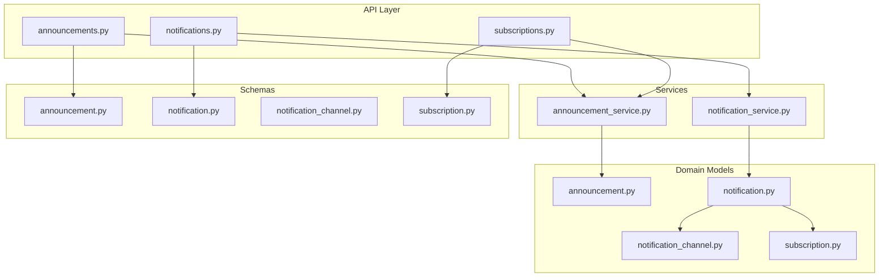
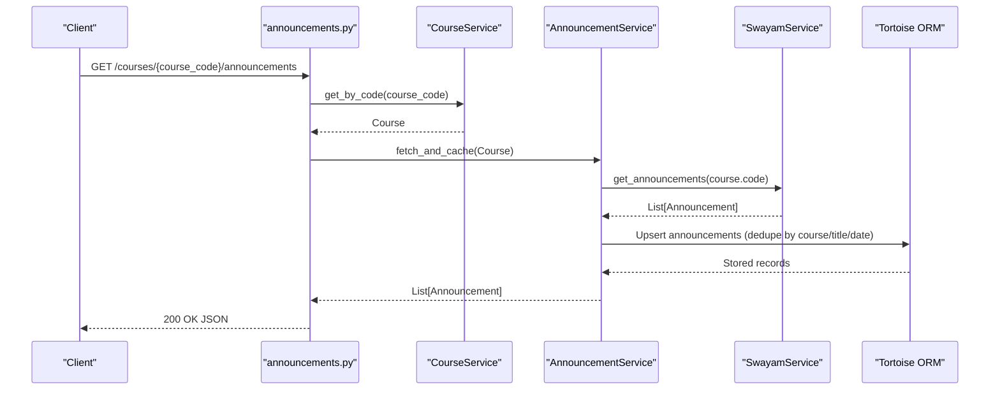
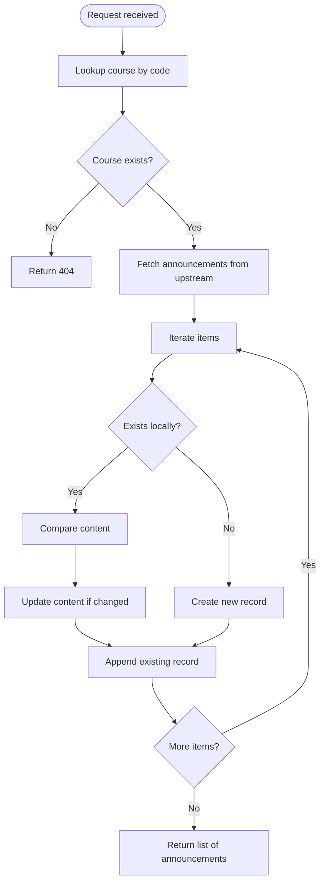
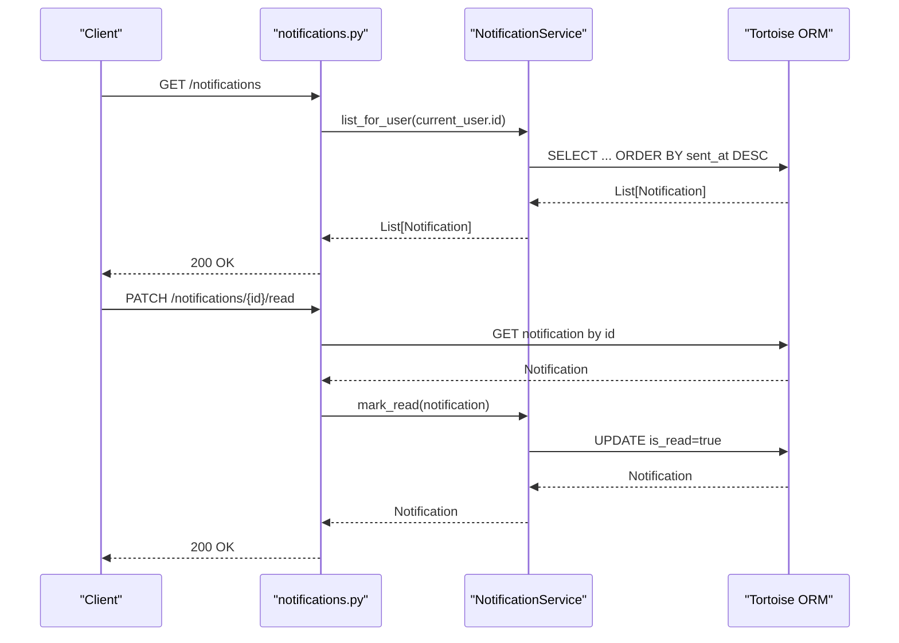
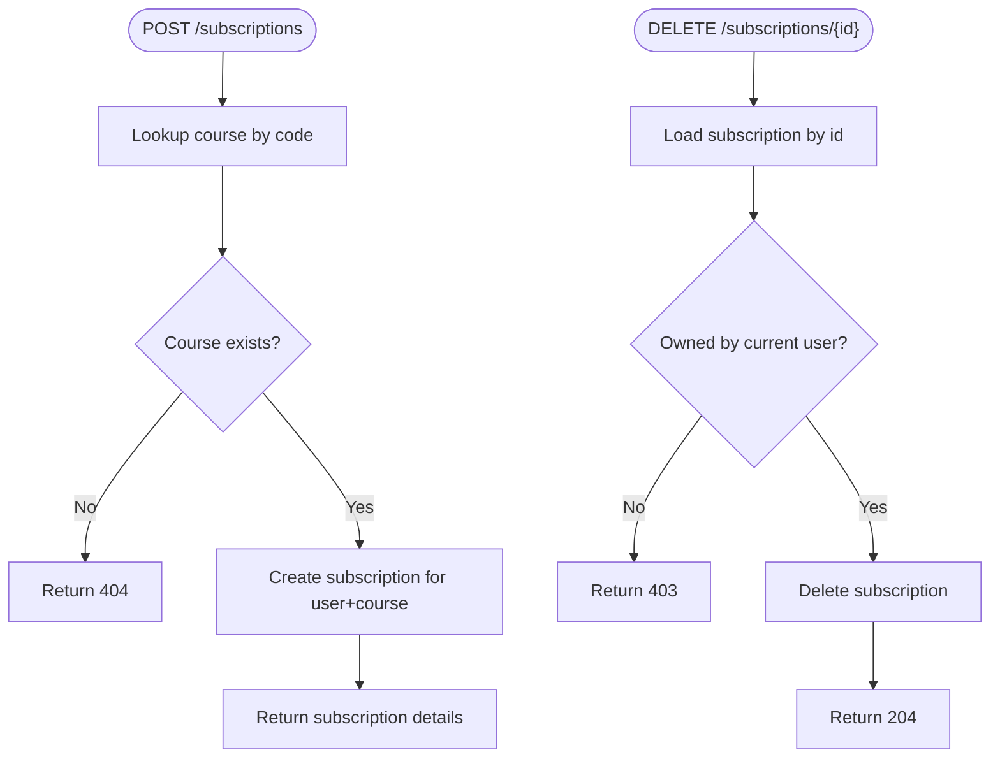
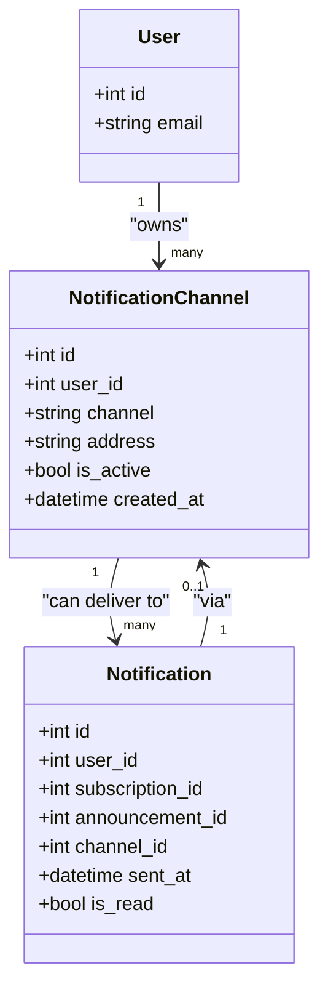
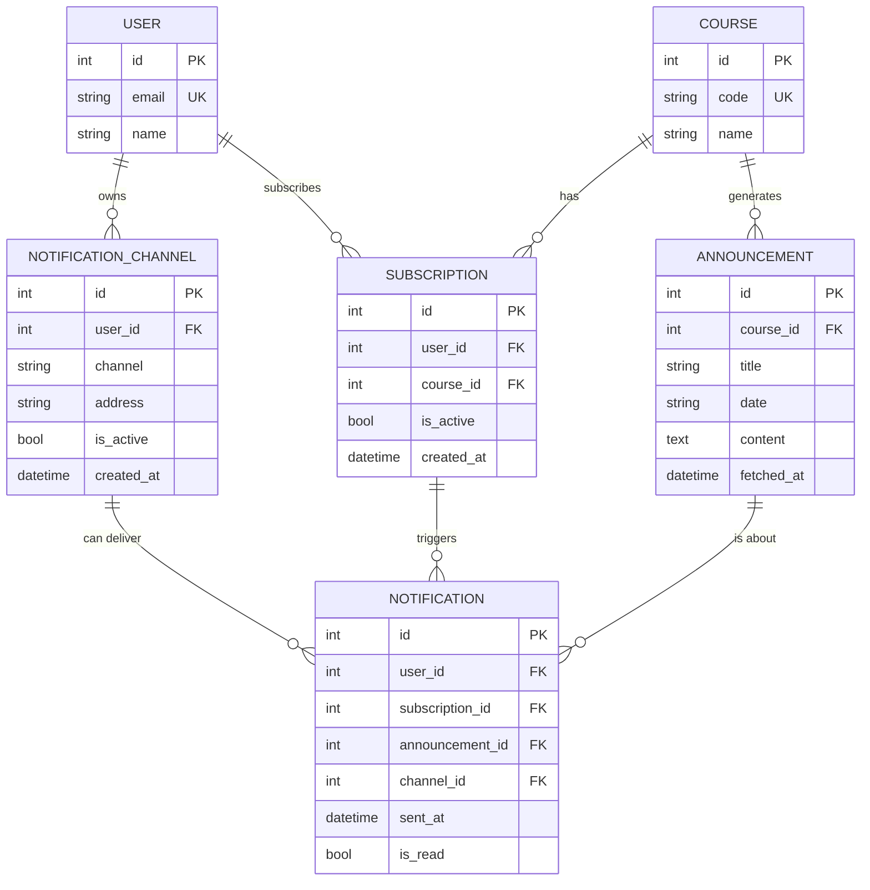
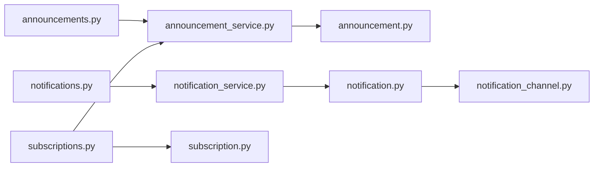

# Announcements & Notifications API

<cite>
**Referenced Files in This Document**
- [app/api/main.py](file://notice-reminders/app/api/main.py)
- [app/api/routers/announcements.py](file://notice-reminders/app/api/routers/announcements.py)
- [app/api/routers/notifications.py](file://notice-reminders/app/api/routers/notifications.py)
- [app/api/routers/subscriptions.py](file://notice-reminders/app/api/routers/subscriptions.py)
- [app/models/announcement.py](file://notice-reminders/app/models/announcement.py)
- [app/schemas/announcement.py](file://notice-reminders/app/schemas/announcement.py)
- [app/models/notification.py](file://notice-reminders/app/models/notification.py)
- [app/schemas/notification.py](file://notice-reminders/app/schemas/notification.py)
- [app/models/notification_channel.py](file://notice-reminders/app/models/notification_channel.py)
- [app/schemas/notification_channel.py](file://notice-reminders/app/schemas/notification_channel.py)
- [app/models/subscription.py](file://notice-reminders/app/models/subscription.py)
- [app/schemas/subscription.py](file://notice-reminders/app/schemas/subscription.py)
- [app/services/announcement_service.py](file://notice-reminders/app/services/announcement_service.py)
- [app/services/notification_service.py](file://notice-reminders/app/services/notification_service.py)
</cite>

## Table of Contents
1. [Introduction](#introduction)
2. [Project Structure](#project-structure)
3. [Core Components](#core-components)
4. [Architecture Overview](#architecture-overview)
5. [Detailed Component Analysis](#detailed-component-analysis)
6. [Dependency Analysis](#dependency-analysis)
7. [Performance Considerations](#performance-considerations)
8. [Troubleshooting Guide](#troubleshooting-guide)
9. [Conclusion](#conclusion)

## Introduction
This document describes the Announcements and Notifications API, focusing on:
- Retrieving course announcements
- Listing and managing notification history
- Real-time notification delivery via channels
- Managing subscriptions to courses
- Notification preferences and channel management
- Announcement parsing and caching
- Notification scheduling and delivery mechanisms
- Webhook endpoints and status tracking
- Error handling for failed deliveries

The backend is a FastAPI application that exposes REST endpoints grouped by feature. Authentication is enforced globally, and data persistence is handled via Tortoise ORM against a relational database.

## Project Structure
The API is organized into routers, models, schemas, services, and core configuration. Routers define endpoint groups, schemas define request/response shapes, models define database entities, and services encapsulate business logic.

**Diagram sources**
- [app/api/routers/announcements.py](file://notice-reminders/app/api/routers/announcements.py#L1-L33)
- [app/api/routers/notifications.py](file://notice-reminders/app/api/routers/notifications.py#L1-L62)
- [app/api/routers/subscriptions.py](file://notice-reminders/app/api/routers/subscriptions.py#L1-L71)
- [app/models/announcement.py](file://notice-reminders/app/models/announcement.py#L1-L25)
- [app/models/notification.py](file://notice-reminders/app/models/notification.py#L1-L37)
- [app/models/notification_channel.py](file://notice-reminders/app/models/notification_channel.py#L1-L26)
- [app/models/subscription.py](file://notice-reminders/app/models/subscription.py#L1-L28)
- [app/services/announcement_service.py](file://notice-reminders/app/services/announcement_service.py#L1-L45)
- [app/services/notification_service.py](file://notice-reminders/app/services/notification_service.py#L1-L31)
- [app/schemas/announcement.py](file://notice-reminders/app/schemas/announcement.py#L1-L16)
- [app/schemas/notification.py](file://notice-reminders/app/schemas/notification.py#L1-L17)
- [app/schemas/notification_channel.py](file://notice-reminders/app/schemas/notification_channel.py#L1-L22)
- [app/schemas/subscription.py](file://notice-reminders/app/schemas/subscription.py#L1-L19)

**Section sources**
- [app/api/main.py](file://notice-reminders/app/api/main.py#L1-L46)

## Core Components
- Announcement retrieval: Fetches and caches announcements per course, deduplicating by course, title, and date.
- Notification history: Lists notifications for a user, supports marking as read.
- Subscription management: Create/list/delete subscriptions to courses.
- Channel management: Store user notification channels (type and address) with activation flag.
- Real-time delivery: Notifications are persisted upon creation; delivery to channels is externalized by the service layer.
- Preferences: Controlled via channel activation and subscription toggles.

Key endpoints:
- GET /courses/{course_code}/announcements
- GET /notifications
- GET /notifications/users/{user_id}
- PATCH /notifications/{notification_id}/read
- POST /subscriptions
- GET /subscriptions
- DELETE /subscriptions/{subscription_id}

**Section sources**
- [app/api/routers/announcements.py](file://notice-reminders/app/api/routers/announcements.py#L1-L33)
- [app/api/routers/notifications.py](file://notice-reminders/app/api/routers/notifications.py#L1-L62)
- [app/api/routers/subscriptions.py](file://notice-reminders/app/api/routers/subscriptions.py#L1-L71)
- [app/services/announcement_service.py](file://notice-reminders/app/services/announcement_service.py#L1-L45)
- [app/services/notification_service.py](file://notice-reminders/app/services/notification_service.py#L1-L31)

## Architecture Overview
The API follows a layered architecture:
- Routers handle HTTP requests, inject dependencies, and enforce authentication.
- Services encapsulate business logic and orchestrate model operations.
- Models define persistence and relationships.
- Schemas define serialization contracts.

**Diagram sources**
- [app/api/routers/announcements.py](file://notice-reminders/app/api/routers/announcements.py#L15-L32)
- [app/services/announcement_service.py](file://notice-reminders/app/services/announcement_service.py#L17-L41)

## Detailed Component Analysis

### Announcements Endpoint
- Path: GET /courses/{course_code}/announcements
- Authentication: Required
- Behavior:
  - Validates course existence by code.
  - Fetches announcements from upstream via service and caches locally.
  - Deduplicates by course, title, and date; updates content if changed.
  - Returns paginated-like list ordered by fetch time.

**Diagram sources**
- [app/api/routers/announcements.py](file://notice-reminders/app/api/routers/announcements.py#L23-L32)
- [app/services/announcement_service.py](file://notice-reminders/app/services/announcement_service.py#L17-L41)

**Section sources**
- [app/api/routers/announcements.py](file://notice-reminders/app/api/routers/announcements.py#L1-L33)
- [app/services/announcement_service.py](file://notice-reminders/app/services/announcement_service.py#L1-L45)
- [app/models/announcement.py](file://notice-reminders/app/models/announcement.py#L1-L25)
- [app/schemas/announcement.py](file://notice-reminders/app/schemas/announcement.py#L1-L16)

### Notifications Endpoint
- Paths:
  - GET /notifications (lists current user’s notifications)
  - GET /notifications/users/{user_id} (admin/self-only access)
  - PATCH /notifications/{notification_id}/read (mark as read)
- Authentication: Required
- Behavior:
  - Listing filters by user and orders by send time descending.
  - Mark-as-read validates ownership and toggles read flag.

**Diagram sources**
- [app/api/routers/notifications.py](file://notice-reminders/app/api/routers/notifications.py#L13-L61)
- [app/services/notification_service.py](file://notice-reminders/app/services/notification_service.py#L21-L30)

**Section sources**
- [app/api/routers/notifications.py](file://notice-reminders/app/api/routers/notifications.py#L1-L62)
- [app/services/notification_service.py](file://notice-reminders/app/services/notification_service.py#L1-L31)
- [app/models/notification.py](file://notice-reminders/app/models/notification.py#L1-L37)
- [app/schemas/notification.py](file://notice-reminders/app/schemas/notification.py#L1-L17)

### Subscriptions Endpoint
- Paths:
  - POST /subscriptions (create subscription)
  - GET /subscriptions (list user subscriptions)
  - DELETE /subscriptions/{subscription_id} (delete subscription)
- Authentication: Required
- Behavior:
  - Create validates course existence by code and creates a subscription.
  - Delete enforces ownership and removes the subscription.

**Diagram sources**
- [app/api/routers/subscriptions.py](file://notice-reminders/app/api/routers/subscriptions.py#L16-L70)

**Section sources**
- [app/api/routers/subscriptions.py](file://notice-reminders/app/api/routers/subscriptions.py#L1-L71)
- [app/models/subscription.py](file://notice-reminders/app/models/subscription.py#L1-L28)
- [app/schemas/subscription.py](file://notice-reminders/app/schemas/subscription.py#L1-L19)

### Notification Channels
- Purpose: Define where notifications are delivered (e.g., email, push).
- Entities:
  - NotificationChannel: stores channel type, address, activation flag, and timestamps.
  - Notification: links a user, subscription, announcement, and optional channel.
- Relationships:
  - One-to-many from User to NotificationChannel.
  - Many-to-one from Notification to NotificationChannel.

**Diagram sources**
- [app/models/notification_channel.py](file://notice-reminders/app/models/notification_channel.py#L1-L26)
- [app/models/notification.py](file://notice-reminders/app/models/notification.py#L1-L37)

**Section sources**
- [app/models/notification_channel.py](file://notice-reminders/app/models/notification_channel.py#L1-L26)
- [app/schemas/notification_channel.py](file://notice-reminders/app/schemas/notification_channel.py#L1-L22)
- [app/models/notification.py](file://notice-reminders/app/models/notification.py#L1-L37)
- [app/schemas/notification.py](file://notice-reminders/app/schemas/notification.py#L1-L17)

### Data Models Overview

**Diagram sources**
- [app/models/announcement.py](file://notice-reminders/app/models/announcement.py#L1-L25)
- [app/models/notification.py](file://notice-reminders/app/models/notification.py#L1-L37)
- [app/models/notification_channel.py](file://notice-reminders/app/models/notification_channel.py#L1-L26)
- [app/models/subscription.py](file://notice-reminders/app/models/subscription.py#L1-L28)
- [app/models/course.py](file://notice-reminders/app/models/course.py)
- [app/models/user.py](file://notice-reminders/app/models/user.py)

## Dependency Analysis
- Routers depend on services via FastAPI Depends and global auth decorator.
- Services depend on models and external integrations (e.g., SwayamService).
- Models define foreign keys and constraints; schemas define serialization.
- No circular dependencies observed among routers and services.

**Diagram sources**
- [app/api/routers/announcements.py](file://notice-reminders/app/api/routers/announcements.py#L1-L33)
- [app/api/routers/notifications.py](file://notice-reminders/app/api/routers/notifications.py#L1-L62)
- [app/api/routers/subscriptions.py](file://notice-reminders/app/api/routers/subscriptions.py#L1-L71)
- [app/services/announcement_service.py](file://notice-reminders/app/services/announcement_service.py#L1-L45)
- [app/services/notification_service.py](file://notice-reminders/app/services/notification_service.py#L1-L31)
- [app/models/announcement.py](file://notice-reminders/app/models/announcement.py#L1-L25)
- [app/models/notification.py](file://notice-reminders/app/models/notification.py#L1-L37)
- [app/models/notification_channel.py](file://notice-reminders/app/models/notification_channel.py#L1-L26)
- [app/models/subscription.py](file://notice-reminders/app/models/subscription.py#L1-L28)

**Section sources**
- [app/api/main.py](file://notice-reminders/app/api/main.py#L17-L42)

## Performance Considerations
- Announcement caching: Deduplication by course, title, and date reduces redundant writes and improves retrieval performance.
- Sorting and pagination: Results are ordered by time; consider adding explicit pagination for large datasets.
- Database constraints: Unique constraints on user-course and channel-address combinations prevent duplicates and support fast lookups.
- Asynchronous operations: Services use async/await; ensure database connection pooling and indexing align with query patterns.

[No sources needed since this section provides general guidance]

## Troubleshooting Guide
Common errors and resolutions:
- Course not found when fetching announcements:
  - Cause: Invalid course code.
  - Resolution: Verify course code; ensure course exists.
- Access denied for notifications:
  - Cause: Attempting to access another user’s notifications.
  - Resolution: Only access your own notifications or have appropriate admin privileges.
- Notification not found:
  - Cause: Invalid notification ID.
  - Resolution: Confirm the notification exists and belongs to the current user.
- Subscription not found or access denied:
  - Cause: Non-existent subscription or unauthorized deletion.
  - Resolution: Check subscription ownership and existence.

Operational checks:
- Ensure authentication is active and tokens are valid.
- Confirm database connectivity and migrations are applied.
- Validate upstream service availability for announcement retrieval.

**Section sources**
- [app/api/routers/announcements.py](file://notice-reminders/app/api/routers/announcements.py#L23-L32)
- [app/api/routers/notifications.py](file://notice-reminders/app/api/routers/notifications.py#L30-L61)
- [app/api/routers/subscriptions.py](file://notice-reminders/app/api/routers/subscriptions.py#L54-L70)

## Conclusion
The Announcements and Notifications API provides a robust foundation for retrieving course notices, managing subscriptions, and tracking notification history. It supports channel-based delivery and includes strong data models for deduplication and integrity. Extending the system to include webhooks, scheduled delivery, and delivery status tracking would complete the real-time notification lifecycle.