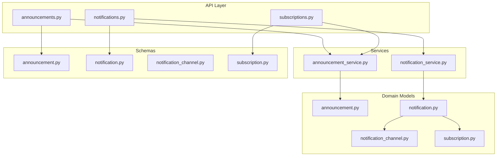
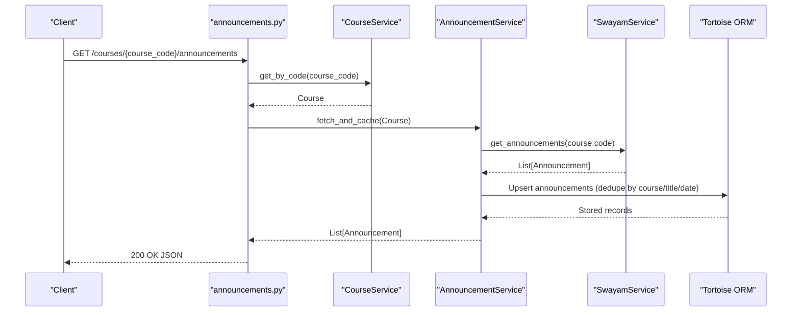
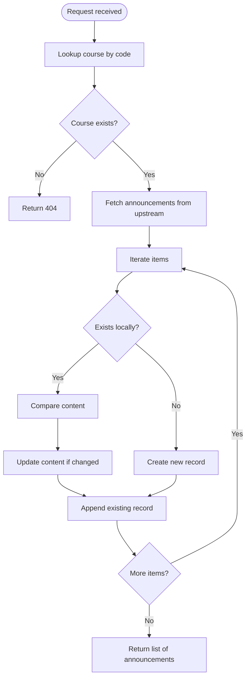
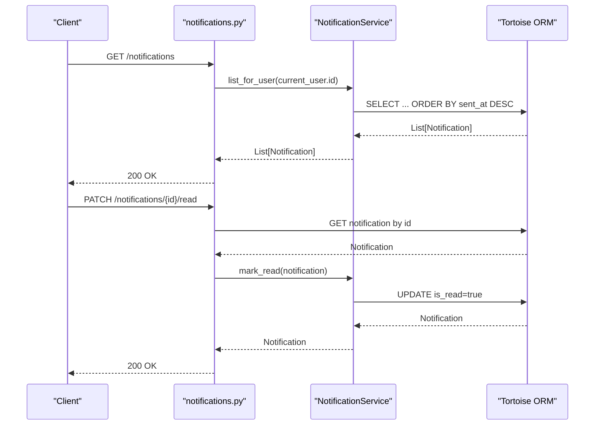
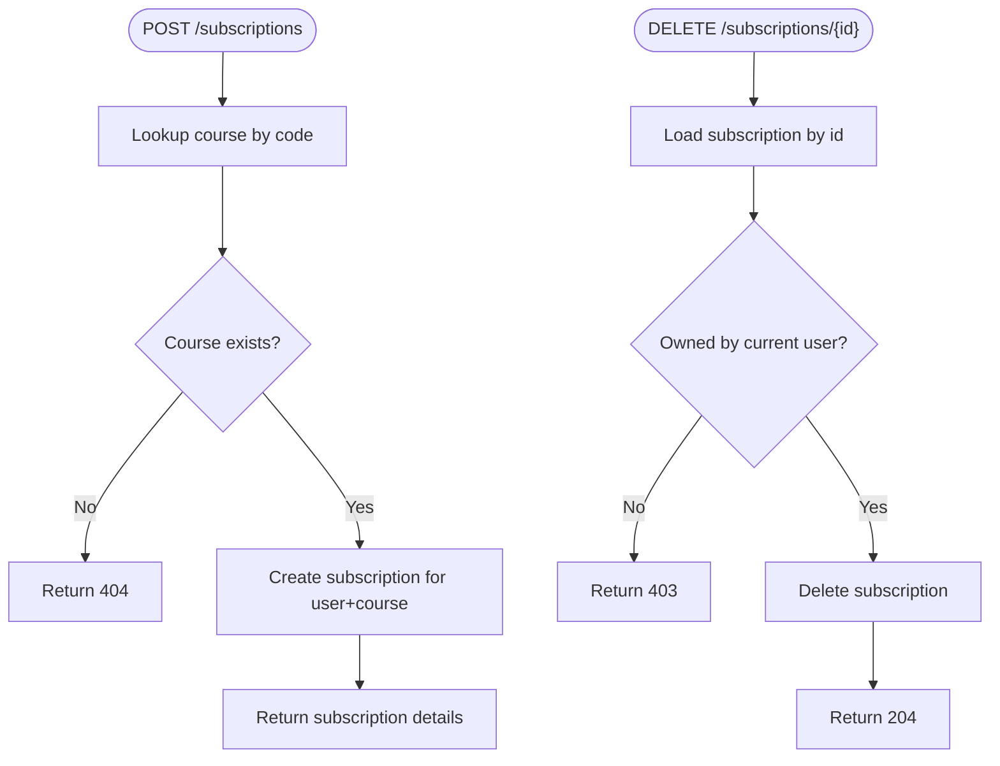
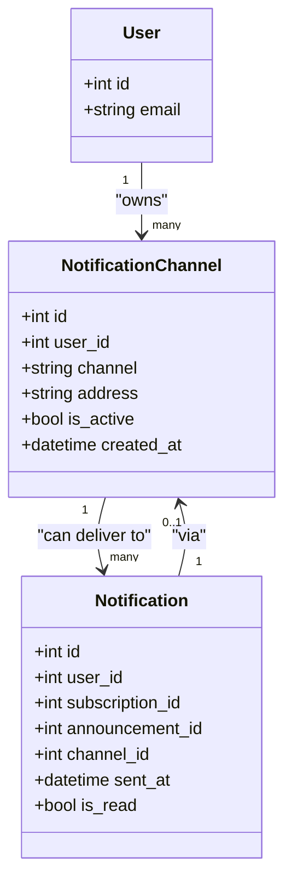
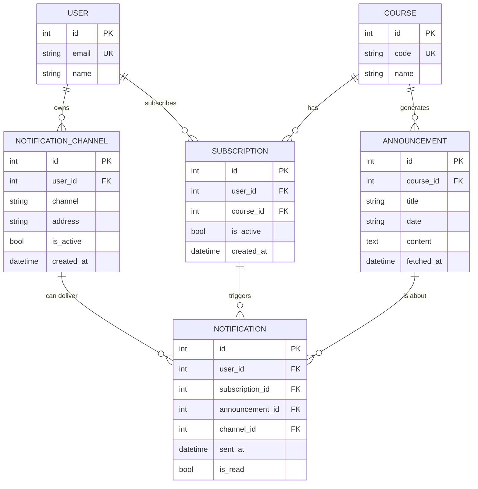
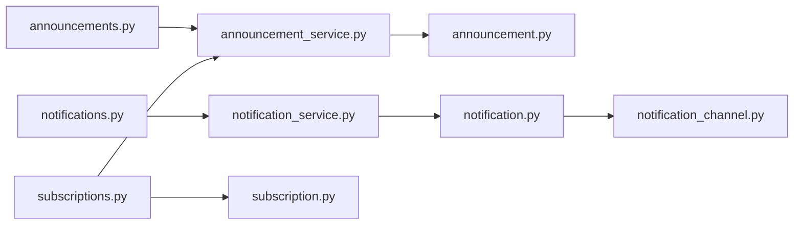

# Announcements & notifications API

## Introduction
This page describes the Announcements and Notifications API, focusing on:
- Retrieving course announcements
- Listing and managing notification history
- Real-time notification delivery via channels
- Managing subscriptions to courses
- Notification preferences and channel management
- Announcement parsing and caching
- Notification scheduling and delivery mechanisms
- Webhook endpoints and status tracking
- Error handling for failed deliveries

The backend is a FastAPI application that exposes REST endpoints grouped by feature. Authentication is enforced globally, and data persistence is handled via Tortoise ORM against a relational database.

## Project structure
The API is organized into routers, models, schemas, services, and core configuration. Routers define endpoint groups, schemas define request/response shapes, models define database entities, and services encapsulate business logic.

```mermaid
graph TB
subgraph "API Layer"
A["announcements.py"]
B["notifications.py"]
C["subscriptions.py"]
end
subgraph "Domain Models"
M1["announcement.py"]
M2["notification.py"]
M3["notification_channel.py"]
M4["subscription.py"]
end
subgraph "Services"
S1["announcement_service.py"]
S2["notification_service.py"]
end
subgraph "Schemas"
D1["announcement.py"]
D2["notification.py"]
D3["notification_channel.py"]
D4["subscription.py"]
end
A --> S1
B --> S2
C --> S1
S1 --> M1
S2 --> M2
M2 --> M3
M2 --> M4
A --> D1
B --> D2
C --> D4
```

## Core components
- Announcement retrieval: Fetches and caches announcements per course, deduplicating by course, title, and date.
- Notification history: Lists notifications for a user, supports marking as read.
- Subscription management: Create/list/delete subscriptions to courses.
- Channel management: Store user notification channels (type and address) with activation flag.
- Real-time delivery: Notifications are persisted upon creation; delivery to channels is externalized by the service layer.
- Preferences: Controlled via channel activation and subscription toggles.

Key endpoints:
- GET /courses/{course_code}/announcements
- GET /notifications
- GET /notifications/users/{user_id}
- PATCH /notifications/{notification_id}/read
- POST /subscriptions
- GET /subscriptions
- DELETE /subscriptions/{subscription_id}

## Architecture overview
The API follows a layered architecture:
- Routers handle HTTP requests, inject dependencies, and enforce authentication.
- Services encapsulate business logic and orchestrate model operations.
- Models define persistence and relationships.
- Schemas define serialization contracts.

```mermaid
sequenceDiagram
participant Client as "Client"
participant Router as "announcements.py"
participant CourseSvc as "CourseService"
participant AnnSvc as "AnnouncementService"
participant Swayam as "SwayamService"
participant DB as "Tortoise ORM"
Client->>Router : GET /courses/{course_code}/announcements
Router->>CourseSvc : get_by_code(course_code)
CourseSvc-->>Router : Course
Router->>AnnSvc : fetch_and_cache(Course)
AnnSvc->>Swayam : get_announcements(course.code)
Swayam-->>AnnSvc : List[Announcement]
AnnSvc->>DB : Upsert announcements (dedupe by course/title/date)
DB-->>AnnSvc : Stored records
AnnSvc-->>Router : List[Announcement]
Router-->>Client : 200 OK JSON
```

## Detailed component analysis

### Announcements endpoint
- Path: GET /courses/{course_code}/announcements
- Authentication: Required
- Behavior:
  - Validates course existence by code.
  - Fetches announcements from upstream via service and caches locally.
  - Deduplicates by course, title, and date; updates content if changed.
  - Returns paginated-like list ordered by fetch time.

```mermaid
flowchart TD
Start(["Request received"]) --> GetCourse["Lookup course by code"]
GetCourse --> Found{"Course exists?"}
Found --> |No| NotFound["Return 404"]
Found --> |Yes| Fetch["Fetch announcements from upstream"]
Fetch --> UpsertLoop["Iterate items"]
UpsertLoop --> Exists{"Exists locally?"}
Exists --> |Yes| Compare["Compare content"]
Compare --> Update["Update content if changed"]
Update --> Append["Append existing record"]
Exists --> |No| Create["Create new record"]
Create --> Append
Append --> Next{"More items?"}
Next --> |Yes| UpsertLoop
Next --> |No| Return["Return list of announcements"]
```

### Notifications endpoint
- Paths:
  - GET /notifications (lists current user's notifications)
  - GET /notifications/users/{user_id} (admin/self-only access)
  - PATCH /notifications/{notification_id}/read (mark as read)
- Authentication: Required
- Behavior:
  - Listing filters by user and orders by send time descending.
  - Mark-as-read validates ownership and toggles read flag.

```mermaid
sequenceDiagram
participant Client as "Client"
participant Router as "notifications.py"
participant Service as "NotificationService"
participant DB as "Tortoise ORM"
Client->>Router : GET /notifications
Router->>Service : list_for_user(current_user.id)
Service->>DB : SELECT ... ORDER BY sent_at DESC
DB-->>Service : List[Notification]
Service-->>Router : List[Notification]
Router-->>Client : 200 OK
Client->>Router : PATCH /notifications/{id}/read
Router->>DB : GET notification by id
DB-->>Router : Notification
Router->>Service : mark_read(notification)
Service->>DB : UPDATE is_read=true
DB-->>Service : Notification
Service-->>Router : Notification
Router-->>Client : 200 OK
```

### Subscriptions endpoint
- Paths:
  - POST /subscriptions (create subscription)
  - GET /subscriptions (list user subscriptions)
  - DELETE /subscriptions/{subscription_id} (delete subscription)
- Authentication: Required
- Behavior:
  - Create validates course existence by code and creates a subscription.
  - Delete enforces ownership and removes the subscription.

```mermaid
flowchart TD
Start(["POST /subscriptions"]) --> Validate["Lookup course by code"]
Validate --> Found{"Course exists?"}
Found --> |No| Err404["Return 404"]
Found --> |Yes| Subscribe["Create subscription for user+course"]
Subscribe --> Return["Return subscription details"]
DelStart(["DELETE /subscriptions/{id}"]) --> Load["Load subscription by id"]
Load --> Owned{"Owned by current user?"}
Owned --> |No| Err403["Return 403"]
Owned --> |Yes| Remove["Delete subscription"]
Remove --> Done["Return 204"]
```

### Notification channels
- Purpose: Define where notifications are delivered (e.g., email, push).
- Entities:
  - NotificationChannel: stores channel type, address, activation flag, and timestamps.
  - Notification: links a user, subscription, announcement, and optional channel.
- Relationships:
  - One-to-many from User to NotificationChannel.
  - Many-to-one from Notification to NotificationChannel.

```mermaid
classDiagram
class User {
+int id
+string email
}
class NotificationChannel {
+int id
+int user_id
+string channel
+string address
+bool is_active
+datetime created_at
}
class Notification {
+int id
+int user_id
+int subscription_id
+int announcement_id
+int channel_id
+datetime sent_at
+bool is_read
}
User "1" --> "many" NotificationChannel : "owns"
NotificationChannel "1" --> "many" Notification : "can deliver to"
Notification "1" --> "0..1" NotificationChannel : "via"
```

### Data models overview

```mermaid
erDiagram
COURSE {
int id PK
string code UK
string name
}
USER {
int id PK
string email UK
string name
}
SUBSCRIPTION {
int id PK
int user_id FK
int course_id FK
bool is_active
datetime created_at
}
ANNOUNCEMENT {
int id PK
int course_id FK
string title
string date
text content
datetime fetched_at
}
NOTIFICATION_CHANNEL {
int id PK
int user_id FK
string channel
string address
bool is_active
datetime created_at
}
NOTIFICATION {
int id PK
int user_id FK
int subscription_id FK
int announcement_id FK
int channel_id FK
datetime sent_at
bool is_read
}
USER ||--o{ SUBSCRIPTION : "subscribes"
COURSE ||--o{ SUBSCRIPTION : "has"
COURSE ||--o{ ANNOUNCEMENT : "generates"
USER ||--o{ NOTIFICATION_CHANNEL : "owns"
NOTIFICATION_CHANNEL ||--o{ NOTIFICATION : "can deliver"
SUBSCRIPTION ||--o{ NOTIFICATION : "triggers"
ANNOUNCEMENT ||--o{ NOTIFICATION : "is about"
```

## Dependency analysis
- Routers depend on services via FastAPI Depends and global auth decorator.
- Services depend on models and external integrations (e.g., SwayamService).
- Models define foreign keys and constraints; schemas define serialization.
- No circular dependencies observed among routers and services.

```mermaid
graph LR
AnnRouter["announcements.py"] --> AnnSvc["announcement_service.py"]
NotiRouter["notifications.py"] --> NotiSvc["notification_service.py"]
SubRouter["subscriptions.py"] --> AnnSvc
AnnSvc --> AnnModel["announcement.py"]
NotiSvc --> NotiModel["notification.py"]
NotiModel --> ChanModel["notification_channel.py"]
SubRouter --> SubModel["subscription.py"]
```

## Performance considerations
- Announcement caching: Deduplication by course, title, and date reduces redundant writes and improves retrieval performance.
- Sorting and pagination: Results are ordered by time; consider adding explicit pagination for large datasets.
- Database constraints: Unique constraints on user-course and channel-address combinations prevent duplicates and support fast lookups.
- Asynchronous operations: Services use async/await; ensure database connection pooling and indexing align with query patterns.

[No sources needed since this section provides general guidance]

## Troubleshooting guide
Common errors and resolutions:
- Course not found when fetching announcements:
  - Cause: Invalid course code.
  - Resolution: Verify course code; ensure course exists.
- Access denied for notifications:
  - Cause: Attempting to access another user's notifications.
  - Resolution: Only access your own notifications or have appropriate admin privileges.
- Notification not found:
  - Cause: Invalid notification ID.
  - Resolution: Confirm the notification exists and belongs to the current user.
- Subscription not found or access denied:
  - Cause: Non-existent subscription or unauthorized deletion.
  - Resolution: Check subscription ownership and existence.

Operational checks:
- Ensure authentication is active and tokens are valid.
- Confirm database connectivity and migrations are applied.
- Validate upstream service availability for announcement retrieval.

## Conclusion
The Announcements and Notifications API provides a reliable foundation for retrieving course notices, managing subscriptions, and tracking notification history. It supports channel-based delivery and includes strong data models for deduplication and integrity. Extending the system to include webhooks, scheduled delivery, and delivery status tracking would complete the real-time notification lifecycle.
