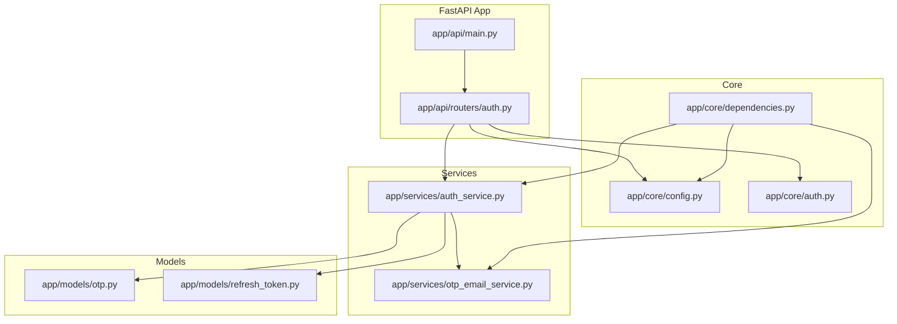
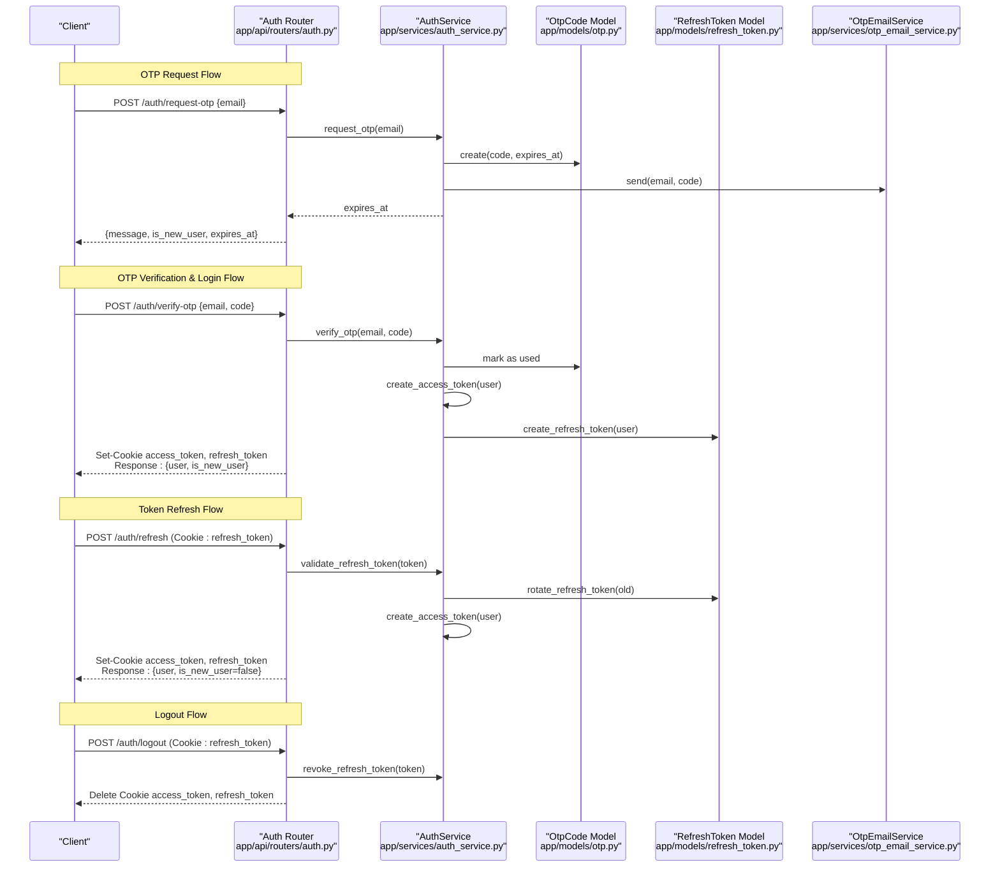
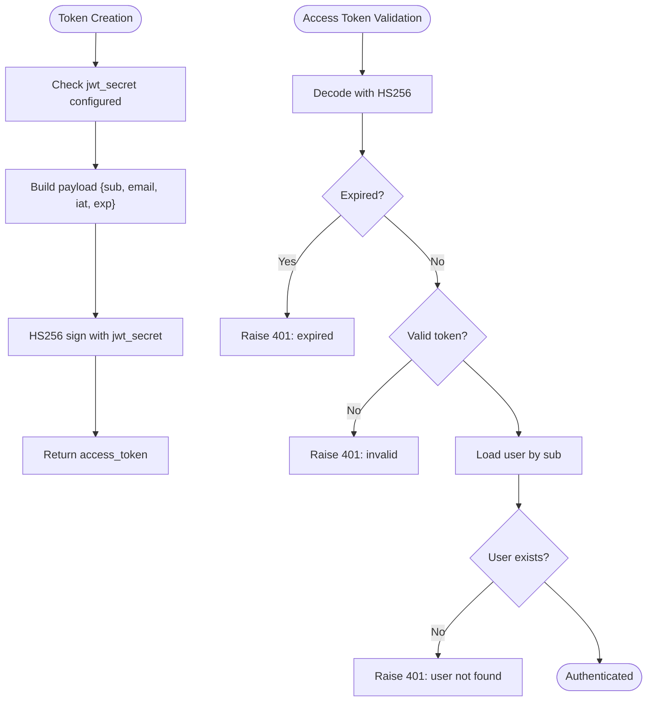
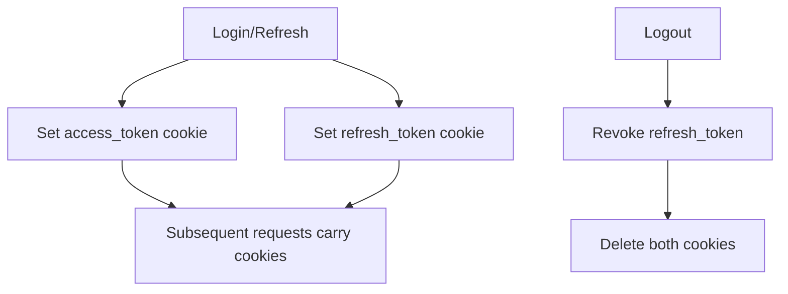
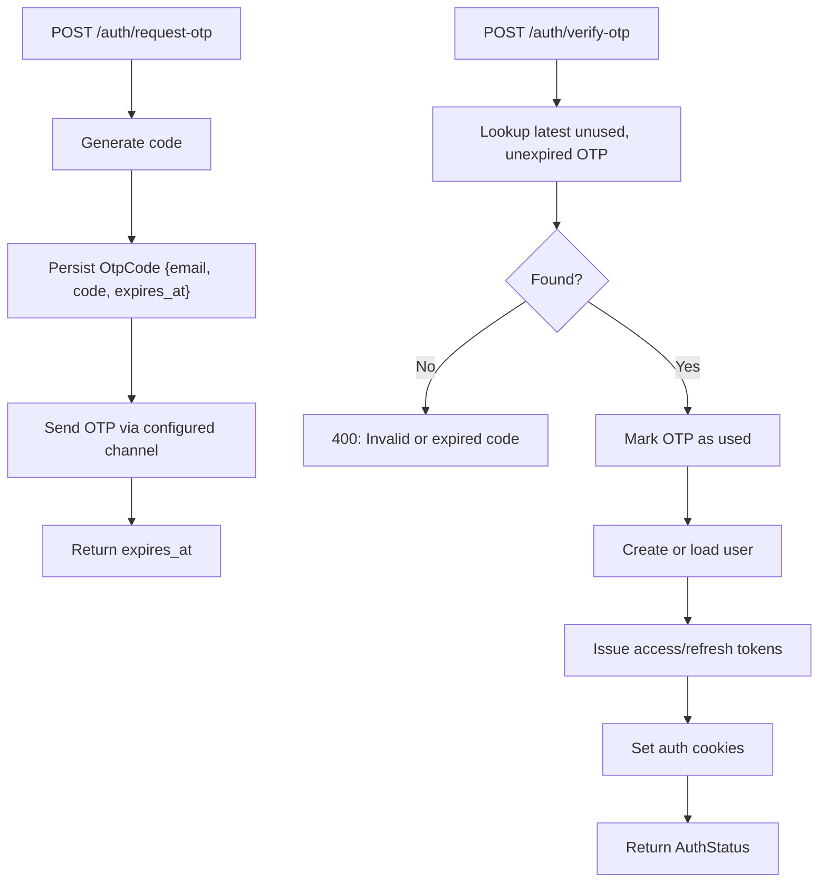
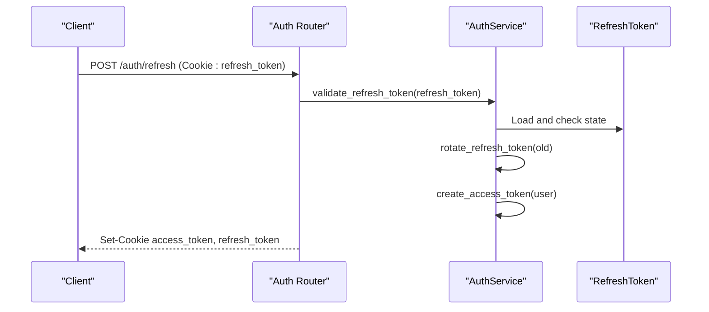
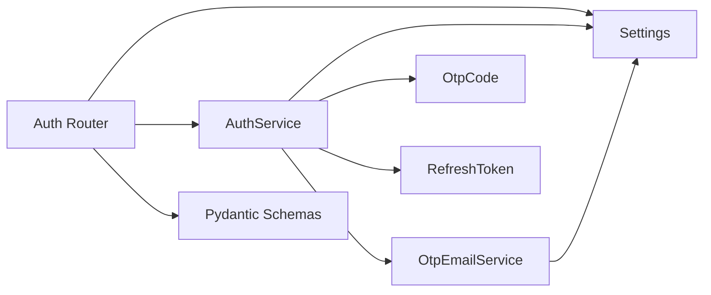

# Authentication API

<cite>
**Referenced Files in This Document**
- [app/api/main.py](file://notice-reminders/app/api/main.py)
- [app/api/routers/auth.py](file://notice-reminders/app/api/routers/auth.py)
- [app/schemas/auth.py](file://notice-reminders/app/schemas/auth.py)
- [app/core/auth.py](file://notice-reminders/app/core/auth.py)
- [app/core/config.py](file://notice-reminders/app/core/config.py)
- [app/core/dependencies.py](file://notice-reminders/app/core/dependencies.py)
- [app/services/auth_service.py](file://notice-reminders/app/services/auth_service.py)
- [app/services/otp_email_service.py](file://notice-reminders/app/services/otp_email_service.py)
- [app/models/otp.py](file://notice-reminders/app/models/otp.py)
- [app/models/refresh_token.py](file://notice-reminders/app/models/refresh_token.py)
</cite>

## Table of Contents
1. [Introduction](#introduction)
2. [Project Structure](#project-structure)
3. [Core Components](#core-components)
4. [Architecture Overview](#architecture-overview)
5. [Detailed Component Analysis](#detailed-component-analysis)
6. [Dependency Analysis](#dependency-analysis)
7. [Performance Considerations](#performance-considerations)
8. [Troubleshooting Guide](#troubleshooting-guide)
9. [Conclusion](#conclusion)
10. [Appendices](#appendices)

## Introduction
This document provides comprehensive API documentation for the authentication endpoints, covering OTP-based login, token refresh, logout, and user identity retrieval. It explains JWT token generation and validation, session management via cookies, and security considerations. It also documents request/response schemas, error handling, and practical integration patterns for client applications.

## Project Structure
The authentication subsystem is implemented in a FastAPI application with a dedicated router for authentication endpoints. Supporting components include:
- Configuration and dependency injection
- Token and OTP persistence models
- Services for OTP delivery and authentication operations
- Middleware for CORS and cookie-based session handling

**Diagram sources**
- [app/api/main.py](file://notice-reminders/app/api/main.py#L17-L42)
- [app/api/routers/auth.py](file://notice-reminders/app/api/routers/auth.py#L1-L126)
- [app/core/config.py](file://notice-reminders/app/core/config.py#L4-L32)
- [app/core/dependencies.py](file://notice-reminders/app/core/dependencies.py#L70-L75)
- [app/services/auth_service.py](file://notice-reminders/app/services/auth_service.py#L17-L128)
- [app/services/otp_email_service.py](file://notice-reminders/app/services/otp_email_service.py#L7-L43)
- [app/models/otp.py](file://notice-reminders/app/models/otp.py#L7-L19)
- [app/models/refresh_token.py](file://notice-reminders/app/models/refresh_token.py#L7-L23)

**Section sources**
- [app/api/main.py](file://notice-reminders/app/api/main.py#L1-L46)
- [app/api/routers/auth.py](file://notice-reminders/app/api/routers/auth.py#L1-L126)

## Core Components
- Authentication router: Exposes endpoints for OTP request, OTP verification, token refresh, logout, and retrieving the current user.
- Authentication service: Implements OTP lifecycle, JWT access/refresh token creation and validation, refresh token rotation and revocation.
- Token and OTP models: Persist OTP codes and refresh tokens with expiry and usage tracking.
- Auth middleware: Extracts access tokens from cookies, validates them, and injects the current user into protected routes.
- Configuration and dependencies: Centralized settings and dependency factories for services and settings.

Key responsibilities:
- OTP request: Generates a random code, persists it with expiry, and sends it via configured channel.
- OTP verification: Validates code and expiry, marks code as used, creates or retrieves user, issues access and refresh tokens, and sets cookies.
- Token refresh: Accepts a refresh cookie, validates and rotates the token, issues new tokens, and updates cookies.
- Logout: Revokes refresh token if present and clears auth cookies.
- Protected routes: Access tokens are validated automatically via middleware.

**Section sources**
- [app/api/routers/auth.py](file://notice-reminders/app/api/routers/auth.py#L12-L126)
- [app/services/auth_service.py](file://notice-reminders/app/services/auth_service.py#L17-L128)
- [app/models/otp.py](file://notice-reminders/app/models/otp.py#L7-L19)
- [app/models/refresh_token.py](file://notice-reminders/app/models/refresh_token.py#L7-L23)
- [app/core/auth.py](file://notice-reminders/app/core/auth.py#L14-L72)
- [app/core/config.py](file://notice-reminders/app/core/config.py#L22-L27)
- [app/core/dependencies.py](file://notice-reminders/app/core/dependencies.py#L70-L75)

## Architecture Overview
The authentication flow integrates FastAPI routing, Tortoise ORM-backed persistence, and JWT-based tokenization. The client interacts with the API using cookies for session management.

**Diagram sources**
- [app/api/routers/auth.py](file://notice-reminders/app/api/routers/auth.py#L43-L121)
- [app/services/auth_service.py](file://notice-reminders/app/services/auth_service.py#L22-L121)
- [app/models/otp.py](file://notice-reminders/app/models/otp.py#L7-L19)
- [app/models/refresh_token.py](file://notice-reminders/app/models/refresh_token.py#L7-L23)
- [app/services/otp_email_service.py](file://notice-reminders/app/services/otp_email_service.py#L11-L42)

## Detailed Component Analysis

### Authentication Endpoints
- POST /auth/request-otp
  - Purpose: Request an OTP for the given email address.
  - Request body: OtpRequest { email }
  - Response: OtpRequestResponse { message, is_new_user, expires_at }
  - Behavior: Creates an OTP record with expiry and sends it via configured channel.
  - Security: Rate limiting and input validation are recommended at the application boundary.

- POST /auth/verify-otp
  - Purpose: Verify the OTP and log in the user.
  - Request body: OtpVerify { email, code }
  - Response: AuthStatus { user, is_new_user }
  - Cookies set: access_token, refresh_token
  - Behavior: Validates OTP, marks as used, creates or retrieves user, issues tokens, and sets cookies.

- POST /auth/refresh
  - Purpose: Refresh access and refresh tokens using a valid refresh token.
  - Request: Cookie refresh_token
  - Response: AuthStatus { user, is_new_user=false }
  - Cookies set: access_token, refresh_token
  - Behavior: Validates refresh token, rotates it, issues new tokens, and sets cookies.

- POST /auth/logout
  - Purpose: Log out the user by revoking the refresh token and clearing cookies.
  - Request: Cookie refresh_token
  - Response: 204 No Content
  - Behavior: Revokes refresh token if present and deletes both auth cookies.

- GET /auth/me
  - Purpose: Retrieve currently authenticated user.
  - Response: UserResponse
  - Behavior: Requires a valid access token cookie; otherwise returns 401.

**Section sources**
- [app/api/routers/auth.py](file://notice-reminders/app/api/routers/auth.py#L43-L126)
- [app/schemas/auth.py](file://notice-reminders/app/schemas/auth.py#L8-L26)

### Request/Response Schemas
- OtpRequest
  - email: string (validated as email)
- OtpVerify
  - email: string (validated as email)
  - code: string
- OtpRequestResponse
  - message: string
  - is_new_user: boolean
  - expires_at: datetime
- AuthStatus
  - user: UserResponse
  - is_new_user: boolean

Notes:
- Validation is handled by Pydantic models; invalid payloads will produce structured errors.
- UserResponse is derived from persisted user model and returned after login or refresh.

**Section sources**
- [app/schemas/auth.py](file://notice-reminders/app/schemas/auth.py#L8-L26)

### JWT Token Generation and Validation
- Access token payload includes subject (user ID), email, issued-at, and expiry.
- Refresh token is a cryptographically random token stored with expiry and revocation flag.
- Both tokens are signed with HS256 using a secret from settings.

**Diagram sources**
- [app/services/auth_service.py](file://notice-reminders/app/services/auth_service.py#L61-L79)
- [app/core/auth.py](file://notice-reminders/app/core/auth.py#L14-L51)

**Section sources**
- [app/services/auth_service.py](file://notice-reminders/app/services/auth_service.py#L61-L79)
- [app/core/auth.py](file://notice-reminders/app/core/auth.py#L14-L51)

### Session Management and Cookies
- Access token cookie: HttpOnly, SameSite=Lax, path=/, secure unless debug.
- Refresh token cookie: HttpOnly, SameSite=Lax, path=/, secure unless debug.
- Cookies are set during login and refresh; cleared on logout.
- Settings control cookie lifetimes and security flags.

**Diagram sources**
- [app/api/routers/auth.py](file://notice-reminders/app/api/routers/auth.py#L15-L41)
- [app/api/routers/auth.py](file://notice-reminders/app/api/routers/auth.py#L109-L121)

**Section sources**
- [app/api/routers/auth.py](file://notice-reminders/app/api/routers/auth.py#L15-L41)
- [app/api/routers/auth.py](file://notice-reminders/app/api/routers/auth.py#L109-L121)

### Authentication Middleware and Protected Routes
- get_current_user extracts access_token from cookies, validates it, and loads the user.
- require_auth decorator injects current_user into route handlers when present.
- Unauthorized responses are returned for missing/invalid/expired tokens.

**Section sources**
- [app/core/auth.py](file://notice-reminders/app/core/auth.py#L14-L72)

### OTP-Based Authentication Flow
- Request OTP: Store OTP with expiry and send via configured channel.
- Verify OTP: Validate against database constraints, mark used, create or retrieve user, issue tokens, and set cookies.
- Expiry and uniqueness: OTP records prevent reuse and enforce time limits.

**Diagram sources**
- [app/services/auth_service.py](file://notice-reminders/app/services/auth_service.py#L22-L59)
- [app/models/otp.py](file://notice-reminders/app/models/otp.py#L7-L19)

**Section sources**
- [app/services/auth_service.py](file://notice-reminders/app/services/auth_service.py#L22-L59)
- [app/models/otp.py](file://notice-reminders/app/models/otp.py#L7-L19)

### Token Refresh Flow
- Validate refresh token existence and state (not revoked, not expired).
- Rotate refresh token by marking old as revoked and issuing a new one.
- Issue new access token and update cookies.

**Diagram sources**
- [app/api/routers/auth.py](file://notice-reminders/app/api/routers/auth.py#L78-L107)
- [app/services/auth_service.py](file://notice-reminders/app/services/auth_service.py#L96-L113)

**Section sources**
- [app/api/routers/auth.py](file://notice-reminders/app/api/routers/auth.py#L78-L107)
- [app/services/auth_service.py](file://notice-reminders/app/services/auth_service.py#L96-L113)

### Logout and Token Revocation
- On logout, the refresh token is revoked (marked as revoked) if present.
- Access and refresh cookies are deleted.

**Section sources**
- [app/api/routers/auth.py](file://notice-reminders/app/api/routers/auth.py#L109-L121)
- [app/services/auth_service.py](file://notice-reminders/app/services/auth_service.py#L115-L121)

## Dependency Analysis
- Router depends on:
  - Settings for cookie lifetimes and security flags
  - AuthService for OTP, token, and user operations
  - Pydantic schemas for request/response validation
- AuthService depends on:
  - Settings for token/OTP configuration
  - OtpCode and RefreshToken models for persistence
  - OtpEmailService for OTP delivery
- OtpEmailService depends on Settings for SMTP configuration or console output.

**Diagram sources**
- [app/api/routers/auth.py](file://notice-reminders/app/api/routers/auth.py#L1-L126)
- [app/core/dependencies.py](file://notice-reminders/app/core/dependencies.py#L70-L75)
- [app/services/auth_service.py](file://notice-reminders/app/services/auth_service.py#L17-L21)
- [app/services/otp_email_service.py](file://notice-reminders/app/services/otp_email_service.py#L7-L10)

**Section sources**
- [app/api/routers/auth.py](file://notice-reminders/app/api/routers/auth.py#L1-L126)
- [app/core/dependencies.py](file://notice-reminders/app/core/dependencies.py#L70-L75)
- [app/services/auth_service.py](file://notice-reminders/app/services/auth_service.py#L17-L21)
- [app/services/otp_email_service.py](file://notice-reminders/app/services/otp_email_service.py#L7-L10)

## Performance Considerations
- Token lifetimes: Access tokens are short-lived; refresh tokens are longer-lived but rotated on each refresh.
- Database queries: OTP lookup filters by email, code, expiry, and usage; ensure appropriate indexing on OTP table.
- Cookie security: Secure flags depend on debug mode; in production, cookies should be secure and same-site policies should be enforced.
- Email delivery: Console delivery is suitable for development; SMTP requires proper credentials and network configuration.

[No sources needed since this section provides general guidance]

## Troubleshooting Guide
Common errors and resolutions:
- 400 Bad Request on OTP verification: Occurs when OTP is invalid, expired, or already used.
- 401 Unauthorized on protected routes: Missing, invalid, or expired access token.
- 401 Unauthorized on refresh: Missing or invalid refresh token, revoked token, or expired token.
- 401 Unauthorized on logout: Provided refresh token not found or already revoked.
- Missing SMTP configuration: OTP delivery via SMTP fails if required settings are not provided.

Operational checks:
- Confirm jwt_secret is set in environment.
- Verify OTP delivery method and SMTP settings if using email.
- Ensure database migrations are applied for OTP and refresh token tables.

**Section sources**
- [app/services/auth_service.py](file://notice-reminders/app/services/auth_service.py#L48-L49)
- [app/core/auth.py](file://notice-reminders/app/core/auth.py#L18-L51)
- [app/services/auth_service.py](file://notice-reminders/app/services/auth_service.py#L104-L113)
- [app/services/otp_email_service.py](file://notice-reminders/app/services/otp_email_service.py#L16-L25)

## Conclusion
The authentication subsystem provides a robust, cookie-based session mechanism using JWT tokens. It supports OTP-based login, seamless token refresh, and secure logout. Clients should manage cookies automatically and handle 401 responses by prompting re-authentication. Administrators should configure secrets and delivery channels appropriately for production.

[No sources needed since this section summarizes without analyzing specific files]

## Appendices

### Endpoint Reference

- POST /auth/request-otp
  - Request: OtpRequest { email }
  - Response: OtpRequestResponse { message, is_new_user, expires_at }

- POST /auth/verify-otp
  - Request: OtpVerify { email, code }
  - Response: AuthStatus { user, is_new_user }
  - Cookies: access_token, refresh_token

- POST /auth/refresh
  - Request: Cookie refresh_token
  - Response: AuthStatus { user, is_new_user=false }
  - Cookies: access_token, refresh_token

- POST /auth/logout
  - Request: Cookie refresh_token
  - Response: 204 No Content
  - Side effect: Deletes access_token and refresh_token cookies

- GET /auth/me
  - Response: UserResponse
  - Requires: access_token cookie

**Section sources**
- [app/api/routers/auth.py](file://notice-reminders/app/api/routers/auth.py#L43-L126)
- [app/schemas/auth.py](file://notice-reminders/app/schemas/auth.py#L8-L26)

### Configuration Options
- jwt_secret: Required for signing tokens
- jwt_access_token_expire_minutes: Access token lifetime
- jwt_refresh_token_expire_days: Refresh token lifetime
- otp_expire_minutes: OTP validity window
- otp_delivery: "console" or "smtp"
- smtp_*: SMTP credentials for OTP emails
- cors_origins: Allowed origins for CORS

**Section sources**
- [app/core/config.py](file://notice-reminders/app/core/config.py#L22-L27)
- [app/services/otp_email_service.py](file://notice-reminders/app/services/otp_email_service.py#L11-L42)

### Integration Patterns
- Frontend:
  - Submit email to /auth/request-otp.
  - Prompt user for OTP; submit to /auth/verify-otp.
  - Store cookies automatically; send subsequent requests with credentials.
  - On token expiry, call /auth/refresh using existing refresh_token cookie.
  - On logout, call /auth/logout and clear local state.
- Backend:
  - Use get_current_user dependency for protected endpoints.
  - Respect require_auth decorator for route protection.
  - Configure Settings for secrets and delivery preferences.

**Section sources**
- [app/core/auth.py](file://notice-reminders/app/core/auth.py#L14-L72)
- [app/api/routers/auth.py](file://notice-reminders/app/api/routers/auth.py#L123-L126)