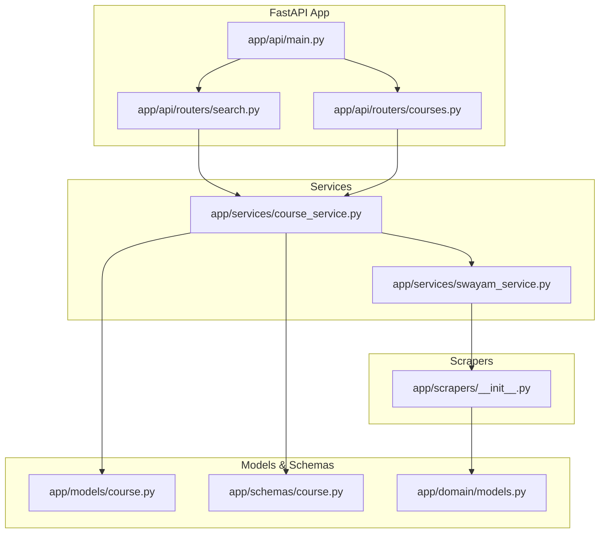
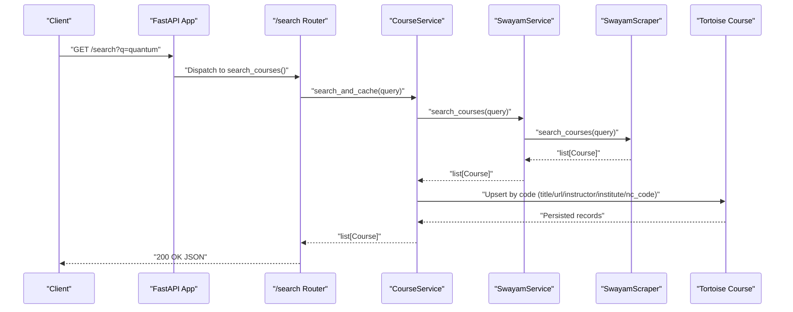
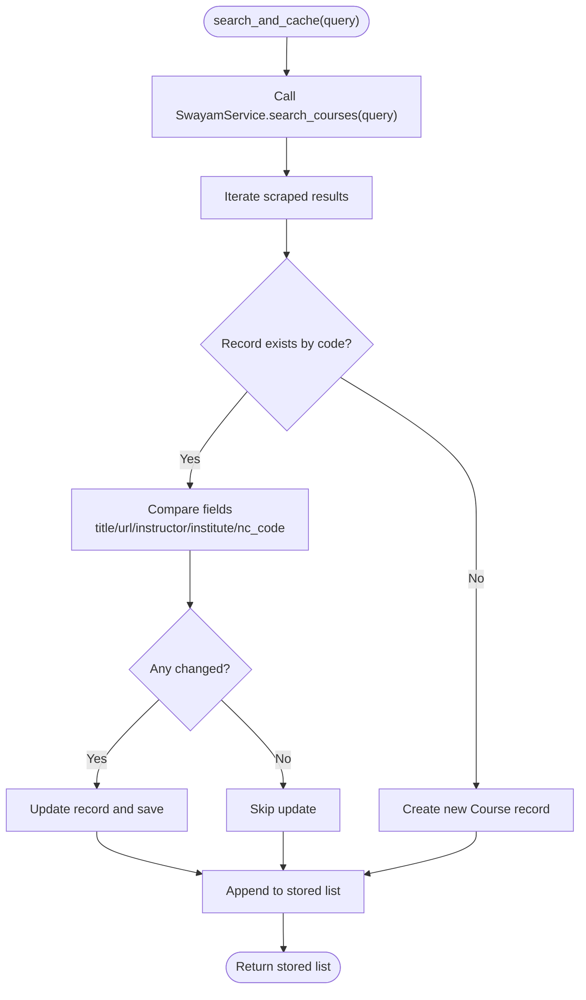
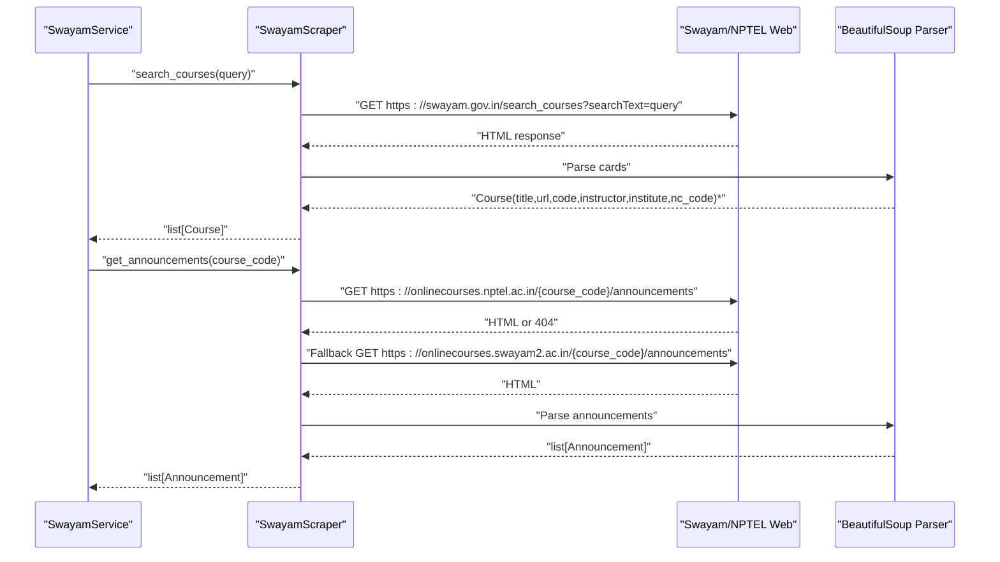
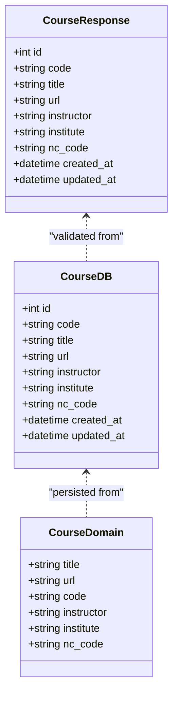
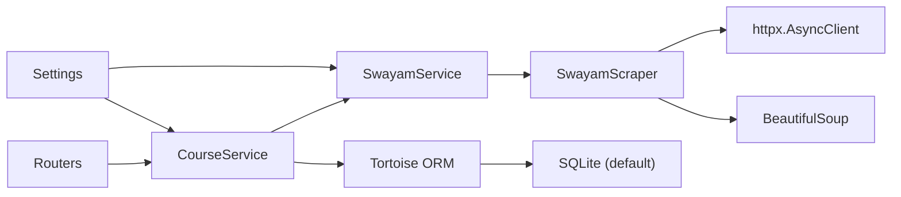

# Course Search API

<cite>
**Referenced Files in This Document**
- [main.py](file://notice-reminders/app/api/main.py)
- [search.py](file://notice-reminders/app/api/routers/search.py)
- [courses.py](file://notice-reminders/app/api/routers/courses.py)
- [course_service.py](file://notice-reminders/app/services/course_service.py)
- [swayam_service.py](file://notice-reminders/app/services/swayam_service.py)
- [scrapers/__init__.py](file://notice-reminders/app/scrapers/__init__.py)
- [models/course.py](file://notice-reminders/app/models/course.py)
- [schemas/course.py](file://notice-reminders/app/schemas/course.py)
- [domain/models.py](file://notice-reminders/app/domain/models.py)
- [config.py](file://notice-reminders/app/core/config.py)
</cite>

## Table of Contents
1. [Introduction](#introduction)
2. [Project Structure](#project-structure)
3. [Core Components](#core-components)
4. [Architecture Overview](#architecture-overview)
5. [Detailed Component Analysis](#detailed-component-analysis)
6. [Dependency Analysis](#dependency-analysis)
7. [Performance Considerations](#performance-considerations)
8. [Troubleshooting Guide](#troubleshooting-guide)
9. [Conclusion](#conclusion)
10. [Appendices](#appendices)

## Introduction
This document provides comprehensive API documentation for course discovery and search endpoints. It covers:
- Course search by keyword
- Course listing and details retrieval
- Course platform integration endpoints for Swayam and NPTEL
- Search algorithms, filtering criteria, sorting options, and result formatting
- Data synchronization and caching strategies
- Examples of search queries, filter combinations, and response structures

The backend is a FastAPI application exposing REST endpoints for search and course management, backed by a database and asynchronous scrapers for Swayam/NPTEL.

## Project Structure
The course search API is implemented in the notice-reminders backend module. Key areas:
- API routers define endpoints under /search and /courses
- Services encapsulate business logic for search, caching, and platform integrations
- Scrapers handle web scraping for course listings and announcements
- Pydantic models define request/response schemas
- Tortoise ORM models represent persisted course records
- Domain models describe scraped entities

**Diagram sources**
- [main.py](file://notice-reminders/app/api/main.py#L17-L42)
- [search.py](file://notice-reminders/app/api/routers/search.py#L1-L17)
- [courses.py](file://notice-reminders/app/api/routers/courses.py#L1-L32)
- [course_service.py](file://notice-reminders/app/services/course_service.py#L1-L66)
- [swayam_service.py](file://notice-reminders/app/services/swayam_service.py#L1-L25)
- [scrapers/__init__.py](file://notice-reminders/app/scrapers/__init__.py#L1-L170)
- [models/course.py](file://notice-reminders/app/models/course.py#L1-L22)
- [schemas/course.py](file://notice-reminders/app/schemas/course.py#L1-L19)
- [domain/models.py](file://notice-reminders/app/domain/models.py#L1-L34)

**Section sources**
- [main.py](file://notice-reminders/app/api/main.py#L17-L42)
- [search.py](file://notice-reminders/app/api/routers/search.py#L1-L17)
- [courses.py](file://notice-reminders/app/api/routers/courses.py#L1-L32)

## Core Components
- FastAPI application factory registers CORS, database, and routers
- Search endpoint: GET /search?q={query}
- Course listing endpoint: GET /courses
- Course details endpoint: GET /courses/{course_code}
- CourseService orchestrates search, caching, listing, and recent updates
- SwayamService wraps SwayamScraper for course search and announcements
- SwayamScraper performs asynchronous HTTP requests and parses HTML
- Pydantic CourseResponse defines the JSON shape returned by endpoints
- Tortoise Course model persists course metadata
- Domain Course and Announcement models represent scraped data

Key behaviors:
- Search endpoint delegates to CourseService.search_and_cache, which fetches results from SwayamService and synchronizes them into the local database
- Course listing returns all courses ordered by title
- Course details returns a single course by unique code or 404
- Recently updated courses are filtered by a configurable cache TTL window

**Section sources**
- [course_service.py](file://notice-reminders/app/services/course_service.py#L17-L66)
- [swayam_service.py](file://notice-reminders/app/services/swayam_service.py#L18-L24)
- [scrapers/__init__.py](file://notice-reminders/app/scrapers/__init__.py#L38-L101)
- [schemas/course.py](file://notice-reminders/app/schemas/course.py#L6-L19)
- [models/course.py](file://notice-reminders/app/models/course.py#L7-L22)
- [domain/models.py](file://notice-reminders/app/domain/models.py#L7-L33)

## Architecture Overview
The API follows a layered architecture:
- Routers expose HTTP endpoints
- Services encapsulate domain logic and orchestrate external integrations
- Scrapers handle platform-specific data extraction
- Persistence via Tortoise ORM
- Validation via Pydantic schemas

**Diagram sources**
- [main.py](file://notice-reminders/app/api/main.py#L29-L35)
- [search.py](file://notice-reminders/app/api/routers/search.py#L10-L16)
- [course_service.py](file://notice-reminders/app/services/course_service.py#L17-L53)
- [swayam_service.py](file://notice-reminders/app/services/swayam_service.py#L18-L20)
- [scrapers/__init__.py](file://notice-reminders/app/scrapers/__init__.py#L38-L101)
- [models/course.py](file://notice-reminders/app/models/course.py#L7-L22)

## Detailed Component Analysis

### API Endpoints

#### GET /search
- Purpose: Search courses by keyword
- Query parameters:
  - q (required): Search string passed to the scraper
- Response: Array of CourseResponse objects
- Behavior:
  - Calls CourseService.search_and_cache
  - Returns validated CourseResponse entries

Example request:
- GET /search?q=physics

Response structure:
- Array of objects with fields: id, code, title, url, instructor, institute, nc_code, created_at, updated_at

Notes:
- Sorting is not applied by the endpoint; ordering depends on the underlying service and database
- Pagination is not supported in this endpoint

**Section sources**
- [search.py](file://notice-reminders/app/api/routers/search.py#L10-L16)
- [course_service.py](file://notice-reminders/app/services/course_service.py#L17-L53)
- [schemas/course.py](file://notice-reminders/app/schemas/course.py#L6-L19)

#### GET /courses
- Purpose: List all courses
- Query parameters: None
- Response: Array of CourseResponse objects
- Behavior:
  - Returns all courses ordered by title ascending
  - Uses CourseService.list_courses

Example request:
- GET /courses

Response structure:
- Same as /search

**Section sources**
- [courses.py](file://notice-reminders/app/api/routers/courses.py#L10-L15)
- [course_service.py](file://notice-reminders/app/services/course_service.py#L55-L56)
- [schemas/course.py](file://notice-reminders/app/schemas/course.py#L6-L19)

#### GET /courses/{course_code}
- Purpose: Retrieve course details by unique code
- Path parameters:
  - course_code (required): Unique course identifier
- Response: Single CourseResponse object
- Behavior:
  - Returns 404 if not found

Example request:
- GET /courses/123xyz

Response structure:
- Same as above

**Section sources**
- [courses.py](file://notice-reminders/app/api/routers/courses.py#L18-L31)
- [course_service.py](file://notice-reminders/app/services/course_service.py#L58-L59)
- [schemas/course.py](file://notice-reminders/app/schemas/course.py#L6-L19)

### CourseService
Responsibilities:
- search_and_cache(query): Fetches results from SwayamService, upserts into database, and returns persisted records
- list_courses(): Returns all courses ordered by title
- get_by_code(course_code): Retrieves a course by unique code
- get_recently_updated(): Returns courses updated within a configured TTL window

Caching and synchronization:
- Upsert logic compares and updates only changed fields: title, url, instructor, institute, nc_code
- TTL window for recently updated filtering is controlled by cache_ttl_minutes setting

**Diagram sources**
- [course_service.py](file://notice-reminders/app/services/course_service.py#L17-L53)

**Section sources**
- [course_service.py](file://notice-reminders/app/services/course_service.py#L11-L66)

### SwayamService
Responsibilities:
- Delegates course search to SwayamScraper
- Provides announcements retrieval for NPTEL/Swayam2 course codes

Integration details:
- Uses SwayamScraper.search_courses for course listings
- Uses SwayamScraper.get_announcements for announcements

**Section sources**
- [swayam_service.py](file://notice-reminders/app/services/swayam_service.py#L10-L25)

### SwayamScraper
Responsibilities:
- Asynchronously fetches and parses course listings from Swayam
- Parses announcements from NPTEL or Swayam2 URLs
- Applies robust parsing for dates and content

Search algorithm highlights:
- Constructs URL with query parameter searchText
- Parses HTML cards to extract title, URL, code, instructor, institute, and national coordinator code
- Extracts course code from preview URL pattern
- Returns a list of domain Course objects

Announcements parsing highlights:
- Attempts NPTEL base URL; falls back to Swayam2 if 404
- Parses titles, dates (including JavaScript timestamps), and content paragraphs

**Diagram sources**
- [swayam_service.py](file://notice-reminders/app/services/swayam_service.py#L18-L24)
- [scrapers/__init__.py](file://notice-reminders/app/scrapers/__init__.py#L38-L117)

**Section sources**
- [scrapers/__init__.py](file://notice-reminders/app/scrapers/__init__.py#L14-L170)

### Data Models and Schemas
- Domain models (dataclasses):
  - Course: title, url, code, instructor, institute, nc_code
  - Announcement: title, date, content
- Database model (Tortoise):
  - Course: id, code(unique,index), title, url, instructor, institute, nc_code, created_at, updated_at
- Pydantic response schema:
  - CourseResponse: id, code, title, url, instructor, institute, nc_code, created_at, updated_at

**Diagram sources**
- [domain/models.py](file://notice-reminders/app/domain/models.py#L7-L33)
- [models/course.py](file://notice-reminders/app/models/course.py#L7-L22)
- [schemas/course.py](file://notice-reminders/app/schemas/course.py#L6-L19)

**Section sources**
- [domain/models.py](file://notice-reminders/app/domain/models.py#L7-L33)
- [models/course.py](file://notice-reminders/app/models/course.py#L7-L22)
- [schemas/course.py](file://notice-reminders/app/schemas/course.py#L6-L19)

### Filtering, Sorting, and Pagination
- Filtering:
  - No explicit filters are exposed by the current endpoints
  - Filtering can be implemented at the service level (e.g., by instructor, institute, or nc_code) by extending CourseService and adding router parameters
- Sorting:
  - /courses endpoint sorts by title ascending
  - /search endpoint does not apply sorting; order depends on upstream results
- Pagination:
  - Not implemented in current endpoints
  - Can be added by introducing limit/offset parameters and updating CourseService methods

Recommendations:
- Add query parameters for filters (e.g., instructor, institute, nc_code) and pagination (limit, offset)
- Apply consistent sorting defaults and allow optional sort fields

**Section sources**
- [courses.py](file://notice-reminders/app/api/routers/courses.py#L10-L15)
- [course_service.py](file://notice-reminders/app/services/course_service.py#L55-L56)

### Platform Integration: Swayam and NPTEL
- Swayam:
  - Course search via SwayamScraper.search_courses
  - Course code extracted from preview URL pattern
- NPTEL:
  - Announcements retrieval via SwayamScraper.get_announcements
  - Falls back to Swayam2 domain if NPTEL URL returns 404
- Configuration:
  - Base URLs for Swayam and NPTEL are defined in Settings
  - Cache TTL for recently updated filtering is configurable

**Section sources**
- [scrapers/__init__.py](file://notice-reminders/app/scrapers/__init__.py#L18-L117)
- [config.py](file://notice-reminders/app/core/config.py#L9-L12)

### Result Formatting
- All endpoints return JSON arrays for lists and single objects for details
- CourseResponse mirrors the database model fields for consistency
- Datetime fields are serialized by Pydantic’s from_attributes support

**Section sources**
- [schemas/course.py](file://notice-reminders/app/schemas/course.py#L6-L19)
- [models/course.py](file://notice-reminders/app/models/course.py#L7-L22)

## Dependency Analysis
External dependencies and integration points:
- HTTP client: httpx for asynchronous requests
- HTML parsing: BeautifulSoup for structured extraction
- Database ORM: Tortoise ORM for persistence
- Configuration: Pydantic Settings for environment-driven configuration

**Diagram sources**
- [main.py](file://notice-reminders/app/api/main.py#L17-L42)
- [course_service.py](file://notice-reminders/app/services/course_service.py#L13-L15)
- [swayam_service.py](file://notice-reminders/app/services/swayam_service.py#L14-L16)
- [scrapers/__init__.py](file://notice-reminders/app/scrapers/__init__.py#L7-L36)
- [config.py](file://notice-reminders/app/core/config.py#L4-L32)

**Section sources**
- [main.py](file://notice-reminders/app/api/main.py#L1-L46)
- [config.py](file://notice-reminders/app/core/config.py#L1-L32)

## Performance Considerations
- Asynchronous scraping: httpx and BeautifulSoup enable concurrent fetching and parsing
- Database upsert: Field-level comparison minimizes unnecessary writes
- Sorting: Single-field ordering reduces CPU overhead
- Caching:
  - Recently updated filtering uses a time window to limit result set size
  - Consider adding Redis or in-memory cache for frequent search terms
- Pagination: Introduce limit/offset to bound response sizes
- Concurrency: Scale workers behind ASGI server for higher throughput

[No sources needed since this section provides general guidance]

## Troubleshooting Guide
Common issues and resolutions:
- 404 Not Found on /courses/{course_code}:
  - The requested course code does not exist in the database
  - Verify the code and ensure search_and_cache was executed
- Empty results from /search:
  - Query may not match Swayam listings
  - Try alternate keywords or check platform availability
- Unexpected empty announcements:
  - NPTEL URL may require fallback to Swayam2
  - Confirm course_code correctness and network connectivity
- Slow responses:
  - Increase concurrency or introduce caching for popular queries
  - Monitor database write operations during upsert

**Section sources**
- [courses.py](file://notice-reminders/app/api/routers/courses.py#L25-L29)
- [scrapers/__init__.py](file://notice-reminders/app/scrapers/__init__.py#L103-L117)

## Conclusion
The Course Search API provides a clean, extensible foundation for discovering and retrieving course information from Swayam and NPTEL. Current capabilities include keyword search, listing, and details retrieval with robust scraping and local caching. Future enhancements should focus on filtering, pagination, and improved caching strategies to scale performance and usability.

[No sources needed since this section summarizes without analyzing specific files]

## Appendices

### API Reference Summary
- GET /search?q={query}
  - Returns: Array of CourseResponse
  - Notes: No pagination or sorting enforced
- GET /courses
  - Returns: Array of CourseResponse sorted by title
- GET /courses/{course_code}
  - Returns: Single CourseResponse or 404

Response fields:
- id, code, title, url, instructor, institute, nc_code, created_at, updated_at

**Section sources**
- [search.py](file://notice-reminders/app/api/routers/search.py#L10-L16)
- [courses.py](file://notice-reminders/app/api/routers/courses.py#L10-L31)
- [schemas/course.py](file://notice-reminders/app/schemas/course.py#L6-L19)