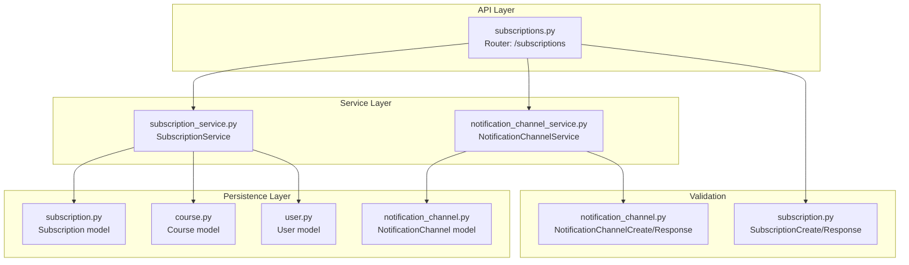
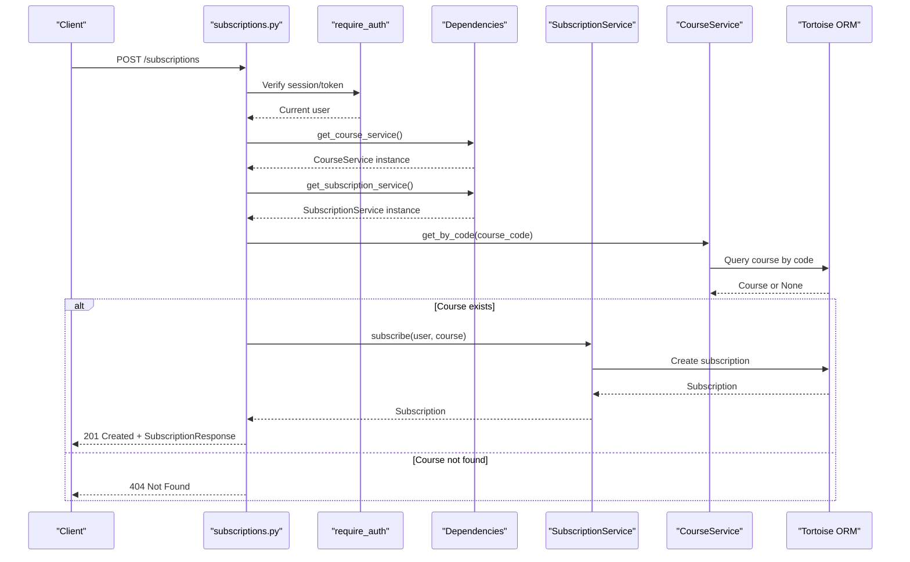
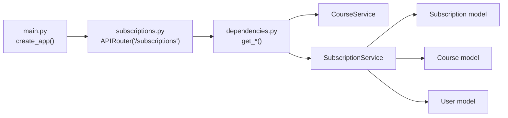

# Subscriptions Management API

<cite>
**Referenced Files in This Document**
- [subscriptions.py](file://notice-reminders/app/api/routers/subscriptions.py)
- [subscription_service.py](file://notice-reminders/app/services/subscription_service.py)
- [subscription.py](file://notice-reminders/app/models/subscription.py)
- [subscription.py](file://notice-reminders/app/schemas/subscription.py)
- [course.py](file://notice-reminders/app/models/course.py)
- [user.py](file://notice-reminders/app/models/user.py)
- [dependencies.py](file://notice-reminders/app/core/dependencies.py)
- [main.py](file://notice-reminders/app/api/main.py)
- [notification_channel.py](file://notice-reminders/app/models/notification_channel.py)
- [notification_channel_service.py](file://notice-reminders/app/services/notification_channel_service.py)
- [notification_channel.py](file://notice-reminders/app/schemas/notification_channel.py)
- [announcements.py](file://notice-reminders/app/api/routers/announcements.py)
- [announcement_service.py](file://notice-reminders/app/services/announcement_service.py)
</cite>

## Table of Contents
1. [Introduction](#introduction)
2. [Project Structure](#project-structure)
3. [Core Components](#core-components)
4. [Architecture Overview](#architecture-overview)
5. [Detailed Component Analysis](#detailed-component-analysis)
6. [Dependency Analysis](#dependency-analysis)
7. [Performance Considerations](#performance-considerations)
8. [Troubleshooting Guide](#troubleshooting-guide)
9. [Conclusion](#conclusion)

## Introduction
This document provides comprehensive API documentation for subscription management endpoints within the notice-reminders system. It covers CRUD operations for course subscriptions, subscription preferences, and notification settings. It explains subscription validation, duplicate prevention, status management, lifecycle handling, automatic renewal behavior, cancellation procedures, analytics, usage tracking, and preference-based filtering. The documentation includes endpoint definitions, request/response schemas, error handling, and practical workflows for creating, modifying, and deleting subscriptions.

## Project Structure
The subscription management feature is implemented in the notice-reminders backend (FastAPI application). Key components include:
- API router exposing subscription endpoints
- Service layer implementing subscription logic
- Pydantic schemas for request/response validation
- Tortoise ORM models for persistence
- Dependencies for service injection
- Related notification channel models and services

**Diagram sources**
- [subscriptions.py](file://notice-reminders/app/api/routers/subscriptions.py#L1-L71)
- [subscription_service.py](file://notice-reminders/app/services/subscription_service.py#L1-L23)
- [subscription.py](file://notice-reminders/app/models/subscription.py#L1-L28)
- [course.py](file://notice-reminders/app/models/course.py#L1-L22)
- [user.py](file://notice-reminders/app/models/user.py#L1-L20)
- [notification_channel.py](file://notice-reminders/app/models/notification_channel.py#L1-L26)
- [subscription.py](file://notice-reminders/app/schemas/subscription.py#L1-L19)
- [notification_channel.py](file://notice-reminders/app/schemas/notification_channel.py#L1-L22)

**Section sources**
- [subscriptions.py](file://notice-reminders/app/api/routers/subscriptions.py#L1-L71)
- [subscription_service.py](file://notice-reminders/app/services/subscription_service.py#L1-L23)
- [subscription.py](file://notice-reminders/app/models/subscription.py#L1-L28)
- [course.py](file://notice-reminders/app/models/course.py#L1-L22)
- [user.py](file://notice-reminders/app/models/user.py#L1-L20)
- [notification_channel.py](file://notice-reminders/app/models/notification_channel.py#L1-L26)
- [subscription.py](file://notice-reminders/app/schemas/subscription.py#L1-L19)
- [notification_channel.py](file://notice-reminders/app/schemas/notification_channel.py#L1-L22)
- [dependencies.py](file://notice-reminders/app/core/dependencies.py#L1-L75)
- [main.py](file://notice-reminders/app/api/main.py#L1-L46)

## Core Components
- Subscription API Router: Exposes endpoints for creating, listing, and deleting subscriptions under /subscriptions.
- Subscription Service: Implements subscription logic including duplicate prevention and retrieval.
- Subscription Model: Defines the subscription entity with foreign keys to User and Course, timestamps, and activation flag.
- Course Model: Provides course metadata and uniqueness constraints.
- User Model: Identifies users and supports authentication-dependent operations.
- Notification Channel Models and Services: Manage user notification preferences and channels.

Key capabilities:
- Create subscription via course code with duplicate prevention
- List subscriptions per user
- Delete subscription with ownership verification
- Manage notification channels and preferences
- Announcements caching and retrieval for course subscriptions

**Section sources**
- [subscriptions.py](file://notice-reminders/app/api/routers/subscriptions.py#L16-L71)
- [subscription_service.py](file://notice-reminders/app/services/subscription_service.py#L8-L23)
- [subscription.py](file://notice-reminders/app/models/subscription.py#L12-L28)
- [course.py](file://notice-reminders/app/models/course.py#L7-L22)
- [user.py](file://notice-reminders/app/models/user.py#L7-L20)
- [notification_channel.py](file://notice-reminders/app/models/notification_channel.py#L11-L26)
- [notification_channel_service.py](file://notice-reminders/app/services/notification_channel_service.py#L7-L32)

## Architecture Overview
The subscription management architecture follows a layered pattern:
- API Router handles HTTP requests and injects services via FastAPI Depends
- Service layer encapsulates business logic and interacts with models
- Persistence layer uses Tortoise ORM with unique constraints to prevent duplicates
- Authentication middleware ensures only authenticated users can access subscription endpoints

**Diagram sources**
- [subscriptions.py](file://notice-reminders/app/api/routers/subscriptions.py#L16-L34)
- [dependencies.py](file://notice-reminders/app/core/dependencies.py#L28-L35)
- [subscription_service.py](file://notice-reminders/app/services/subscription_service.py#L9-L13)
- [course.py](file://notice-reminders/app/models/course.py#L10-L10)

## Detailed Component Analysis

### Subscription Endpoints
- Base path: /subscriptions
- Authentication: All endpoints require authentication via require_auth decorator

Endpoints:
- POST /subscriptions
  - Purpose: Create a subscription for a course by code
  - Request body: SubscriptionCreate (course_code)
  - Response: SubscriptionResponse (id, user_id, course_id, is_active, created_at)
  - Status codes: 201 Created, 404 Not Found (course missing)
  - Validation: Course existence checked before subscription creation

- GET /subscriptions
  - Purpose: List all subscriptions for the authenticated user
  - Response: Array of SubscriptionResponse
  - Status codes: 200 OK

- DELETE /subscriptions/{subscription_id}
  - Purpose: Cancel a subscription
  - Path parameter: subscription_id (int)
  - Response: No content (204)
  - Status codes: 404 Not Found (subscription missing), 403 Forbidden (access denied)

Authorization and ownership checks:
- DELETE endpoint verifies that the subscription belongs to the current user before deletion

**Section sources**
- [subscriptions.py](file://notice-reminders/app/api/routers/subscriptions.py#L16-L71)

### Subscription Service
Responsibilities:
- subscribe(user, course): Creates a subscription; if a duplicate exists (unique constraint), returns the existing subscription
- list_for_user(user): Retrieves all subscriptions for a user ordered by creation time
- list_all(): Retrieves all subscriptions ordered by creation time
- delete(subscription): Removes a subscription

Duplicate prevention:
- Uses database unique constraint on (user, course) enforced by Tortoise model definition
- On IntegrityError during creation, retrieves the existing subscription

Status management:
- Subscription records include is_active flag; service does not toggle it on create/delete

**Section sources**
- [subscription_service.py](file://notice-reminders/app/services/subscription_service.py#L8-L23)
- [subscription.py](file://notice-reminders/app/models/subscription.py#L27-L27)

### Data Models and Schemas
Models:
- Subscription: Links User and Course, tracks creation time, and activation status
- Course: Course metadata with unique code
- User: User identity with optional Telegram ID and activity flag
- NotificationChannel: User notification preferences with channel/address and activation

Schemas:
- SubscriptionCreate: course_code
- SubscriptionResponse: id, user_id, course_id, is_active, created_at
- NotificationChannelCreate: channel, address, is_active
- NotificationChannelResponse: id, user_id, channel, address, is_active, created_at

Unique constraints:
- Subscription: unique_together (user, course)
- Course: unique code
- NotificationChannel: unique_together (user, channel, address)

**Section sources**
- [subscription.py](file://notice-reminders/app/models/subscription.py#L12-L28)
- [course.py](file://notice-reminders/app/models/course.py#L7-L22)
- [user.py](file://notice-reminders/app/models/user.py#L7-L20)
- [notification_channel.py](file://notice-reminders/app/models/notification_channel.py#L11-L26)
- [subscription.py](file://notice-reminders/app/schemas/subscription.py#L6-L19)
- [notification_channel.py](file://notice-reminders/app/schemas/notification_channel.py#L6-L22)

### Notification Preferences and Channels
Endpoints:
- GET /notification-channels (conceptual, see service usage below)
- POST /notification-channels (conceptual)
- PATCH /notification-channels/{id}/disable (conceptual)

Services:
- NotificationChannelService: list_for_user, create, disable
- Behavior: Prevents duplicate channels per user-channel-address combination via unique constraint

Integration:
- Notification preferences complement subscriptions by controlling how and where users receive updates

**Section sources**
- [notification_channel_service.py](file://notice-reminders/app/services/notification_channel_service.py#L7-L32)
- [notification_channel.py](file://notice-reminders/app/models/notification_channel.py#L11-L26)

### Announcements and Subscription Analytics
Announcements:
- AnnouncementService fetches and caches announcements per course
- Deduplicates announcements by title and date; updates content if changed
- Supports listing announcements for a course

Analytics and usage tracking:
- Announcement caching provides historical context for subscription analytics
- Subscription listing enables usage tracking per user and course

**Section sources**
- [announcement_service.py](file://notice-reminders/app/services/announcement_service.py#L11-L45)
- [announcements.py](file://notice-reminders/app/api/routers/announcements.py#L20-L30)

## Dependency Analysis
Service injection and routing:
- API router depends on CourseService and SubscriptionService via get_* dependency functions
- Dependencies module provides cached instances of services
- Application wiring includes subscription router in main app factory

**Diagram sources**
- [main.py](file://notice-reminders/app/api/main.py#L17-L42)
- [subscriptions.py](file://notice-reminders/app/api/routers/subscriptions.py#L1-L13)
- [dependencies.py](file://notice-reminders/app/core/dependencies.py#L28-L53)

**Section sources**
- [dependencies.py](file://notice-reminders/app/core/dependencies.py#L1-L75)
- [main.py](file://notice-reminders/app/api/main.py#L1-L46)

## Performance Considerations
- Unique constraints on (user, course) and (user, channel, address) prevent redundant writes and improve lookup performance
- Ordering by created_at in list queries ensures recent subscriptions appear first
- Announcement caching reduces repeated external API calls and database writes
- Consider adding pagination for listing endpoints if subscription volumes grow large

## Troubleshooting Guide
Common errors and resolutions:
- 404 Not Found when creating subscription:
  - Cause: Course code does not exist
  - Resolution: Verify course code or fetch course list first

- 404 Not Found when deleting subscription:
  - Cause: Subscription ID does not exist
  - Resolution: Refresh subscription list and confirm ID

- 403 Forbidden when deleting subscription:
  - Cause: Subscription does not belong to the current user
  - Resolution: Ensure user context matches subscription owner

- Duplicate subscription creation:
  - Behavior: Service returns existing subscription instead of raising error
  - Resolution: No action needed; idempotent behavior prevents duplication

**Section sources**
- [subscriptions.py](file://notice-reminders/app/api/routers/subscriptions.py#L26-L31)
- [subscriptions.py](file://notice-reminders/app/api/routers/subscriptions.py#L56-L68)
- [subscription_service.py](file://notice-reminders/app/services/subscription_service.py#L10-L13)

## Conclusion
The subscription management API provides a robust foundation for course subscriptions with built-in duplicate prevention, user ownership enforcement, and integration with course and notification systems. While explicit subscription status toggling and automatic renewal are not implemented in the current code, the underlying models and services support extending the feature set. The architecture cleanly separates concerns across API, service, and persistence layers, enabling future enhancements such as subscription analytics, preference-based filtering, and lifecycle automation.