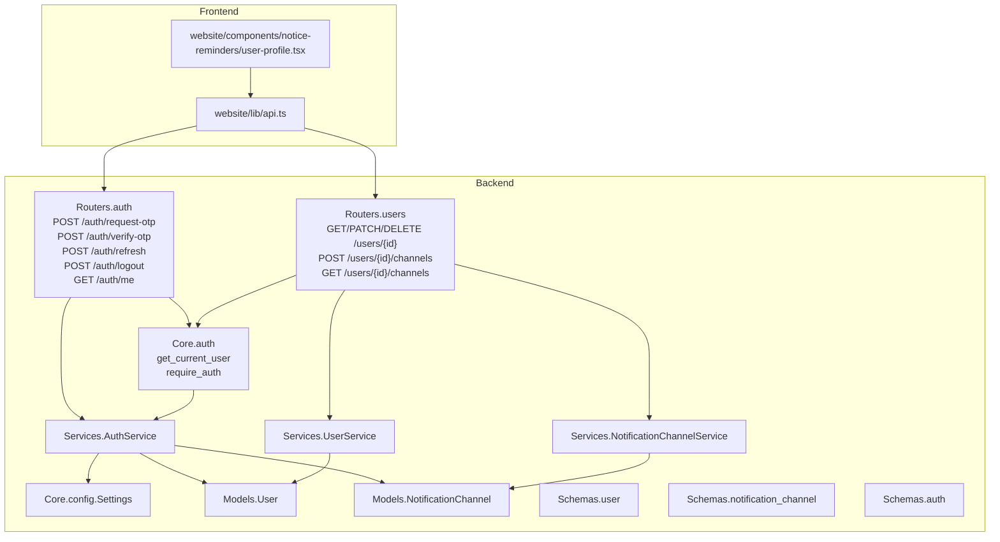
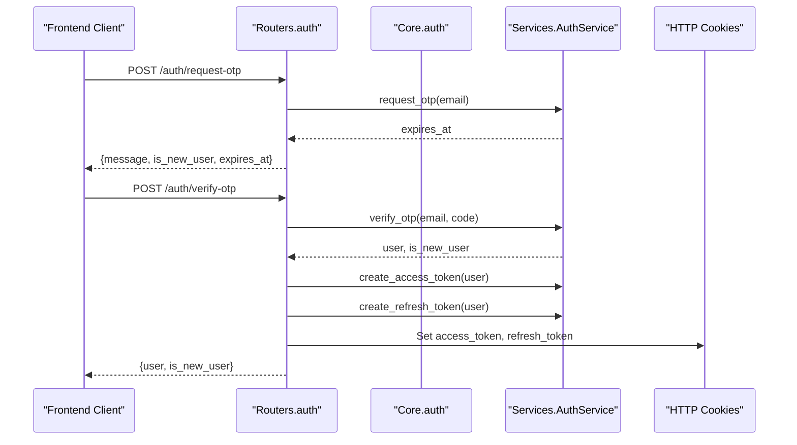
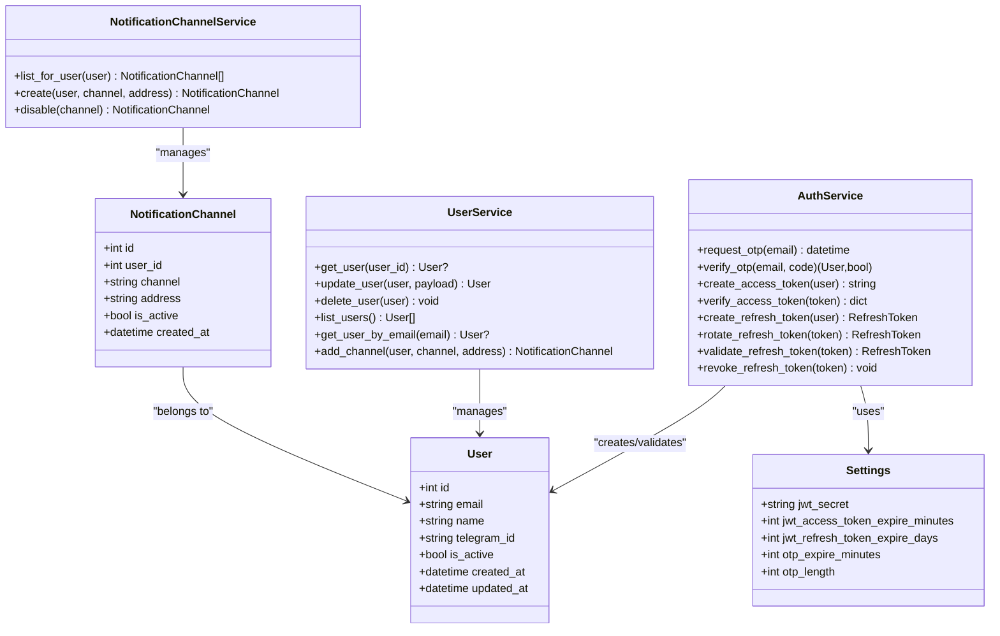

# User Profile API

<cite>
**Referenced Files in This Document**
- [users.py](file://notice-reminders/app/api/routers/users.py)
- [auth.py](file://notice-reminders/app/api/routers/auth.py)
- [auth_core.py](file://notice-reminders/app/core/auth.py)
- [config.py](file://notice-reminders/app/core/config.py)
- [user_service.py](file://notice-reminders/app/services/user_service.py)
- [notification_channel_service.py](file://notice-reminders/app/services/notification_channel_service.py)
- [user_schema.py](file://notice-reminders/app/schemas/user.py)
- [notification_channel_schema.py](file://notice-reminders/app/schemas/notification_channel.py)
- [user_model.py](file://notice-reminders/app/models/user.py)
- [notification_channel_model.py](file://notice-reminders/app/models/notification_channel.py)
- [auth_service.py](file://notice-reminders/app/services/auth_service.py)
- [auth_schema.py](file://notice-reminders/app/schemas/auth.py)
- [frontend_api.ts](file://website/lib/api.ts)
- [frontend_user_profile.tsx](file://website/components/notice-reminders/user-profile.tsx)
</cite>

## Table of Contents
1. [Introduction](#introduction)
2. [Project Structure](#project-structure)
3. [Core Components](#core-components)
4. [Architecture Overview](#architecture-overview)
5. [Detailed Component Analysis](#detailed-component-analysis)
6. [Dependency Analysis](#dependency-analysis)
7. [Performance Considerations](#performance-considerations)
8. [Troubleshooting Guide](#troubleshooting-guide)
9. [Conclusion](#conclusion)
10. [Appendices](#appendices)

## Introduction
This document provides comprehensive API documentation for user profile management within the notice-reminders system. It covers user registration via OTP, profile retrieval and updates, account deletion, and notification channel management. It also documents authentication and session handling, passwordless login via OTP, JWT access/refresh tokens, and cookie-based session persistence. Privacy and security considerations are addressed with respect to the implemented mechanisms, including token lifecycle, cookie attributes, and data protection controls.

## Project Structure
The user profile API is implemented as a FastAPI application with Pydantic schemas, Tortoise ORM models, and service layers. The frontend interacts with the backend through typed API helpers.

**Diagram sources**
- [users.py](file://notice-reminders/app/api/routers/users.py#L1-L151)
- [auth.py](file://notice-reminders/app/api/routers/auth.py#L1-L126)
- [auth_core.py](file://notice-reminders/app/core/auth.py#L1-L72)
- [user_service.py](file://notice-reminders/app/services/user_service.py#L1-L55)
- [notification_channel_service.py](file://notice-reminders/app/services/notification_channel_service.py#L1-L32)
- [auth_service.py](file://notice-reminders/app/services/auth_service.py#L1-L128)
- [config.py](file://notice-reminders/app/core/config.py#L1-L32)
- [user_model.py](file://notice-reminders/app/models/user.py#L1-L20)
- [notification_channel_model.py](file://notice-reminders/app/models/notification_channel.py#L1-L26)
- [user_schema.py](file://notice-reminders/app/schemas/user.py#L1-L24)
- [notification_channel_schema.py](file://notice-reminders/app/schemas/notification_channel.py#L1-L22)
- [auth_schema.py](file://notice-reminders/app/schemas/auth.py#L1-L26)
- [frontend_api.ts](file://website/lib/api.ts#L69-L183)
- [frontend_user_profile.tsx](file://website/components/notice-reminders/user-profile.tsx#L1-L189)

**Section sources**
- [users.py](file://notice-reminders/app/api/routers/users.py#L1-L151)
- [auth.py](file://notice-reminders/app/api/routers/auth.py#L1-L126)
- [auth_core.py](file://notice-reminders/app/core/auth.py#L1-L72)
- [user_service.py](file://notice-reminders/app/services/user_service.py#L1-L55)
- [notification_channel_service.py](file://notice-reminders/app/services/notification_channel_service.py#L1-L32)
- [auth_service.py](file://notice-reminders/app/services/auth_service.py#L1-L128)
- [config.py](file://notice-reminders/app/core/config.py#L1-L32)
- [user_model.py](file://notice-reminders/app/models/user.py#L1-L20)
- [notification_channel_model.py](file://notice-reminders/app/models/notification_channel.py#L1-L26)
- [user_schema.py](file://notice-reminders/app/schemas/user.py#L1-L24)
- [notification_channel_schema.py](file://notice-reminders/app/schemas/notification_channel.py#L1-L22)
- [auth_schema.py](file://notice-reminders/app/schemas/auth.py#L1-L26)
- [frontend_api.ts](file://website/lib/api.ts#L69-L183)
- [frontend_user_profile.tsx](file://website/components/notice-reminders/user-profile.tsx#L1-L189)

## Core Components
- Authentication and Authorization
  - Access token verification and user resolution
  - Require-auth decorator for route protection
  - OTP-based sign-up/sign-in with email delivery
  - JWT access and refresh token lifecycle with rotation
  - Cookie-based session management with secure attributes
- User Management
  - Retrieve user profile by ID
  - Update user profile fields (email, name, telegram_id, is_active)
  - Delete user account
  - Self-assertion checks to prevent cross-user access
- Notification Channels
  - Add notification channels (e.g., Telegram) with address validation
  - List user notification channels
  - Channel uniqueness per user-channel-address enforced by DB constraints

**Section sources**
- [auth_core.py](file://notice-reminders/app/core/auth.py#L14-L72)
- [auth.py](file://notice-reminders/app/api/routers/auth.py#L15-L126)
- [auth_service.py](file://notice-reminders/app/services/auth_service.py#L22-L128)
- [config.py](file://notice-reminders/app/core/config.py#L22-L27)
- [users.py](file://notice-reminders/app/api/routers/users.py#L17-L151)
- [user_service.py](file://notice-reminders/app/services/user_service.py#L16-L36)
- [notification_channel_service.py](file://notice-reminders/app/services/notification_channel_service.py#L8-L32)
- [notification_channel_model.py](file://notice-reminders/app/models/notification_channel.py#L11-L26)

## Architecture Overview
The system follows a layered architecture:
- Routers handle HTTP requests and enforce authorization
- Services encapsulate business logic and coordinate persistence
- Models define database schema and relationships
- Schemas validate and serialize request/response data
- Frontend consumes typed API helpers to interact with backend

**Diagram sources**
- [auth.py](file://notice-reminders/app/api/routers/auth.py#L43-L76)
- [auth_core.py](file://notice-reminders/app/core/auth.py#L14-L51)
- [auth_service.py](file://notice-reminders/app/services/auth_service.py#L22-L94)
- [config.py](file://notice-reminders/app/core/config.py#L22-L27)

## Detailed Component Analysis

### Authentication Endpoints
- POST /auth/request-otp
  - Accepts email and sends OTP via configured email service
  - Returns whether user is new and OTP expiry timestamp
- POST /auth/verify-otp
  - Verifies OTP, creates user if new, issues access and refresh tokens
  - Sets secure cookies for session management
- POST /auth/refresh
  - Rotates refresh token and issues new access token
- POST /auth/logout
  - Revokes refresh token and clears cookies
- GET /auth/me
  - Returns current authenticated user profile

Validation and error handling:
- Missing/invalid access token raises unauthorized errors
- Expired or invalid tokens are rejected
- Missing refresh token during refresh triggers unauthorized error
- OTP verification handles invalid/expired codes and marks code as used

Security features:
- Access token expiration and refresh token rotation
- Secure, HttpOnly, SameSite cookies with configurable security based on debug flag
- JWT secret and algorithm configured via settings

**Section sources**
- [auth.py](file://notice-reminders/app/api/routers/auth.py#L43-L126)
- [auth_core.py](file://notice-reminders/app/core/auth.py#L14-L51)
- [auth_service.py](file://notice-reminders/app/services/auth_service.py#L22-L128)
- [config.py](file://notice-reminders/app/core/config.py#L22-L27)
- [auth_schema.py](file://notice-reminders/app/schemas/auth.py#L8-L26)

### User Profile Endpoints
- GET /users/{user_id}
  - Returns user profile if requester matches target user
- PATCH /users/{user_id}
  - Updates allowed fields: email, name, telegram_id, is_active
  - Enforces self-access and existence checks
- DELETE /users/{user_id}
  - Deletes user account after validation
- GET /users/{user_id}/channels
  - Lists notification channels for the user
- POST /users/{user_id}/channels
  - Adds a notification channel; requires address for telegram channel
  - Enforces uniqueness constraint per user-channel-address

Data validation:
- Pydantic schemas validate request payloads and serialize responses
- Unique constraints on user, channel, and address prevent duplicates

**Section sources**
- [users.py](file://notice-reminders/app/api/routers/users.py#L17-L151)
- [user_schema.py](file://notice-reminders/app/schemas/user.py#L6-L24)
- [notification_channel_schema.py](file://notice-reminders/app/schemas/notification_channel.py#L6-L22)
- [user_service.py](file://notice-reminders/app/services/user_service.py#L22-L36)
- [notification_channel_service.py](file://notice-reminders/app/services/notification_channel_service.py#L11-L26)
- [notification_channel_model.py](file://notice-reminders/app/models/notification_channel.py#L11-L26)

### Frontend Integration
- Typed API helpers for OTP, auth, user, and channel operations
- React component for user profile editing and channel listing
- Uses TanStack Query for caching and optimistic updates

Example interactions:
- Request OTP, verify OTP, refresh session, logout
- Fetch current user, update profile fields, delete account
- Add Telegram channel and list channels

**Section sources**
- [frontend_api.ts](file://website/lib/api.ts#L69-L183)
- [frontend_user_profile.tsx](file://website/components/notice-reminders/user-profile.tsx#L35-L189)

## Dependency Analysis

**Diagram sources**
- [user_model.py](file://notice-reminders/app/models/user.py#L8-L19)
- [notification_channel_model.py](file://notice-reminders/app/models/notification_channel.py#L12-L25)
- [user_service.py](file://notice-reminders/app/services/user_service.py#L12-L55)
- [notification_channel_service.py](file://notice-reminders/app/services/notification_channel_service.py#L7-L32)
- [auth_service.py](file://notice-reminders/app/services/auth_service.py#L17-L128)
- [config.py](file://notice-reminders/app/core/config.py#L4-L32)

**Section sources**
- [user_model.py](file://notice-reminders/app/models/user.py#L1-L20)
- [notification_channel_model.py](file://notice-reminders/app/models/notification_channel.py#L1-L26)
- [user_service.py](file://notice-reminders/app/services/user_service.py#L1-L55)
- [notification_channel_service.py](file://notice-reminders/app/services/notification_channel_service.py#L1-L32)
- [auth_service.py](file://notice-reminders/app/services/auth_service.py#L1-L128)
- [config.py](file://notice-reminders/app/core/config.py#L1-L32)

## Performance Considerations
- Token lifetimes are short-lived for access tokens and medium-term for refresh tokens, reducing exposure windows
- Unique constraints on notification channels avoid redundant entries and improve lookup performance
- Pagination and ordering are not implemented in current endpoints; consider adding limits for large lists
- Consider caching user profiles for frequently accessed endpoints if traffic warrants

[No sources needed since this section provides general guidance]

## Troubleshooting Guide
Common issues and resolutions:
- Unauthorized access
  - Ensure access token is present and valid; check cookie presence for protected routes
  - Verify user ID matches the authenticated user for user-specific endpoints
- Invalid or expired OTP
  - Confirm OTP delivery mechanism and expiration window
  - Ensure OTP is not reused
- Refresh token errors
  - Missing or revoked refresh tokens cause unauthorized responses
  - Rotate refresh tokens on successful refresh
- Channel creation failures
  - Address required for telegram channel
  - Unique constraint violations handled by returning existing channel

**Section sources**
- [auth_core.py](file://notice-reminders/app/core/auth.py#L14-L51)
- [auth.py](file://notice-reminders/app/api/routers/auth.py#L78-L121)
- [users.py](file://notice-reminders/app/api/routers/users.py#L91-L151)
- [auth_service.py](file://notice-reminders/app/services/auth_service.py#L104-L121)

## Conclusion
The user profile API provides a secure, validated interface for user management and notification channel administration. Authentication relies on OTP, JWT access tokens, and refresh tokens with cookie-based session persistence. The design emphasizes self-assertion, data validation, and integrity constraints to maintain data consistency and user privacy.

[No sources needed since this section summarizes without analyzing specific files]

## Appendices

### API Reference

- Authentication
  - POST /auth/request-otp
    - Request body: email
    - Response: message, is_new_user, expires_at
  - POST /auth/verify-otp
    - Request body: email, code
    - Response: user, is_new_user; sets access_token and refresh_token cookies
  - POST /auth/refresh
    - No body; reads refresh_token cookie
    - Response: user, is_new_user=false
  - POST /auth/logout
    - No body; revokes refresh token and clears cookies
  - GET /auth/me
    - Response: user profile

- User Management
  - GET /users/{user_id}
    - Response: user profile
  - PATCH /users/{user_id}
    - Request body: partial user fields (email, name, telegram_id, is_active)
    - Response: updated user profile
  - DELETE /users/{user_id}
    - No response body

- Notification Channels
  - POST /users/{user_id}/channels
    - Request body: channel, address; address required for telegram
    - Response: channel record
  - GET /users/{user_id}/channels
    - Response: array of channel records

**Section sources**
- [auth.py](file://notice-reminders/app/api/routers/auth.py#L43-L126)
- [users.py](file://notice-reminders/app/api/routers/users.py#L17-L151)
- [auth_schema.py](file://notice-reminders/app/schemas/auth.py#L8-L26)
- [user_schema.py](file://notice-reminders/app/schemas/user.py#L6-L24)
- [notification_channel_schema.py](file://notice-reminders/app/schemas/notification_channel.py#L6-L22)

### Data Validation Scenarios
- User update
  - Allowed fields: email, name, telegram_id, is_active
  - Only provided fields are updated
- Channel creation
  - channel must be provided
  - address required when channel is telegram
  - Unique constraint prevents duplicate user-channel-address combinations

**Section sources**
- [user_service.py](file://notice-reminders/app/services/user_service.py#L22-L36)
- [notification_channel_service.py](file://notice-reminders/app/services/notification_channel_service.py#L11-L26)
- [notification_channel_model.py](file://notice-reminders/app/models/notification_channel.py#L22-L26)

### Security and Privacy Notes
- Tokens and cookies
  - Access tokens are short-lived; refresh tokens are rotated on use
  - Cookies marked HttpOnly and SameSite lax; secure flag depends on debug setting
- Data protection
  - Email and telegram identifiers are stored; ensure transport encryption and least-privilege access
  - Consider data retention policies and right-to-be-forgotten flows
- Compliance considerations
  - Implement consent management for notifications and data processing
  - Provide user access to personal data and deletion capabilities
  - Maintain audit trails for profile changes and channel management

[No sources needed since this section provides general guidance]