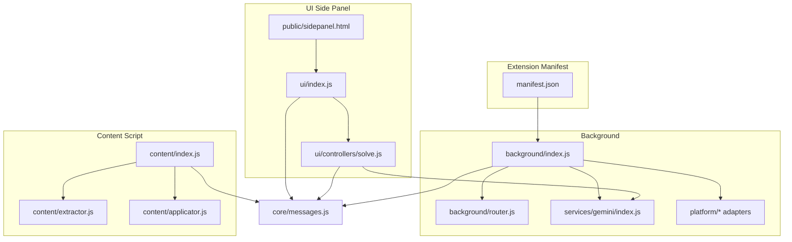
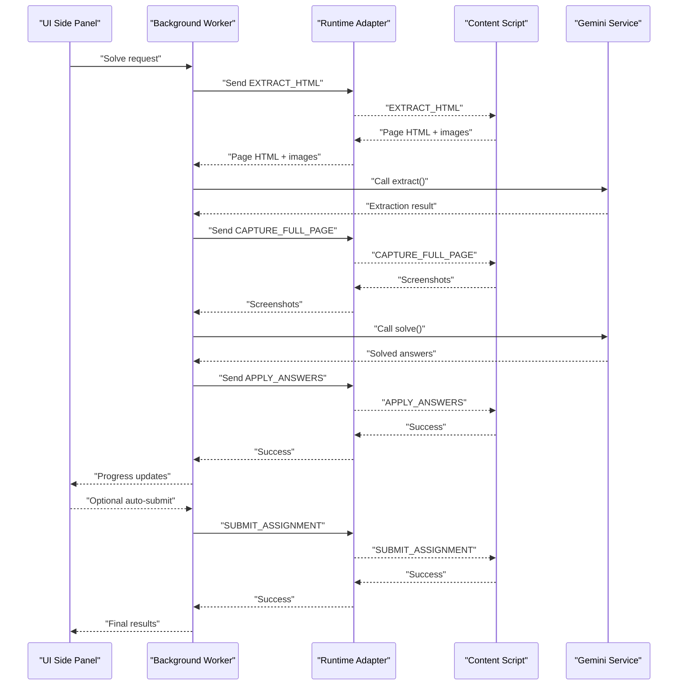
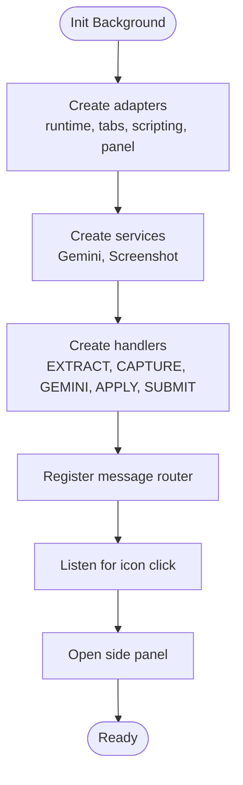
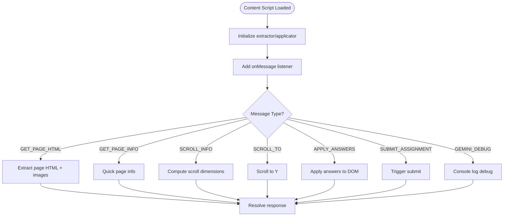
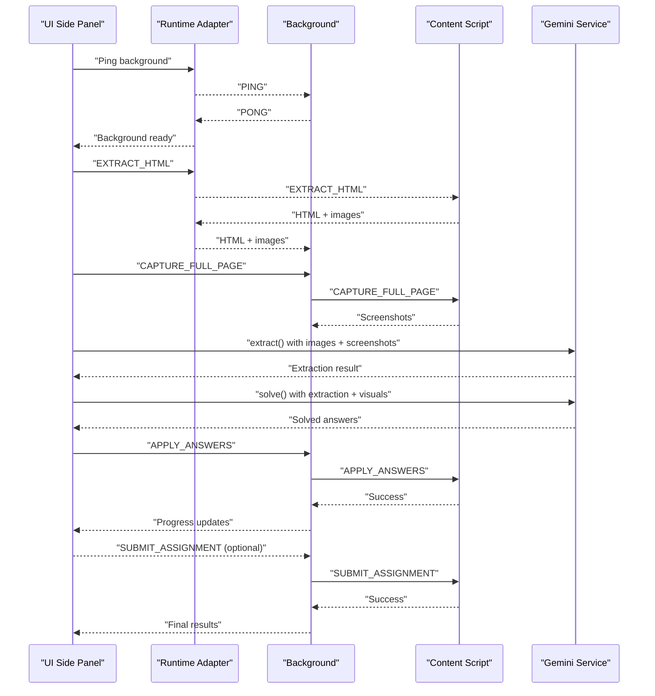
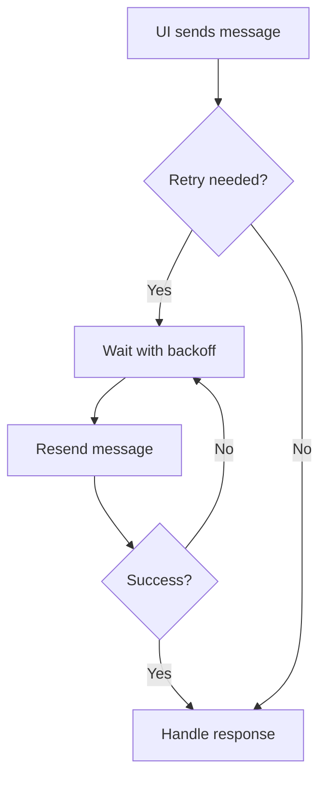
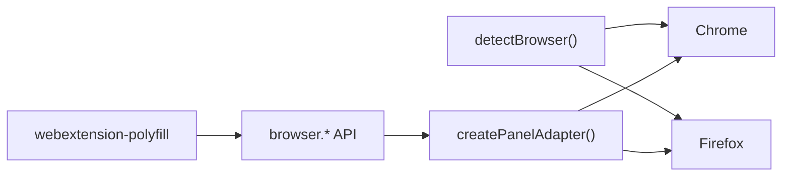
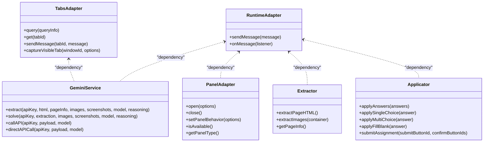
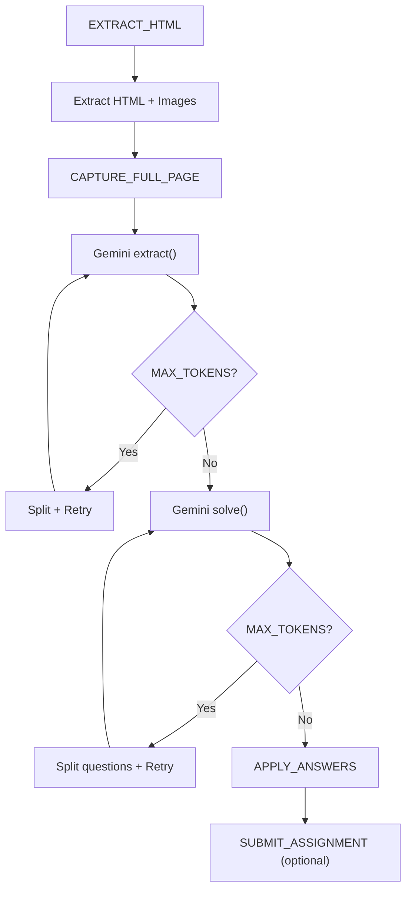
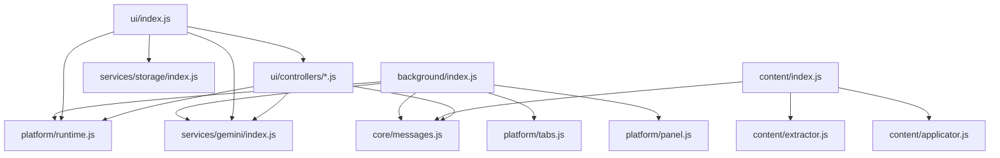

# Architecture and Design

<cite>
**Referenced Files in This Document**
- [assignment-solver/src/background/index.js](file://assignment-solver/src/background/index.js)
- [assignment-solver/src/background/router.js](file://assignment-solver/src/background/router.js)
- [assignment-solver/src/content/index.js](file://assignment-solver/src/content/index.js)
- [assignment-solver/src/content/extractor.js](file://assignment-solver/src/content/extractor.js)
- [assignment-solver/src/content/applicator.js](file://assignment-solver/src/content/applicator.js)
- [assignment-solver/src/ui/index.js](file://assignment-solver/src/ui/index.js)
- [assignment-solver/src/ui/controllers/solve.js](file://assignment-solver/src/ui/controllers/solve.js)
- [assignment-solver/src/core/messages.js](file://assignment-solver/src/core/messages.js)
- [assignment-solver/src/platform/browser.js](file://assignment-solver/src/platform/browser.js)
- [assignment-solver/src/platform/runtime.js](file://assignment-solver/src/platform/runtime.js)
- [assignment-solver/src/platform/tabs.js](file://assignment-solver/src/platform/tabs.js)
- [assignment-solver/src/platform/panel.js](file://assignment-solver/src/platform/panel.js)
- [assignment-solver/src/services/gemini/index.js](file://assignment-solver/src/services/gemini/index.js)
- [assignment-solver/manifest.json](file://assignment-solver/manifest.json)
- [assignment-solver/public/sidepanel.html](file://assignment-solver/public/sidepanel.html)
</cite>

## Table of Contents
1. [Introduction](#introduction)
2. [Project Structure](#project-structure)
3. [Core Components](#core-components)
4. [Architecture Overview](#architecture-overview)
5. [Detailed Component Analysis](#detailed-component-analysis)
6. [Dependency Analysis](#dependency-analysis)
7. [Performance Considerations](#performance-considerations)
8. [Troubleshooting Guide](#troubleshooting-guide)
9. [Conclusion](#conclusion)

## Introduction
This document describes the architecture and design of the Assignment Solver browser extension. The system consists of three primary components:
- Background service worker (service worker): orchestrates messaging, coordinates tasks, and manages platform adapters.
- Content script: interacts with the page DOM to extract assignment content, images, and apply answers.
- UI side panel: provides a user interface for initiating solves, configuring preferences, and displaying results.

The extension follows a modular, dependency injection-driven design with factory functions and platform adapters to ensure cross-browser compatibility. It implements a robust message-passing system and a three-phase pipeline: extraction, analyze (AI parsing), and apply (DOM manipulation). The design emphasizes resilience against transient connection failures and supports both Chrome and Firefox through a unified browser API wrapper.

## Project Structure
The extension is organized around a clear separation of concerns:
- background/: background service worker entry point, message routing, and platform adapters
- content/: content script entry point and DOM interaction utilities
- ui/: side panel UI entry point and controllers
- core/: shared message types and utilities
- platform/: cross-browser adapters for browser APIs
- services/: domain services (e.g., Gemini AI)
- public/: side panel HTML and assets

**Diagram sources**
- [assignment-solver/manifest.json](file://assignment-solver/manifest.json#L1-L44)
- [assignment-solver/src/background/index.js](file://assignment-solver/src/background/index.js#L1-L135)
- [assignment-solver/src/background/router.js](file://assignment-solver/src/background/router.js#L1-L59)
- [assignment-solver/src/content/index.js](file://assignment-solver/src/content/index.js#L1-L99)
- [assignment-solver/src/content/extractor.js](file://assignment-solver/src/content/extractor.js#L1-L241)
- [assignment-solver/src/content/applicator.js](file://assignment-solver/src/content/applicator.js#L1-L221)
- [assignment-solver/src/ui/index.js](file://assignment-solver/src/ui/index.js#L1-L113)
- [assignment-solver/src/ui/controllers/solve.js](file://assignment-solver/src/ui/controllers/solve.js#L1-L778)
- [assignment-solver/src/core/messages.js](file://assignment-solver/src/core/messages.js#L1-L96)
- [assignment-solver/public/sidepanel.html](file://assignment-solver/public/sidepanel.html#L1-L392)

**Section sources**
- [assignment-solver/manifest.json](file://assignment-solver/manifest.json#L1-L44)
- [assignment-solver/src/background/index.js](file://assignment-solver/src/background/index.js#L1-L135)
- [assignment-solver/src/content/index.js](file://assignment-solver/src/content/index.js#L1-L99)
- [assignment-solver/src/ui/index.js](file://assignment-solver/src/ui/index.js#L1-L113)

## Core Components
- Background service worker: initializes platform adapters, creates services, registers message handlers, and opens the side panel.
- Content script: listens for messages, extracts page HTML and images, scrolls for screenshots, applies answers, and submits assignments.
- UI side panel: waits for background readiness, initializes controllers, and coordinates the solve flow.

Key cross-cutting concerns:
- Message types and retry logic: centralized in core/messages.js to ensure consistent communication semantics across components.
- Platform adapters: unify Chrome/Firefox differences for runtime, tabs, panel, and browser detection.

**Section sources**
- [assignment-solver/src/background/index.js](file://assignment-solver/src/background/index.js#L1-L135)
- [assignment-solver/src/content/index.js](file://assignment-solver/src/content/index.js#L1-L99)
- [assignment-solver/src/ui/index.js](file://assignment-solver/src/ui/index.js#L1-L113)
- [assignment-solver/src/core/messages.js](file://assignment-solver/src/core/messages.js#L1-L96)

## Architecture Overview
The system uses a unidirectional message flow with explicit phases:
1. UI triggers a solve operation.
2. Background coordinates extraction, AI processing, and application.
3. Content script performs DOM operations and returns results.
4. UI renders progress and results.

**Diagram sources**
- [assignment-solver/src/ui/controllers/solve.js](file://assignment-solver/src/ui/controllers/solve.js#L44-L240)
- [assignment-solver/src/background/index.js](file://assignment-solver/src/background/index.js#L44-L117)
- [assignment-solver/src/content/index.js](file://assignment-solver/src/content/index.js#L19-L96)
- [assignment-solver/src/services/gemini/index.js](file://assignment-solver/src/services/gemini/index.js#L299-L341)
- [assignment-solver/src/core/messages.js](file://assignment-solver/src/core/messages.js#L5-L23)

## Detailed Component Analysis

### Background Service Worker
Responsibilities:
- Initialize platform adapters and services.
- Register message handlers for extraction, screenshots, Gemini requests, answer application, and submission.
- Manage side panel behavior and icon click actions.
- Route incoming messages to appropriate handlers.

Design highlights:
- Dependency injection via factory functions for adapters and services.
- Centralized message router ensures consistent async handling and response semantics.
- Robust logging and error handling for cross-browser environments.

**Diagram sources**
- [assignment-solver/src/background/index.js](file://assignment-solver/src/background/index.js#L24-L135)
- [assignment-solver/src/background/router.js](file://assignment-solver/src/background/router.js#L14-L58)

**Section sources**
- [assignment-solver/src/background/index.js](file://assignment-solver/src/background/index.js#L1-L135)
- [assignment-solver/src/background/router.js](file://assignment-solver/src/background/router.js#L1-L59)

### Content Script
Responsibilities:
- Listen for messages from the background.
- Extract page HTML and images, compute scroll info, scroll to positions, and apply answers.
- Submit assignments programmatically.

Design highlights:
- Factory-based initialization of extractor and applicator.
- Comprehensive DOM traversal and selection strategies for diverse NPTEL layouts.
- Defensive image extraction with CORS handling and size filtering.

**Diagram sources**
- [assignment-solver/src/content/index.js](file://assignment-solver/src/content/index.js#L19-L96)
- [assignment-solver/src/content/extractor.js](file://assignment-solver/src/content/extractor.js#L21-L96)
- [assignment-solver/src/content/applicator.js](file://assignment-solver/src/content/applicator.js#L21-L217)

**Section sources**
- [assignment-solver/src/content/index.js](file://assignment-solver/src/content/index.js#L1-L99)
- [assignment-solver/src/content/extractor.js](file://assignment-solver/src/content/extractor.js#L1-L241)
- [assignment-solver/src/content/applicator.js](file://assignment-solver/src/content/applicator.js#L1-L221)

### UI Side Panel
Responsibilities:
- Initialize UI, controllers, and state managers.
- Coordinate the solve lifecycle: extraction, AI processing, answer filling, and optional submission.
- Provide progress tracking and results display.
- Handle settings and API key management.

Design highlights:
- Wait-for-background mechanism with exponential backoff for Firefox compatibility.
- Recursive splitting and merging for handling MAX_TOKENS errors from Gemini.
- Modular controllers for detection, progress, settings, and solve.

**Diagram sources**
- [assignment-solver/src/ui/index.js](file://assignment-solver/src/ui/index.js#L26-L51)
- [assignment-solver/src/ui/controllers/solve.js](file://assignment-solver/src/ui/controllers/solve.js#L44-L240)
- [assignment-solver/src/services/gemini/index.js](file://assignment-solver/src/services/gemini/index.js#L145-L341)

**Section sources**
- [assignment-solver/src/ui/index.js](file://assignment-solver/src/ui/index.js#L1-L113)
- [assignment-solver/src/ui/controllers/solve.js](file://assignment-solver/src/ui/controllers/solve.js#L1-L778)
- [assignment-solver/public/sidepanel.html](file://assignment-solver/public/sidepanel.html#L1-L392)

### Message Passing System
Components communicate via a well-defined set of message types and a retry mechanism:
- Types: PING, GET_PAGE_HTML, GET_PAGE_INFO, APPLY_ANSWERS, SUBMIT_ASSIGNMENT, EXTRACT_HTML, CAPTURE_FULL_PAGE, GEMINI_REQUEST, GEMINI_DEBUG, SCROLL_INFO, SCROLL_TO, TAB_UPDATED.
- Retry logic: exponential backoff with connection error detection to handle transient failures, especially in Firefox.

**Diagram sources**
- [assignment-solver/src/core/messages.js](file://assignment-solver/src/core/messages.js#L47-L95)

**Section sources**
- [assignment-solver/src/core/messages.js](file://assignment-solver/src/core/messages.js#L1-L96)

### Cross-Browser Compatibility Strategy
- Unified browser API: webextension-polyfill is used to expose a consistent browser.* API across Chrome and Firefox.
- Feature detection: runtime detection of Chrome vs Firefox and availability of optional APIs.
- Panel abstraction: a single adapter handles sidePanel (Chrome) and sidebarAction (Firefox) differences.
- Manifest configuration: manifest v3 with permissions and side panel defaults.

**Diagram sources**
- [assignment-solver/src/platform/browser.js](file://assignment-solver/src/platform/browser.js#L1-L86)
- [assignment-solver/src/platform/panel.js](file://assignment-solver/src/platform/panel.js#L16-L116)
- [assignment-solver/manifest.json](file://assignment-solver/manifest.json#L1-L44)

**Section sources**
- [assignment-solver/src/platform/browser.js](file://assignment-solver/src/platform/browser.js#L1-L86)
- [assignment-solver/src/platform/panel.js](file://assignment-solver/src/platform/panel.js#L1-L119)
- [assignment-solver/manifest.json](file://assignment-solver/manifest.json#L1-L44)

### Dependency Injection Pattern and Factory Functions
- Platform adapters: createRuntimeAdapter, createTabsAdapter, createScriptingAdapter, createPanelAdapter encapsulate browser differences.
- Services: createGeminiService composes runtime and logger; createScreenshotService composes tabs and scripting.
- Controllers: createSolveController, createDetectionController, createProgressController, createSettingsController accept dependencies via factories.
- Content services: createExtractor and createApplicator isolate DOM operations.

**Diagram sources**
- [assignment-solver/src/platform/runtime.js](file://assignment-solver/src/platform/runtime.js#L12-L31)
- [assignment-solver/src/platform/tabs.js](file://assignment-solver/src/platform/tabs.js#L12-L52)
- [assignment-solver/src/services/gemini/index.js](file://assignment-solver/src/services/gemini/index.js#L60-L341)
- [assignment-solver/src/platform/panel.js](file://assignment-solver/src/platform/panel.js#L16-L116)
- [assignment-solver/src/content/extractor.js](file://assignment-solver/src/content/extractor.js#L12-L241)
- [assignment-solver/src/content/applicator.js](file://assignment-solver/src/content/applicator.js#L12-L221)

**Section sources**
- [assignment-solver/src/platform/runtime.js](file://assignment-solver/src/platform/runtime.js#L1-L32)
- [assignment-solver/src/platform/tabs.js](file://assignment-solver/src/platform/tabs.js#L1-L53)
- [assignment-solver/src/platform/panel.js](file://assignment-solver/src/platform/panel.js#L1-L119)
- [assignment-solver/src/services/gemini/index.js](file://assignment-solver/src/services/gemini/index.js#L1-L342)
- [assignment-solver/src/content/extractor.js](file://assignment-solver/src/content/extractor.js#L1-L241)
- [assignment-solver/src/content/applicator.js](file://assignment-solver/src/content/applicator.js#L1-L221)

### Data Flow Through Extraction-Analyze-Apply Phases
- Extraction: UI requests page HTML and images; background forwards to content script; content script locates assignment containers and images; background captures full-page screenshots; Gemini extracts structured questions.
- Analyze: UI requests AI analysis; Gemini parses extraction with images/screenshots; recursive splitting mitigates token limits; results merged.
- Apply: UI fills answers; background sends APPLY_ANSWERS; content script applies selections/text; optional auto-submit triggers SUBMIT_ASSIGNMENT.

**Diagram sources**
- [assignment-solver/src/ui/controllers/solve.js](file://assignment-solver/src/ui/controllers/solve.js#L252-L319)
- [assignment-solver/src/ui/controllers/solve.js](file://assignment-solver/src/ui/controllers/solve.js#L481-L544)
- [assignment-solver/src/services/gemini/index.js](file://assignment-solver/src/services/gemini/index.js#L145-L341)

**Section sources**
- [assignment-solver/src/ui/controllers/solve.js](file://assignment-solver/src/ui/controllers/solve.js#L1-L778)
- [assignment-solver/src/services/gemini/index.js](file://assignment-solver/src/services/gemini/index.js#L1-L342)

## Dependency Analysis
The system exhibits loose coupling and high cohesion:
- Background depends on platform adapters and services; handlers depend on adapters and logger.
- Content script depends on extractor and applicator; both depend on logger.
- UI depends on runtime adapter, storage, and controllers; solve controller depends on Gemini service and state.

**Diagram sources**
- [assignment-solver/src/background/index.js](file://assignment-solver/src/background/index.js#L1-L19)
- [assignment-solver/src/ui/index.js](file://assignment-solver/src/ui/index.js#L5-L16)
- [assignment-solver/src/content/index.js](file://assignment-solver/src/content/index.js#L7-L11)

**Section sources**
- [assignment-solver/src/background/index.js](file://assignment-solver/src/background/index.js#L1-L135)
- [assignment-solver/src/ui/index.js](file://assignment-solver/src/ui/index.js#L1-L113)
- [assignment-solver/src/content/index.js](file://assignment-solver/src/content/index.js#L1-L99)

## Performance Considerations
- Token limit handling: recursive splitting of HTML and questions reduces payload sizes to fit model constraints.
- Image handling: filtering small images and skipping CORS-impacted images avoids unnecessary overhead.
- Retry strategy: exponential backoff minimizes repeated failures and improves reliability on slower browsers.
- Screenshot capture: targeted full-page capture reduces bandwidth and processing time.
- DOM operations: batched application with progress updates prevents UI blocking.

## Troubleshooting Guide
Common issues and remedies:
- Background not ready (Firefox): UI waits for PING response with retries; ensure extension reload and page refresh.
- Message port errors: sendMessageWithRetry detects transient connection errors and retries; check network/API key validity.
- MAX_TOKENS errors: UI splits HTML or questions recursively; adjust model preferences or reduce content.
- CORS image extraction: skipped images are logged; verify image origins and avoid external resources when possible.
- Panel opening failures: panel adapter handles Firefox vs Chrome differences; verify permissions and API availability.

**Section sources**
- [assignment-solver/src/ui/index.js](file://assignment-solver/src/ui/index.js#L26-L51)
- [assignment-solver/src/core/messages.js](file://assignment-solver/src/core/messages.js#L47-L95)
- [assignment-solver/src/ui/controllers/solve.js](file://assignment-solver/src/ui/controllers/solve.js#L276-L319)
- [assignment-solver/src/content/extractor.js](file://assignment-solver/src/content/extractor.js#L109-L173)
- [assignment-solver/src/platform/panel.js](file://assignment-solver/src/platform/panel.js#L33-L52)

## Conclusion
The Assignment Solver extension demonstrates a clean, modular architecture with strong cross-browser compatibility. Its dependency injection and factory-based design enable easy testing and maintenance. The message-passing system, combined with robust retry logic and token-aware processing, delivers a reliable user experience across Chrome and Firefox. The UI’s progress tracking and results presentation enhance usability, while the content script’s DOM-centric operations ensure precise automation of assignment workflows.