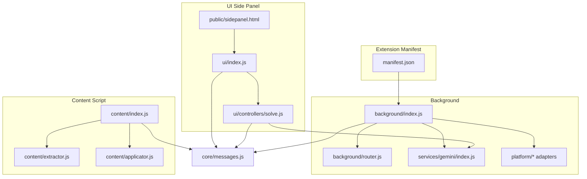
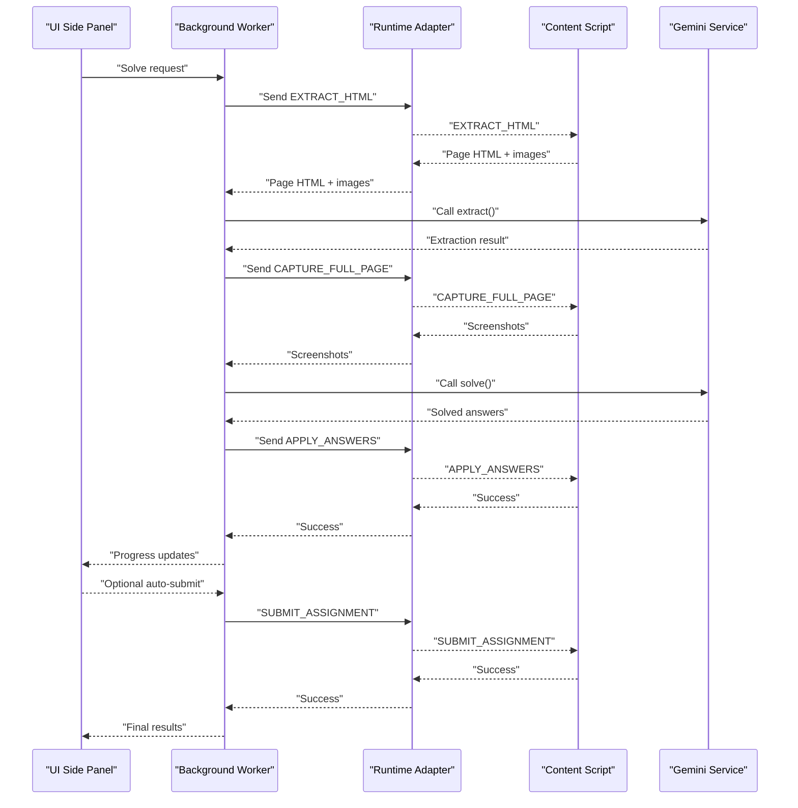
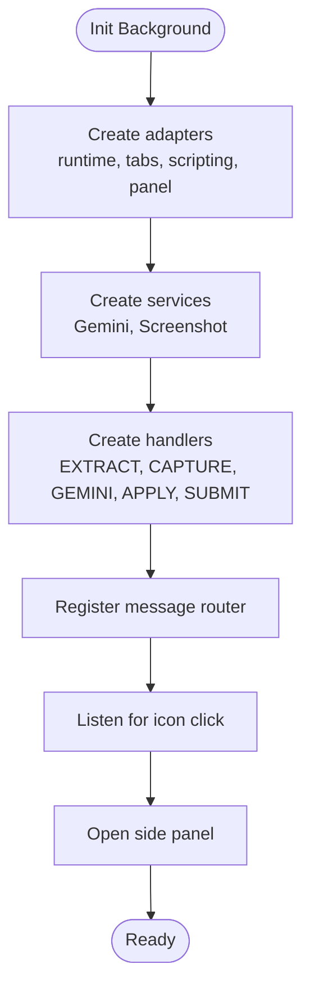
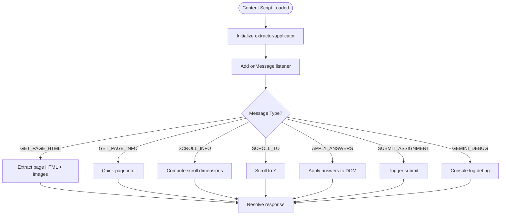
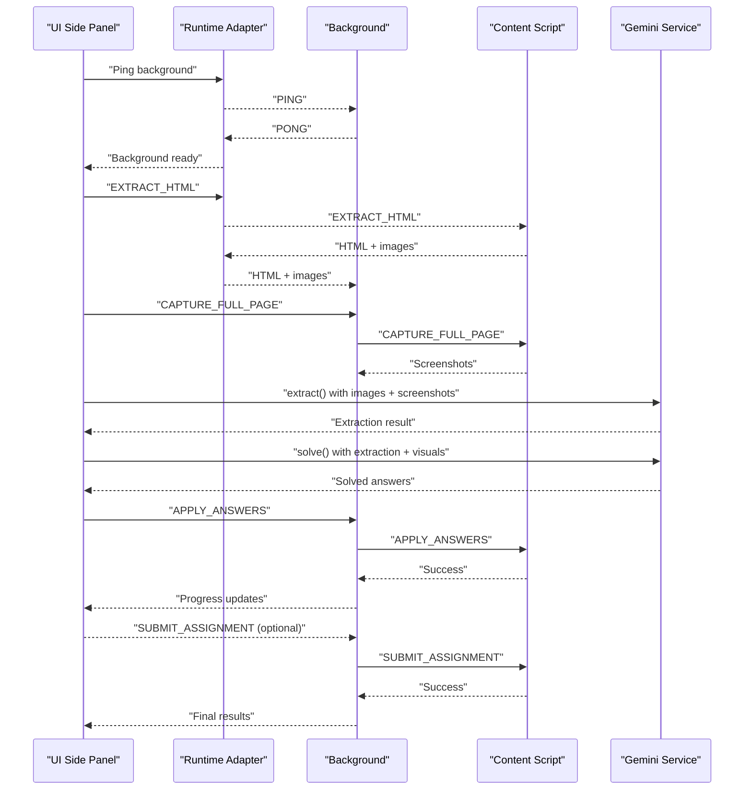
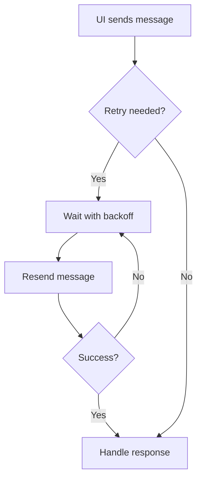
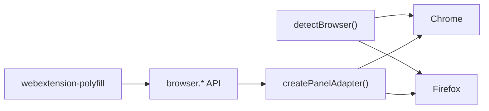
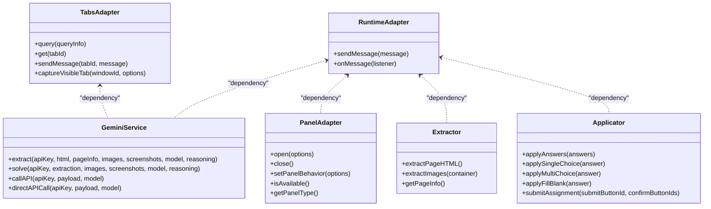
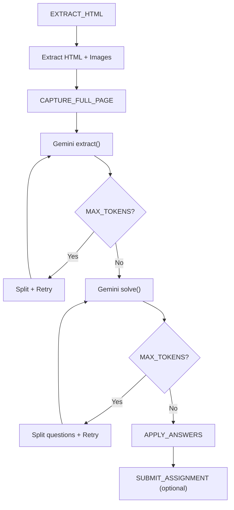
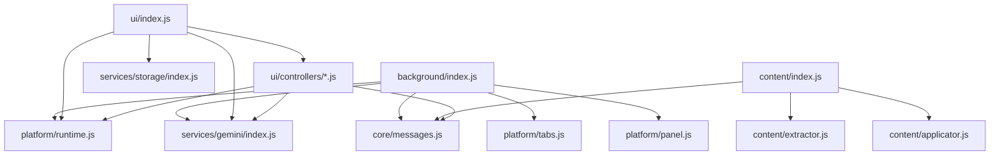

# Architecture and design

## Introduction
This page describes the architecture and design of the Assignment Solver browser extension. The system consists of three primary components:
- Background service worker (service worker): orchestrates messaging, coordinates tasks, and manages platform adapters.
- Content script: interacts with the page DOM to extract assignment content, images, and apply answers.
- UI side panel: provides a user interface for initiating solves, configuring preferences, and displaying results.

The extension follows a modular, dependency injection-driven design with factory functions and platform adapters to ensure cross-browser compatibility. It implements a reliable message-passing system and a three-phase pipeline: extraction, analyze (AI parsing), and apply (DOM manipulation). The design emphasizes resilience against transient connection failures and supports both Chrome and Firefox through a unified browser API wrapper.

## Project structure
The extension is organized around a clear separation of concerns:
- background/: background service worker entry point, message routing, and platform adapters
- content/: content script entry point and DOM interaction utilities
- ui/: side panel UI entry point and controllers
- core/: shared message types and utilities
- platform/: cross-browser adapters for browser APIs
- services/: domain services (e.g., Gemini AI)
- public/: side panel HTML and assets

```mermaid
graph TB
subgraph "Extension Manifest"
M["manifest.json"]
end
subgraph "Background"
BGIDX["background/index.js"]
BGRTR["background/router.js"]
BGSVC["services/gemini/index.js"]
BGPLAT["platform/* adapters"]
end
subgraph "Content Script"
CNTIDX["content/index.js"]
CNTEX["content/extractor.js"]
CNTAP["content/applicator.js"]
end
subgraph "UI Side Panel"
UIIDX["ui/index.js"]
UISOLVE["ui/controllers/solve.js"]
UIHTML["public/sidepanel.html"]
end
CORE["core/messages.js"]
M --> BGIDX
BGIDX --> BGRTR
BGIDX --> BGSVC
BGIDX --> BGPLAT
UIIDX --> UISOLVE
UIIDX --> CORE
UISOLVE --> CORE
UISOLVE --> BGSVC
BGIDX --> CORE
CNTIDX --> CORE
CNTIDX --> CNTEX
CNTIDX --> CNTAP
UIHTML --> UIIDX
```

## Core components
- Background service worker: initializes platform adapters, creates services, registers message handlers, and opens the side panel.
- Content script: listens for messages, extracts page HTML and images, scrolls for screenshots, applies answers, and submits assignments.
- UI side panel: waits for background readiness, initializes controllers, and coordinates the solve flow.

Key cross-cutting concerns:
- Message types and retry logic: centralized in core/messages.js to ensure consistent communication semantics across components.
- Platform adapters: unify Chrome/Firefox differences for runtime, tabs, panel, and browser detection.

## Architecture overview
The system uses a unidirectional message flow with explicit phases:
1. UI triggers a solve operation.
2. Background coordinates extraction, AI processing, and application.
3. Content script performs DOM operations and returns results.
4. UI renders progress and results.

```mermaid
sequenceDiagram
participant UI as "UI Side Panel"
participant BG as "Background Worker"
participant RT as "Runtime Adapter"
participant CT as "Content Script"
participant GM as "Gemini Service"
UI->>BG : "Solve request"
BG->>RT : "Send EXTRACT_HTML"
RT-->>CT : "EXTRACT_HTML"
CT-->>RT : "Page HTML + images"
RT-->>BG : "Page HTML + images"
BG->>GM : "Call extract()"
GM-->>BG : "Extraction result"
BG->>RT : "Send CAPTURE_FULL_PAGE"
RT-->>CT : "CAPTURE_FULL_PAGE"
CT-->>RT : "Screenshots"
RT-->>BG : "Screenshots"
BG->>GM : "Call solve()"
GM-->>BG : "Solved answers"
BG->>RT : "Send APPLY_ANSWERS"
RT-->>CT : "APPLY_ANSWERS"
CT-->>RT : "Success"
RT-->>BG : "Success"
BG-->>UI : "Progress updates"
UI-->>BG : "Optional auto-submit"
BG->>RT : "SUBMIT_ASSIGNMENT"
RT-->>CT : "SUBMIT_ASSIGNMENT"
CT-->>RT : "Success"
RT-->>BG : "Success"
BG-->>UI : "Final results"
```

## Detailed component analysis

### Background service worker
Responsibilities:
- Initialize platform adapters and services.
- Register message handlers for extraction, screenshots, Gemini requests, answer application, and submission.
- Manage side panel behavior and icon click actions.
- Route incoming messages to appropriate handlers.

Design highlights:
- Dependency injection via factory functions for adapters and services.
- Centralized message router ensures consistent async handling and response semantics.
- Reliable logging and error handling for cross-browser environments.

```mermaid
flowchart TD
Start(["Init Background"]) --> InitAdapters["Create adapters<br/>runtime, tabs, scripting, panel"]
InitAdapters --> InitServices["Create services<br/>Gemini, Screenshot"]
InitServices --> CreateHandlers["Create handlers<br/>EXTRACT, CAPTURE, GEMINI, APPLY, SUBMIT"]
CreateHandlers --> RegisterRouter["Register message router"]
RegisterRouter --> IconClick["Listen for icon click"]
IconClick --> OpenPanel["Open side panel"]
OpenPanel --> Ready(["Ready"])
```

### Content script
Responsibilities:
- Listen for messages from the background.
- Extract page HTML and images, compute scroll info, scroll to positions, and apply answers.
- Submit assignments programmatically.

Design highlights:
- Factory-based initialization of extractor and applicator.
- Detailed DOM traversal and selection strategies for diverse NPTEL layouts.
- Defensive image extraction with CORS handling and size filtering.

```mermaid
flowchart TD
Entry(["Content Script Loaded"]) --> Init["Initialize extractor/applicator"]
Init --> Listen["Add onMessage listener"]
Listen --> Msg{"Message Type?"}
Msg --> |GET_PAGE_HTML| ExtractHTML["Extract page HTML + images"]
Msg --> |GET_PAGE_INFO| PageInfo["Quick page info"]
Msg --> |SCROLL_INFO| ScrollInfo["Compute scroll dimensions"]
Msg --> |SCROLL_TO| ScrollTo["Scroll to Y"]
Msg --> |APPLY_ANSWERS| Apply["Apply answers to DOM"]
Msg --> |SUBMIT_ASSIGNMENT| Submit["Trigger submit"]
Msg --> |GEMINI_DEBUG| Debug["Console log debug"]
ExtractHTML --> Respond["Resolve response"]
PageInfo --> Respond
ScrollInfo --> Respond
ScrollTo --> Respond
Apply --> Respond
Submit --> Respond
Debug --> Respond
```

### UI side panel
Responsibilities:
- Initialize UI, controllers, and state managers.
- Coordinate the solve lifecycle: extraction, AI processing, answer filling, and optional submission.
- Provide progress tracking and results display.
- Handle settings and API key management.

Design highlights:
- Wait-for-background mechanism with exponential backoff for Firefox compatibility.
- Recursive splitting and merging for handling MAX_TOKENS errors from Gemini.
- Modular controllers for detection, progress, settings, and solve.

```mermaid
sequenceDiagram
participant UI as "UI Side Panel"
participant RT as "Runtime Adapter"
participant BG as "Background"
participant CT as "Content Script"
participant GM as "Gemini Service"
UI->>RT : "Ping background"
RT-->>BG : "PING"
BG-->>RT : "PONG"
RT-->>UI : "Background ready"
UI->>RT : "EXTRACT_HTML"
RT-->>CT : "EXTRACT_HTML"
CT-->>RT : "HTML + images"
RT-->>BG : "HTML + images"
UI->>BG : "CAPTURE_FULL_PAGE"
BG->>CT : "CAPTURE_FULL_PAGE"
CT-->>BG : "Screenshots"
UI->>GM : "extract() with images + screenshots"
GM-->>UI : "Extraction result"
UI->>GM : "solve() with extraction + visuals"
GM-->>UI : "Solved answers"
UI->>BG : "APPLY_ANSWERS"
BG->>CT : "APPLY_ANSWERS"
CT-->>BG : "Success"
BG-->>UI : "Progress updates"
UI-->>BG : "SUBMIT_ASSIGNMENT (optional)"
BG->>CT : "SUBMIT_ASSIGNMENT"
CT-->>BG : "Success"
BG-->>UI : "Final results"
```

### Message passing system
Components communicate via a well-defined set of message types and a retry mechanism:
- Types: PING, GET_PAGE_HTML, GET_PAGE_INFO, APPLY_ANSWERS, SUBMIT_ASSIGNMENT, EXTRACT_HTML, CAPTURE_FULL_PAGE, GEMINI_REQUEST, GEMINI_DEBUG, SCROLL_INFO, SCROLL_TO, TAB_UPDATED.
- Retry logic: exponential backoff with connection error detection to handle transient failures, especially in Firefox.

```mermaid
flowchart TD
A["UI sends message"] --> B{"Retry needed?"}
B --> |Yes| C["Wait with backoff"]
C --> D["Resend message"]
D --> E{"Success?"}
E --> |No| C
E --> |Yes| F["Handle response"]
B --> |No| F
```

### Cross-Browser compatibility strategy
- Unified browser API: webextension-polyfill is used to expose a consistent browser.* API across Chrome and Firefox.
- Feature detection: runtime detection of Chrome vs Firefox and availability of optional APIs.
- Panel abstraction: a single adapter handles sidePanel (Chrome) and sidebarAction (Firefox) differences.
- Manifest configuration: manifest v3 with permissions and side panel defaults.

```mermaid
graph LR
POLY["webextension-polyfill"] --> BR["browser.* API"]
DETECT["detectBrowser()"] --> CHROME["Chrome"]
DETECT --> FIREFOX["Firefox"]
PANELAD["createPanelAdapter()"] --> CHROME
PANELAD --> FIREFOX
BR --> PANELAD
```

### Dependency injection pattern and factory functions
- Platform adapters: createRuntimeAdapter, createTabsAdapter, createScriptingAdapter, createPanelAdapter encapsulate browser differences.
- Services: createGeminiService composes runtime and logger; createScreenshotService composes tabs and scripting.
- Controllers: createSolveController, createDetectionController, createProgressController, createSettingsController accept dependencies via factories.
- Content services: createExtractor and createApplicator isolate DOM operations.

```mermaid
classDiagram
class RuntimeAdapter {
+sendMessage(message)
+onMessage(listener)
}
class TabsAdapter {
+query(queryInfo)
+get(tabId)
+sendMessage(tabId, message)
+captureVisibleTab(windowId, options)
}
class GeminiService {
+extract(apiKey, html, pageInfo, images, screenshots, model, reasoning)
+solve(apiKey, extraction, images, screenshots, model, reasoning)
+callAPI(apiKey, payload, model)
+directAPICall(apiKey, payload, model)
}
class PanelAdapter {
+open(options)
+close()
+setPanelBehavior(options)
+isAvailable()
+getPanelType()
}
class Extractor {
+extractPageHTML()
+extractImages(container)
+getPageInfo()
}
class Applicator {
+applyAnswers(answers)
+applySingleChoice(answer)
+applyMultiChoice(answer)
+applyFillBlank(answer)
+submitAssignment(submitButtonId, confirmButtonIds)
}
RuntimeAdapter <.. GeminiService : "dependency"
TabsAdapter <.. GeminiService : "dependency"
RuntimeAdapter <.. PanelAdapter : "dependency"
RuntimeAdapter <.. Extractor : "dependency"
RuntimeAdapter <.. Applicator : "dependency"
```

### Data flow through extraction-analyze-apply phases
- Extraction: UI requests page HTML and images; background forwards to content script; content script locates assignment containers and images; background captures full-page screenshots; Gemini extracts structured questions.
- Analyze: UI requests AI analysis; Gemini parses extraction with images/screenshots; recursive splitting mitigates token limits; results merged.
- Apply: UI fills answers; background sends APPLY_ANSWERS; content script applies selections/text; optional auto-submit triggers SUBMIT_ASSIGNMENT.

```mermaid
flowchart TD
EX["EXTRACT_HTML"] --> IMG["Extract HTML + Images"]
IMG --> SS["CAPTURE_FULL_PAGE"]
SS --> GMX["Gemini extract()"]
GMX --> SPLITX{"MAX_TOKENS?"}
SPLITX --> |Yes| SPLIT["Split + Retry"]
SPLIT --> GMX
SPLITX --> |No| GMS["Gemini solve()"]
GMS --> SPLITS{"MAX_TOKENS?"}
SPLITS --> |Yes| SPLITQ["Split questions + Retry"]
SPLITQ --> GMS
SPLITS --> |No| APPLY["APPLY_ANSWERS"]
APPLY --> SUB["SUBMIT_ASSIGNMENT (optional)"]
```

## Dependency analysis
The system exhibits loose coupling and high cohesion:
- Background depends on platform adapters and services; handlers depend on adapters and logger.
- Content script depends on extractor and applicator; both depend on logger.
- UI depends on runtime adapter, storage, and controllers; solve controller depends on Gemini service and state.

```mermaid
graph TB
BG["background/index.js"] --> RT["platform/runtime.js"]
BG --> TS["platform/tabs.js"]
BG --> PL["platform/panel.js"]
BG --> GM["services/gemini/index.js"]
BG --> MSG["core/messages.js"]
UI["ui/index.js"] --> RT
UI --> ST["services/storage/index.js"]
UI --> GM
UI --> CTRL["ui/controllers/*.js"]
CNT["content/index.js"] --> EX["content/extractor.js"]
CNT --> AP["content/applicator.js"]
CNT --> MSG
CTRL --> MSG
CTRL --> GM
CTRL --> RT
```

## Performance considerations
- Token limit handling: recursive splitting of HTML and questions reduces payload sizes to fit model constraints.
- Image handling: filtering small images and skipping CORS-impacted images avoids unnecessary overhead.
- Retry strategy: exponential backoff minimizes repeated failures and improves reliability on slower browsers.
- Screenshot capture: targeted full-page capture reduces bandwidth and processing time.
- DOM operations: batched application with progress updates prevents UI blocking.

## Troubleshooting guide
Common issues and remedies:
- Background not ready (Firefox): UI waits for PING response with retries; ensure extension reload and page refresh.
- Message port errors: sendMessageWithRetry detects transient connection errors and retries; check network/API key validity.
- MAX_TOKENS errors: UI splits HTML or questions recursively; adjust model preferences or reduce content.
- CORS image extraction: skipped images are logged; verify image origins and avoid external resources when possible.
- Panel opening failures: panel adapter handles Firefox vs Chrome differences; verify permissions and API availability.

## Conclusion
The Assignment Solver extension demonstrates a clean, modular architecture with strong cross-browser compatibility. Its dependency injection and factory-based design enable easy testing and maintenance. The message-passing system, combined with reliable retry logic and token-aware processing, delivers a reliable user experience across Chrome and Firefox. The UI's progress tracking and results presentation improve usability, while the content script's DOM-centric operations ensure precise automation of assignment workflows.
