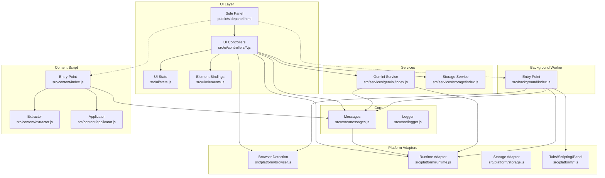
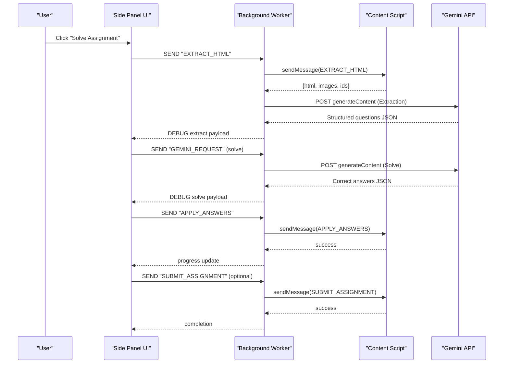
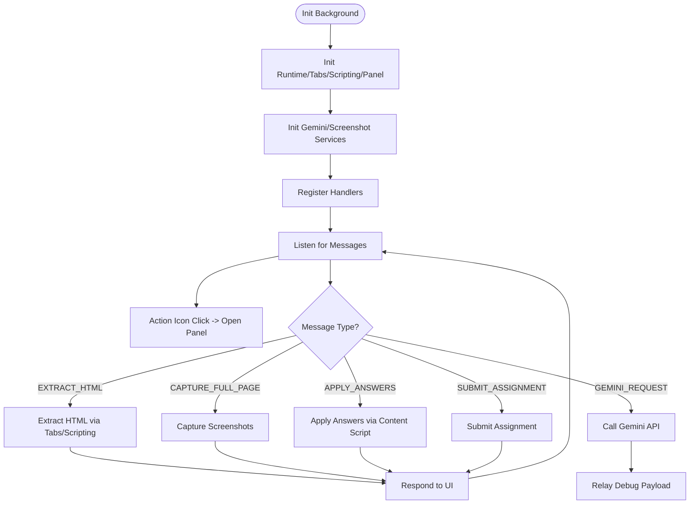
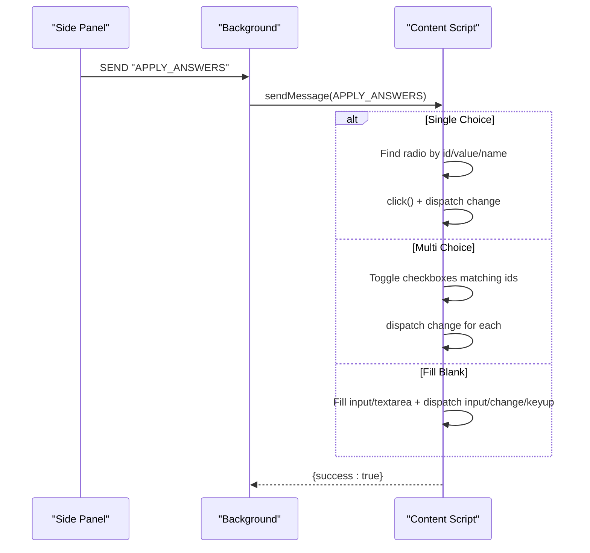
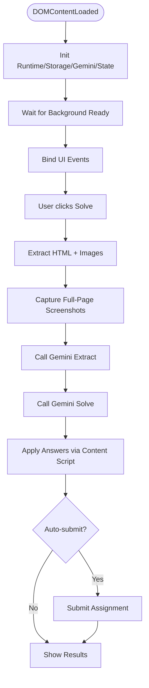
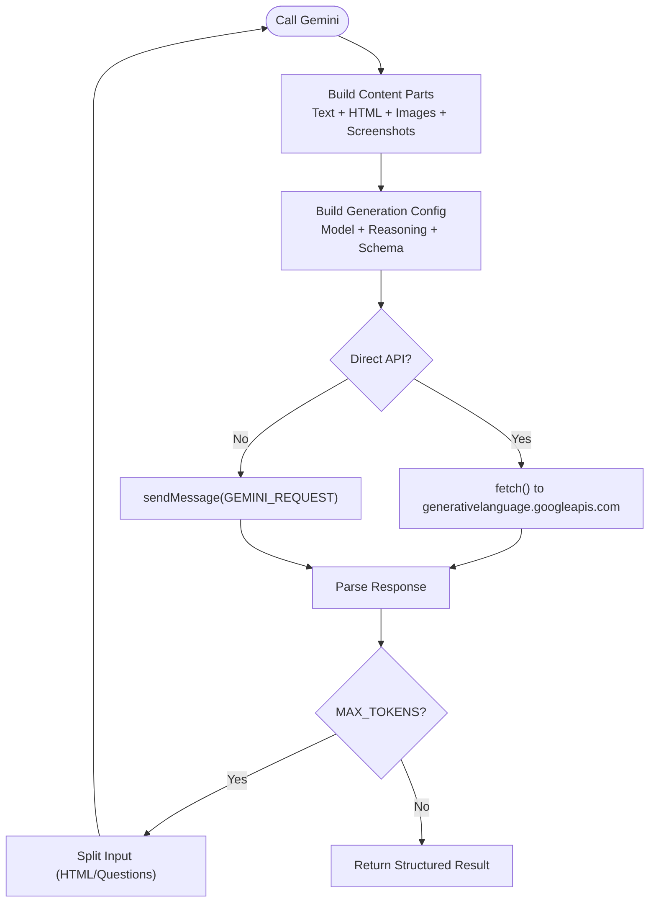
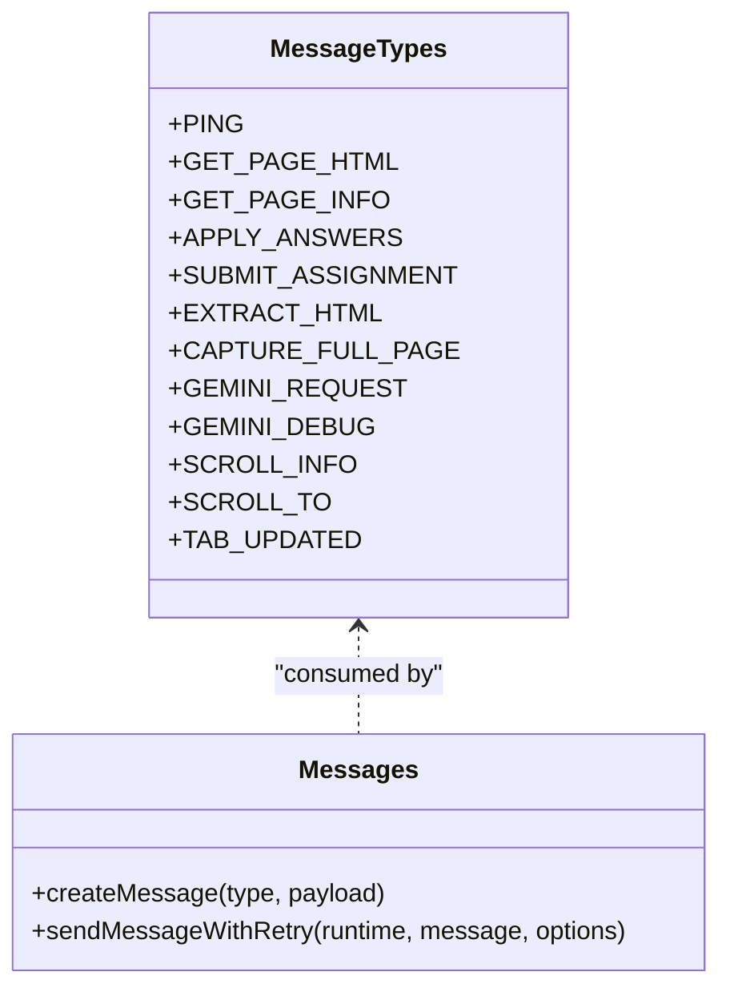
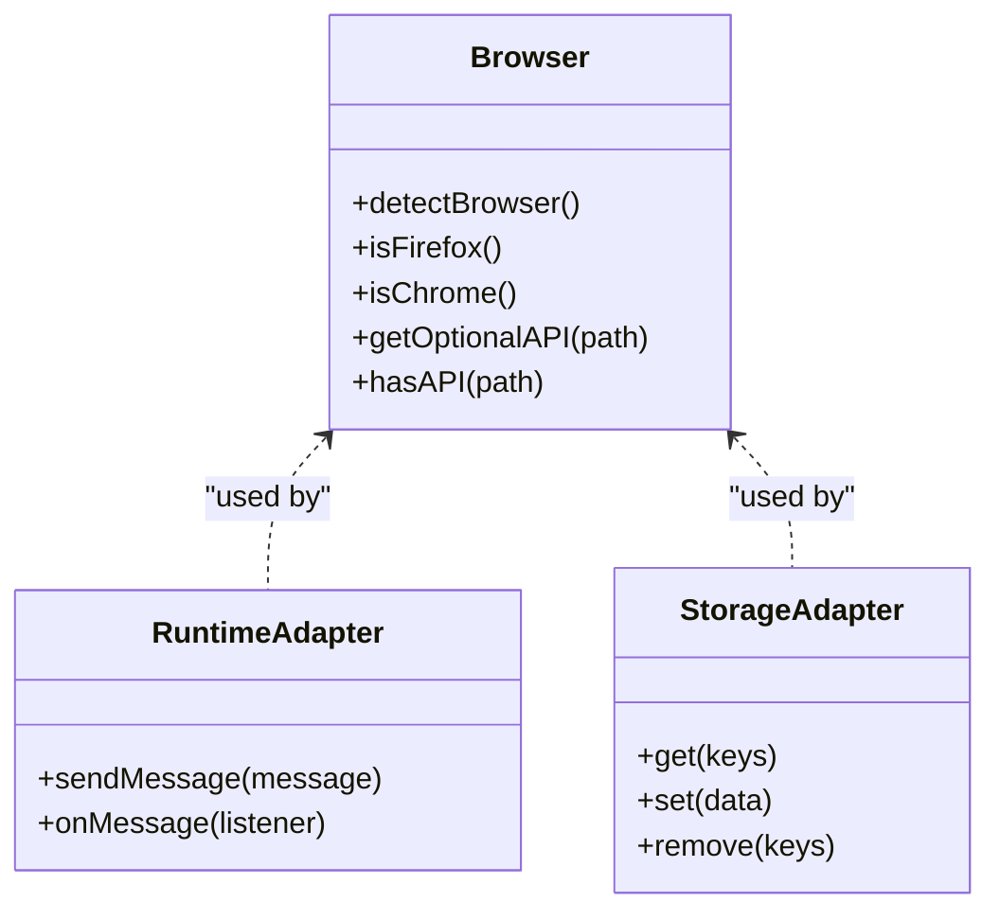
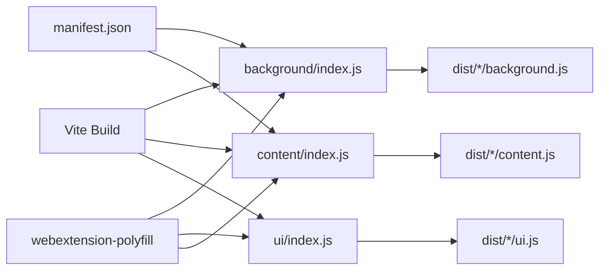

# Assignment Solver Extension

<cite>
**Referenced Files in This Document**
- [README.md](file://assignment-solver/README.md)
- [package.json](file://assignment-solver/package.json)
- [manifest.json](file://assignment-solver/manifest.json)
- [src/background/index.js](file://assignment-solver/src/background/index.js)
- [src/content/index.js](file://assignment-solver/src/content/index.js)
- [src/ui/index.js](file://assignment-solver/src/ui/index.js)
- [src/core/messages.js](file://assignment-solver/src/core/messages.js)
- [src/platform/browser.js](file://assignment-solver/src/platform/browser.js)
- [src/platform/runtime.js](file://assignment-solver/src/platform/runtime.js)
- [src/platform/storage.js](file://assignment-solver/src/platform/storage.js)
- [src/services/gemini/index.js](file://assignment-solver/src/services/gemini/index.js)
- [src/services/storage/index.js](file://assignment-solver/src/services/storage/index.js)
- [src/content/extractor.js](file://assignment-solver/src/content/extractor.js)
- [src/content/applicator.js](file://assignment-solver/src/content/applicator.js)
- [src/ui/controllers/solve.js](file://assignment-solver/src/ui/controllers/solve.js)
- [src/ui/state.js](file://assignment-solver/src/ui/state.js)
- [src/ui/elements.js](file://assignment-solver/src/ui/elements.js)
- [public/sidepanel.html](file://assignment-solver/public/sidepanel.html)
</cite>

## Table of Contents
1. [Introduction](#introduction)
2. [Project Structure](#project-structure)
3. [Core Components](#core-components)
4. [Architecture Overview](#architecture-overview)
5. [Detailed Component Analysis](#detailed-component-analysis)
6. [Dependency Analysis](#dependency-analysis)
7. [Performance Considerations](#performance-considerations)
8. [Troubleshooting Guide](#troubleshooting-guide)
9. [Conclusion](#conclusion)
10. [Appendices](#appendices)

## Introduction
Assignment Solver is a privacy-focused Chrome and Firefox extension that assists with online assignments using Google’s Gemini AI. It supports dual modes—Study Hints (non-invasive guidance) and Auto-Solve (automated answer application)—and handles multiple question types: single-choice, multi-choice, fill-in-the-blank, and image-based questions. The extension operates client-side, storing your Gemini API key locally and communicating with the official Gemini API endpoint. It provides a side panel UI, robust message routing, and cross-browser compatibility via webextension-polyfill.

## Project Structure
The extension is organized into modular layers:
- background: Service worker with message routing and platform adapters
- content: Content script for DOM extraction and answer application
- ui: Side panel UI with controllers, state, and settings
- core: Shared messaging, logging, and type utilities
- platform: Unified adapters for browser APIs (runtime, storage, tabs, scripting, panel)
- services: Business logic (Gemini integration, local storage)
- public: Static assets (side panel HTML/CSS/icons)

**Diagram sources**
- [src/ui/index.js](file://assignment-solver/src/ui/index.js#L54-L112)
- [src/background/index.js](file://assignment-solver/src/background/index.js#L30-L134)
- [src/content/index.js](file://assignment-solver/src/content/index.js#L19-L96)
- [src/core/messages.js](file://assignment-solver/src/core/messages.js#L5-L33)
- [src/services/gemini/index.js](file://assignment-solver/src/services/gemini/index.js#L60-L341)
- [src/services/storage/index.js](file://assignment-solver/src/services/storage/index.js#L12-L118)
- [src/platform/browser.js](file://assignment-solver/src/platform/browser.js#L22-L85)
- [src/platform/runtime.js](file://assignment-solver/src/platform/runtime.js#L12-L31)
- [src/platform/storage.js](file://assignment-solver/src/platform/storage.js#L12-L41)
- [src/content/extractor.js](file://assignment-solver/src/content/extractor.js#L21-L96)
- [src/content/applicator.js](file://assignment-solver/src/content/applicator.js#L21-L48)
- [public/sidepanel.html](file://assignment-solver/public/sidepanel.html#L1-L392)

**Section sources**
- [README.md](file://assignment-solver/README.md#L142-L160)
- [package.json](file://assignment-solver/package.json#L6-L14)
- [manifest.json](file://assignment-solver/manifest.json#L1-L44)

## Core Components
- Dual-mode operation:
  - Study Hints: Retrieve AI guidance without applying answers
  - Auto-Solve: Extract, analyze, apply answers, and optionally auto-submit
- Supported question types:
  - Single-choice (radio)
  - Multi-choice (checkbox)
  - Fill-in-the-blank (text/textarea)
  - Image-based (embedded images and full-page screenshots)
- Privacy-first design:
  - API key stored locally via browser storage
  - All processing occurs client-side or via official Gemini API
- Cross-browser compatibility:
  - Uses webextension-polyfill
  - Dynamic manifest differences for Chrome (side_panel) and Firefox (sidebar_action)

**Section sources**
- [README.md](file://assignment-solver/README.md#L5-L14)
- [README.md](file://assignment-solver/README.md#L134-L141)
- [README.md](file://assignment-solver/README.md#L306-L311)
- [src/platform/browser.js](file://assignment-solver/src/platform/browser.js#L22-L85)
- [manifest.json](file://assignment-solver/manifest.json#L27-L29)

## Architecture Overview
The extension follows a layered architecture:
- UI (Side Panel) communicates with background worker via typed messages
- Background worker orchestrates content script interactions and Gemini API calls
- Content script extracts page data, applies answers, and submits forms
- Platform adapters abstract browser-specific APIs behind a unified interface

**Diagram sources**
- [src/ui/controllers/solve.js](file://assignment-solver/src/ui/controllers/solve.js#L44-L240)
- [src/background/index.js](file://assignment-solver/src/background/index.js#L51-L113)
- [src/content/index.js](file://assignment-solver/src/content/index.js#L32-L78)
- [src/services/gemini/index.js](file://assignment-solver/src/services/gemini/index.js#L145-L217)
- [src/services/gemini/index.js](file://assignment-solver/src/services/gemini/index.js#L228-L297)

## Detailed Component Analysis

### Background Service Worker
Responsibilities:
- Initialize platform adapters and services
- Register message handlers for extraction, screenshots, Gemini requests, answer application, and submission
- Route messages to appropriate handlers
- Open side panel on icon click

Key behaviors:
- Uses a message router to dispatch to handlers based on message type
- Relays Gemini debug payloads to the content script for visibility
- Waits for content script readiness before applying answers

**Diagram sources**
- [src/background/index.js](file://assignment-solver/src/background/index.js#L30-L134)

**Section sources**
- [src/background/index.js](file://assignment-solver/src/background/index.js#L30-L134)

### Content Script
Responsibilities:
- Extract page HTML and images
- Provide scroll info and scrolling control for screenshot capture
- Apply answers to the page (radio, checkbox, text input)
- Submit assignments
- Relay debug logs to the page console

Implementation highlights:
- Uses a switch-based message listener to respond to UI commands
- Extracts images with base64 conversion and metadata
- Applies answers with synthetic events to trigger change/input handlers

**Diagram sources**
- [src/content/index.js](file://assignment-solver/src/content/index.js#L67-L78)
- [src/content/applicator.js](file://assignment-solver/src/content/applicator.js#L54-L194)

**Section sources**
- [src/content/index.js](file://assignment-solver/src/content/index.js#L19-L96)
- [src/content/extractor.js](file://assignment-solver/src/content/extractor.js#L21-L96)
- [src/content/applicator.js](file://assignment-solver/src/content/applicator.js#L21-L221)

### Side Panel UI
Responsibilities:
- Initialize UI, controllers, state, and storage
- Wait for background readiness (with retry/backoff)
- Drive the solve workflow: extract, solve, apply, submit
- Present results and manage settings

Key features:
- Progress tracking with steps (extract, analyze, fill, submit)
- Results display with confidence and AI reasoning
- Settings modal for API key and model preferences
- Automatic background readiness checks for Firefox

**Diagram sources**
- [src/ui/index.js](file://assignment-solver/src/ui/index.js#L54-L112)
- [src/ui/controllers/solve.js](file://assignment-solver/src/ui/controllers/solve.js#L44-L240)

**Section sources**
- [src/ui/index.js](file://assignment-solver/src/ui/index.js#L54-L112)
- [src/ui/state.js](file://assignment-solver/src/ui/state.js#L9-L40)
- [src/ui/elements.js](file://assignment-solver/src/ui/elements.js#L9-L45)
- [public/sidepanel.html](file://assignment-solver/public/sidepanel.html#L1-L392)

### Gemini Service
Responsibilities:
- Construct prompts and payloads for extraction and solving
- Manage thinking budgets and reasoning levels
- Call Gemini API directly from background or via message channel
- Parse responses and handle token limit retries

Notable capabilities:
- Supports multiple models and reasoning levels
- Embeds full-page screenshots and embedded images
- Implements recursive splitting to handle MAX_TOKENS errors

**Diagram sources**
- [src/services/gemini/index.js](file://assignment-solver/src/services/gemini/index.js#L134-L341)

**Section sources**
- [src/services/gemini/index.js](file://assignment-solver/src/services/gemini/index.js#L60-L341)

### Message Passing System
- Centralized message types define UI-to-background and content-script interactions
- Retry logic with exponential backoff for transient connection failures
- Dedicated debug relay to surface AI payloads in the page console

**Diagram sources**
- [src/core/messages.js](file://assignment-solver/src/core/messages.js#L5-L95)

**Section sources**
- [src/core/messages.js](file://assignment-solver/src/core/messages.js#L5-L95)

### Platform Abstraction Layer
- Unified browser detection and API access
- Runtime adapter for messaging
- Storage adapter for local persistence
- Optional API checks for side panel availability

**Diagram sources**
- [src/platform/browser.js](file://assignment-solver/src/platform/browser.js#L22-L85)
- [src/platform/runtime.js](file://assignment-solver/src/platform/runtime.js#L12-L31)
- [src/platform/storage.js](file://assignment-solver/src/platform/storage.js#L12-L41)

**Section sources**
- [src/platform/browser.js](file://assignment-solver/src/platform/browser.js#L22-L85)
- [src/platform/runtime.js](file://assignment-solver/src/platform/runtime.js#L12-L31)
- [src/platform/storage.js](file://assignment-solver/src/platform/storage.js#L12-L41)

## Dependency Analysis
- Build and packaging:
  - Vite builds separate bundles for background, content script, and UI
  - Scripts support watch mode for both Chrome and Firefox
- Manifest differences:
  - Chrome uses side_panel; Firefox uses sidebar_action
  - Host permissions include Google Generative Language API domain
- Cross-browser compatibility:
  - webextension-polyfill ensures consistent APIs
  - Optional API checks prevent runtime errors on missing features

**Diagram sources**
- [package.json](file://assignment-solver/package.json#L6-L14)
- [manifest.json](file://assignment-solver/manifest.json#L1-L44)

**Section sources**
- [package.json](file://assignment-solver/package.json#L6-L14)
- [manifest.json](file://assignment-solver/manifest.json#L6-L12)

## Performance Considerations
- Rate limiting:
  - 500 ms delay between answer applications
  - 200 ms delay between DOM operations
- Token handling:
  - Recursive splitting of HTML and question sets to avoid MAX_TOKENS
- Network resilience:
  - Retry logic with backoff for background communication
- Model selection:
  - Choose models aligned with free tier limits and stability

[No sources needed since this section provides general guidance]

## Troubleshooting Guide
Common issues and resolutions:
- Could not get page HTML:
  - Ensure you are on a real assignment page and fully loaded
  - Refresh and re-extract
- Question container not found:
  - Re-extract; verify selectors match the platform
  - Check console for detailed error info
- API Key invalid:
  - Verify key at Google AI Studio
  - Ensure Gemini access is enabled
  - Check for extra spaces when pasting
- Answers not being applied:
  - Some platforms use custom components
  - Inspect console for errors
  - Apply answers individually to isolate issues
- Rate limit errors:
  - Wait before retrying
  - Upgrade quota or reduce concurrent questions

**Section sources**
- [README.md](file://assignment-solver/README.md#L259-L289)

## Conclusion
Assignment Solver delivers a robust, privacy-preserving solution for automated assignment assistance. Its modular architecture, cross-browser compatibility, and dual-mode operation make it adaptable to diverse educational platforms. By leveraging client-side processing and structured Gemini prompts, it balances automation with transparency and user control.

[No sources needed since this section summarizes without analyzing specific files]

## Appendices

### Installation and Setup
- Clone and install dependencies
- Build for Chrome or Firefox
- Load the extension in developer mode
- Configure your Gemini API key in the side panel settings

**Section sources**
- [README.md](file://assignment-solver/README.md#L30-L73)

### Supported Question Types
- Single Choice: Clicks the correct radio option
- Multi Choice: Checks all correct options, unchecks wrong ones
- Fill-in-the-Blank: Types the answer and triggers input events

**Section sources**
- [README.md](file://assignment-solver/README.md#L134-L141)

### Configuration Options
- API Key Storage: Local browser storage via polyfill
- Model Selection: Choose extraction and solving models
- Reasoning Levels: Configure reasoning budgets per model family
- Auto-submit: Toggle automatic submission after filling

**Section sources**
- [README.md](file://assignment-solver/README.md#L240-L257)
- [src/services/storage/index.js](file://assignment-solver/src/services/storage/index.js#L75-L85)
- [public/sidepanel.html](file://assignment-solver/public/sidepanel.html#L192-L380)

### Usage Examples
- Basic Workflow:
  - Navigate to an assignment page
  - Open the side panel and click “Solve Assignment”
  - Review results and confirm auto-submit if enabled
- Manual Mode:
  - Extract questions
  - Get hints, select answers, and apply one by one
  - Submit manually when finished

**Section sources**
- [README.md](file://assignment-solver/README.md#L93-L133)