# Background Service

<cite>
**Referenced Files in This Document**
- [index.js](file://assignment-solver/src/background/index.js)
- [router.js](file://assignment-solver/src/background/router.js)
- [screenshot.js](file://assignment-solver/src/background/screenshot.js)
- [extraction.js](file://assignment-solver/src/background/handlers/extraction.js)
- [screenshot_handler.js](file://assignment-solver/src/background/handlers/screenshot.js)
- [gemini_handler.js](file://assignment-solver/src/background/handlers/gemini.js)
- [answers_handler.js](file://assignment-solver/src/background/handlers/answers.js)
- [pageinfo_handler.js](file://assignment-solver/src/background/handlers/pageinfo.js)
- [messages.js](file://assignment-solver/src/core/messages.js)
- [types.js](file://assignment-solver/src/core/types.js)
- [logger.js](file://assignment-solver/src/core/logger.js)
- [runtime_adapter.js](file://assignment-solver/src/platform/runtime.js)
- [tabs_adapter.js](file://assignment-solver/src/platform/tabs.js)
- [scripting_adapter.js](file://assignment-solver/src/platform/scripting.js)
- [panel_adapter.js](file://assignment-solver/src/platform/panel.js)
- [browser.js](file://assignment-solver/src/platform/browser.js)
- [gemini_service.js](file://assignment-solver/src/services/gemini/index.js)
- [storage_service.js](file://assignment-solver/src/services/storage/index.js)
</cite>

## Table of Contents
1. [Introduction](#introduction)
2. [Project Structure](#project-structure)
3. [Core Components](#core-components)
4. [Architecture Overview](#architecture-overview)
5. [Detailed Component Analysis](#detailed-component-analysis)
6. [Dependency Analysis](#dependency-analysis)
7. [Performance Considerations](#performance-considerations)
8. [Troubleshooting Guide](#troubleshooting-guide)
9. [Conclusion](#conclusion)

## Introduction
This document explains the background service worker for the assignment-solver extension. It covers initialization, dependency injection, platform adapter setup, the message router, handler implementations, and extension lifecycle management including icon click and panel opening. The goal is to help developers understand how background tasks are orchestrated, how messages flow through the system, and how to extend or troubleshoot the service worker.

## Project Structure
The background service worker is organized around a dependency injection pattern. Platform adapters abstract browser APIs, services encapsulate business logic, and handlers implement message-specific workflows. The router centralizes message dispatching.

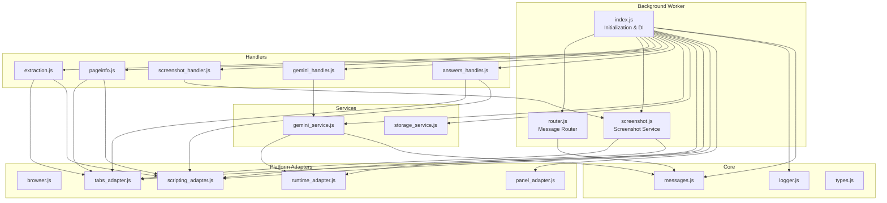

**Diagram sources**
- [index.js](file://assignment-solver/src/background/index.js#L1-L135)
- [router.js](file://assignment-solver/src/background/router.js#L1-L59)
- [screenshot.js](file://assignment-solver/src/background/screenshot.js#L1-L115)
- [extraction.js](file://assignment-solver/src/background/handlers/extraction.js#L1-L102)
- [pageinfo_handler.js](file://assignment-solver/src/background/handlers/pageinfo.js#L1-L112)
- [screenshot_handler.js](file://assignment-solver/src/background/handlers/screenshot.js#L1-L33)
- [gemini_handler.js](file://assignment-solver/src/background/handlers/gemini.js#L1-L35)
- [answers_handler.js](file://assignment-solver/src/background/handlers/answers.js#L1-L77)
- [messages.js](file://assignment-solver/src/core/messages.js#L1-L96)
- [logger.js](file://assignment-solver/src/core/logger.js#L1-L19)
- [runtime_adapter.js](file://assignment-solver/src/platform/runtime.js#L1-L32)
- [tabs_adapter.js](file://assignment-solver/src/platform/tabs.js#L1-L53)
- [scripting_adapter.js](file://assignment-solver/src/platform/scripting.js#L1-L28)
- [panel_adapter.js](file://assignment-solver/src/platform/panel.js#L1-L119)
- [browser.js](file://assignment-solver/src/platform/browser.js#L1-L86)
- [gemini_service.js](file://assignment-solver/src/services/gemini/index.js#L1-L342)
- [storage_service.js](file://assignment-solver/src/services/storage/index.js#L1-L119)

**Section sources**
- [index.js](file://assignment-solver/src/background/index.js#L1-L135)
- [router.js](file://assignment-solver/src/background/router.js#L1-L59)

## Core Components
- Initialization and DI: The background entry point initializes logging, platform adapters, services, and message handlers, then registers the router with the runtime adapter.
- Message Router: Central dispatcher that selects a handler by message type, ensures responses are sent, and handles both sync and async handlers.
- Platform Adapters: Unified wrappers for browser APIs (runtime, tabs, scripting, panel) enabling cross-browser compatibility.
- Services: Business logic abstractions (e.g., Gemini API client, storage).
- Handlers: Message-specific implementations for extraction, screenshot capture, Gemini requests, answer application, and page info retrieval.

**Section sources**
- [index.js](file://assignment-solver/src/background/index.js#L21-L135)
- [router.js](file://assignment-solver/src/background/router.js#L14-L58)
- [runtime_adapter.js](file://assignment-solver/src/platform/runtime.js#L12-L31)
- [tabs_adapter.js](file://assignment-solver/src/platform/tabs.js#L12-L52)
- [scripting_adapter.js](file://assignment-solver/src/platform/scripting.js#L12-L27)
- [panel_adapter.js](file://assignment-solver/src/platform/panel.js#L16-L116)
- [gemini_service.js](file://assignment-solver/src/services/gemini/index.js#L60-L341)
- [storage_service.js](file://assignment-solver/src/services/storage/index.js#L12-L118)

## Architecture Overview
The background worker listens for messages, routes them to handlers, and coordinates with platform adapters and services. Handlers may interact with content scripts via tabs messaging or call services directly.

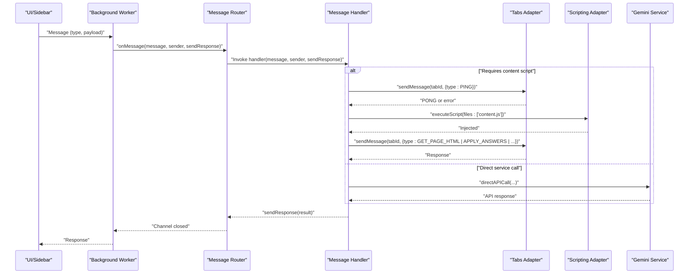

**Diagram sources**
- [index.js](file://assignment-solver/src/background/index.js#L115-L118)
- [router.js](file://assignment-solver/src/background/router.js#L17-L57)
- [extraction.js](file://assignment-solver/src/background/handlers/extraction.js#L18-L99)
- [answers_handler.js](file://assignment-solver/src/background/handlers/answers.js#L17-L74)
- [gemini_handler.js](file://assignment-solver/src/background/handlers/gemini.js#L15-L33)
- [gemini_service.js](file://assignment-solver/src/services/gemini/index.js#L324-L339)
- [tabs_adapter.js](file://assignment-solver/src/platform/tabs.js#L38-L40)
- [scripting_adapter.js](file://assignment-solver/src/platform/scripting.js#L23-L25)

## Detailed Component Analysis

### Service Worker Initialization and Dependency Injection
- Logger creation with contextual prefix.
- Platform adapters created via factories for runtime, tabs, scripting, and panel.
- Services created with adapters injected (e.g., Gemini service with runtime adapter).
- Handlers created with adapters/services injected.
- Router instantiated with handlers and logger, registered with runtime adapter.
- Extension icon click listener opens the panel via panel adapter.
- Panel behavior configured for Chrome.

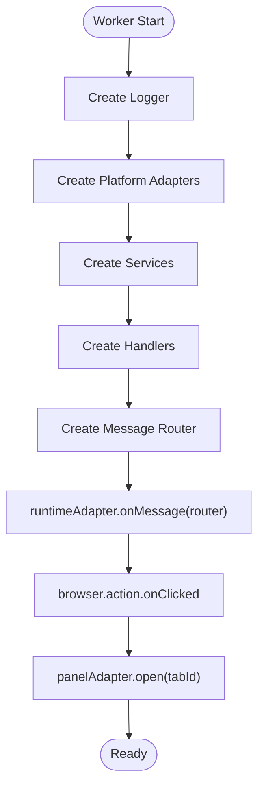

**Diagram sources**
- [index.js](file://assignment-solver/src/background/index.js#L21-L135)
- [runtime_adapter.js](file://assignment-solver/src/platform/runtime.js#L12-L31)
- [panel_adapter.js](file://assignment-solver/src/platform/panel.js#L31-L52)

**Section sources**
- [index.js](file://assignment-solver/src/background/index.js#L21-L135)

### Message Router Implementation
- Selects handler by message.type.
- Ensures sendResponse is always called.
- Handles both synchronous and asynchronous handlers.
- Returns true synchronously for Firefox compatibility.
- Logs errors and ensures response on exceptions.

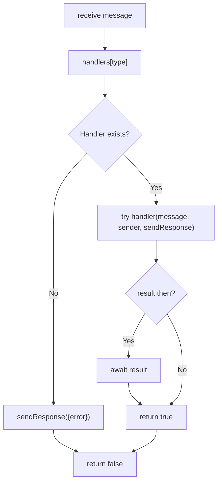

**Diagram sources**
- [router.js](file://assignment-solver/src/background/router.js#L17-L57)

**Section sources**
- [router.js](file://assignment-solver/src/background/router.js#L14-L58)

### Message Types and Retry Utilities
- MESSAGE_TYPES enumerates all supported message types for UI and background communication.
- sendMessageWithRetry adds robustness for transient connection failures, particularly important for Firefox.

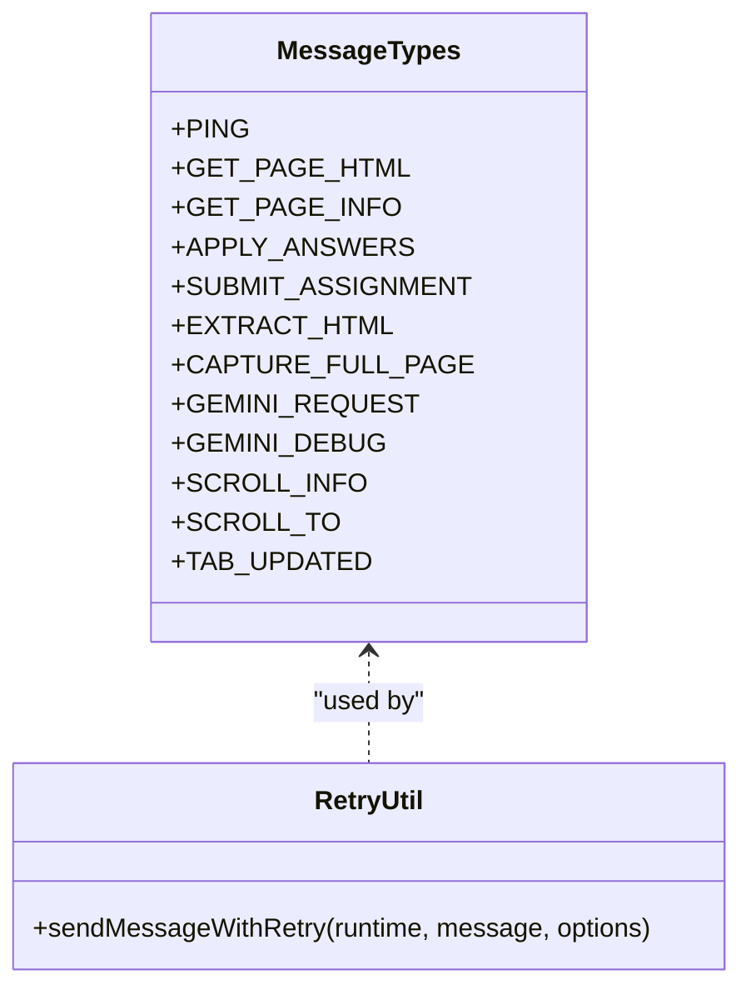

**Diagram sources**
- [messages.js](file://assignment-solver/src/core/messages.js#L5-L23)
- [messages.js](file://assignment-solver/src/core/messages.js#L47-L95)

**Section sources**
- [messages.js](file://assignment-solver/src/core/messages.js#L1-L96)

### Extraction Handler
Responsibilities:
- Resolve target tab (provided or active).
- Ensure content script is loaded by pinging and injecting if needed.
- Request page HTML from content script.
- Return tab/window metadata along with extraction result.

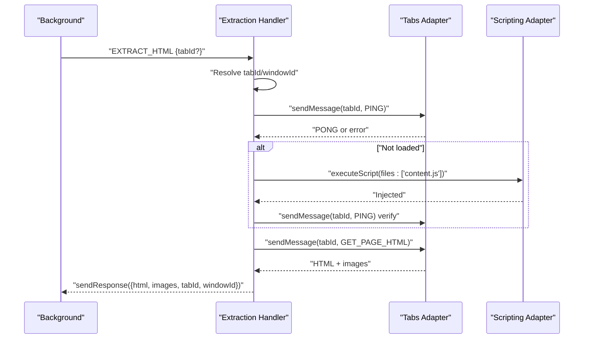

**Diagram sources**
- [extraction.js](file://assignment-solver/src/background/handlers/extraction.js#L18-L99)
- [tabs_adapter.js](file://assignment-solver/src/platform/tabs.js#L38-L40)
- [scripting_adapter.js](file://assignment-solver/src/platform/scripting.js#L23-L25)

**Section sources**
- [extraction.js](file://assignment-solver/src/background/handlers/extraction.js#L1-L102)

### Screenshot Capture Handler
Responsibilities:
- Accepts tabId and windowId.
- Delegates to screenshot service to capture full-page screenshots.
- Returns array of screenshot objects with metadata.

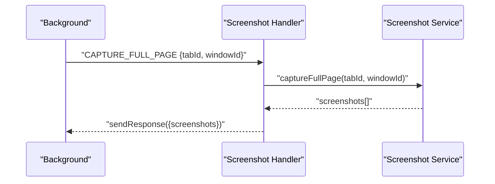

**Diagram sources**
- [screenshot_handler.js](file://assignment-solver/src/background/handlers/screenshot.js#L15-L31)
- [screenshot.js](file://assignment-solver/src/background/screenshot.js#L23-L112)

**Section sources**
- [screenshot_handler.js](file://assignment-solver/src/background/handlers/screenshot.js#L1-L33)
- [screenshot.js](file://assignment-solver/src/background/screenshot.js#L1-L115)

### Screenshot Service
Responsibilities:
- Compute page dimensions via content script.
- Scroll in viewport-sized increments.
- Capture visible tab for each viewport.
- Restore original scroll position.
- Return array of screenshot objects.

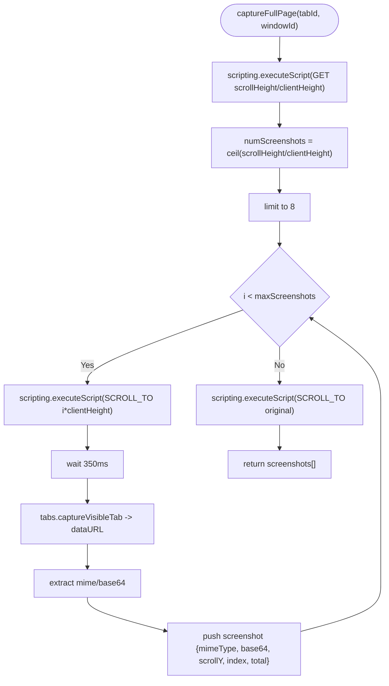

**Diagram sources**
- [screenshot.js](file://assignment-solver/src/background/screenshot.js#L23-L112)

**Section sources**
- [screenshot.js](file://assignment-solver/src/background/screenshot.js#L1-L115)

### Gemini Handler
Responsibilities:
- Receive apiKey, payload, model from message.
- Call service’s directAPICall to avoid Firefox message channel timeouts.
- Return parsed response or error.

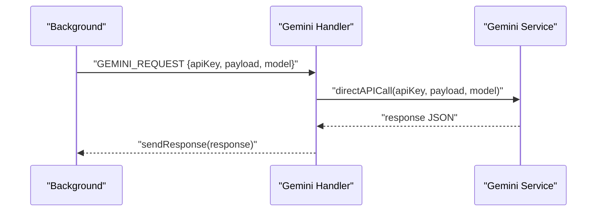

**Diagram sources**
- [gemini_handler.js](file://assignment-solver/src/background/handlers/gemini.js#L15-L33)
- [gemini_service.js](file://assignment-solver/src/services/gemini/index.js#L324-L339)

**Section sources**
- [gemini_handler.js](file://assignment-solver/src/background/handlers/gemini.js#L1-L35)
- [gemini_service.js](file://assignment-solver/src/services/gemini/index.js#L302-L339)

### Answer Application Handler
Responsibilities:
- Resolve target tab (provided or active).
- Ensure content script is loaded by pinging and injecting if needed.
- Forward the original message (APPLY_ANSWERS or SUBMIT_ASSIGNMENT) to the content script.
- Return response or error.

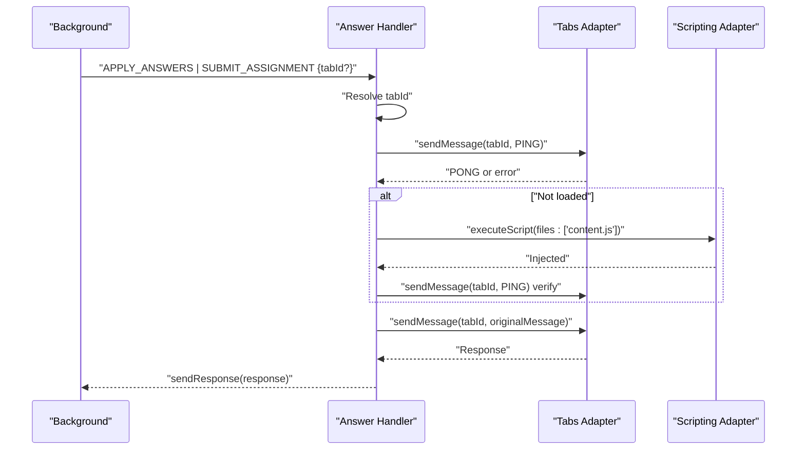

**Diagram sources**
- [answers_handler.js](file://assignment-solver/src/background/handlers/answers.js#L17-L74)
- [tabs_adapter.js](file://assignment-solver/src/platform/tabs.js#L38-L40)
- [scripting_adapter.js](file://assignment-solver/src/platform/scripting.js#L23-L25)

**Section sources**
- [answers_handler.js](file://assignment-solver/src/background/handlers/answers.js#L1-L77)

### Page Info Handler
Responsibilities:
- Determine if current tab is an assignment page (NPTEL/SWAYAM assessment/assignment/quiz).
- Ensure content script is loaded if needed.
- Request page info from content script and return structured metadata.

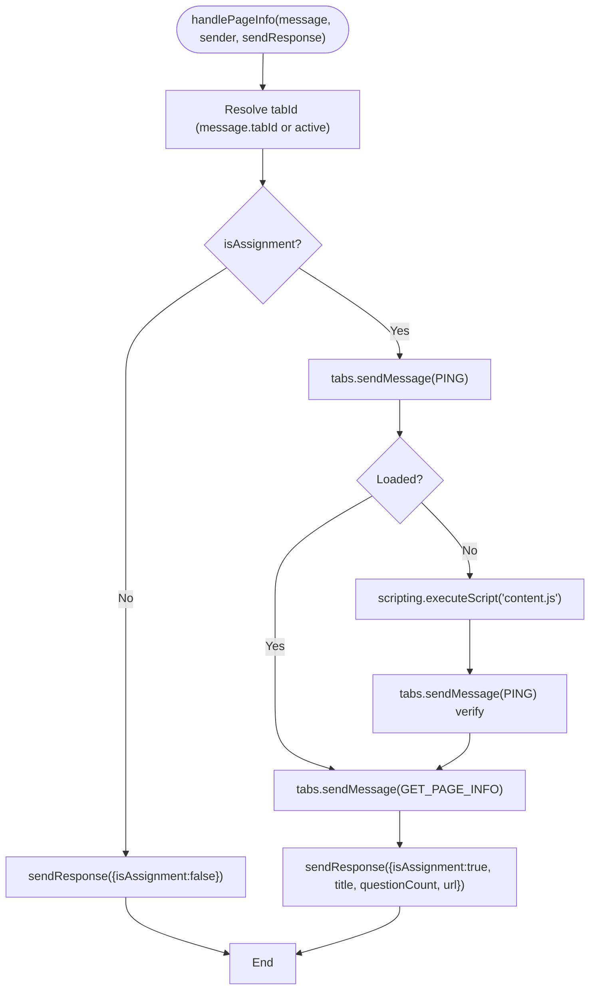

**Diagram sources**
- [pageinfo_handler.js](file://assignment-solver/src/background/handlers/pageinfo.js#L18-L110)
- [tabs_adapter.js](file://assignment-solver/src/platform/tabs.js#L38-L40)
- [scripting_adapter.js](file://assignment-solver/src/platform/scripting.js#L23-L25)

**Section sources**
- [pageinfo_handler.js](file://assignment-solver/src/background/handlers/pageinfo.js#L1-L112)

### Extension Lifecycle Management and Panel Opening
- Icon click listener: On action icon click, opens the panel for the clicked tab.
- Panel behavior: Configures Chrome to open the side panel on action click.
- Cross-browser panel handling: Uses panel adapter to abstract Chrome sidePanel vs Firefox sidebarAction.

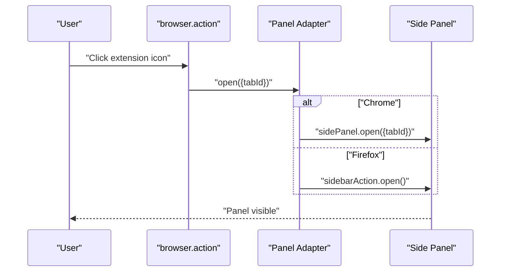

**Diagram sources**
- [index.js](file://assignment-solver/src/background/index.js#L119-L132)
- [panel_adapter.js](file://assignment-solver/src/platform/panel.js#L31-L52)
- [browser.js](file://assignment-solver/src/platform/browser.js#L22-L55)

**Section sources**
- [index.js](file://assignment-solver/src/background/index.js#L119-L132)
- [panel_adapter.js](file://assignment-solver/src/platform/panel.js#L16-L116)
- [browser.js](file://assignment-solver/src/platform/browser.js#L1-L86)

## Dependency Analysis
The background worker composes a cohesive dependency graph:
- index.js orchestrates DI and wiring.
- router.js depends on MESSAGE_TYPES.
- Handlers depend on platform adapters and services.
- Services depend on adapters and core utilities.
- Platform adapters depend on browser polyfill.

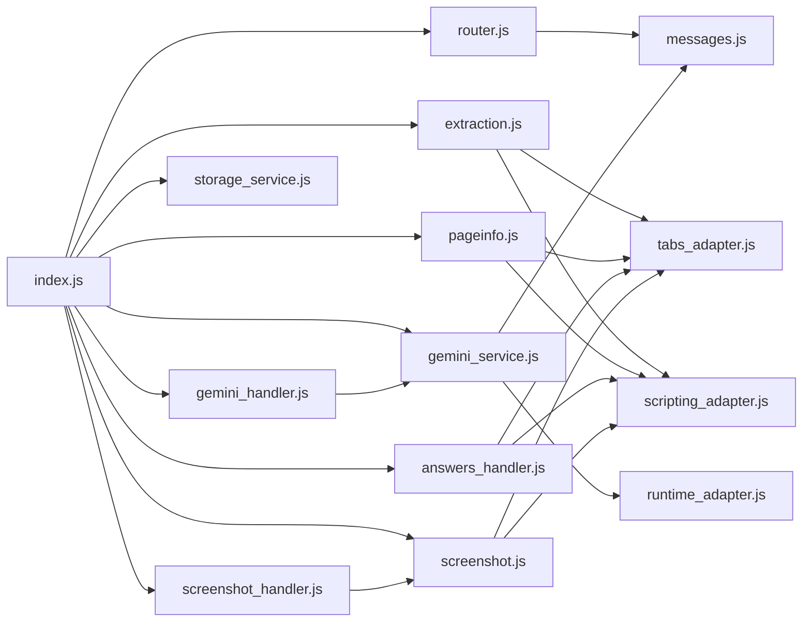

**Diagram sources**
- [index.js](file://assignment-solver/src/background/index.js#L44-L117)
- [router.js](file://assignment-solver/src/background/router.js#L5-L6)
- [extraction.js](file://assignment-solver/src/background/handlers/extraction.js#L15-L16)
- [pageinfo_handler.js](file://assignment-solver/src/background/handlers/pageinfo.js#L15-L16)
- [screenshot_handler.js](file://assignment-solver/src/background/handlers/screenshot.js#L12-L13)
- [gemini_handler.js](file://assignment-solver/src/background/handlers/gemini.js#L12-L13)
- [answers_handler.js](file://assignment-solver/src/background/handlers/answers.js#L14-L15)
- [screenshot.js](file://assignment-solver/src/background/screenshot.js#L13-L14)
- [gemini_service.js](file://assignment-solver/src/services/gemini/index.js#L60-L61)
- [tabs_adapter.js](file://assignment-solver/src/platform/tabs.js#L12-L13)
- [scripting_adapter.js](file://assignment-solver/src/platform/scripting.js#L12-L13)
- [runtime_adapter.js](file://assignment-solver/src/platform/runtime.js#L12-L13)
- [messages.js](file://assignment-solver/src/core/messages.js#L5-L6)

**Section sources**
- [index.js](file://assignment-solver/src/background/index.js#L44-L117)

## Performance Considerations
- Asynchronous message handling: The router keeps channels open for async handlers to prevent Firefox-specific issues.
- Screenshot capture throttling: Limits to a maximum number of screenshots to avoid API rate limits and reduce processing overhead.
- Content script injection delays: Includes deliberate waits for Firefox initialization to improve reliability.
- Retry logic: sendMessageWithRetry mitigates transient connection failures during background initialization.

[No sources needed since this section provides general guidance]

## Troubleshooting Guide
Common issues and resolutions:
- Content script not responding: Handlers inject content script and verify with a ping; ensure the content script is compatible and reload the page if needed.
- No active tab found: Handlers return explicit errors when no active tab is available; switch to a valid tab.
- Panel open/close failures: Panel adapter logs and throws on unavailable APIs; verify browser support for sidePanel or sidebarAction.
- Gemini API errors: Gemini service parses raw responses and throws on parse failures; check API key validity and payload schema.
- Router errors: Router logs handler errors and ensures sendResponse is called; inspect logs for detailed error messages.

**Section sources**
- [extraction.js](file://assignment-solver/src/background/handlers/extraction.js#L35-L38)
- [answers_handler.js](file://assignment-solver/src/background/handlers/answers.js#L27-L30)
- [panel_adapter.js](file://assignment-solver/src/platform/panel.js#L33-L51)
- [gemini_service.js](file://assignment-solver/src/services/gemini/index.js#L208-L216)
- [router.js](file://assignment-solver/src/background/router.js#L42-L56)

## Conclusion
The background service worker employs a clean dependency injection pattern with platform adapters and services abstracting browser APIs and business logic. The message router provides robust dispatching with proper error handling and Firefox compatibility. Handlers encapsulate specific workflows: extraction, screenshot capture, Gemini API requests, answer application, and page info retrieval. The extension lifecycle integrates icon click handling and panel opening with cross-browser support.