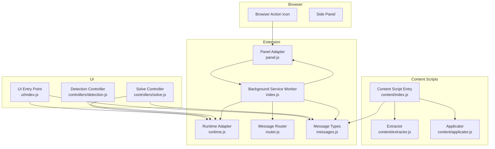
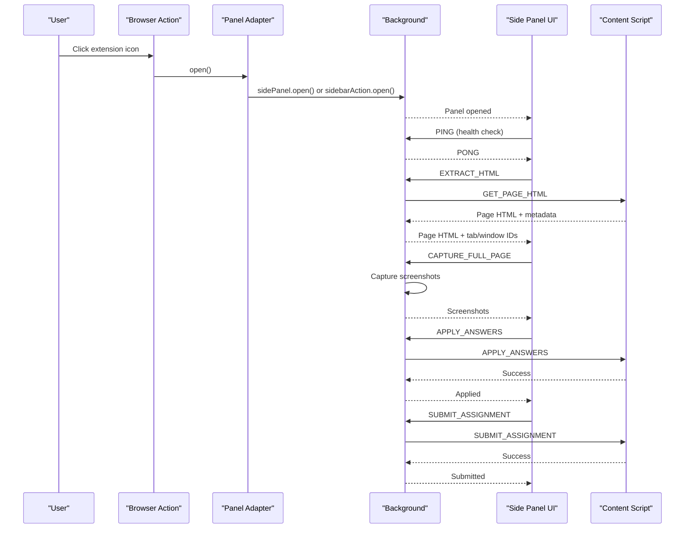
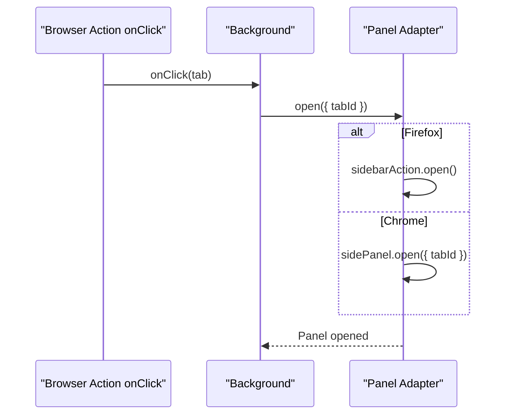
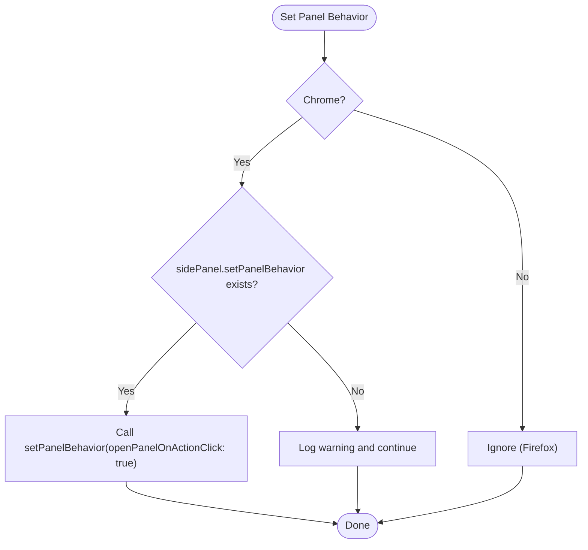
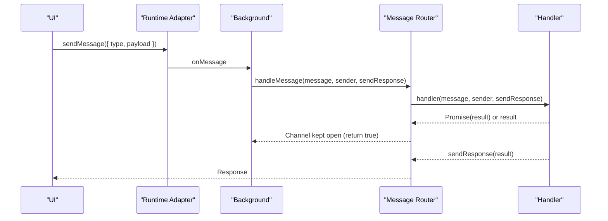
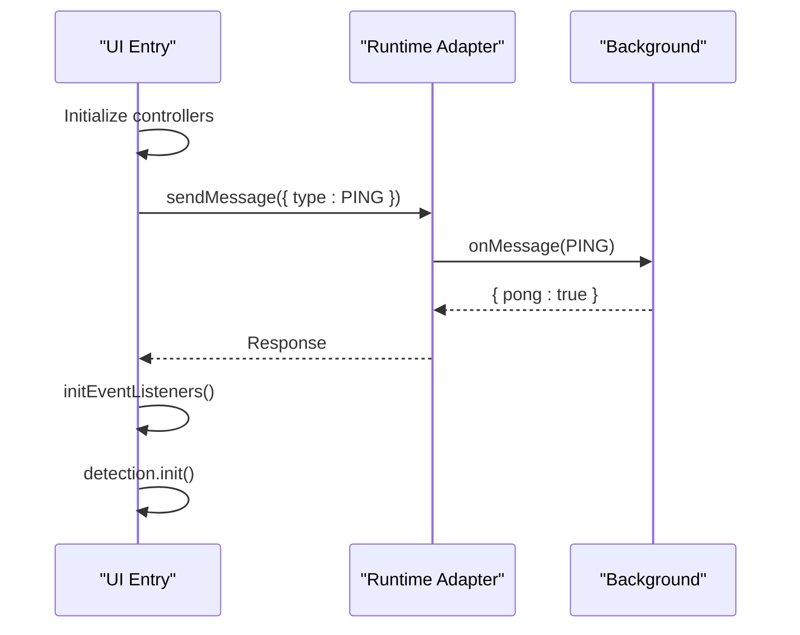
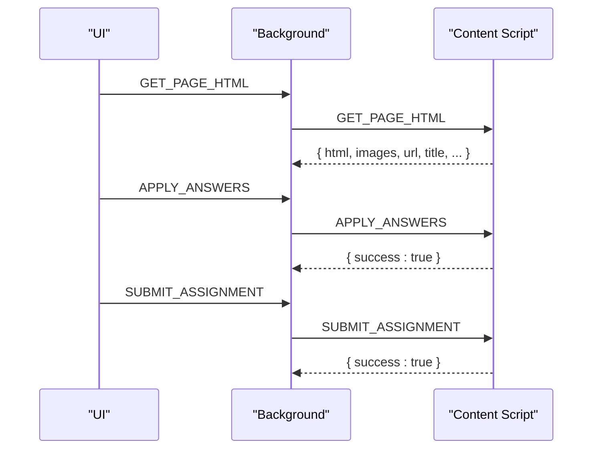
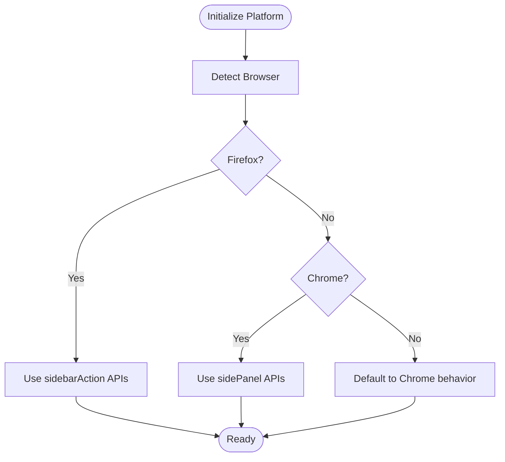
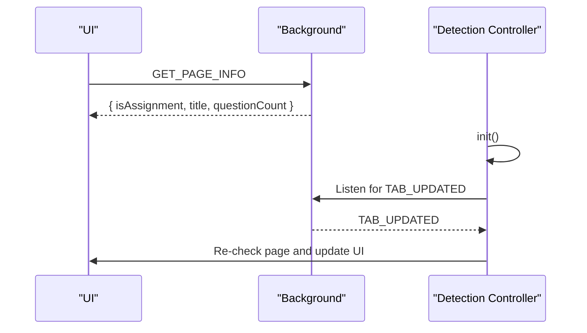
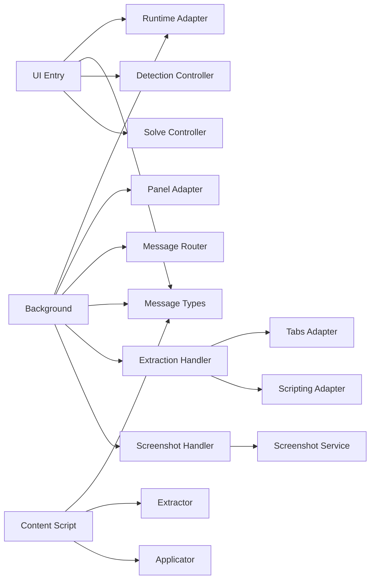

# Extension Lifecycle Management

<cite>
**Referenced Files in This Document**
- [assignment-solver/src/background/index.js](file://assignment-solver/src/background/index.js)
- [assignment-solver/src/platform/panel.js](file://assignment-solver/src/platform/panel.js)
- [assignment-solver/src/platform/browser.js](file://assignment-solver/src/platform/browser.js)
- [assignment-solver/src/platform/runtime.js](file://assignment-solver/src/platform/runtime.js)
- [assignment-solver/src/platform/tabs.js](file://assignment-solver/src/platform/tabs.js)
- [assignment-solver/src/platform/scripting.js](file://assignment-solver/src/platform/scripting.js)
- [assignment-solver/src/background/router.js](file://assignment-solver/src/background/router.js)
- [assignment-solver/src/core/messages.js](file://assignment-solver/src/core/messages.js)
- [assignment-solver/src/ui/index.js](file://assignment-solver/src/ui/index.js)
- [assignment-solver/src/ui/controllers/detection.js](file://assignment-solver/src/ui/controllers/detection.js)
- [assignment-solver/src/ui/controllers/solve.js](file://assignment-solver/src/ui/controllers/solve.js)
- [assignment-solver/src/content/index.js](file://assignment-solver/src/content/index.js)
- [assignment-solver/src/content/extractor.js](file://assignment-solver/src/content/extractor.js)
- [assignment-solver/src/content/applicator.js](file://assignment-solver/src/content/applicator.js)
- [assignment-solver/src/background/handlers/extraction.js](file://assignment-solver/src/background/handlers/extraction.js)
- [assignment-solver/src/background/handlers/screenshot.js](file://assignment-solver/src/background/handlers/screenshot.js)
- [assignment-solver/manifest.json](file://assignment-solver/manifest.json)
</cite>

## Table of Contents
1. [Introduction](#introduction)
2. [Project Structure](#project-structure)
3. [Core Components](#core-components)
4. [Architecture Overview](#architecture-overview)
5. [Detailed Component Analysis](#detailed-component-analysis)
6. [Dependency Analysis](#dependency-analysis)
7. [Performance Considerations](#performance-considerations)
8. [Troubleshooting Guide](#troubleshooting-guide)
9. [Conclusion](#conclusion)

## Introduction
This document explains the extension lifecycle management for the NPTEL Assignment Solver extension. It covers how the browser action icon click opens the side panel, how the background service worker manages runtime event listeners, how the UI initializes and interacts with the background, and how content scripts bridge page DOM interactions with the extension's background. It also documents cross-browser compatibility strategies, panel behavior configuration, and robust error handling for UI interactions.

## Project Structure
The extension follows a modular structure with clear separation of concerns:
- Background service worker orchestrates messaging, panel behavior, and runtime listeners
- Platform adapters abstract browser APIs for cross-browser compatibility
- UI handles initialization, event binding, and user feedback
- Content scripts extract page data and apply answers to forms
- Handlers process messages from the UI and content scripts

**Diagram sources**
- [assignment-solver/src/background/index.js](file://assignment-solver/src/background/index.js#L119-L135)
- [assignment-solver/src/platform/panel.js](file://assignment-solver/src/platform/panel.js#L16-L116)
- [assignment-solver/src/platform/runtime.js](file://assignment-solver/src/platform/runtime.js#L12-L31)
- [assignment-solver/src/background/router.js](file://assignment-solver/src/background/router.js#L14-L58)
- [assignment-solver/src/core/messages.js](file://assignment-solver/src/core/messages.js#L5-L23)
- [assignment-solver/src/ui/index.js](file://assignment-solver/src/ui/index.js#L54-L113)
- [assignment-solver/src/ui/controllers/detection.js](file://assignment-solver/src/ui/controllers/detection.js#L15-L111)
- [assignment-solver/src/ui/controllers/solve.js](file://assignment-solver/src/ui/controllers/solve.js#L21-L778)
- [assignment-solver/src/content/index.js](file://assignment-solver/src/content/index.js#L19-L99)
- [assignment-solver/src/content/extractor.js](file://assignment-solver/src/content/extractor.js#L12-L241)
- [assignment-solver/src/content/applicator.js](file://assignment-solver/src/content/applicator.js#L12-L221)

**Section sources**
- [assignment-solver/src/background/index.js](file://assignment-solver/src/background/index.js#L1-L135)
- [assignment-solver/manifest.json](file://assignment-solver/manifest.json#L1-L44)

## Core Components
- Background service worker: Initializes adapters, registers message handlers, sets up browser action click listener, and configures panel behavior.
- Panel adapter: Unifies Chrome sidePanel and Firefox sidebarAction APIs for opening/closing panels and setting behavior.
- Runtime adapter: Wraps browser.runtime for cross-browser messaging.
- Tabs and Scripting adapters: Manage tab queries, content script injection, and tab-specific messaging.
- Message router: Centralized handler dispatch with proper async response handling for Firefox.
- UI entry point: Waits for background readiness, initializes controllers, and binds UI events.
- Content script: Listens for messages, extracts page data, applies answers, and submits assignments.
- Handlers: Implement specific tasks like HTML extraction, screenshot capture, and answer application.

**Section sources**
- [assignment-solver/src/background/index.js](file://assignment-solver/src/background/index.js#L24-L135)
- [assignment-solver/src/platform/panel.js](file://assignment-solver/src/platform/panel.js#L16-L116)
- [assignment-solver/src/platform/runtime.js](file://assignment-solver/src/platform/runtime.js#L12-L31)
- [assignment-solver/src/platform/tabs.js](file://assignment-solver/src/platform/tabs.js#L12-L52)
- [assignment-solver/src/platform/scripting.js](file://assignment-solver/src/platform/scripting.js#L12-L27)
- [assignment-solver/src/background/router.js](file://assignment-solver/src/background/router.js#L14-L58)
- [assignment-solver/src/ui/index.js](file://assignment-solver/src/ui/index.js#L26-L113)
- [assignment-solver/src/content/index.js](file://assignment-solver/src/content/index.js#L19-L99)

## Architecture Overview
The extension uses a unidirectional messaging model:
- UI sends requests to the background via runtime.sendMessage
- Background routes messages to appropriate handlers
- Handlers may query tabs, inject content scripts, or call services
- Content scripts respond directly to UI requests for page data
- Panel behavior is configured per browser

**Diagram sources**
- [assignment-solver/src/background/index.js](file://assignment-solver/src/background/index.js#L119-L135)
- [assignment-solver/src/platform/panel.js](file://assignment-solver/src/platform/panel.js#L31-L52)
- [assignment-solver/src/ui/index.js](file://assignment-solver/src/ui/index.js#L26-L51)
- [assignment-solver/src/content/index.js](file://assignment-solver/src/content/index.js#L32-L86)
- [assignment-solver/src/background/handlers/extraction.js](file://assignment-solver/src/background/handlers/extraction.js#L18-L100)
- [assignment-solver/src/background/handlers/screenshot.js](file://assignment-solver/src/background/handlers/screenshot.js#L15-L32)

## Detailed Component Analysis

### Browser Action Integration and Panel Opening
- The background listens for browser action clicks and opens the panel via the panel adapter.
- Panel behavior is configured for Chrome to open the panel on action click.
- The panel adapter abstracts differences between Chrome sidePanel and Firefox sidebarAction.

**Diagram sources**
- [assignment-solver/src/background/index.js](file://assignment-solver/src/background/index.js#L120-L129)
- [assignment-solver/src/platform/panel.js](file://assignment-solver/src/platform/panel.js#L31-L52)

**Section sources**
- [assignment-solver/src/background/index.js](file://assignment-solver/src/background/index.js#L119-L135)
- [assignment-solver/src/platform/panel.js](file://assignment-solver/src/platform/panel.js#L16-L116)

### Panel Behavior Configuration (Chrome)
- The background sets panel behavior to open on action click for Chrome.
- Firefox does not expose a direct close API for sidePanel; closing is handled implicitly.

**Diagram sources**
- [assignment-solver/src/background/index.js](file://assignment-solver/src/background/index.js#L131-L133)
- [assignment-solver/src/platform/panel.js](file://assignment-solver/src/platform/panel.js#L80-L92)

**Section sources**
- [assignment-solver/src/background/index.js](file://assignment-solver/src/background/index.js#L131-L133)
- [assignment-solver/src/platform/panel.js](file://assignment-solver/src/platform/panel.js#L73-L92)

### Runtime Event Listeners and Message Routing
- The background registers a message router that dispatches to handlers based on message type.
- Handlers return promises and ensure sendResponse is called to avoid hanging message ports.
- Firefox requires returning true synchronously to keep the message channel open for async responses.

**Diagram sources**
- [assignment-solver/src/platform/runtime.js](file://assignment-solver/src/platform/runtime.js#L19-L29)
- [assignment-solver/src/background/router.js](file://assignment-solver/src/background/router.js#L17-L57)
- [assignment-solver/src/core/messages.js](file://assignment-solver/src/core/messages.js#L5-L23)

**Section sources**
- [assignment-solver/src/background/router.js](file://assignment-solver/src/background/router.js#L14-L58)
- [assignment-solver/src/platform/runtime.js](file://assignment-solver/src/platform/runtime.js#L12-L31)

### UI Initialization and Health Checks
- The side panel waits for the background to be ready using a PING mechanism with exponential backoff.
- Controllers initialize event listeners and bind UI actions to background handlers.

**Diagram sources**
- [assignment-solver/src/ui/index.js](file://assignment-solver/src/ui/index.js#L26-L51)
- [assignment-solver/src/ui/index.js](file://assignment-solver/src/ui/index.js#L100-L113)
- [assignment-solver/src/ui/controllers/detection.js](file://assignment-solver/src/ui/controllers/detection.js#L95-L108)

**Section sources**
- [assignment-solver/src/ui/index.js](file://assignment-solver/src/ui/index.js#L26-L113)
- [assignment-solver/src/ui/controllers/detection.js](file://assignment-solver/src/ui/controllers/detection.js#L15-L111)

### Content Script Extraction and Answer Application
- The content script listens for messages and performs page extraction, scrolling info retrieval, and answer/application/submission.
- It responds to Gemini debug messages and logs to the page console for visibility.

**Diagram sources**
- [assignment-solver/src/content/index.js](file://assignment-solver/src/content/index.js#L20-L96)
- [assignment-solver/src/content/extractor.js](file://assignment-solver/src/content/extractor.js#L21-L96)
- [assignment-solver/src/content/applicator.js](file://assignment-solver/src/content/applicator.js#L21-L216)

**Section sources**
- [assignment-solver/src/content/index.js](file://assignment-solver/src/content/index.js#L19-L99)
- [assignment-solver/src/content/extractor.js](file://assignment-solver/src/content/extractor.js#L12-L241)
- [assignment-solver/src/content/applicator.js](file://assignment-solver/src/content/applicator.js#L12-L221)

### Cross-Browser Compatibility and API Detection
- The browser adapter detects Chrome vs Firefox and exposes safe API accessors.
- Panel adapter checks availability of sidePanel/sideBarAction APIs and falls back gracefully.

**Diagram sources**
- [assignment-solver/src/platform/browser.js](file://assignment-solver/src/platform/browser.js#L22-L55)
- [assignment-solver/src/platform/panel.js](file://assignment-solver/src/platform/panel.js#L98-L114)

**Section sources**
- [assignment-solver/src/platform/browser.js](file://assignment-solver/src/platform/browser.js#L16-L86)
- [assignment-solver/src/platform/panel.js](file://assignment-solver/src/platform/panel.js#L16-L116)

### Relationship Between Background Events and UI Triggers
- UI triggers (solve, settings, detection) send messages to the background.
- Background handlers may inject content scripts, query tabs, and coordinate with content scripts.
- UI listens for tab updates and re-detects assignments when the background signals.

**Diagram sources**
- [assignment-solver/src/ui/controllers/detection.js](file://assignment-solver/src/ui/controllers/detection.js#L95-L108)
- [assignment-solver/src/ui/controllers/solve.js](file://assignment-solver/src/ui/controllers/solve.js#L569-L583)

**Section sources**
- [assignment-solver/src/ui/controllers/detection.js](file://assignment-solver/src/ui/controllers/detection.js#L15-L111)
- [assignment-solver/src/ui/controllers/solve.js](file://assignment-solver/src/ui/controllers/solve.js#L569-L583)

## Dependency Analysis
The extension exhibits strong modularity with clear dependency boundaries:
- Background depends on platform adapters and message router
- UI depends on runtime adapter and controllers
- Content script depends on extractor and applicator
- Handlers depend on tabs/scripting adapters and services

**Diagram sources**
- [assignment-solver/src/background/index.js](file://assignment-solver/src/background/index.js#L24-L117)
- [assignment-solver/src/ui/index.js](file://assignment-solver/src/ui/index.js#L54-L113)
- [assignment-solver/src/content/index.js](file://assignment-solver/src/content/index.js#L19-L99)
- [assignment-solver/src/background/handlers/extraction.js](file://assignment-solver/src/background/handlers/extraction.js#L15-L102)
- [assignment-solver/src/background/handlers/screenshot.js](file://assignment-solver/src/background/handlers/screenshot.js#L12-L33)

**Section sources**
- [assignment-solver/src/background/index.js](file://assignment-solver/src/background/index.js#L24-L117)
- [assignment-solver/src/ui/index.js](file://assignment-solver/src/ui/index.js#L54-L113)
- [assignment-solver/src/content/index.js](file://assignment-solver/src/content/index.js#L19-L99)

## Performance Considerations
- Message retries: The UI uses a retry mechanism with exponential backoff for transient connection failures, particularly important for Firefox.
- Content script injection delays: The background waits for content scripts to initialize before proceeding, with extra delays for Firefox.
- Token limit handling: The solve controller splits large inputs recursively to avoid MAX_TOKENS errors, merging results afterward.
- Progress reporting: UI shows determinate progress where possible and indeterminate progress for long-running steps.

[No sources needed since this section provides general guidance]

## Troubleshooting Guide
Common issues and their handling:
- Background not ready: The UI performs health checks with retries; if unsuccessful, it warns and continues.
- Content script injection failures: The background attempts injection and verifies responsiveness; errors suggest refreshing the page.
- Panel open/close failures: Panel adapter logs errors and throws exceptions; Firefox lacks a direct close API.
- Message port closures: Router ensures sendResponse is called and keeps channels open for Firefox-compatible async responses.
- Gemini debug relay: UI relays debug payloads to the background and content script; failures are logged and ignored to prevent blocking.

**Section sources**
- [assignment-solver/src/ui/index.js](file://assignment-solver/src/ui/index.js#L26-L51)
- [assignment-solver/src/background/handlers/extraction.js](file://assignment-solver/src/background/handlers/extraction.js#L45-L75)
- [assignment-solver/src/platform/panel.js](file://assignment-solver/src/platform/panel.js#L48-L51)
- [assignment-solver/src/background/router.js](file://assignment-solver/src/background/router.js#L28-L57)
- [assignment-solver/src/ui/controllers/solve.js](file://assignment-solver/src/ui/controllers/solve.js#L124-L136)

## Conclusion
The extension implements a robust lifecycle management system:
- Icon clicks reliably open the panel via unified adapters
- Runtime listeners route messages efficiently with Firefox-compliant async handling
- UI initializes safely with health checks and retry logic
- Content scripts bridge page DOM interactions with background orchestration
- Cross-browser compatibility is achieved through API detection and abstraction
- Error handling is comprehensive, with logging and graceful degradation

[No sources needed since this section summarizes without analyzing specific files]