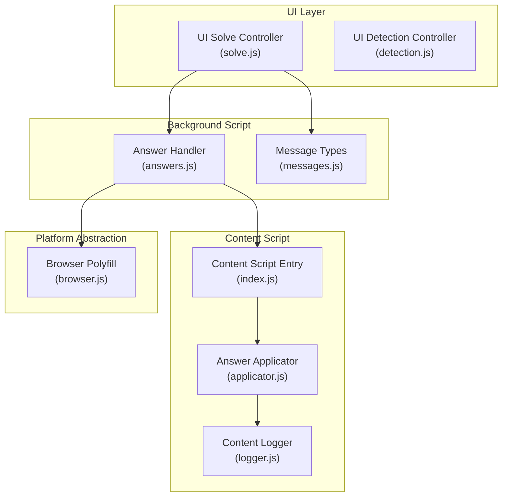
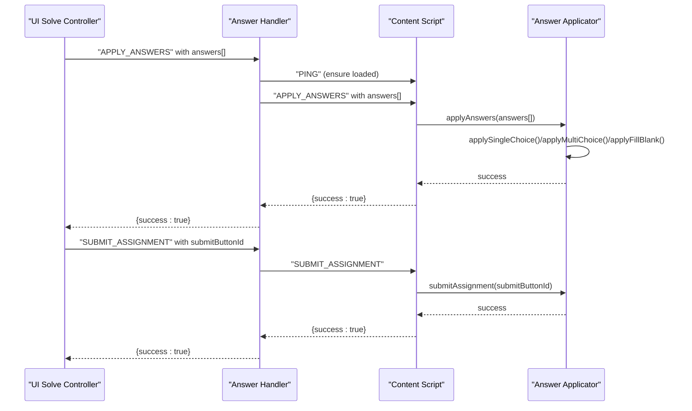
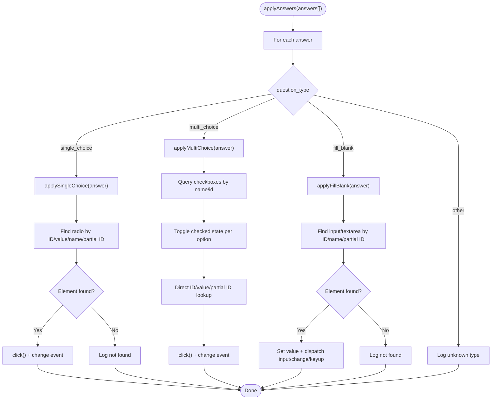
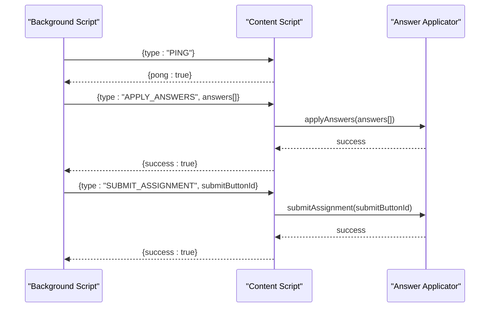
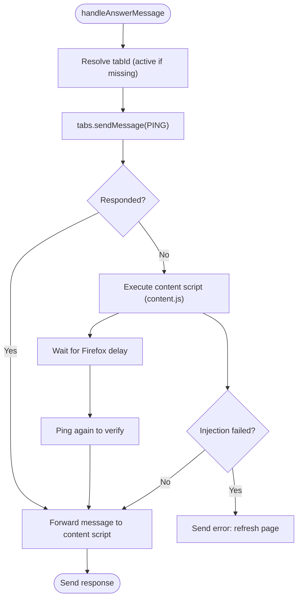
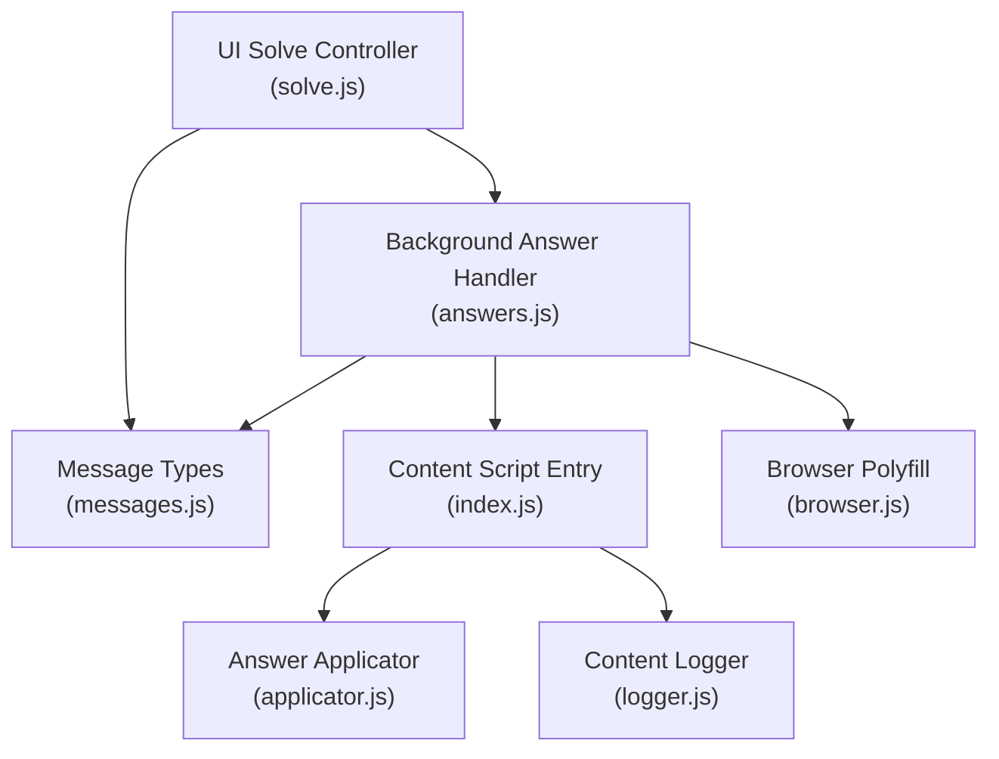

# Answer Application Handler

<cite>
**Referenced Files in This Document**
- [applicator.js](file://assignment-solver/src/content/applicator.js)
- [index.js](file://assignment-solver/src/content/index.js)
- [answers.js](file://assignment-solver/src/background/handlers/answers.js)
- [messages.js](file://assignment-solver/src/core/messages.js)
- [types.js](file://assignment-solver/src/core/types.js)
- [browser.js](file://assignment-solver/src/platform/browser.js)
- [logger.js](file://assignment-solver/src/content/logger.js)
- [solve.js](file://assignment-solver/src/ui/controllers/solve.js)
- [detection.js](file://assignment-solver/src/ui/controllers/detection.js)
- [utils.js](file://assignment-solver/src/ui/utils.js)
</cite>

## Table of Contents
1. [Introduction](#introduction)
2. [Project Structure](#project-structure)
3. [Core Components](#core-components)
4. [Architecture Overview](#architecture-overview)
5. [Detailed Component Analysis](#detailed-component-analysis)
6. [Dependency Analysis](#dependency-analysis)
7. [Performance Considerations](#performance-considerations)
8. [Troubleshooting Guide](#troubleshooting-guide)
9. [Conclusion](#conclusion)

## Introduction
This document provides comprehensive technical documentation for the Answer Application Handler, which applies AI-generated answers to form elements on assignment pages. It covers supported question types, answer format validation, DOM manipulation techniques, user interaction simulation, error handling, and cross-browser compatibility across different assignment interfaces.

## Project Structure
The Answer Application Handler resides in the content script layer of the assignment-solver extension. It communicates with the background script via message passing and interacts directly with the page DOM to apply answers and submit assignments.

**Diagram sources**
- [solve.js](file://assignment-solver/src/ui/controllers/solve.js#L1-L200)
- [detection.js](file://assignment-solver/src/ui/controllers/detection.js#L1-L111)
- [answers.js](file://assignment-solver/src/background/handlers/answers.js#L1-L77)
- [messages.js](file://assignment-solver/src/core/messages.js#L1-L96)
- [index.js](file://assignment-solver/src/content/index.js#L1-L99)
- [applicator.js](file://assignment-solver/src/content/applicator.js#L1-L221)
- [logger.js](file://assignment-solver/src/content/logger.js#L1-L20)
- [browser.js](file://assignment-solver/src/platform/browser.js#L1-L86)

**Section sources**
- [index.js](file://assignment-solver/src/content/index.js#L1-L99)
- [applicator.js](file://assignment-solver/src/content/applicator.js#L1-L221)
- [answers.js](file://assignment-solver/src/background/handlers/answers.js#L1-L77)
- [messages.js](file://assignment-solver/src/core/messages.js#L1-L96)
- [browser.js](file://assignment-solver/src/platform/browser.js#L1-L86)

## Core Components
- Answer Applicator: Applies answers to single-choice, multiple-choice, and fill-in-the-blank form elements. It simulates user interactions by triggering click events and input/change events.
- Content Script Entry: Receives messages from the background script, initializes services, and forwards commands to the applicator.
- Answer Handler: Manages content script injection, message routing, and error handling for answer application and submission.
- Message System: Defines standardized message types for communication between UI, background, and content scripts.
- Cross-Browser Compatibility: Uses webextension-polyfill for unified browser APIs and includes Firefox-specific initialization delays.

**Section sources**
- [applicator.js](file://assignment-solver/src/content/applicator.js#L12-L221)
- [index.js](file://assignment-solver/src/content/index.js#L15-L99)
- [answers.js](file://assignment-solver/src/background/handlers/answers.js#L14-L77)
- [messages.js](file://assignment-solver/src/core/messages.js#L5-L23)
- [browser.js](file://assignment-solver/src/platform/browser.js#L7-L16)

## Architecture Overview
The handler follows a message-driven architecture:
- UI controllers trigger actions (solve, apply answers, submit).
- Background answer handler ensures the content script is loaded and forwards messages.
- Content script applies answers to the DOM and triggers submission.

**Diagram sources**
- [solve.js](file://assignment-solver/src/ui/controllers/solve.js#L189-L200)
- [answers.js](file://assignment-solver/src/background/handlers/answers.js#L17-L70)
- [index.js](file://assignment-solver/src/content/index.js#L67-L78)
- [applicator.js](file://assignment-solver/src/content/applicator.js#L21-L48)
- [applicator.js](file://assignment-solver/src/content/applicator.js#L201-L216)

## Detailed Component Analysis

### Answer Applicator
The applicator encapsulates three primary operations: single-choice selection, multi-choice selection, and fill-in-the-blank text input. It validates inputs, performs robust DOM queries, and simulates realistic user interactions.

- Supported question types:
  - Single choice (radio button)
  - Multi choice (checkbox)
  - Fill in the blank (input/textarea)

- Answer format validation:
  - Single choice requires answer_option_id.
  - Multi choice accepts a single ID or an array of IDs.
  - Fill in the blank requires answer_text and optionally answer_option_id for targeting.

- DOM manipulation techniques:
  - Radio buttons: click() followed by change event dispatch.
  - Checkboxes: toggle click() and change event dispatch per option.
  - Text inputs: set value, dispatch input, change, and keyup events.

- Dynamic element detection:
  - Attempts lookup by ID, value attribute, name containing question ID, and partial ID matches.
  - For fill blanks, searches across input and textarea elements within question containers.

- User interaction simulation:
  - Dispatches synthetic events to trigger change handlers and validation logic.
  - Ensures UI reflects selections immediately.

**Diagram sources**
- [applicator.js](file://assignment-solver/src/content/applicator.js#L21-L48)
- [applicator.js](file://assignment-solver/src/content/applicator.js#L54-L100)
- [applicator.js](file://assignment-solver/src/content/applicator.js#L106-L148)
- [applicator.js](file://assignment-solver/src/content/applicator.js#L154-L194)

**Section sources**
- [applicator.js](file://assignment-solver/src/content/applicator.js#L12-L221)

### Content Script Entry
The content script initializes logging, creates extractor and applicator instances, and listens for messages from the background script. It supports health checks, page extraction, scrolling, and answer application/submission.

- Message handling:
  - PING: responds to health checks.
  - GET_PAGE_HTML: extracts page HTML and images.
  - GET_PAGE_INFO: quick assignment detection metadata.
  - APPLY_ANSWERS: delegates to applicator.
  - SUBMIT_ASSIGNMENT: triggers submission with fallback selectors.

- Cross-browser compatibility:
  - Uses webextension-polyfill for unified browser APIs.
  - Includes Firefox-specific initialization delay in the answer handler.

**Diagram sources**
- [index.js](file://assignment-solver/src/content/index.js#L19-L96)
- [applicator.js](file://assignment-solver/src/content/applicator.js#L201-L216)

**Section sources**
- [index.js](file://assignment-solver/src/content/index.js#L12-L99)

### Answer Handler (Background)
The background answer handler manages content script lifecycle and message routing. It ensures the content script is loaded, handles injection if missing, and forwards messages with error handling.

- Content script injection:
  - Sends PING to verify readiness.
  - Executes content script if missing.
  - Applies extended delay for Firefox initialization.

- Error handling:
  - Catches injection failures and instructs users to refresh the page.
  - Forwards errors from content script responses.

**Diagram sources**
- [answers.js](file://assignment-solver/src/background/handlers/answers.js#L17-L75)

**Section sources**
- [answers.js](file://assignment-solver/src/background/handlers/answers.js#L14-L77)

### Message Types and Validation
Standardized message types define the contract between UI, background, and content scripts. The applicator validates answer arrays and individual answer objects before applying.

- Message types:
  - PING, GET_PAGE_HTML, GET_PAGE_INFO, APPLY_ANSWERS, SUBMIT_ASSIGNMENT.

- Answer validation:
  - applyAnswers checks for array presence and iterates with per-answer error handling.
  - Single/multi/fill handlers validate required fields and log missing data.

**Section sources**
- [messages.js](file://assignment-solver/src/core/messages.js#L5-L23)
- [applicator.js](file://assignment-solver/src/content/applicator.js#L21-L48)
- [types.js](file://assignment-solver/src/core/types.js#L22-L33)

### Cross-Browser Compatibility
The extension targets both Chrome and Firefox using webextension-polyfill. The answer handler includes a deliberate delay for Firefox to ensure the content script initializes before sending messages.

- Browser detection:
  - detectBrowser() identifies Firefox vs Chrome.
  - isFirefox()/isChrome() helpers for conditional logic.

- Initialization differences:
  - Firefox receives a longer wait after content script injection.

**Section sources**
- [browser.js](file://assignment-solver/src/platform/browser.js#L22-L55)
- [answers.js](file://assignment-solver/src/background/handlers/answers.js#L43-L53)

## Dependency Analysis
The applicator depends on the content script environment and browser APIs. The content script depends on the applicator and logger. The background answer handler depends on tabs and scripting adapters and coordinates with the content script.

**Diagram sources**
- [answers.js](file://assignment-solver/src/background/handlers/answers.js#L14-L77)
- [index.js](file://assignment-solver/src/content/index.js#L15-L17)
- [applicator.js](file://assignment-solver/src/content/applicator.js#L12-L14)
- [messages.js](file://assignment-solver/src/core/messages.js#L5-L23)
- [browser.js](file://assignment-solver/src/platform/browser.js#L7-L16)
- [solve.js](file://assignment-solver/src/ui/controllers/solve.js#L1-L32)

**Section sources**
- [answers.js](file://assignment-solver/src/background/handlers/answers.js#L14-L77)
- [index.js](file://assignment-solver/src/content/index.js#L15-L17)
- [applicator.js](file://assignment-solver/src/content/applicator.js#L12-L14)
- [messages.js](file://assignment-solver/src/core/messages.js#L5-L23)
- [browser.js](file://assignment-solver/src/platform/browser.js#L7-L16)
- [solve.js](file://assignment-solver/src/ui/controllers/solve.js#L1-L32)

## Performance Considerations
- DOM queries are optimized with targeted selectors and fallbacks to reduce unnecessary traversal.
- Synthetic events are dispatched minimally and only when elements are found.
- Multi-choice processing iterates through discovered checkboxes and toggles only when needed.
- Logging is used to avoid repeated expensive operations and to surface issues early.

## Troubleshooting Guide
Common issues and resolutions:
- Content script not loaded:
  - The answer handler attempts injection and verifies with PING. If still failing, instruct users to refresh the page.
- Answers not applied:
  - Verify answer arrays are present and properly formatted. Check logs for unknown question types or missing IDs.
- Submission fails:
  - Confirm submit button selectors are matched. The applicator tries multiple fallbacks if the explicit ID is unavailable.
- Cross-browser delays:
  - Firefox may require additional initialization time. The handler includes a delay to mitigate timing issues.

**Section sources**
- [answers.js](file://assignment-solver/src/background/handlers/answers.js#L34-L61)
- [applicator.js](file://assignment-solver/src/content/applicator.js#L21-L48)
- [applicator.js](file://assignment-solver/src/content/applicator.js#L201-L216)
- [browser.js](file://assignment-solver/src/platform/browser.js#L43-L55)

## Conclusion
The Answer Application Handler provides a robust, cross-browser compatible mechanism to apply AI-generated answers to assignment forms. It supports multiple question types, validates answer formats, simulates realistic user interactions, and includes comprehensive error handling and logging. The modular architecture ensures maintainability and extensibility across diverse assignment interfaces.