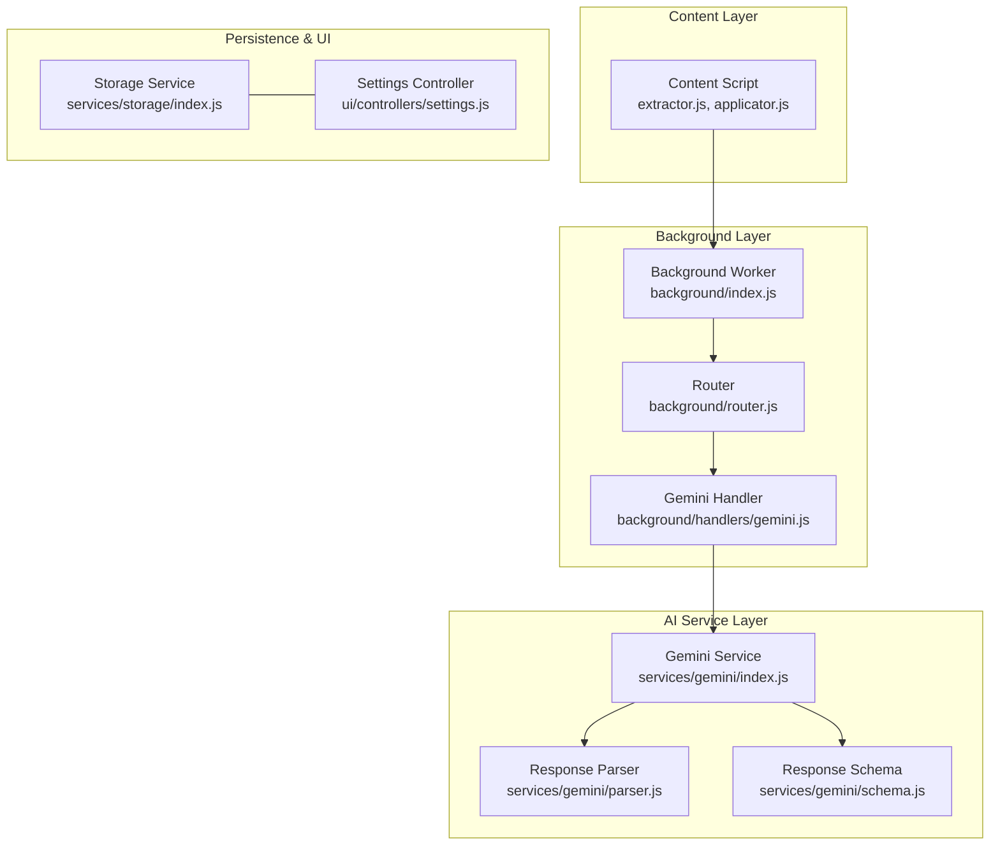
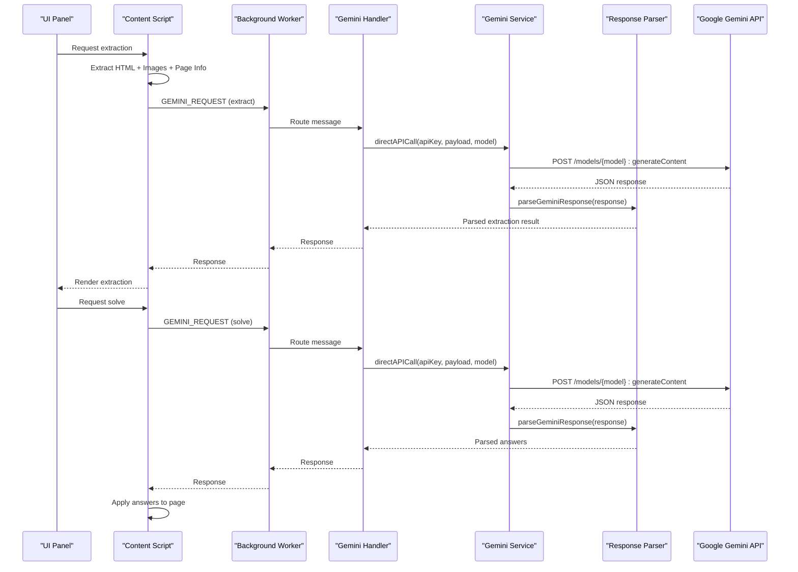
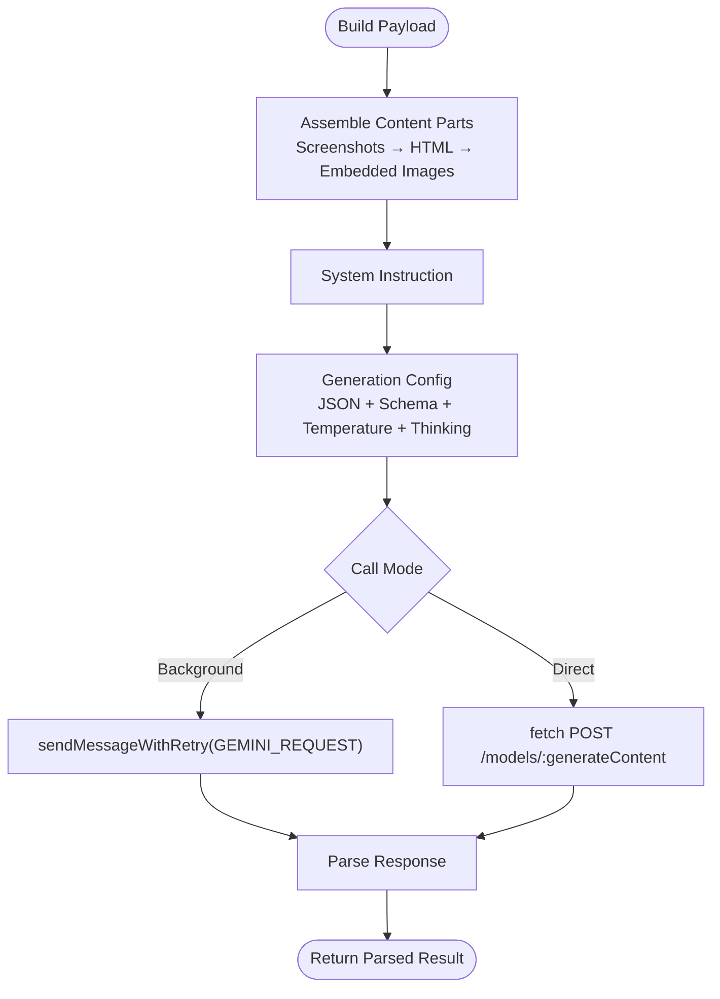
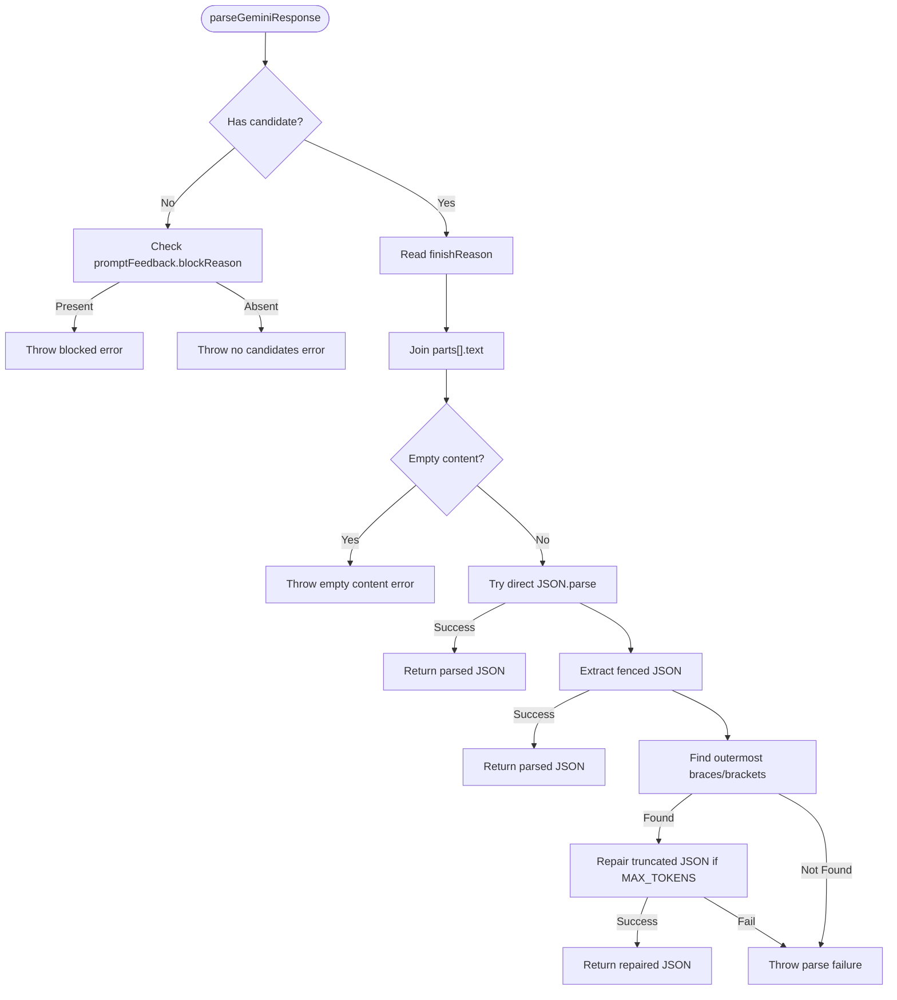
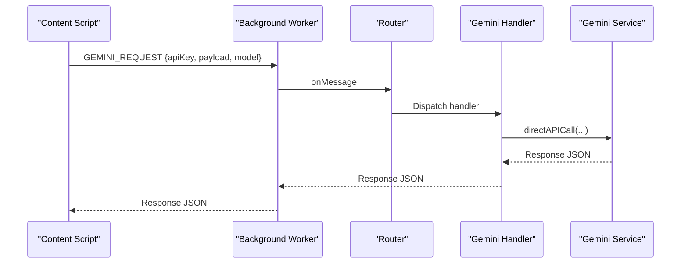
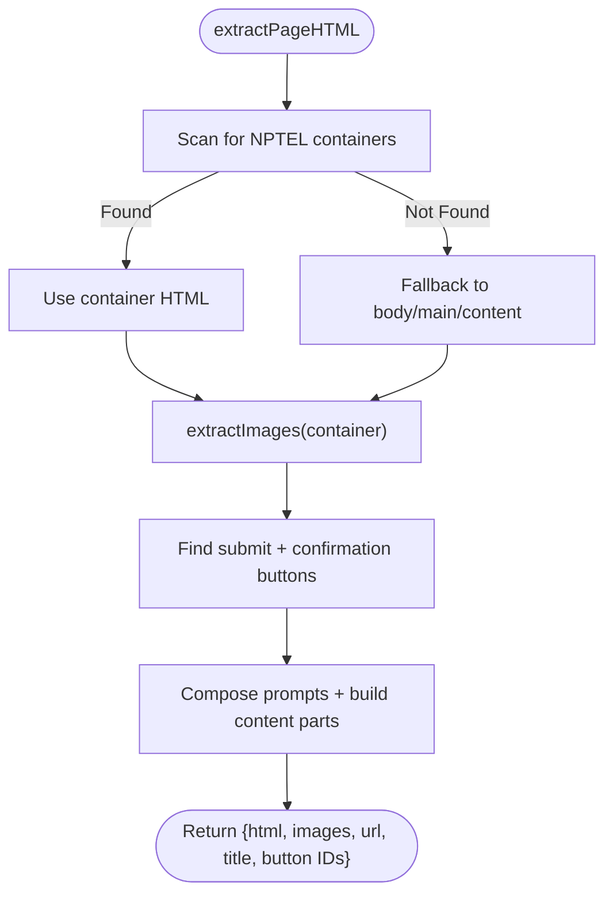
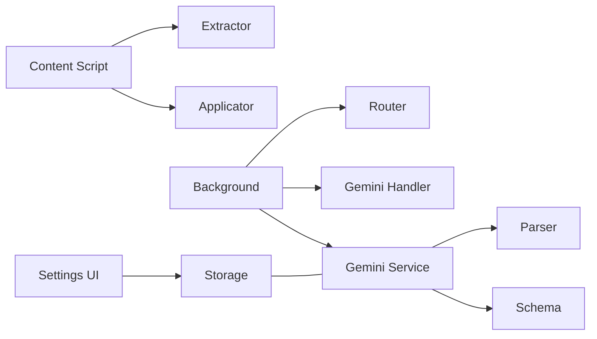

# Gemini API Handler

<cite>
**Referenced Files in This Document**
- [index.js](file://assignment-solver/src/services/gemini/index.js)
- [parser.js](file://assignment-solver/src/services/gemini/parser.js)
- [schema.js](file://assignment-solver/src/services/gemini/schema.js)
- [gemini.js](file://assignment-solver/src/background/handlers/gemini.js)
- [messages.js](file://assignment-solver/src/core/messages.js)
- [index.js](file://assignment-solver/src/background/index.js)
- [router.js](file://assignment-solver/src/background/router.js)
- [index.js](file://assignment-solver/src/content/index.js)
- [extractor.js](file://assignment-solver/src/content/extractor.js)
- [applicator.js](file://assignment-solver/src/content/applicator.js)
- [storage/index.js](file://assignment-solver/src/services/storage/index.js)
- [settings.js](file://assignment-solver/src/ui/controllers/settings.js)
- [types.js](file://assignment-solver/src/core/types.js)
</cite>

## Table of Contents
1. [Introduction](#introduction)
2. [Project Structure](#project-structure)
3. [Core Components](#core-components)
4. [Architecture Overview](#architecture-overview)
5. [Detailed Component Analysis](#detailed-component-analysis)
6. [Dependency Analysis](#dependency-analysis)
7. [Performance Considerations](#performance-considerations)
8. [Troubleshooting Guide](#troubleshooting-guide)
9. [Conclusion](#conclusion)

## Introduction
This document explains the Gemini API handler used by the NPTEL Assignment Solver extension. It covers the AI question analysis workflow, API request formatting, response parsing, error handling, integration with Google’s Gemini API, request throttling and rate-limiting considerations, question preprocessing, response validation, error recovery mechanisms, and API key management and security considerations.

## Project Structure
The Gemini integration spans three layers:
- Content script: extracts page HTML and images, prepares prompts, and applies answers.
- Background service worker: routes messages, invokes the Gemini service, and performs direct API calls.
- Gemini service: builds requests, sends them to Google’s API, parses responses, and validates outputs.

**Diagram sources**
- [index.js](file://assignment-solver/src/content/index.js#L1-L99)
- [extractor.js](file://assignment-solver/src/content/extractor.js#L1-L241)
- [applicator.js](file://assignment-solver/src/content/applicator.js#L1-L221)
- [index.js](file://assignment-solver/src/background/index.js#L1-L135)
- [router.js](file://assignment-solver/src/background/router.js#L1-L59)
- [gemini.js](file://assignment-solver/src/background/handlers/gemini.js#L1-L35)
- [index.js](file://assignment-solver/src/services/gemini/index.js#L1-L342)
- [parser.js](file://assignment-solver/src/services/gemini/parser.js#L1-L153)
- [schema.js](file://assignment-solver/src/services/gemini/schema.js#L1-L136)
- [storage/index.js](file://assignment-solver/src/services/storage/index.js#L1-L119)
- [settings.js](file://assignment-solver/src/ui/controllers/settings.js#L1-L128)

**Section sources**
- [index.js](file://assignment-solver/src/content/index.js#L1-L99)
- [index.js](file://assignment-solver/src/background/index.js#L1-L135)
- [index.js](file://assignment-solver/src/services/gemini/index.js#L1-L342)

## Core Components
- Gemini Service: Builds content parts, constructs payloads, selects models and reasoning budgets, and calls the API either via background messaging or directly.
- Response Parser: Validates candidates, handles finish reasons, and extracts JSON from raw text, including fenced code blocks and truncated JSON repair.
- Response Schema: Defines strict JSON schemas for extraction-only and extraction-with-answers responses.
- Background Handler: Receives GEMINI_REQUEST messages, calls the Gemini service, and returns responses.
- Message Router: Routes messages to appropriate handlers and ensures asynchronous responses are handled safely.
- Content Extractor: Gathers HTML, images, and page metadata for AI analysis.
- Applicator: Applies AI-generated answers to form elements and submits assignments.
- Storage and Settings: Persist API keys and model preferences; UI binds to storage.

**Section sources**
- [index.js](file://assignment-solver/src/services/gemini/index.js#L53-L342)
- [parser.js](file://assignment-solver/src/services/gemini/parser.js#L11-L102)
- [schema.js](file://assignment-solver/src/services/gemini/schema.js#L5-L136)
- [gemini.js](file://assignment-solver/src/background/handlers/gemini.js#L12-L35)
- [router.js](file://assignment-solver/src/background/router.js#L14-L59)
- [extractor.js](file://assignment-solver/src/content/extractor.js#L16-L96)
- [applicator.js](file://assignment-solver/src/content/applicator.js#L16-L217)
- [storage/index.js](file://assignment-solver/src/services/storage/index.js#L12-L119)
- [settings.js](file://assignment-solver/src/ui/controllers/settings.js#L13-L128)

## Architecture Overview
The end-to-end flow for question analysis and solving:

**Diagram sources**
- [index.js](file://assignment-solver/src/content/index.js#L19-L96)
- [index.js](file://assignment-solver/src/background/index.js#L65-L68)
- [gemini.js](file://assignment-solver/src/background/handlers/gemini.js#L15-L33)
- [index.js](file://assignment-solver/src/services/gemini/index.js#L302-L339)
- [parser.js](file://assignment-solver/src/services/gemini/parser.js#L11-L102)

## Detailed Component Analysis

### Gemini Service: Request Building and API Calls
Responsibilities:
- Build content parts from HTML, images, screenshots, and extracted data.
- Construct payloads with system instructions, generation config, and thinking budget.
- Choose model and reasoning level; skip thinking for unsupported models.
- Send requests via background messaging or direct API calls.
- Log candidates and finish reasons for diagnostics.

Key behaviors:
- Content assembly prioritizes full-page screenshots for visual context, then adds embedded images and HTML content.
- Generation config enforces JSON response and schema validation.
- Thinking budget is applied conditionally based on model family and reasoning level.
- Two call modes:
  - callAPI: routes through background worker for cross-browser stability.
  - directAPICall: used by background worker to avoid timeouts.

**Diagram sources**
- [index.js](file://assignment-solver/src/services/gemini/index.js#L66-L132)
- [index.js](file://assignment-solver/src/services/gemini/index.js#L189-L198)
- [index.js](file://assignment-solver/src/services/gemini/index.js#L269-L278)
- [index.js](file://assignment-solver/src/services/gemini/index.js#L302-L339)

**Section sources**
- [index.js](file://assignment-solver/src/services/gemini/index.js#L26-L51)
- [index.js](file://assignment-solver/src/services/gemini/index.js#L66-L132)
- [index.js](file://assignment-solver/src/services/gemini/index.js#L189-L198)
- [index.js](file://assignment-solver/src/services/gemini/index.js#L269-L278)
- [index.js](file://assignment-solver/src/services/gemini/index.js#L302-L339)

### Response Parsing and Validation
Responsibilities:
- Validate presence of candidates and prompt feedback.
- Inspect finish reason and warn on truncation or blockage.
- Extract text content from parts and attempt multiple parsing strategies:
  - Direct JSON parse.
  - Extract from fenced code blocks.
  - Locate outermost JSON delimiters.
  - Repair truncated JSON by adding missing braces/brackets.
- Throw descriptive errors when parsing fails.

**Diagram sources**
- [parser.js](file://assignment-solver/src/services/gemini/parser.js#L11-L102)
- [parser.js](file://assignment-solver/src/services/gemini/parser.js#L109-L152)

**Section sources**
- [parser.js](file://assignment-solver/src/services/gemini/parser.js#L11-L102)
- [parser.js](file://assignment-solver/src/services/gemini/parser.js#L109-L152)

### Response Schemas
Responsibilities:
- Define strict JSON schemas for extraction-only and extraction-with-answers responses.
- Enforce required fields and types for robust parsing and validation.

Key schema areas:
- Submission and confirmation button IDs.
- Question arrays with question_id, question_type, question, choices, inputs.
- Answers with answer_text, answer_option_ids, confidence, reasoning.

**Section sources**
- [schema.js](file://assignment-solver/src/services/gemini/schema.js#L5-L76)
- [schema.js](file://assignment-solver/src/services/gemini/schema.js#L78-L136)

### Background Handler and Messaging
Responsibilities:
- Receive GEMINI_REQUEST messages from content scripts.
- Invoke Gemini service’s direct API call.
- Relay responses or errors back to the content script.

Messaging:
- sendMessageWithRetry provides exponential backoff for transient connection errors.
- Router ensures async handlers keep the message channel open (critical for Firefox).

**Diagram sources**
- [messages.js](file://assignment-solver/src/core/messages.js#L47-L95)
- [router.js](file://assignment-solver/src/background/router.js#L17-L57)
- [gemini.js](file://assignment-solver/src/background/handlers/gemini.js#L15-L33)
- [index.js](file://assignment-solver/src/services/gemini/index.js#L324-L339)

**Section sources**
- [gemini.js](file://assignment-solver/src/background/handlers/gemini.js#L12-L35)
- [messages.js](file://assignment-solver/src/core/messages.js#L47-L95)
- [router.js](file://assignment-solver/src/background/router.js#L14-L59)

### Question Preprocessing and Content Assembly
Responsibilities:
- Extract assignment HTML from known NPTEL containers or fallback to body.
- Gather embedded images, converting to base64 and attaching metadata.
- Identify submit and confirmation button IDs for later automation.
- Compose user/system prompts and assemble content parts for the AI.

**Diagram sources**
- [extractor.js](file://assignment-solver/src/content/extractor.js#L21-L96)
- [extractor.js](file://assignment-solver/src/content/extractor.js#L103-L176)

**Section sources**
- [extractor.js](file://assignment-solver/src/content/extractor.js#L16-L96)
- [extractor.js](file://assignment-solver/src/content/extractor.js#L103-L176)

### Answer Application and Submission
Responsibilities:
- Apply answers to the page based on question type:
  - Single choice: click matching radio button.
  - Multi choice: toggle checkboxes by ID/value/name.
  - Fill in the blank: set input/textarea value and dispatch events.
- Submit the assignment using identified submit and confirmation button IDs.

**Section sources**
- [applicator.js](file://assignment-solver/src/content/applicator.js#L16-L217)

### API Key Management and Security
Responsibilities:
- Store and retrieve API keys securely via storage service.
- Expose settings UI to capture and persist API keys and model preferences.
- Enforce non-empty API key on save.

Security considerations:
- API keys are stored locally in extension storage.
- Requests are sent directly to Google’s Gemini endpoint using the stored key.
- No plaintext logging of API keys occurs in the code paths reviewed.

**Section sources**
- [storage/index.js](file://assignment-solver/src/services/storage/index.js#L16-L30)
- [settings.js](file://assignment-solver/src/ui/controllers/settings.js#L73-L94)

## Dependency Analysis
High-level dependencies:
- Content script depends on extractor and applicator.
- Background worker depends on router, handler, and Gemini service.
- Gemini service depends on parser and schema.
- UI settings depend on storage service.

**Diagram sources**
- [index.js](file://assignment-solver/src/content/index.js#L19-L96)
- [extractor.js](file://assignment-solver/src/content/extractor.js#L16-L96)
- [applicator.js](file://assignment-solver/src/content/applicator.js#L16-L217)
- [index.js](file://assignment-solver/src/background/index.js#L65-L68)
- [router.js](file://assignment-solver/src/background/router.js#L14-L59)
- [gemini.js](file://assignment-solver/src/background/handlers/gemini.js#L12-L35)
- [index.js](file://assignment-solver/src/services/gemini/index.js#L53-L342)
- [parser.js](file://assignment-solver/src/services/gemini/parser.js#L11-L102)
- [schema.js](file://assignment-solver/src/services/gemini/schema.js#L5-L136)
- [storage/index.js](file://assignment-solver/src/services/storage/index.js#L12-L119)

**Section sources**
- [index.js](file://assignment-solver/src/content/index.js#L19-L96)
- [index.js](file://assignment-solver/src/background/index.js#L65-L68)
- [index.js](file://assignment-solver/src/services/gemini/index.js#L53-L342)

## Performance Considerations
- Thinking budget: Configure reasoning levels to balance quality and token usage. Budgets are mapped per level and applied only when supported by the model family.
- Image size filtering: Large images are skipped to reduce payload size and cost.
- JSON parsing resilience: Parser attempts multiple strategies to recover from varied AI outputs, reducing retries and failures.
- Retry strategy: sendMessageWithRetry mitigates transient connection issues, especially in Firefox.

[No sources needed since this section provides general guidance]

## Troubleshooting Guide
Common issues and recovery steps:
- No candidates returned: Indicates empty or blocked responses; check prompt feedback and adjust prompts.
- Truncated output (MAX_TOKENS): Parser attempts repair; consider increasing reasoning budget or model capability.
- JSON parse failures: Verify response schema alignment and ensure the model returns JSON with the expected structure.
- Connection errors: sendMessageWithRetry retries with backoff; reload the extension or refresh the page if persistent.
- Blocked requests: Review block reasons and adjust content to comply with policy.

Operational tips:
- Enable debug logging to inspect raw responses and finish reasons.
- Validate API key presence and correctness before invoking AI workflows.
- Confirm model selection supports reasoning if required.

**Section sources**
- [parser.js](file://assignment-solver/src/services/gemini/parser.js#L12-L27)
- [parser.js](file://assignment-solver/src/services/gemini/parser.js#L95-L101)
- [messages.js](file://assignment-solver/src/core/messages.js#L69-L90)
- [gemini.js](file://assignment-solver/src/background/handlers/gemini.js#L29-L32)

## Conclusion
The Gemini API handler integrates tightly with the extension’s content and background layers to deliver robust AI-powered assignment analysis and solving. It emphasizes resilient request formatting, strict response validation, and practical error recovery. With thoughtful configuration of models and reasoning budgets, and secure local API key management, the system provides a reliable foundation for AI-assisted MOOC assessments.