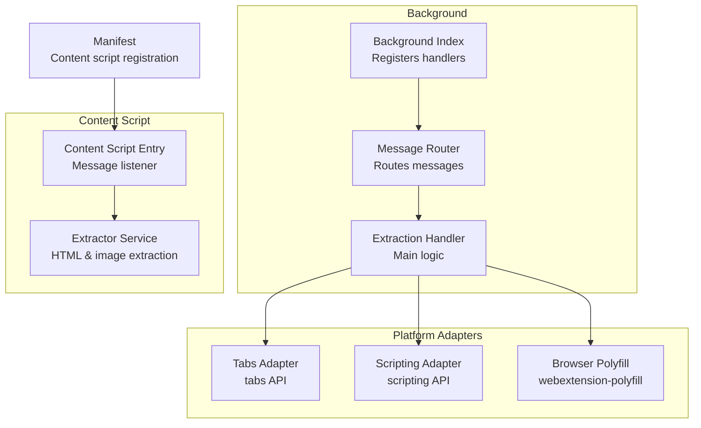
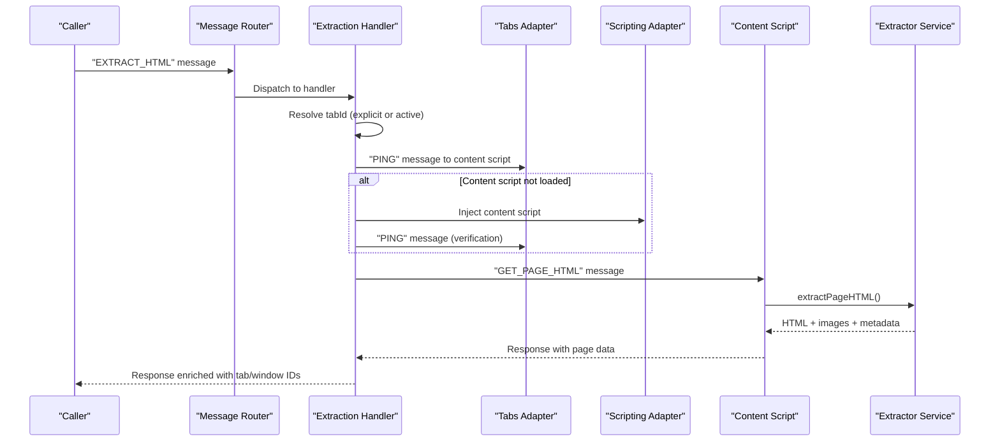
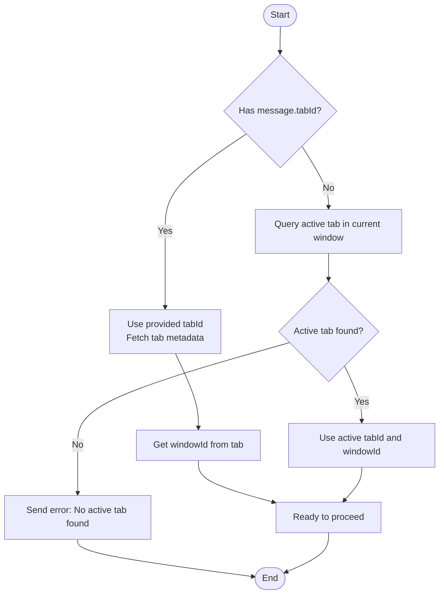
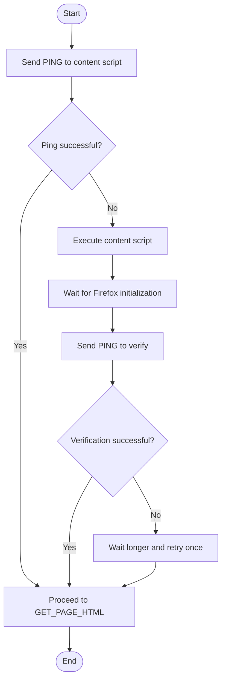
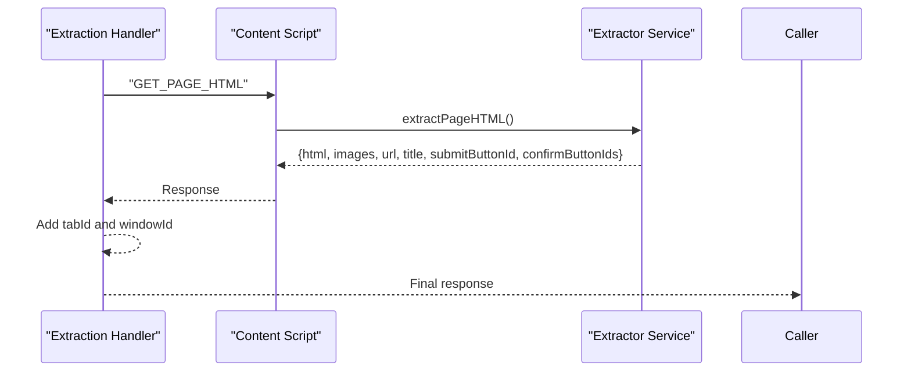
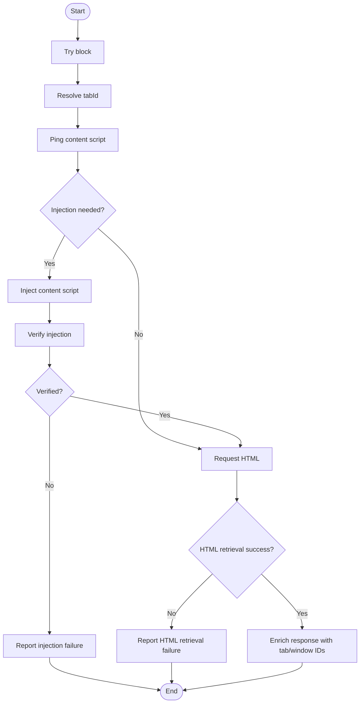
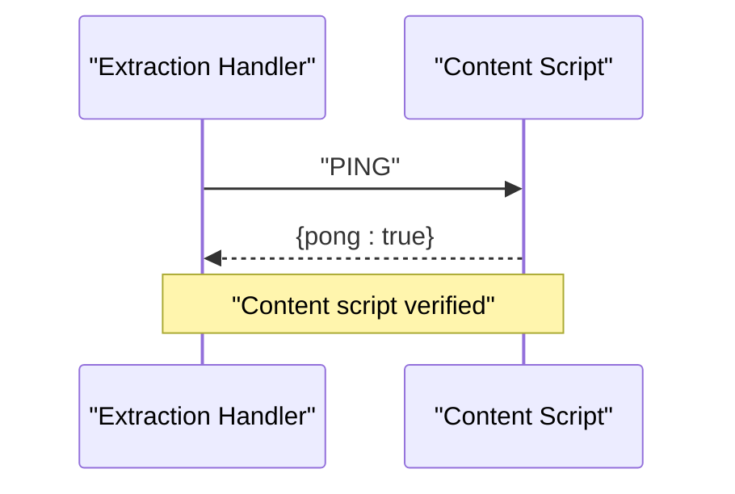
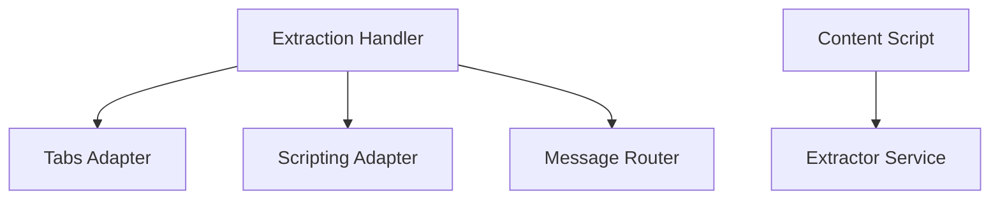

# HTML Extraction Handler

<cite>
**Referenced Files in This Document**
- [extraction.js](file://assignment-solver/src/background/handlers/extraction.js)
- [index.js](file://assignment-solver/src/background/index.js)
- [router.js](file://assignment-solver/src/background/router.js)
- [messages.js](file://assignment-solver/src/core/messages.js)
- [tabs.js](file://assignment-solver/src/platform/tabs.js)
- [scripting.js](file://assignment-solver/src/platform/scripting.js)
- [browser.js](file://assignment-solver/src/platform/browser.js)
- [extractor.js](file://assignment-solver/src/content/extractor.js)
- [content-index.js](file://assignment-solver/src/content/index.js)
- [manifest.json](file://assignment-solver/manifest.json)
</cite>

## Table of Contents
1. [Introduction](#introduction)
2. [Project Structure](#project-structure)
3. [Core Components](#core-components)
4. [Architecture Overview](#architecture-overview)
5. [Detailed Component Analysis](#detailed-component-analysis)
6. [Dependency Analysis](#dependency-analysis)
7. [Performance Considerations](#performance-considerations)
8. [Troubleshooting Guide](#troubleshooting-guide)
9. [Cross-Browser Compatibility](#cross-browser-compatibility)
10. [Conclusion](#conclusion)

## Introduction
This document provides comprehensive technical documentation for the HTML extraction handler, which enables the extension to retrieve processed HTML content from web pages. The handler manages tab selection, content script injection, HTML retrieval, error handling, and response formatting. It includes practical examples for tab ID resolution, active tab fallback, and content script verification patterns, along with cross-browser compatibility considerations for Firefox and Chrome.

## Project Structure
The HTML extraction capability spans several modules:
- Background handler: orchestrates tab management, content script lifecycle, and response formatting
- Platform adapters: abstract browser APIs for cross-browser compatibility
- Content script: extracts HTML and images from the page
- Manifest: declares content script registration and permissions

**Diagram sources**
- [index.js](file://assignment-solver/src/background/index.js#L44-L113)
- [router.js](file://assignment-solver/src/background/router.js#L14-L58)
- [extraction.js](file://assignment-solver/src/background/handlers/extraction.js#L15-L101)
- [tabs.js](file://assignment-solver/src/platform/tabs.js#L12-L52)
- [scripting.js](file://assignment-solver/src/platform/scripting.js#L12-L27)
- [browser.js](file://assignment-solver/src/platform/browser.js#L9-L16)
- [content-index.js](file://assignment-solver/src/content/index.js#L19-L96)
- [extractor.js](file://assignment-solver/src/content/extractor.js#L12-L241)
- [manifest.json](file://assignment-solver/manifest.json#L17-L26)

**Section sources**
- [index.js](file://assignment-solver/src/background/index.js#L44-L113)
- [router.js](file://assignment-solver/src/background/router.js#L14-L58)
- [extraction.js](file://assignment-solver/src/background/handlers/extraction.js#L15-L101)
- [tabs.js](file://assignment-solver/src/platform/tabs.js#L12-L52)
- [scripting.js](file://assignment-solver/src/platform/scripting.js#L12-L27)
- [browser.js](file://assignment-solver/src/platform/browser.js#L9-L16)
- [content-index.js](file://assignment-solver/src/content/index.js#L19-L96)
- [extractor.js](file://assignment-solver/src/content/extractor.js#L12-L241)
- [manifest.json](file://assignment-solver/manifest.json#L17-L26)

## Core Components
The HTML extraction handler is composed of:
- Tab management: resolves tab ID, falls back to active tab, and validates tab/window context
- Content script lifecycle: pings existing script, injects if missing, verifies readiness, and handles delays for Firefox
- HTML retrieval: requests processed HTML from the content script and enriches response with metadata
- Error handling: robust failure modes for injection, verification, and communication
- Response formatting: standardizes response shape with tab/window identifiers

Key responsibilities:
- Resolve tab context deterministically using either explicit tabId or active tab
- Ensure content script availability via ping and injection
- Retrieve structured HTML with associated images and page metadata
- Provide clear error messages for UI feedback

**Section sources**
- [extraction.js](file://assignment-solver/src/background/handlers/extraction.js#L18-L100)
- [messages.js](file://assignment-solver/src/core/messages.js#L5-L23)

## Architecture Overview
The extraction flow integrates background handlers, platform adapters, and the content script:

**Diagram sources**
- [router.js](file://assignment-solver/src/background/router.js#L17-L57)
- [extraction.js](file://assignment-solver/src/background/handlers/extraction.js#L18-L95)
- [tabs.js](file://assignment-solver/src/platform/tabs.js#L38-L40)
- [scripting.js](file://assignment-solver/src/platform/scripting.js#L23-L25)
- [content-index.js](file://assignment-solver/src/content/index.js#L26-L35)
- [extractor.js](file://assignment-solver/src/content/extractor.js#L21-L96)

## Detailed Component Analysis

### Tab Management Logic
The handler resolves the target tab using explicit tabId or active tab fallback:
- Explicit tabId: fetches tab metadata to obtain windowId
- Active tab fallback: queries current window for active tab, validates presence, and extracts tab/window IDs
- Error handling: returns structured error when no active tab is available

Examples:
- Explicit tabId resolution: pass tabId in message payload; handler queries tab and sets windowId
- Active tab fallback: when tabId is omitted, handler queries active tab in current window

**Diagram sources**
- [extraction.js](file://assignment-solver/src/background/handlers/extraction.js#L22-L41)

**Section sources**
- [extraction.js](file://assignment-solver/src/background/handlers/extraction.js#L22-L41)

### Content Script Lifecycle
The handler ensures the content script is ready before requesting HTML:
- Ping verification: sends PING message to check if content script is loaded
- Injection: if ping fails, executes content script via scripting.executeScript
- Verification: sends PING again to confirm readiness
- Firefox-specific delay: adds extra wait time to accommodate slower initialization

**Diagram sources**
- [extraction.js](file://assignment-solver/src/background/handlers/extraction.js#L45-L75)
- [scripting.js](file://assignment-solver/src/platform/scripting.js#L23-L25)

**Section sources**
- [extraction.js](file://assignment-solver/src/background/handlers/extraction.js#L45-L75)
- [scripting.js](file://assignment-solver/src/platform/scripting.js#L23-L25)

### HTML Retrieval and Response Formatting
The handler requests processed HTML from the content script:
- Sends GET_PAGE_HTML message to content script
- Receives structured response containing HTML, images, URL, title, submit button IDs, and confirmation button IDs
- Enriches response with tabId and windowId for UI context

**Diagram sources**
- [extraction.js](file://assignment-solver/src/background/handlers/extraction.js#L77-L95)
- [content-index.js](file://assignment-solver/src/content/index.js#L32-L35)
- [extractor.js](file://assignment-solver/src/content/extractor.js#L88-L96)

**Section sources**
- [extraction.js](file://assignment-solver/src/background/handlers/extraction.js#L77-L95)
- [content-index.js](file://assignment-solver/src/content/index.js#L32-L35)
- [extractor.js](file://assignment-solver/src/content/extractor.js#L88-L96)

### Error Handling Patterns
The handler implements layered error handling:
- Tab resolution: returns error when no active tab is available
- Injection failures: reports inability to load content script with guidance to refresh
- Communication failures: handles content script not responding with actionable message
- General errors: wraps exceptions with standardized error response

**Diagram sources**
- [extraction.js](file://assignment-solver/src/background/handlers/extraction.js#L18-L99)

**Section sources**
- [extraction.js](file://assignment-solver/src/background/handlers/extraction.js#L18-L99)

### Content Script Verification Patterns
The content script exposes a PING endpoint for health checks:
- Responds with pong: true to confirm readiness
- Used by background handler to validate content script availability
- Supports re-verification after injection

**Diagram sources**
- [extraction.js](file://assignment-solver/src/background/handlers/extraction.js#L47-L67)
- [content-index.js](file://assignment-solver/src/content/index.js#L27-L30)

**Section sources**
- [extraction.js](file://assignment-solver/src/background/handlers/extraction.js#L47-L67)
- [content-index.js](file://assignment-solver/src/content/index.js#L27-L30)

## Dependency Analysis
The extraction handler depends on platform adapters and messaging infrastructure:
- Tabs adapter abstracts browser.tabs.* APIs
- Scripting adapter abstracts browser.scripting.executeScript
- Message router ensures asynchronous responses and proper channel management
- Content script provides extraction service and message handling

**Diagram sources**
- [extraction.js](file://assignment-solver/src/background/handlers/extraction.js#L15-L16)
- [tabs.js](file://assignment-solver/src/platform/tabs.js#L12-L52)
- [scripting.js](file://assignment-solver/src/platform/scripting.js#L12-L27)
- [router.js](file://assignment-solver/src/background/router.js#L14-L58)
- [content-index.js](file://assignment-solver/src/content/index.js#L19-L96)
- [extractor.js](file://assignment-solver/src/content/extractor.js#L12-L241)

**Section sources**
- [extraction.js](file://assignment-solver/src/background/handlers/extraction.js#L15-L16)
- [tabs.js](file://assignment-solver/src/platform/tabs.js#L12-L52)
- [scripting.js](file://assignment-solver/src/platform/scripting.js#L12-L27)
- [router.js](file://assignment-solver/src/background/router.js#L14-L58)
- [content-index.js](file://assignment-solver/src/content/index.js#L19-L96)
- [extractor.js](file://assignment-solver/src/content/extractor.js#L12-L241)

## Performance Considerations
- Firefox initialization delay: the handler introduces a deliberate wait after injection to ensure content script readiness
- Image extraction overhead: converting images to base64 can be expensive; the extractor filters small or unloaded images
- Selector traversal: multiple DOM queries are performed to locate assessment containers; selectors are prioritized for efficiency
- Asynchronous message handling: the router keeps message channels open for Firefox compatibility, preventing premature closure

[No sources needed since this section provides general guidance]

## Troubleshooting Guide
Common issues and resolutions:
- No active tab found: occurs when no tab is active in the current window; ensure a tab is selected before invoking extraction
- Content script not loaded: indicates injection failure; refresh the page and retry
- Content script not responding: suggests timing issues; wait briefly and retry; the handler includes verification steps
- CORS restrictions: images that fail conversion are skipped with warnings; this is expected for external resources

Diagnostic tips:
- Monitor logs for tab resolution and injection steps
- Verify content script health via PING messages
- Check response enrichment for tab/window IDs

**Section sources**
- [extraction.js](file://assignment-solver/src/background/handlers/extraction.js#L35-L38)
- [extraction.js](file://assignment-solver/src/background/handlers/extraction.js#L68-L74)
- [extraction.js](file://assignment-solver/src/background/handlers/extraction.js#L88-L94)

## Cross-Browser Compatibility
The extension uses webextension-polyfill to ensure compatibility across Chrome and Firefox:
- Unified browser API: all platform adapters use browser.* instead of browser-specific APIs
- Firefox-specific handling: longer delay after injection to accommodate slower initialization
- Manifest configuration: content script registered for NPTEL domains with document_idle execution

Key compatibility points:
- Tabs API: abstracted via tabs adapter
- Scripting API: abstracted via scripting adapter
- Browser detection: helper functions to detect Chrome vs Firefox
- Manifest permissions: includes activeTab, tabs, storage, sidePanel, and scripting

**Section sources**
- [browser.js](file://assignment-solver/src/platform/browser.js#L9-L16)
- [browser.js](file://assignment-solver/src/platform/browser.js#L22-L55)
- [extraction.js](file://assignment-solver/src/background/handlers/extraction.js#L57-L58)
- [manifest.json](file://assignment-solver/manifest.json#L6-L26)

## Conclusion
The HTML extraction handler provides a robust mechanism for retrieving processed HTML from web pages while managing tab context, ensuring content script readiness, and delivering structured responses. Its design emphasizes reliability through verification, error handling, and cross-browser compatibility. The modular architecture enables easy maintenance and extension for future enhancements.