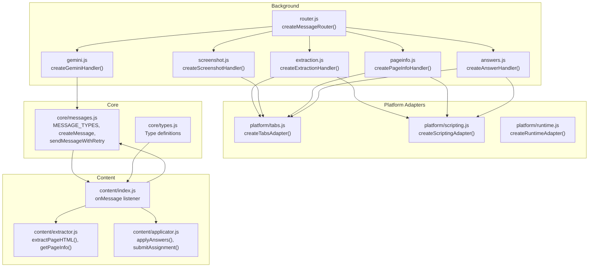
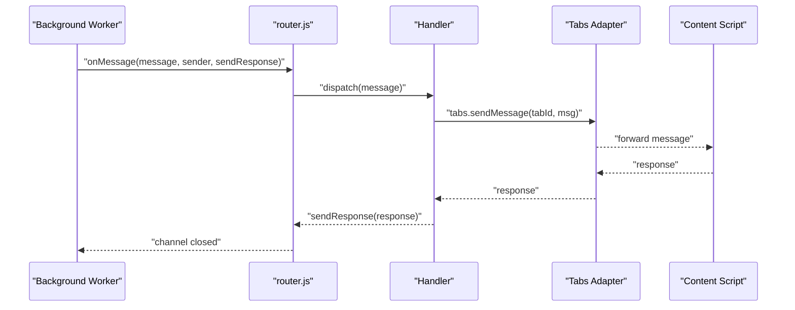
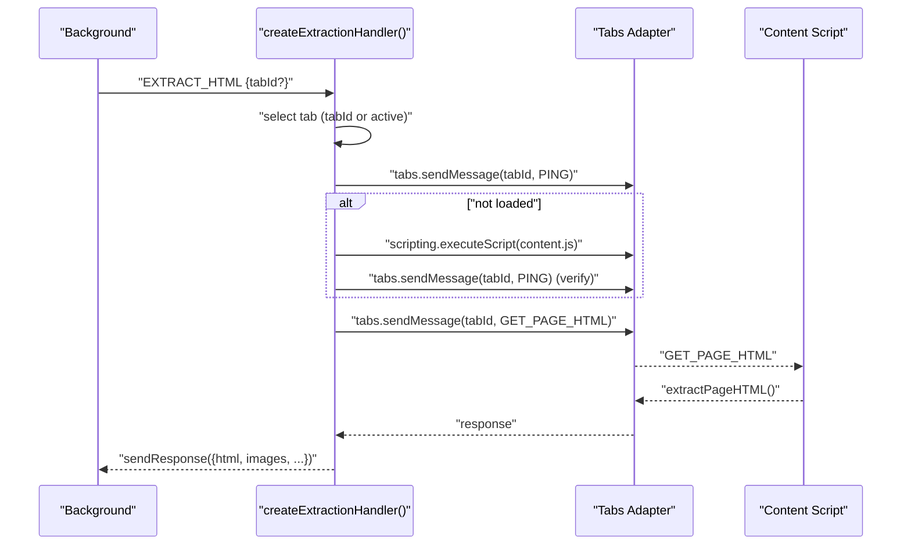
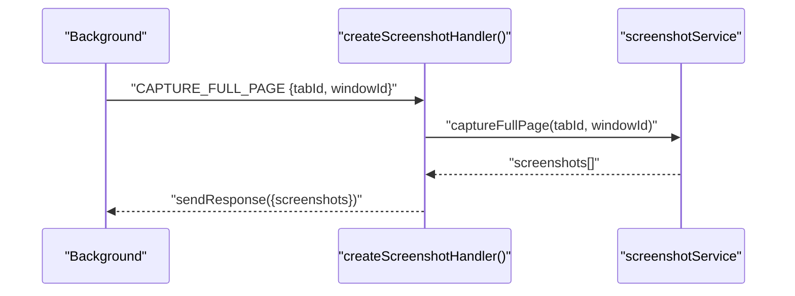
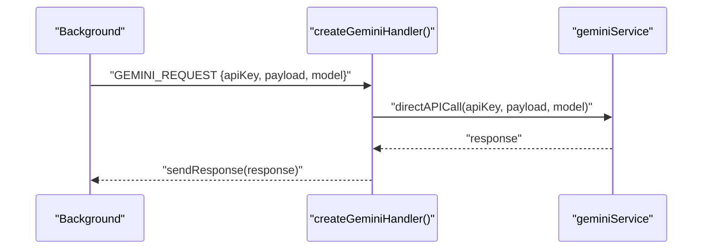
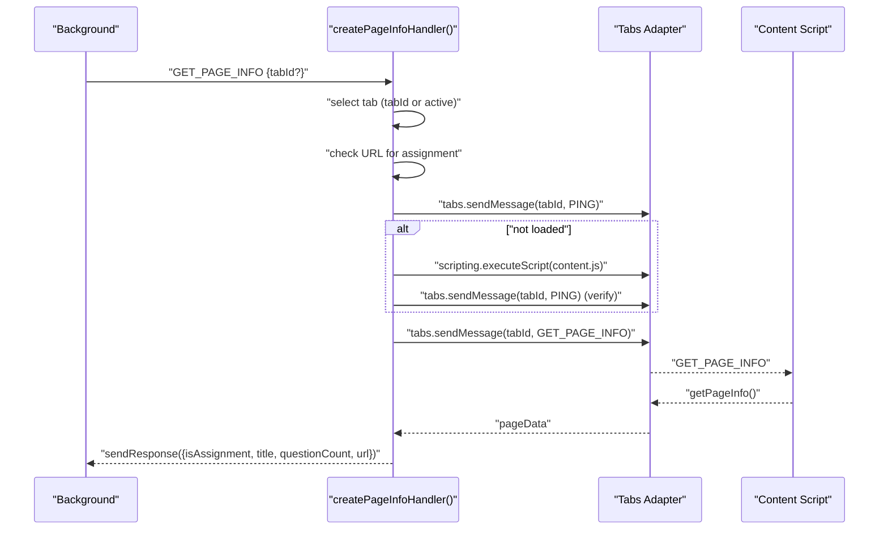
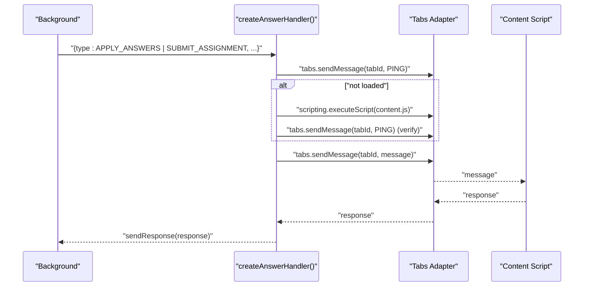
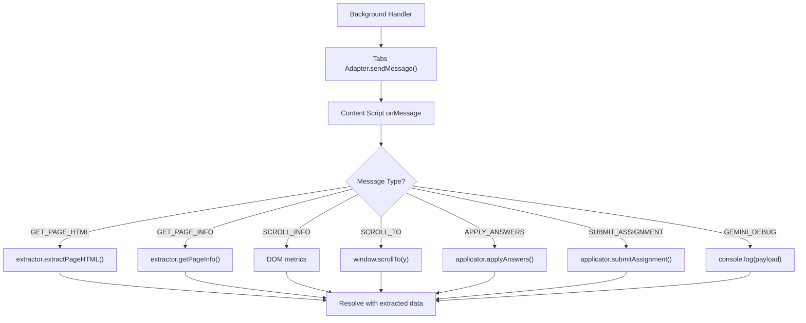
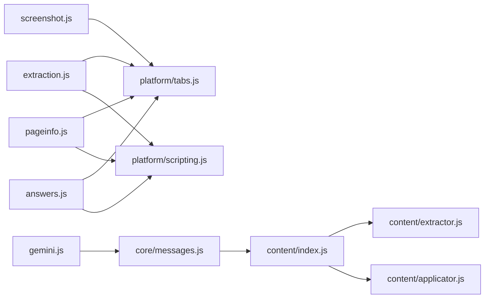

# Message Handlers

<cite>
**Referenced Files in This Document**
- [router.js](file://assignment-solver/src/background/router.js)
- [messages.js](file://assignment-solver/src/core/messages.js)
- [types.js](file://assignment-solver/src/core/types.js)
- [extraction.js](file://assignment-solver/src/background/handlers/extraction.js)
- [screenshot.js](file://assignment-solver/src/background/handlers/screenshot.js)
- [gemini.js](file://assignment-solver/src/background/handlers/gemini.js)
- [pageinfo.js](file://assignment-solver/src/background/handlers/pageinfo.js)
- [answers.js](file://assignment-solver/src/background/handlers/answers.js)
- [index.js](file://assignment-solver/src/content/index.js)
- [extractor.js](file://assignment-solver/src/content/extractor.js)
- [applicator.js](file://assignment-solver/src/content/applicator.js)
- [tabs.js](file://assignment-solver/src/platform/tabs.js)
- [scripting.js](file://assignment-solver/src/platform/scripting.js)
- [runtime.js](file://assignment-solver/src/platform/runtime.js)
</cite>

## Table of Contents
1. [Introduction](#introduction)
2. [Project Structure](#project-structure)
3. [Core Components](#core-components)
4. [Architecture Overview](#architecture-overview)
5. [Detailed Component Analysis](#detailed-component-analysis)
6. [Dependency Analysis](#dependency-analysis)
7. [Performance Considerations](#performance-considerations)
8. [Troubleshooting Guide](#troubleshooting-guide)
9. [Conclusion](#conclusion)

## Introduction
This document provides comprehensive documentation for all message handlers in the assignment solver extension. It explains each handler’s responsibilities, including HTML extraction, screenshot capture, Gemini API communication, answer application, and page information retrieval. It also documents handler factory functions, parameter validation, error handling, response formatting, and integration with platform adapters. Examples of invocation patterns illustrate how content scripts and background handlers collaborate.

## Project Structure
The assignment solver is organized into distinct layers:
- Background: message routing and handler orchestration
- Content: DOM extraction and answer application
- Platform adapters: cross-browser API abstraction
- Core: shared message types and type definitions

**Diagram sources**
- [router.js](file://assignment-solver/src/background/router.js#L14-L58)
- [extraction.js](file://assignment-solver/src/background/handlers/extraction.js#L15-L101)
- [screenshot.js](file://assignment-solver/src/background/handlers/screenshot.js#L12-L32)
- [gemini.js](file://assignment-solver/src/background/handlers/gemini.js#L12-L34)
- [pageinfo.js](file://assignment-solver/src/background/handlers/pageinfo.js#L15-L111)
- [answers.js](file://assignment-solver/src/background/handlers/answers.js#L14-L76)
- [index.js](file://assignment-solver/src/content/index.js#L19-L96)
- [extractor.js](file://assignment-solver/src/content/extractor.js#L12-L241)
- [applicator.js](file://assignment-solver/src/content/applicator.js#L12-L221)
- [tabs.js](file://assignment-solver/src/platform/tabs.js#L12-L52)
- [scripting.js](file://assignment-solver/src/platform/scripting.js#L12-L27)
- [runtime.js](file://assignment-solver/src/platform/runtime.js#L12-L31)
- [messages.js](file://assignment-solver/src/core/messages.js#L5-L33)
- [types.js](file://assignment-solver/src/core/types.js#L6-L63)

**Section sources**
- [router.js](file://assignment-solver/src/background/router.js#L1-L59)
- [messages.js](file://assignment-solver/src/core/messages.js#L1-L96)
- [types.js](file://assignment-solver/src/core/types.js#L1-L64)

## Core Components
- Message router: central dispatcher that routes messages to appropriate handlers and ensures responses are sent even for asynchronous handlers.
- Message types: standardized constants and helpers for constructing messages and retrying transient failures.
- Type definitions: shared JSDoc typedefs for messages, extraction results, page data, and screenshots.

Key responsibilities:
- Router: validates handler existence, logs activity, and guarantees sendResponse is invoked.
- Messages: defines MESSAGE_TYPES and provides createMessage and sendMessageWithRetry utilities.
- Types: defines ExtractedQuestion, PageData, Screenshot, and ExtractionResult for consistent data contracts.

**Section sources**
- [router.js](file://assignment-solver/src/background/router.js#L14-L58)
- [messages.js](file://assignment-solver/src/core/messages.js#L5-L33)
- [types.js](file://assignment-solver/src/core/types.js#L21-L61)

## Architecture Overview
The extension uses a message-passing architecture:
- Background workers receive messages via the router and delegate to specialized handlers.
- Handlers coordinate with platform adapters (tabs, scripting) and content scripts.
- Content scripts expose DOM extraction and answer application capabilities.

**Diagram sources**
- [router.js](file://assignment-solver/src/background/router.js#L17-L56)
- [tabs.js](file://assignment-solver/src/platform/tabs.js#L32-L40)
- [index.js](file://assignment-solver/src/content/index.js#L20-L96)

## Detailed Component Analysis

### Handler Factory Functions
Each handler is created via a factory that accepts a dependency object and returns a handler function. Factories encapsulate platform adapter dependencies and logging.

- createExtractionHandler(deps): returns a handler for EXTRACT_HTML.
- createScreenshotHandler(deps): returns a handler for CAPTURE_FULL_PAGE.
- createGeminiHandler(deps): returns a handler for GEMINI_REQUEST.
- createPageInfoHandler(deps): returns a handler for GET_PAGE_INFO.
- createAnswerHandler(deps): returns a handler for APPLY_ANSWERS and SUBMIT_ASSIGNMENT.

Dependencies commonly include:
- tabs: platform/tabs.js adapter
- scripting: platform/scripting.js adapter
- screenshotService: service for capturing full-page screenshots
- geminiService: service for direct API calls
- logger: optional logging function

**Section sources**
- [extraction.js](file://assignment-solver/src/background/handlers/extraction.js#L15-L101)
- [screenshot.js](file://assignment-solver/src/background/handlers/screenshot.js#L12-L32)
- [gemini.js](file://assignment-solver/src/background/handlers/gemini.js#L12-L34)
- [pageinfo.js](file://assignment-solver/src/background/handlers/pageinfo.js#L15-L111)
- [answers.js](file://assignment-solver/src/background/handlers/answers.js#L14-L76)

### HTML Extraction Handler (EXTRACT_HTML)
Responsibilities:
- Determine target tab (provided or active).
- Ensure content script is loaded by pinging and injecting if needed.
- Request page HTML and related metadata from the content script.
- Return extracted HTML, images, URL, title, submit button ID, and confirmation button IDs.

Parameter validation:
- Accepts optional tabId; falls back to active tab if missing.
- Validates presence of an active tab before proceeding.

Error handling:
- Returns structured errors for missing tabs, content script injection failures, and unresponsive content scripts.
- Logs diagnostic information for troubleshooting.

Response formatting:
- Returns an object containing extracted HTML, images, URL, title, submitButtonId, confirmButtonIds, and tab identifiers.

Invocation pattern:
- Background: handler receives message and forwards to content script.
- Content: responds with extractPageHTML() result.

**Diagram sources**
- [extraction.js](file://assignment-solver/src/background/handlers/extraction.js#L18-L95)
- [tabs.js](file://assignment-solver/src/platform/tabs.js#L32-L40)
- [scripting.js](file://assignment-solver/src/platform/scripting.js#L23-L25)
- [index.js](file://assignment-solver/src/content/index.js#L32-L35)
- [extractor.js](file://assignment-solver/src/content/extractor.js#L21-L96)

**Section sources**
- [extraction.js](file://assignment-solver/src/background/handlers/extraction.js#L18-L100)
- [extractor.js](file://assignment-solver/src/content/extractor.js#L21-L96)

### Screenshot Capture Handler (CAPTURE_FULL_PAGE)
Responsibilities:
- Capture full-page screenshots for the given tab/window context.
- Return an array of screenshots with metadata.

Parameter validation:
- Requires tabId and windowId from the message.

Error handling:
- Returns an empty screenshots array and logs errors if capture fails.

Response formatting:
- Returns { screenshots: [...] } where each item includes MIME type, base64 data, scroll position, index, and total.

**Diagram sources**
- [screenshot.js](file://assignment-solver/src/background/handlers/screenshot.js#L15-L31)

**Section sources**
- [screenshot.js](file://assignment-solver/src/background/handlers/screenshot.js#L15-L31)

### Gemini API Communication Handler (GEMINI_REQUEST)
Responsibilities:
- Perform a direct API call to Gemini using provided credentials and payload.
- Return the API response to the caller.

Parameter validation:
- Requires apiKey, payload, and model from the message.

Error handling:
- Propagates API errors in the response.

Response formatting:
- Returns the raw Gemini response object.

**Diagram sources**
- [gemini.js](file://assignment-solver/src/background/handlers/gemini.js#L15-L33)

**Section sources**
- [gemini.js](file://assignment-solver/src/background/handlers/gemini.js#L15-L33)

### Page Information Handler (GET_PAGE_INFO)
Responsibilities:
- Detect whether the current page is an assignment on supported platforms.
- Ensure content script is loaded.
- Request page info from the content script and return a concise summary.

Parameter validation:
- Accepts optional tabId; falls back to active tab if missing.

Error handling:
- Returns isAssignment: false with an error message when tab lookup fails or page is not an assignment.

Response formatting:
- Returns { isAssignment: boolean, title, questionCount, url }.

**Diagram sources**
- [pageinfo.js](file://assignment-solver/src/background/handlers/pageinfo.js#L18-L110)
- [tabs.js](file://assignment-solver/src/platform/tabs.js#L32-L40)
- [scripting.js](file://assignment-solver/src/platform/scripting.js#L23-L25)
- [index.js](file://assignment-solver/src/content/index.js#L37-L41)
- [extractor.js](file://assignment-solver/src/content/extractor.js#L182-L236)

**Section sources**
- [pageinfo.js](file://assignment-solver/src/background/handlers/pageinfo.js#L18-L111)
- [extractor.js](file://assignment-solver/src/content/extractor.js#L182-L236)

### Answer Application Handler (APPLY_ANSWERS and SUBMIT_ASSIGNMENT)
Responsibilities:
- Ensure content script is loaded.
- Forward messages to the content script for answer application and submission.

Parameter validation:
- Accepts optional tabId; falls back to active tab if missing.

Error handling:
- Handles content script injection failures and message forwarding errors.

Response formatting:
- Returns the content script’s response or a success marker.

**Diagram sources**
- [answers.js](file://assignment-solver/src/background/handlers/answers.js#L17-L75)
- [tabs.js](file://assignment-solver/src/platform/tabs.js#L32-L40)
- [scripting.js](file://assignment-solver/src/platform/scripting.js#L23-L25)
- [index.js](file://assignment-solver/src/content/index.js#L67-L78)

**Section sources**
- [answers.js](file://assignment-solver/src/background/handlers/answers.js#L17-L76)
- [index.js](file://assignment-solver/src/content/index.js#L67-L78)

### Content Script Integration
The content script acts as a bridge between the page DOM and the background handlers:
- Responds to PING to indicate readiness.
- Implements GET_PAGE_HTML and GET_PAGE_INFO for extraction.
- Implements SCROLL_INFO and SCROLL_TO for screenshot capture coordination.
- Implements APPLY_ANSWERS and SUBMIT_ASSIGNMENT for answer application.
- Supports GEMINI_DEBUG for logging during debugging.

**Diagram sources**
- [index.js](file://assignment-solver/src/content/index.js#L20-L96)
- [extractor.js](file://assignment-solver/src/content/extractor.js#L21-L96)
- [extractor.js](file://assignment-solver/src/content/extractor.js#L182-L236)
- [applicator.js](file://assignment-solver/src/content/applicator.js#L21-L216)

**Section sources**
- [index.js](file://assignment-solver/src/content/index.js#L19-L96)
- [extractor.js](file://assignment-solver/src/content/extractor.js#L12-L241)
- [applicator.js](file://assignment-solver/src/content/applicator.js#L12-L221)

## Dependency Analysis
Handlers depend on platform adapters and services:
- Tabs adapter: query, get, sendMessage, captureVisibleTab
- Scripting adapter: executeScript
- Runtime adapter: sendMessage, onMessage
- Services: screenshotService, geminiService

**Diagram sources**
- [extraction.js](file://assignment-solver/src/background/handlers/extraction.js#L15-L101)
- [screenshot.js](file://assignment-solver/src/background/handlers/screenshot.js#L12-L32)
- [gemini.js](file://assignment-solver/src/background/handlers/gemini.js#L12-L34)
- [pageinfo.js](file://assignment-solver/src/background/handlers/pageinfo.js#L15-L111)
- [answers.js](file://assignment-solver/src/background/handlers/answers.js#L14-L76)
- [tabs.js](file://assignment-solver/src/platform/tabs.js#L12-L52)
- [scripting.js](file://assignment-solver/src/platform/scripting.js#L12-L27)
- [messages.js](file://assignment-solver/src/core/messages.js#L5-L33)
- [index.js](file://assignment-solver/src/content/index.js#L19-L96)
- [extractor.js](file://assignment-solver/src/content/extractor.js#L12-L241)
- [applicator.js](file://assignment-solver/src/content/applicator.js#L12-L221)

**Section sources**
- [tabs.js](file://assignment-solver/src/platform/tabs.js#L12-L52)
- [scripting.js](file://assignment-solver/src/platform/scripting.js#L12-L27)
- [runtime.js](file://assignment-solver/src/platform/runtime.js#L12-L31)

## Performance Considerations
- Asynchronous handler pattern: Handlers return true to keep the message channel open for Firefox compatibility and ensure sendResponse is always invoked.
- Retry logic for messaging: sendMessageWithRetry reduces transient connection failures by retrying with exponential delays.
- Content script initialization: Injection and verification steps add latency; batching requests and caching content script readiness can improve responsiveness.
- Image extraction: Skipping small or unloaded images avoids unnecessary processing and potential CORS errors.

[No sources needed since this section provides general guidance]

## Troubleshooting Guide
Common issues and resolutions:
- Unknown message type: The router logs and responds with an error when no handler exists for a message type.
- No active tab: Extraction and answer handlers return errors when no active tab is found.
- Content script not responding: Handlers attempt injection and verification; repeated failures suggest page reload or extension reload.
- Gemini API errors: Errors are propagated in the response; verify apiKey and payload.
- Screenshot capture failures: Empty screenshots array indicates failure; check permissions and tab/window IDs.

**Section sources**
- [router.js](file://assignment-solver/src/background/router.js#L22-L26)
- [extraction.js](file://assignment-solver/src/background/handlers/extraction.js#L35-L38)
- [answers.js](file://assignment-solver/src/background/handlers/answers.js#L27-L30)
- [gemini.js](file://assignment-solver/src/background/handlers/gemini.js#L29-L32)
- [screenshot.js](file://assignment-solver/src/background/handlers/screenshot.js#L28-L30)

## Conclusion
The message handler system provides a robust, extensible foundation for assignment extraction, screenshot capture, AI-powered assistance, and answer application. Factories encapsulate dependencies and logging, while platform adapters ensure cross-browser compatibility. The content script bridges background and DOM operations, and the router guarantees reliable message delivery and response handling.