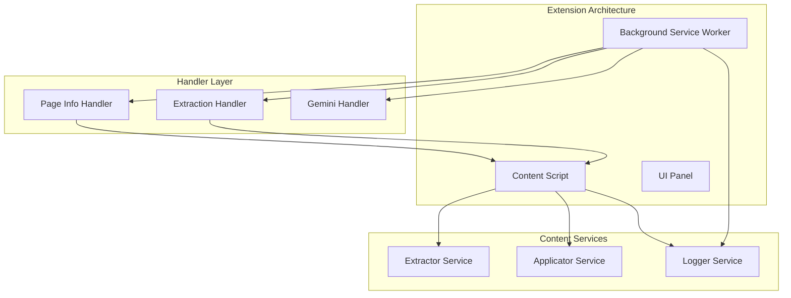
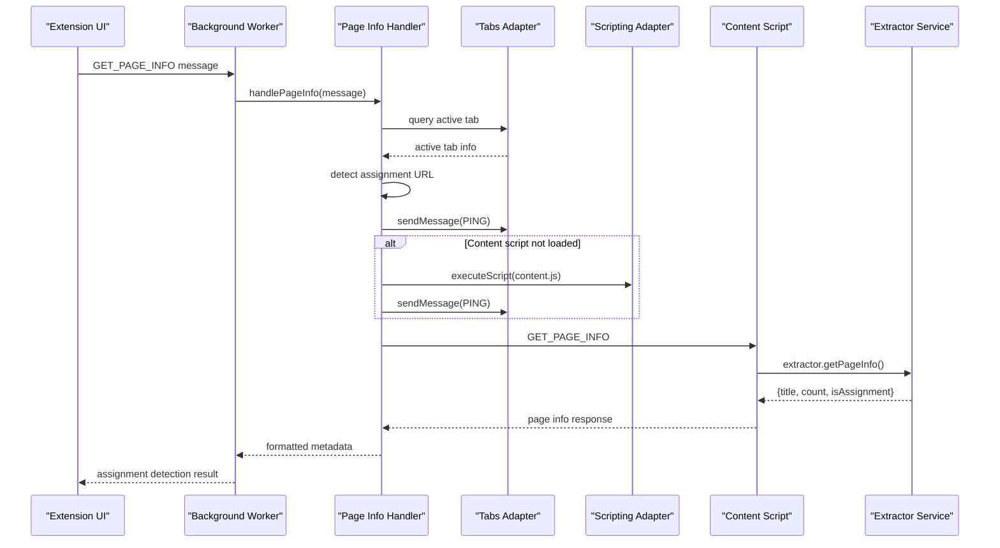
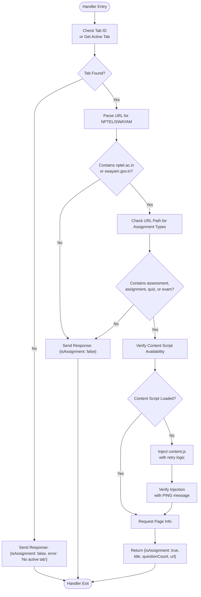
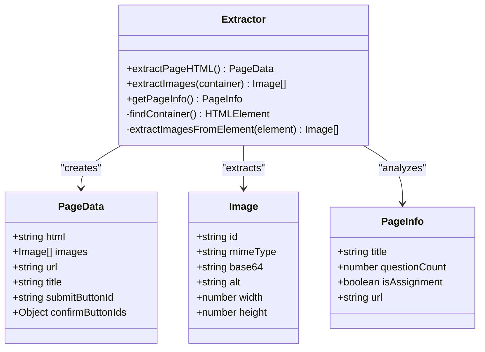
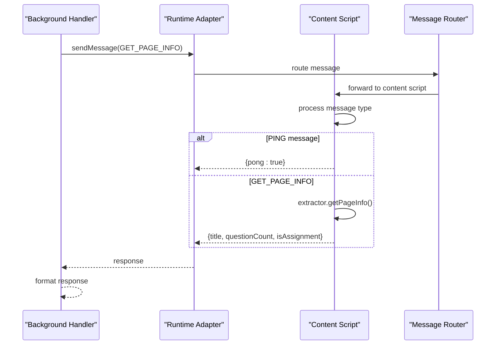
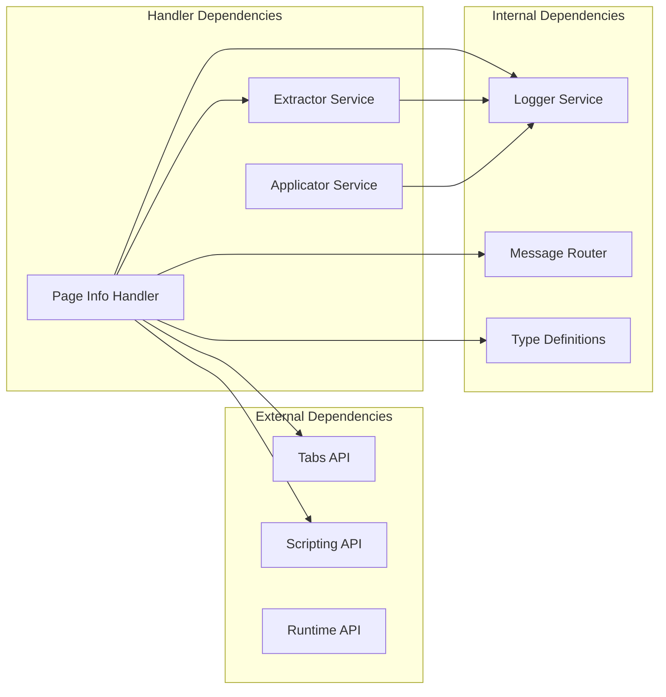

# Page Information Handler

<cite>
**Referenced Files in This Document**
- [pageinfo.js](file://assignment-solver/src/background/handlers/pageinfo.js)
- [extractor.js](file://assignment-solver/src/content/extractor.js)
- [index.js](file://assignment-solver/src/content/index.js)
- [messages.js](file://assignment-solver/src/core/messages.js)
- [router.js](file://assignment-solver/src/background/router.js)
- [index.js](file://assignment-solver/src/background/index.js)
- [types.js](file://assignment-solver/src/core/types.js)
- [applicator.js](file://assignment-solver/src/content/applicator.js)
- [manifest.json](file://assignment-solver/manifest.json)
</cite>

## Table of Contents
1. [Introduction](#introduction)
2. [Project Structure](#project-structure)
3. [Core Components](#core-components)
4. [Architecture Overview](#architecture-overview)
5. [Detailed Component Analysis](#detailed-component-analysis)
6. [Dependency Analysis](#dependency-analysis)
7. [Performance Considerations](#performance-considerations)
8. [Troubleshooting Guide](#troubleshooting-guide)
9. [Conclusion](#conclusion)

## Introduction
The Page Information Handler is a critical component of the NPTEL Assignment Solver extension responsible for detecting assignment pages, extracting metadata, and identifying assignment context. This handler serves as the bridge between the background service worker and content script, enabling context-aware processing of educational assignments from platforms like NPTEL and SWAYAM.

The handler performs sophisticated page analysis to determine course types, assignment formats, and available question structures, providing essential metadata for downstream AI-powered processing and automated assignment completion capabilities.

## Project Structure
The Page Information Handler is part of a modular extension architecture with clear separation of concerns:

**Diagram sources**
- [index.js](file://assignment-solver/src/background/index.js#L1-L135)
- [index.js](file://assignment-solver/src/content/index.js#L1-L99)

**Section sources**
- [index.js](file://assignment-solver/src/background/index.js#L1-L135)
- [index.js](file://assignment-solver/src/content/index.js#L1-L99)

## Core Components
The Page Information Handler consists of several interconnected components working together to provide comprehensive assignment detection and metadata extraction:

### Primary Handler Functions
- **Assignment Detection**: Identifies NPTEL/SWAYAM assignment pages using URL patterns and content selectors
- **Metadata Extraction**: Collects page title, question counts, and structural information
- **Context Validation**: Ensures content script availability and proper initialization
- **Response Formatting**: Returns standardized metadata for downstream processing

### Supporting Services
- **Extractor Service**: Provides HTML extraction and image processing capabilities
- **Message Routing**: Manages bidirectional communication between background and content scripts
- **Platform Adapters**: Handles browser-specific implementations for tabs, scripting, and runtime APIs

**Section sources**
- [pageinfo.js](file://assignment-solver/src/background/handlers/pageinfo.js#L1-L112)
- [extractor.js](file://assignment-solver/src/content/extractor.js#L1-L241)

## Architecture Overview
The Page Information Handler operates within a sophisticated message-driven architecture that enables seamless communication between extension components:

**Diagram sources**
- [pageinfo.js](file://assignment-solver/src/background/handlers/pageinfo.js#L18-L110)
- [index.js](file://assignment-solver/src/content/index.js#L32-L41)
- [messages.js](file://assignment-solver/src/core/messages.js#L5-L23)

The architecture demonstrates a clear separation of concerns with the handler focusing on assignment detection while delegating content extraction to specialized services.

**Section sources**
- [pageinfo.js](file://assignment-solver/src/background/handlers/pageinfo.js#L1-L112)
- [index.js](file://assignment-solver/src/content/index.js#L1-L99)

## Detailed Component Analysis

### Page Information Handler Implementation
The core handler implements a robust assignment detection mechanism with comprehensive error handling and fallback strategies:

#### Assignment Detection Logic
The handler employs a multi-layered approach to identify assignment pages:

**Diagram sources**
- [pageinfo.js](file://assignment-solver/src/background/handlers/pageinfo.js#L18-L110)

#### Metadata Extraction Process
The handler coordinates with the content script to extract comprehensive page metadata:

**Section sources**
- [pageinfo.js](file://assignment-solver/src/background/handlers/pageinfo.js#L47-L105)

### Content Script Integration
The content script provides essential page analysis capabilities through the extractor service:

#### Page Structure Analysis
The extractor service implements sophisticated DOM traversal to identify assignment containers and question structures:

**Diagram sources**
- [extractor.js](file://assignment-solver/src/content/extractor.js#L12-L238)
- [types.js](file://assignment-solver/src/core/types.js#L36-L61)

#### Question Format Detection
The extractor implements intelligent question format identification through CSS selector targeting:

**Section sources**
- [extractor.js](file://assignment-solver/src/content/extractor.js#L182-L236)

### Message Communication Protocol
The handler participates in a well-defined message protocol that ensures reliable communication:

**Diagram sources**
- [messages.js](file://assignment-solver/src/core/messages.js#L47-L95)
- [index.js](file://assignment-solver/src/content/index.js#L20-L95)

**Section sources**
- [messages.js](file://assignment-solver/src/core/messages.js#L1-L96)
- [index.js](file://assignment-solver/src/content/index.js#L1-L99)

## Dependency Analysis
The Page Information Handler maintains loose coupling with its dependencies while providing essential orchestration:

**Diagram sources**
- [pageinfo.js](file://assignment-solver/src/background/handlers/pageinfo.js#L5-L16)
- [index.js](file://assignment-solver/src/background/index.js#L44-L113)

### Platform Compatibility
The handler demonstrates excellent cross-browser compatibility through platform abstraction:

**Section sources**
- [pageinfo.js](file://assignment-solver/src/background/handlers/pageinfo.js#L73-L93)
- [manifest.json](file://assignment-solver/manifest.json#L1-L44)

## Performance Considerations
The Page Information Handler implements several optimization strategies for efficient operation:

### Asynchronous Processing
- Non-blocking tab operations using Promise-based APIs
- Configurable retry mechanisms for transient failures
- Optimistic content script loading with verification

### Resource Management
- Selective DOM querying to minimize performance impact
- Image extraction with size filtering to reduce bandwidth
- Graceful degradation when content scripts are unavailable

### Error Resilience
- Comprehensive error handling with fallback responses
- Connection error detection and retry logic
- Timeout management for external operations

**Section sources**
- [pageinfo.js](file://assignment-solver/src/background/handlers/pageinfo.js#L65-L93)
- [messages.js](file://assignment-solver/src/core/messages.js#L47-L95)

## Troubleshooting Guide

### Common Issues and Solutions

#### Content Script Loading Failures
**Symptoms**: Handler reports "Content script not loaded" errors
**Causes**: 
- Content script injection timeout
- Cross-origin restrictions
- Browser extension policy limitations

**Solutions**:
- Verify content script permissions in manifest
- Check host permissions for target domains
- Implement manual content script reload

#### Assignment Detection Failures
**Symptoms**: Pages not recognized as assignments despite valid URLs
**Causes**:
- Incorrect URL patterns for new platform versions
- Dynamic content loading affecting selector detection
- Missing question containers in DOM

**Solutions**:
- Update selector patterns in extractor service
- Implement dynamic content waiting mechanisms
- Add fallback detection methods

#### Message Communication Errors
**Symptoms**: "Receiving end does not exist" or connection failures
**Causes**:
- Background script initialization delays
- Firefox-specific timing issues
- Extension context invalidation

**Solutions**:
- Implement retry logic with exponential backoff
- Use connection error detection and recovery
- Add timeout mechanisms for message operations

**Section sources**
- [pageinfo.js](file://assignment-solver/src/background/handlers/pageinfo.js#L106-L109)
- [messages.js](file://assignment-solver/src/core/messages.js#L69-L90)

## Conclusion
The Page Information Handler represents a sophisticated solution for assignment detection and metadata extraction in educational platforms. Its modular architecture, comprehensive error handling, and cross-browser compatibility make it a robust foundation for AI-powered educational assistance tools.

The handler's strength lies in its ability to intelligently analyze page structure, extract meaningful metadata, and coordinate with content services to provide context-aware processing. The implementation demonstrates best practices in extension development, including proper separation of concerns, graceful error handling, and performance optimization.

Future enhancements could include expanded platform support, improved machine learning-based detection, and enhanced integration with external educational APIs for richer context awareness.