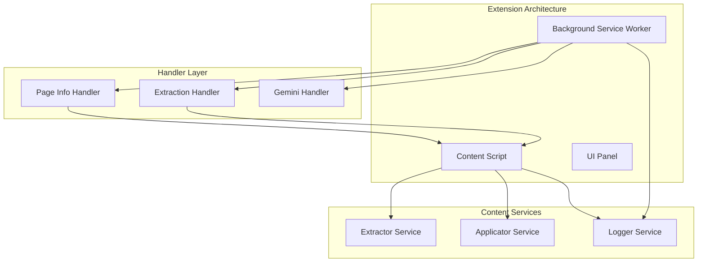
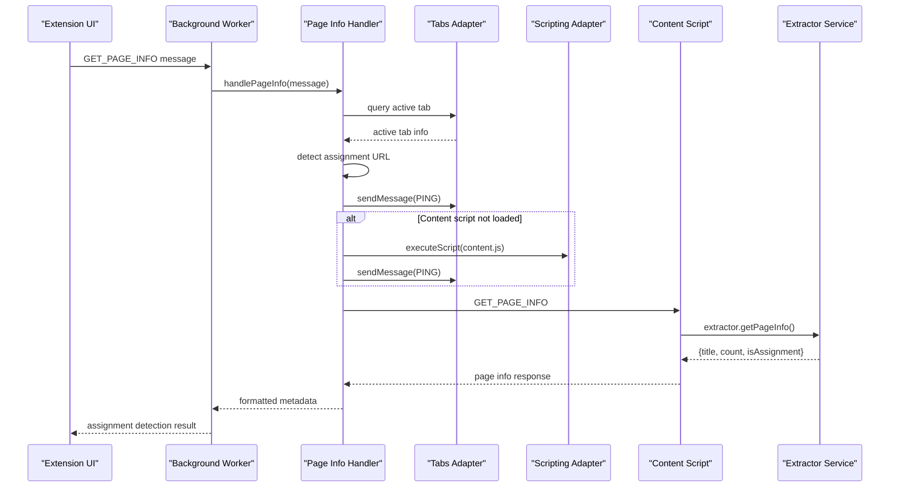
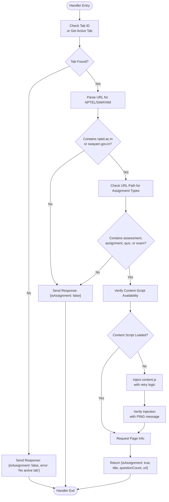
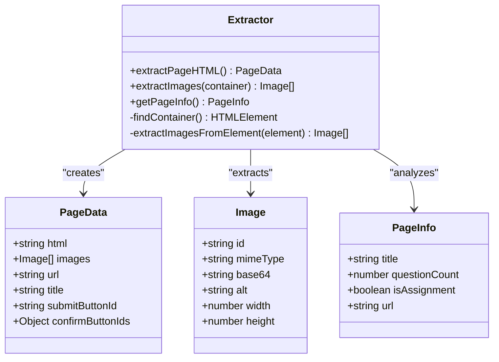
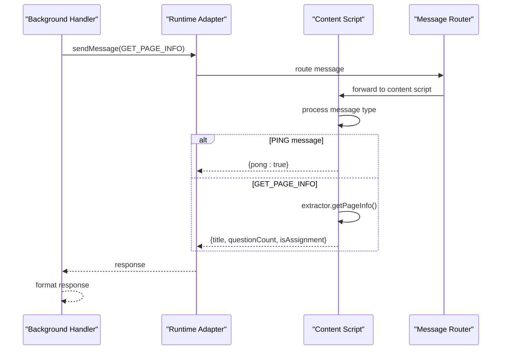
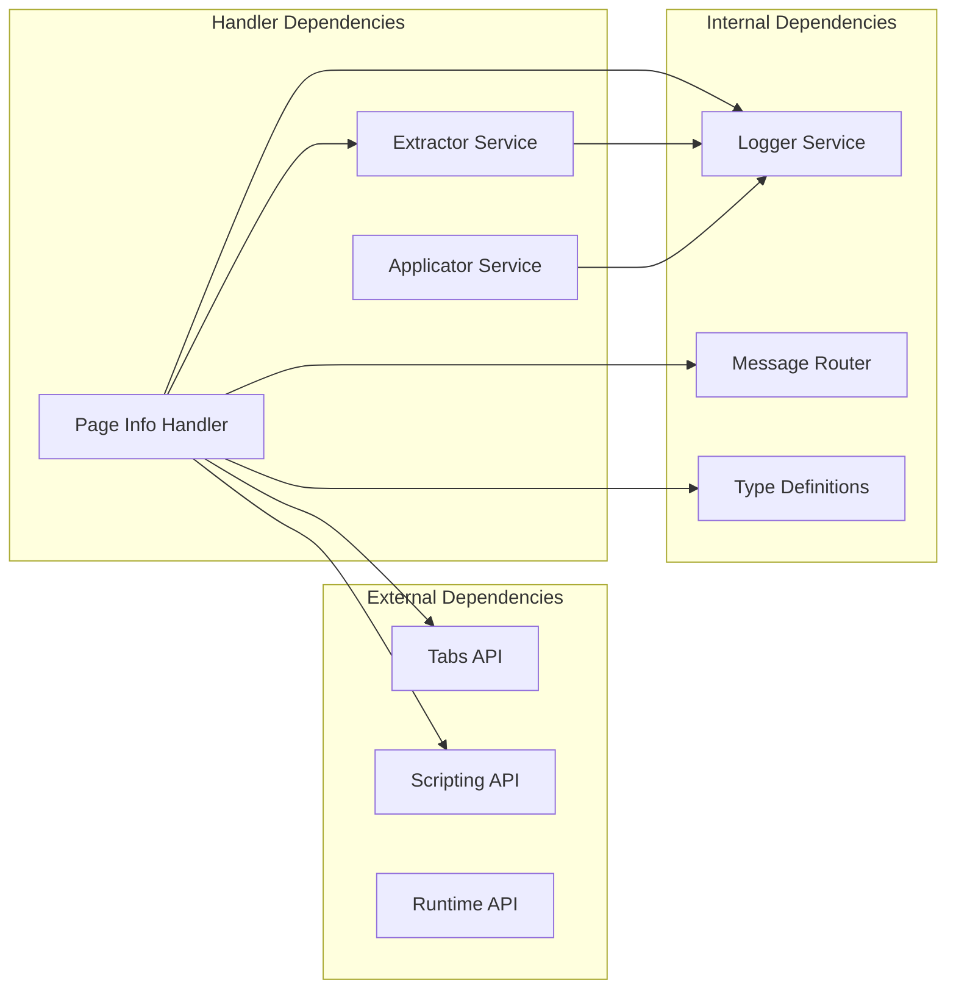

# Page information handler

## Introduction
Detects assignment pages and pulls metadata so the rest of the pipeline knows what it is looking at. Bridges the background worker and content script for NPTEL, SWAYAM, and similar layouts.

## Project structure
Page Information Handler sits in the background layer. Nearby pieces:

```mermaid
graph TB
subgraph "Extension Architecture"
BG[Background Service Worker]
CS[Content Script]
UI[UI Panel]
end
subgraph "Handler Layer"
PIH[Page Info Handler]
EH[Extraction Handler]
GH[Gemini Handler]
end
subgraph "Content Services"
EX[Extractor Service]
AP[Applicator Service]
LS[Logger Service]
end
BG --> PIH
BG --> EH
BG --> GH
PIH --> CS
EH --> CS
CS --> EX
CS --> AP
BG --> LS
CS --> LS
```

## Core components
The Page Information Handler consists of several interconnected components working together to provide detailed assignment detection and metadata extraction:

### Primary handler functions
- **Assignment Detection**: Identifies NPTEL/SWAYAM assignment pages using URL patterns and content selectors
- **Metadata Extraction**: Collects page title, question counts, and structural information
- **Context Validation**: Ensures content script availability and proper initialization
- **Response Formatting**: Returns standardized metadata for downstream processing

### Supporting services
- **Extractor Service**: Provides HTML extraction and image processing capabilities
- **Message Routing**: Manages bidirectional communication between background and content scripts
- **Platform Adapters**: Handles browser-specific implementations for tabs, scripting, and runtime APIs

## Architecture overview
The Page Information Handler operates within a detailed message-driven architecture that enables smooth communication between extension components:

```mermaid
sequenceDiagram
participant UI as "Extension UI"
participant BG as "Background Worker"
participant PIH as "Page Info Handler"
participant TABS as "Tabs Adapter"
participant SCRIPT as "Scripting Adapter"
participant CS as "Content Script"
participant EX as "Extractor Service"
UI->>BG : GET_PAGE_INFO message
BG->>PIH : handlePageInfo(message)
PIH->>TABS : query active tab
TABS-->>PIH : active tab info
PIH->>PIH : detect assignment URL
PIH->>TABS : sendMessage(PING)
alt Content script not loaded
PIH->>SCRIPT : executeScript(content.js)
PIH->>TABS : sendMessage(PING)
end
PIH->>CS : GET_PAGE_INFO
CS->>EX : extractor.getPageInfo()
EX-->>CS : {title, count, isAssignment}
CS-->>PIH : page info response
PIH-->>BG : formatted metadata
BG-->>UI : assignment detection result
```

The handler detects assignment context and leaves HTML extraction to the content-script services.

## Detailed component analysis

### Page information handler implementation
The core handler implements a assignment detection mechanism with detailed error handling and fallback strategies:

#### Assignment detection logic
The handler uses a multi-layered approach to identify assignment pages:

```mermaid
flowchart TD
Start([Handler Entry]) --> CheckTab["Check Tab ID<br/>or Get Active Tab"]
CheckTab --> ValidateTab{"Tab Found?"}
ValidateTab --> |No| NoActiveTab["Send Response: {isAssignment: false, error: 'No active tab'}"]
ValidateTab --> |Yes| CheckURL["Parse URL for NPTEL/SWAYAM"]
CheckURL --> IsNPTEL{"Contains nptel.ac.in<br/>or swayam.gov.in?"}
IsNPTEL --> |No| NotAssignment["Send Response: {isAssignment: false}"]
IsNPTEL --> |Yes| CheckType["Check URL Path for Assignment Types"]
CheckType --> IsAssignment{"Contains assessment,<br/>assignment, quiz, or exam?"}
IsAssignment --> |No| NotAssignment
IsAssignment --> |Yes| CheckContent["Verify Content Script Availability"]
CheckContent --> HasScript{"Content Script Loaded?"}
HasScript --> |No| InjectScript["Inject content.js<br/>with retry logic"]
HasScript --> |Yes| GetInfo["Request Page Info"]
InjectScript --> VerifyScript["Verify Injection<br/>with PING message"]
VerifyScript --> GetInfo
GetInfo --> ReturnSuccess["Return {isAssignment: true,<br/>title, questionCount, url}"]
NoActiveTab --> End([Handler Exit])
NotAssignment --> End
ReturnSuccess --> End
```

#### Metadata extraction process
The handler coordinates with the content script to extract detailed page metadata:

### Content script integration
The content script provides essential page analysis capabilities through the extractor service:

#### Page structure analysis
The extractor service implements detailed DOM traversal to identify assignment containers and question structures:

```mermaid
classDiagram
class Extractor {
+extractPageHTML() PageData
+extractImages(container) Image[]
+getPageInfo() PageInfo
-findContainer() HTMLElement
-extractImagesFromElement(element) Image[]
}
class PageData {
+string html
+Image[] images
+string url
+string title
+string submitButtonId
+Object confirmButtonIds
}
class Image {
+string id
+string mimeType
+string base64
+string alt
+number width
+number height
}
class PageInfo {
+string title
+number questionCount
+boolean isAssignment
+string url
}
Extractor --> PageData : "creates"
Extractor --> Image : "extracts"
Extractor --> PageInfo : "analyzes"
```

#### Question format detection
The extractor implements intelligent question format identification through CSS selector targeting:

### Message communication protocol
The handler uses a fixed message protocol for communication:

```mermaid
sequenceDiagram
participant BG as "Background Handler"
participant RT as "Runtime Adapter"
participant CS as "Content Script"
participant MSG as "Message Router"
BG->>RT : sendMessage(GET_PAGE_INFO)
RT->>MSG : route message
MSG->>CS : forward to content script
CS->>CS : process message type
alt PING message
CS-->>RT : {pong : true}
else GET_PAGE_INFO
CS->>CS : extractor.getPageInfo()
CS-->>RT : {title, questionCount, isAssignment}
end
RT-->>BG : response
BG-->>BG : format response
```

## Dependency analysis
The Page Information Handler stays loosely coupled to its dependencies while providing essential orchestration:

```mermaid
graph LR
subgraph "External Dependencies"
TABS[Tabs API]
SCRIPT[Scripting API]
RUNTIME[Runtime API]
end
subgraph "Internal Dependencies"
LOGGER[Logger Service]
ROUTER[Message Router]
TYPES[Type Definitions]
end
subgraph "Handler Dependencies"
PIH[Page Info Handler]
EX[Extractor Service]
APP[Applicator Service]
end
PIH --> TABS
PIH --> SCRIPT
PIH --> LOGGER
PIH --> ROUTER
PIH --> TYPES
PIH --> EX
EX --> LOGGER
APP --> LOGGER
```

### Platform compatibility
Cross-browser behavior goes through the platform adapters:

## Performance considerations
The Page Information Handler implements several optimization strategies for efficient operation:

### Asynchronous processing
- Non-blocking tab operations using Promise-based APIs
- Configurable retry mechanisms for transient failures
- Optimistic content script loading with verification

### Resource management
- Selective DOM querying to minimize performance impact
- Image extraction with size filtering to reduce bandwidth
- Graceful degradation when content scripts are unavailable

### Error resilience
- Detailed error handling with fallback responses
- Connection error detection and retry logic
- Timeout management for external operations

## Troubleshooting guide

### Common issues and solutions

#### Content script loading failures
**Symptoms**: Handler reports "Content script not loaded" errors
**Causes**:
- Content script injection timeout
- Cross-origin restrictions
- Browser extension policy limitations

**Solutions**:
- Verify content script permissions in manifest
- Check host permissions for target domains
- Implement manual content script reload

#### Assignment detection failures
**Symptoms**: Pages not recognized as assignments despite valid URLs
**Causes**:
- Incorrect URL patterns for new platform versions
- Dynamic content loading affecting selector detection
- Missing question containers in DOM

**Solutions**:
- Update selector patterns in extractor service
- Implement dynamic content waiting mechanisms
- Add fallback detection methods

#### Message communication errors
**Symptoms**: "Receiving end does not exist" or connection failures
**Causes**:
- Background script initialization delays
- Firefox-specific timing issues
- Extension context invalidation

**Solutions**:
- Implement retry logic with exponential backoff
- Use connection error detection and recovery
- Add timeout mechanisms for message operations

## Conclusion
Page info is the cheap gate before expensive Gemini calls. Wrong platform detection wastes quota and confuses applicators.
