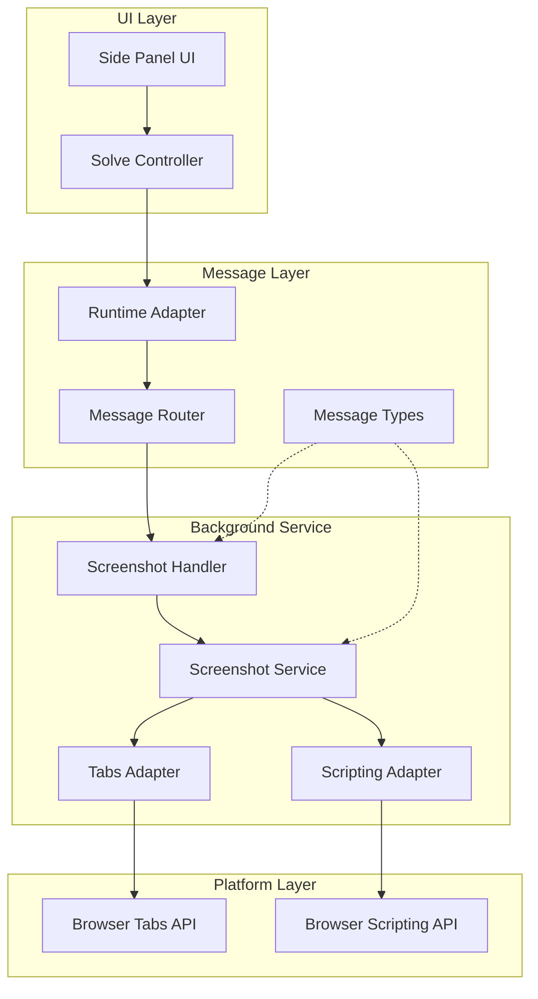
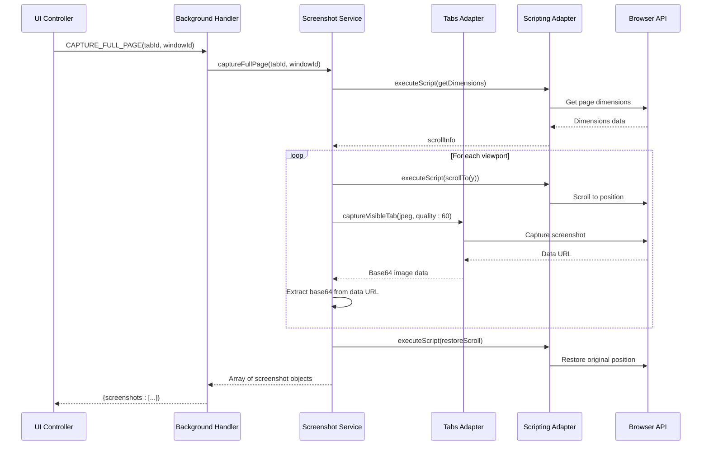
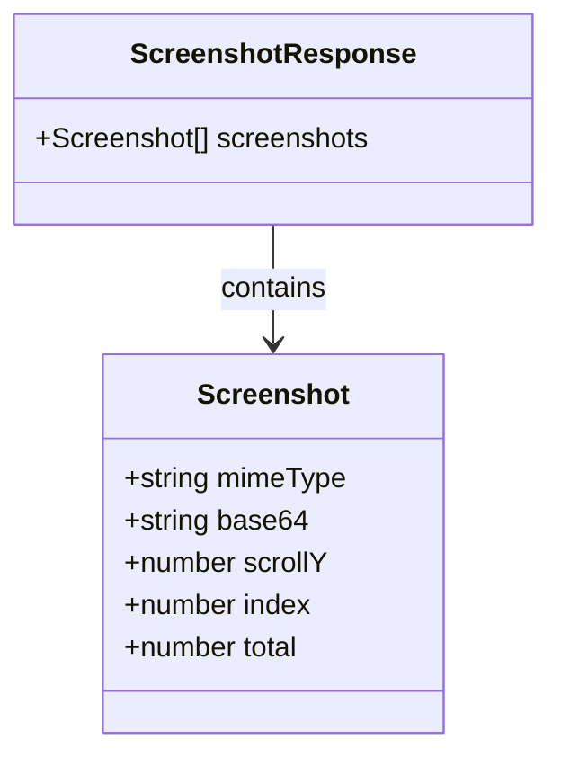
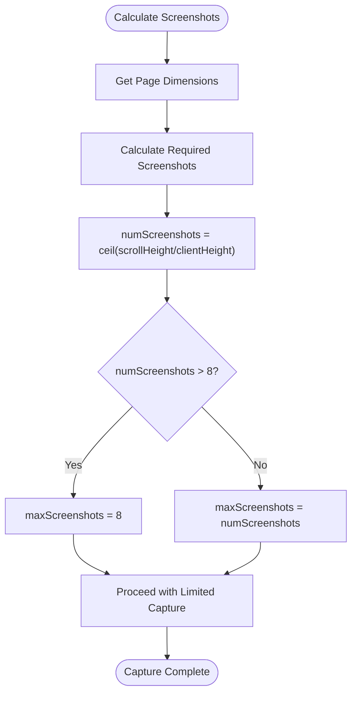
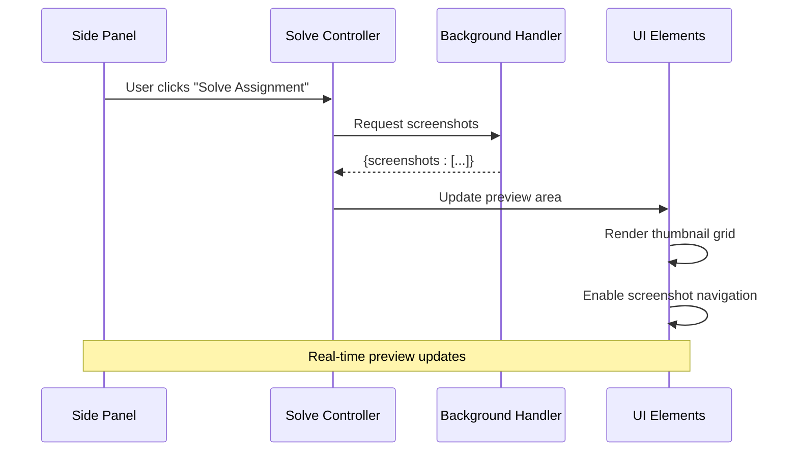
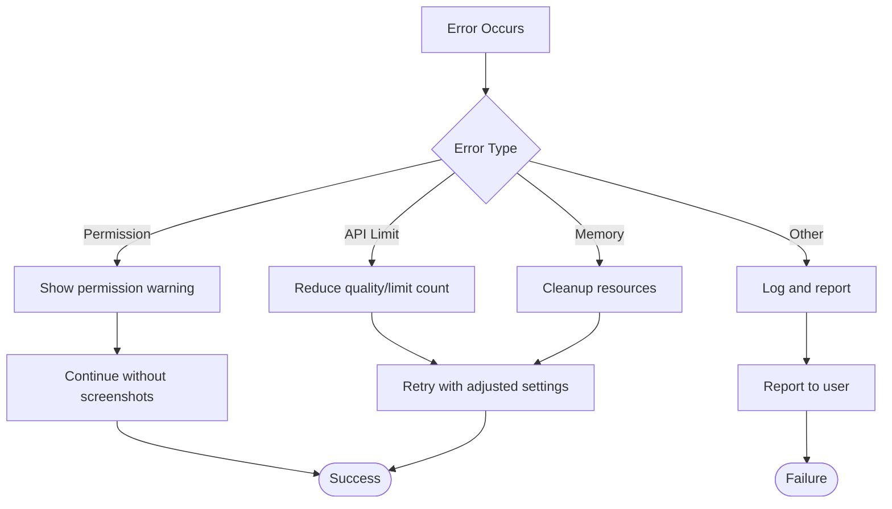

# Screenshot Capture Handler

<cite>
**Referenced Files in This Document**
- [screenshot.js](file://assignment-solver/src/background/screenshot.js)
- [screenshot.js](file://assignment-solver/src/background/handlers/screenshot.js)
- [index.js](file://assignment-solver/src/background/index.js)
- [router.js](file://assignment-solver/src/background/router.js)
- [messages.js](file://assignment-solver/src/core/messages.js)
- [tabs.js](file://assignment-solver/src/platform/tabs.js)
- [scripting.js](file://assignment-solver/src/platform/scripting.js)
- [solve.js](file://assignment-solver/src/ui/controllers/solve.js)
- [sidepanel.html](file://assignment-solver/public/sidepanel.html)
</cite>

## Table of Contents
1. [Introduction](#introduction)
2. [System Architecture](#system-architecture)
3. [Screenshot Generation Process](#screenshot-generation-process)
4. [Image Encoding and Response Formatting](#image-encoding-and-response-formatting)
5. [Supported Formats and Quality Settings](#supported-formats-and-quality-settings)
6. [Size Limitations](#size-limitations)
7. [Integration with UI Panel](#integration-with-ui-panel)
8. [Error Handling](#error-handling)
9. [Usage Examples](#usage-examples)
10. [Performance Considerations](#performance-considerations)
11. [Troubleshooting Guide](#troubleshooting-guide)
12. [Conclusion](#conclusion)

## Introduction

The screenshot capture handler is a core component of the assignment solver extension that enables full-page screenshot capture for NPTEL assignment pages. This system provides visual context to AI models during the assignment solving process, allowing for accurate interpretation of complex layouts, diagrams, and visual elements that may not be fully represented in HTML alone.

The handler operates through a sophisticated multi-step process that captures screenshots of scrolled content, processes them into a standardized format, and delivers them to the UI panel for preview functionality. It integrates seamlessly with the Gemini AI service to enhance extraction accuracy and provides robust error handling for various edge cases encountered in production environments.

## System Architecture

The screenshot capture system follows a layered architecture pattern with clear separation of concerns:



**Diagram sources**
- [index.js](file://assignment-solver/src/background/index.js#L45-L64)
- [router.js](file://assignment-solver/src/background/router.js#L14-L58)
- [solve.js](file://assignment-solver/src/ui/controllers/solve.js#L592-L610)

The architecture ensures loose coupling between components while maintaining clear data flow patterns. The system handles cross-browser compatibility through platform adapters and provides robust error handling mechanisms.

**Section sources**
- [index.js](file://assignment-solver/src/background/index.js#L1-L135)
- [router.js](file://assignment-solver/src/background/router.js#L1-L59)

## Screenshot Generation Process

The screenshot generation process employs a sophisticated multi-step approach designed to handle long web pages efficiently:



**Diagram sources**
- [screenshot.js](file://assignment-solver/src/background/screenshot.js#L23-L112)
- [screenshot.js](file://assignment-solver/src/background/handlers/screenshot.js#L15-L31)

The process begins by analyzing the page dimensions to determine the number of viewport captures needed. The system calculates the optimal number of screenshots based on the page height and viewport dimensions, with intelligent limiting to prevent excessive API usage.

**Section sources**
- [screenshot.js](file://assignment-solver/src/background/screenshot.js#L1-L115)
- [screenshot.js](file://assignment-solver/src/background/handlers/screenshot.js#L1-L33)

## Image Encoding and Response Formatting

The screenshot capture system implements a standardized encoding and response format that ensures compatibility across different browsers and platforms:

### Data URL Processing

The system captures screenshots in JPEG format and processes them through a structured data URL parsing mechanism:

| Property | Type | Description |
|----------|------|-------------|
| `mimeType` | string | MIME type extracted from data URL (e.g., "image/jpeg") |
| `base64` | string | Base64-encoded image data without data URL prefix |
| `scrollY` | number | Vertical scroll position for this screenshot |
| `index` | number | Sequential index of this screenshot in the sequence |
| `total` | number | Total number of screenshots captured |

### Response Structure

The handler returns a comprehensive response object containing all captured screenshots with metadata:



**Diagram sources**
- [screenshot.js](file://assignment-solver/src/background/screenshot.js#L84-L90)

The response format is designed for immediate consumption by the Gemini AI service, which expects structured image data with proper metadata for context preservation.

**Section sources**
- [screenshot.js](file://assignment-solver/src/background/screenshot.js#L74-L97)

## Supported Formats and Quality Settings

The screenshot capture system currently supports a single image format with carefully tuned quality settings:

### Image Format Specifications

| Parameter | Value | Description |
|-----------|-------|-------------|
| **Format** | `jpeg` | JPEG compression format |
| **Quality** | `60` | Compression quality percentage (1-100 scale) |
| **MIME Type** | `image/jpeg` | Standard MIME type identifier |

### Format Selection Rationale

The JPEG format was chosen for several strategic reasons:

1. **Compression Efficiency**: Reduces file size significantly while maintaining acceptable quality
2. **Universal Support**: Ensures compatibility across all supported browsers
3. **Memory Efficiency**: Lower memory footprint compared to PNG or WebP formats
4. **AI Optimization**: Balanced quality-to-size ratio suitable for AI processing

### Quality Impact Analysis

The selected quality setting of 60 provides an optimal balance between:
- **File Size**: Reduced bandwidth and storage requirements
- **Visual Clarity**: Sufficient detail for AI recognition tasks
- **Processing Speed**: Faster transmission and processing times

**Section sources**
- [screenshot.js](file://assignment-solver/src/background/screenshot.js#L76-L79)

## Size Limitations

The screenshot capture system implements multiple layers of size limitation to ensure reliable operation under various conditions:

### Per-Screenshot Limits

| Metric | Limit | Purpose |
|--------|-------|---------|
| **Base64 Length** | No explicit limit | System relies on browser API constraints |
| **Viewport Count** | Maximum 8 screenshots | Prevents API throttling and memory issues |
| **Individual Image Size** | Browser-dependent | Limited by available memory and API constraints |

### Intelligent Limiting Mechanism

The system calculates the required number of screenshots and applies intelligent limiting:



**Diagram sources**
- [screenshot.js](file://assignment-solver/src/background/screenshot.js#L50-L55)

### Memory Management

The system implements careful memory management to prevent browser crashes:
- **Sequential Processing**: Screenshots are captured one at a time
- **Automatic Cleanup**: Previous scroll positions are restored
- **Graceful Degradation**: Partial failures don't halt the entire process

**Section sources**
- [screenshot.js](file://assignment-solver/src/background/screenshot.js#L53-L54)

## Integration with UI Panel

The screenshot capture handler integrates seamlessly with the side panel UI through a well-defined communication protocol:

### UI Preview Integration



**Diagram sources**
- [solve.js](file://assignment-solver/src/ui/controllers/solve.js#L83-L94)
- [sidepanel.html](file://assignment-solver/public/sidepanel.html#L1-L392)

### Communication Protocol

The integration uses the established message-based communication system:

| Message Type | Direction | Purpose |
|--------------|-----------|---------|
| `CAPTURE_FULL_PAGE` | UI → Background | Request screenshot capture |
| `Response` | Background → UI | Return screenshot data |
| `GEMINI_DEBUG` | Background → Content | Debug information relay |

### UI State Management

The side panel maintains synchronized state during screenshot operations:
- **Loading States**: Visual feedback during capture
- **Error Handling**: Graceful degradation on failures
- **Preview Updates**: Real-time thumbnail rendering

**Section sources**
- [solve.js](file://assignment-solver/src/ui/controllers/solve.js#L592-L610)
- [messages.js](file://assignment-solver/src/core/messages.js#L15-L15)

## Error Handling

The screenshot capture system implements comprehensive error handling strategies to ensure robust operation:

### Error Categories and Handling

| Error Type | Detection Method | Handling Strategy | User Impact |
|------------|------------------|-------------------|-------------|
| **Permission Denied** | `SecurityError` | Skip screenshots, continue processing | Reduced AI accuracy warning |
| **API Limit Exceeded** | `NS_ERROR_FAILURE` | Retry with reduced quality | Automatic quality adjustment |
| **Tab Unavailable** | `Invalid tab ID` | Fallback to HTML extraction | Complete processing still possible |
| **Memory Issues** | `OutOfMemoryError` | Limit screenshot count | Reduced visual context |
| **Network Failure** | `Connection error` | Retry with exponential backoff | Temporary unavailability |

### Robustness Features

The system incorporates several built-in safeguards:

1. **Graceful Degradation**: Screenshots are optional for AI processing
2. **Partial Success**: Individual screenshot failures don't halt the entire process
3. **Resource Management**: Automatic cleanup of temporary resources
4. **Logging**: Comprehensive error tracking for debugging

### Error Recovery Mechanisms



**Diagram sources**
- [screenshot.js](file://assignment-solver/src/background/screenshot.js#L41-L44)
- [screenshot.js](file://assignment-solver/src/background/screenshot.js#L93-L96)

**Section sources**
- [screenshot.js](file://assignment-solver/src/background/screenshot.js#L41-L44)
- [screenshot.js](file://assignment-solver/src/background/screenshot.js#L93-L96)

## Usage Examples

### Basic Screenshot Capture

The most common usage scenario involves capturing full-page screenshots for assignment analysis:

```javascript
// Example: Capturing screenshots for an NPTEL assignment
const screenshotResult = await sendMessageWithRetry(
  runtime,
  {
    type: MESSAGE_TYPES.CAPTURE_FULL_PAGE,
    tabId: targetTabId,
    windowId: targetWindowId,
  },
  { maxRetries: 3, baseDelay: 200 }
);

// Process the returned screenshots
const screenshots = screenshotResult?.screenshots || [];
console.log(`Captured ${screenshots.length} screenshots`);
```

### Integration with AI Processing

Screenshots are seamlessly integrated with the Gemini AI service:

```javascript
// Example: Using screenshots with AI extraction
const extraction = await gemini.extract(
  apiKey,
  pageData.html,
  pageInfo,
  pageData.images || [],
  screenshots, // ← Screenshots passed here
  model,
  reasoningLevel
);
```

### Error Handling Implementation

```javascript
// Example: Robust screenshot capture with error handling
let screenshots = [];
try {
  const screenshotResult = await this.captureFullPageScreenshots(
    targetTabId,
    pageData.windowId
  );
  screenshots = screenshotResult?.screenshots || [];
} catch (ssError) {
  logger.log(`Screenshot capture failed: ${ssError.message}`);
  // Continue without screenshots
}
```

**Section sources**
- [solve.js](file://assignment-solver/src/ui/controllers/solve.js#L83-L94)
- [solve.js](file://assignment-solver/src/ui/controllers/solve.js#L592-L610)

## Performance Considerations

The screenshot capture system is optimized for performance across various scenarios:

### Memory Optimization

- **Streaming Capture**: Screenshots are processed individually to minimize memory usage
- **Automatic Cleanup**: Previous scroll positions are restored immediately
- **Resource Limits**: Built-in caps prevent excessive resource consumption

### Network Efficiency

- **JPEG Compression**: Optimized compression reduces bandwidth usage
- **Quality Tuning**: Balanced quality vs. size ratio
- **Batch Processing**: Intelligent batching prevents API throttling

### Browser Compatibility

The system adapts to different browser capabilities:
- **Chrome**: Full feature support with advanced APIs
- **Firefox**: Graceful degradation with alternative approaches
- **Cross-Browser**: Consistent behavior across platforms

## Troubleshooting Guide

### Common Issues and Solutions

| Issue | Symptoms | Solution |
|-------|----------|----------|
| **Permission Denied** | Error: "Permission denied" | Request screenshot permissions in extension settings |
| **No Screenshots Returned** | Empty screenshots array | Check page scrollability and content |
| **Slow Capture Performance** | Long delays in capture | Reduce page complexity or disable animations |
| **Quality Issues** | Low-resolution screenshots | Adjust browser zoom level or page scaling |
| **Memory Errors** | Browser crashes during capture | Close other tabs and reduce screenshot count |

### Debugging Steps

1. **Enable Debug Logging**: Check browser console for detailed error messages
2. **Test Permissions**: Verify extension has screenshot permissions
3. **Validate Page State**: Ensure target page is fully loaded
4. **Monitor Resources**: Watch for memory usage spikes
5. **Check Network**: Verify internet connectivity for AI processing

### Performance Monitoring

The system provides comprehensive logging for troubleshooting:
- **Operation Timing**: Capture duration and processing times
- **Error Tracking**: Detailed error messages and stack traces
- **Resource Usage**: Memory and CPU utilization metrics
- **Success Rates**: Capture success statistics over time

**Section sources**
- [screenshot.js](file://assignment-solver/src/background/screenshot.js#L41-L44)
- [screenshot.js](file://assignment-solver/src/background/screenshot.js#L93-L96)

## Conclusion

The screenshot capture handler represents a sophisticated solution for automated full-page screenshot generation within web browser extensions. Its architecture balances performance, reliability, and user experience while providing robust error handling and cross-browser compatibility.

The system's integration with the Gemini AI service demonstrates the practical value of visual context in automated assignment solving, enabling more accurate problem interpretation and solution generation. The modular design allows for easy maintenance and future enhancements while maintaining backward compatibility.

Key strengths of the implementation include:
- **Robust Error Handling**: Graceful degradation and recovery mechanisms
- **Performance Optimization**: Memory-efficient processing and intelligent limiting
- **Cross-Browser Compatibility**: Unified API abstraction layer
- **Extensible Design**: Modular architecture supporting future enhancements

The screenshot capture handler serves as a foundation for advanced AI-powered automation while maintaining reliability and user trust through transparent error reporting and graceful degradation.