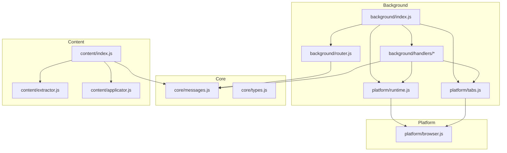
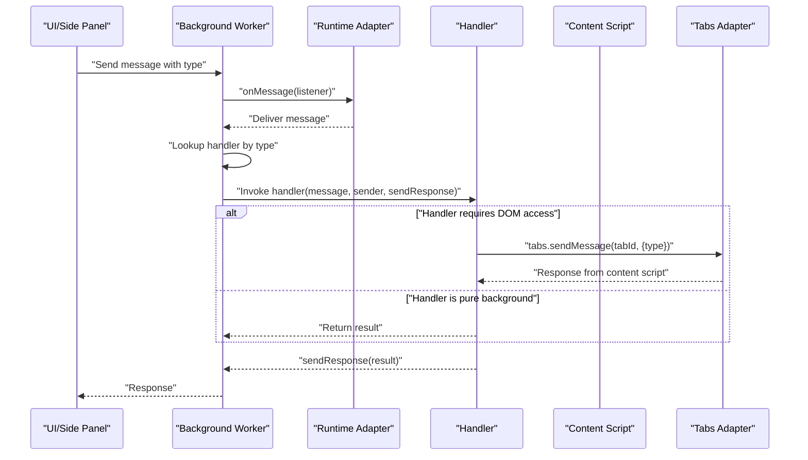
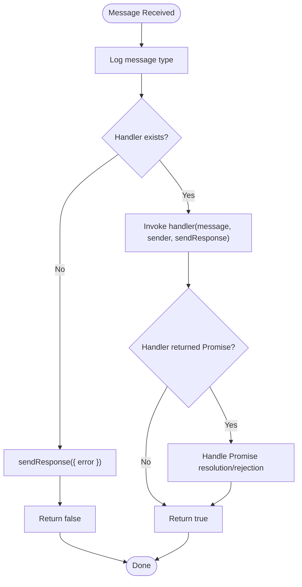
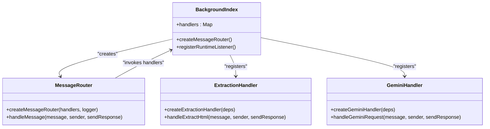
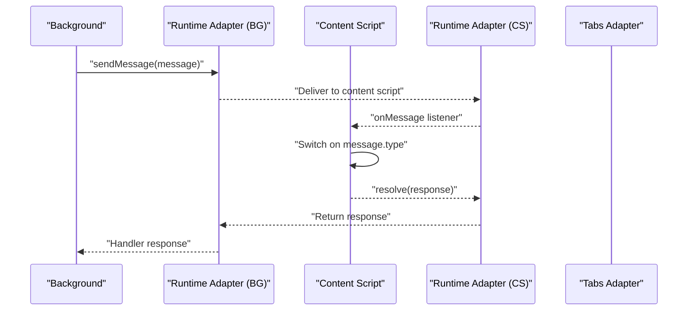
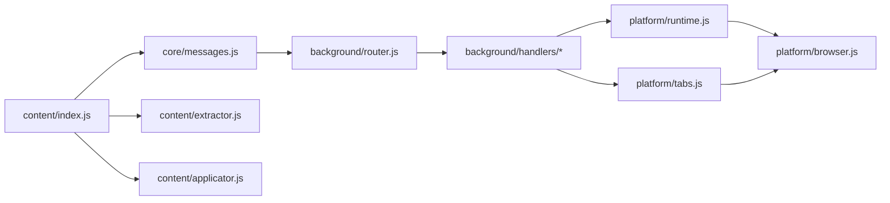

# Message Router

<cite>
**Referenced Files in This Document**
- [router.js](file://assignment-solver/src/background/router.js)
- [messages.js](file://assignment-solver/src/core/messages.js)
- [background/index.js](file://assignment-solver/src/background/index.js)
- [content/index.js](file://assignment-solver/src/content/index.js)
- [extraction.js](file://assignment-solver/src/background/handlers/extraction.js)
- [gemini.js](file://assignment-solver/src/background/handlers/gemini.js)
- [runtime.js](file://assignment-solver/src/platform/runtime.js)
- [tabs.js](file://assignment-solver/src/platform/tabs.js)
- [browser.js](file://assignment-solver/src/platform/browser.js)
- [manifest.json](file://assignment-solver/manifest.json)
</cite>

## Table of Contents
1. [Introduction](#introduction)
2. [Project Structure](#project-structure)
3. [Core Components](#core-components)
4. [Architecture Overview](#architecture-overview)
5. [Detailed Component Analysis](#detailed-component-analysis)
6. [Dependency Analysis](#dependency-analysis)
7. [Performance Considerations](#performance-considerations)
8. [Troubleshooting Guide](#troubleshooting-guide)
9. [Conclusion](#conclusion)

## Introduction
This document explains the message routing system that enables cross-extension communication in the NPTEL Assignment Solver extension. It covers how the router handles incoming messages, registers handlers, dispatches messages to appropriate handlers, and manages errors. It also documents the router factory function, handler mapping patterns, and the dependency injection pattern used in handler creation. Finally, it demonstrates message flow from content scripts to handlers and shows how the system ensures reliable communication across browsers.

## Project Structure
The message routing system spans several modules:
- Background service worker initializes adapters, services, and handlers, then registers the router.
- Core module defines message types and utilities for sending messages with retry logic.
- Platform adapters abstract browser APIs for cross-browser compatibility.
- Content script listens for messages from the background and responds directly to them.
- Handlers encapsulate business logic and depend on platform adapters and services.

**Diagram sources**
- [background/index.js](file://assignment-solver/src/background/index.js#L1-L135)
- [background/router.js](file://assignment-solver/src/background/router.js#L1-L59)
- [core/messages.js](file://assignment-solver/src/core/messages.js#L1-L96)
- [platform/runtime.js](file://assignment-solver/src/platform/runtime.js#L1-L32)
- [platform/tabs.js](file://assignment-solver/src/platform/tabs.js#L1-L53)
- [content/index.js](file://assignment-solver/src/content/index.js#L1-L99)

**Section sources**
- [background/index.js](file://assignment-solver/src/background/index.js#L1-L135)
- [core/messages.js](file://assignment-solver/src/core/messages.js#L1-L96)
- [platform/runtime.js](file://assignment-solver/src/platform/runtime.js#L1-L32)
- [platform/tabs.js](file://assignment-solver/src/platform/tabs.js#L1-L53)
- [content/index.js](file://assignment-solver/src/content/index.js#L1-L99)

## Core Components
- Message router factory: Creates a listener function that routes messages to registered handlers, handles unknown types, and ensures responses are sent for asynchronous operations.
- Message types and utilities: Defines standardized message types and a retry mechanism for transient connection failures.
- Background initialization: Sets up adapters, services, and handlers, then registers the router with the runtime adapter.
- Content script listener: Responds to messages from the background and performs DOM operations.
- Platform adapters: Provide cross-browser compatibility for runtime and tabs APIs.
- Handler factories: Encapsulate business logic and dependency injection for handlers.

Key responsibilities:
- Router: Central dispatcher that validates message types, invokes handlers, and guarantees response delivery.
- Handlers: Implement specific actions (e.g., extraction, screenshot capture, Gemini API requests).
- Adapters: Abstract browser APIs to support both Chrome and Firefox consistently.
- Content script: Bridges background and page DOM for operations requiring DOM access.

**Section sources**
- [router.js](file://assignment-solver/src/background/router.js#L14-L58)
- [messages.js](file://assignment-solver/src/core/messages.js#L5-L33)
- [background/index.js](file://assignment-solver/src/background/index.js#L44-L117)
- [content/index.js](file://assignment-solver/src/content/index.js#L19-L96)
- [runtime.js](file://assignment-solver/src/platform/runtime.js#L12-L31)
- [tabs.js](file://assignment-solver/src/platform/tabs.js#L12-L51)

## Architecture Overview
The message routing architecture follows a request-response pattern with explicit handler registration and robust error handling. The background service worker creates adapters and services, registers handlers in a map keyed by message type, and installs a single router that delegates to the appropriate handler. The content script listens for messages and performs DOM-related tasks.

**Diagram sources**
- [background/index.js](file://assignment-solver/src/background/index.js#L115-L117)
- [router.js](file://assignment-solver/src/background/router.js#L17-L57)
- [extraction.js](file://assignment-solver/src/background/handlers/extraction.js#L78-L95)
- [tabs.js](file://assignment-solver/src/platform/tabs.js#L38-L40)

## Detailed Component Analysis

### Router Factory and Message Dispatching
The router factory function accepts a handler map and an optional logger, returning a listener suitable for installation with the runtime adapter. The listener:
- Logs incoming messages.
- Looks up the handler by message type.
- Returns an error response if no handler is found.
- Invokes the handler synchronously and ensures responses are sent for asynchronous operations.
- Keeps the message channel open for Firefox by returning true when appropriate.

**Diagram sources**
- [router.js](file://assignment-solver/src/background/router.js#L17-L57)

**Section sources**
- [router.js](file://assignment-solver/src/background/router.js#L14-L58)

### Handler Registration Mechanism
Handlers are registered in a map keyed by message type during background initialization. Each handler is created via a factory that receives dependencies (adapters, services, logger). This pattern centralizes dependency management and allows handlers to remain pure functions of their inputs.

Examples of registrations:
- PING handler responds immediately with a pong.
- EXTRACT_HTML handler uses tabs and scripting adapters to inject and communicate with the content script.
- GEMINI_REQUEST handler delegates to a service for API calls.
- Gemini debug handler relays debug messages to the content script.

**Diagram sources**
- [background/index.js](file://assignment-solver/src/background/index.js#L44-L117)
- [router.js](file://assignment-solver/src/background/router.js#L14-L18)
- [extraction.js](file://assignment-solver/src/background/handlers/extraction.js#L15-L18)
- [gemini.js](file://assignment-solver/src/background/handlers/gemini.js#L12-L15)

**Section sources**
- [background/index.js](file://assignment-solver/src/background/index.js#L44-L117)

### Dependency Injection Pattern in Handlers
Handlers are created with a dependency injection pattern:
- Each handler factory takes a deps object containing required collaborators (e.g., tabs, scripting, geminiService, logger).
- The factory returns a handler function that uses these dependencies internally.
- Background initialization composes adapters and services, then passes them to handler factories.

Benefits:
- Testability: Dependencies can be mocked for unit tests.
- Reusability: Same handler logic can be reused with different environments.
- Separation of concerns: Handlers focus on orchestration while adapters/services encapsulate platform-specific behavior.

**Section sources**
- [extraction.js](file://assignment-solver/src/background/handlers/extraction.js#L15-L18)
- [gemini.js](file://assignment-solver/src/background/handlers/gemini.js#L12-L15)
- [background/index.js](file://assignment-solver/src/background/index.js#L33-L42)

### Cross-Browser Communication Flow
The system uses webextension-polyfill to ensure compatibility across Chrome and Firefox. The runtime adapter wraps browser.runtime APIs, and the tabs adapter wraps browser.tabs APIs. The content script listens for messages and performs DOM operations.

**Diagram sources**
- [runtime.js](file://assignment-solver/src/platform/runtime.js#L19-L29)
- [content/index.js](file://assignment-solver/src/content/index.js#L20-L96)
- [tabs.js](file://assignment-solver/src/platform/tabs.js#L38-L40)

**Section sources**
- [runtime.js](file://assignment-solver/src/platform/runtime.js#L12-L31)
- [tabs.js](file://assignment-solver/src/platform/tabs.js#L12-L51)
- [content/index.js](file://assignment-solver/src/content/index.js#L19-L96)

### Error Handling Strategies
The router and handlers implement layered error handling:
- Router: Logs unknown message types and ensures sendResponse is called. For asynchronous handlers, it catches rejections and sends an error response if sendResponse was not already called.
- Handlers: Wrap operations in try/catch blocks, log errors, and send structured error responses. Some handlers include retry-like logic (e.g., content script injection verification).
- Content script: Returns error responses for unknown message types and logs exceptions.

**Section sources**
- [router.js](file://assignment-solver/src/background/router.js#L22-L26)
- [router.js](file://assignment-solver/src/background/router.js#L52-L56)
- [extraction.js](file://assignment-solver/src/background/handlers/extraction.js#L96-L99)
- [content/index.js](file://assignment-solver/src/content/index.js#L88-L95)

### Message Types and Retry Logic
Message types define the contract between components. The core module provides:
- MESSAGE_TYPES: Standardized message type constants.
- createMessage: Helper to construct typed messages.
- sendMessageWithRetry: Retries transient connection failures with exponential delays, useful for Firefox where background initialization can be slower.

**Section sources**
- [messages.js](file://assignment-solver/src/core/messages.js#L5-L33)
- [messages.js](file://assignment-solver/src/core/messages.js#L47-L95)

## Dependency Analysis
The router depends on:
- Message types for dispatching.
- Logger for diagnostics.
- Handlers map for delegation.

Handlers depend on:
- Platform adapters (runtime, tabs) for browser APIs.
- Services (e.g., Gemini service) for external integrations.
- Logger for observability.

Content script depends on:
- Extractor and applicator services for DOM operations.
- Browser runtime for message exchange.

**Diagram sources**
- [core/messages.js](file://assignment-solver/src/core/messages.js#L5-L33)
- [background/router.js](file://assignment-solver/src/background/router.js#L5-L12)
- [background/handlers/extraction.js](file://assignment-solver/src/background/handlers/extraction.js#L5-L13)
- [platform/runtime.js](file://assignment-solver/src/platform/runtime.js#L6-L11)
- [platform/tabs.js](file://assignment-solver/src/platform/tabs.js#L6-L11)
- [content/index.js](file://assignment-solver/src/content/index.js#L7-L11)
- [platform/browser.js](file://assignment-solver/src/platform/browser.js#L9-L16)

**Section sources**
- [background/index.js](file://assignment-solver/src/background/index.js#L44-L117)
- [background/router.js](file://assignment-solver/src/background/router.js#L14-L18)
- [platform/runtime.js](file://assignment-solver/src/platform/runtime.js#L12-L31)
- [platform/tabs.js](file://assignment-solver/src/platform/tabs.js#L12-L51)
- [content/index.js](file://assignment-solver/src/content/index.js#L19-L96)

## Performance Considerations
- Asynchronous response handling: Handlers should resolve promises promptly to avoid blocking the message channel. The router keeps channels open for Firefox by returning true when appropriate.
- Content script injection: The extraction handler injects the content script only when necessary and verifies readiness before proceeding.
- Retry logic: sendMessageWithRetry reduces failure rates for transient connection issues, particularly beneficial for Firefox.
- Logging overhead: Excessive logging can impact performance; use the logger judiciously in production builds.

## Troubleshooting Guide
Common issues and resolutions:
- Unknown message type: The router responds with an error. Verify the message type constant and ensure the handler is registered.
- Content script not responding: The extraction handler attempts to inject the content script and verifies it. If injection fails, the handler returns an error suggesting a page refresh.
- Firefox-specific issues: Keep the message channel open by returning true from the router listener. Use sendMessageWithRetry for background communication.
- CORS and image extraction: The extractor skips images that cannot be converted due to CORS restrictions.

**Section sources**
- [router.js](file://assignment-solver/src/background/router.js#L22-L26)
- [extraction.js](file://assignment-solver/src/background/handlers/extraction.js#L68-L75)
- [messages.js](file://assignment-solver/src/core/messages.js#L47-L95)
- [extractor.js](file://assignment-solver/src/content/extractor.js#L142-L147)

## Conclusion
The message routing system provides a clean, extensible foundation for cross-extension communication. The router factory centralizes dispatch logic, the dependency injection pattern improves modularity and testability, and platform adapters ensure cross-browser compatibility. The combination of standardized message types, robust error handling, and retry mechanisms yields a reliable and maintainable architecture.