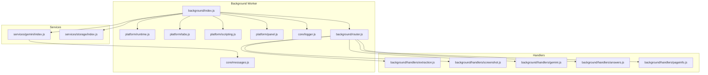
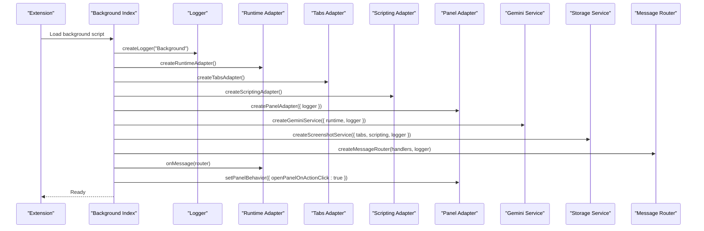
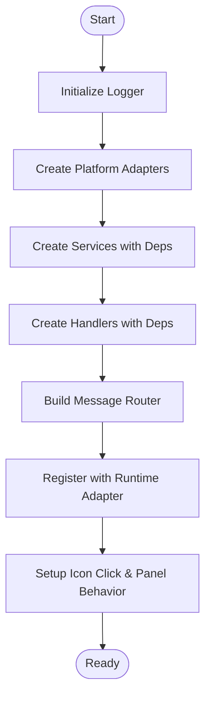
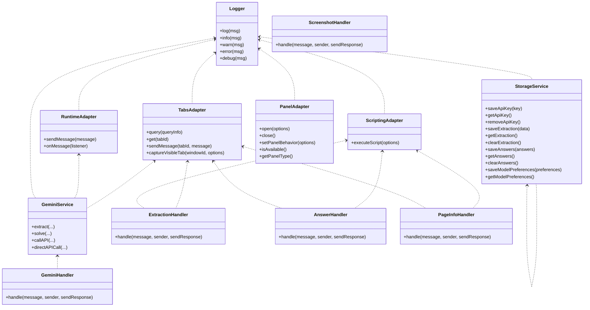
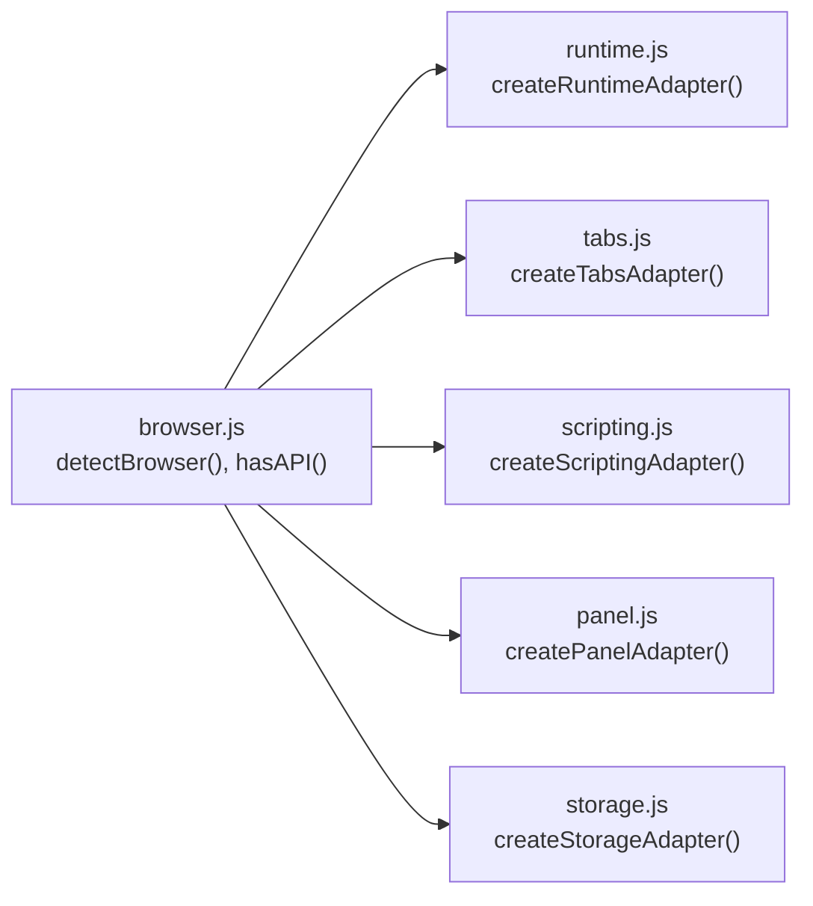
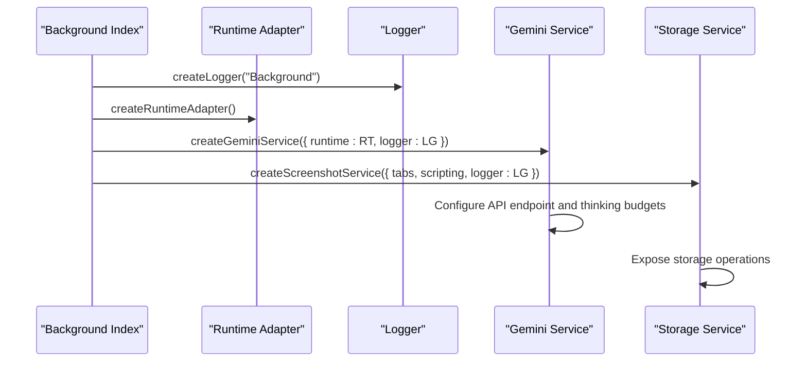
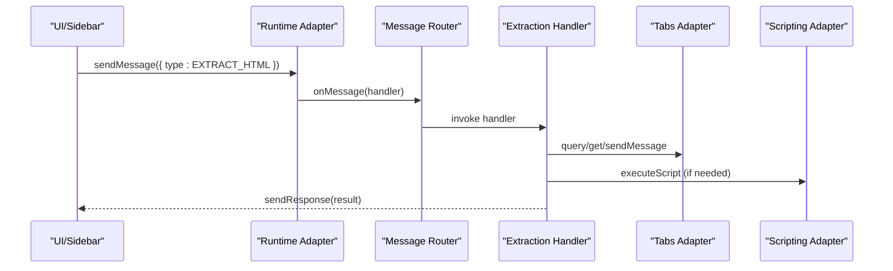
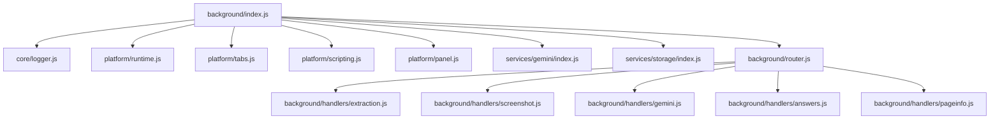

# Service Initialization

<cite>
**Referenced Files in This Document**
- [index.js](file://assignment-solver/src/background/index.js)
- [router.js](file://assignment-solver/src/background/router.js)
- [logger.js](file://assignment-solver/src/core/logger.js)
- [messages.js](file://assignment-solver/src/core/messages.js)
- [browser.js](file://assignment-solver/src/platform/browser.js)
- [runtime.js](file://assignment-solver/src/platform/runtime.js)
- [tabs.js](file://assignment-solver/src/platform/tabs.js)
- [scripting.js](file://assignment-solver/src/platform/scripting.js)
- [panel.js](file://assignment-solver/src/platform/panel.js)
- [storage.js](file://assignment-solver/src/platform/storage.js)
- [gemini/index.js](file://assignment-solver/src/services/gemini/index.js)
- [storage/index.js](file://assignment-solver/src/services/storage/index.js)
- [extraction.js](file://assignment-solver/src/background/handlers/extraction.js)
- [screenshot.js](file://assignment-solver/src/background/handlers/screenshot.js)
- [gemini.js](file://assignment-solver/src/background/handlers/gemini.js)
- [answers.js](file://assignment-solver/src/background/handlers/answers.js)
- [pageinfo.js](file://assignment-solver/src/background/handlers/pageinfo.js)
</cite>

## Table of Contents
1. [Introduction](#introduction)
2. [Project Structure](#project-structure)
3. [Core Components](#core-components)
4. [Architecture Overview](#architecture-overview)
5. [Detailed Component Analysis](#detailed-component-analysis)
6. [Dependency Analysis](#dependency-analysis)
7. [Performance Considerations](#performance-considerations)
8. [Troubleshooting Guide](#troubleshooting-guide)
9. [Conclusion](#conclusion)

## Introduction
This document explains the background service worker initialization process for the assignment-solver extension. It focuses on the dependency injection pattern, platform adapter setup, service creation workflow, and logger configuration. It also details the factory function pattern used throughout the codebase to pass dependencies to handlers and services, and outlines the initialization sequence and error handling during startup.

## Project Structure
The service worker entry point initializes logging, platform adapters, services, handlers, and registers the message router. Platform adapters abstract browser APIs for cross-browser compatibility. Services encapsulate business logic and expose factory functions that accept a dependency bag. Handlers are factory-created functions that receive adapters and logger instances. The router dispatches incoming messages to the appropriate handler.

**Diagram sources**
- [index.js](file://assignment-solver/src/background/index.js#L1-L135)
- [router.js](file://assignment-solver/src/background/router.js#L1-L59)
- [logger.js](file://assignment-solver/src/core/logger.js#L1-L19)
- [messages.js](file://assignment-solver/src/core/messages.js)
- [runtime.js](file://assignment-solver/src/platform/runtime.js#L1-L32)
- [tabs.js](file://assignment-solver/src/platform/tabs.js#L1-L53)
- [scripting.js](file://assignment-solver/src/platform/scripting.js#L1-L28)
- [panel.js](file://assignment-solver/src/platform/panel.js#L1-L119)
- [gemini/index.js](file://assignment-solver/src/services/gemini/index.js#L1-L342)
- [storage/index.js](file://assignment-solver/src/services/storage/index.js#L1-L119)
- [extraction.js](file://assignment-solver/src/background/handlers/extraction.js#L1-L102)
- [screenshot.js](file://assignment-solver/src/background/handlers/screenshot.js#L1-L33)
- [gemini.js](file://assignment-solver/src/background/handlers/gemini.js#L1-L35)
- [answers.js](file://assignment-solver/src/background/handlers/answers.js#L1-L77)
- [pageinfo.js](file://assignment-solver/src/background/handlers/pageinfo.js#L1-L112)

**Section sources**
- [index.js](file://assignment-solver/src/background/index.js#L1-L135)

## Core Components
- Background entry point: Initializes logger, platform adapters, services, handlers, and registers the message router.
- Platform adapters: Provide cross-browser wrappers around browser APIs (runtime, tabs, scripting, panel, storage, browser detection).
- Services: Factory-created modules exposing business logic (Gemini service, storage service).
- Handlers: Factory-created functions receiving adapters and logger to process messages.
- Router: Central dispatcher that invokes handlers and ensures response semantics.

**Section sources**
- [index.js](file://assignment-solver/src/background/index.js#L21-L135)
- [router.js](file://assignment-solver/src/background/router.js#L14-L58)
- [logger.js](file://assignment-solver/src/core/logger.js#L10-L18)
- [runtime.js](file://assignment-solver/src/platform/runtime.js#L12-L31)
- [tabs.js](file://assignment-solver/src/platform/tabs.js#L12-L52)
- [scripting.js](file://assignment-solver/src/platform/scripting.js#L12-L26)
- [panel.js](file://assignment-solver/src/platform/panel.js#L16-L115)
- [storage.js](file://assignment-solver/src/platform/storage.js#L12-L41)
- [gemini/index.js](file://assignment-solver/src/services/gemini/index.js#L60-L341)
- [storage/index.js](file://assignment-solver/src/services/storage/index.js#L12-L118)

## Architecture Overview
The initialization follows a deterministic sequence:
1. Logger creation with a contextual prefix.
2. Platform adapter creation using factory functions.
3. Service instantiation with dependency bags containing adapters and logger.
4. Handler creation with dependency bags.
5. Router creation and registration with the runtime adapter.
6. UI interaction setup (icon click and panel behavior).

**Diagram sources**
- [index.js](file://assignment-solver/src/background/index.js#L21-L135)
- [logger.js](file://assignment-solver/src/core/logger.js#L10-L18)
- [runtime.js](file://assignment-solver/src/platform/runtime.js#L12-L31)
- [tabs.js](file://assignment-solver/src/platform/tabs.js#L12-L52)
- [scripting.js](file://assignment-solver/src/platform/scripting.js#L12-L26)
- [panel.js](file://assignment-solver/src/platform/panel.js#L16-L115)
- [gemini/index.js](file://assignment-solver/src/services/gemini/index.js#L60-L341)
- [router.js](file://assignment-solver/src/background/router.js#L14-L58)

## Detailed Component Analysis

### Background Initialization Sequence
- Logger initialization occurs first to enable logging throughout the startup process.
- Platform adapters are created and configured for cross-browser compatibility.
- Services are instantiated with dependency bags containing adapters and logger.
- Handlers are created with dependency bags and registered under message types.
- The router is created and attached to the runtime adapter’s message listener.
- UI integration sets up icon click behavior and panel behavior.

**Diagram sources**
- [index.js](file://assignment-solver/src/background/index.js#L21-L135)

**Section sources**
- [index.js](file://assignment-solver/src/background/index.js#L21-L135)

### Dependency Injection Pattern
- Factory functions accept a dependency bag (deps) and return objects with methods.
- Adapters are created independently and passed into services and handlers.
- Logger is optionally injected into adapters and services for consistent logging.
- Handlers receive adapters and logger to operate on tabs, scripting, and runtime.

**Diagram sources**
- [logger.js](file://assignment-solver/src/core/logger.js#L10-L18)
- [runtime.js](file://assignment-solver/src/platform/runtime.js#L12-L31)
- [tabs.js](file://assignment-solver/src/platform/tabs.js#L12-L52)
- [scripting.js](file://assignment-solver/src/platform/scripting.js#L12-L26)
- [panel.js](file://assignment-solver/src/platform/panel.js#L16-L115)
- [gemini/index.js](file://assignment-solver/src/services/gemini/index.js#L60-L341)
- [storage/index.js](file://assignment-solver/src/services/storage/index.js#L12-L118)
- [extraction.js](file://assignment-solver/src/background/handlers/extraction.js#L15-L101)
- [screenshot.js](file://assignment-solver/src/background/handlers/screenshot.js#L12-L32)
- [gemini.js](file://assignment-solver/src/background/handlers/gemini.js#L12-L34)
- [answers.js](file://assignment-solver/src/background/handlers/answers.js#L14-L76)
- [pageinfo.js](file://assignment-solver/src/background/handlers/pageinfo.js#L15-L111)

**Section sources**
- [index.js](file://assignment-solver/src/background/index.js#L24-L117)
- [router.js](file://assignment-solver/src/background/router.js#L14-L58)

### Platform Adapter Setup
- Runtime adapter wraps messaging APIs for cross-browser compatibility.
- Tabs adapter abstracts tab queries, retrieval, messaging, and capture.
- Scripting adapter executes scripts in target tabs.
- Panel adapter unifies Chrome sidePanel and Firefox sidebarAction APIs.
- Storage adapter provides local storage operations.
- Browser module detects browser type and exposes safe API accessors.

**Diagram sources**
- [browser.js](file://assignment-solver/src/platform/browser.js#L22-L85)
- [runtime.js](file://assignment-solver/src/platform/runtime.js#L12-L31)
- [tabs.js](file://assignment-solver/src/platform/tabs.js#L12-L52)
- [scripting.js](file://assignment-solver/src/platform/scripting.js#L12-L26)
- [panel.js](file://assignment-solver/src/platform/panel.js#L16-L115)
- [storage.js](file://assignment-solver/src/platform/storage.js#L12-L41)

**Section sources**
- [runtime.js](file://assignment-solver/src/platform/runtime.js#L12-L31)
- [tabs.js](file://assignment-solver/src/platform/tabs.js#L12-L52)
- [scripting.js](file://assignment-solver/src/platform/scripting.js#L12-L26)
- [panel.js](file://assignment-solver/src/platform/panel.js#L16-L115)
- [storage.js](file://assignment-solver/src/platform/storage.js#L12-L41)
- [browser.js](file://assignment-solver/src/platform/browser.js#L22-L85)

### Service Creation Workflow
- Gemini service factory accepts runtime and logger, constructs content parts, and exposes extract, solve, and API call methods.
- Storage service factory accepts storage and logger, manages API key, cache, answers, and model preferences.
- Handlers receive adapters and logger to operate on tabs, scripting, and runtime.

**Diagram sources**
- [index.js](file://assignment-solver/src/background/index.js#L33-L42)
- [gemini/index.js](file://assignment-solver/src/services/gemini/index.js#L60-L341)
- [storage/index.js](file://assignment-solver/src/services/storage/index.js#L12-L118)

**Section sources**
- [index.js](file://assignment-solver/src/background/index.js#L33-L42)
- [gemini/index.js](file://assignment-solver/src/services/gemini/index.js#L60-L341)
- [storage/index.js](file://assignment-solver/src/services/storage/index.js#L12-L118)

### Logger Configuration
- Logger factory creates a prefixed logger with log, info, warn, error, and debug methods.
- Logger instances are passed to adapters and services to maintain consistent context in logs.

**Section sources**
- [logger.js](file://assignment-solver/src/core/logger.js#L10-L18)
- [index.js](file://assignment-solver/src/background/index.js#L22-L22)

### Factory Function Pattern
- Platform adapters: createRuntimeAdapter, createTabsAdapter, createScriptingAdapter, createPanelAdapter, createStorageAdapter.
- Services: createGeminiService, createScreenshotService (as constructed in background index).
- Handlers: createExtractionHandler, createScreenshotHandler, createGeminiHandler, createAnswerHandler, createPageInfoHandler.
- Router: createMessageRouter.

Each factory accepts a dependency bag and returns a function or object ready to use.

**Section sources**
- [runtime.js](file://assignment-solver/src/platform/runtime.js#L12-L31)
- [tabs.js](file://assignment-solver/src/platform/tabs.js#L12-L52)
- [scripting.js](file://assignment-solver/src/platform/scripting.js#L12-L26)
- [panel.js](file://assignment-solver/src/platform/panel.js#L16-L115)
- [storage.js](file://assignment-solver/src/platform/storage.js#L12-L41)
- [gemini/index.js](file://assignment-solver/src/services/gemini/index.js#L60-L341)
- [storage/index.js](file://assignment-solver/src/services/storage/index.js#L12-L118)
- [extraction.js](file://assignment-solver/src/background/handlers/extraction.js#L15-L101)
- [screenshot.js](file://assignment-solver/src/background/handlers/screenshot.js#L12-L32)
- [gemini.js](file://assignment-solver/src/background/handlers/gemini.js#L12-L34)
- [answers.js](file://assignment-solver/src/background/handlers/answers.js#L14-L76)
- [pageinfo.js](file://assignment-solver/src/background/handlers/pageinfo.js#L15-L111)
- [router.js](file://assignment-solver/src/background/router.js#L14-L58)

### Message Routing and Handler Dispatch
- Router receives handlers mapped by message type and logs incoming messages.
- It ensures asynchronous handlers resolve and always calls sendResponse.
- Handlers use adapters and logger to perform operations and respond appropriately.

**Diagram sources**
- [router.js](file://assignment-solver/src/background/router.js#L17-L57)
- [extraction.js](file://assignment-solver/src/background/handlers/extraction.js#L18-L100)
- [tabs.js](file://assignment-solver/src/platform/tabs.js#L19-L40)
- [scripting.js](file://assignment-solver/src/platform/scripting.js#L23-L25)

**Section sources**
- [router.js](file://assignment-solver/src/background/router.js#L14-L58)
- [extraction.js](file://assignment-solver/src/background/handlers/extraction.js#L15-L101)

### Initialization Sequence Examples
- Logger creation: [index.js](file://assignment-solver/src/background/index.js#L22-L22)
- Adapter creation: [index.js](file://assignment-solver/src/background/index.js#L25-L28)
- Service creation: [index.js](file://assignment-solver/src/background/index.js#L33-L42)
- Handler creation: [index.js](file://assignment-solver/src/background/index.js#L51-L112)
- Router registration: [index.js](file://assignment-solver/src/background/index.js#L116-L117)
- UI setup: [index.js](file://assignment-solver/src/background/index.js#L120-L132)

**Section sources**
- [index.js](file://assignment-solver/src/background/index.js#L25-L132)

### Error Handling During Startup
- Router catches synchronous and asynchronous errors and ensures sendResponse is called.
- Handlers wrap operations and return meaningful error messages to callers.
- Panel adapter logs and rethrows errors when panel APIs are unavailable.
- Gemini service logs failures and throws parsed errors for invalid responses.

**Section sources**
- [router.js](file://assignment-solver/src/background/router.js#L52-L56)
- [extraction.js](file://assignment-solver/src/background/handlers/extraction.js#L96-L100)
- [answers.js](file://assignment-solver/src/background/handlers/answers.js#L71-L76)
- [panel.js](file://assignment-solver/src/platform/panel.js#L48-L51)
- [gemini/index.js](file://assignment-solver/src/services/gemini/index.js#L210-L216)

## Dependency Analysis
The background entry point orchestrates dependencies and avoids tight coupling by passing adapters and logger into factories. Handlers depend on adapters and logger, while services depend on adapters and logger. The router depends on handlers and logger.

**Diagram sources**
- [index.js](file://assignment-solver/src/background/index.js#L1-L135)
- [router.js](file://assignment-solver/src/background/router.js#L1-L59)
- [logger.js](file://assignment-solver/src/core/logger.js#L1-L19)
- [runtime.js](file://assignment-solver/src/platform/runtime.js#L1-L32)
- [tabs.js](file://assignment-solver/src/platform/tabs.js#L1-L53)
- [scripting.js](file://assignment-solver/src/platform/scripting.js#L1-L28)
- [panel.js](file://assignment-solver/src/platform/panel.js#L1-L119)
- [gemini/index.js](file://assignment-solver/src/services/gemini/index.js#L1-L342)
- [storage/index.js](file://assignment-solver/src/services/storage/index.js#L1-L119)
- [extraction.js](file://assignment-solver/src/background/handlers/extraction.js#L1-L102)
- [screenshot.js](file://assignment-solver/src/background/handlers/screenshot.js#L1-L33)
- [gemini.js](file://assignment-solver/src/background/handlers/gemini.js#L1-L35)
- [answers.js](file://assignment-solver/src/background/handlers/answers.js#L1-L77)
- [pageinfo.js](file://assignment-solver/src/background/handlers/pageinfo.js#L1-L112)

**Section sources**
- [index.js](file://assignment-solver/src/background/index.js#L1-L135)

## Performance Considerations
- Cross-browser compatibility relies on webextension-polyfill; ensure minimal overhead by avoiding redundant API checks.
- Asynchronous handlers must return true to keep the message channel open (especially for Firefox).
- Content script injection delays accommodate slower environments like Firefox; tune timing based on observed performance.
- Gemini API calls bypass message channels in the background worker to reduce latency and avoid timeouts.

## Troubleshooting Guide
- No handler for message type: Router logs unknown types and responds with an error.
- Content script not loaded: Handlers attempt injection and verification; failures return actionable errors.
- Panel APIs unavailable: Panel adapter logs and rethrows; gracefully handle absence of close API on Chrome.
- Gemini API errors: Service parses raw responses and logs candidate details to aid debugging.

**Section sources**
- [router.js](file://assignment-solver/src/background/router.js#L22-L26)
- [extraction.js](file://assignment-solver/src/background/handlers/extraction.js#L68-L75)
- [answers.js](file://assignment-solver/src/background/handlers/answers.js#L54-L61)
- [panel.js](file://assignment-solver/src/platform/panel.js#L48-L51)
- [gemini/index.js](file://assignment-solver/src/services/gemini/index.js#L208-L216)

## Conclusion
The assignment-solver extension employs a clean dependency injection pattern with factory functions to initialize platform adapters, services, and handlers. The background worker orchestrates this initialization, registers a robust message router, and integrates UI interactions. Consistent logging and explicit error handling ensure reliable operation across browsers.