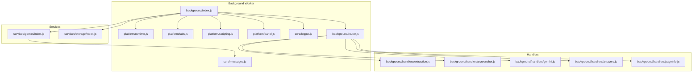
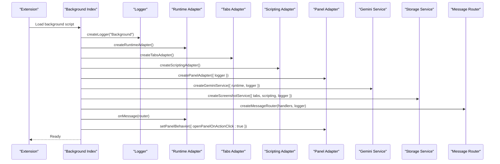
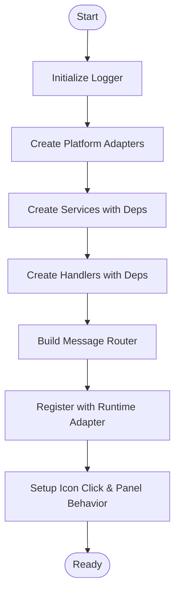
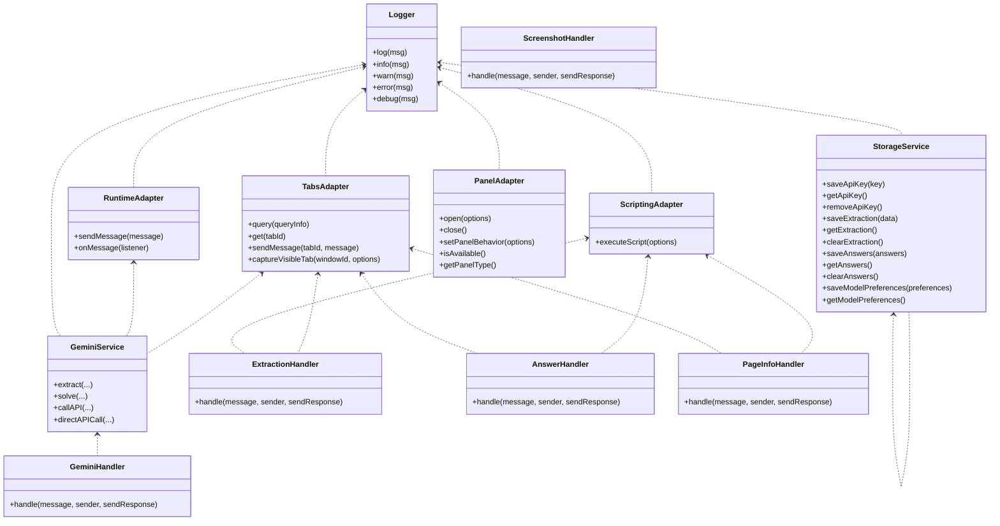
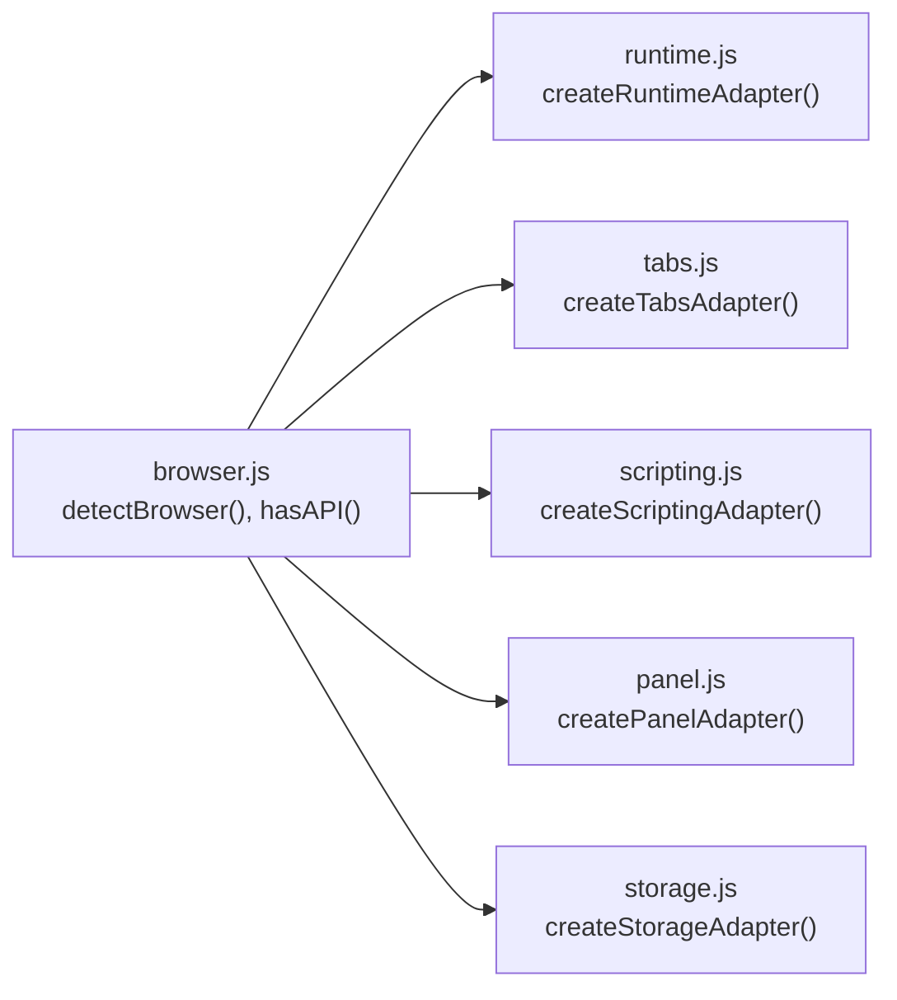
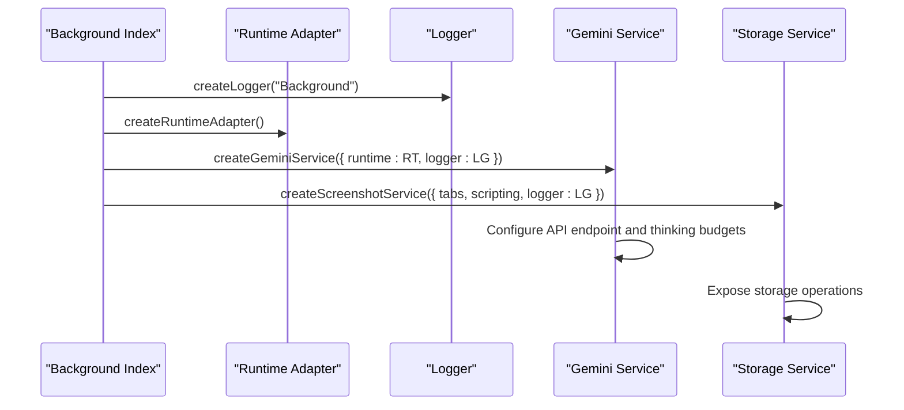
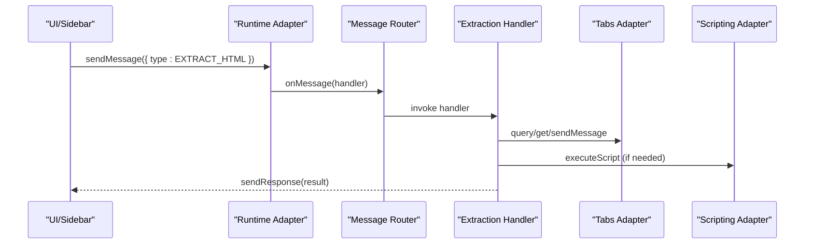
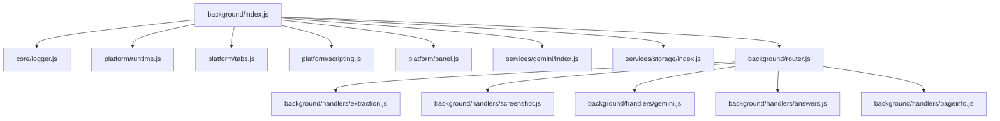

# Service initialization

## Introduction
This page explains the background service worker initialization process for the assignment-solver extension. It focuses on the dependency injection pattern, platform adapter setup, service creation workflow, and logger configuration. It also details the factory function pattern used throughout the codebase to pass dependencies to handlers and services, and outlines the initialization sequence and error handling during startup.

## Project structure
The service worker entry point initializes logging, platform adapters, services, handlers, and registers the message router. Platform adapters abstract browser APIs for cross-browser compatibility. Services encapsulate business logic and expose factory functions that accept a dependency bag. Handlers are factory-created functions that receive adapters and logger instances. The router dispatches incoming messages to the appropriate handler.

```mermaid
graph TB
subgraph "Background Worker"
BG["background/index.js"]
RT["platform/runtime.js"]
TL["platform/tabs.js"]
SC["platform/scripting.js"]
PL["platform/panel.js"]
LG["core/logger.js"]
MS["core/messages.js"]
RG["background/router.js"]
end
subgraph "Services"
GS["services/gemini/index.js"]
SS["services/storage/index.js"]
end
subgraph "Handlers"
EH["background/handlers/extraction.js"]
SH["background/handlers/screenshot.js"]
GH["background/handlers/gemini.js"]
AH["background/handlers/answers.js"]
PH["background/handlers/pageinfo.js"]
end
BG --> LG
BG --> RT
BG --> TL
BG --> SC
BG --> PL
BG --> GS
BG --> SS
BG --> RG
RG --> EH
RG --> SH
RG --> GH
RG --> AH
RG --> PH
GS --> MS
```

## Core components
- Background entry point: Initializes logger, platform adapters, services, handlers, and registers the message router.
- Platform adapters: Provide cross-browser wrappers around browser APIs (runtime, tabs, scripting, panel, storage, browser detection).
- Services: Factory-created modules exposing business logic (Gemini service, storage service).
- Handlers: Factory-created functions receiving adapters and logger to process messages.
- Router: Central dispatcher that invokes handlers and ensures response semantics.

## Architecture overview
The initialization follows a deterministic sequence:
1. Logger creation with a contextual prefix.
2. Platform adapter creation using factory functions.
3. Service instantiation with dependency bags containing adapters and logger.
4. Handler creation with dependency bags.
5. Router creation and registration with the runtime adapter.
6. UI interaction setup (icon click and panel behavior).

```mermaid
sequenceDiagram
participant Ext as "Extension"
participant BG as "Background Index"
participant Log as "Logger"
participant RT as "Runtime Adapter"
participant TL as "Tabs Adapter"
participant SC as "Scripting Adapter"
participant PL as "Panel Adapter"
participant GS as "Gemini Service"
participant SS as "Storage Service"
participant RG as "Message Router"
Ext->>BG : Load background script
BG->>Log : createLogger("Background")
BG->>RT : createRuntimeAdapter()
BG->>TL : createTabsAdapter()
BG->>SC : createScriptingAdapter()
BG->>PL : createPanelAdapter({ logger })
BG->>GS : createGeminiService({ runtime, logger })
BG->>SS : createScreenshotService({ tabs, scripting, logger })
BG->>RG : createMessageRouter(handlers, logger)
BG->>RT : onMessage(router)
BG->>PL : setPanelBehavior({ openPanelOnActionClick : true })
BG-->>Ext : Ready
```

## Detailed component analysis

### Background initialization sequence
- Logger initialization occurs first to enable logging throughout the startup process.
- Platform adapters are created and configured for cross-browser compatibility.
- Services are instantiated with dependency bags containing adapters and logger.
- Handlers are created with dependency bags and registered under message types.
- The router is created and attached to the runtime adapter's message listener.
- UI integration sets up icon click behavior and panel behavior.

```mermaid
flowchart TD
Start(["Start"]) --> InitLogger["Initialize Logger"]
InitLogger --> CreateAdapters["Create Platform Adapters"]
CreateAdapters --> CreateServices["Create Services with Deps"]
CreateServices --> CreateHandlers["Create Handlers with Deps"]
CreateHandlers --> BuildRouter["Build Message Router"]
BuildRouter --> RegisterRouter["Register with Runtime Adapter"]
RegisterRouter --> SetupUI["Setup Icon Click & Panel Behavior"]
SetupUI --> Done(["Ready"])
```

### Dependency injection pattern
- Factory functions accept a dependency bag (deps) and return objects with methods.
- Adapters are created independently and passed into services and handlers.
- Logger is optionally injected into adapters and services for consistent logging.
- Handlers receive adapters and logger to operate on tabs, scripting, and runtime.

```mermaid
classDiagram
class Logger {
+log(msg)
+info(msg)
+warn(msg)
+error(msg)
+debug(msg)
}
class RuntimeAdapter {
+sendMessage(message)
+onMessage(listener)
}
class TabsAdapter {
+query(queryInfo)
+get(tabId)
+sendMessage(tabId, message)
+captureVisibleTab(windowId, options)
}
class ScriptingAdapter {
+executeScript(options)
}
class PanelAdapter {
+open(options)
+close()
+setPanelBehavior(options)
+isAvailable()
+getPanelType()
}
class GeminiService {
+extract(...)
+solve(...)
+callAPI(...)
+directAPICall(...)
}
class StorageService {
+saveApiKey(key)
+getApiKey()
+removeApiKey()
+saveExtraction(data)
+getExtraction()
+clearExtraction()
+saveAnswers(answers)
+getAnswers()
+clearAnswers()
+saveModelPreferences(preferences)
+getModelPreferences()
}
class ExtractionHandler {
+handle(message, sender, sendResponse)
}
class ScreenshotHandler {
+handle(message, sender, sendResponse)
}
class GeminiHandler {
+handle(message, sender, sendResponse)
}
class AnswerHandler {
+handle(message, sender, sendResponse)
}
class PageInfoHandler {
+handle(message, sender, sendResponse)
}
Logger <.. RuntimeAdapter
Logger <.. TabsAdapter
Logger <.. ScriptingAdapter
Logger <.. PanelAdapter
Logger <.. GeminiService
Logger <.. StorageService
RuntimeAdapter <.. GeminiService
TabsAdapter <.. GeminiService
ScriptingAdapter <.. ExtractionHandler
TabsAdapter <.. ExtractionHandler
TabsAdapter <.. AnswerHandler
ScriptingAdapter <.. AnswerHandler
TabsAdapter <.. PageInfoHandler
ScriptingAdapter <.. PageInfoHandler
GeminiService <.. GeminiHandler
StorageService <.. StorageService
```

### Platform adapter setup
- Runtime adapter wraps messaging APIs for cross-browser compatibility.
- Tabs adapter abstracts tab queries, retrieval, messaging, and capture.
- Scripting adapter executes scripts in target tabs.
- Panel adapter unifies Chrome sidePanel and Firefox sidebarAction APIs.
- Storage adapter provides local storage operations.
- Browser module detects browser type and exposes safe API accessors.

```mermaid
graph LR
BR["browser.js<br/>detectBrowser(), hasAPI()"] --> RT["runtime.js<br/>createRuntimeAdapter()"]
BR --> TL["tabs.js<br/>createTabsAdapter()"]
BR --> SC["scripting.js<br/>createScriptingAdapter()"]
BR --> PL["panel.js<br/>createPanelAdapter()"]
BR --> ST["storage.js<br/>createStorageAdapter()"]
```

### Service creation workflow
- Gemini service factory accepts runtime and logger, constructs content parts, and exposes extract, solve, and API call methods.
- Storage service factory accepts storage and logger, manages API key, cache, answers, and model preferences.
- Handlers receive adapters and logger to operate on tabs, scripting, and runtime.

```mermaid
sequenceDiagram
participant BG as "Background Index"
participant RT as "Runtime Adapter"
participant LG as "Logger"
participant GS as "Gemini Service"
participant SS as "Storage Service"
BG->>LG : createLogger("Background")
BG->>RT : createRuntimeAdapter()
BG->>GS : createGeminiService({ runtime : RT, logger : LG })
BG->>SS : createScreenshotService({ tabs, scripting, logger : LG })
GS->>GS : Configure API endpoint and thinking budgets
SS->>SS : Expose storage operations
```

### Logger configuration
- Logger factory creates a prefixed logger with log, info, warn, error, and debug methods.
- Logger instances are passed to adapters and services to maintain consistent context in logs.

### Factory function pattern
- Platform adapters: createRuntimeAdapter, createTabsAdapter, createScriptingAdapter, createPanelAdapter, createStorageAdapter.
- Services: createGeminiService, createScreenshotService (as constructed in background index).
- Handlers: createExtractionHandler, createScreenshotHandler, createGeminiHandler, createAnswerHandler, createPageInfoHandler.
- Router: createMessageRouter.

Each factory accepts a dependency bag and returns a function or object ready to use.

### Message routing and handler dispatch
- Router receives handlers mapped by message type and logs incoming messages.
- It ensures asynchronous handlers resolve and always calls sendResponse.
- Handlers use adapters and logger to perform operations and respond appropriately.

```mermaid
sequenceDiagram
participant UI as "UI/Sidebar"
participant RT as "Runtime Adapter"
participant RG as "Message Router"
participant EH as "Extraction Handler"
participant TL as "Tabs Adapter"
participant SC as "Scripting Adapter"
UI->>RT : sendMessage({ type : EXTRACT_HTML })
RT->>RG : onMessage(handler)
RG->>EH : invoke handler
EH->>TL : query/get/sendMessage
EH->>SC : executeScript (if needed)
EH-->>UI : sendResponse(result)
```

### Initialization sequence examples
- Logger creation: `index.js`
- Adapter creation: `index.js`
- Service creation: `index.js`
- Handler creation: `index.js`
- Router registration: `index.js`
- UI setup: `index.js`

### Error handling during startup
- Router catches synchronous and asynchronous errors and ensures sendResponse is called.
- Handlers wrap operations and return meaningful error messages to callers.
- Panel adapter logs and rethrows errors when panel APIs are unavailable.
- Gemini service logs failures and throws parsed errors for invalid responses.

## Dependency analysis
The background entry point orchestrates dependencies and avoids tight coupling by passing adapters and logger into factories. Handlers depend on adapters and logger, while services depend on adapters and logger. The router depends on handlers and logger.

```mermaid
graph TB
BG["background/index.js"] --> LG["core/logger.js"]
BG --> RT["platform/runtime.js"]
BG --> TL["platform/tabs.js"]
BG --> SC["platform/scripting.js"]
BG --> PL["platform/panel.js"]
BG --> GS["services/gemini/index.js"]
BG --> SS["services/storage/index.js"]
BG --> RG["background/router.js"]
RG --> EH["background/handlers/extraction.js"]
RG --> SH["background/handlers/screenshot.js"]
RG --> GH["background/handlers/gemini.js"]
RG --> AH["background/handlers/answers.js"]
RG --> PH["background/handlers/pageinfo.js"]
```

## Performance considerations
- Cross-browser compatibility relies on webextension-polyfill; ensure minimal overhead by avoiding redundant API checks.
- Asynchronous handlers must return true to keep the message channel open (especially for Firefox).
- Content script injection delays accommodate slower environments like Firefox; tune timing based on observed performance.
- Gemini API calls bypass message channels in the background worker to reduce latency and avoid timeouts.

## Troubleshooting guide
- No handler for message type: Router logs unknown types and responds with an error.
- Content script not loaded: Handlers attempt injection and verification; failures return actionable errors.
- Panel APIs unavailable: Panel adapter logs and rethrows; gracefully handle absence of close API on Chrome.
- Gemini API errors: Service parses raw responses and logs candidate details to aid debugging.

## Conclusion
The assignment-solver extension employs a clean dependency injection pattern with factory functions to initialize platform adapters, services, and handlers. The background worker orchestrates this initialization, registers a reliable message router, and integrates UI interactions. Consistent logging and explicit error handling ensure reliable operation across browsers.
