# Applicator System

<cite>
**Referenced Files in This Document**
- [applicator.js](file://assignment-solver/src/content/applicator.js)
- [index.js](file://assignment-solver/src/content/index.js)
- [answers.js](file://assignment-solver/src/background/handlers/answers.js)
- [messages.js](file://assignment-solver/src/core/messages.js)
- [solve.js](file://assignment-solver/src/ui/controllers/solve.js)
- [progress.js](file://assignment-solver/src/ui/controllers/progress.js)
- [state.js](file://assignment-solver/src/ui/state.js)
- [browser.js](file://assignment-solver/src/platform/browser.js)
- [router.js](file://assignment-solver/src/background/router.js)
- [background.js](file://assignment-solver/src/background/index.js)
- [sidepanel.html](file://assignment-solver/public/sidepanel.html)
- [index.js](file://assignment-solver/src/ui/index.js)
</cite>

## Table of Contents
1. [Introduction](#introduction)
2. [Project Structure](#project-structure)
3. [Core Components](#core-components)
4. [Architecture Overview](#architecture-overview)
5. [Detailed Component Analysis](#detailed-component-analysis)
6. [Dependency Analysis](#dependency-analysis)
7. [Performance Considerations](#performance-considerations)
8. [Troubleshooting Guide](#troubleshooting-guide)
9. [Conclusion](#conclusion)

## Introduction
This document explains the applicator system responsible for applying AI-generated answers to form elements on assignment pages. It covers how the system identifies and manipulates different input types (radio buttons, checkboxes, text inputs, and fill-in-the-blank areas), how it submits assignments, and how it integrates with the broader assignment-solving pipeline. The documentation includes DOM manipulation techniques, validation and error handling, submission workflows, and user interaction simulation.

## Project Structure
The applicator system spans three layers:
- Content script: Applies answers and submits forms on the target page
- Background service worker: Routes messages and manages content script lifecycle
- UI controllers: Drive the end-to-end flow, including progress reporting and user controls

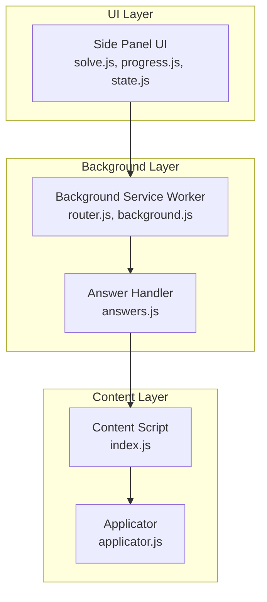

**Diagram sources**
- [solve.js](file://assignment-solver/src/ui/controllers/solve.js#L1-L778)
- [progress.js](file://assignment-solver/src/ui/controllers/progress.js#L1-L164)
- [state.js](file://assignment-solver/src/ui/state.js#L1-L41)
- [router.js](file://assignment-solver/src/background/router.js#L1-L59)
- [background.js](file://assignment-solver/src/background/index.js#L1-L135)
- [answers.js](file://assignment-solver/src/background/handlers/answers.js#L1-L77)
- [index.js](file://assignment-solver/src/content/index.js#L1-L99)
- [applicator.js](file://assignment-solver/src/content/applicator.js#L1-L221)

**Section sources**
- [sidepanel.html](file://assignment-solver/public/sidepanel.html#L1-L392)
- [index.js](file://assignment-solver/src/ui/index.js#L1-L113)

## Core Components
- Applicator service: Applies answers to radio buttons, checkboxes, and text inputs; triggers form submission
- Content script: Receives messages, initializes applicator, and forwards requests
- Answer handler: Ensures content script is loaded and relays messages to it
- UI controllers: Orchestrate extraction, solving, filling, and submission with progress feedback

Key responsibilities:
- Answer application: Single choice, multi choice, and fill-in-the-blank
- Form submission: Clicks submit button and handles confirmation dialogs
- User interaction simulation: Dispatches change/input events and keyboard events
- Error handling: Graceful logging and recovery for missing elements or invalid data

**Section sources**
- [applicator.js](file://assignment-solver/src/content/applicator.js#L12-L221)
- [index.js](file://assignment-solver/src/content/index.js#L16-L99)
- [answers.js](file://assignment-solver/src/background/handlers/answers.js#L14-L77)
- [solve.js](file://assignment-solver/src/ui/controllers/solve.js#L618-L668)

## Architecture Overview
The applicator participates in a multi-step assignment-solving workflow:
1. UI triggers extraction and solving
2. Background routes messages to content script
3. Content script applies answers and optionally submits
4. UI updates progress and displays results

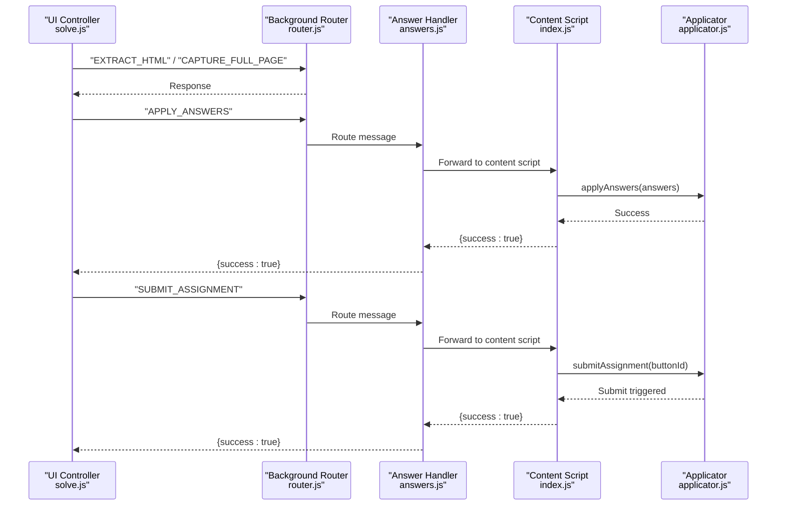

**Diagram sources**
- [solve.js](file://assignment-solver/src/ui/controllers/solve.js#L618-L668)
- [router.js](file://assignment-solver/src/background/router.js#L14-L59)
- [answers.js](file://assignment-solver/src/background/handlers/answers.js#L14-L77)
- [index.js](file://assignment-solver/src/content/index.js#L67-L78)
- [applicator.js](file://assignment-solver/src/content/applicator.js#L21-L48)
- [applicator.js](file://assignment-solver/src/content/applicator.js#L201-L216)

## Detailed Component Analysis

### Applicator Service
The applicator encapsulates answer application and submission logic:
- applyAnswers: Iterates through AI-generated answers and delegates by question type
- applySingleChoice: Finds radio inputs by ID/value/name/partial ID and clicks/selects
- applyMultiChoice: Handles multiple selections across checkbox groups
- applyFillBlank: Sets text values and simulates user input via events
- submitAssignment: Locates submit button by multiple strategies and triggers click

DOM manipulation techniques:
- Element selection via getElementById, querySelector, and querySelectorAll
- Programmatic clicking and event dispatching for change/input/keyup
- Value assignment for text inputs and textareas

Validation and error handling:
- Logs warnings for missing IDs or invalid arrays
- Gracefully skips elements that cannot be found
- Wraps per-answer application in try/catch to prevent single failures from stopping the batch

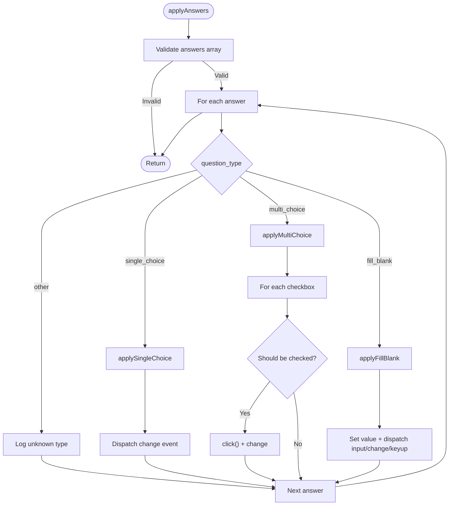

**Diagram sources**
- [applicator.js](file://assignment-solver/src/content/applicator.js#L21-L48)
- [applicator.js](file://assignment-solver/src/content/applicator.js#L54-L100)
- [applicator.js](file://assignment-solver/src/content/applicator.js#L106-L148)
- [applicator.js](file://assignment-solver/src/content/applicator.js#L154-L194)

**Section sources**
- [applicator.js](file://assignment-solver/src/content/applicator.js#L12-L221)

### Content Script Integration
The content script initializes applicator and exposes message handlers:
- Listens for APPLY_ANSWERS and SUBMIT_ASSIGNMENT
- Delegates to applicator and responds with success
- Provides auxiliary handlers for page info and scrolling

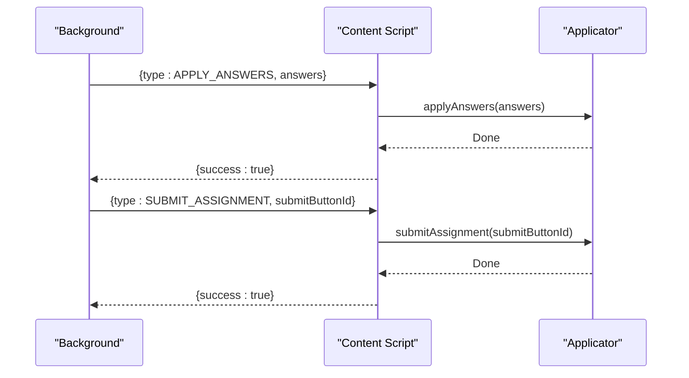

**Diagram sources**
- [index.js](file://assignment-solver/src/content/index.js#L67-L78)
- [applicator.js](file://assignment-solver/src/content/applicator.js#L21-L48)
- [applicator.js](file://assignment-solver/src/content/applicator.js#L201-L216)

**Section sources**
- [index.js](file://assignment-solver/src/content/index.js#L16-L99)

### Answer Handler and Message Routing
The background answer handler ensures the content script is loaded and injects it if needed, then forwards messages:
- Verifies content script availability via PING
- Injects content script if missing (with delays for Firefox)
- Relays APPLY_ANSWERS and SUBMIT_ASSIGNMENT to content script

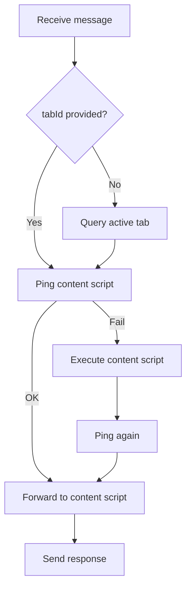

**Diagram sources**
- [answers.js](file://assignment-solver/src/background/handlers/answers.js#L17-L75)
- [background.js](file://assignment-solver/src/background/index.js#L103-L112)
- [router.js](file://assignment-solver/src/background/router.js#L17-L57)

**Section sources**
- [answers.js](file://assignment-solver/src/background/handlers/answers.js#L14-L77)
- [background.js](file://assignment-solver/src/background/index.js#L103-L112)
- [router.js](file://assignment-solver/src/background/router.js#L14-L59)

### Submission Workflow and User Interaction Simulation
Submission involves locating the submit button and triggering a click:
- Multiple strategies: explicit ID, standard submit button, generic onclick pattern
- UI feedback: progress controller updates status and step markers
- Auto-submit toggle: controlled by UI setting

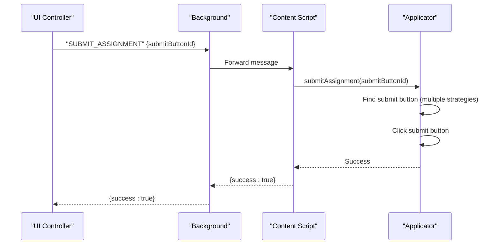

**Diagram sources**
- [solve.js](file://assignment-solver/src/ui/controllers/solve.js#L653-L668)
- [applicator.js](file://assignment-solver/src/content/applicator.js#L201-L216)
- [progress.js](file://assignment-solver/src/ui/controllers/progress.js#L58-L91)

**Section sources**
- [solve.js](file://assignment-solver/src/ui/controllers/solve.js#L197-L212)
- [progress.js](file://assignment-solver/src/ui/controllers/progress.js#L1-L164)

### Answer Application Logic by Input Type

#### Radio Buttons (Single Choice)
- Searches by ID, then by value attribute, then by name containing question ID, then by partial ID
- Clicks the matched radio and dispatches a change event

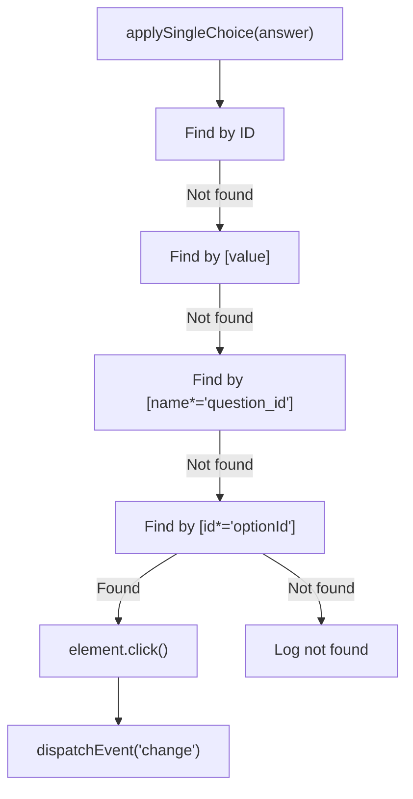

**Diagram sources**
- [applicator.js](file://assignment-solver/src/content/applicator.js#L54-L100)

**Section sources**
- [applicator.js](file://assignment-solver/src/content/applicator.js#L54-L100)

#### Checkboxes (Multiple Choice)
- Queries all checkboxes matching the question ID (by name or ID)
- Compares against expected IDs/values and toggles accordingly
- Performs additional direct ID/value lookups for each option

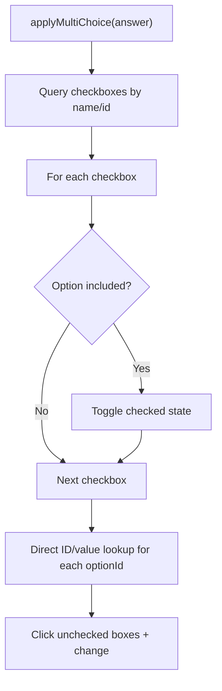

**Diagram sources**
- [applicator.js](file://assignment-solver/src/content/applicator.js#L106-L148)

**Section sources**
- [applicator.js](file://assignment-solver/src/content/applicator.js#L106-L148)

#### Text Inputs and Text Areas (Fill in the Blank)
- Attempts to locate by ID, then by question ID, then by partial ID match
- Sets the value and dispatches input, change, and keyup events to simulate typing

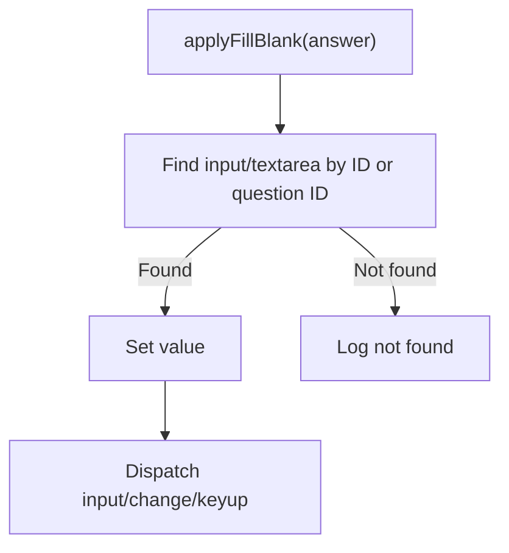

**Diagram sources**
- [applicator.js](file://assignment-solver/src/content/applicator.js#L154-L194)

**Section sources**
- [applicator.js](file://assignment-solver/src/content/applicator.js#L154-L194)

### Form Compatibility and Mapping Examples
The applicator uses flexible selectors to accommodate different assignment platforms:
- Radio buttons: ID, value, name containing question ID, partial ID match
- Checkboxes: name or ID containing question ID; direct ID/value lookups
- Text inputs: ID, question ID, or partial ID match across input/textarea

These strategies ensure compatibility across NPTEL and similar platforms with varying markup patterns.

**Section sources**
- [applicator.js](file://assignment-solver/src/content/applicator.js#L63-L91)
- [applicator.js](file://assignment-solver/src/content/applicator.js#L113-L147)
- [applicator.js](file://assignment-solver/src/content/applicator.js#L165-L183)

### Integration with Assignment Submission Process
The UI orchestrates the end-to-end flow:
- Extracts page data and captures screenshots
- Sends answers to content script for application
- Optionally submits automatically based on user preference
- Updates progress and displays results

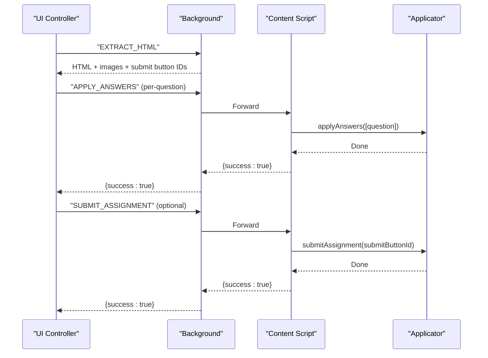

**Diagram sources**
- [solve.js](file://assignment-solver/src/ui/controllers/solve.js#L618-L668)
- [index.js](file://assignment-solver/src/content/index.js#L67-L78)
- [applicator.js](file://assignment-solver/src/content/applicator.js#L21-L48)
- [applicator.js](file://assignment-solver/src/content/applicator.js#L201-L216)

**Section sources**
- [solve.js](file://assignment-solver/src/ui/controllers/solve.js#L44-L240)
- [index.js](file://assignment-solver/src/content/index.js#L67-L78)

## Dependency Analysis
The applicator depends on:
- DOM APIs for element queries and events
- Cross-browser compatibility via unified browser APIs
- Message routing for background-to-content communication
- UI state and progress controllers for user feedback

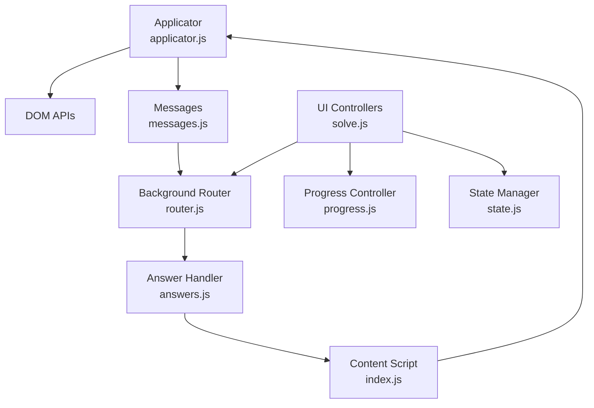

**Diagram sources**
- [applicator.js](file://assignment-solver/src/content/applicator.js#L1-L221)
- [messages.js](file://assignment-solver/src/core/messages.js#L5-L23)
- [router.js](file://assignment-solver/src/background/router.js#L14-L59)
- [answers.js](file://assignment-solver/src/background/handlers/answers.js#L14-L77)
- [index.js](file://assignment-solver/src/content/index.js#L16-L99)
- [solve.js](file://assignment-solver/src/ui/controllers/solve.js#L31-L32)
- [progress.js](file://assignment-solver/src/ui/controllers/progress.js#L12-L13)
- [state.js](file://assignment-solver/src/ui/state.js#L9-L14)

**Section sources**
- [messages.js](file://assignment-solver/src/core/messages.js#L1-L96)
- [browser.js](file://assignment-solver/src/platform/browser.js#L1-L86)

## Performance Considerations
- Batched application: Answers are sent one at a time with small delays to avoid overwhelming the page
- Flexible selectors: Reduce re-querying by trying multiple strategies efficiently
- Event simulation: Minimal synthetic events reduce overhead while ensuring validation triggers
- Retry logic: UI uses retry mechanisms for background communication to minimize stalls

[No sources needed since this section provides general guidance]

## Troubleshooting Guide
Common issues and resolutions:
- Content script not loaded: Background handler injects content script and verifies with PING
- Submit button not found: Applicator tries multiple selectors; UI falls back to defaults
- Missing answer elements: Applicator logs and continues; UI shows progress and results
- Cross-browser compatibility: Unified browser API abstraction ensures consistent behavior

**Section sources**
- [answers.js](file://assignment-solver/src/background/handlers/answers.js#L34-L61)
- [applicator.js](file://assignment-solver/src/content/applicator.js#L204-L215)
- [index.js](file://assignment-solver/src/content/index.js#L34-L53)

## Conclusion
The applicator system provides robust, cross-browser answer application and submission capabilities. Its flexible element selection, event simulation, and integration with the UI’s progress and state management deliver a reliable user experience across diverse assignment platforms. The modular design enables easy maintenance and extension for future input types or workflows.