# Applicator system

## Introduction
This page explains the applicator system responsible for applying AI-generated answers to form elements on assignment pages. It covers how the system identifies and manipulates different input types (radio buttons, checkboxes, text inputs, and fill-in-the-blank areas), how it submits assignments, and how it integrates with the broader assignment-solving pipeline. The documentation includes DOM manipulation techniques, validation and error handling, submission workflows, and user interaction simulation.

## Project structure
The applicator system spans three layers:
- Content script: Applies answers and submits forms on the target page
- Background service worker: Routes messages and manages content script lifecycle
- UI controllers: Drive the end-to-end flow, including progress reporting and user controls

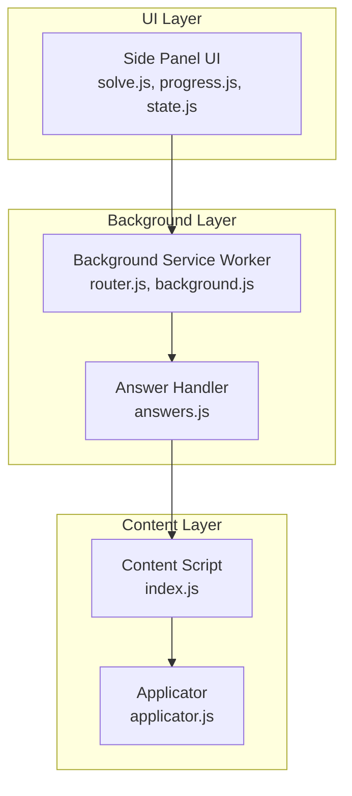
```mermaid
graph TB
subgraph "UI Layer"
UI["Side Panel UI<br/>solve.js, progress.js, state.js"]
end
subgraph "Background Layer"
BG["Background Service Worker<br/>router.js, background.js"]
AH["Answer Handler<br/>answers.js"]
end
subgraph "Content Layer"
CS["Content Script<br/>index.js"]
APP["Applicator<br/>applicator.js"]
end
UI --> BG
BG --> AH
AH --> CS
CS --> APP
```

## Core components
- Applicator service: Applies answers to radio buttons, checkboxes, and text inputs; triggers form submission
- Content script: Receives messages, initializes applicator, and forwards requests
- Answer handler: Ensures content script is loaded and relays messages to it
- UI controllers: Orchestrate extraction, solving, filling, and submission with progress feedback

Key responsibilities:
- Answer application: Single choice, multi choice, and fill-in-the-blank
- Form submission: Clicks submit button and handles confirmation dialogs
- User interaction simulation: Dispatches change/input events and keyboard events
- Error handling: Graceful logging and recovery for missing elements or invalid data

## Architecture overview
The applicator participates in a multi-step assignment-solving workflow:
1. UI triggers extraction and solving
2. Background routes messages to content script
3. Content script applies answers and optionally submits
4. UI updates progress and displays results

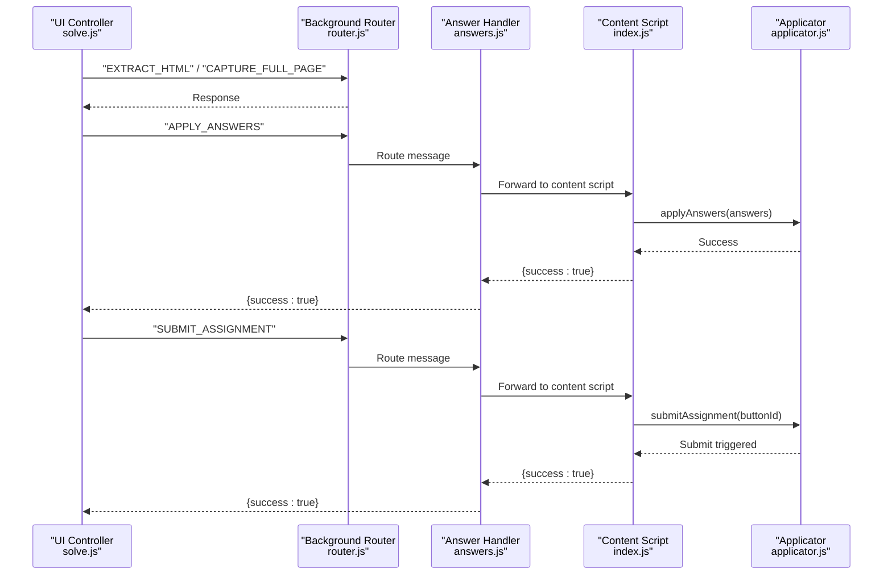
```mermaid
sequenceDiagram
participant UI as "UI Controller<br/>solve.js"
participant BG as "Background Router<br/>router.js"
participant AH as "Answer Handler<br/>answers.js"
participant CS as "Content Script<br/>index.js"
participant APP as "Applicator<br/>applicator.js"
UI->>BG : "EXTRACT_HTML" / "CAPTURE_FULL_PAGE"
BG-->>UI : Response
UI->>BG : "APPLY_ANSWERS"
BG->>AH : Route message
AH->>CS : Forward to content script
CS->>APP : applyAnswers(answers)
APP-->>CS : Success
CS-->>AH : {success : true}
AH-->>UI : {success : true}
UI->>BG : "SUBMIT_ASSIGNMENT"
BG->>AH : Route message
AH->>CS : Forward to content script
CS->>APP : submitAssignment(buttonId)
APP-->>CS : Submit triggered
CS-->>AH : {success : true}
AH-->>UI : {success : true}
```

## Detailed component analysis

### Applicator service
The applicator encapsulates answer application and submission logic:
- applyAnswers: Iterates through AI-generated answers and delegates by question type
- applySingleChoice: Finds radio inputs by ID/value/name/partial ID and clicks/selects
- applyMultiChoice: Handles multiple selections across checkbox groups
- applyFillBlank: Sets text values and simulates user input via events
- submitAssignment: Locates submit button by multiple strategies and triggers click

DOM manipulation techniques:
- Element selection via getElementById, querySelector, and querySelectorAll
- Programmatic clicking and event dispatching for change/input/keyup
- Value assignment for text inputs and textareas

Validation and error handling:
- Logs warnings for missing IDs or invalid arrays
- Gracefully skips elements that cannot be found
- Wraps per-answer application in try/catch to prevent single failures from stopping the batch

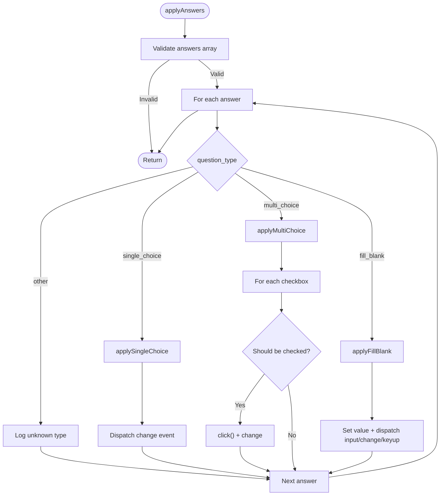
```mermaid
flowchart TD
Start(["applyAnswers"]) --> Check["Validate answers array"]
Check --> |Invalid| End(["Return"])
Check --> |Valid| Loop["For each answer"]
Loop --> Type{"question_type"}
Type --> |single_choice| SC["applySingleChoice"]
Type --> |multi_choice| MC["applyMultiChoice"]
Type --> |fill_blank| FB["applyFillBlank"]
Type --> |other| Log["Log unknown type"] --> Next["Next answer"]
SC --> Events["Dispatch change event"] --> Next
MC --> MultiLoop["For each checkbox"] --> Toggle{"Should be checked?"}
Toggle --> |Yes| Click["click() + change"] --> Next
Toggle --> |No| Next
FB --> TextSet["Set value + dispatch input/change/keyup"] --> Next
Next --> Loop
Loop --> End
```

### Content script integration
The content script initializes applicator and exposes message handlers:
- Listens for APPLY_ANSWERS and SUBMIT_ASSIGNMENT
- Delegates to applicator and responds with success
- Provides auxiliary handlers for page info and scrolling

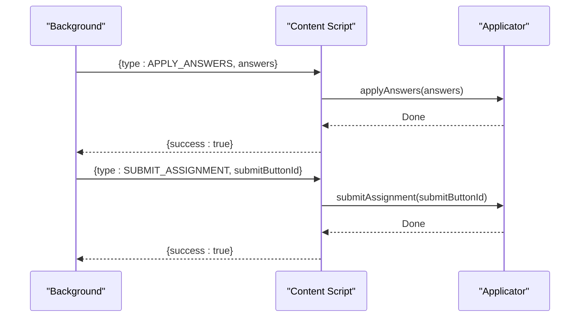
```mermaid
sequenceDiagram
participant BG as "Background"
participant CS as "Content Script"
participant APP as "Applicator"
BG->>CS : {type : APPLY_ANSWERS, answers}
CS->>APP : applyAnswers(answers)
APP-->>CS : Done
CS-->>BG : {success : true}
BG->>CS : {type : SUBMIT_ASSIGNMENT, submitButtonId}
CS->>APP : submitAssignment(submitButtonId)
APP-->>CS : Done
CS-->>BG : {success : true}
```

### Answer handler and message routing
The background answer handler ensures the content script is loaded and injects it if needed, then forwards messages:
- Verifies content script availability via PING
- Injects content script if missing (with delays for Firefox)
- Relays APPLY_ANSWERS and SUBMIT_ASSIGNMENT to content script

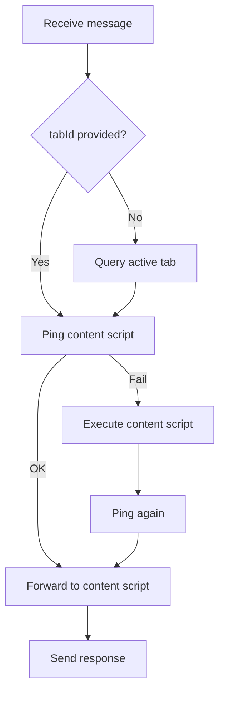
```mermaid
flowchart TD
Receive["Receive message"] --> HasTab{"tabId provided?"}
HasTab --> |No| Query["Query active tab"]
HasTab --> |Yes| Ping["Ping content script"]
Query --> Ping
Ping --> |OK| Forward["Forward to content script"]
Ping --> |Fail| Inject["Execute content script"]
Inject --> Verify["Ping again"]
Verify --> Forward
Forward --> Done["Send response"]
```

### Submission workflow and user interaction simulation
Submission involves locating the submit button and triggering a click:
- Multiple strategies: explicit ID, standard submit button, generic onclick pattern
- UI feedback: progress controller updates status and step markers
- Auto-submit toggle: controlled by UI setting

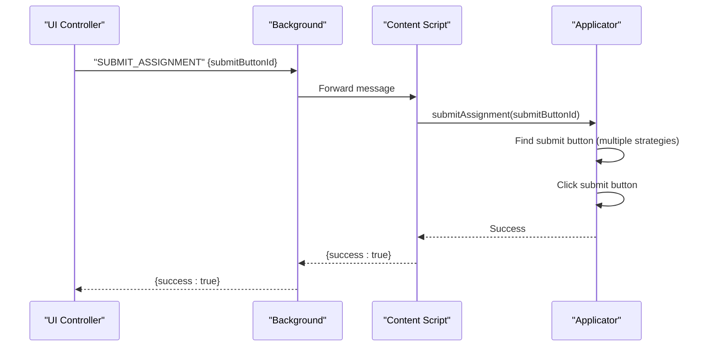
```mermaid
sequenceDiagram
participant UI as "UI Controller"
participant BG as "Background"
participant CS as "Content Script"
participant APP as "Applicator"
UI->>BG : "SUBMIT_ASSIGNMENT" {submitButtonId}
BG->>CS : Forward message
CS->>APP : submitAssignment(submitButtonId)
APP->>APP : Find submit button (multiple strategies)
APP->>APP : Click submit button
APP-->>CS : Success
CS-->>BG : {success : true}
BG-->>UI : {success : true}
```

### Answer application logic by input type

#### Radio buttons (single choice)
- Searches by ID, then by value attribute, then by name containing question ID, then by partial ID
- Clicks the matched radio and dispatches a change event

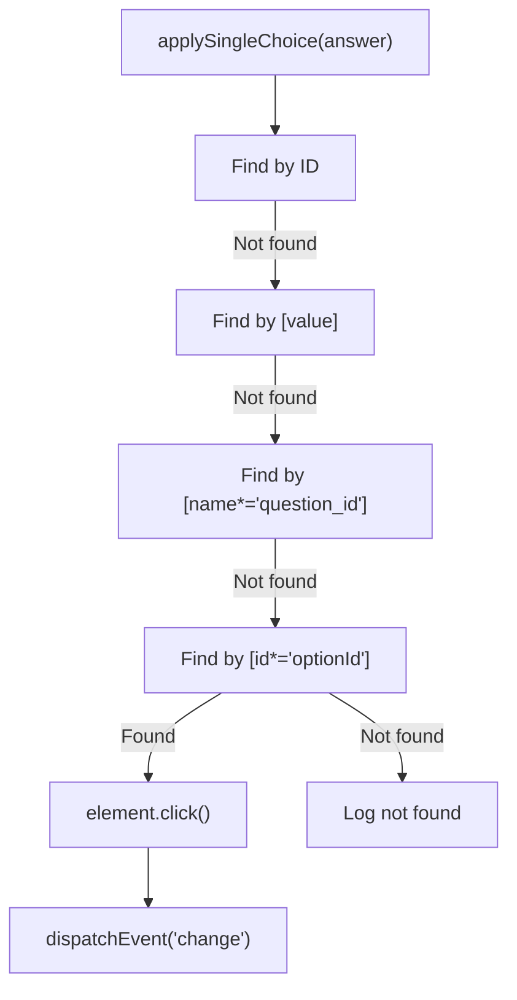
```mermaid
flowchart TD
A["applySingleChoice(answer)"] --> Find["Find by ID"]
Find --> |Not found| ByValue["Find by [value]"]
ByValue --> |Not found| ByName["Find by [name*='question_id']"]
ByName --> |Not found| Partial["Find by [id*='optionId']"]
Partial --> |Found| Click["element.click()"]
Click --> Change["dispatchEvent('change')"]
Partial --> |Not found| Log["Log not found"]
```

#### Checkboxes (multiple choice)
- Queries all checkboxes matching the question ID (by name or ID)
- Compares against expected IDs/values and toggles accordingly
- Performs additional direct ID/value lookups for each option

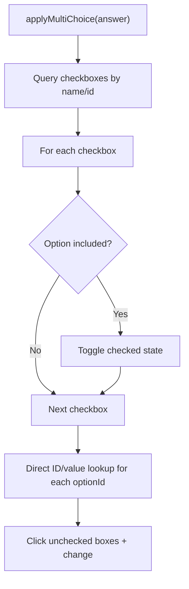
```mermaid
flowchart TD
M["applyMultiChoice(answer)"] --> Query["Query checkboxes by name/id"]
Query --> Loop["For each checkbox"]
Loop --> Compare{"Option included?"}
Compare --> |Yes| Toggle["Toggle checked state"]
Compare --> |No| Next["Next checkbox"]
Toggle --> Next
Next --> Direct["Direct ID/value lookup for each optionId"]
Direct --> Click["Click unchecked boxes + change"]
```

#### Text inputs and text areas (fill in the blank)
- Attempts to locate by ID, then by question ID, then by partial ID match
- Sets the value and dispatches input, change, and keyup events to simulate typing

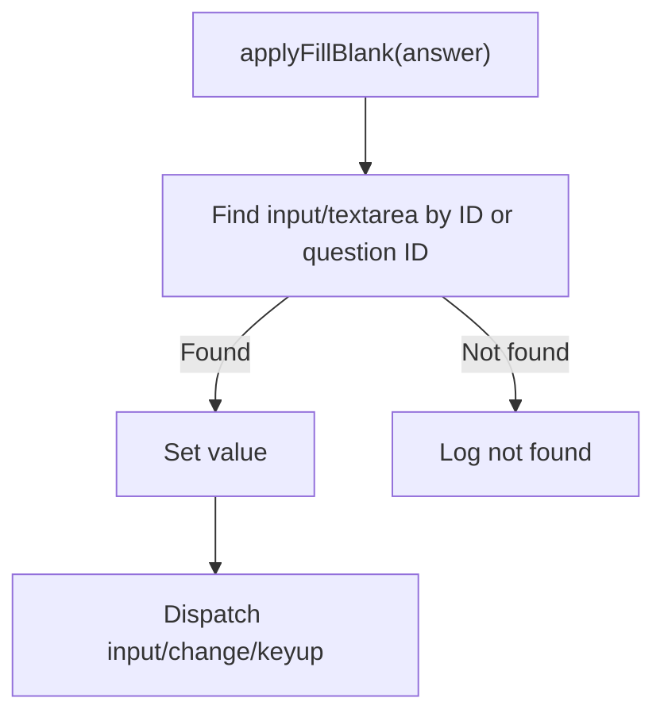
```mermaid
flowchart TD
F["applyFillBlank(answer)"] --> Find["Find input/textarea by ID or question ID"]
Find --> |Found| Set["Set value"]
Set --> Events["Dispatch input/change/keyup"]
Find --> |Not found| Log["Log not found"]
```

### Form compatibility and mapping examples
The applicator uses flexible selectors to accommodate different assignment platforms:
- Radio buttons: ID, value, name containing question ID, partial ID match
- Checkboxes: name or ID containing question ID; direct ID/value lookups
- Text inputs: ID, question ID, or partial ID match across input/textarea

These strategies ensure compatibility across NPTEL and similar platforms with varying markup patterns.

### Integration with assignment submission process
The UI orchestrates the end-to-end flow:
- Extracts page data and captures screenshots
- Sends answers to content script for application
- Optionally submits automatically based on user preference
- Updates progress and displays results

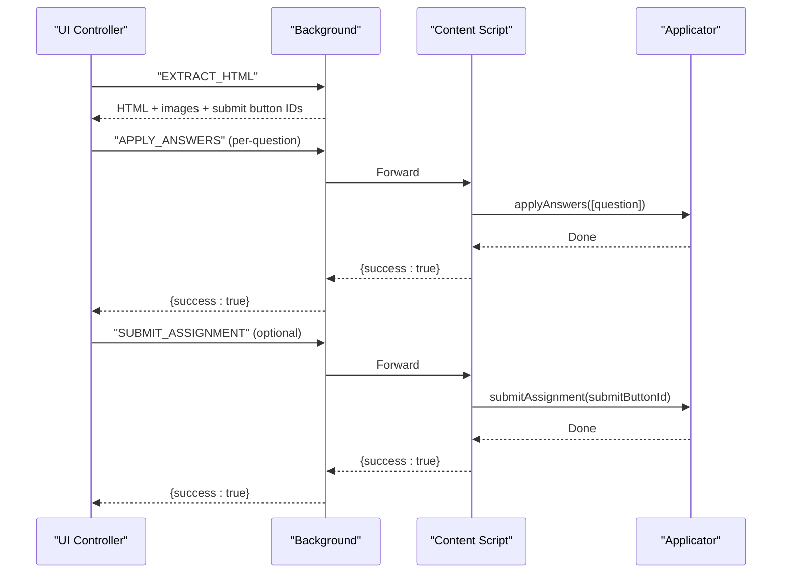
```mermaid
sequenceDiagram
participant UI as "UI Controller"
participant BG as "Background"
participant CS as "Content Script"
participant APP as "Applicator"
UI->>BG : "EXTRACT_HTML"
BG-->>UI : HTML + images + submit button IDs
UI->>BG : "APPLY_ANSWERS" (per-question)
BG->>CS : Forward
CS->>APP : applyAnswers([question])
APP-->>CS : Done
CS-->>BG : {success : true}
BG-->>UI : {success : true}
UI->>BG : "SUBMIT_ASSIGNMENT" (optional)
BG->>CS : Forward
CS->>APP : submitAssignment(submitButtonId)
APP-->>CS : Done
CS-->>BG : {success : true}
BG-->>UI : {success : true}
```

## Dependency analysis
The applicator depends on:
- DOM APIs for element queries and events
- Cross-browser compatibility via unified browser APIs
- Message routing for background-to-content communication
- UI state and progress controllers for user feedback

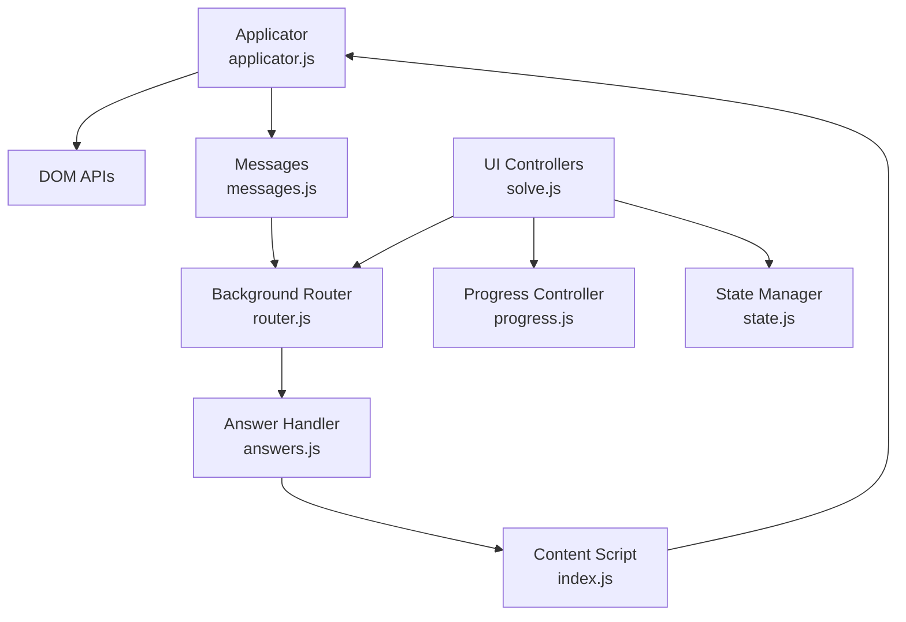
```mermaid
graph TB
APP["Applicator<br/>applicator.js"] --> DOM["DOM APIs"]
APP --> MSG["Messages<br/>messages.js"]
MSG --> BG["Background Router<br/>router.js"]
BG --> AH["Answer Handler<br/>answers.js"]
AH --> CS["Content Script<br/>index.js"]
CS --> APP
UI["UI Controllers<br/>solve.js"] --> BG
UI --> PROG["Progress Controller<br/>progress.js"]
UI --> STATE["State Manager<br/>state.js"]
```

## Performance considerations
- Batched application: Answers are sent one at a time with small delays to avoid overwhelming the page
- Flexible selectors: Reduce re-querying by trying multiple strategies efficiently
- Event simulation: Minimal synthetic events reduce overhead while ensuring validation triggers
- Retry logic: UI uses retry mechanisms for background communication to minimize stalls

[No sources needed since this section provides general guidance]

## Troubleshooting guide
Common issues and resolutions:
- Content script not loaded: Background handler injects content script and verifies with PING
- Submit button not found: Applicator tries multiple selectors; UI falls back to defaults
- Missing answer elements: Applicator logs and continues; UI shows progress and results
- Cross-browser compatibility: Unified browser API abstraction ensures consistent behavior

## Conclusion
The applicator system provides reliable, cross-browser answer application and submission capabilities. Its flexible element selection, event simulation, and integration with the UI's progress and state management deliver a reliable user experience across diverse assignment platforms. The modular design enables easy maintenance and extension for future input types or workflows.
