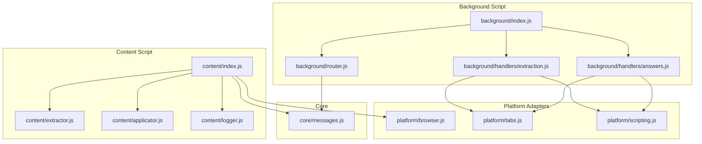
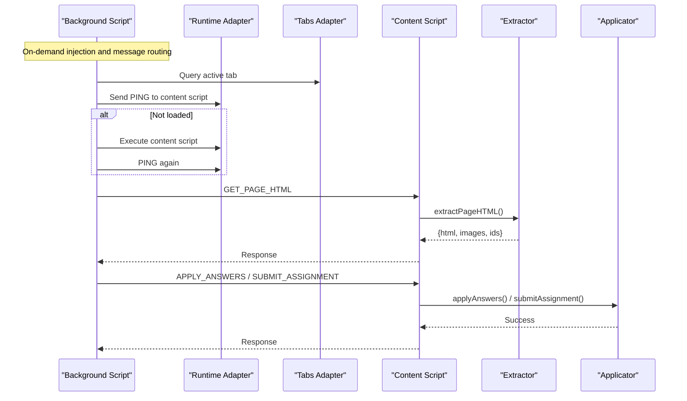
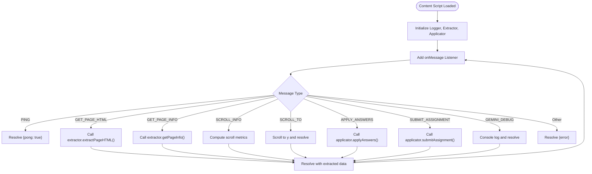
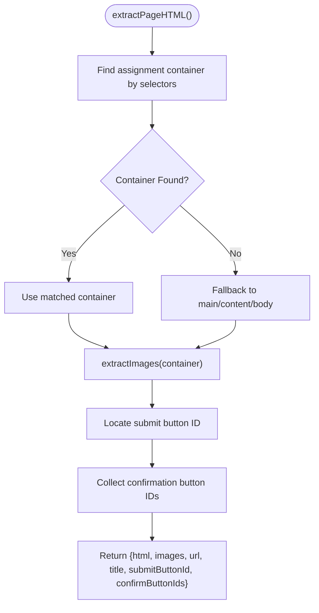
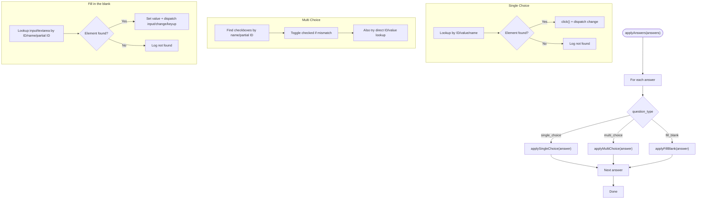
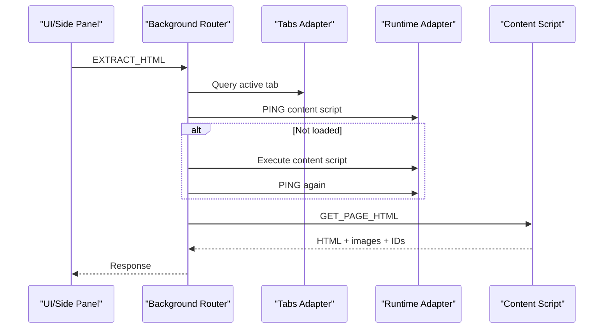
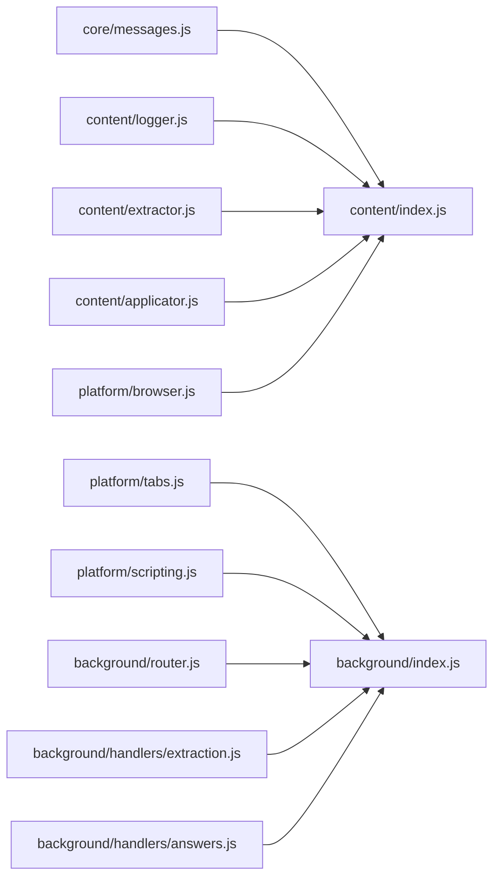

# Content Scripts

<cite>
**Referenced Files in This Document**
- [index.js](file://assignment-solver/src/content/index.js)
- [extractor.js](file://assignment-solver/src/content/extractor.js)
- [applicator.js](file://assignment-solver/src/content/applicator.js)
- [logger.js](file://assignment-solver/src/content/logger.js)
- [messages.js](file://assignment-solver/src/core/messages.js)
- [browser.js](file://assignment-solver/src/platform/browser.js)
- [tabs.js](file://assignment-solver/src/platform/tabs.js)
- [scripting.js](file://assignment-solver/src/platform/scripting.js)
- [router.js](file://assignment-solver/src/background/router.js)
- [extraction.js](file://assignment-solver/src/background/handlers/extraction.js)
- [answers.js](file://assignment-solver/src/background/handlers/answers.js)
- [index.js](file://assignment-solver/src/background/index.js)
- [manifest.json](file://assignment-solver/manifest.json)
- [vite.config.js](file://assignment-solver/vite.config.js)
- [manifest.config.js](file://assignment-solver/manifest.config.js)
</cite>

## Table of Contents
1. [Introduction](#introduction)
2. [Project Structure](#project-structure)
3. [Core Components](#core-components)
4. [Architecture Overview](#architecture-overview)
5. [Detailed Component Analysis](#detailed-component-analysis)
6. [Dependency Analysis](#dependency-analysis)
7. [Performance Considerations](#performance-considerations)
8. [Security Considerations](#security-considerations)
9. [Troubleshooting Guide](#troubleshooting-guide)
10. [Conclusion](#conclusion)

## Introduction
This document explains the content scripts responsible for DOM interaction in the assignment-solver extension. It covers:
- The extraction system for identifying assignment questions, parsing HTML content, and extracting question data
- The applicator system for applying answers to form elements, handling different input types, and managing user interactions
- The content script lifecycle, communication with background scripts, and security considerations
- Examples of DOM manipulation techniques, question type handling, and integration with the assignment solver workflow

## Project Structure
The content script is organized as a small module with three primary responsibilities:
- Message routing and lifecycle management
- Extraction of page HTML and associated images
- Application of answers and submission actions

**Diagram sources**
- [index.js](file://assignment-solver/src/content/index.js#L1-L99)
- [extractor.js](file://assignment-solver/src/content/extractor.js#L1-L241)
- [applicator.js](file://assignment-solver/src/content/applicator.js#L1-L221)
- [logger.js](file://assignment-solver/src/content/logger.js#L1-L20)
- [index.js](file://assignment-solver/src/background/index.js#L1-L135)
- [router.js](file://assignment-solver/src/background/router.js#L1-L59)
- [extraction.js](file://assignment-solver/src/background/handlers/extraction.js#L1-L102)
- [answers.js](file://assignment-solver/src/background/handlers/answers.js#L1-L77)
- [browser.js](file://assignment-solver/src/platform/browser.js#L1-L86)
- [tabs.js](file://assignment-solver/src/platform/tabs.js#L1-L53)
- [scripting.js](file://assignment-solver/src/platform/scripting.js#L1-L28)
- [messages.js](file://assignment-solver/src/core/messages.js#L1-L96)

**Section sources**
- [index.js](file://assignment-solver/src/content/index.js#L1-L99)
- [manifest.json](file://assignment-solver/manifest.json#L1-L44)
- [vite.config.js](file://assignment-solver/vite.config.js#L54-L109)

## Core Components
- Content script entry point initializes logging, creates extractor and applicator services, and registers a message listener for bidirectional communication with the background script.
- Extractor service identifies assignment containers, extracts HTML, collects images, and discovers submit and confirmation button identifiers.
- Applicator service applies answers to the DOM for single-choice, multiple-choice, and fill-in-the-blank question types, and triggers submission.
- Platform adapters and core messaging types unify cross-browser behavior and message routing.

**Section sources**
- [index.js](file://assignment-solver/src/content/index.js#L12-L99)
- [extractor.js](file://assignment-solver/src/content/extractor.js#L12-L241)
- [applicator.js](file://assignment-solver/src/content/applicator.js#L12-L221)
- [messages.js](file://assignment-solver/src/core/messages.js#L5-L23)

## Architecture Overview
The content script runs on matching pages and communicates with the background script via a well-defined set of message types. The background script orchestrates content script injection when needed, forwards requests, and coordinates with external services.

**Diagram sources**
- [index.js](file://assignment-solver/src/background/index.js#L45-L113)
- [router.js](file://assignment-solver/src/background/router.js#L17-L57)
- [extraction.js](file://assignment-solver/src/background/handlers/extraction.js#L18-L99)
- [answers.js](file://assignment-solver/src/background/handlers/answers.js#L17-L75)
- [index.js](file://assignment-solver/src/content/index.js#L20-L96)
- [extractor.js](file://assignment-solver/src/content/extractor.js#L21-L96)
- [applicator.js](file://assignment-solver/src/content/applicator.js#L21-L217)

## Detailed Component Analysis

### Content Script Lifecycle and Message Routing
- Loaded automatically on matching URLs per manifest configuration.
- Initializes logger, extractor, and applicator instances.
- Registers a message listener that handles:
  - PING for health checks
  - GET_PAGE_HTML for HTML and image extraction
  - GET_PAGE_INFO for quick page metadata
  - SCROLL_INFO and SCROLL_TO for screenshot coordination
  - APPLY_ANSWERS and SUBMIT_ASSIGNMENT for answer application and submission
  - GEMINI_DEBUG for debug relaying

**Diagram sources**
- [index.js](file://assignment-solver/src/content/index.js#L12-L99)
- [extractor.js](file://assignment-solver/src/content/extractor.js#L21-L96)
- [applicator.js](file://assignment-solver/src/content/applicator.js#L21-L217)

**Section sources**
- [index.js](file://assignment-solver/src/content/index.js#L12-L99)
- [manifest.json](file://assignment-solver/manifest.json#L17-L26)
- [vite.config.js](file://assignment-solver/vite.config.js#L58-L84)

### Extraction System
The extractor locates assignment content, captures images, and discovers UI identifiers for submission and confirmation dialogs.

Key behaviors:
- Container discovery: Iterates through a curated list of selectors targeting assignment areas.
- Fallback: Uses main content containers if specific assignment containers are not found.
- Image extraction: Filters out tiny or unloaded images, supports data URLs and canvas-based conversion, and attaches context via nearest question container.
- Identifier discovery: Finds submit and confirmation button IDs for reliable automation.

**Diagram sources**
- [extractor.js](file://assignment-solver/src/content/extractor.js#L21-L96)

**Section sources**
- [extractor.js](file://assignment-solver/src/content/extractor.js#L12-L241)

### Applicator System
The applicator applies answers to the DOM based on question type and dispatches appropriate events to trigger change handlers.

Supported question types:
- Single choice (radio): Attempts lookup by ID, value, name pattern, and partial ID match; clicks and emits change.
- Multi choice (checkbox): Identifies checkboxes by name/partial ID, toggles checked state as needed, and emits change.
- Fill in the blank: Targets input or textarea by ID/name/partial ID; sets value and emits input, change, and keyup.

Submission:
- Locates submit button by ID, generic selectors, or onclick attributes; clicks to submit.

**Diagram sources**
- [applicator.js](file://assignment-solver/src/content/applicator.js#L21-L217)

**Section sources**
- [applicator.js](file://assignment-solver/src/content/applicator.js#L12-L221)

### Background Script Integration and Cross-Browser Compatibility
- The background script manages message routing, tab targeting, and content script injection when needed.
- It uses platform adapters to abstract browser differences and ensures robust message delivery with retry logic where applicable.
- The content script uses webextension-polyfill for cross-browser compatibility.

**Diagram sources**
- [index.js](file://assignment-solver/src/background/index.js#L45-L113)
- [router.js](file://assignment-solver/src/background/router.js#L17-L57)
- [extraction.js](file://assignment-solver/src/background/handlers/extraction.js#L18-L99)
- [tabs.js](file://assignment-solver/src/platform/tabs.js#L38-L40)
- [browser.js](file://assignment-solver/src/platform/browser.js#L9-L16)

**Section sources**
- [index.js](file://assignment-solver/src/background/index.js#L1-L135)
- [router.js](file://assignment-solver/src/background/router.js#L1-L59)
- [extraction.js](file://assignment-solver/src/background/handlers/extraction.js#L1-L102)
- [answers.js](file://assignment-solver/src/background/handlers/answers.js#L1-L77)
- [browser.js](file://assignment-solver/src/platform/browser.js#L1-L86)

## Dependency Analysis
- Content script depends on:
  - Logger factory for structured logging
  - Extractor for DOM parsing and image collection
  - Applicator for answer application and submission
  - Platform browser polyfill for cross-browser compatibility
  - Core message types for consistent communication
- Background script depends on:
  - Platform adapters for tabs and scripting APIs
  - Message router for centralized message handling
  - Handlers for extraction, answers, and page info

**Diagram sources**
- [messages.js](file://assignment-solver/src/core/messages.js#L5-L23)
- [index.js](file://assignment-solver/src/content/index.js#L7-L11)
- [logger.js](file://assignment-solver/src/content/logger.js#L11-L17)
- [extractor.js](file://assignment-solver/src/content/extractor.js#L12-L14)
- [applicator.js](file://assignment-solver/src/content/applicator.js#L12-L14)
- [browser.js](file://assignment-solver/src/platform/browser.js#L9-L16)
- [tabs.js](file://assignment-solver/src/platform/tabs.js#L12-L27)
- [scripting.js](file://assignment-solver/src/platform/scripting.js#L12-L26)
- [router.js](file://assignment-solver/src/background/router.js#L14-L16)
- [index.js](file://assignment-solver/src/background/index.js#L14-L19)
- [extraction.js](file://assignment-solver/src/background/handlers/extraction.js#L15-L16)
- [answers.js](file://assignment-solver/src/background/handlers/answers.js#L14-L15)

**Section sources**
- [messages.js](file://assignment-solver/src/core/messages.js#L1-L96)
- [index.js](file://assignment-solver/src/content/index.js#L1-L99)
- [index.js](file://assignment-solver/src/background/index.js#L1-L135)

## Performance Considerations
- Selector traversal: The extractor iterates through a fixed set of selectors and falls back to broader elements only when necessary. This minimizes unnecessary DOM queries.
- Image processing: Canvas-based conversion is attempted only for non-data URLs; external images that fail due to CORS are skipped to avoid blocking the pipeline.
- Event dispatching: Applicator emits minimal DOM events (change, input, keyup) to trigger handlers without excessive reflows.
- Injection timing: Background handlers wait briefly for Firefox initialization to reduce race conditions during content script injection.

[No sources needed since this section provides general guidance]

## Security Considerations
- Content script scope: Runs only on trusted domains defined in the manifest and uses CSP to restrict connections.
- Cross-origin images: Canvas-based conversion is guarded against CORS errors; such images are skipped to prevent security exceptions.
- Message boundaries: All communication is mediated by the background script and platform adapters, reducing direct exposure of internal APIs.
- Host permissions: Permissions are scoped to NPTEL domains and the Gemini API endpoint.

**Section sources**
- [manifest.json](file://assignment-solver/manifest.json#L7-L12)
- [manifest.config.js](file://assignment-solver/manifest.config.js#L43-L46)
- [extractor.js](file://assignment-solver/src/content/extractor.js#L142-L147)

## Troubleshooting Guide
Common issues and resolutions:
- Content script not responding:
  - The background handler pings the content script before sending messages; if it fails, the handler injects the content script and retries.
  - Ensure the page matches the content script's URL patterns.
- Missing submit or confirmation buttons:
  - The extractor and applicator rely on specific IDs and selectors; if custom themes alter these, manual override may be needed.
- CORS errors on images:
  - Images from external domains that fail CORS are skipped; this prevents exceptions and allows extraction to continue.
- Firefox initialization delays:
  - The background handler waits longer for Firefox to ensure the content script is ready before sending messages.

**Section sources**
- [extraction.js](file://assignment-solver/src/background/handlers/extraction.js#L45-L75)
- [answers.js](file://assignment-solver/src/background/handlers/answers.js#L34-L61)
- [extractor.js](file://assignment-solver/src/content/extractor.js#L142-L147)
- [index.js](file://assignment-solver/src/content/index.js#L55-L65)

## Conclusion
The content scripts provide a focused, extensible foundation for DOM interaction in the assignment solver. The extraction system reliably identifies assignment content and images, while the applicator system supports multiple question types and submission workflows. Robust background orchestration, cross-browser compatibility, and security-conscious design ensure reliable operation across environments.