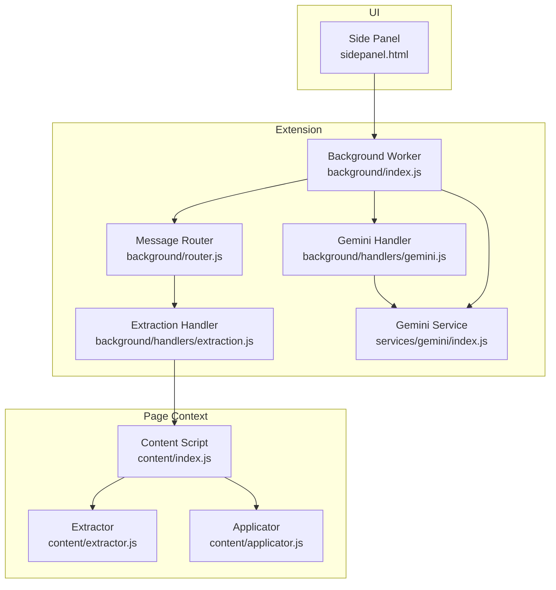
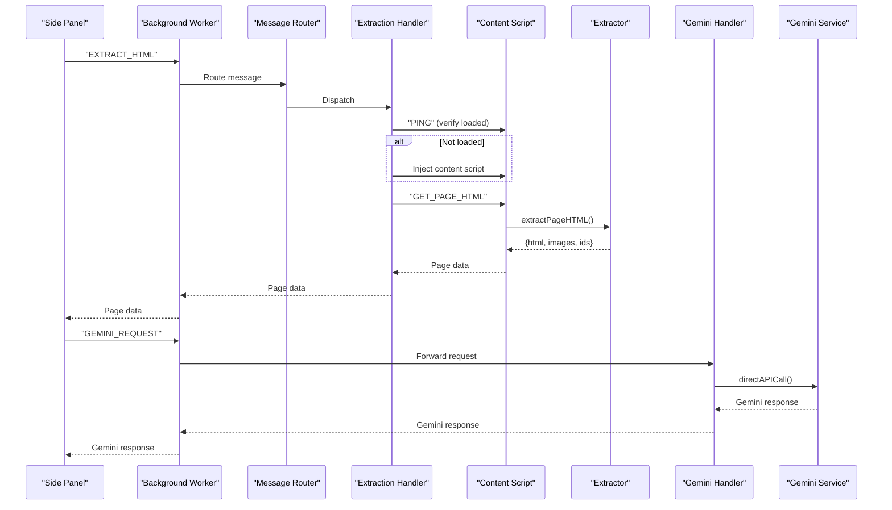
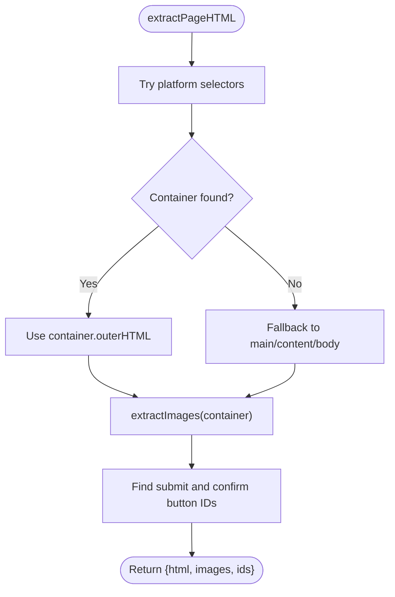
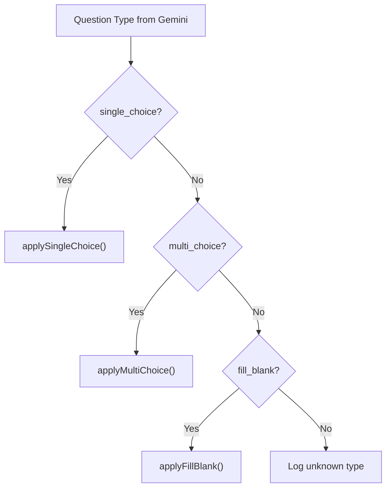
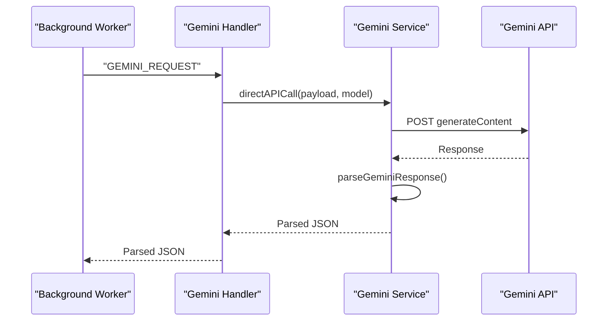
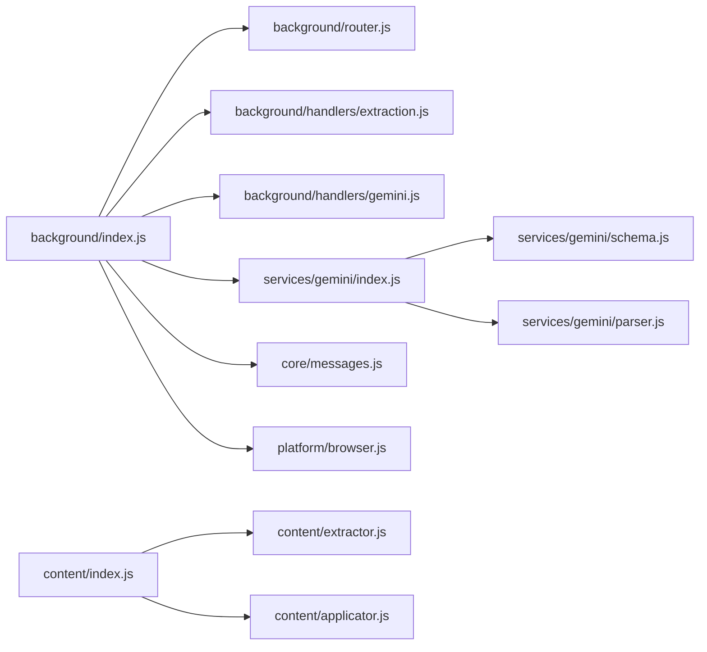

# Extraction System

<cite>
**Referenced Files in This Document**
- [extractor.js](file://assignment-solver/src/content/extractor.js)
- [index.js](file://assignment-solver/src/content/index.js)
- [extraction.js](file://assignment-solver/src/background/handlers/extraction.js)
- [index.js](file://assignment-solver/src/background/index.js)
- [router.js](file://assignment-solver/src/background/router.js)
- [messages.js](file://assignment-solver/src/core/messages.js)
- [parser.js](file://assignment-solver/src/services/gemini/parser.js)
- [schema.js](file://assignment-solver/src/services/gemini/schema.js)
- [index.js](file://assignment-solver/src/services/gemini/index.js)
- [applicator.js](file://assignment-solver/src/content/applicator.js)
- [browser.js](file://assignment-solver/src/platform/browser.js)
- [sidepanel.html](file://assignment-solver/public/sidepanel.html)
</cite>

## Table of Contents
1. [Introduction](#introduction)
2. [Project Structure](#project-structure)
3. [Core Components](#core-components)
4. [Architecture Overview](#architecture-overview)
5. [Detailed Component Analysis](#detailed-component-analysis)
6. [Dependency Analysis](#dependency-analysis)
7. [Performance Considerations](#performance-considerations)
8. [Troubleshooting Guide](#troubleshooting-guide)
9. [Conclusion](#conclusion)
10. [Appendices](#appendices)

## Introduction
This document describes the extraction system that identifies and parses assignment questions from NPTEL and SWAYAM pages. It explains the HTML parsing algorithms, question type detection strategies, DOM traversal approaches, and the end-to-end pipeline from raw HTML to structured question data. It also covers dynamic content handling, iframe scenarios, platform-specific variations, error handling, performance optimizations, and integration with the Gemini AI system.

## Project Structure
The extraction system spans three layers:
- Content script: runs on the assignment page to extract HTML and images, and to apply answers.
- Background service worker: orchestrates message routing, injection of the content script, and calls to the Gemini API.
- Services: Gemini integration for parsing and validating AI responses, and schemas for structured output.

**Diagram sources**
- [index.js](file://assignment-solver/src/background/index.js#L1-L135)
- [router.js](file://assignment-solver/src/background/router.js#L1-L59)
- [extraction.js](file://assignment-solver/src/background/handlers/extraction.js#L1-L102)
- [index.js](file://assignment-solver/src/content/index.js#L1-L99)
- [extractor.js](file://assignment-solver/src/content/extractor.js#L1-L241)
- [applicator.js](file://assignment-solver/src/content/applicator.js#L1-L221)
- [index.js](file://assignment-solver/src/services/gemini/index.js#L1-L342)

**Section sources**
- [index.js](file://assignment-solver/src/background/index.js#L1-L135)
- [index.js](file://assignment-solver/src/content/index.js#L1-L99)
- [extractor.js](file://assignment-solver/src/content/extractor.js#L1-L241)
- [index.js](file://assignment-solver/src/services/gemini/index.js#L1-L342)

## Core Components
- Extractor: Finds assignment containers, extracts HTML, collects images, and gathers UI identifiers for submission.
- Content Script: Exposes message handlers for extraction, answer application, and scrolling.
- Background Router: Routes messages to appropriate handlers and ensures async response semantics.
- Extraction Handler: Manages content script injection, readiness checks, and HTML retrieval.
- Gemini Service: Builds prompts, sends requests, validates responses, and parses JSON.
- Applicator: Applies answers back to the page and submits the assignment.

**Section sources**
- [extractor.js](file://assignment-solver/src/content/extractor.js#L12-L241)
- [index.js](file://assignment-solver/src/content/index.js#L15-L99)
- [router.js](file://assignment-solver/src/background/router.js#L14-L58)
- [extraction.js](file://assignment-solver/src/background/handlers/extraction.js#L15-L102)
- [index.js](file://assignment-solver/src/services/gemini/index.js#L60-L342)
- [applicator.js](file://assignment-solver/src/content/applicator.js#L12-L221)

## Architecture Overview
The system follows a message-driven architecture:
- The UI triggers extraction or solving.
- The background worker injects or verifies the content script.
- The content script extracts HTML and images and returns structured data.
- The background worker forwards requests to Gemini via a dedicated handler.
- Gemini returns structured JSON validated against predefined schemas.
- The content script applies answers and submits the assignment.

**Diagram sources**
- [index.js](file://assignment-solver/src/background/index.js#L44-L117)
- [router.js](file://assignment-solver/src/background/router.js#L17-L57)
- [extraction.js](file://assignment-solver/src/background/handlers/extraction.js#L18-L95)
- [index.js](file://assignment-solver/src/content/index.js#L20-L96)
- [extractor.js](file://assignment-solver/src/content/extractor.js#L21-L96)
- [index.js](file://assignment-solver/src/services/gemini/index.js#L302-L339)
- [index.js](file://assignment-solver/src/services/gemini/index.js#L145-L217)

## Detailed Component Analysis

### HTML Extraction Pipeline
The extractor locates the assignment container, falls back to the main content area if needed, and collects images. It also discovers submit and confirmation button identifiers.

**Diagram sources**
- [extractor.js](file://assignment-solver/src/content/extractor.js#L21-L96)

Key behaviors:
- Platform selectors target known NPTEL/SWAYAM classes and forms.
- Fallback ensures extraction even if selectors miss.
- Image extraction filters small or unloaded images, converts via canvas, and attaches context metadata.

**Section sources**
- [extractor.js](file://assignment-solver/src/content/extractor.js#L24-L96)

### Question Type Detection and DOM Traversal
The extractor does not infer question types itself. Instead, it relies on the Gemini service to classify questions and return a structured schema. The content script’s applicator supports:
- Single choice: radio inputs identified by ID/value/name heuristics.
- Multiple choice: checkboxes matched by question ID and option IDs.
- Fill-in-the-blank: text inputs/textarea matched by IDs and question context.

**Diagram sources**
- [applicator.js](file://assignment-solver/src/content/applicator.js#L31-L47)
- [applicator.js](file://assignment-solver/src/content/applicator.js#L54-L100)
- [applicator.js](file://assignment-solver/src/content/applicator.js#L106-L148)
- [applicator.js](file://assignment-solver/src/content/applicator.js#L154-L194)

**Section sources**
- [applicator.js](file://assignment-solver/src/content/applicator.js#L21-L194)

### Gemini Integration and Structured Output
The Gemini service composes prompts and content parts (HTML, images, screenshots), enforces response schemas, and parses responses robustly.

**Diagram sources**
- [index.js](file://assignment-solver/src/services/gemini/index.js#L145-L217)
- [index.js](file://assignment-solver/src/services/gemini/index.js#L228-L297)
- [parser.js](file://assignment-solver/src/services/gemini/parser.js#L11-L102)
- [schema.js](file://assignment-solver/src/services/gemini/schema.js#L5-L76)

Supported question types returned by Gemini:
- single_choice
- multi_choice
- fill_blank

**Section sources**
- [index.js](file://assignment-solver/src/services/gemini/index.js#L145-L297)
- [parser.js](file://assignment-solver/src/services/gemini/parser.js#L11-L102)
- [schema.js](file://assignment-solver/src/services/gemini/schema.js#L5-L76)

### Dynamic Content and Iframe Scenarios
- Dynamic rendering: The extraction handler pings the content script and injects it if absent, ensuring readiness before extraction.
- Iframes: The extractor operates within the page context and cannot access cross-origin iframes. Screenshots can be used to supplement visual context for questions rendered in iframes.
- Cross-browser: The system uses a browser API polyfill and adjusts timing for Firefox initialization.

**Section sources**
- [extraction.js](file://assignment-solver/src/background/handlers/extraction.js#L45-L75)
- [browser.js](file://assignment-solver/src/platform/browser.js#L22-L47)

### Supported Question Formats
- Single choice: Radio button groups with unique option IDs.
- Multiple choice: Checkbox groups with multiple correct answers.
- Fill-in-the-blank: Text inputs or textareas with associated input IDs.

These formats are applied by the applicator using robust DOM matching strategies.

**Section sources**
- [applicator.js](file://assignment-solver/src/content/applicator.js#L31-L194)

## Dependency Analysis
The system exhibits clear separation of concerns:
- Background worker depends on platform adapters and message routing.
- Content script depends on extractor and applicator.
- Gemini service depends on schemas and parser.

**Diagram sources**
- [index.js](file://assignment-solver/src/background/index.js#L1-L135)
- [router.js](file://assignment-solver/src/background/router.js#L1-L59)
- [extraction.js](file://assignment-solver/src/background/handlers/extraction.js#L1-L102)
- [index.js](file://assignment-solver/src/content/index.js#L1-L99)
- [extractor.js](file://assignment-solver/src/content/extractor.js#L1-L241)
- [applicator.js](file://assignment-solver/src/content/applicator.js#L1-L221)
- [index.js](file://assignment-solver/src/services/gemini/index.js#L1-L342)
- [schema.js](file://assignment-solver/src/services/gemini/schema.js#L1-L136)
- [parser.js](file://assignment-solver/src/services/gemini/parser.js#L1-L153)
- [messages.js](file://assignment-solver/src/core/messages.js#L1-L96)
- [browser.js](file://assignment-solver/src/platform/browser.js#L1-L86)

**Section sources**
- [index.js](file://assignment-solver/src/background/index.js#L1-L135)
- [index.js](file://assignment-solver/src/content/index.js#L1-L99)
- [index.js](file://assignment-solver/src/services/gemini/index.js#L1-L342)

## Performance Considerations
- Selector prioritization: The extractor tries the most specific selectors first to minimize DOM traversal.
- Image filtering: Skips tiny or unloaded images to reduce payload size and avoid CORS errors.
- Canvas conversion: Converts only visible, loaded images to base64; large images are skipped to stay under API limits.
- Retry logic: Message retries with exponential backoff improve reliability on Firefox.
- Thinking budgets: Configurable reasoning budgets balance accuracy and cost.

Recommendations:
- Limit images per request to under 4 MB base64-equivalent.
- Prefer targeted selectors to avoid scanning large subtrees.
- Use screenshots sparingly; include only when HTML lacks sufficient context.

**Section sources**
- [extractor.js](file://assignment-solver/src/content/extractor.js#L103-L176)
- [messages.js](file://assignment-solver/src/core/messages.js#L47-L95)
- [index.js](file://assignment-solver/src/services/gemini/index.js#L32-L51)

## Troubleshooting Guide
Common issues and mitigations:
- Content script not loaded: The extraction handler injects and verifies readiness; reload the page if still failing.
- No assignment container found: The extractor falls back to main/content/body; verify the page URL includes NPTEL/SWAYAM and assessment-related terms.
- Missing submit/confirmation buttons: The extractor searches by ID, type, and click handlers; ensure the page is fully interactive.
- CORS on images: Images that fail canvas conversion are skipped; use screenshots to capture visuals.
- Gemini blocked or empty response: Parser throws explicit errors; check API key and quotas.
- Firefox message channel timeouts: The Gemini service makes direct API calls from the background to avoid long delays.

**Section sources**
- [extraction.js](file://assignment-solver/src/background/handlers/extraction.js#L45-L95)
- [extractor.js](file://assignment-solver/src/content/extractor.js#L142-L146)
- [parser.js](file://assignment-solver/src/services/gemini/parser.js#L12-L27)
- [index.js](file://assignment-solver/src/services/gemini/index.js#L324-L339)

## Conclusion
The extraction system provides a robust, cross-browser solution for identifying and parsing NPTEL/SWAYAM assignment questions. By combining targeted DOM traversal, resilient image extraction, and structured AI-driven parsing with strict schemas, it supports single-choice, multiple-choice, and fill-in-the-blank formats. The design emphasizes reliability, performance, and maintainability through modular components and clear message boundaries.

## Appendices

### Supported Question Types and Fields
- question_id: Unique identifier for the question.
- question_type: single_choice | multi_choice | fill_blank.
- question: Question text.
- choices: Array of {option_id, text}.
- inputs: Array of {input_id, input_type}.
- answer: Object with answer_text, answer_option_ids, confidence, reasoning (when solving).

**Section sources**
- [schema.js](file://assignment-solver/src/services/gemini/schema.js#L5-L135)

### UI Integration Notes
- Side panel provides controls for extraction, solving, and settings.
- Auto-submit toggle enables automatic answer application and submission.

**Section sources**
- [sidepanel.html](file://assignment-solver/public/sidepanel.html#L64-L94)