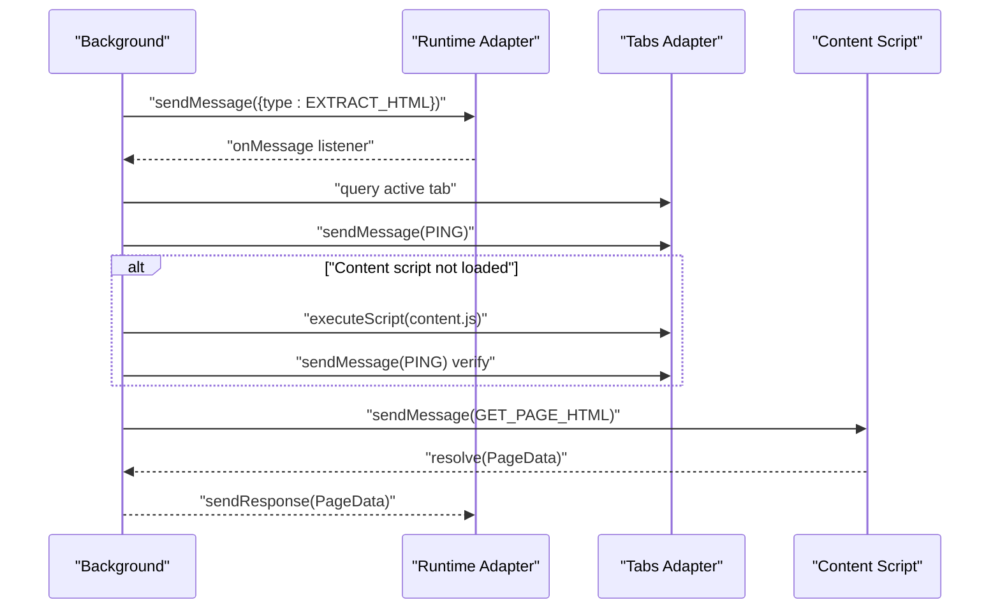
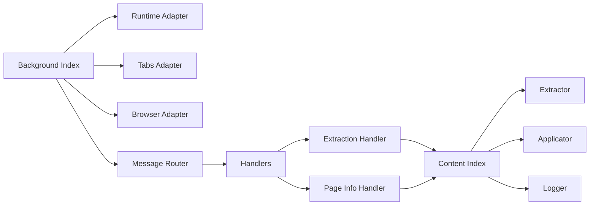

# Message Handling and Communication

<cite>
**Referenced Files in This Document**
- [index.js](file://assignment-solver/src/content/index.js)
- [messages.js](file://assignment-solver/src/core/messages.js)
- [logger.js](file://assignment-solver/src/content/logger.js)
- [index.js](file://assignment-solver/src/background/index.js)
- [types.js](file://assignment-solver/src/core/types.js)
- [router.js](file://assignment-solver/src/background/router.js)
- [extraction.js](file://assignment-solver/src/background/handlers/extraction.js)
- [pageinfo.js](file://assignment-solver/src/background/handlers/pageinfo.js)
- [extractor.js](file://assignment-solver/src/content/extractor.js)
- [applicator.js](file://assignment-solver/src/content/applicator.js)
- [runtime.js](file://assignment-solver/src/platform/runtime.js)
- [tabs.js](file://assignment-solver/src/platform/tabs.js)
- [browser.js](file://assignment-solver/src/platform/browser.js)
- [manifest.json](file://assignment-solver/manifest.json)
</cite>

## Table of Contents
1. [Introduction](#introduction)
2. [Project Structure](#project-structure)
3. [Core Components](#core-components)
4. [Architecture Overview](#architecture-overview)
5. [Detailed Component Analysis](#detailed-component-analysis)
6. [Dependency Analysis](#dependency-analysis)
7. [Performance Considerations](#performance-considerations)
8. [Troubleshooting Guide](#troubleshooting-guide)
9. [Conclusion](#conclusion)

## Introduction
This document explains the content script message handling system that enables bidirectional communication between the content script and the background service worker. It covers supported message types, parameter and response structures, asynchronous processing, error handling, retry mechanisms, logging integration, debugging capabilities, and health checks. It also provides practical message flow examples and troubleshooting guidance.

## Project Structure
The messaging system spans three layers:
- Content script: Receives and responds to messages from the background script and interacts with the page DOM.
- Background service worker: Routes messages to specialized handlers and orchestrates cross-tab communication.
- Platform adapters: Provide a unified API surface for browser-specific implementations.

```mermaid
graph TB
subgraph "Content Layer"
CS_Index["Content Index<br/>Listens for messages"]
CS_Extractor["Extractor<br/>Page HTML & images"]
CS_Applicator["Applicator<br/>Apply answers & submit"]
CS_Logger["Logger<br/>Console output"]
end
subgraph "Background Layer"
BG_Index["Background Index<br/>Registers handlers"]
BG_Router["Message Router<br/>Dispatches messages"]
BG_Extraction["Extraction Handler<br/>Injects & fetches HTML"]
BG_PageInfo["Page Info Handler<br/>Assignment detection"]
end
subgraph "Platform Adapters"
RT_Adapter["Runtime Adapter<br/>browser.runtime.*"]
TABS_Adapter["Tabs Adapter<br/>browser.tabs.*"]
BR_Adapter["Browser Adapter<br/>polyfill & detection"]
end
CS_Index <- --> BG_Router
BG_Index --> BG_Router
BG_Router --> BG_Extraction
BG_Router --> BG_PageInfo
CS_Index --> CS_Extractor
CS_Index --> CS_Applicator
CS_Index --> CS_Logger
BG_Index --> RT_Adapter
BG_Index --> TABS_Adapter
BG_Index --> BR_Adapter
```

**Diagram sources**
- [index.js](file://assignment-solver/src/content/index.js#L1-L99)
- [index.js](file://assignment-solver/src/background/index.js#L1-L135)
- [router.js](file://assignment-solver/src/background/router.js#L1-L59)
- [extraction.js](file://assignment-solver/src/background/handlers/extraction.js#L1-L102)
- [pageinfo.js](file://assignment-solver/src/background/handlers/pageinfo.js#L1-L112)
- [runtime.js](file://assignment-solver/src/platform/runtime.js#L1-L32)
- [tabs.js](file://assignment-solver/src/platform/tabs.js#L1-L53)
- [browser.js](file://assignment-solver/src/platform/browser.js#L1-L86)

**Section sources**
- [index.js](file://assignment-solver/src/content/index.js#L1-L99)
- [index.js](file://assignment-solver/src/background/index.js#L1-L135)
- [router.js](file://assignment-solver/src/background/router.js#L1-L59)
- [runtime.js](file://assignment-solver/src/platform/runtime.js#L1-L32)
- [tabs.js](file://assignment-solver/src/platform/tabs.js#L1-L53)
- [browser.js](file://assignment-solver/src/platform/browser.js#L1-L86)

## Core Components
- Message types: Centralized in a constants module and used across content and background layers.
- Content script message listener: Handles incoming messages, delegates to extractor/applicator, and returns structured responses.
- Background message router: Dispatches messages to appropriate handlers and ensures response semantics.
- Handlers: Implement specific workflows (HTML extraction, page info, assignment detection).
- Retry and error handling: Robust retry logic for transient connection failures.
- Logging: Unified logger factories for both content and background contexts.

Key responsibilities:
- Health checks via PING
- Page HTML and image extraction via GET_PAGE_HTML
- Quick assignment detection via GET_PAGE_INFO
- Applying answers via APPLY_ANSWERS
- Submitting assignments via SUBMIT_ASSIGNMENT
- Debugging via GEMINI_DEBUG

**Section sources**
- [messages.js](file://assignment-solver/src/core/messages.js#L1-L96)
- [index.js](file://assignment-solver/src/content/index.js#L19-L96)
- [router.js](file://assignment-solver/src/background/router.js#L14-L58)
- [extraction.js](file://assignment-solver/src/background/handlers/extraction.js#L15-L101)
- [pageinfo.js](file://assignment-solver/src/background/handlers/pageinfo.js#L15-L111)
- [messages.js](file://assignment-solver/src/core/messages.js#L47-L95)

## Architecture Overview
The system uses a request-response model with explicit message routing and error propagation. The content script listens for messages and performs DOM operations, while the background orchestrates cross-tab actions and content script injection.



**Diagram sources**
- [extraction.js](file://assignment-solver/src/background/handlers/extraction.js#L18-L99)
- [index.js](file://assignment-solver/src/content/index.js#L32-L35)
- [runtime.js](file://assignment-solver/src/platform/runtime.js#L19-L21)
- [tabs.js](file://assignment-solver/src/platform/tabs.js#L38-L40)

## Detailed Component Analysis

### Message Types and Contracts
Supported message types and their roles:
- PING: Health check for content script availability.
- GET_PAGE_HTML: Request page HTML and associated assets.
- GET_PAGE_INFO: Quick page metadata for assignment detection.
- APPLY_ANSWERS: Apply AI-provided answers to form elements.
- SUBMIT_ASSIGNMENT: Trigger submission with optional confirmation handling.
- GEMINI_DEBUG: Relay debug payloads to content script for logging.

Parameter and response structures:
- Generic message shape: { type: string, payload?: any }
- Responses: Always include either data fields or an error field.

Type definitions:
- Message: { type, payload? }
- PageData: { html, images[], url, title, submitButtonId, confirmButtonIds, tabId?, windowId? }
- ExtractionResult: { submit_button_id, confirm_submit_button_ids, questions[] }
- Logger: { log, warn, error }

**Section sources**
- [messages.js](file://assignment-solver/src/core/messages.js#L5-L23)
- [types.js](file://assignment-solver/src/core/types.js#L16-L61)
- [messages.js](file://assignment-solver/src/core/messages.js#L31-L33)

### Content Script Message Listener
The content script registers a message listener that:
- Logs received message types
- Returns a Promise for asynchronous responses
- Supports PING, GET_PAGE_HTML, GET_PAGE_INFO, APPLY_ANSWERS, SUBMIT_ASSIGNMENT, and GEMINI_DEBUG
- Wraps errors in structured responses

Processing logic highlights:
- PING: Responds with pong indicator
- GET_PAGE_HTML: Delegates to extractor and returns PageData
- GET_PAGE_INFO: Delegates to extractor for quick metadata
- APPLY_ANSWERS: Delegates to applicator to update DOM
- SUBMIT_ASSIGNMENT: Delegates to applicator to trigger submission
- GEMINI_DEBUG: Logs payload to console with stage context

**Section sources**
- [index.js](file://assignment-solver/src/content/index.js#L19-L96)
- [logger.js](file://assignment-solver/src/content/logger.js#L11-L17)

### Background Message Router
The router:
- Logs incoming messages
- Looks up handler by type
- Ensures sendResponse is always invoked
- Keeps message channels open for asynchronous handlers (critical for Firefox)
- Handles both synchronous and Promise-returning handlers

**Section sources**
- [router.js](file://assignment-solver/src/background/router.js#L14-L58)

### Extraction Handler Workflow
Purpose: Fetch full-page HTML and images from the active or specified tab.

Key steps:
- Determine tab/window context (use provided tabId or active tab)
- Verify content script presence via PING; inject if missing
- Request GET_PAGE_HTML from content script
- Return combined PageData with tab/window identifiers

Error handling:
- Propagates "no active tab" and "content script not responding" conditions
- Provides actionable messages for user action (refresh page)

**Section sources**
- [extraction.js](file://assignment-solver/src/background/handlers/extraction.js#L18-L99)

### Page Info Handler Workflow
Purpose: Detect assignment pages and gather quick metadata.

Key steps:
- Determine active tab (or provided tabId)
- Check URL for NPTEL/Swayam and assignment-related paths
- Optionally inject content script and verify PING
- Request GET_PAGE_INFO from content script
- Return structured assignment info

**Section sources**
- [pageinfo.js](file://assignment-solver/src/background/handlers/pageinfo.js#L18-L110)

### Retry and Connection Error Handling
The sendMessageWithRetry utility:
- Retries transient connection errors (e.g., "Receiving end does not exist", "Could not establish connection")
- Exponential backoff delay scaled by attempt number
- Stops after maxRetries attempts and throws a descriptive error
- Does not retry non-connection errors

Usage context:
- Particularly beneficial for Firefox where background initialization can be slower
- Can be applied when sending messages from UI or background to content script

**Section sources**
- [messages.js](file://assignment-solver/src/core/messages.js#L47-L95)

### Logging and Debugging Integration
- Content script logger: Prefixed console output for content operations
- Background logger: Centralized logging for router and handlers
- GEMINI_DEBUG: Two-way debug relay from background to content script for visibility during AI workflows

**Section sources**
- [logger.js](file://assignment-solver/src/content/logger.js#L11-L17)
- [index.js](file://assignment-solver/src/background/index.js#L69-L102)
- [index.js](file://assignment-solver/src/content/index.js#L80-L86)

### Health Checks and Content Script Lifecycle
- PING: Used by background to verify content script readiness
- Injection: Background injects content script when absent and verifies with PING
- Firefox-specific delays: Additional waits to ensure initialization completes

**Section sources**
- [extraction.js](file://assignment-solver/src/background/handlers/extraction.js#L45-L75)
- [pageinfo.js](file://assignment-solver/src/background/handlers/pageinfo.js#L63-L93)

### Data Extraction and Application
- Extractor: Finds assignment containers, extracts HTML, collects images, identifies submit and confirmation button IDs
- Applicator: Applies single/multi-choice and fill-in-the-blank answers; triggers submission

**Section sources**
- [extractor.js](file://assignment-solver/src/content/extractor.js#L21-L96)
- [extractor.js](file://assignment-solver/src/content/extractor.js#L182-L236)
- [applicator.js](file://assignment-solver/src/content/applicator.js#L21-L48)
- [applicator.js](file://assignment-solver/src/content/applicator.js#L201-L216)

## Dependency Analysis
The messaging system relies on platform adapters to abstract browser differences and ensure cross-browser compatibility.



**Diagram sources**
- [index.js](file://assignment-solver/src/background/index.js#L5-L19)
- [runtime.js](file://assignment-solver/src/platform/runtime.js#L12-L31)
- [tabs.js](file://assignment-solver/src/platform/tabs.js#L12-L52)
- [browser.js](file://assignment-solver/src/platform/browser.js#L9-L16)
- [router.js](file://assignment-solver/src/background/router.js#L14-L26)
- [index.js](file://assignment-solver/src/content/index.js#L16-L17)

**Section sources**
- [index.js](file://assignment-solver/src/background/index.js#L5-L19)
- [runtime.js](file://assignment-solver/src/platform/runtime.js#L12-L31)
- [tabs.js](file://assignment-solver/src/platform/tabs.js#L12-L52)
- [browser.js](file://assignment-solver/src/platform/browser.js#L9-L16)
- [router.js](file://assignment-solver/src/background/router.js#L14-L26)

## Performance Considerations
- Asynchronous message handling: Handlers return Promises; ensure sendResponse is called promptly to avoid channel timeouts.
- Firefox-specific behavior: Returning true from onMessage keeps the response channel open for async work; the router enforces this.
- Injection overhead: Content script injection adds latency; caching or reusing injected scripts reduces repeated overhead.
- Image extraction: Canvas-based conversion can be expensive; filtering small or external images avoids unnecessary work.
- Retry strategy: Configurable exponential backoff prevents busy-waiting and reduces failure cascades.

[No sources needed since this section provides general guidance]

## Troubleshooting Guide
Common issues and resolutions:
- Content script not responding:
  - Symptom: Error indicating content script not responding
  - Action: Refresh the page; background attempts injection and verification
- Unknown message type:
  - Symptom: Error response with unknown type
  - Action: Verify message type constants and ensure both sides use the same definitions
- Connection errors during messaging:
  - Symptom: "Receiving end does not exist" or similar
  - Action: Use sendMessageWithRetry; if persistent, reload extension or refresh page
- No active tab found:
  - Symptom: Handler reports no active tab
  - Action: Ensure a valid tab is focused; handlers support explicit tabId
- CORS or canvas conversion errors:
  - Symptom: Images skipped due to CORS
  - Action: Review image sources; only same-origin images are converted

Health check:
- Use PING from background/UI to verify content script readiness
- Background also supports PING for UI-side health checks

**Section sources**
- [extraction.js](file://assignment-solver/src/background/handlers/extraction.js#L35-L38)
- [extraction.js](file://assignment-solver/src/background/handlers/extraction.js#L89-L95)
- [messages.js](file://assignment-solver/src/core/messages.js#L70-L75)
- [messages.js](file://assignment-solver/src/core/messages.js#L83-L90)
- [pageinfo.js](file://assignment-solver/src/background/handlers/pageinfo.js#L33-L42)
- [index.js](file://assignment-solver/src/background/index.js#L47-L50)

## Conclusion
The message handling system provides a robust, cross-browser compatible communication layer between the content script and background service worker. It supports essential workflows for assignment detection, content extraction, answer application, and submission, with strong error handling, logging, and health checks. Following the documented patterns ensures reliable operation across Chrome and Firefox environments.