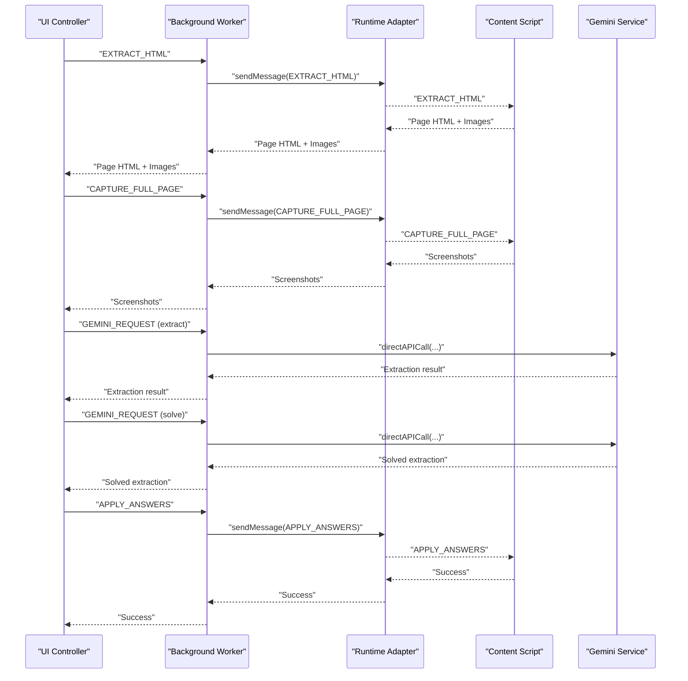
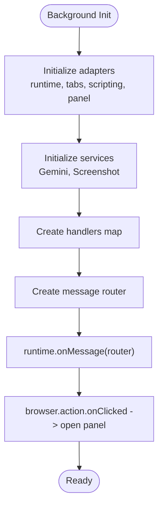
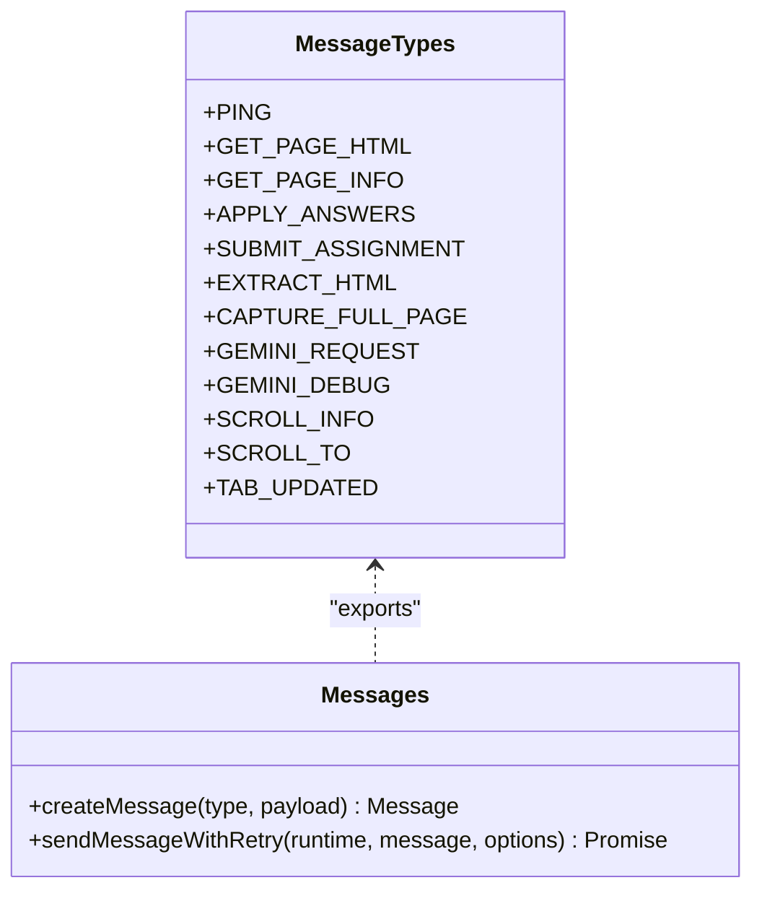
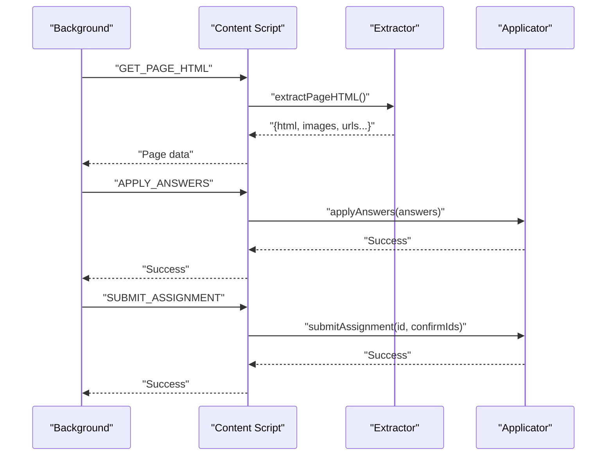
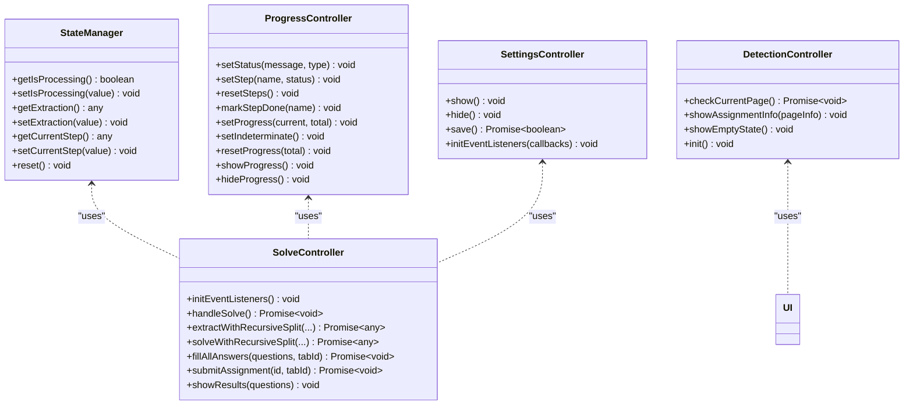
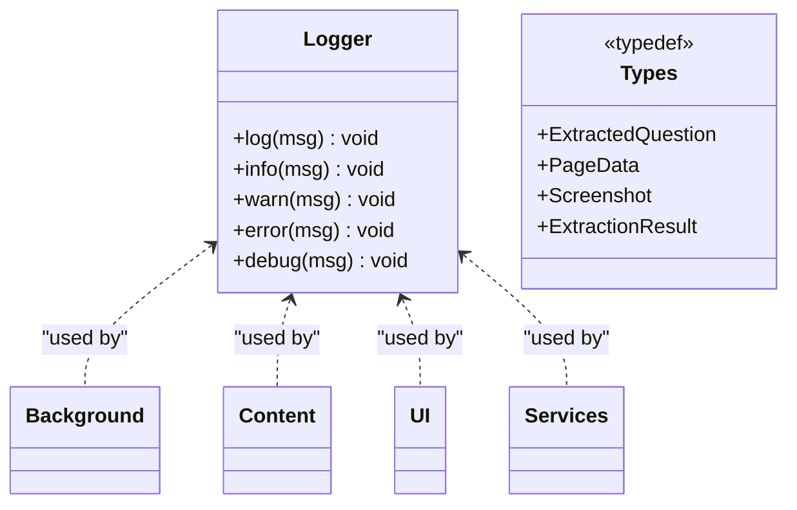
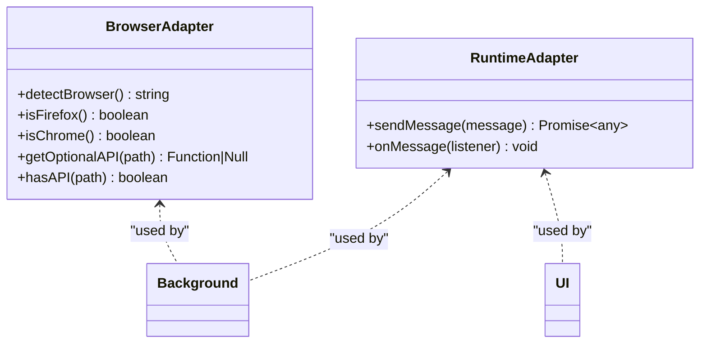
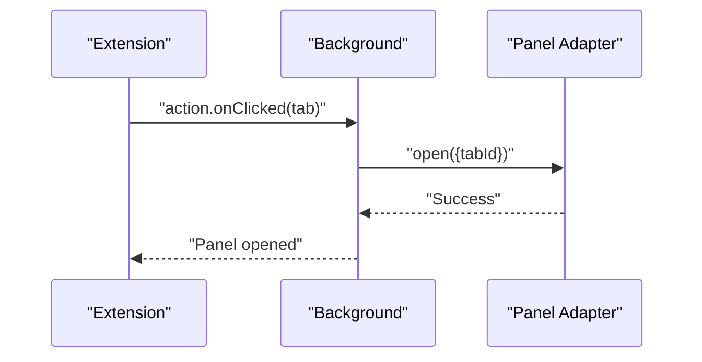
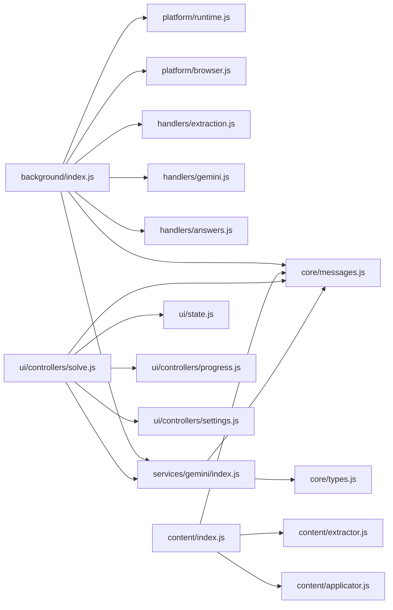

# Core Modules

<cite>
**Referenced Files in This Document**
- [background/index.js](file://assignment-solver/src/background/index.js)
- [background/router.js](file://assignment-solver/src/background/router.js)
- [background/handlers/extraction.js](file://assignment-solver/src/background/handlers/extraction.js)
- [background/handlers/gemini.js](file://assignment-solver/src/background/handlers/gemini.js)
- [background/handlers/answers.js](file://assignment-solver/src/background/handlers/answers.js)
- [content/index.js](file://assignment-solver/src/content/index.js)
- [content/extractor.js](file://assignment-solver/src/content/extractor.js)
- [content/applicator.js](file://assignment-solver/src/content/applicator.js)
- [core/messages.js](file://assignment-solver/src/core/messages.js)
- [core/types.js](file://assignment-solver/src/core/types.js)
- [ui/state.js](file://assignment-solver/src/ui/state.js)
- [ui/controllers/detection.js](file://assignment-solver/src/ui/controllers/detection.js)
- [ui/controllers/solve.js](file://assignment-solver/src/ui/controllers/solve.js)
- [ui/controllers/progress.js](file://assignment-solver/src/ui/controllers/progress.js)
- [ui/controllers/settings.js](file://assignment-solver/src/ui/controllers/settings.js)
- [services/gemini/index.js](file://assignment-solver/src/services/gemini/index.js)
- [platform/browser.js](file://assignment-solver/src/platform/browser.js)
- [platform/runtime.js](file://assignment-solver/src/platform/runtime.js)
</cite>

## Table of Contents
1. [Introduction](#introduction)
2. [Project Structure](#project-structure)
3. [Core Components](#core-components)
4. [Architecture Overview](#architecture-overview)
5. [Detailed Component Analysis](#detailed-component-analysis)
6. [Dependency Analysis](#dependency-analysis)
7. [Performance Considerations](#performance-considerations)
8. [Troubleshooting Guide](#troubleshooting-guide)
9. [Conclusion](#conclusion)

## Introduction
This document explains the core module structure of the assignment-solver extension. It covers the background service with message routing and handler implementations, the content scripts responsible for DOM extraction, answer application, and the UI components that manage state, controllers, and user interactions. It also details the core utilities including shared types, message protocols, and logging systems, and provides diagrams and references to code locations for module interactions and customization points.

## Project Structure
The extension is organized into distinct layers:
- Background service worker orchestrates messaging, platform adapters, and service integrations.
- Content scripts run on target pages to extract DOM content and apply answers.
- UI controllers manage state, progress, settings, and detection workflows.
- Services encapsulate AI model interactions and parsing.
- Platform adapters abstract browser APIs for cross-browser compatibility.
- Core utilities define shared types, messages, and helpers.

```mermaid
graph TB
subgraph "Background"
BGIDX["background/index.js"]
ROUTER["background/router.js"]
H_EXTRACT["background/handlers/extraction.js"]
H_GEMINI["background/handlers/gemini.js"]
H_ANSWERS["background/handlers/answers.js"]
end
subgraph "Content Scripts"
CIDX["content/index.js"]
CEXTR["content/extractor.js"]
CAPPL["content/applicator.js"]
end
subgraph "UI"
STATE["ui/state.js"]
DETECT["ui/controllers/detection.js"]
SOLVE["ui/controllers/solve.js"]
PROGRESS["ui/controllers/progress.js"]
SETTINGS["ui/controllers/settings.js"]
end
subgraph "Services"
GEMINI["services/gemini/index.js"]
end
subgraph "Platform"
BROWSER["platform/browser.js"]
RUNTIME["platform/runtime.js"]
end
COREMSG["core/messages.js"]
CORETYPES["core/types.js"]
BGIDX --> ROUTER
BGIDX --> H_EXTRACT
BGIDX --> H_GEMINI
BGIDX --> H_ANSWERS
BGIDX --> RUNTIME
BGIDX --> BROWSER
CIDX --> CEXTR
CIDX --> CAPPL
CIDX --> COREMSG
SOLVE --> COREMSG
SOLVE --> GEMINI
SOLVE --> PROGRESS
SOLVE --> SETTINGS
SOLVE --> STATE
DETECT --> COREMSG
SETTINGS --> STATE
ROUTER --> COREMSG
H_EXTRACT --> COREMSG
H_GEMINI --> COREMSG
H_ANSWERS --> COREMSG
GEMINI --> COREMSG
GEMINI --> CORETYPES
```

**Diagram sources**
- [background/index.js](file://assignment-solver/src/background/index.js#L1-L135)
- [background/router.js](file://assignment-solver/src/background/router.js#L1-L59)
- [background/handlers/extraction.js](file://assignment-solver/src/background/handlers/extraction.js#L1-L102)
- [background/handlers/gemini.js](file://assignment-solver/src/background/handlers/gemini.js#L1-L35)
- [background/handlers/answers.js](file://assignment-solver/src/background/handlers/answers.js#L1-L77)
- [content/index.js](file://assignment-solver/src/content/index.js#L1-L99)
- [content/extractor.js](file://assignment-solver/src/content/extractor.js#L1-L241)
- [content/applicator.js](file://assignment-solver/src/content/applicator.js#L1-L221)
- [ui/state.js](file://assignment-solver/src/ui/state.js#L1-L41)
- [ui/controllers/detection.js](file://assignment-solver/src/ui/controllers/detection.js#L1-L111)
- [ui/controllers/solve.js](file://assignment-solver/src/ui/controllers/solve.js#L1-L778)
- [ui/controllers/progress.js](file://assignment-solver/src/ui/controllers/progress.js#L1-L164)
- [ui/controllers/settings.js](file://assignment-solver/src/ui/controllers/settings.js#L1-L128)
- [services/gemini/index.js](file://assignment-solver/src/services/gemini/index.js#L1-L342)
- [platform/browser.js](file://assignment-solver/src/platform/browser.js#L1-L86)
- [platform/runtime.js](file://assignment-solver/src/platform/runtime.js#L1-L32)
- [core/messages.js](file://assignment-solver/src/core/messages.js#L1-L96)
- [core/types.js](file://assignment-solver/src/core/types.js#L1-L64)

**Section sources**
- [background/index.js](file://assignment-solver/src/background/index.js#L1-L135)
- [content/index.js](file://assignment-solver/src/content/index.js#L1-L99)
- [ui/controllers/solve.js](file://assignment-solver/src/ui/controllers/solve.js#L1-L778)
- [services/gemini/index.js](file://assignment-solver/src/services/gemini/index.js#L1-L342)
- [platform/browser.js](file://assignment-solver/src/platform/browser.js#L1-L86)
- [platform/runtime.js](file://assignment-solver/src/platform/runtime.js#L1-L32)
- [core/messages.js](file://assignment-solver/src/core/messages.js#L1-L96)
- [core/types.js](file://assignment-solver/src/core/types.js#L1-L64)

## Core Components
- Background service worker initializes platform adapters, services, and registers the message router. It exposes handlers for extraction, screenshots, Gemini requests, answer application, and submission.
- Content scripts provide DOM extraction and answer application, responding to messages from the background.
- UI controllers manage state, progress, settings, and detection. They coordinate the solve flow and interact with the background via message protocols.
- Services encapsulate AI model interactions, including extraction and solving, with robust retry and error handling.
- Platform adapters abstract browser APIs for cross-browser compatibility.
- Core utilities define shared types, message constants, and helper functions for message sending with retry logic.

**Section sources**
- [background/index.js](file://assignment-solver/src/background/index.js#L1-L135)
- [content/index.js](file://assignment-solver/src/content/index.js#L1-L99)
- [ui/state.js](file://assignment-solver/src/ui/state.js#L1-L41)
- [ui/controllers/progress.js](file://assignment-solver/src/ui/controllers/progress.js#L1-L164)
- [ui/controllers/settings.js](file://assignment-solver/src/ui/controllers/settings.js#L1-L128)
- [services/gemini/index.js](file://assignment-solver/src/services/gemini/index.js#L1-L342)
- [platform/browser.js](file://assignment-solver/src/platform/browser.js#L1-L86)
- [platform/runtime.js](file://assignment-solver/src/platform/runtime.js#L1-L32)
- [core/messages.js](file://assignment-solver/src/core/messages.js#L1-L96)
- [core/types.js](file://assignment-solver/src/core/types.js#L1-L64)

## Architecture Overview
The extension follows a message-driven architecture:
- The background service worker listens for UI-triggered actions and routes them to appropriate handlers.
- Handlers interact with platform adapters and services, and may forward messages to content scripts.
- Content scripts execute in-page DOM operations and respond to messages with extracted data or applied answers.
- UI controllers orchestrate the end-to-end solve workflow, updating state and progress.

**Diagram sources**
- [background/index.js](file://assignment-solver/src/background/index.js#L44-L117)
- [background/router.js](file://assignment-solver/src/background/router.js#L14-L58)
- [background/handlers/extraction.js](file://assignment-solver/src/background/handlers/extraction.js#L15-L102)
- [background/handlers/gemini.js](file://assignment-solver/src/background/handlers/gemini.js#L12-L35)
- [background/handlers/answers.js](file://assignment-solver/src/background/handlers/answers.js#L14-L77)
- [content/index.js](file://assignment-solver/src/content/index.js#L19-L96)
- [services/gemini/index.js](file://assignment-solver/src/services/gemini/index.js#L302-L340)
- [core/messages.js](file://assignment-solver/src/core/messages.js#L5-L33)

## Detailed Component Analysis

### Background Service Worker and Message Routing
- Initializes platform adapters and services.
- Creates handlers for PING, EXTRACT_HTML, GET_PAGE_INFO, CAPTURE_FULL_PAGE, GEMINI_REQUEST, GEMINI_DEBUG, APPLY_ANSWERS, and SUBMIT_ASSIGNMENT.
- Registers a router that dispatches messages to handlers, ensuring asynchronous completion and proper response handling.
- Sets up extension action click to open the side panel and panel behavior for Chrome.

**Diagram sources**
- [background/index.js](file://assignment-solver/src/background/index.js#L24-L135)
- [background/router.js](file://assignment-solver/src/background/router.js#L14-L58)

**Section sources**
- [background/index.js](file://assignment-solver/src/background/index.js#L1-L135)
- [background/router.js](file://assignment-solver/src/background/router.js#L1-L59)

### Message Protocols and Utilities
- Defines MESSAGE_TYPES for content/background communication and internal messages.
- Provides createMessage for constructing typed messages.
- sendMessageWithRetry adds robust retry logic for transient connection failures, especially important for Firefox.

**Diagram sources**
- [core/messages.js](file://assignment-solver/src/core/messages.js#L5-L96)

**Section sources**
- [core/messages.js](file://assignment-solver/src/core/messages.js#L1-L96)

### Content Scripts: DOM Extraction and Answer Application
- Content script listens for messages and performs:
  - PING health checks.
  - GET_PAGE_HTML extraction via extractor service.
  - GET_PAGE_INFO quick page info for assignment detection.
  - SCROLL_INFO and SCROLL_TO for screenshot capture.
  - APPLY_ANSWERS and SUBMIT_ASSIGNMENT via applicator service.
  - GEMINI_DEBUG console logging for debugging.
- Extractor locates assignment containers, extracts HTML and images, and finds submit/confirmation button IDs.
- Applicator applies answers to radio buttons, checkboxes, and text inputs, and triggers submission.

**Diagram sources**
- [content/index.js](file://assignment-solver/src/content/index.js#L19-L96)
- [content/extractor.js](file://assignment-solver/src/content/extractor.js#L21-L96)
- [content/applicator.js](file://assignment-solver/src/content/applicator.js#L21-L194)

**Section sources**
- [content/index.js](file://assignment-solver/src/content/index.js#L1-L99)
- [content/extractor.js](file://assignment-solver/src/content/extractor.js#L1-L241)
- [content/applicator.js](file://assignment-solver/src/content/applicator.js#L1-L221)

### UI Components: State Management, Controllers, and User Interface Elements
- State manager holds processing state, extraction result, and current step.
- Progress controller manages status messages, step indicators, and progress bars.
- Settings controller handles API key and model preference persistence and UI binding.
- Detection controller checks current page for assignments and toggles UI visibility.
- Solve controller coordinates the full workflow: extract, capture screenshots, call Gemini for extraction and solving, apply answers, and optionally submit.

**Diagram sources**
- [ui/state.js](file://assignment-solver/src/ui/state.js#L9-L40)
- [ui/controllers/progress.js](file://assignment-solver/src/ui/controllers/progress.js#L12-L164)
- [ui/controllers/settings.js](file://assignment-solver/src/ui/controllers/settings.js#L13-L128)
- [ui/controllers/detection.js](file://assignment-solver/src/ui/controllers/detection.js#L15-L111)
- [ui/controllers/solve.js](file://assignment-solver/src/ui/controllers/solve.js#L21-L778)

**Section sources**
- [ui/state.js](file://assignment-solver/src/ui/state.js#L1-L41)
- [ui/controllers/progress.js](file://assignment-solver/src/ui/controllers/progress.js#L1-L164)
- [ui/controllers/settings.js](file://assignment-solver/src/ui/controllers/settings.js#L1-L128)
- [ui/controllers/detection.js](file://assignment-solver/src/ui/controllers/detection.js#L1-L111)
- [ui/controllers/solve.js](file://assignment-solver/src/ui/controllers/solve.js#L1-L778)

### Core Utilities: Types and Logging Systems
- Shared types define ExtractedQuestion, PageData, Screenshot, ExtractionResult, and the Logger interface for consistent typing across modules.
- Logger instances are passed through adapters and handlers for consistent logging.

**Diagram sources**
- [core/types.js](file://assignment-solver/src/core/types.js#L7-L63)

**Section sources**
- [core/types.js](file://assignment-solver/src/core/types.js#L1-L64)

### Platform Adapters and Cross-Browser Compatibility
- Browser adapter exports a unified browser API and provides helper functions to detect browser type and safely access optional APIs.
- Runtime adapter wraps browser.runtime for cross-browser messaging.

**Diagram sources**
- [platform/browser.js](file://assignment-solver/src/platform/browser.js#L22-L86)
- [platform/runtime.js](file://assignment-solver/src/platform/runtime.js#L12-L32)

**Section sources**
- [platform/browser.js](file://assignment-solver/src/platform/browser.js#L1-L86)
- [platform/runtime.js](file://assignment-solver/src/platform/runtime.js#L1-L32)

### Service Workers Lifecycle and Extension Integration
- The background worker registers message listeners and sets up the extension action to open the side panel.
- Panel behavior is configured for Chrome to open the panel on action clicks.
- The worker relays debug messages to content scripts for visibility in the page console.

**Diagram sources**
- [background/index.js](file://assignment-solver/src/background/index.js#L119-L132)

**Section sources**
- [background/index.js](file://assignment-solver/src/background/index.js#L1-L135)

## Dependency Analysis
The modules exhibit clear separation of concerns:
- Background depends on platform adapters, services, and core message utilities.
- Content scripts depend on extractor and applicator services plus core messages.
- UI controllers depend on state, progress, settings, and runtime adapters.
- Services depend on core messages and types.
- Platform adapters are foundational and used across modules.

**Diagram sources**
- [background/index.js](file://assignment-solver/src/background/index.js#L1-L135)
- [content/index.js](file://assignment-solver/src/content/index.js#L1-L99)
- [ui/controllers/solve.js](file://assignment-solver/src/ui/controllers/solve.js#L1-L778)
- [services/gemini/index.js](file://assignment-solver/src/services/gemini/index.js#L1-L342)
- [platform/runtime.js](file://assignment-solver/src/platform/runtime.js#L1-L32)
- [platform/browser.js](file://assignment-solver/src/platform/browser.js#L1-L86)
- [core/messages.js](file://assignment-solver/src/core/messages.js#L1-L96)
- [core/types.js](file://assignment-solver/src/core/types.js#L1-L64)

**Section sources**
- [background/index.js](file://assignment-solver/src/background/index.js#L1-L135)
- [content/index.js](file://assignment-solver/src/content/index.js#L1-L99)
- [ui/controllers/solve.js](file://assignment-solver/src/ui/controllers/solve.js#L1-L778)
- [services/gemini/index.js](file://assignment-solver/src/services/gemini/index.js#L1-L342)
- [platform/runtime.js](file://assignment-solver/src/platform/runtime.js#L1-L32)
- [platform/browser.js](file://assignment-solver/src/platform/browser.js#L1-L86)
- [core/messages.js](file://assignment-solver/src/core/messages.js#L1-L96)
- [core/types.js](file://assignment-solver/src/core/types.js#L1-L64)

## Performance Considerations
- Message retries: sendMessageWithRetry mitigates transient connection issues, particularly in Firefox.
- Asynchronous handler pattern: Handlers return promises and ensure sendResponse is called to prevent hanging channels.
- Screenshot capture: Captures full-page screenshots to aid visual understanding; consider batching and rate limiting to reduce overhead.
- Recursive splitting: The solve and extract controllers split content on MAX_TOKENS errors to stay within model limits, improving reliability at the cost of extra API calls.
- DOM operations: Content scripts throttle answer application with small delays to improve stability.

[No sources needed since this section provides general guidance]

## Troubleshooting Guide
Common issues and remedies:
- Content script not responding: The background extraction handler injects content scripts and verifies readiness with a PING message. If injection fails, the handler returns an error suggesting a page refresh.
- Firefox message channel timeouts: Use sendMessageWithRetry and ensure handlers return true for asynchronous responses to keep channels open.
- Gemini API failures: The Gemini service throws on non-OK responses and parses candidates; errors are relayed to the UI and logged.
- Debugging: Use GEMINI_DEBUG messages to relay structured payloads to the page console for inspection.

**Section sources**
- [background/handlers/extraction.js](file://assignment-solver/src/background/handlers/extraction.js#L45-L75)
- [background/router.js](file://assignment-solver/src/background/router.js#L28-L57)
- [services/gemini/index.js](file://assignment-solver/src/services/gemini/index.js#L324-L340)
- [content/index.js](file://assignment-solver/src/content/index.js#L80-L86)

## Conclusion
The assignment-solver extension employs a clean, modular architecture centered around message-driven communication between the background service worker, content scripts, and UI controllers. Robust utilities for messaging, types, and platform abstraction enable reliable cross-browser operation. The Gemini service integrates seamlessly to extract and solve assignments, while UI controllers provide a guided, stepwise workflow with progress tracking and settings management. The documented extension points allow customization of handlers, controllers, and services to adapt to evolving assignment formats and user needs.