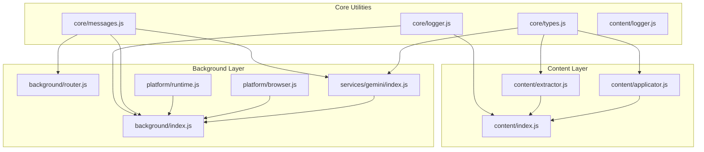
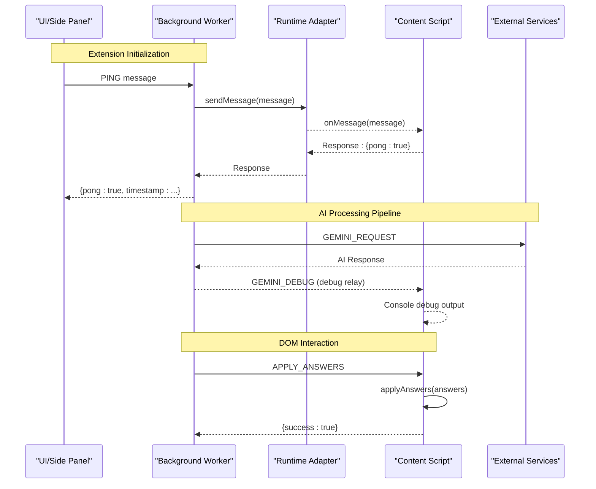
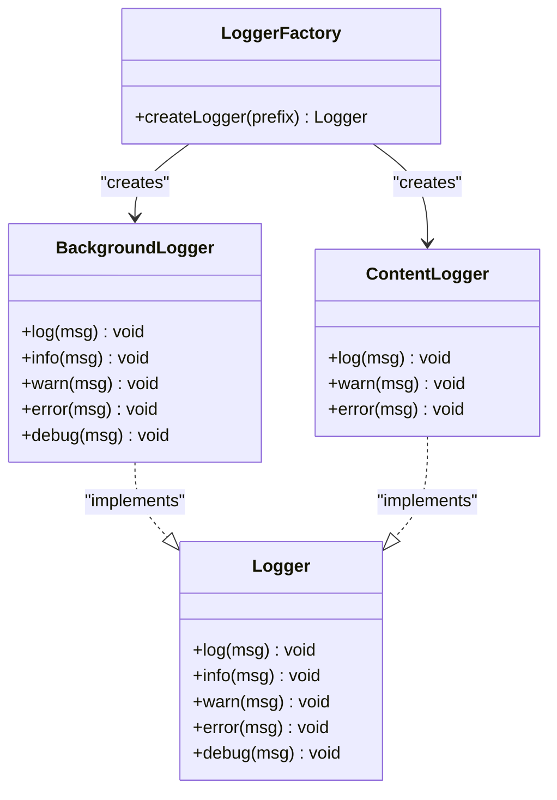
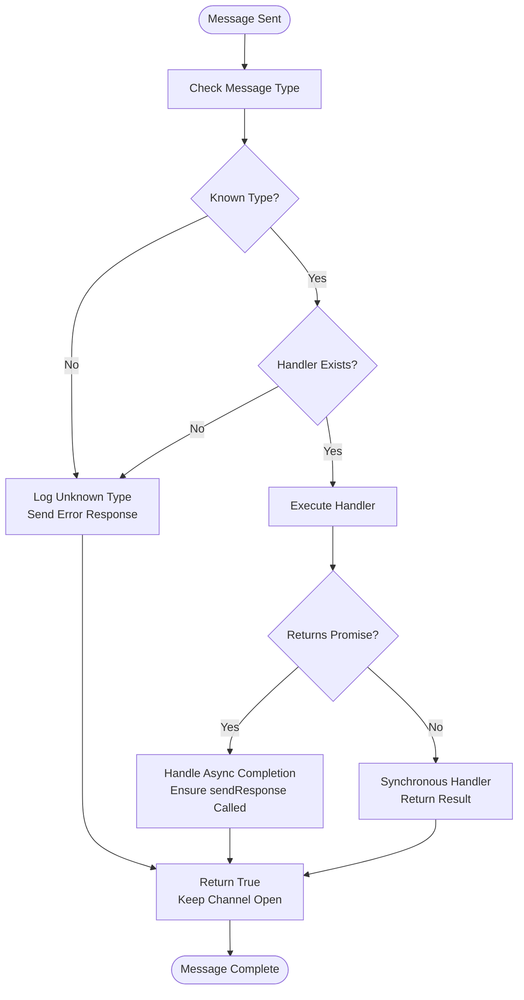
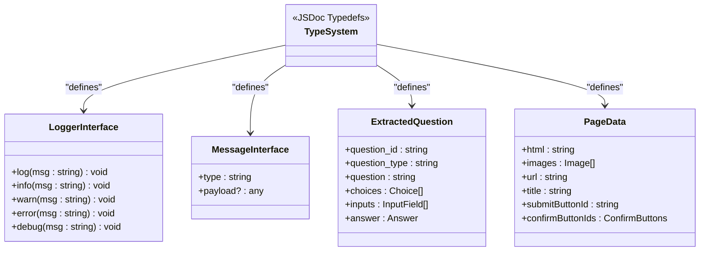
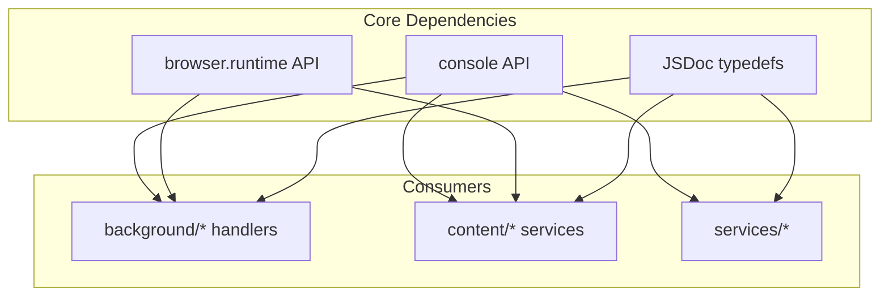

# Core Utilities

<cite>
**Referenced Files in This Document**
- [logger.js](file://assignment-solver/src/core/logger.js)
- [messages.js](file://assignment-solver/src/core/messages.js)
- [types.js](file://assignment-solver/src/core/types.js)
- [content_logger.js](file://assignment-solver/src/content/logger.js)
- [background_index.js](file://assignment-solver/src/background/index.js)
- [content_index.js](file://assignment-solver/src/content/index.js)
- [runtime_adapter.js](file://assignment-solver/src/platform/runtime.js)
- [browser_adapter.js](file://assignment-solver/src/platform/browser.js)
- [router.js](file://assignment-solver/src/background/router.js)
- [gemini_service.js](file://assignment-solver/src/services/gemini/index.js)
- [extractor.js](file://assignment-solver/src/content/extractor.js)
- [applicator.js](file://assignment-solver/src/content/applicator.js)
- [manifest.json](file://assignment-solver/manifest.json)
- [package.json](file://assignment-solver/package.json)
</cite>

## Table of Contents
1. [Introduction](#introduction)
2. [Project Structure](#project-structure)
3. [Core Components](#core-components)
4. [Architecture Overview](#architecture-overview)
5. [Detailed Component Analysis](#detailed-component-analysis)
6. [Dependency Analysis](#dependency-analysis)
7. [Performance Considerations](#performance-considerations)
8. [Troubleshooting Guide](#troubleshooting-guide)
9. [Conclusion](#conclusion)

## Introduction
This document covers the core utility modules that provide foundational functionality for the NPTEL Assignment Solver extension. It focuses on three primary areas:
- Logging system with factory pattern and contextual prefixes
- Message protocol definitions for cross-script communication
- Shared type definitions for type safety across the extension

These utilities enable reliable communication between the background service worker, content scripts, and platform adapters while maintaining consistent logging and type safety.

## Project Structure
The core utilities are organized under the assignment-solver/src/core directory and are consumed by various extension components:

**Diagram sources**
- [logger.js](file://assignment-solver/src/core/logger.js#L1-L19)
- [messages.js](file://assignment-solver/src/core/messages.js#L1-L96)
- [types.js](file://assignment-solver/src/core/types.js#L1-L64)
- [content_logger.js](file://assignment-solver/src/content/logger.js#L1-L20)
- [background_index.js](file://assignment-solver/src/background/index.js#L1-L135)
- [content_index.js](file://assignment-solver/src/content/index.js#L1-L99)
- [runtime_adapter.js](file://assignment-solver/src/platform/runtime.js#L1-L32)
- [browser_adapter.js](file://assignment-solver/src/platform/browser.js#L1-L86)
- [router.js](file://assignment-solver/src/background/router.js#L1-L59)
- [gemini_service.js](file://assignment-solver/src/services/gemini/index.js#L1-L342)
- [extractor.js](file://assignment-solver/src/content/extractor.js#L1-L241)
- [applicator.js](file://assignment-solver/src/content/applicator.js#L1-L221)

**Section sources**
- [logger.js](file://assignment-solver/src/core/logger.js#L1-L19)
- [messages.js](file://assignment-solver/src/core/messages.js#L1-L96)
- [types.js](file://assignment-solver/src/core/types.js#L1-L64)
- [content_logger.js](file://assignment-solver/src/content/logger.js#L1-L20)
- [background_index.js](file://assignment-solver/src/background/index.js#L1-L135)
- [content_index.js](file://assignment-solver/src/content/index.js#L1-L99)
- [runtime_adapter.js](file://assignment-solver/src/platform/runtime.js#L1-L32)
- [browser_adapter.js](file://assignment-solver/src/platform/browser.js#L1-L86)
- [router.js](file://assignment-solver/src/background/router.js#L1-L59)
- [gemini_service.js](file://assignment-solver/src/services/gemini/index.js#L1-L342)
- [extractor.js](file://assignment-solver/src/content/extractor.js#L1-L241)
- [applicator.js](file://assignment-solver/src/content/applicator.js#L1-L221)

## Core Components

### Logger Factory Pattern
The logging system provides a simple factory pattern for creating contextual loggers with consistent formatting and multiple log levels.

Key characteristics:
- Contextual prefixes for easy identification of log sources
- Standardized log levels: log, info, warn, error, debug
- Cross-browser compatibility through console API
- Lightweight implementation suitable for extension environments

Implementation details:
- Background logger factory creates prefixed loggers for service components
- Content script logger factory provides simplified logging for DOM interactions
- Both factories return objects with standardized method signatures
- Debug level logging is available but typically disabled in production builds

**Section sources**
- [logger.js](file://assignment-solver/src/core/logger.js#L1-L19)
- [content_logger.js](file://assignment-solver/src/content/logger.js#L1-L20)
- [background_index.js](file://assignment-solver/src/background/index.js#L22-L22)
- [content_index.js](file://assignment-solver/src/content/index.js#L12-L12)

### Message Protocol Definitions
The messaging system defines a standardized protocol for communication between extension components, with built-in retry logic for robust cross-browser operation.

Message types include:
- Content script communication: PING, GET_PAGE_HTML, GET_PAGE_INFO, APPLY_ANSWERS, SUBMIT_ASSIGNMENT
- Background communication: EXTRACT_HTML, CAPTURE_FULL_PAGE, GEMINI_REQUEST, GEMINI_DEBUG
- Internal: SCROLL_INFO, SCROLL_TO, TAB_UPDATED

Message structure:
- type: String identifier for the message category
- payload: Optional structured data for the operation
- Additional fields may be included based on the specific message type

Retry mechanism:
- Configurable maximum retries (default: 3)
- Exponential backoff with configurable base delay
- Automatic detection of connection-related errors
- Firefox-specific optimizations for initialization delays

**Section sources**
- [messages.js](file://assignment-solver/src/core/messages.js#L5-L23)
- [messages.js](file://assignment-solver/src/core/messages.js#L31-L33)
- [messages.js](file://assignment-solver/src/core/messages.js#L47-L95)
- [background_index.js](file://assignment-solver/src/background/index.js#L47-L112)
- [content_index.js](file://assignment-solver/src/content/index.js#L26-L90)

### Shared Type Definitions
The type system provides JSDoc typedefs for consistent type safety across the extension, enabling better IDE support and runtime validation.

Core types defined:
- Logger: Standardized logging interface with five log levels
- Message: Base message structure with type and optional payload
- ExtractedQuestion: Question structure with ID, type, text, choices, inputs, and answer
- PageData: Complete page extraction result including HTML, images, and metadata
- Screenshot: Image data with MIME type, base64 encoding, and positioning
- ExtractionResult: Aggregated result of question extraction with submit button info

Type safety benefits:
- IDE autocomplete and IntelliSense support
- Consistent data structures across module boundaries
- Clear documentation of expected interfaces
- Runtime validation through property checking

**Section sources**
- [types.js](file://assignment-solver/src/core/types.js#L6-L13)
- [types.js](file://assignment-solver/src/core/types.js#L15-L19)
- [types.js](file://assignment-solver/src/core/types.js#L21-L33)
- [types.js](file://assignment-solver/src/core/types.js#L35-L45)
- [types.js](file://assignment-solver/src/core/types.js#L47-L54)
- [types.js](file://assignment-solver/src/core/types.js#L56-L61)

## Architecture Overview
The core utilities enable a clean separation of concerns between logging, messaging, and type safety across the extension's architecture:

**Diagram sources**
- [background_index.js](file://assignment-solver/src/background/index.js#L47-L102)
- [content_index.js](file://assignment-solver/src/content/index.js#L20-L96)
- [messages.js](file://assignment-solver/src/core/messages.js#L47-L95)
- [gemini_service.js](file://assignment-solver/src/services/gemini/index.js#L302-L319)

## Detailed Component Analysis

### Logger Implementation Details
Both logger factories implement the same interface pattern with slight variations for their intended use cases:

**Diagram sources**
- [logger.js](file://assignment-solver/src/core/logger.js#L10-L18)
- [content_logger.js](file://assignment-solver/src/content/logger.js#L11-L17)
- [types.js](file://assignment-solver/src/core/types.js#L6-L13)

Logging usage patterns demonstrated in the extension:
- Background service worker uses "Background" prefix for all operations
- Content script uses "Content" prefix for DOM interactions
- Gemini service logs API calls and response parsing
- Router logs message routing decisions
- Extractor and applicator log DOM manipulation operations

**Section sources**
- [logger.js](file://assignment-solver/src/core/logger.js#L1-L19)
- [content_logger.js](file://assignment-solver/src/content/logger.js#L1-L20)
- [background_index.js](file://assignment-solver/src/background/index.js#L22-L22)
- [content_index.js](file://assignment-solver/src/content/index.js#L12-L12)
- [gemini_service.js](file://assignment-solver/src/services/gemini/index.js#L200-L216)
- [router.js](file://assignment-solver/src/background/router.js#L14-L15)

### Message Protocol Implementation
The messaging system provides a robust communication framework with the following key features:

**Diagram sources**
- [messages.js](file://assignment-solver/src/core/messages.js#L47-L95)
- [router.js](file://assignment-solver/src/background/router.js#L17-L57)

Message handling patterns:
- Firefox-specific optimizations for long-running handlers
- Automatic channel management for asynchronous responses
- Comprehensive error handling with descriptive error messages
- Cross-browser compatibility through unified runtime adapter

**Section sources**
- [messages.js](file://assignment-solver/src/core/messages.js#L1-L96)
- [router.js](file://assignment-solver/src/background/router.js#L1-L59)
- [runtime_adapter.js](file://assignment-solver/src/platform/runtime.js#L12-L31)

### Type Safety Mechanisms
The type system ensures consistency across module boundaries through JSDoc typedefs and runtime validation patterns:

**Diagram sources**
- [types.js](file://assignment-solver/src/core/types.js#L6-L13)
- [types.js](file://assignment-solver/src/core/types.js#L15-L19)
- [types.js](file://assignment-solver/src/core/types.js#L21-L33)
- [types.js](file://assignment-solver/src/core/types.js#L35-L45)

Type usage patterns:
- Logger instances are passed as optional dependencies to services
- Message objects follow the standardized structure across all components
- Complex data structures are validated through property existence checks
- Type definitions guide IDE autocomplete and provide compile-time documentation

**Section sources**
- [types.js](file://assignment-solver/src/core/types.js#L1-L64)
- [gemini_service.js](file://assignment-solver/src/services/gemini/index.js#L60-L61)
- [extractor.js](file://assignment-solver/src/content/extractor.js#L12-L14)
- [applicator.js](file://assignment-solver/src/content/applicator.js#L12-L14)

## Dependency Analysis
The core utilities have minimal dependencies and provide foundational services to the rest of the extension:

**Diagram sources**
- [logger.js](file://assignment-solver/src/core/logger.js#L10-L18)
- [messages.js](file://assignment-solver/src/core/messages.js#L19-L21)
- [types.js](file://assignment-solver/src/core/types.js#L6-L61)

Dependency relationships:
- Logger factory depends only on console API for output
- Message system depends on browser.runtime for cross-script communication
- Type definitions are purely documentation-based with no runtime impact
- All consumers receive dependencies through constructor parameters or module imports

**Section sources**
- [logger.js](file://assignment-solver/src/core/logger.js#L1-L19)
- [messages.js](file://assignment-solver/src/core/messages.js#L1-L96)
- [types.js](file://assignment-solver/src/core/types.js#L1-L64)

## Performance Considerations
The core utilities are designed for minimal overhead and optimal performance:

- Logger factory creates lightweight objects with minimal memory footprint
- Message protocol avoids unnecessary serialization overhead
- Type definitions are processed at build time and have no runtime cost
- Retry mechanism includes exponential backoff to minimize network pressure
- Cross-browser compatibility is achieved through polyfill rather than runtime detection

Best practices for extension developers:
- Use contextual prefixes to quickly identify log sources
- Leverage the retry mechanism for transient connection failures
- Utilize type definitions for better IDE support and fewer runtime errors
- Keep log levels appropriate for the deployment environment

## Troubleshooting Guide

### Logging Issues
Common logging problems and solutions:
- Missing log output: Verify logger factory is properly instantiated and methods are called
- Incorrect prefixes: Ensure the correct logger factory is used for each component type
- Debug logging not appearing: Debug level logging may be disabled in production builds

### Message Communication Problems
Diagnostic steps for messaging issues:
- Verify message types match between sender and receiver
- Check Firefox-specific message channel limitations
- Monitor retry attempts for connection-related errors
- Ensure handlers return appropriate responses for async operations

### Type Safety Issues
Resolving type-related problems:
- Confirm all required properties are present in message objects
- Verify type definitions match actual data structures
- Use optional chaining for properties that may be undefined
- Check for cross-browser differences in type support

**Section sources**
- [messages.js](file://assignment-solver/src/core/messages.js#L69-L95)
- [router.js](file://assignment-solver/src/background/router.js#L22-L26)
- [logger.js](file://assignment-solver/src/core/logger.js#L10-L18)

## Conclusion
The core utility modules provide a solid foundation for the NPTEL Assignment Solver extension through:

- A consistent logging system with contextual prefixes and multiple log levels
- A robust message protocol with retry logic and cross-browser compatibility
- Comprehensive type definitions that enhance developer experience and code reliability
- Minimal dependencies that enable easy maintenance and future enhancements

These utilities enable the extension to maintain clean separation of concerns while providing reliable communication and consistent behavior across different browsers and environments.