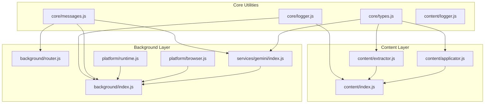
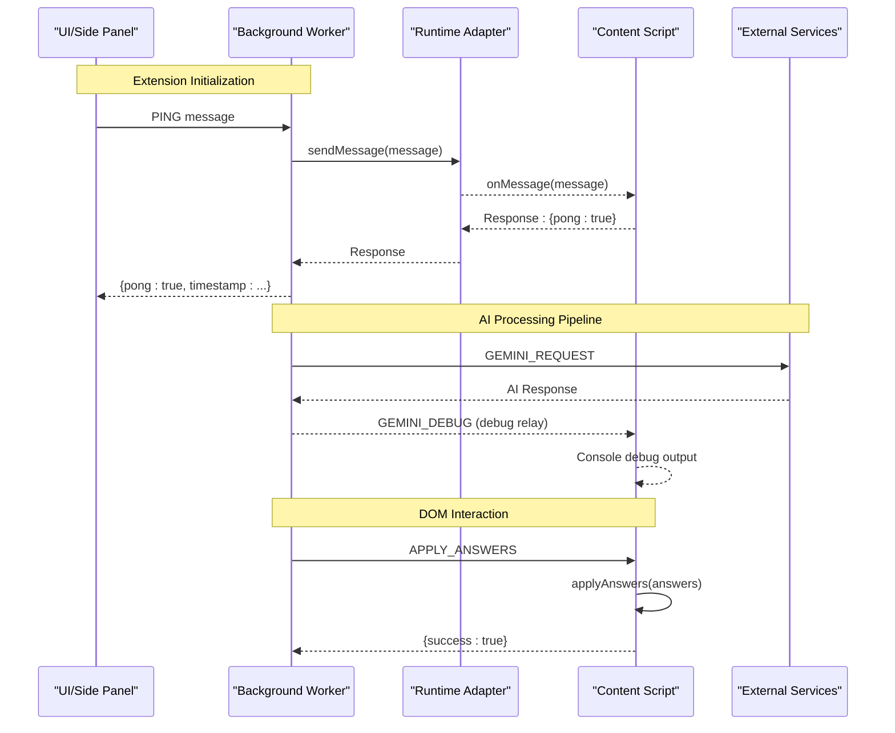
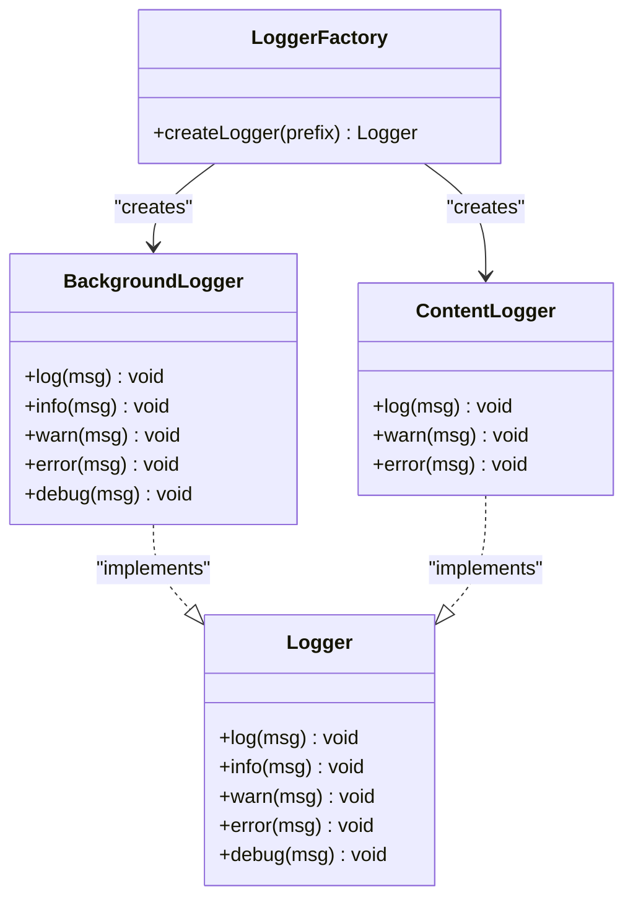
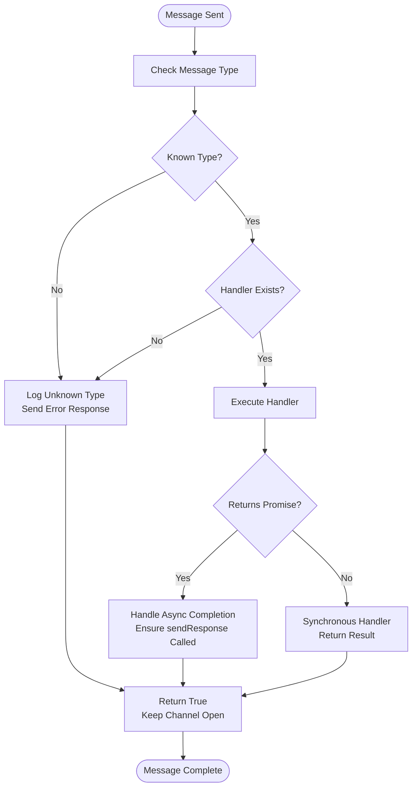
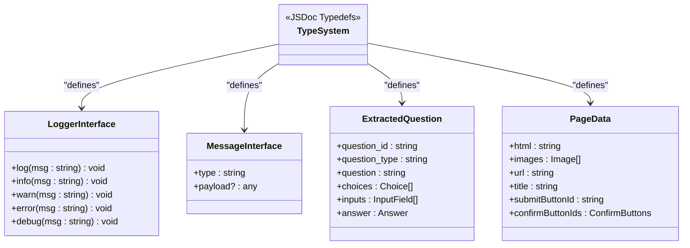
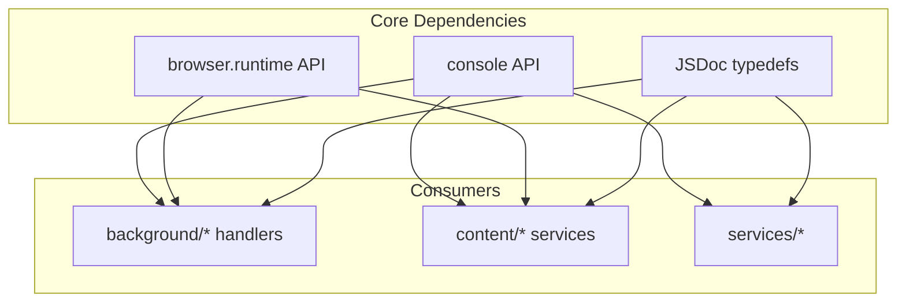

# Core utilities

## Introduction
This page covers the core utility modules that provide foundational functionality for the NPTEL Assignment Solver extension. It focuses on three primary areas:
- Logging system with factory pattern and contextual prefixes
- Message protocol definitions for cross-script communication
- Shared type definitions for type safety across the extension

These utilities enable reliable communication between the background service worker, content scripts, and platform adapters while maintaining consistent logging and type safety.

## Project structure
The core utilities are organized under the assignment-solver/src/core directory and are consumed by various extension components:

```mermaid
graph TB
subgraph "Core Utilities"
CORE_LOGGER["core/logger.js"]
CORE_MESSAGES["core/messages.js"]
CORE_TYPES["core/types.js"]
CONTENT_LOGGER["content/logger.js"]
end
subgraph "Background Layer"
BG_INDEX["background/index.js"]
BG_ROUTER["background/router.js"]
BG_RUNTIME["platform/runtime.js"]
BG_BROWSER["platform/browser.js"]
BG_GEMINI["services/gemini/index.js"]
end
subgraph "Content Layer"
CONTENT_INDEX["content/index.js"]
CONTENT_EXTRACTOR["content/extractor.js"]
CONTENT_APPLICATOR["content/applicator.js"]
end
CORE_LOGGER --> BG_INDEX
CORE_LOGGER --> CONTENT_INDEX
CORE_MESSAGES --> BG_INDEX
CORE_MESSAGES --> BG_ROUTER
CORE_MESSAGES --> BG_GEMINI
CORE_TYPES --> BG_GEMINI
CORE_TYPES --> CONTENT_EXTRACTOR
CORE_TYPES --> CONTENT_APPLICATOR
BG_RUNTIME --> BG_INDEX
BG_BROWSER --> BG_INDEX
BG_GEMINI --> BG_INDEX
CONTENT_EXTRACTOR --> CONTENT_INDEX
CONTENT_APPLICATOR --> CONTENT_INDEX
```

## Core components

### Logger factory pattern
The logging system provides a simple factory pattern for creating contextual loggers with consistent formatting and multiple log levels.

Key characteristics:
- Contextual prefixes for easy identification of log sources
- Standardized log levels: log, info, warn, error, debug
- Cross-browser compatibility through console API
- Lightweight implementation suitable for extension environments

Implementation details:
- Background logger factory creates prefixed loggers for service components
- Content script logger factory provides simplified logging for DOM interactions
- Both factories return objects with standardized method signatures
- Debug level logging is available but typically disabled in production builds

### Message protocol definitions
The messaging system defines a standardized protocol for communication between extension components, with built-in retry logic for reliable cross-browser operation.

Message types include:
- Content script communication: PING, GET_PAGE_HTML, GET_PAGE_INFO, APPLY_ANSWERS, SUBMIT_ASSIGNMENT
- Background communication: EXTRACT_HTML, CAPTURE_FULL_PAGE, GEMINI_REQUEST, GEMINI_DEBUG
- Internal: SCROLL_INFO, SCROLL_TO, TAB_UPDATED

Message structure:
- type: String identifier for the message category
- payload: Optional structured data for the operation
- Additional fields may be included based on the specific message type

Retry mechanism:
- Configurable maximum retries (default: 3)
- Exponential backoff with configurable base delay
- Automatic detection of connection-related errors
- Firefox-specific optimizations for initialization delays

### Shared type definitions
The type system provides JSDoc typedefs for consistent type safety across the extension, enabling better IDE support and runtime validation.

Core types defined:
- Logger: Standardized logging interface with five log levels
- Message: Base message structure with type and optional payload
- ExtractedQuestion: Question structure with ID, type, text, choices, inputs, and answer
- PageData: Complete page extraction result including HTML, images, and metadata
- Screenshot: Image data with MIME type, base64 encoding, and positioning
- ExtractionResult: Aggregated result of question extraction with submit button info

Type safety benefits:
- IDE autocomplete and IntelliSense support
- Consistent data structures across module boundaries
- Clear documentation of expected interfaces
- Runtime validation through property checking

## Architecture overview
The core utilities enable a clean separation of concerns between logging, messaging, and type safety across the extension's architecture:

```mermaid
sequenceDiagram
participant UI as "UI/Side Panel"
participant BG as "Background Worker"
participant RT as "Runtime Adapter"
participant CS as "Content Script"
participant EXT as "External Services"
Note over UI,BG : Extension Initialization
UI->>BG : PING message
BG->>RT : sendMessage(message)
RT-->>CS : onMessage(message)
CS-->>RT : Response : {pong : true}
RT-->>BG : Response
BG-->>UI : {pong : true, timestamp : ...}
Note over BG,EXT : AI Processing Pipeline
BG->>EXT : GEMINI_REQUEST
EXT-->>BG : AI Response
BG-->>CS : GEMINI_DEBUG (debug relay)
CS-->>CS : Console debug output
Note over CS,BG : DOM Interaction
BG->>CS : APPLY_ANSWERS
CS->>CS : applyAnswers(answers)
CS-->>BG : {success : true}
```

## Detailed component analysis

### Logger implementation details
Both logger factories implement the same interface pattern with slight variations for their intended use cases:

```mermaid
classDiagram
class LoggerFactory {
+createLogger(prefix) Logger
}
class Logger {
+log(msg) void
+info(msg) void
+warn(msg) void
+error(msg) void
+debug(msg) void
}
class BackgroundLogger {
+log(msg) void
+info(msg) void
+warn(msg) void
+error(msg) void
+debug(msg) void
}
class ContentLogger {
+log(msg) void
+warn(msg) void
+error(msg) void
}
LoggerFactory --> BackgroundLogger : "creates"
LoggerFactory --> ContentLogger : "creates"
BackgroundLogger ..|> Logger : "implements"
ContentLogger ..|> Logger : "implements"
```

Logging usage patterns demonstrated in the extension:
- Background service worker uses "Background" prefix for all operations
- Content script uses "Content" prefix for DOM interactions
- Gemini service logs API calls and response parsing
- Router logs message routing decisions
- Extractor and applicator log DOM manipulation operations

### Message protocol implementation
The messaging system provides a reliable communication framework with the following key features:

```mermaid
flowchart TD
Start([Message Sent]) --> CheckType["Check Message Type"]
CheckType --> ValidType{"Known Type?"}
ValidType --> |No| ErrorHandler["Log Unknown Type<br/>Send Error Response"]
ValidType --> |Yes| HandlerExists{"Handler Exists?"}
HandlerExists --> |No| ErrorHandler
HandlerExists --> |Yes| ExecuteHandler["Execute Handler"]
ExecuteHandler --> IsPromise{"Returns Promise?"}
IsPromise --> |Yes| HandleAsync["Handle Async Completion<br/>Ensure sendResponse Called"]
IsPromise --> |No| SyncHandler["Synchronous Handler<br/>Return Result"]
HandleAsync --> KeepChannel["Return True<br/>Keep Channel Open"]
SyncHandler --> KeepChannel
ErrorHandler --> KeepChannel
KeepChannel --> End([Message Complete])
```

Message handling patterns:
- Firefox-specific optimizations for long-running handlers
- Automatic channel management for asynchronous responses
- Detailed error handling with descriptive error messages
- Cross-browser compatibility through unified runtime adapter

### Type safety mechanisms
The type system ensures consistency across module boundaries through JSDoc typedefs and runtime validation patterns:

```mermaid
classDiagram
class TypeSystem {
<<JSDoc Typedefs>>
}
class LoggerInterface {
+log(msg : string) void
+info(msg : string) void
+warn(msg : string) void
+error(msg : string) void
+debug(msg : string) void
}
class MessageInterface {
+type : string
+payload? : any
}
class ExtractedQuestion {
+question_id : string
+question_type : string
+question : string
+choices : Choice[]
+inputs : InputField[]
+answer : Answer
}
class PageData {
+html : string
+images : Image[]
+url : string
+title : string
+submitButtonId : string
+confirmButtonIds : ConfirmButtons
}
TypeSystem --> LoggerInterface : "defines"
TypeSystem --> MessageInterface : "defines"
TypeSystem --> ExtractedQuestion : "defines"
TypeSystem --> PageData : "defines"
```

Type usage patterns:
- Logger instances are passed as optional dependencies to services
- Message objects follow the standardized structure across all components
- Complex data structures are validated through property existence checks
- Type definitions guide IDE autocomplete and provide compile-time documentation

## Dependency analysis
The core utilities have minimal dependencies and provide foundational services to the rest of the extension:

```mermaid
graph TB
subgraph "Core Dependencies"
LOGGER_DEPS["console API"]
MESSAGES_DEPS["browser.runtime API"]
TYPES_DEPS["JSDoc typedefs"]
end
subgraph "Consumers"
BG_CONSUMERS["background/* handlers"]
CONTENT_CONSUMERS["content/* services"]
SERVICE_CONSUMERS["services/*"]
end
LOGGER_DEPS --> BG_CONSUMERS
LOGGER_DEPS --> CONTENT_CONSUMERS
LOGGER_DEPS --> SERVICE_CONSUMERS
MESSAGES_DEPS --> BG_CONSUMERS
MESSAGES_DEPS --> CONTENT_CONSUMERS
TYPES_DEPS --> BG_CONSUMERS
TYPES_DEPS --> CONTENT_CONSUMERS
TYPES_DEPS --> SERVICE_CONSUMERS
```

Dependency relationships:
- Logger factory depends only on console API for output
- Message system depends on browser.runtime for cross-script communication
- Type definitions are purely documentation-based with no runtime impact
- All consumers receive dependencies through constructor parameters or module imports

## Performance considerations
The core utilities are designed for minimal overhead and optimal performance:

- Logger factory creates lightweight objects with minimal memory footprint
- Message protocol avoids unnecessary serialization overhead
- Type definitions are processed at build time and have no runtime cost
- Retry mechanism includes exponential backoff to minimize network pressure
- Cross-browser compatibility is achieved through polyfill rather than runtime detection

Best practices for extension developers:
- Use contextual prefixes to quickly identify log sources
- Use the retry mechanism for transient connection failures
- Use type definitions for better IDE support and fewer runtime errors
- Keep log levels appropriate for the deployment environment

## Troubleshooting guide

### Logging issues
Common logging problems and solutions:
- Missing log output: Verify logger factory is properly instantiated and methods are called
- Incorrect prefixes: Ensure the correct logger factory is used for each component type
- Debug logging not appearing: Debug level logging may be disabled in production builds

### Message communication problems
Diagnostic steps for messaging issues:
- Verify message types match between sender and receiver
- Check Firefox-specific message channel limitations
- Monitor retry attempts for connection-related errors
- Ensure handlers return appropriate responses for async operations

### Type safety issues
Resolving type-related problems:
- Confirm all required properties are present in message objects
- Verify type definitions match actual data structures
- Use optional chaining for properties that may be undefined
- Check for cross-browser differences in type support

## Conclusion
The core utility modules provide a solid foundation for the NPTEL Assignment Solver extension through:

- A consistent logging system with contextual prefixes and multiple log levels
- A reliable message protocol with retry logic and cross-browser compatibility
- Detailed type definitions that improve developer experience and code reliability
- Minimal dependencies that enable easy maintenance and future enhancements

These utilities enable the extension to maintain clean separation of concerns while providing reliable communication and consistent behavior across different browsers and environments.
