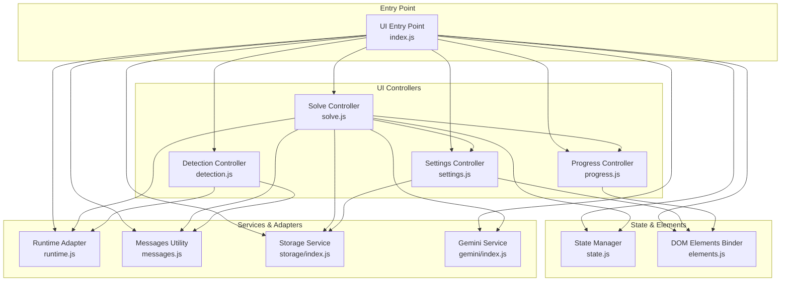
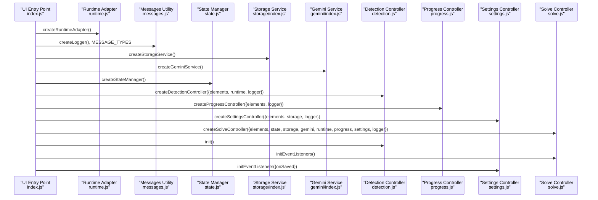
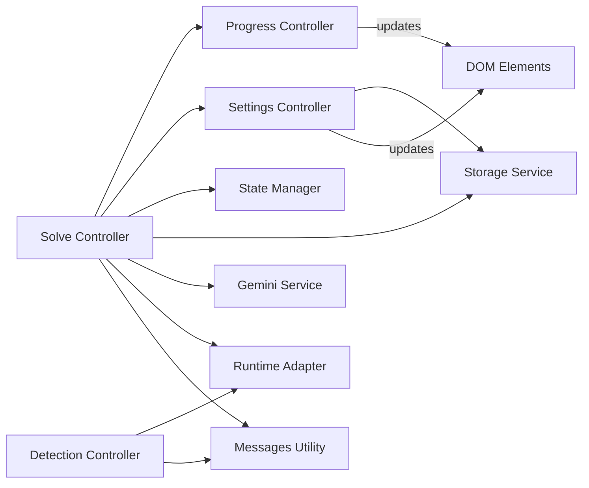

# Controller System

<cite>
**Referenced Files in This Document**
- [index.js](file://assignment-solver/src/ui/index.js)
- [detection.js](file://assignment-solver/src/ui/controllers/detection.js)
- [progress.js](file://assignment-solver/src/ui/controllers/progress.js)
- [settings.js](file://assignment-solver/src/ui/controllers/settings.js)
- [solve.js](file://assignment-solver/src/ui/controllers/solve.js)
- [state.js](file://assignment-solver/src/ui/state.js)
- [elements.js](file://assignment-solver/src/ui/elements.js)
- [messages.js](file://assignment-solver/src/core/messages.js)
- [runtime.js](file://assignment-solver/src/platform/runtime.js)
- [storage/index.js](file://assignment-solver/src/services/storage/index.js)
- [gemini/index.js](file://assignment-solver/src/services/gemini/index.js)
- [manifest.json](file://assignment-solver/manifest.json)
</cite>

## Table of Contents
1. [Introduction](#introduction)
2. [Project Structure](#project-structure)
3. [Core Components](#core-components)
4. [Architecture Overview](#architecture-overview)
5. [Detailed Component Analysis](#detailed-component-analysis)
6. [Dependency Analysis](#dependency-analysis)
7. [Performance Considerations](#performance-considerations)
8. [Troubleshooting Guide](#troubleshooting-guide)
9. [Conclusion](#conclusion)

## Introduction
This document describes the controller system architecture for the assignment solver UI. It focuses on four controllers: detection controller for assignment recognition, progress controller for status tracking, settings controller for configuration management, and solve controller for assignment processing. The document explains controller responsibilities, initialization patterns, inter-controller communication, dependency injection, event handling, lifecycle, state integration, error handling, and testing patterns.

## Project Structure
The UI controllers live under the assignment-solver extension’s frontend. The entry point initializes adapters, services, state, and controllers, wiring them together for a cohesive user experience.

**Diagram sources**
- [index.js](file://assignment-solver/src/ui/index.js#L1-L113)
- [detection.js](file://assignment-solver/src/ui/controllers/detection.js#L1-L111)
- [progress.js](file://assignment-solver/src/ui/controllers/progress.js#L1-L164)
- [settings.js](file://assignment-solver/src/ui/controllers/settings.js#L1-L128)
- [solve.js](file://assignment-solver/src/ui/controllers/solve.js#L1-L778)
- [state.js](file://assignment-solver/src/ui/state.js#L1-L41)
- [elements.js](file://assignment-solver/src/ui/elements.js#L1-L46)
- [messages.js](file://assignment-solver/src/core/messages.js#L1-L96)
- [runtime.js](file://assignment-solver/src/platform/runtime.js#L1-L32)
- [storage/index.js](file://assignment-solver/src/services/storage/index.js#L1-L119)
- [gemini/index.js](file://assignment-solver/src/services/gemini/index.js#L1-L342)

**Section sources**
- [index.js](file://assignment-solver/src/ui/index.js#L1-L113)
- [manifest.json](file://assignment-solver/manifest.json#L1-L44)

## Core Components
- Detection Controller: Checks current page for assignments, displays assignment info or empty state, and listens for tab updates.
- Progress Controller: Manages status messages, progress bars, step indicators, and visibility of progress sections.
- Settings Controller: Loads and saves API keys and model preferences, manages settings modal UI, and wires event listeners.
- Solve Controller: Orchestrates the end-to-end solving flow, including extraction, AI processing, answer filling, optional submission, and results display.

**Section sources**
- [detection.js](file://assignment-solver/src/ui/controllers/detection.js#L1-L111)
- [progress.js](file://assignment-solver/src/ui/controllers/progress.js#L1-L164)
- [settings.js](file://assignment-solver/src/ui/controllers/settings.js#L1-L128)
- [solve.js](file://assignment-solver/src/ui/controllers/solve.js#L1-L778)

## Architecture Overview
The UI entry point initializes adapters and services, then constructs controllers with dependency injection. Controllers communicate via shared state, DOM elements, and runtime messaging.

**Diagram sources**
- [index.js](file://assignment-solver/src/ui/index.js#L54-L112)
- [runtime.js](file://assignment-solver/src/platform/runtime.js#L12-L31)
- [messages.js](file://assignment-solver/src/core/messages.js#L5-L23)
- [storage/index.js](file://assignment-solver/src/services/storage/index.js#L12-L119)
- [gemini/index.js](file://assignment-solver/src/services/gemini/index.js#L60-L342)
- [state.js](file://assignment-solver/src/ui/state.js#L9-L40)
- [detection.js](file://assignment-solver/src/ui/controllers/detection.js#L15-L111)
- [progress.js](file://assignment-solver/src/ui/controllers/progress.js#L12-L164)
- [settings.js](file://assignment-solver/src/ui/controllers/settings.js#L13-L128)
- [solve.js](file://assignment-solver/src/ui/controllers/solve.js#L21-L778)

## Detailed Component Analysis

### Detection Controller
Responsibilities:
- Detect assignment presence on the current page.
- Update UI to show assignment info or empty state.
- Listen for tab update events and re-check automatically.

Initialization pattern:
- Receives elements and runtime adapter.
- On init, checks current page immediately and subscribes to runtime messages for tab updates.

Inter-controller communication:
- Listens to runtime messages with type indicating tab updates.
- Uses sendMessageWithRetry to fetch page info from background.

Error handling:
- Catches errors during page info retrieval and falls back to empty state.

Lifecycle:
- checkCurrentPage -> showAssignmentInfo/showEmptyState.
- init triggers initial check and event subscription.

**Section sources**
- [detection.js](file://assignment-solver/src/ui/controllers/detection.js#L15-L111)
- [messages.js](file://assignment-solver/src/core/messages.js#L47-L95)
- [runtime.js](file://assignment-solver/src/platform/runtime.js#L12-L31)

### Progress Controller
Responsibilities:
- Update status text and status bar visuals (loading/error states).
- Manage step indicators with active/done/error states.
- Control progress bar count and determinate/indeterminate modes.
- Toggle visibility of progress and results sections.

Initialization pattern:
- Receives elements and optional logger.
- Exposes methods to manipulate DOM elements bound in elements.js.

Inter-controller communication:
- Used by solve controller to reflect stages and progress.

Lifecycle:
- setStatus/setStep/resetSteps/markStepDone/setProgress/setIndeterminate/resetProgress/showProgress/hideProgress.

**Section sources**
- [progress.js](file://assignment-solver/src/ui/controllers/progress.js#L12-L164)
- [elements.js](file://assignment-solver/src/ui/elements.js#L9-L45)

### Settings Controller
Responsibilities:
- Load stored API key and model preferences into form inputs.
- Save API key and preferences to storage.
- Manage settings modal visibility and event listeners.
- Notify parent callback on successful save.

Initialization pattern:
- Receives elements, storage, and optional logger.
- initEventListeners wires click handlers for settings open/close/save.

Inter-controller communication:
- Calls storage service for persistence.
- Invokes callbacks on save completion.

Lifecycle:
- show -> populate inputs -> display modal.
- save -> validate API key -> persist preferences -> return success.
- hide -> animate out and hide.

**Section sources**
- [settings.js](file://assignment-solver/src/ui/controllers/settings.js#L13-L128)
- [storage/index.js](file://assignment-solver/src/services/storage/index.js#L12-L119)
- [elements.js](file://assignment-solver/src/ui/elements.js#L9-L45)

### Solve Controller
Responsibilities:
- Orchestrate the full solving pipeline: extraction, screenshots, AI processing, answer filling, optional submission, and results display.
- Implement recursive splitting to handle MAX_TOKENS errors.
- Integrate with state, progress, settings, storage, runtime, and Gemini service.

Initialization pattern:
- Receives elements, state, storage, gemini, runtime, progress, settings, and optional logger.
- initEventListeners binds solve button to handleSolve.

Inter-controller communication:
- Uses progress controller to reflect stages and progress.
- Uses settings controller to prompt for API key if missing.
- Uses state manager to guard concurrent runs and store extraction results.
- Uses storage service for API key and preferences.
- Uses runtime adapter and messages utility for background communication.
- Uses Gemini service for extraction and solving.

Lifecycle:
- handleSolve orchestrates the end-to-end flow with explicit steps and error handling.
- Recursive splitting ensures robustness against token limits.
- Results are rendered into results section with formatted HTML.

**Section sources**
- [solve.js](file://assignment-solver/src/ui/controllers/solve.js#L21-L778)
- [progress.js](file://assignment-solver/src/ui/controllers/progress.js#L12-L164)
- [settings.js](file://assignment-solver/src/ui/controllers/settings.js#L13-L128)
- [state.js](file://assignment-solver/src/ui/state.js#L9-L40)
- [storage/index.js](file://assignment-solver/src/services/storage/index.js#L12-L119)
- [messages.js](file://assignment-solver/src/core/messages.js#L47-L95)
- [runtime.js](file://assignment-solver/src/platform/runtime.js#L12-L31)
- [gemini/index.js](file://assignment-solver/src/services/gemini/index.js#L60-L342)

### Controller Factory Functions and Dependency Injection
- createDetectionController: elements, runtime, logger.
- createProgressController: elements, logger.
- createSettingsController: elements, storage, logger.
- createSolveController: elements, state, storage, gemini, runtime, progress, settings, logger.
- createRuntimeAdapter: wraps browser runtime APIs for messaging and listening.
- createStorageService: wraps storage adapter for API key, preferences, and caches.
- createGeminiService: wraps runtime and API endpoint for extraction and solving.

Dependency injection pattern:
- All controllers accept a deps object with required collaborators.
- The UI entry point constructs adapters/services and injects them into controllers.
- This promotes testability and modularity.

**Section sources**
- [index.js](file://assignment-solver/src/ui/index.js#L54-L112)
- [runtime.js](file://assignment-solver/src/platform/runtime.js#L12-L31)
- [storage/index.js](file://assignment-solver/src/services/storage/index.js#L12-L119)
- [gemini/index.js](file://assignment-solver/src/services/gemini/index.js#L60-L342)
- [detection.js](file://assignment-solver/src/ui/controllers/detection.js#L15-L111)
- [progress.js](file://assignment-solver/src/ui/controllers/progress.js#L12-L164)
- [settings.js](file://assignment-solver/src/ui/controllers/settings.js#L13-L128)
- [solve.js](file://assignment-solver/src/ui/controllers/solve.js#L21-L778)

### Event Handling Mechanisms
- Runtime messaging: sendMessageWithRetry handles transient connection failures and retries.
- DOM events: Settings controller wires click handlers for open/close/save and reasoning selection updates.
- Tab updates: Detection controller listens for runtime messages indicating tab changes.

**Section sources**
- [messages.js](file://assignment-solver/src/core/messages.js#L47-L95)
- [settings.js](file://assignment-solver/src/ui/controllers/settings.js#L99-L125)
- [detection.js](file://assignment-solver/src/ui/controllers/detection.js#L101-L107)

### Controller Lifecycle, State Integration, and Error Handling
- Lifecycle:
  - Initialization: UI entry point constructs and wires controllers.
  - Interaction: Users trigger actions (solve, settings open/save).
  - Completion: Results displayed; state reset on next run.
- State integration:
  - State manager tracks isProcessing flag and extraction data.
  - Solve controller guards concurrent runs and stores extraction results.
- Error handling:
  - sendMessageWithRetry retries on connection errors.
  - Solve controller splits work on MAX_TOKENS and aggregates results.
  - Errors are surfaced to UI via progress status and debug logging.

**Section sources**
- [state.js](file://assignment-solver/src/ui/state.js#L9-L40)
- [solve.js](file://assignment-solver/src/ui/controllers/solve.js#L44-L240)
- [messages.js](file://assignment-solver/src/core/messages.js#L47-L95)

### Testing Patterns and Mock Implementations
Recommended patterns:
- Mock runtime adapter to stub sendMessage and onMessage for controller tests.
- Mock storage service to simulate API key and preferences retrieval/persistence.
- Mock Gemini service to return controlled extraction/solve results.
- Mock DOM elements via elements.js to isolate UI logic.
- Use state manager to assert state transitions during tests.

Mock examples (descriptive):
- Runtime adapter mock: replace sendMessage with a spy that resolves to desired responses; onMessage adds a listener that triggers test scenarios.
- Storage service mock: provide getApiKey/getModelPreferences returning known values; save methods record arguments.
- Gemini service mock: resolve extract/solve with deterministic results; optionally reject to simulate errors.
- Elements mock: return element references with innerHTML/className toggles for assertions.

[No sources needed since this section provides general guidance]

## Dependency Analysis
Controllers depend on shared services and adapters. The solve controller has the most dependencies, reflecting its central role.

**Diagram sources**
- [solve.js](file://assignment-solver/src/ui/controllers/solve.js#L21-L778)
- [detection.js](file://assignment-solver/src/ui/controllers/detection.js#L15-L111)
- [progress.js](file://assignment-solver/src/ui/controllers/progress.js#L12-L164)
- [settings.js](file://assignment-solver/src/ui/controllers/settings.js#L13-L128)
- [state.js](file://assignment-solver/src/ui/state.js#L9-L40)
- [storage/index.js](file://assignment-solver/src/services/storage/index.js#L12-L119)
- [gemini/index.js](file://assignment-solver/src/services/gemini/index.js#L60-L342)
- [runtime.js](file://assignment-solver/src/platform/runtime.js#L12-L31)
- [messages.js](file://assignment-solver/src/core/messages.js#L47-L95)

**Section sources**
- [solve.js](file://assignment-solver/src/ui/controllers/solve.js#L21-L778)
- [index.js](file://assignment-solver/src/ui/index.js#L72-L89)

## Performance Considerations
- Retry logic: sendMessageWithRetry reduces flakiness on slower browsers by retrying transient connection errors.
- Recursive splitting: solve controller splits HTML and question sets to avoid MAX_TOKENS limits, trading latency for reliability.
- Determinate progress: Progress controller uses determinate progress bars when counts are known; indeterminate mode otherwise.
- Debouncing and pacing: Solve controller introduces small delays between answer fills to avoid overwhelming the target page.

[No sources needed since this section provides general guidance]

## Troubleshooting Guide
Common issues and strategies:
- Background not ready: UI entry point waits for background readiness with exponential backoff; ensure extension reloads if background fails to initialize.
- Connection errors: sendMessageWithRetry detects connection-related errors and retries; inspect last error message for guidance.
- MAX_TOKENS errors: Solve controller splits work recursively; verify model preferences and reduce input size if necessary.
- API key missing: Settings controller prompts for API key; ensure storage contains a valid key before solving.
- Tab switching: Detection controller listens for tab updates; ensure runtime messages are flowing for accurate detection.

**Section sources**
- [index.js](file://assignment-solver/src/ui/index.js#L26-L51)
- [messages.js](file://assignment-solver/src/core/messages.js#L47-L95)
- [solve.js](file://assignment-solver/src/ui/controllers/solve.js#L252-L319)
- [settings.js](file://assignment-solver/src/ui/controllers/settings.js#L73-L94)
- [detection.js](file://assignment-solver/src/ui/controllers/detection.js#L101-L107)

## Conclusion
The controller system employs a clean dependency injection pattern, centralized initialization, and robust messaging to coordinate UI state, user interactions, and external services. The solve controller orchestrates complex workflows while the progress and settings controllers provide clear feedback and configuration. The architecture supports testing through mocks and offers resilience via retry logic and recursive splitting.