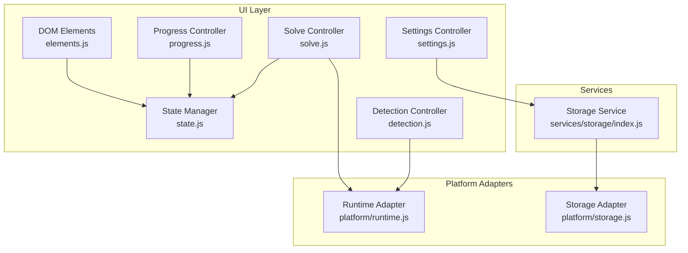
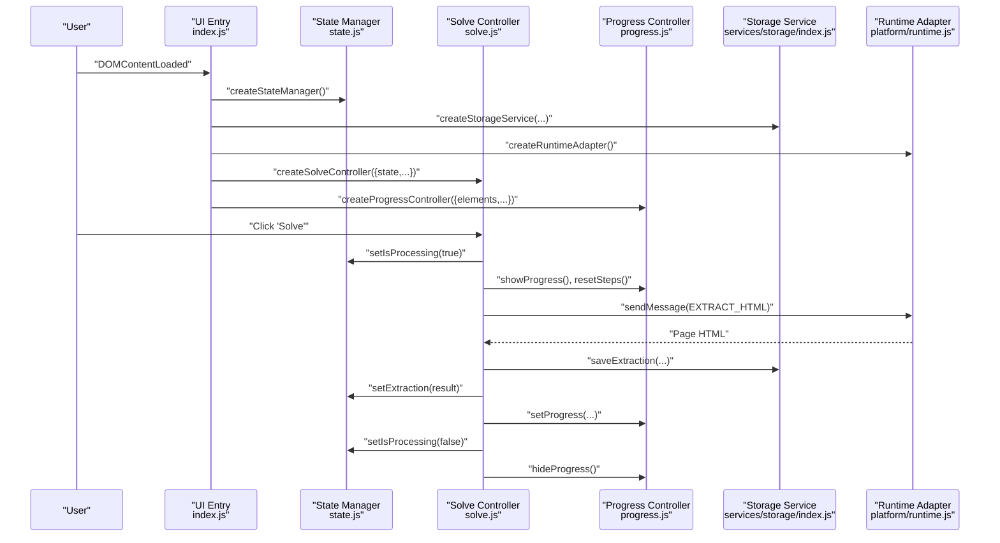
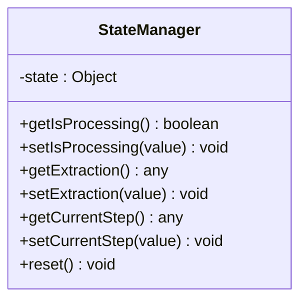
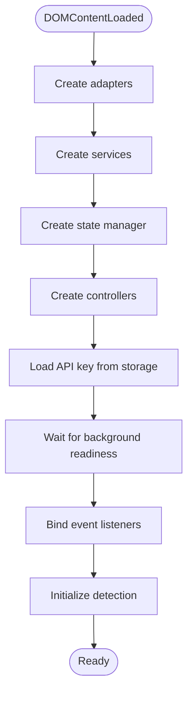
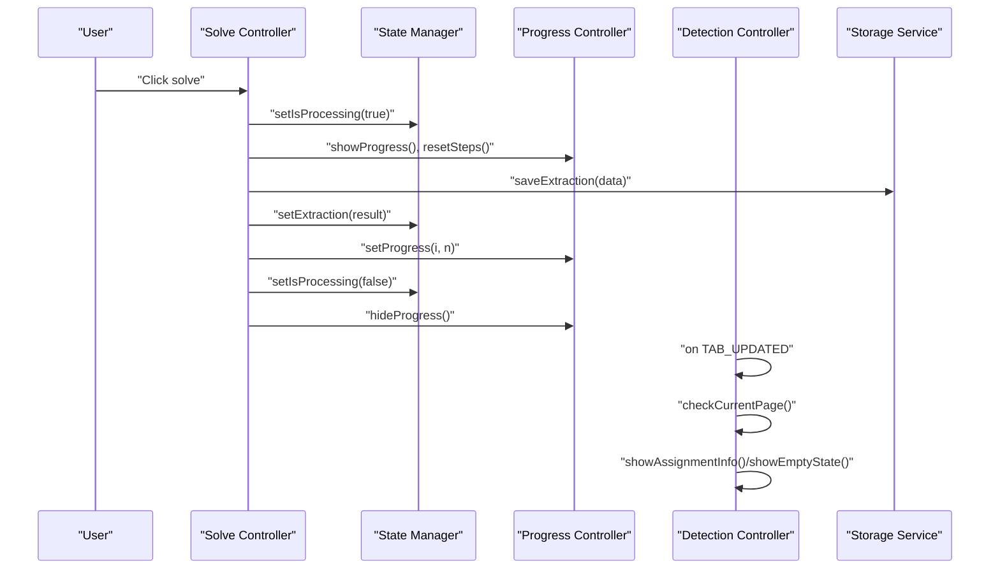
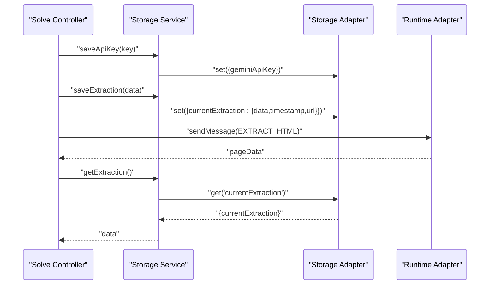
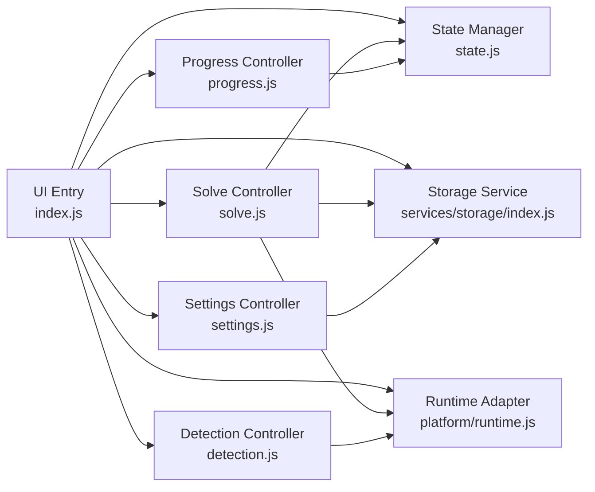

# State Management

<cite>
**Referenced Files in This Document**
- [state.js](file://assignment-solver/src/ui/state.js)
- [index.js](file://assignment-solver/src/ui/index.js)
- [solve.js](file://assignment-solver/src/ui/controllers/solve.js)
- [progress.js](file://assignment-solver/src/ui/controllers/progress.js)
- [settings.js](file://assignment-solver/src/ui/controllers/settings.js)
- [detection.js](file://assignment-solver/src/ui/controllers/detection.js)
- [elements.js](file://assignment-solver/src/ui/elements.js)
- [storage.js](file://assignment-solver/src/services/storage/index.js)
- [runtime.js](file://assignment-solver/src/platform/runtime.js)
- [storage_adapter.js](file://assignment-solver/src/platform/storage.js)
</cite>

## Table of Contents
1. [Introduction](#introduction)
2. [Project Structure](#project-structure)
3. [Core Components](#core-components)
4. [Architecture Overview](#architecture-overview)
5. [Detailed Component Analysis](#detailed-component-analysis)
6. [Dependency Analysis](#dependency-analysis)
7. [Performance Considerations](#performance-considerations)
8. [Troubleshooting Guide](#troubleshooting-guide)
9. [Conclusion](#conclusion)

## Introduction
This document explains the state management system used in the assignment-solver UI. It covers the global state architecture, reactive updates, and persistence mechanisms. It documents the state manager factory, initialization patterns, and update triggers. It also describes how state changes propagate to UI components to drive re-renders, and how the system integrates with external data sources such as browser storage and the extension runtime. Finally, it provides guidance on mutation patterns, observer-style updates, synchronization with external systems, persistence strategies, memory management, and performance considerations for state-heavy applications.

## Project Structure
The state management lives in the assignment-solver UI module. The primary state container is created in a dedicated module and consumed by controllers that orchestrate user interactions, progress updates, settings, and detection. Persistence is handled by a storage service backed by a browser storage adapter. Communication with the extension runtime is abstracted behind a runtime adapter.

**Diagram sources**
- [state.js](file://assignment-solver/src/ui/state.js#L9-L40)
- [elements.js](file://assignment-solver/src/ui/elements.js#L9-L45)
- [progress.js](file://assignment-solver/src/ui/controllers/progress.js#L12-L163)
- [settings.js](file://assignment-solver/src/ui/controllers/settings.js#L13-L127)
- [detection.js](file://assignment-solver/src/ui/controllers/detection.js#L15-L110)
- [solve.js](file://assignment-solver/src/ui/controllers/solve.js#L21-L30)
- [storage.js](file://assignment-solver/src/services/storage/index.js#L12-L118)
- [runtime.js](file://assignment-solver/src/platform/runtime.js#L12-L31)
- [storage_adapter.js](file://assignment-solver/src/platform/storage.js#L12-L41)

**Section sources**
- [state.js](file://assignment-solver/src/ui/state.js#L1-L41)
- [index.js](file://assignment-solver/src/ui/index.js#L54-L112)

## Core Components
- State Manager Factory: Creates a private state object and exposes typed getters/setters plus a reset method. This is the single source of truth for UI state.
- Controllers: Encapsulate UI logic and side effects. They mutate state via the state manager and update the DOM through the elements registry.
- Elements Registry: Centralized access to DOM nodes used by controllers.
- Storage Service: Provides persistence for API keys, model preferences, cached extractions, and user answers.
- Platform Adapters: Abstract browser APIs for runtime messaging and storage.

Key responsibilities:
- State Manager: Immutable-like updates via setters; no direct DOM manipulation.
- Controllers: Orchestrate flows, update progress, and mutate state.
- Elements: Provide DOM handles; controllers update attributes/classes/textContent.
- Storage: Persist and retrieve structured data with timestamps and metadata.
- Adapters: Enable cross-browser compatibility and testability.

**Section sources**
- [state.js](file://assignment-solver/src/ui/state.js#L9-L40)
- [elements.js](file://assignment-solver/src/ui/elements.js#L9-L45)
- [storage.js](file://assignment-solver/src/services/storage/index.js#L12-L118)
- [runtime.js](file://assignment-solver/src/platform/runtime.js#L12-L31)
- [storage_adapter.js](file://assignment-solver/src/platform/storage.js#L12-L41)

## Architecture Overview
The system follows a unidirectional data flow:
- Initialization: The UI entry point creates adapters, services, state, and controllers. It wires event listeners and starts detection.
- Mutations: Controllers call state setters and storage methods to change state and persist data.
- Re-rendering: Controllers update DOM nodes directly based on state and progress. There is no framework-level re-render mechanism; DOM updates are imperative.
- External synchronization: Runtime adapter sends messages to background scripts; storage adapter persists/retrieves data.

**Diagram sources**
- [index.js](file://assignment-solver/src/ui/index.js#L54-L112)
- [state.js](file://assignment-solver/src/ui/state.js#L9-L40)
- [solve.js](file://assignment-solver/src/ui/controllers/solve.js#L44-L240)
- [progress.js](file://assignment-solver/src/ui/controllers/progress.js#L140-L161)
- [storage.js](file://assignment-solver/src/services/storage/index.js#L32-L51)
- [runtime.js](file://assignment-solver/src/platform/runtime.js#L19-L21)

## Detailed Component Analysis

### State Manager Factory
The state manager is a factory that returns a small API over a private state object. It exposes:
- Getters for isProcessing, extraction, and currentStep
- Setters for the same fields
- A reset method that reinitializes the state to defaults

Implementation pattern:
- Private state object holds UI state
- Public methods mutate the private state
- No external mutation of the state object occurs outside the factory

**Diagram sources**
- [state.js](file://assignment-solver/src/ui/state.js#L9-L40)

**Section sources**
- [state.js](file://assignment-solver/src/ui/state.js#L9-L40)

### State Initialization Patterns
Initialization occurs in the UI entry point:
- Create adapters (storage and runtime)
- Create services (storage and Gemini)
- Create state manager
- Create controllers (progress, settings, solve, detection)
- Load persisted API key into UI
- Wait for background readiness
- Wire event listeners and start detection

**Diagram sources**
- [index.js](file://assignment-solver/src/ui/index.js#L54-L112)

**Section sources**
- [index.js](file://assignment-solver/src/ui/index.js#L54-L112)

### State Update Triggers and Propagation
State updates are triggered by:
- User actions (solve button click)
- Background messages (tab updates)
- Settings saves

Propagation:
- Controllers mutate state via setters
- Controllers update DOM directly (no framework re-render)
- Progress controller updates status bars, steps, and progress bars
- Detection controller toggles visibility based on page info
- Settings controller reads/writes storage and updates UI fields

**Diagram sources**
- [solve.js](file://assignment-solver/src/ui/controllers/solve.js#L44-L240)
- [progress.js](file://assignment-solver/src/ui/controllers/progress.js#L140-L161)
- [detection.js](file://assignment-solver/src/ui/controllers/detection.js#L95-L108)
- [storage.js](file://assignment-solver/src/services/storage/index.js#L32-L51)
- [state.js](file://assignment-solver/src/ui/state.js#L18-L30)

**Section sources**
- [solve.js](file://assignment-solver/src/ui/controllers/solve.js#L44-L240)
- [progress.js](file://assignment-solver/src/ui/controllers/progress.js#L140-L161)
- [detection.js](file://assignment-solver/src/ui/controllers/detection.js#L95-L108)

### State Observers and Reactivity
There is no explicit observer pattern. Reactivity is achieved by:
- Direct DOM updates in controllers
- State setters that replace the internal state object reference
- Event-driven updates from runtime messages

Controllers observe state changes indirectly by:
- Reading state via getters
- Updating UI based on state transitions
- Listening to runtime events to refresh UI state

**Section sources**
- [progress.js](file://assignment-solver/src/ui/controllers/progress.js#L21-L51)
- [detection.js](file://assignment-solver/src/ui/controllers/detection.js#L102-L107)

### State Mutations
Common mutation patterns:
- Toggle processing flag: setIsProcessing(true/false)
- Replace extraction payload: setExtraction(result)
- Update current step: setCurrentStep(step)
- Reset state: reset()

These mutations are performed by controllers in response to user actions or external events.

**Section sources**
- [state.js](file://assignment-solver/src/ui/state.js#L18-L30)
- [solve.js](file://assignment-solver/src/ui/controllers/solve.js#L56-L180)

### State Synchronization with External Data Sources
- Storage synchronization:
  - Save API key and preferences via storage service
  - Cache extractions with timestamps and URL metadata
  - Retrieve and clear cached data as needed
- Runtime synchronization:
  - Send messages to background scripts for page extraction, screenshots, answer application, and submission
  - Listen for tab updates to refresh detection UI

**Diagram sources**
- [storage.js](file://assignment-solver/src/services/storage/index.js#L17-L51)
- [storage_adapter.js](file://assignment-solver/src/platform/storage.js#L19-L39)
- [solve.js](file://assignment-solver/src/ui/controllers/solve.js#L569-L583)

**Section sources**
- [storage.js](file://assignment-solver/src/services/storage/index.js#L17-L51)
- [storage_adapter.js](file://assignment-solver/src/platform/storage.js#L19-L39)
- [solve.js](file://assignment-solver/src/ui/controllers/solve.js#L569-L583)

### State Persistence Strategies
- API key and preferences: stored under dedicated keys with defaults when missing
- Extraction cache: stores last extraction with URL and timestamp for quick retrieval
- User answers: stored separately and combined with extractions for export
- Export formats: answer-only export merges extraction and answers

Best practices:
- Always check for existence before reading from storage
- Clear caches when appropriate (e.g., after submission)
- Use structured keys to avoid collisions

**Section sources**
- [storage.js](file://assignment-solver/src/services/storage/index.js#L17-L116)

## Dependency Analysis
The UI entry point composes all collaborators and passes them to controllers. Controllers depend on:
- State manager for UI state
- Storage service for persistence
- Runtime adapter for messaging
- Elements registry for DOM access

**Diagram sources**
- [index.js](file://assignment-solver/src/ui/index.js#L54-L112)
- [state.js](file://assignment-solver/src/ui/state.js#L9-L40)
- [storage.js](file://assignment-solver/src/services/storage/index.js#L12-L118)
- [runtime.js](file://assignment-solver/src/platform/runtime.js#L12-L31)
- [progress.js](file://assignment-solver/src/ui/controllers/progress.js#L12-L163)
- [settings.js](file://assignment-solver/src/ui/controllers/settings.js#L13-L127)
- [detection.js](file://assignment-solver/src/ui/controllers/detection.js#L15-L110)

**Section sources**
- [index.js](file://assignment-solver/src/ui/index.js#L54-L112)

## Performance Considerations
- Minimize DOM updates: Controllers update DOM directly; batch related updates (e.g., progress count and fill width) together.
- Debounce or throttle frequent UI updates: For long-running loops (e.g., filling answers), consider increasing delays slightly to reduce churn.
- Avoid unnecessary state churn: Only call setters when values change to prevent redundant UI work.
- Cache and reuse DOM nodes: Elements registry centralizes DOM access to avoid repeated queries.
- Favor immutable-like updates: State manager replaces the state object reference on change, simplifying change detection and avoiding accidental shared mutable state.
- Memory management:
  - Clear caches (e.g., extraction) when no longer needed
  - Remove event listeners when components unmount (implicit via controller lifecycle)
  - Avoid retaining large payloads in state beyond their lifetime
- External calls:
  - Use retry helpers for runtime messages
  - Limit concurrent heavy operations (e.g., screenshot capture)

[No sources needed since this section provides general guidance]

## Troubleshooting Guide
Common issues and remedies:
- Background not ready: The UI waits for a readiness signal before proceeding. If it fails, the app continues with warnings. Verify background script availability and message routing.
- API key missing: The solve flow checks for an API key and prompts the settings controller if absent.
- MAX_TOKENS errors: The solve controller splits HTML or questions recursively until successful or depth limit reached. Review model preferences and consider reducing input size.
- Extraction failures: Ensure the page is an assignment page; verify extraction results and debug payloads sent to the background.
- Progress stuck: Ensure progress controller steps are marked done and progress is reset appropriately.

**Section sources**
- [index.js](file://assignment-solver/src/ui/index.js#L26-L51)
- [solve.js](file://assignment-solver/src/ui/controllers/solve.js#L50-L54)
- [solve.js](file://assignment-solver/src/ui/controllers/solve.js#L276-L285)
- [solve.js](file://assignment-solver/src/ui/controllers/solve.js#L503-L516)

## Conclusion
The assignment-solver UI employs a minimal, explicit state management approach:
- A factory-created state manager encapsulates UI state with typed setters/getters
- Controllers orchestrate flows, mutate state, and update the DOM directly
- Persistence is handled by a storage service backed by a browser storage adapter
- Runtime communication is abstracted via a runtime adapter
- There is no framework-level re-render; UI updates are imperative and efficient

This design keeps state changes predictable, reduces boilerplate, and enables straightforward testing and debugging. For state-heavy applications, adopt the patterns here: centralized state via factories, imperative DOM updates, robust persistence, and adapter-based external integrations.