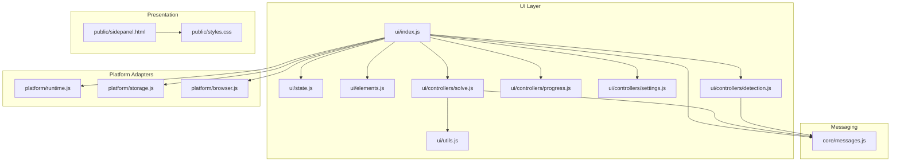
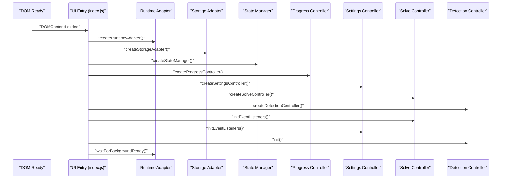
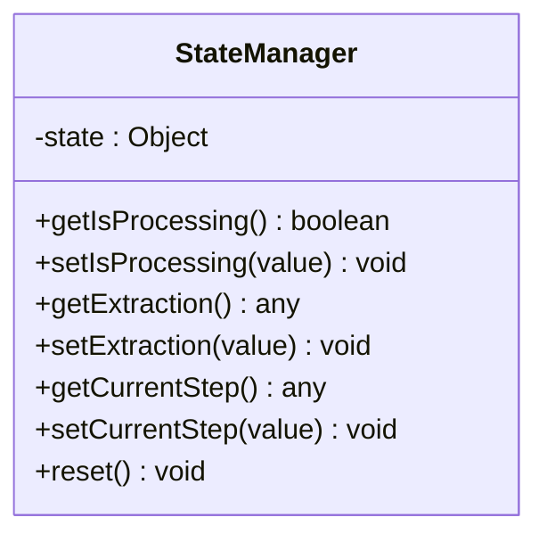
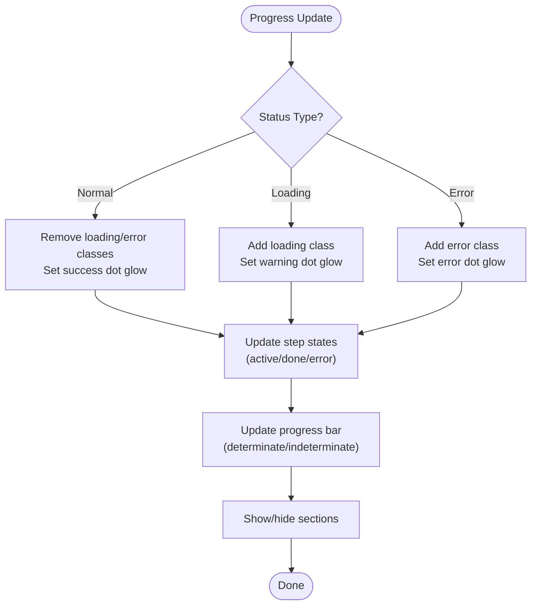
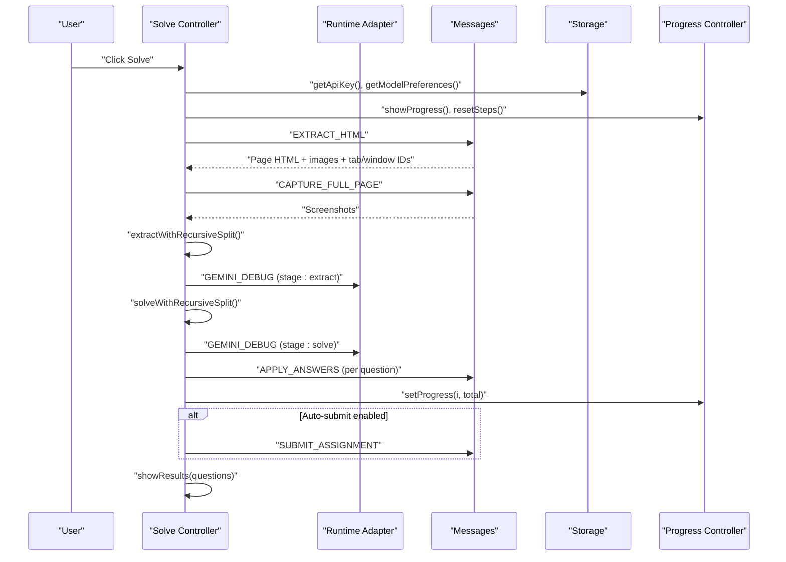
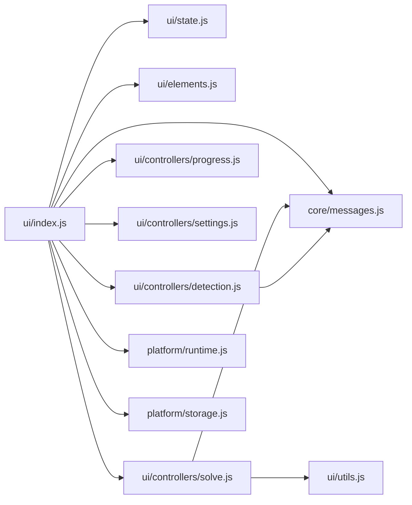

# UI Components

<cite>
**Referenced Files in This Document**
- [state.js](file://assignment-solver/src/ui/state.js)
- [index.js](file://assignment-solver/src/ui/index.js)
- [elements.js](file://assignment-solver/src/ui/elements.js)
- [utils.js](file://assignment-solver/src/ui/utils.js)
- [detection.js](file://assignment-solver/src/ui/controllers/detection.js)
- [progress.js](file://assignment-solver/src/ui/controllers/progress.js)
- [settings.js](file://assignment-solver/src/ui/controllers/settings.js)
- [solve.js](file://assignment-solver/src/ui/controllers/solve.js)
- [sidepanel.html](file://assignment-solver/public/sidepanel.html)
- [styles.css](file://assignment-solver/public/styles.css)
- [messages.js](file://assignment-solver/src/core/messages.js)
- [runtime.js](file://assignment-solver/src/platform/runtime.js)
- [storage.js](file://assignment-solver/src/platform/storage.js)
- [browser.js](file://assignment-solver/src/platform/browser.js)
</cite>

## Table of Contents
1. [Introduction](#introduction)
2. [Project Structure](#project-structure)
3. [Core Components](#core-components)
4. [Architecture Overview](#architecture-overview)
5. [Detailed Component Analysis](#detailed-component-analysis)
6. [Dependency Analysis](#dependency-analysis)
7. [Performance Considerations](#performance-considerations)
8. [Troubleshooting Guide](#troubleshooting-guide)
9. [Conclusion](#conclusion)

## Introduction
This document describes the user interface components of the assignment solver extension. It covers the state management system, UI controllers for detection, progress tracking, settings, and solving operations, the UI element library and styling approach, and the integration with the extension’s message system. The goal is to help developers understand how the side panel UI initializes, updates reactively, persists settings, and coordinates with background and content scripts.

## Project Structure
The UI layer is organized under the assignment-solver extension’s src/ui directory. It includes:
- State management: a simple reactive state manager
- UI element bindings: centralized DOM element accessors
- Controllers: modular UI logic for detection, progress, settings, and solving
- Utilities: helper functions for UI tasks
- HTML template and CSS: the side panel markup and styling
- Platform adapters: runtime and storage adapters for cross-browser compatibility
- Messaging: message types and retry logic for robust communication

**Diagram sources**
- [index.js](file://assignment-solver/src/ui/index.js#L1-L113)
- [state.js](file://assignment-solver/src/ui/state.js#L1-L41)
- [elements.js](file://assignment-solver/src/ui/elements.js#L1-L46)
- [utils.js](file://assignment-solver/src/ui/utils.js#L1-L29)
- [detection.js](file://assignment-solver/src/ui/controllers/detection.js#L1-L111)
- [progress.js](file://assignment-solver/src/ui/controllers/progress.js#L1-L164)
- [settings.js](file://assignment-solver/src/ui/controllers/settings.js#L1-L128)
- [solve.js](file://assignment-solver/src/ui/controllers/solve.js#L1-L778)
- [runtime.js](file://assignment-solver/src/platform/runtime.js#L1-L32)
- [storage.js](file://assignment-solver/src/platform/storage.js#L1-L42)
- [browser.js](file://assignment-solver/src/platform/browser.js#L1-L86)
- [messages.js](file://assignment-solver/src/core/messages.js#L1-L96)
- [sidepanel.html](file://assignment-solver/public/sidepanel.html#L1-L392)
- [styles.css](file://assignment-solver/public/styles.css#L1-L1582)

**Section sources**
- [index.js](file://assignment-solver/src/ui/index.js#L1-L113)
- [sidepanel.html](file://assignment-solver/public/sidepanel.html#L1-L392)
- [styles.css](file://assignment-solver/public/styles.css#L1-L1582)

## Core Components
- Global state manager: a lightweight reactive store holding processing state, extraction results, and current step.
- Element registry: a single accessor for all DOM elements used by controllers.
- Utility functions: HTML escaping and question type formatting.
- Controllers: modular UI logic for detection, progress display, settings modal, and solve flow.
- Messaging and platform adapters: cross-browser compatible runtime and storage APIs with retry logic.

Key responsibilities:
- State management: centralizes reactive updates and resets.
- Element binding: ensures controllers operate on consistent DOM references.
- Controllers: encapsulate UI logic and coordinate with services and messaging.
- Styling: CSS custom properties and semantic classes drive theme and animations.

**Section sources**
- [state.js](file://assignment-solver/src/ui/state.js#L1-L41)
- [elements.js](file://assignment-solver/src/ui/elements.js#L1-L46)
- [utils.js](file://assignment-solver/src/ui/utils.js#L1-L29)
- [progress.js](file://assignment-solver/src/ui/controllers/progress.js#L1-L164)
- [settings.js](file://assignment-solver/src/ui/controllers/settings.js#L1-L128)
- [solve.js](file://assignment-solver/src/ui/controllers/solve.js#L1-L778)
- [messages.js](file://assignment-solver/src/core/messages.js#L1-L96)
- [runtime.js](file://assignment-solver/src/platform/runtime.js#L1-L32)
- [storage.js](file://assignment-solver/src/platform/storage.js#L1-L42)
- [browser.js](file://assignment-solver/src/platform/browser.js#L1-L86)

## Architecture Overview
The side panel initializes on DOMContentLoaded, constructs adapters and services, wires up controllers, and listens for tab updates. The solve flow integrates with content and background scripts via a unified message bus with retry logic. Progress and results are rendered reactively through dedicated controllers.

**Diagram sources**
- [index.js](file://assignment-solver/src/ui/index.js#L54-L112)
- [runtime.js](file://assignment-solver/src/platform/runtime.js#L12-L31)
- [storage.js](file://assignment-solver/src/platform/storage.js#L12-L41)
- [state.js](file://assignment-solver/src/ui/state.js#L9-L40)
- [progress.js](file://assignment-solver/src/ui/controllers/progress.js#L12-L163)
- [settings.js](file://assignment-solver/src/ui/controllers/settings.js#L13-L127)
- [solve.js](file://assignment-solver/src/ui/controllers/solve.js#L21-L79)
- [detection.js](file://assignment-solver/src/ui/controllers/detection.js#L15-L109)

## Detailed Component Analysis

### State Management
The state manager exposes getters/setters for:
- isProcessing: prevents concurrent operations
- extraction: stores the latest extraction result
- currentStep: tracks the active step in the solve pipeline

It also supports reset to initial values.

**Diagram sources**
- [state.js](file://assignment-solver/src/ui/state.js#L9-L40)

**Section sources**
- [state.js](file://assignment-solver/src/ui/state.js#L1-L41)

### UI Element Library and Bindings
The element registry consolidates access to all DOM nodes used by controllers. It returns references to:
- Status bar and text
- Solve button and auto-submit toggle
- Progress section, title, count, fill, and steps
- Results section, count, and list
- Empty state container
- Assignment info and metadata
- Settings modal and form controls
- Loading overlay and text

Controllers use these references to update visibility, content, and styles.

**Section sources**
- [elements.js](file://assignment-solver/src/ui/elements.js#L1-L46)

### Progress Controller
Responsibilities:
- Update status bar text and type (normal/loading/error)
- Manage step indicators (active, done, error) via data attributes
- Control determinate and indeterminate progress bars
- Toggle visibility of progress and results sections

Usage patterns:
- setStatus(message, type) for status updates
- setStep(stepName, status) and markStepDone(stepName) for step tracking
- setProgress(current, total) and resetProgress(total) for determinate progress
- setIndeterminate() for indeterminate progress
- showProgress()/hideProgress() to switch views

**Diagram sources**
- [progress.js](file://assignment-solver/src/ui/controllers/progress.js#L21-L162)

**Section sources**
- [progress.js](file://assignment-solver/src/ui/controllers/progress.js#L1-L164)

### Settings Controller
Responsibilities:
- Load and populate settings modal with stored API key and model preferences
- Persist settings to storage
- Initialize event listeners for modal open/close and save actions
- Reflect reasoning level changes in UI labels

Integration points:
- Storage adapter for get/save API key and model preferences
- Elements registry for modal and form controls

**Section sources**
- [settings.js](file://assignment-solver/src/ui/controllers/settings.js#L1-L128)
- [elements.js](file://assignment-solver/src/ui/elements.js#L30-L44)

### Detection Controller
Responsibilities:
- Check current page for assignments via messaging
- Show assignment info or empty state based on detection
- Listen for tab updates and re-check automatically

Behavior:
- Sends GET_PAGE_INFO and handles response
- Updates DOM to show/hide empty state and assignment info
- Listens to runtime.onMessage for TAB_UPDATED events

**Section sources**
- [detection.js](file://assignment-solver/src/ui/controllers/detection.js#L1-L111)
- [messages.js](file://assignment-solver/src/core/messages.js#L5-L23)

### Solve Controller
Responsibilities:
- Orchestrate the end-to-end solve flow
- Manage state (isProcessing), UI progress, and results
- Integrate with content/background scripts via messaging
- Handle recursive splitting for token limits

Key workflows:
- handleSolve(): validates prerequisites, sets up UI, and runs extraction, solving, filling, and optional submission
- extractWithRecursiveSplit(): splits HTML on token limits and merges results
- solveWithRecursiveSplit(): splits question sets on token limits and merges results
- fillAllAnswers(): applies answers one by one with progress updates
- submitAssignment(): triggers submission when enabled

**Diagram sources**
- [solve.js](file://assignment-solver/src/ui/controllers/solve.js#L44-L240)
- [messages.js](file://assignment-solver/src/core/messages.js#L14-L22)
- [progress.js](file://assignment-solver/src/ui/controllers/progress.js#L98-L162)

**Section sources**
- [solve.js](file://assignment-solver/src/ui/controllers/solve.js#L1-L778)

### UI Utilities
- escapeHtml(): safely escapes text for insertion into innerHTML
- formatQuestionType(): maps internal types to display-friendly labels

**Section sources**
- [utils.js](file://assignment-solver/src/ui/utils.js#L1-L29)

### Styling Approach
The UI uses a dark theme with amber accents and a clean, readable typography system. Styling is driven by:
- CSS custom properties for theme tokens (colors, spacing, radii, easing)
- Semantic classes for state and behavior (loading, error, hidden, flex)
- Animations for status dots, progress bars, and step pulses
- Responsive layout with flex containers and scrollable regions

Key areas:
- Status bar with animated dot and state classes
- Progress timeline with active/done/error step indicators
- Results cards with confidence badges and correct answer highlighting
- Settings modal with model picker and reasoning badges
- Loading overlay and spinner

**Section sources**
- [styles.css](file://assignment-solver/public/styles.css#L1-L1582)
- [sidepanel.html](file://assignment-solver/public/sidepanel.html#L1-L392)

## Dependency Analysis
The UI entry point composes all components and wires them together. It depends on platform adapters for runtime and storage, and on messaging for cross-script communication. Controllers depend on shared utilities and the state manager.

**Diagram sources**
- [index.js](file://assignment-solver/src/ui/index.js#L1-L113)
- [solve.js](file://assignment-solver/src/ui/controllers/solve.js#L1-L31)
- [detection.js](file://assignment-solver/src/ui/controllers/detection.js#L1-L19)
- [messages.js](file://assignment-solver/src/core/messages.js#L1-L96)
- [runtime.js](file://assignment-solver/src/platform/runtime.js#L1-L32)
- [storage.js](file://assignment-solver/src/platform/storage.js#L1-L42)

**Section sources**
- [index.js](file://assignment-solver/src/ui/index.js#L1-L113)
- [runtime.js](file://assignment-solver/src/platform/runtime.js#L1-L32)
- [storage.js](file://assignment-solver/src/platform/storage.js#L1-L42)
- [messages.js](file://assignment-solver/src/core/messages.js#L1-L96)

## Performance Considerations
- Indeterminate progress: use setIndeterminate() during long-running AI operations to avoid misleading counts.
- Token limit handling: recursive splitting reduces payload sizes; monitor depth to prevent excessive retries.
- Batch operations: apply answers one-by-one with small delays to avoid overwhelming the page.
- Debounce or throttle UI updates to reduce reflows during rapid progress changes.
- Cross-browser reliability: use sendMessageWithRetry for transient connection failures, especially in Firefox.

## Troubleshooting Guide
Common issues and remedies:
- Background script readiness: the UI waits for a PING response; if unavailable, initialization continues with warnings. Verify extension reload and background script health.
- API key missing: the solve flow prompts the settings modal when missing; ensure the key is saved and visible in the input.
- Max token errors: the solve flow splits HTML or question sets recursively; if depth limit reached, inspect extraction content and consider reducing batch sizes.
- Tab switching: the solve flow pins the target tab ID early to keep operations scoped; ensure the original tab remains active.
- Message communication failures: sendMessageWithRetry handles transient errors; check logs for “Receiving end does not exist” or similar and reload the extension.

**Section sources**
- [index.js](file://assignment-solver/src/ui/index.js#L26-L51)
- [solve.js](file://assignment-solver/src/ui/controllers/solve.js#L44-L54)
- [solve.js](file://assignment-solver/src/ui/controllers/solve.js#L276-L298)
- [messages.js](file://assignment-solver/src/core/messages.js#L47-L95)

## Conclusion
The UI layer is structured around a clear separation of concerns: a minimal state manager, centralized element bindings, modular controllers, and a robust messaging system with retry logic. The styling system emphasizes clarity and feedback, with reactive updates driving user confidence. Together, these components deliver a responsive, cross-browser compatible side panel for assignment solving.