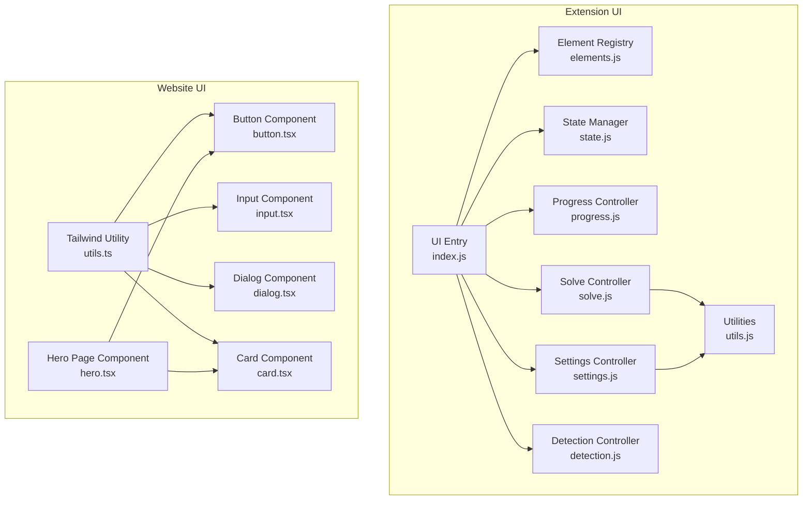
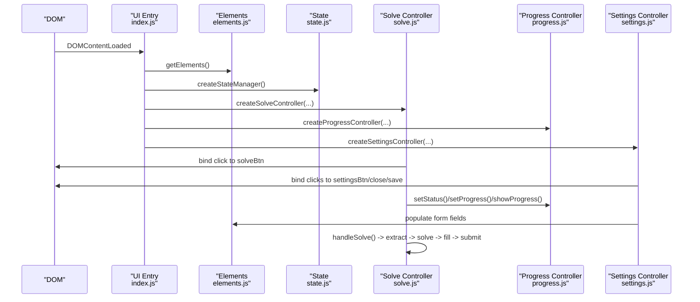
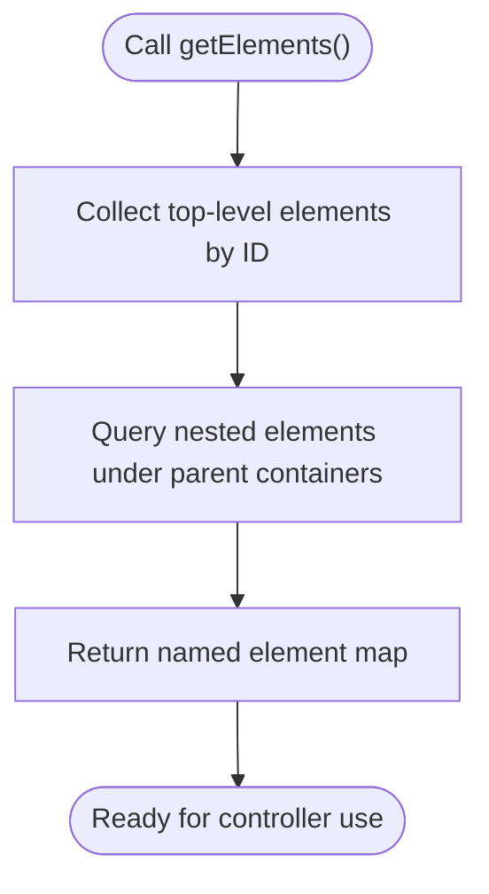
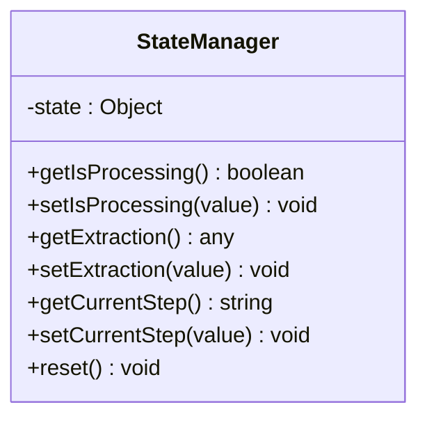
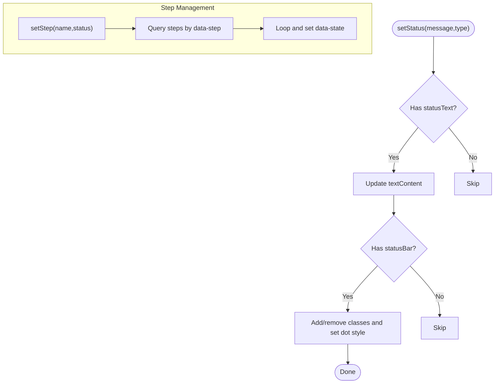
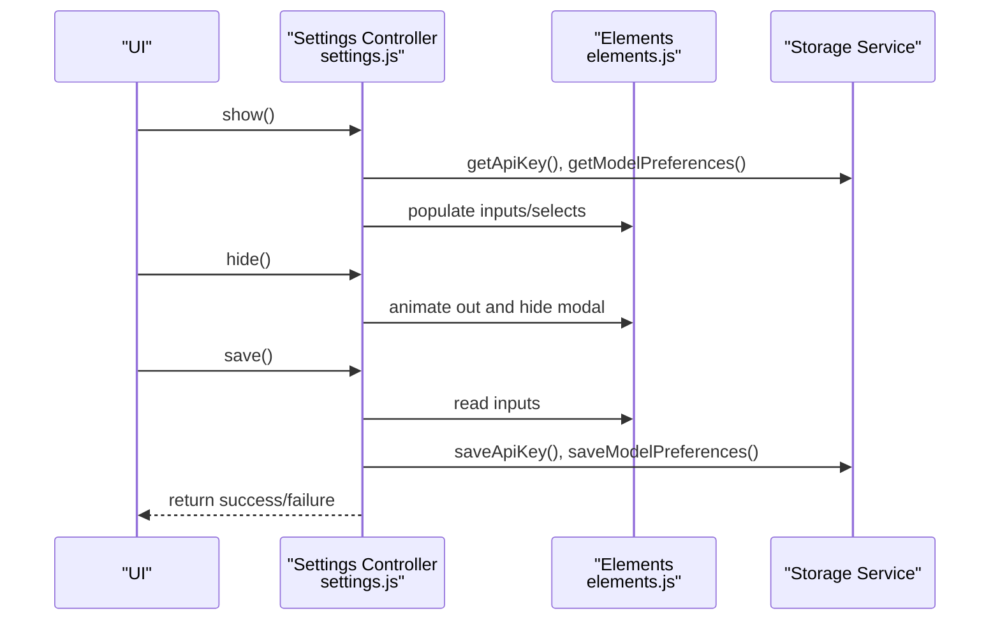
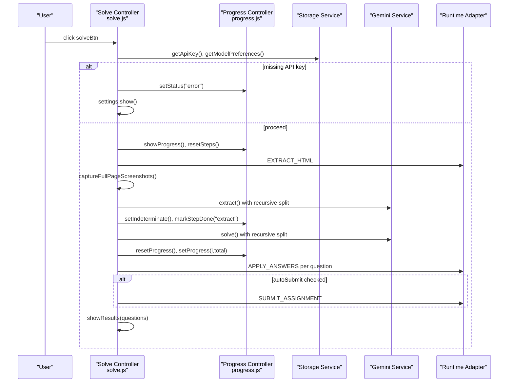
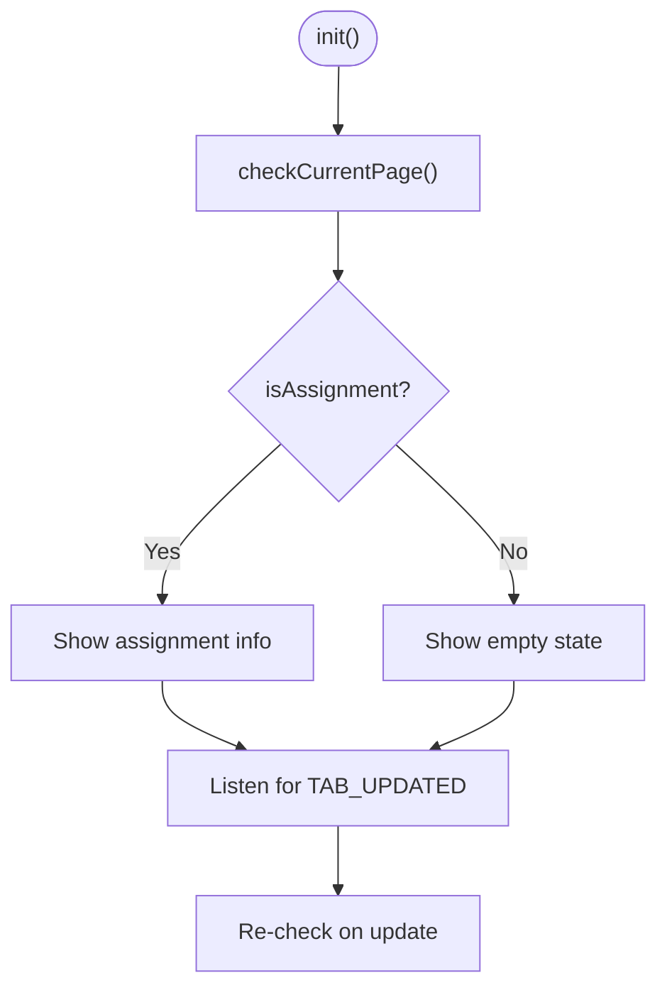
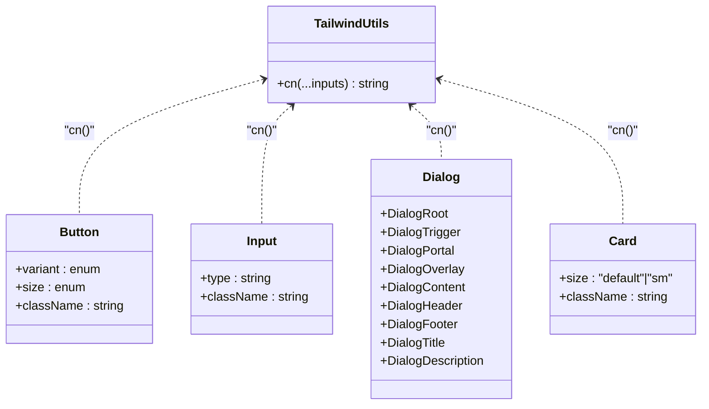
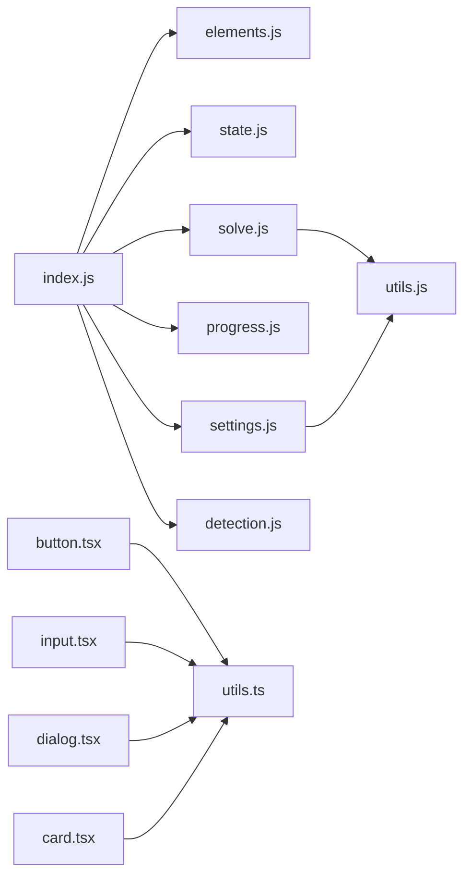

# UI Elements Library

<cite>
**Referenced Files in This Document**
- [elements.js](file://assignment-solver/src/ui/elements.js)
- [index.js](file://assignment-solver/src/ui/index.js)
- [state.js](file://assignment-solver/src/ui/state.js)
- [progress.js](file://assignment-solver/src/ui/controllers/progress.js)
- [settings.js](file://assignment-solver/src/ui/controllers/settings.js)
- [solve.js](file://assignment-solver/src/ui/controllers/solve.js)
- [detection.js](file://assignment-solver/src/ui/controllers/detection.js)
- [utils.js](file://assignment-solver/src/ui/utils.js)
- [utils.ts](file://website/lib/utils.ts)
- [button.tsx](file://website/components/ui/button.tsx)
- [input.tsx](file://website/components/ui/input.tsx)
- [dialog.tsx](file://website/components/ui/dialog.tsx)
- [card.tsx](file://website/components/ui/card.tsx)
- [hero.tsx](file://website/components/landing/hero.tsx)
</cite>

## Table of Contents
1. [Introduction](#introduction)
2. [Project Structure](#project-structure)
3. [Core Components](#core-components)
4. [Architecture Overview](#architecture-overview)
5. [Detailed Component Analysis](#detailed-component-analysis)
6. [Dependency Analysis](#dependency-analysis)
7. [Performance Considerations](#performance-considerations)
8. [Troubleshooting Guide](#troubleshooting-guide)
9. [Conclusion](#conclusion)
10. [Appendices](#appendices)

## Introduction
This document describes the UI elements library and utility functions across two distinct UI systems in the repository:
- A browser extension side panel UI built with vanilla JavaScript and a dependency injection pattern.
- A Next.js website UI built with React components and Tailwind CSS utility functions.

It explains the element factory pattern for DOM element acquisition, DOM selection strategies, component composition approaches, utility functions for UI helpers and event handling, styling and responsive design patterns, accessibility considerations, examples of element creation and dynamic UI updates, error handling, performance optimization, and cross-browser compatibility strategies.

## Project Structure
The UI systems are organized as follows:
- Browser extension side panel:
  - UI entry point initializes controllers and wiring.
  - Element registry centralizes DOM queries.
  - Controllers encapsulate UI logic and state.
  - Utilities provide escaping and formatting helpers.
- Website (Next.js):
  - Shared utility for Tailwind class merging.
  - Reusable React UI primitives (Button, Input, Dialog, Card).
  - Example page-level component demonstrating composition.

**Diagram sources**
- [index.js](file://assignment-solver/src/ui/index.js#L54-L112)
- [elements.js](file://assignment-solver/src/ui/elements.js#L9-L45)
- [state.js](file://assignment-solver/src/ui/state.js#L9-L40)
- [progress.js](file://assignment-solver/src/ui/controllers/progress.js#L12-L163)
- [settings.js](file://assignment-solver/src/ui/controllers/settings.js#L13-L127)
- [solve.js](file://assignment-solver/src/ui/controllers/solve.js#L21-L777)
- [detection.js](file://assignment-solver/src/ui/controllers/detection.js#L15-L110)
- [utils.js](file://assignment-solver/src/ui/utils.js#L10-L28)
- [utils.ts](file://website/lib/utils.ts#L4-L6)
- [button.tsx](file://website/components/ui/button.tsx#L8-L36)
- [input.tsx](file://website/components/ui/input.tsx#L6-L18)
- [dialog.tsx](file://website/components/ui/dialog.tsx#L10-L78)
- [card.tsx](file://website/components/ui/card.tsx#L5-L84)
- [hero.tsx](file://website/components/landing/hero.tsx#L8-L92)

**Section sources**
- [index.js](file://assignment-solver/src/ui/index.js#L54-L112)
- [elements.js](file://assignment-solver/src/ui/elements.js#L9-L45)
- [utils.ts](file://website/lib/utils.ts#L4-L6)

## Core Components
- Element factory pattern: Centralized DOM retrieval via a single function returning a map of element references. This improves maintainability and testability by isolating DOM queries.
- State manager: Encapsulated state with getters/setters and reset capability, enabling predictable UI state transitions.
- Controller factory pattern: Each controller exposes initialization and lifecycle methods, promoting separation of concerns and DI-friendly wiring.
- Utilities:
  - HTML escaping for safe innerHTML insertion.
  - Question type formatting for display.
  - Tailwind class merging utility for React components.

Examples of element creation and dynamic updates are covered in the detailed component analysis.

**Section sources**
- [elements.js](file://assignment-solver/src/ui/elements.js#L9-L45)
- [state.js](file://assignment-solver/src/ui/state.js#L9-L40)
- [utils.js](file://assignment-solver/src/ui/utils.js#L10-L28)
- [utils.ts](file://website/lib/utils.ts#L4-L6)

## Architecture Overview
The extension UI follows a dependency injection pattern:
- UI entry initializes adapters, services, state, and controllers.
- Controllers receive shared dependencies (elements, state, storage, runtime, logger).
- Event listeners are bound in controller initialization methods.
- Controllers update the DOM via the element registry and manage progress/status.

**Diagram sources**
- [index.js](file://assignment-solver/src/ui/index.js#L54-L112)
- [elements.js](file://assignment-solver/src/ui/elements.js#L9-L45)
- [state.js](file://assignment-solver/src/ui/state.js#L9-L40)
- [progress.js](file://assignment-solver/src/ui/controllers/progress.js#L12-L163)
- [settings.js](file://assignment-solver/src/ui/controllers/settings.js#L13-L127)
- [solve.js](file://assignment-solver/src/ui/controllers/solve.js#L21-L240)

## Detailed Component Analysis

### Element Factory Pattern and DOM Selection Strategies
- Centralized element retrieval: All DOM queries are consolidated in a single function returning a named map of elements. This reduces duplication and makes refactoring easier.
- Safe nested queries: Uses chained getElementById and querySelector to access nested nodes (e.g., status text inside status bar).
- Modal and form elements: Captures inputs, selects, and buttons for settings and progress UI.
- Selection strategies:
  - Prefer getElementById for unique identifiers.
  - Use querySelector for scoped children to avoid global conflicts.
  - Guard against missing elements to prevent runtime errors.

**Diagram sources**
- [elements.js](file://assignment-solver/src/ui/elements.js#L9-L45)

**Section sources**
- [elements.js](file://assignment-solver/src/ui/elements.js#L9-L45)

### State Management
- Encapsulated state with explicit getters/setters and reset.
- Tracks processing flag, extraction object, and current step.
- Used by controllers to coordinate UI updates and guard concurrent operations.

**Diagram sources**
- [state.js](file://assignment-solver/src/ui/state.js#L9-L40)

**Section sources**
- [state.js](file://assignment-solver/src/ui/state.js#L9-L40)

### Progress Controller
- Updates status bar text and styling based on status type (normal/loading/error).
- Manages step indicators via data attributes.
- Controls progress bar count, width, and determinate/indeterminate modes.
- Toggles visibility of progress/results/empty states.

**Diagram sources**
- [progress.js](file://assignment-solver/src/ui/controllers/progress.js#L21-L51)
- [progress.js](file://assignment-solver/src/ui/controllers/progress.js#L58-L68)

**Section sources**
- [progress.js](file://assignment-solver/src/ui/controllers/progress.js#L12-L163)

### Settings Controller
- Loads stored API key and model preferences into form controls.
- Shows/hides modal with transitions.
- Saves settings to storage and validates presence of required fields.
- Initializes event listeners for opening/closing and saving.

**Diagram sources**
- [settings.js](file://assignment-solver/src/ui/controllers/settings.js#L20-L67)
- [settings.js](file://assignment-solver/src/ui/controllers/settings.js#L73-L94)
- [settings.js](file://assignment-solver/src/ui/controllers/settings.js#L99-L125)
- [elements.js](file://assignment-solver/src/ui/elements.js#L9-L45)

**Section sources**
- [settings.js](file://assignment-solver/src/ui/controllers/settings.js#L13-L127)

### Solve Controller
- Orchestrates the end-to-end flow: extract HTML/screenshots, AI extraction, AI solving, filling answers, optional auto-submit, and results rendering.
- Implements recursive splitting on MAX_TOKENS errors to handle long inputs.
- Uses progress controller for status and progress updates.
- Utilizes utilities for HTML escaping and question type formatting.
- Relays debug info to background via messaging.

**Diagram sources**
- [solve.js](file://assignment-solver/src/ui/controllers/solve.js#L44-L240)
- [solve.js](file://assignment-solver/src/ui/controllers/solve.js#L252-L319)
- [solve.js](file://assignment-solver/src/ui/controllers/solve.js#L481-L544)
- [solve.js](file://assignment-solver/src/ui/controllers/solve.js#L618-L645)
- [solve.js](file://assignment-solver/src/ui/controllers/solve.js#L675-L775)

**Section sources**
- [solve.js](file://assignment-solver/src/ui/controllers/solve.js#L21-L777)

### Detection Controller
- Checks current page for assignments and toggles UI states accordingly.
- Listens for background tab update events to refresh detection.

**Diagram sources**
- [detection.js](file://assignment-solver/src/ui/controllers/detection.js#L95-L109)
- [detection.js](file://assignment-solver/src/ui/controllers/detection.js#L26-L44)

**Section sources**
- [detection.js](file://assignment-solver/src/ui/controllers/detection.js#L15-L110)

### Website UI Components and Utilities
- Tailwind utility: Merges and deduplicates Tailwind classes safely.
- Button component: Variants and sizes with Base UI primitive and class variance authority.
- Input component: Base UI input with consistent styling and accessibility props.
- Dialog component: Portal-backed overlay with optional close button and slots for header/footer/title/description.
- Card component: Flexible card with header/content/footer/title/action and size variants.
- Hero page component: Demonstrates composition of UI primitives and responsive layout.

**Diagram sources**
- [utils.ts](file://website/lib/utils.ts#L4-L6)
- [button.tsx](file://website/components/ui/button.tsx#L8-L36)
- [input.tsx](file://website/components/ui/input.tsx#L6-L18)
- [dialog.tsx](file://website/components/ui/dialog.tsx#L10-L78)
- [card.tsx](file://website/components/ui/card.tsx#L5-L84)

**Section sources**
- [utils.ts](file://website/lib/utils.ts#L4-L6)
- [button.tsx](file://website/components/ui/button.tsx#L8-L36)
- [input.tsx](file://website/components/ui/input.tsx#L6-L18)
- [dialog.tsx](file://website/components/ui/dialog.tsx#L10-L78)
- [card.tsx](file://website/components/ui/card.tsx#L5-L84)
- [hero.tsx](file://website/components/landing/hero.tsx#L8-L92)

### Utility Functions for UI Helpers
- HTML escaping: Prevents XSS when injecting dynamic text into the DOM.
- Question type formatting: Maps internal types to display-friendly abbreviations.

**Section sources**
- [utils.js](file://assignment-solver/src/ui/utils.js#L10-L28)

### Event Handling and User Interaction Management
- Event delegation and listener initialization are centralized in controller init methods.
- Modal interactions (open/close/save) are handled with clear separation of concerns.
- Dynamic UI updates (progress bars, status text, step indicators) occur in response to controller actions.

**Section sources**
- [settings.js](file://assignment-solver/src/ui/controllers/settings.js#L99-L125)
- [progress.js](file://assignment-solver/src/ui/controllers/progress.js#L12-L163)
- [solve.js](file://assignment-solver/src/ui/controllers/solve.js#L37-L39)

### Styling Approaches and Responsive Design Patterns
- Extension UI:
  - Uses CSS variables for accent colors and status dot styling.
  - Applies classes conditionally to reflect loading/error states.
  - Progress bar width and pulse animation are toggled dynamically.
- Website UI:
  - Tailwind utilities for responsive spacing, typography, and layout.
  - Component-level variants (size/variant) and data attributes for styling hooks.
  - Responsive breakpoints and fluid typography via clamp and grid layouts.

**Section sources**
- [progress.js](file://assignment-solver/src/ui/controllers/progress.js#L26-L50)
- [progress.js](file://assignment-solver/src/ui/controllers/progress.js#L98-L120)
- [button.tsx](file://website/components/ui/button.tsx#L8-L36)
- [input.tsx](file://website/components/ui/input.tsx#L6-L18)
- [dialog.tsx](file://website/components/ui/dialog.tsx#L52-L56)
- [hero.tsx](file://website/components/landing/hero.tsx#L43-L50)

### Accessibility Considerations
- Focus management and keyboard navigation are supported by underlying Base UI primitives.
- Semantic roles and labels are applied via data-slot attributes for assistive technologies.
- Proper contrast and color usage for status indicators (success/warning/error).
- Hidden elements and transitions are handled to preserve screen reader semantics.

**Section sources**
- [button.tsx](file://website/components/ui/button.tsx#L44-L50)
- [dialog.tsx](file://website/components/ui/dialog.tsx#L14-L16)
- [dialog.tsx](file://website/components/ui/dialog.tsx#L22-L24)
- [progress.js](file://assignment-solver/src/ui/controllers/progress.js#L29-L49)

### Examples of Element Creation, Event Binding, and Dynamic UI Updates
- Element creation: Centralized in element registry; controllers consume the map.
- Event binding: Controllers initialize listeners in dedicated methods.
- Dynamic UI updates: Progress controller updates text, classes, and progress bar; solve controller renders results with escaped HTML.

**Section sources**
- [elements.js](file://assignment-solver/src/ui/elements.js#L9-L45)
- [settings.js](file://assignment-solver/src/ui/controllers/settings.js#L99-L125)
- [progress.js](file://assignment-solver/src/ui/controllers/progress.js#L21-L51)
- [solve.js](file://assignment-solver/src/ui/controllers/solve.js#L675-L775)

## Dependency Analysis
- UI entry depends on adapters/services/state and controllers.
- Controllers depend on the element registry and shared services.
- Utilities are pure functions injected into controllers where needed.
- Website components depend on the Tailwind utility for class composition.

**Diagram sources**
- [index.js](file://assignment-solver/src/ui/index.js#L54-L112)
- [elements.js](file://assignment-solver/src/ui/elements.js#L9-L45)
- [state.js](file://assignment-solver/src/ui/state.js#L9-L40)
- [solve.js](file://assignment-solver/src/ui/controllers/solve.js#L21-L777)
- [progress.js](file://assignment-solver/src/ui/controllers/progress.js#L12-L163)
- [settings.js](file://assignment-solver/src/ui/controllers/settings.js#L13-L127)
- [detection.js](file://assignment-solver/src/ui/controllers/detection.js#L15-L110)
- [utils.js](file://assignment-solver/src/ui/utils.js#L10-L28)
- [utils.ts](file://website/lib/utils.ts#L4-L6)
- [button.tsx](file://website/components/ui/button.tsx#L8-L36)
- [input.tsx](file://website/components/ui/input.tsx#L6-L18)
- [dialog.tsx](file://website/components/ui/dialog.tsx#L10-L78)
- [card.tsx](file://website/components/ui/card.tsx#L5-L84)

**Section sources**
- [index.js](file://assignment-solver/src/ui/index.js#L54-L112)
- [utils.ts](file://website/lib/utils.ts#L4-L6)

## Performance Considerations
- Minimize DOM queries: Use the element registry to fetch once and reuse.
- Batch UI updates: Group DOM writes and avoid forced synchronous layouts.
- Debounce or throttle rapid events (e.g., progress updates) to reduce repaint cost.
- Conditional animations: Toggle CSS classes instead of animating properties in JS loops.
- Recursive splitting: Limit maximum depth to prevent exponential work and stack growth.
- Message retries: Use retry mechanisms with exponential backoff for background communication.
- Virtualization: For large lists, consider virtualizing results rendering.

[No sources needed since this section provides general guidance]

## Troubleshooting Guide
- Missing elements: Guard DOM queries and log warnings when elements are absent.
- Background readiness: Wait for background script readiness before proceeding, especially on Firefox.
- Error propagation: Surface errors to UI with setStatus and optionally relay to background for debugging.
- Storage failures: Validate required settings (API key) before starting flows.
- Cross-tab operations: Pin target tab ID early to ensure subsequent messages route correctly.

**Section sources**
- [index.js](file://assignment-solver/src/ui/index.js#L26-L51)
- [solve.js](file://assignment-solver/src/ui/controllers/solve.js#L216-L240)
- [solve.js](file://assignment-solver/src/ui/controllers/solve.js#L47-L54)

## Conclusion
The UI library combines a clean element factory pattern, DI-driven controllers, and robust utilities to deliver a maintainable and extensible UI system. The extension UI emphasizes resilient DOM manipulation and progress feedback, while the website UI leverages React components and Tailwind utilities for consistent, accessible, and responsive design. Together, they demonstrate best practices in component composition, event handling, styling, and cross-browser compatibility.

[No sources needed since this section summarizes without analyzing specific files]

## Appendices
- Cross-browser compatibility:
  - Use Base UI primitives for standardized behavior.
  - Feature-detect and polyfill where necessary (e.g., message passing APIs).
  - Test modal overlays and transitions across browsers.
- Accessibility checklist:
  - Ensure focus order and visible focus indicators.
  - Provide ARIA labels and roles where custom elements are used.
  - Maintain sufficient color contrast for status indicators.

[No sources needed since this section provides general guidance]