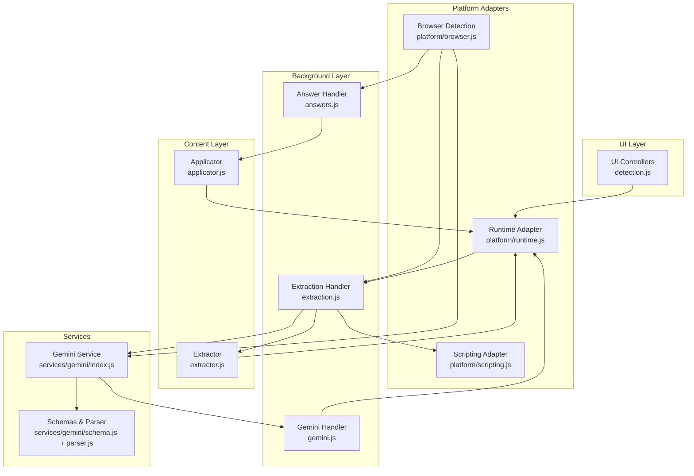
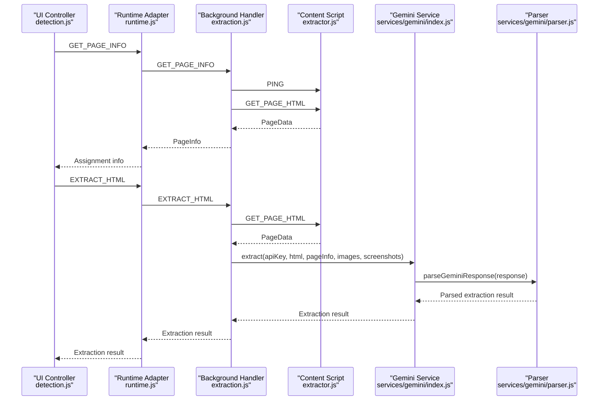
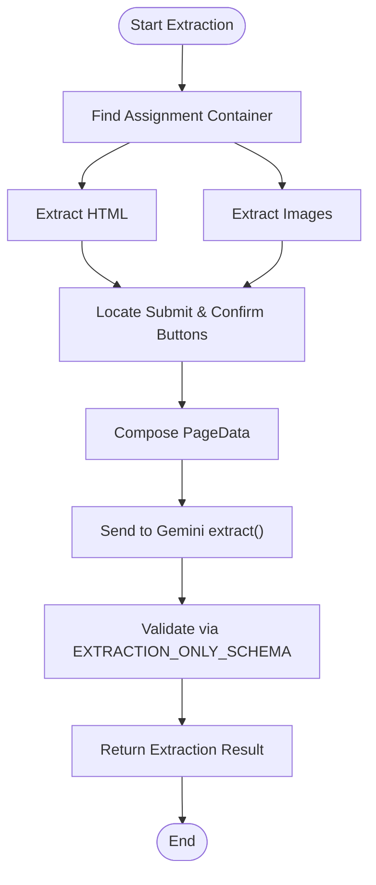
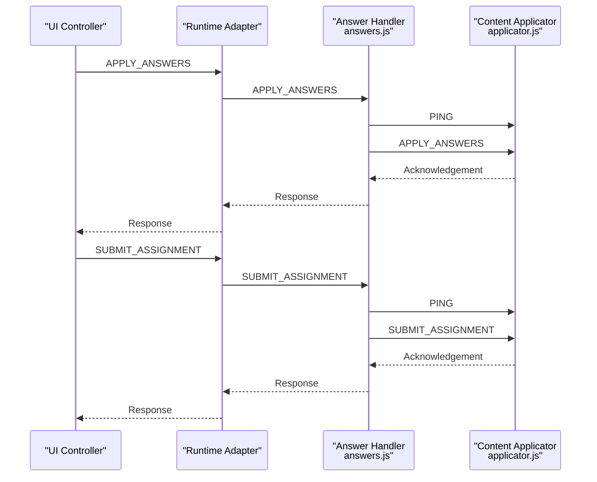
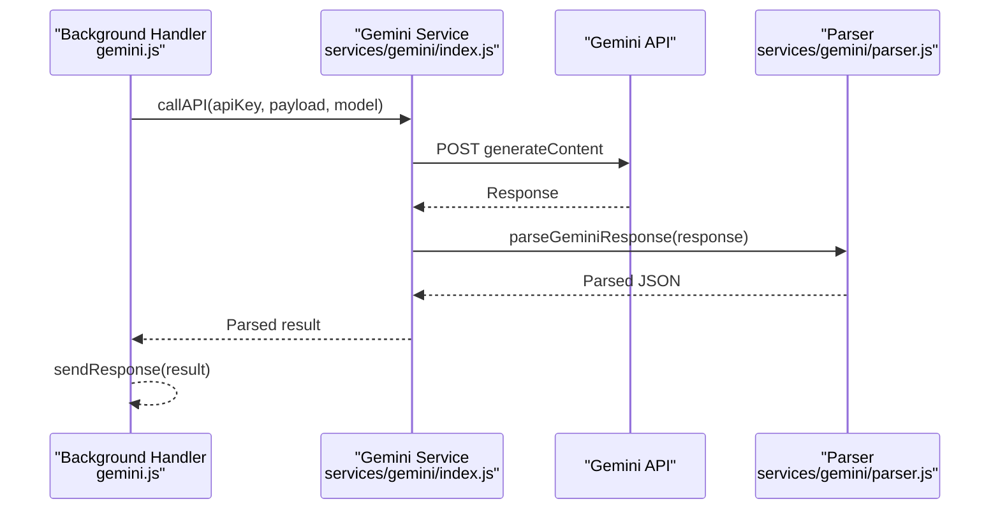
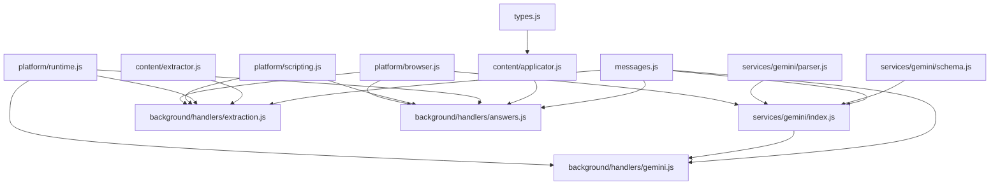

# Data Schemas and Protocols

<cite>
**Referenced Files in This Document**
- [types.js](file://assignment-solver/src/core/types.js)
- [messages.js](file://assignment-solver/src/core/messages.js)
- [schema.js](file://assignment-solver/src/services/gemini/schema.js)
- [parser.js](file://assignment-solver/src/services/gemini/parser.js)
- [index.js](file://assignment-solver/src/services/gemini/index.js)
- [extraction.js](file://assignment-solver/src/background/handlers/extraction.js)
- [answers.js](file://assignment-solver/src/background/handlers/answers.js)
- [gemini.js](file://assignment-solver/src/background/handlers/gemini.js)
- [extractor.js](file://assignment-solver/src/content/extractor.js)
- [applicator.js](file://assignment-solver/src/content/applicator.js)
- [runtime.js](file://assignment-solver/src/platform/runtime.js)
- [scripting.js](file://assignment-solver/src/platform/scripting.js)
- [browser.js](file://assignment-solver/src/platform/browser.js)
- [detection.js](file://assignment-solver/src/ui/controllers/detection.js)
</cite>

## Table of Contents
1. [Introduction](#introduction)
2. [Project Structure](#project-structure)
3. [Core Components](#core-components)
4. [Architecture Overview](#architecture-overview)
5. [Detailed Component Analysis](#detailed-component-analysis)
6. [Dependency Analysis](#dependency-analysis)
7. [Performance Considerations](#performance-considerations)
8. [Troubleshooting Guide](#troubleshooting-guide)
9. [Conclusion](#conclusion)
10. [Appendices](#appendices)

## Introduction
This document specifies the data schemas and communication protocols used by the assignment solver extension. It covers:
- Extraction schema for structuring question data (question types, choices, input fields)
- Answer schema with selected options, confidence levels, and reasoning
- Message protocol for inter-component communication
- Data validation rules and error handling
- JSON examples and schema evolution strategies
- Guidelines for extending schemas to support new question types

## Project Structure
The assignment solver is organized into distinct layers:
- Content script: extracts page data and applies answers
- Background handlers: orchestrate extraction, AI requests, and answer application
- Services: Gemini integration with schema-driven generation and robust parsing
- UI controllers: detect assignments and present information
- Platform adapters: cross-browser compatibility wrappers

**Diagram sources**
- [detection.js](file://assignment-solver/src/ui/controllers/detection.js#L1-L111)
- [extractor.js](file://assignment-solver/src/content/extractor.js#L1-L241)
- [applicator.js](file://assignment-solver/src/content/applicator.js#L1-L221)
- [extraction.js](file://assignment-solver/src/background/handlers/extraction.js#L1-L102)
- [answers.js](file://assignment-solver/src/background/handlers/answers.js#L1-L77)
- [gemini.js](file://assignment-solver/src/background/handlers/gemini.js#L1-L35)
- [index.js](file://assignment-solver/src/services/gemini/index.js#L1-L342)
- [schema.js](file://assignment-solver/src/services/gemini/schema.js#L1-L135)
- [parser.js](file://assignment-solver/src/services/gemini/parser.js#L1-L153)
- [runtime.js](file://assignment-solver/src/platform/runtime.js#L1-L31)
- [scripting.js](file://assignment-solver/src/platform/scripting.js#L1-L27)
- [browser.js](file://assignment-solver/src/platform/browser.js#L1-L86)

**Section sources**
- [runtime.js](file://assignment-solver/src/platform/runtime.js#L1-L31)
- [scripting.js](file://assignment-solver/src/platform/scripting.js#L1-L27)
- [browser.js](file://assignment-solver/src/platform/browser.js#L1-L86)

## Core Components
This section defines the primary data schemas and message protocol used across the system.

### Extraction Schema (Questions Only)
Defines the structure returned by the extraction phase. It includes submission button identifiers, optional confirmation button identifiers, and an array of questions.

- Root properties
  - submit_button_id: string
  - confirm_submit_button_ids: object with keys:
    - not_all_attempt_submit: string
    - not_all_attempt_cancel: string
    - no_attempt_ok: string
  - questions: array of question objects

- Question object properties
  - question_id: string
  - question_type: enum ["single_choice", "multi_choice", "fill_blank"]
  - question: string
  - choices: array of choice objects
  - inputs: array of input objects

- Choice object properties
  - option_id: string
  - text: string

- Input object properties
  - input_id: string
  - input_type: string

Required fields
- Root: submit_button_id, questions
- Question: question_id, question_type, question, choices, inputs

JSON example
- See [EXTRACTION_ONLY_SCHEMA](file://assignment-solver/src/services/gemini/schema.js#L78-L135)

**Section sources**
- [schema.js](file://assignment-solver/src/services/gemini/schema.js#L78-L135)

### Extraction Schema (With Answers)
Extends the extraction schema with an answer object for each question, enabling the solver to return complete solutions.

- Question object additions
  - answer: object with:
    - answer_text: string
    - answer_option_ids: array of string
    - confidence: enum ["high", "medium", "low"] (optional)
    - reasoning: string (optional)

Required fields
- Question: answer.answer_text, answer.answer_option_ids
- Optional: answer.confidence, answer.reasoning

JSON example
- See [EXTRACTION_WITH_ANSWERS_SCHEMA](file://assignment-solver/src/services/gemini/schema.js#L5-L77)

**Section sources**
- [schema.js](file://assignment-solver/src/services/gemini/schema.js#L5-L77)

### Message Protocol
Defines typed messages exchanged between UI, background, and content scripts.

- Message type constants
  - Content script communication: PING, GET_PAGE_HTML, GET_PAGE_INFO, APPLY_ANSWERS, SUBMIT_ASSIGNMENT
  - Background communication: EXTRACT_HTML, CAPTURE_FULL_PAGE, GEMINI_REQUEST, GEMINI_DEBUG
  - Internal: SCROLL_INFO, SCROLL_TO, TAB_UPDATED

- Message shape
  - type: string (one of the above)
  - payload: any (optional)

- Utilities
  - createMessage(type, payload?): constructs a message
  - sendMessageWithRetry(runtime, message, options?): sends a message with exponential backoff for transient connection errors

Common flows
- UI -> Background: GET_PAGE_INFO, APPLY_ANSWERS, SUBMIT_ASSIGNMENT
- Background -> Content: GET_PAGE_HTML, PING, APPLY_ANSWERS, SUBMIT_ASSIGNMENT
- Background -> Background: EXTRACT_HTML, GEMINI_REQUEST
- Background -> UI: TAB_UPDATED

**Section sources**
- [messages.js](file://assignment-solver/src/core/messages.js#L5-L95)

### Data Validation Rules
- Extraction schema validation is enforced via responseSchema in Gemini generationConfig during both extraction and solving phases.
- Parser enforces response correctness and attempts multiple recovery strategies for malformed JSON.
- UI controllers rely on page info to gate actions.

**Section sources**
- [index.js](file://assignment-solver/src/services/gemini/index.js#L189-L217)
- [index.js](file://assignment-solver/src/services/gemini/index.js#L269-L297)
- [parser.js](file://assignment-solver/src/services/gemini/parser.js#L11-L102)
- [detection.js](file://assignment-solver/src/ui/controllers/detection.js#L26-L44)

### Error Handling
- sendMessageWithRetry handles transient connection errors and retries with increasing delays.
- Gemini handler and service propagate API errors and parse failures.
- Extraction and answer handlers return structured error responses.

**Section sources**
- [messages.js](file://assignment-solver/src/core/messages.js#L47-L95)
- [gemini.js](file://assignment-solver/src/background/handlers/gemini.js#L15-L33)
- [index.js](file://assignment-solver/src/services/gemini/index.js#L302-L319)

## Architecture Overview
The system orchestrates extraction, AI-powered solving, and answer application across browser contexts.

**Diagram sources**
- [detection.js](file://assignment-solver/src/ui/controllers/detection.js#L26-L44)
- [runtime.js](file://assignment-solver/src/platform/runtime.js#L19-L30)
- [extraction.js](file://assignment-solver/src/background/handlers/extraction.js#L18-L99)
- [extractor.js](file://assignment-solver/src/content/extractor.js#L21-L96)
- [index.js](file://assignment-solver/src/services/gemini/index.js#L145-L217)
- [parser.js](file://assignment-solver/src/services/gemini/parser.js#L11-L102)

## Detailed Component Analysis

### Extraction Flow
- Content script identifies assignment containers, extracts HTML and images, and locates submit and confirmation button IDs.
- Background handler ensures content script is loaded and forwards requests.
- Gemini service validates extraction results against EXTRACTION_ONLY_SCHEMA.

**Diagram sources**
- [extractor.js](file://assignment-solver/src/content/extractor.js#L21-L96)
- [extraction.js](file://assignment-solver/src/background/handlers/extraction.js#L18-L99)
- [index.js](file://assignment-solver/src/services/gemini/index.js#L145-L217)
- [schema.js](file://assignment-solver/src/services/gemini/schema.js#L78-L135)

**Section sources**
- [extractor.js](file://assignment-solver/src/content/extractor.js#L21-L96)
- [extraction.js](file://assignment-solver/src/background/handlers/extraction.js#L18-L99)
- [index.js](file://assignment-solver/src/services/gemini/index.js#L145-L217)

### Answer Application Flow
- Content script applies answers based on question type:
  - single_choice: selects a radio button
  - multi_choice: toggles checkboxes
  - fill_blank: fills text inputs
- Background handler forwards messages to content script and verifies readiness.

**Diagram sources**
- [answers.js](file://assignment-solver/src/background/handlers/answers.js#L17-L70)
- [applicator.js](file://assignment-solver/src/content/applicator.js#L21-L194)

**Section sources**
- [answers.js](file://assignment-solver/src/background/handlers/answers.js#L17-L70)
- [applicator.js](file://assignment-solver/src/content/applicator.js#L21-L194)

### Gemini Integration and Parsing
- Gemini service composes prompts and content parts, sets responseMimeType to JSON and responseSchema for validation.
- Parser attempts multiple strategies to extract valid JSON from Gemini’s possibly fenced or truncated output.
- Handlers manage retries and error propagation.

**Diagram sources**
- [gemini.js](file://assignment-solver/src/background/handlers/gemini.js#L15-L33)
- [index.js](file://assignment-solver/src/services/gemini/index.js#L302-L319)
- [parser.js](file://assignment-solver/src/services/gemini/parser.js#L11-L102)

**Section sources**
- [index.js](file://assignment-solver/src/services/gemini/index.js#L189-L217)
- [index.js](file://assignment-solver/src/services/gemini/index.js#L269-L297)
- [parser.js](file://assignment-solver/src/services/gemini/parser.js#L11-L102)

### Cross-Browser Compatibility
- Unified browser API via webextension-polyfill.
- Runtime and Scripting adapters abstract platform differences.
- Browser detection enables tailored behavior (e.g., longer delays for Firefox).

**Section sources**
- [browser.js](file://assignment-solver/src/platform/browser.js#L1-L86)
- [runtime.js](file://assignment-solver/src/platform/runtime.js#L1-L31)
- [scripting.js](file://assignment-solver/src/platform/scripting.js#L1-L27)

## Dependency Analysis
The following diagram shows key dependencies among components involved in data schemas and communication.

**Diagram sources**
- [messages.js](file://assignment-solver/src/core/messages.js#L5-L95)
- [types.js](file://assignment-solver/src/core/types.js#L16-L61)
- [schema.js](file://assignment-solver/src/services/gemini/schema.js#L5-L135)
- [parser.js](file://assignment-solver/src/services/gemini/parser.js#L1-L153)
- [index.js](file://assignment-solver/src/services/gemini/index.js#L1-L342)
- [extraction.js](file://assignment-solver/src/background/handlers/extraction.js#L1-L102)
- [answers.js](file://assignment-solver/src/background/handlers/answers.js#L1-L77)
- [gemini.js](file://assignment-solver/src/background/handlers/gemini.js#L1-L35)
- [extractor.js](file://assignment-solver/src/content/extractor.js#L1-L241)
- [applicator.js](file://assignment-solver/src/content/applicator.js#L1-L221)
- [runtime.js](file://assignment-solver/src/platform/runtime.js#L1-L31)
- [scripting.js](file://assignment-solver/src/platform/scripting.js#L1-L27)
- [browser.js](file://assignment-solver/src/platform/browser.js#L1-L86)

**Section sources**
- [messages.js](file://assignment-solver/src/core/messages.js#L5-L95)
- [schema.js](file://assignment-solver/src/services/gemini/schema.js#L5-L135)
- [index.js](file://assignment-solver/src/services/gemini/index.js#L1-L342)

## Performance Considerations
- Image handling: Large images are skipped to avoid exceeding API limits; consider compressing or downscaling before embedding.
- Thinking budgets: Configure reasoning levels per model family to balance quality and token usage.
- Retry strategy: sendMessageWithRetry reduces failure rates on slower platforms like Firefox.
- Content script injection: Delay and verification steps prevent race conditions during initialization.

[No sources needed since this section provides general guidance]

## Troubleshooting Guide
Common issues and resolutions:
- Content script not responding
  - Ensure content script is injected and PING succeeds; verify tab context and active tab selection.
  - Reference: [extraction.js](file://assignment-solver/src/background/handlers/extraction.js#L45-L75), [answers.js](file://assignment-solver/src/background/handlers/answers.js#L34-L61)
- Gemini response parsing failures
  - Parser attempts multiple strategies; check for fenced code blocks or truncated JSON and review finish reasons.
  - Reference: [parser.js](file://assignment-solver/src/services/gemini/parser.js#L11-L102)
- API communication errors
  - sendMessageWithRetry handles transient errors; inspect error payloads and model availability.
  - Reference: [messages.js](file://assignment-solver/src/core/messages.js#L47-L95), [gemini.js](file://assignment-solver/src/background/handlers/gemini.js#L15-L33)

**Section sources**
- [extraction.js](file://assignment-solver/src/background/handlers/extraction.js#L45-L75)
- [answers.js](file://assignment-solver/src/background/handlers/answers.js#L34-L61)
- [parser.js](file://assignment-solver/src/services/gemini/parser.js#L11-L102)
- [messages.js](file://assignment-solver/src/core/messages.js#L47-L95)
- [gemini.js](file://assignment-solver/src/background/handlers/gemini.js#L15-L33)

## Conclusion
The assignment solver employs schema-driven generation and robust parsing to reliably extract and solve assessment questions. The message protocol and cross-browser adapters ensure consistent behavior across environments. Extensibility is achieved by evolving schemas and adding new question types while preserving backward compatibility.

[No sources needed since this section summarizes without analyzing specific files]

## Appendices

### JSON Examples
- Extraction result (questions only)
  - See [EXTRACTION_ONLY_SCHEMA](file://assignment-solver/src/services/gemini/schema.js#L78-L135)
- Extraction result (with answers)
  - See [EXTRACTION_WITH_ANSWERS_SCHEMA](file://assignment-solver/src/services/gemini/schema.js#L5-L77)

### Schema Evolution Strategies
- Backward compatibility
  - Keep required fields stable; introduce optional fields with defaults.
- Versioning
  - Use separate schemas for major versions or a version field within the payload.
- Validation-first
  - Enforce schemas via responseSchema and parser checks before downstream processing.
- Testing
  - Maintain test fixtures aligned with schemas to catch regressions early.

[No sources needed since this section provides general guidance]

### Guidelines for New Question Types
- Define a new question_type enum value and update schemas accordingly.
- Extend answer schema with appropriate fields (e.g., additional input types).
- Update content applicator to handle new input selectors and behaviors.
- Add or modify system prompts to guide the model for the new type.
- Validate with parser and handlers to ensure robustness.

**Section sources**
- [schema.js](file://assignment-solver/src/services/gemini/schema.js#L23-L26)
- [applicator.js](file://assignment-solver/src/content/applicator.js#L31-L47)
- [index.js](file://assignment-solver/src/services/gemini/index.js#L154-L176)
- [index.js](file://assignment-solver/src/services/gemini/index.js#L236-L257)