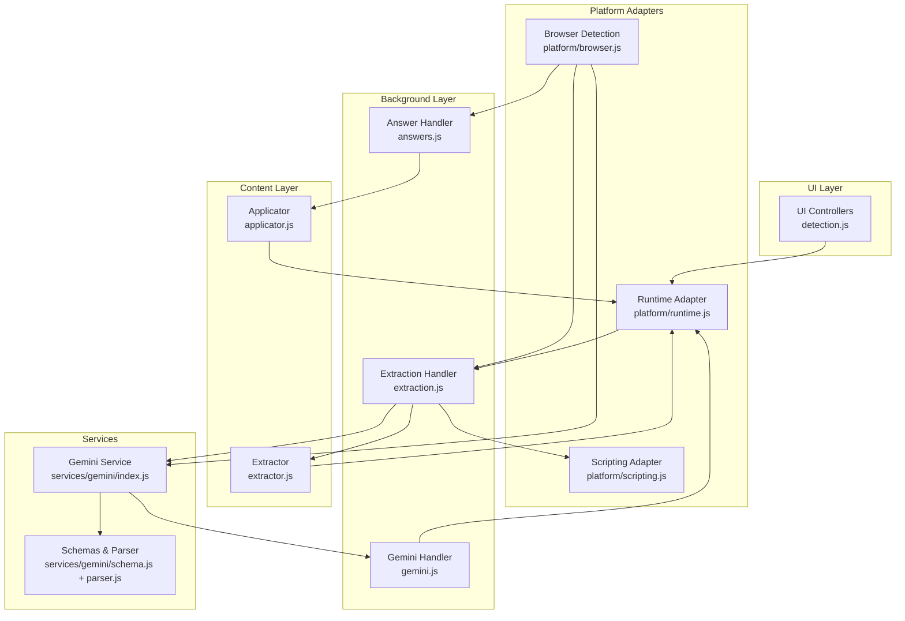
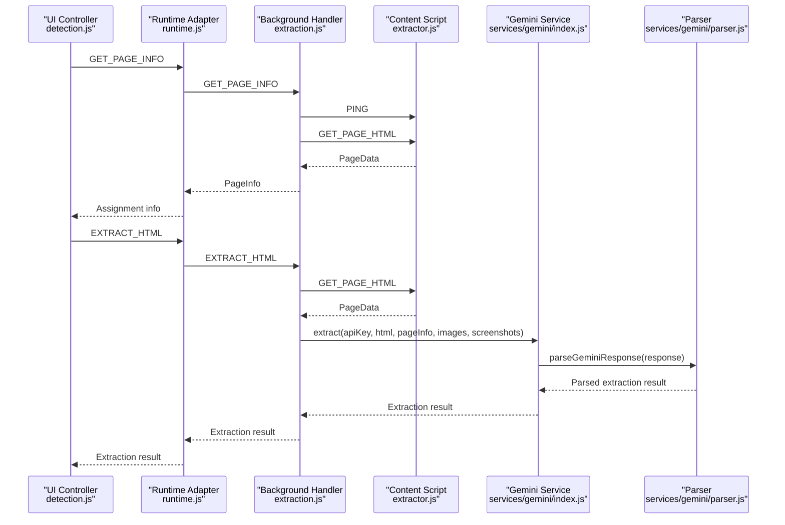
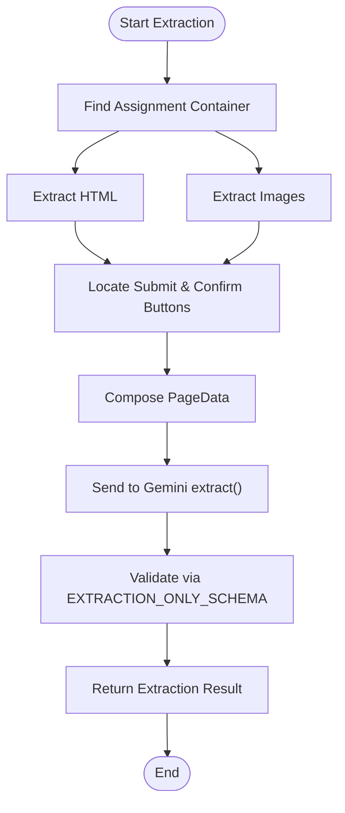
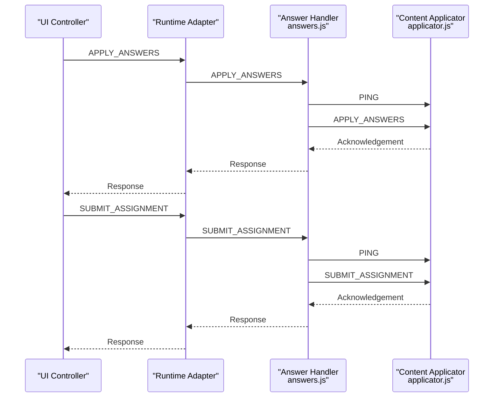
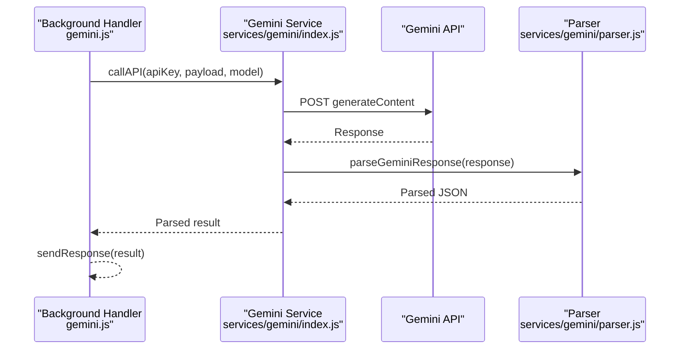
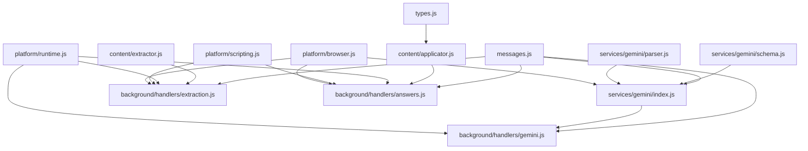

# Data schemas and protocols

## Introduction
This page specifies the data schemas and communication protocols used by the assignment solver extension. It covers:
- Extraction schema for structuring question data (question types, choices, input fields)
- Answer schema with selected options, confidence levels, and reasoning
- Message protocol for inter-component communication
- Data validation rules and error handling
- JSON examples and schema evolution strategies
- Guidelines for extending schemas to support new question types

## Project structure
The assignment solver is organized into distinct layers:
- Content script: extracts page data and applies answers
- Background handlers: orchestrate extraction, AI requests, and answer application
- Services: Gemini integration with schema-driven generation and reliable parsing
- UI controllers: detect assignments and present information
- Platform adapters: cross-browser compatibility wrappers

```mermaid
graph TB
subgraph "UI Layer"
DET["UI Controllers<br/>detection.js"]
end
subgraph "Content Layer"
EXT["Extractor<br/>extractor.js"]
APP["Applicator<br/>applicator.js"]
end
subgraph "Background Layer"
BG_EX["Extraction Handler<br/>extraction.js"]
BG_ANS["Answer Handler<br/>answers.js"]
BG_GEM["Gemini Handler<br/>gemini.js"]
end
subgraph "Services"
GMI["Gemini Service<br/>services/gemini/index.js"]
SCH["Schemas & Parser<br/>services/gemini/schema.js + parser.js"]
end
subgraph "Platform Adapters"
RT["Runtime Adapter<br/>platform/runtime.js"]
SC["Scripting Adapter<br/>platform/scripting.js"]
BR["Browser Detection<br/>platform/browser.js"]
end
DET --> RT
RT --> BG_EX
BG_EX --> EXT
BG_EX --> SC
BG_EX --> GMI
GMI --> SCH
GMI --> BG_GEM
BG_GEM --> RT
BG_ANS --> APP
APP --> RT
EXT --> RT
BR --> BG_EX
BR --> BG_ANS
BR --> GMI
```

## Core components
This section defines the primary data schemas and message protocol used across the system.

### Extraction schema (questions only)
Defines the structure returned by the extraction phase. It includes submission button identifiers, optional confirmation button identifiers, and an array of questions.

- Root properties
  - submit_button_id: string
  - confirm_submit_button_ids: object with keys:
    - not_all_attempt_submit: string
    - not_all_attempt_cancel: string
    - no_attempt_ok: string
  - questions: array of question objects

- Question object properties
  - question_id: string
  - question_type: enum ["single_choice", "multi_choice", "fill_blank"]
  - question: string
  - choices: array of choice objects
  - inputs: array of input objects

- Choice object properties
  - option_id: string
  - text: string

- Input object properties
  - input_id: string
  - input_type: string

Required fields
- Root: submit_button_id, questions
- Question: question_id, question_type, question, choices, inputs

JSON example
- See `EXTRACTION_ONLY_SCHEMA`

### Extraction schema (with answers)
Extends the extraction schema with an answer object for each question, enabling the solver to return complete solutions.

- Question object additions
  - answer: object with:
    - answer_text: string
    - answer_option_ids: array of string
    - confidence: enum ["high", "medium", "low"] (optional)
    - reasoning: string (optional)

Required fields
- Question: answer.answer_text, answer.answer_option_ids
- Optional: answer.confidence, answer.reasoning

JSON example
- See `EXTRACTION_WITH_ANSWERS_SCHEMA`

### Message protocol
Defines typed messages exchanged between UI, background, and content scripts.

- Message type constants
  - Content script communication: PING, GET_PAGE_HTML, GET_PAGE_INFO, APPLY_ANSWERS, SUBMIT_ASSIGNMENT
  - Background communication: EXTRACT_HTML, CAPTURE_FULL_PAGE, GEMINI_REQUEST, GEMINI_DEBUG
  - Internal: SCROLL_INFO, SCROLL_TO, TAB_UPDATED

- Message shape
  - type: string (one of the above)
  - payload: any (optional)

- Utilities
  - createMessage(type, payload?): constructs a message
  - sendMessageWithRetry(runtime, message, options?): sends a message with exponential backoff for transient connection errors

Common flows
- UI -> Background: GET_PAGE_INFO, APPLY_ANSWERS, SUBMIT_ASSIGNMENT
- Background -> Content: GET_PAGE_HTML, PING, APPLY_ANSWERS, SUBMIT_ASSIGNMENT
- Background -> Background: EXTRACT_HTML, GEMINI_REQUEST
- Background -> UI: TAB_UPDATED

### Data validation rules
- Extraction schema validation is enforced via responseSchema in Gemini generationConfig during both extraction and solving phases.
- Parser enforces response correctness and attempts multiple recovery strategies for malformed JSON.
- UI controllers rely on page info to gate actions.

### Error handling
- sendMessageWithRetry handles transient connection errors and retries with increasing delays.
- Gemini handler and service propagate API errors and parse failures.
- Extraction and answer handlers return structured error responses.

## Architecture overview
The system orchestrates extraction, AI-powered solving, and answer application across browser contexts.

```mermaid
sequenceDiagram
participant UI as "UI Controller<br/>detection.js"
participant RT as "Runtime Adapter<br/>runtime.js"
participant BG as "Background Handler<br/>extraction.js"
participant CT as "Content Script<br/>extractor.js"
participant GM as "Gemini Service<br/>services/gemini/index.js"
participant PH as "Parser<br/>services/gemini/parser.js"
UI->>RT : GET_PAGE_INFO
RT->>BG : GET_PAGE_INFO
BG->>CT : PING
BG->>CT : GET_PAGE_HTML
CT-->>BG : PageData
BG-->>RT : PageInfo
RT-->>UI : Assignment info
UI->>RT : EXTRACT_HTML
RT->>BG : EXTRACT_HTML
BG->>CT : GET_PAGE_HTML
CT-->>BG : PageData
BG->>GM : extract(apiKey, html, pageInfo, images, screenshots)
GM->>PH : parseGeminiResponse(response)
PH-->>GM : Parsed extraction result
GM-->>BG : Extraction result
BG-->>RT : Extraction result
RT-->>UI : Extraction result
```

## Detailed component analysis

### Extraction flow
- Content script identifies assignment containers, extracts HTML and images, and locates submit and confirmation button IDs.
- Background handler ensures content script is loaded and forwards requests.
- Gemini service validates extraction results against EXTRACTION_ONLY_SCHEMA.

```mermaid
flowchart TD
Start(["Start Extraction"]) --> FindContainer["Find Assignment Container"]
FindContainer --> ExtractHTML["Extract HTML"]
FindContainer --> ExtractImages["Extract Images"]
ExtractHTML --> LocateButtons["Locate Submit & Confirm Buttons"]
ExtractImages --> LocateButtons
LocateButtons --> ComposePayload["Compose PageData"]
ComposePayload --> SendToAI["Send to Gemini extract()"]
SendToAI --> ValidateSchema["Validate via EXTRACTION_ONLY_SCHEMA"]
ValidateSchema --> ReturnResult["Return Extraction Result"]
ReturnResult --> End(["End"])
```

### Answer application flow
- Content script applies answers based on question type:
  - single_choice: selects a radio button
  - multi_choice: toggles checkboxes
  - fill_blank: fills text inputs
- Background handler forwards messages to content script and verifies readiness.

```mermaid
sequenceDiagram
participant UI as "UI Controller"
participant RT as "Runtime Adapter"
participant BG as "Answer Handler<br/>answers.js"
participant CT as "Content Applicator<br/>applicator.js"
UI->>RT : APPLY_ANSWERS
RT->>BG : APPLY_ANSWERS
BG->>CT : PING
BG->>CT : APPLY_ANSWERS
CT-->>BG : Acknowledgement
BG-->>RT : Response
RT-->>UI : Response
UI->>RT : SUBMIT_ASSIGNMENT
RT->>BG : SUBMIT_ASSIGNMENT
BG->>CT : PING
BG->>CT : SUBMIT_ASSIGNMENT
CT-->>BG : Acknowledgement
BG-->>RT : Response
RT-->>UI : Response
```

### Gemini integration and parsing
- Gemini service composes prompts and content parts, sets responseMimeType to JSON and responseSchema for validation.
- Parser attempts multiple strategies to extract valid JSON from Gemini's possibly fenced or truncated output.
- Handlers manage retries and error propagation.

```mermaid
sequenceDiagram
participant BG as "Background Handler<br/>gemini.js"
participant GM as "Gemini Service<br/>services/gemini/index.js"
participant API as "Gemini API"
participant PH as "Parser<br/>services/gemini/parser.js"
BG->>GM : callAPI(apiKey, payload, model)
GM->>API : POST generateContent
API-->>GM : Response
GM->>PH : parseGeminiResponse(response)
PH-->>GM : Parsed JSON
GM-->>BG : Parsed result
BG-->>BG : sendResponse(result)
```

### Cross-Browser compatibility
- Unified browser API via webextension-polyfill.
- Runtime and Scripting adapters abstract platform differences.
- Browser detection enables tailored behavior (e.g., longer delays for Firefox).

## Dependency analysis
The following diagram shows key dependencies among components involved in data schemas and communication.

```mermaid
graph TB
MSG["messages.js"]
TYP["types.js"]
SCH["services/gemini/schema.js"]
PARSER["services/gemini/parser.js"]
GMI["services/gemini/index.js"]
EXTH["background/handlers/extraction.js"]
ANSH["background/handlers/answers.js"]
GEMH["background/handlers/gemini.js"]
EXT["content/extractor.js"]
APP["content/applicator.js"]
RT["platform/runtime.js"]
SC["platform/scripting.js"]
BR["platform/browser.js"]
MSG --> EXTH
MSG --> ANSH
MSG --> GEMH
MSG --> GMI
TYP --> APP
SCH --> GMI
PARSER --> GMI
GMI --> GEMH
EXT --> EXTH
APP --> ANSH
RT --> EXTH
RT --> ANSH
RT --> GEMH
SC --> EXTH
SC --> ANSH
BR --> EXTH
BR --> ANSH
BR --> GMI
```

## Performance considerations
- Image handling: Large images are skipped to avoid exceeding API limits; consider compressing or downscaling before embedding.
- Thinking budgets: Configure reasoning levels per model family to balance quality and token usage.
- Retry strategy: sendMessageWithRetry reduces failure rates on slower platforms like Firefox.
- Content script injection: Delay and verification steps prevent race conditions during initialization.

[No sources needed since this section provides general guidance]

## Troubleshooting guide
Common issues and resolutions:
- Content script not responding
  - Ensure content script is injected and PING succeeds; verify tab context and active tab selection.
  - Reference: `extraction.js`, `answers.js`
- Gemini response parsing failures
  - Parser attempts multiple strategies; check for fenced code blocks or truncated JSON and review finish reasons.
  - Reference: `parser.js`
- API communication errors
  - sendMessageWithRetry handles transient errors; inspect error payloads and model availability.
  - Reference: `messages.js`, `gemini.js`

## Conclusion
The assignment solver employs schema-driven generation and reliable parsing to reliably extract and solve assessment questions. The message protocol and cross-browser adapters ensure consistent behavior across environments. Extensibility is achieved by evolving schemas and adding new question types while preserving backward compatibility.

[No sources needed since this section summarizes without analyzing specific files]

## Appendices

### JSON examples
- Extraction result (questions only)
  - See `EXTRACTION_ONLY_SCHEMA`
- Extraction result (with answers)
  - See `EXTRACTION_WITH_ANSWERS_SCHEMA`

### Schema evolution strategies
- Backward compatibility
  - Keep required fields stable; introduce optional fields with defaults.
- Versioning
  - Use separate schemas for major versions or a version field within the payload.
- Validation-first
  - Enforce schemas via responseSchema and parser checks before downstream processing.
- Testing
  - Maintain test fixtures aligned with schemas to catch regressions early.

[No sources needed since this section provides general guidance]

### Guidelines for new question types
- Define a new question_type enum value and update schemas accordingly.
- Extend answer schema with appropriate fields (e.g., additional input types).
- Update content applicator to handle new input selectors and behaviors.
- Add or modify system prompts to guide the model for the new type.
- Validate with parser and handlers to ensure robustness.
