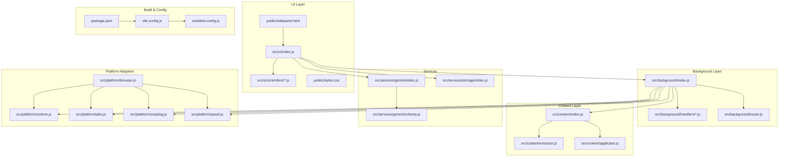
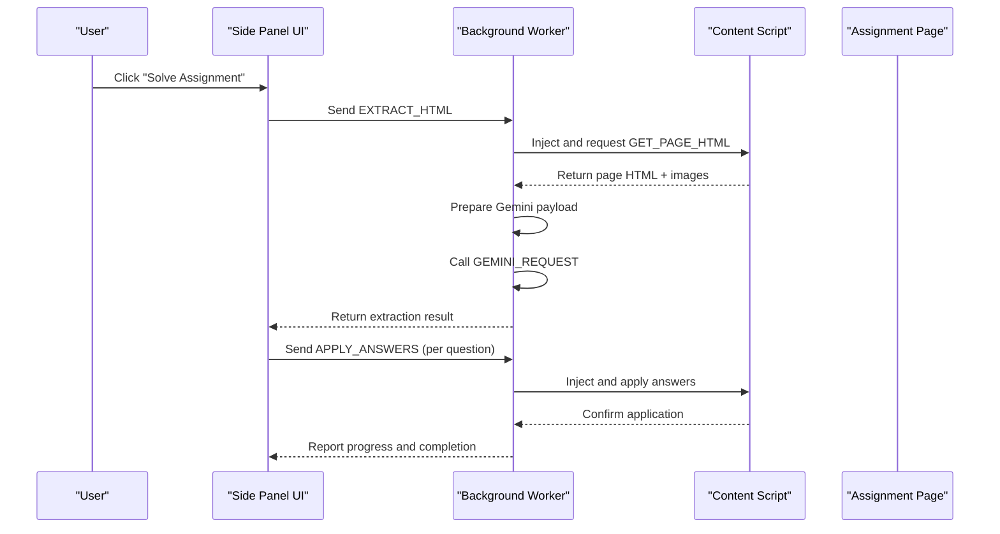
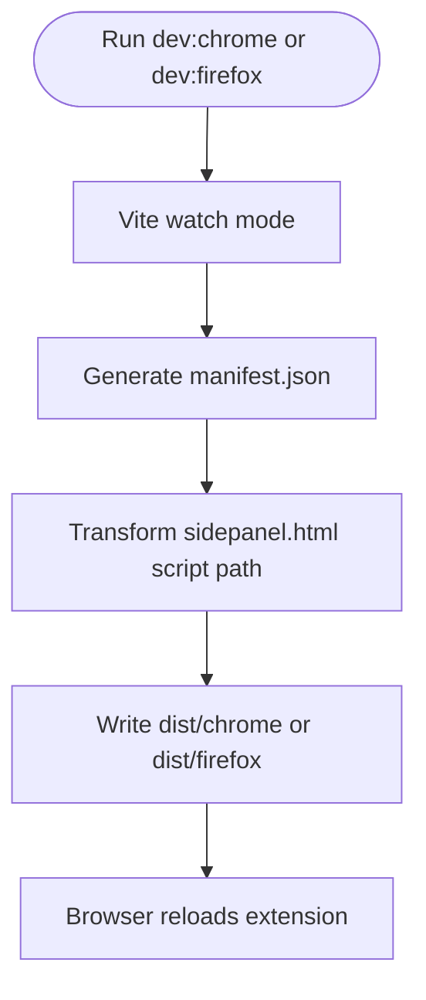
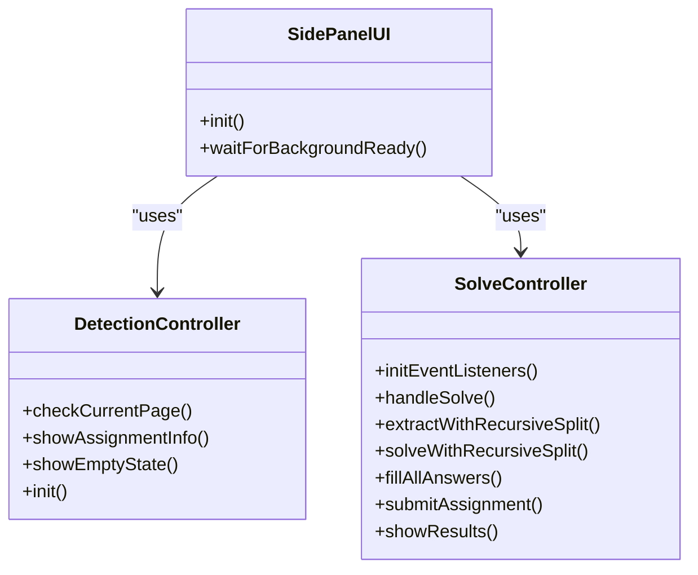
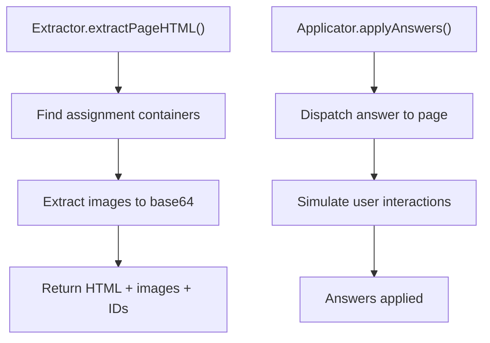
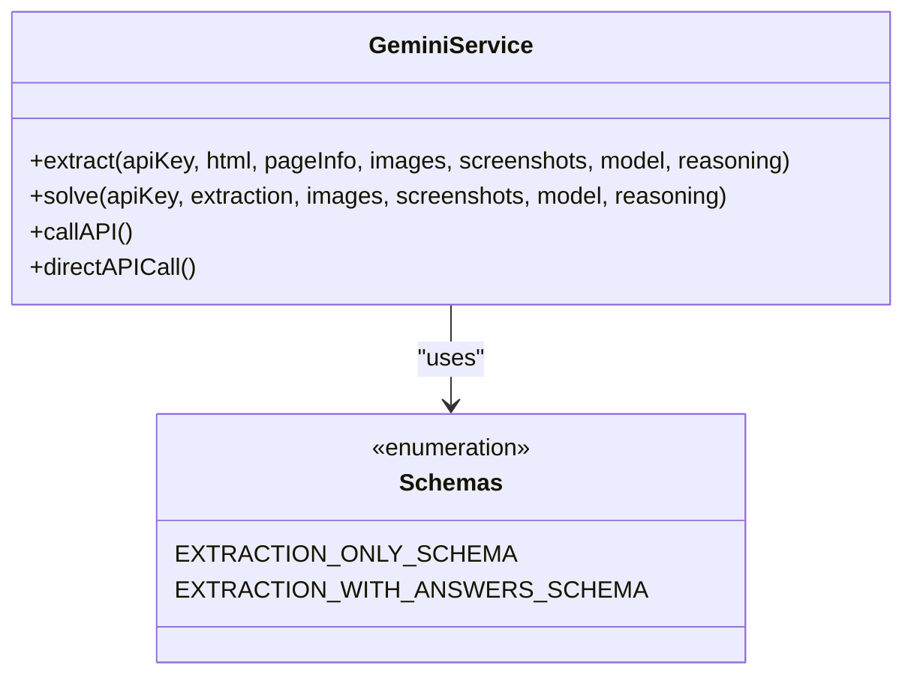
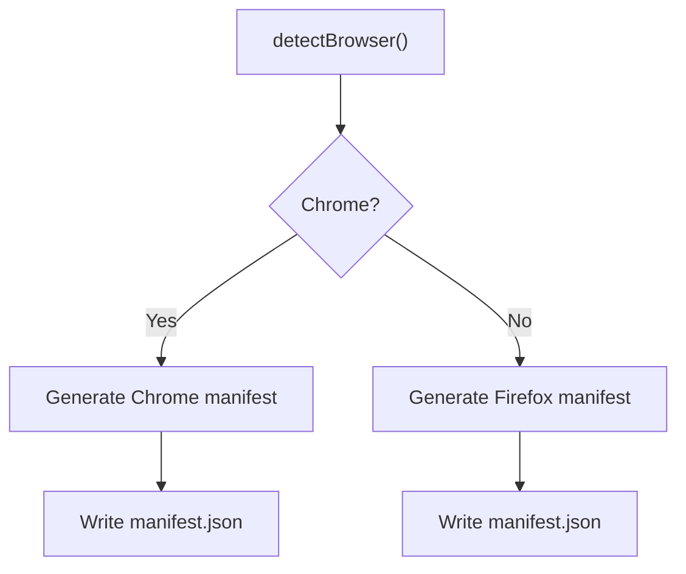
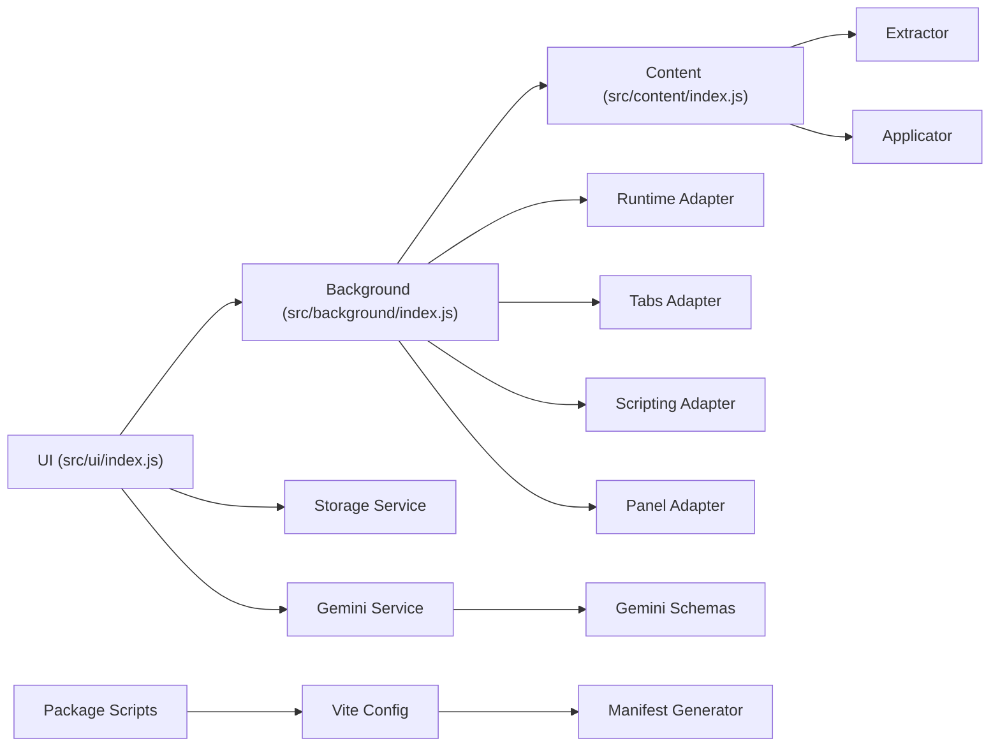

# Development and Customization

<cite>
**Referenced Files in This Document**
- [README.md](file://assignment-solver/README.md)
- [package.json](file://assignment-solver/package.json)
- [vite.config.js](file://assignment-solver/vite.config.js)
- [manifest.config.js](file://assignment-solver/manifest.config.js)
- [src/ui/index.js](file://assignment-solver/src/ui/index.js)
- [src/background/index.js](file://assignment-solver/src/background/index.js)
- [src/content/index.js](file://assignment-solver/src/content/index.js)
- [src/content/extractor.js](file://assignment-solver/src/content/extractor.js)
- [src/content/applicator.js](file://assignment-solver/src/content/applicator.js)
- [src/services/gemini/index.js](file://assignment-solver/src/services/gemini/index.js)
- [src/services/gemini/schema.js](file://assignment-solver/src/services/gemini/schema.js)
- [src/ui/controllers/detection.js](file://assignment-solver/src/ui/controllers/detection.js)
- [src/ui/controllers/solve.js](file://assignment-solver/src/ui/controllers/solve.js)
- [public/sidepanel.html](file://assignment-solver/public/sidepanel.html)
- [public/styles.css](file://assignment-solver/public/styles.css)
- [src/platform/browser.js](file://assignment-solver/src/platform/browser.js)
</cite>

## Table of Contents
1. [Introduction](#introduction)
2. [Project Structure](#project-structure)
3. [Core Components](#core-components)
4. [Architecture Overview](#architecture-overview)
5. [Detailed Component Analysis](#detailed-component-analysis)
6. [Dependency Analysis](#dependency-analysis)
7. [Performance Considerations](#performance-considerations)
8. [Troubleshooting Guide](#troubleshooting-guide)
9. [Conclusion](#conclusion)
10. [Appendices](#appendices)

## Introduction
This document provides a comprehensive guide to developing and customizing the Assignment Solver browser extension. It covers setting up the development environment, enabling watch mode for auto-rebuild, configuring the build system, and extending functionality across Chrome and Firefox. It also explains customization options such as adjusting CSS selectors for different platforms, adding new question types, and extending the plugin architecture. Finally, it outlines debugging techniques, testing strategies, and deployment considerations for both Chrome and Firefox.

## Project Structure
The extension is organized into modular layers:
- UI (side panel) with controllers and state management
- Background service worker orchestrating cross-frame communication
- Content script interacting with page DOM
- Services for Gemini AI and local storage
- Platform adapters for cross-browser compatibility
- Build system using Vite with dynamic manifest generation

**Diagram sources**
- [vite.config.js](file://assignment-solver/vite.config.js#L54-L108)
- [manifest.config.js](file://assignment-solver/manifest.config.js#L14-L105)
- [src/ui/index.js](file://assignment-solver/src/ui/index.js#L54-L112)
- [src/background/index.js](file://assignment-solver/src/background/index.js#L1-L135)
- [src/content/index.js](file://assignment-solver/src/content/index.js#L1-L99)
- [src/content/extractor.js](file://assignment-solver/src/content/extractor.js#L1-L241)
- [src/content/applicator.js](file://assignment-solver/src/content/applicator.js#L1-L221)
- [src/services/gemini/index.js](file://assignment-solver/src/services/gemini/index.js#L1-L342)
- [src/services/gemini/schema.js](file://assignment-solver/src/services/gemini/schema.js#L1-L136)
- [src/platform/browser.js](file://assignment-solver/src/platform/browser.js#L1-L86)

**Section sources**
- [README.md](file://assignment-solver/README.md#L142-L160)
- [vite.config.js](file://assignment-solver/vite.config.js#L54-L108)
- [manifest.config.js](file://assignment-solver/manifest.config.js#L14-L105)

## Core Components
- Build system: Vite with dynamic manifest generation and browser-specific outputs
- Message routing: Centralized router in the background worker
- UI controllers: Assignment detection, progress, settings, and solve flows
- Content extraction and applicator: DOM interaction for page extraction and answer application
- Gemini service: Structured prompts, schemas, and API calls with retry logic
- Cross-browser platform adapters: Unified browser API via webextension-polyfill

Key capabilities:
- Watch mode for live rebuilds on changes
- Dual-browser support via dynamic manifest generation
- Extensible question type handling and selector customization
- Robust error handling and progress reporting

**Section sources**
- [package.json](file://assignment-solver/package.json#L6-L14)
- [src/ui/index.js](file://assignment-solver/src/ui/index.js#L54-L112)
- [src/background/index.js](file://assignment-solver/src/background/index.js#L44-L117)
- [src/content/extractor.js](file://assignment-solver/src/content/extractor.js#L21-L96)
- [src/content/applicator.js](file://assignment-solver/src/content/applicator.js#L21-L48)
- [src/services/gemini/index.js](file://assignment-solver/src/services/gemini/index.js#L145-L217)

## Architecture Overview
The extension follows a layered architecture:
- UI (side panel) communicates with the background worker via message passing
- Background worker injects and coordinates the content script
- Content script interacts with the page DOM to extract HTML and apply answers
- Gemini service handles AI requests with structured schemas and retry logic
- Platform adapters abstract browser differences

**Diagram sources**
- [src/ui/controllers/solve.js](file://assignment-solver/src/ui/controllers/solve.js#L44-L240)
- [src/background/index.js](file://assignment-solver/src/background/index.js#L51-L112)
- [src/content/index.js](file://assignment-solver/src/content/index.js#L32-L78)

## Detailed Component Analysis

### Build System and Watch Mode
- Scripts:
  - dev:chrome and dev:firefox enable watch mode for live rebuilds
  - build:chrome and build:firefox produce separate outputs
  - build builds both browsers
- Vite configuration:
  - Dynamic manifest generation plugin writes manifest.json per browser
  - HTML transformation plugin adjusts script path for sidepanel.html
  - Aliases for @core, @platform, @services, @background, @ui, @content
  - Define constants for browser and version
- Manifest generation:
  - Base permissions and CSP
  - Browser-specific side panel vs sidebar action
  - Host permissions for NPTEL/Swayam and Gemini API

**Diagram sources**
- [package.json](file://assignment-solver/package.json#L7-L11)
- [vite.config.js](file://assignment-solver/vite.config.js#L15-L52)
- [vite.config.js](file://assignment-solver/vite.config.js#L54-L108)
- [manifest.config.js](file://assignment-solver/manifest.config.js#L14-L105)

**Section sources**
- [README.md](file://assignment-solver/README.md#L74-L91)
- [package.json](file://assignment-solver/package.json#L6-L14)
- [vite.config.js](file://assignment-solver/vite.config.js#L54-L108)
- [manifest.config.js](file://assignment-solver/manifest.config.js#L14-L105)

### UI Controllers and State Management
- Side panel initialization:
  - Waits for background readiness (important for Firefox)
  - Initializes controllers: detection, progress, settings, solve
  - Loads stored API key into settings
- Detection controller:
  - Queries page info and toggles UI states
  - Listens for tab update messages
- Solve controller:
  - Orchestrates extraction, screenshot capture, AI solving, answer application, and optional submission
  - Implements recursive splitting for MAX_TOKENS errors
  - Progress tracking and result rendering

**Diagram sources**
- [src/ui/index.js](file://assignment-solver/src/ui/index.js#L54-L112)
- [src/ui/controllers/detection.js](file://assignment-solver/src/ui/controllers/detection.js#L15-L110)
- [src/ui/controllers/solve.js](file://assignment-solver/src/ui/controllers/solve.js#L21-L778)

**Section sources**
- [src/ui/index.js](file://assignment-solver/src/ui/index.js#L54-L112)
- [src/ui/controllers/detection.js](file://assignment-solver/src/ui/controllers/detection.js#L26-L109)
- [src/ui/controllers/solve.js](file://assignment-solver/src/ui/controllers/solve.js#L44-L240)

### Content Extraction and Answer Application
- Extractor:
  - Finds assignment containers and fallbacks
  - Extracts images and converts to base64 when possible
  - Identifies submit and confirmation button IDs
  - Provides page info for assignment detection
- Applicator:
  - Applies single/multi choice and fill-in-the-blank answers
  - Simulates user interactions (click, change, input, keyup)
  - Submits assignment using configured button IDs

**Diagram sources**
- [src/content/extractor.js](file://assignment-solver/src/content/extractor.js#L21-L96)
- [src/content/extractor.js](file://assignment-solver/src/content/extractor.js#L103-L176)
- [src/content/applicator.js](file://assignment-solver/src/content/applicator.js#L21-L48)
- [src/content/applicator.js](file://assignment-solver/src/content/applicator.js#L54-L194)

**Section sources**
- [src/content/extractor.js](file://assignment-solver/src/content/extractor.js#L21-L96)
- [src/content/extractor.js](file://assignment-solver/src/content/extractor.js#L103-L176)
- [src/content/applicator.js](file://assignment-solver/src/content/applicator.js#L21-L48)
- [src/content/applicator.js](file://assignment-solver/src/content/applicator.js#L54-L194)

### Gemini Service and Schemas
- Gemini service:
  - Builds content parts with text, screenshots, and embedded images
  - Supports thinking budgets and reasoning levels
  - Uses direct API calls to bypass message channel timeouts
  - Parses responses with robust error handling
- Schemas:
  - Extraction-only and extraction-with-answers schemas
  - Enforce required fields and types for reliable parsing

**Diagram sources**
- [src/services/gemini/index.js](file://assignment-solver/src/services/gemini/index.js#L145-L217)
- [src/services/gemini/index.js](file://assignment-solver/src/services/gemini/index.js#L228-L297)
- [src/services/gemini/schema.js](file://assignment-solver/src/services/gemini/schema.js#L5-L76)
- [src/services/gemini/schema.js](file://assignment-solver/src/services/gemini/schema.js#L78-L135)

**Section sources**
- [src/services/gemini/index.js](file://assignment-solver/src/services/gemini/index.js#L145-L217)
- [src/services/gemini/index.js](file://assignment-solver/src/services/gemini/index.js#L228-L297)
- [src/services/gemini/schema.js](file://assignment-solver/src/services/gemini/schema.js#L5-L76)
- [src/services/gemini/schema.js](file://assignment-solver/src/services/gemini/schema.js#L78-L135)

### Cross-Browser Compatibility and Manifest
- Browser detection and optional API helpers
- Manifest generation for Chrome (side_panel) and Firefox (sidebar_action)
- Host permissions and content security policy tailored to supported domains and Gemini

**Diagram sources**
- [src/platform/browser.js](file://assignment-solver/src/platform/browser.js#L22-L55)
- [manifest.config.js](file://assignment-solver/manifest.config.js#L14-L105)

**Section sources**
- [src/platform/browser.js](file://assignment-solver/src/platform/browser.js#L22-L55)
- [manifest.config.js](file://assignment-solver/manifest.config.js#L14-L105)

## Dependency Analysis
- UI depends on runtime, storage, state, and controllers
- Background worker depends on platform adapters, handlers, and router
- Content script depends on extractor and applicator
- Gemini service depends on schemas and runtime messaging
- Build system depends on Vite plugins and manifest generator

**Diagram sources**
- [src/ui/index.js](file://assignment-solver/src/ui/index.js#L62-L89)
- [src/background/index.js](file://assignment-solver/src/background/index.js#L24-L43)
- [src/content/index.js](file://assignment-solver/src/content/index.js#L16-L17)
- [src/services/gemini/index.js](file://assignment-solver/src/services/gemini/index.js#L60-L61)
- [vite.config.js](file://assignment-solver/vite.config.js#L54-L108)
- [package.json](file://assignment-solver/package.json#L6-L14)

**Section sources**
- [src/ui/index.js](file://assignment-solver/src/ui/index.js#L62-L89)
- [src/background/index.js](file://assignment-solver/src/background/index.js#L24-L43)
- [src/content/index.js](file://assignment-solver/src/content/index.js#L16-L17)
- [src/services/gemini/index.js](file://assignment-solver/src/services/gemini/index.js#L60-L61)
- [vite.config.js](file://assignment-solver/vite.config.js#L54-L108)
- [package.json](file://assignment-solver/package.json#L6-L14)

## Performance Considerations
- Recursive splitting for MAX_TOKENS errors prevents failures on large pages
- Delays between DOM operations and API calls reduce throttling and improve reliability
- Image extraction skips small or external images to minimize payload size
- Direct API calls for background worker avoid message channel timeouts in Firefox
- CSS animations and transitions optimized for smooth UI feedback

[No sources needed since this section provides general guidance]

## Troubleshooting Guide
Common issues and resolutions:
- Could not get page HTML: ensure you are on a real assignment page and refresh before re-extracting
- Question container not found: re-extract questions; check console for detailed error info
- API Key invalid: verify key at Google AI Studio and ensure it has Gemini access enabled
- Answers not being applied: platform may use custom components; inspect browser console and apply answers individually to identify issues
- Rate limit errors: wait before retrying, consider upgrading quota, or reduce concurrent operations

Debugging techniques:
- Use Gemini debug relay to stream stage-specific payloads to the page console
- Inspect background worker logs and content script logs
- Verify tab pinning to ensure messages target the correct tab
- Check network requests to Gemini API for errors

**Section sources**
- [README.md](file://assignment-solver/README.md#L259-L289)
- [src/ui/controllers/solve.js](file://assignment-solver/src/ui/controllers/solve.js#L124-L136)
- [src/background/index.js](file://assignment-solver/src/background/index.js#L69-L102)

## Conclusion
The Assignment Solver extension provides a robust, cross-browser solution for AI-powered assignment solving. Its modular architecture, dynamic build system, and extensible controllers make it straightforward to customize for new platforms and question types. By leveraging watch mode, structured schemas, and comprehensive controllers, developers can rapidly iterate and deploy enhancements for both Chrome and Firefox.

[No sources needed since this section summarizes without analyzing specific files]

## Appendices

### Development Environment Setup
- Install dependencies using Bun
- Obtain a Gemini API key from Google AI Studio
- Build for both browsers or target a specific browser
- Load the extension in Chrome or Firefox developer mode

**Section sources**
- [README.md](file://assignment-solver/README.md#L24-L73)

### Watch Mode and Auto-Rebuild
- Use dev:chrome or dev:firefox to enable watch mode
- Vite watches and rebuilds on changes, regenerating manifest and transforming HTML

**Section sources**
- [README.md](file://assignment-solver/README.md#L74-L84)
- [package.json](file://assignment-solver/package.json#L7-L8)

### Build System Configuration
- Vite configuration:
  - Plugins: manifest generation and HTML transformation
  - Inputs: background, content, and UI entry points
  - Aliases and defines for cross-browser and versioning
- Manifest generation:
  - Base permissions and CSP
  - Browser-specific side panel and sidebar action
  - Host permissions for supported domains

**Section sources**
- [vite.config.js](file://assignment-solver/vite.config.js#L54-L108)
- [manifest.config.js](file://assignment-solver/manifest.config.js#L14-L105)

### Customization Options

#### Modifying CSS Selectors for Different Platforms
- Adjust selectors in the extractor to target platform-specific containers and question elements
- Update selectors for images and submit buttons to ensure accurate extraction

**Section sources**
- [README.md](file://assignment-solver/README.md#L315-L327)
- [src/content/extractor.js](file://assignment-solver/src/content/extractor.js#L25-L35)
- [src/content/extractor.js](file://assignment-solver/src/content/extractor.js#L186-L198)

#### Adding New Question Types
- Extend extraction schema to include new question types
- Implement answer application logic in the applicator
- Update UI controllers to handle new types and render results appropriately

**Section sources**
- [README.md](file://assignment-solver/README.md#L329-L334)
- [src/services/gemini/schema.js](file://assignment-solver/src/services/gemini/schema.js#L5-L76)
- [src/content/applicator.js](file://assignment-solver/src/content/applicator.js#L31-L47)

#### Extending Functionality
- Add new message types and handlers in the background worker
- Introduce new UI controllers for specialized flows
- Extend platform adapters for additional browser APIs if needed

**Section sources**
- [src/background/index.js](file://assignment-solver/src/background/index.js#L44-L117)
- [src/ui/controllers/detection.js](file://assignment-solver/src/ui/controllers/detection.js#L15-L110)

### Plugin Architecture and Extension Points
- Message router centralizes communication between UI, background, and content layers
- Platform adapters abstract browser differences
- Service factories encapsulate dependencies and enable DI
- Vite plugins provide extension points for manifest generation and asset transforms

**Section sources**
- [src/background/index.js](file://assignment-solver/src/background/index.js#L115-L117)
- [src/platform/browser.js](file://assignment-solver/src/platform/browser.js#L1-L86)
- [vite.config.js](file://assignment-solver/vite.config.js#L15-L52)

### Testing Strategies
- Unit test controllers and services in isolation
- Mock browser APIs using platform adapters
- Validate message flows with minimal integration tests
- End-to-end tests on supported platforms with representative pages

[No sources needed since this section provides general guidance]

### Deployment Considerations

#### Chrome Extension
- Load unpacked from dist/chrome after building
- Ensure side_panel permissions and manifest entries are present

**Section sources**
- [README.md](file://assignment-solver/README.md#L51-L66)
- [manifest.config.js](file://assignment-solver/manifest.config.js#L56-L76)

#### Firefox Add-on
- Load temporary add-on from dist/firefox
- Sidebar action configuration and gecko settings included in manifest

**Section sources**
- [README.md](file://assignment-solver/README.md#L51-L66)
- [manifest.config.js](file://assignment-solver/manifest.config.js#L78-L102)

### UI Customization
- Modify CSS variables and component classes in the stylesheet
- Update sidepanel.html to add new UI elements or controls
- Ensure responsive behavior and accessibility considerations

**Section sources**
- [public/styles.css](file://assignment-solver/public/styles.css#L1-L800)
- [public/sidepanel.html](file://assignment-solver/public/sidepanel.html#L1-L392)