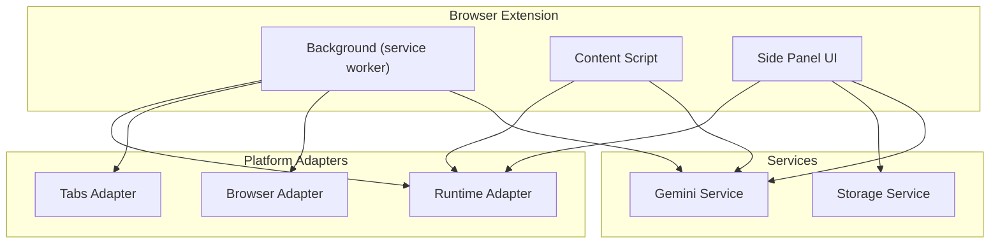
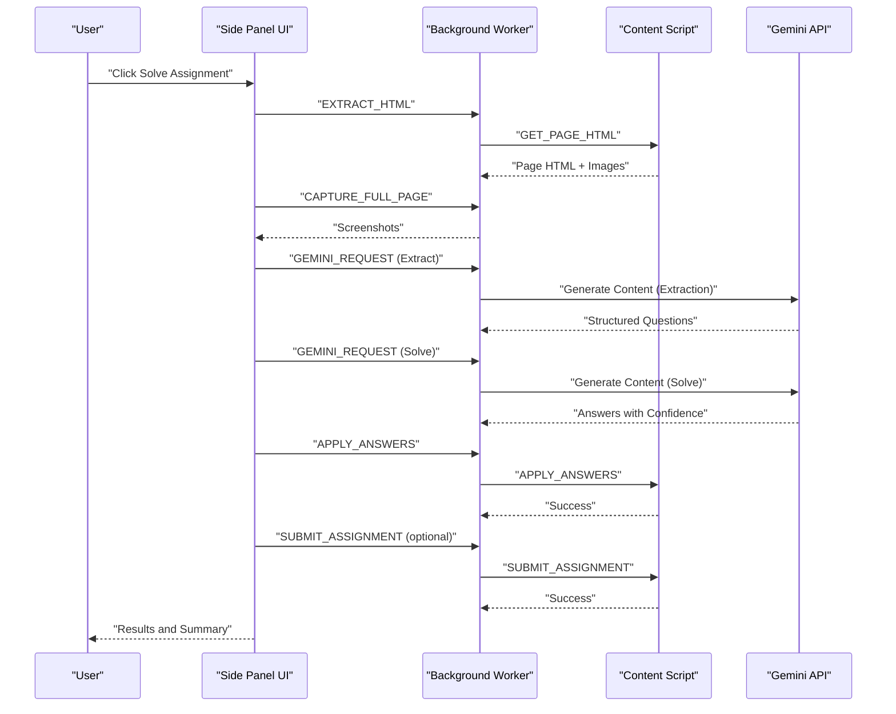
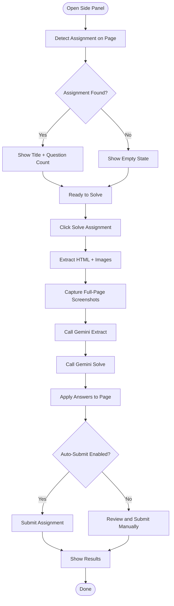
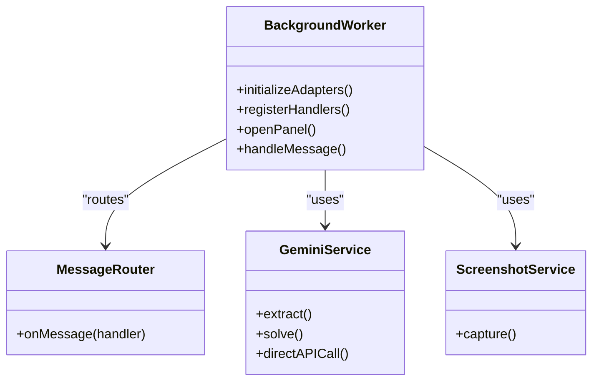
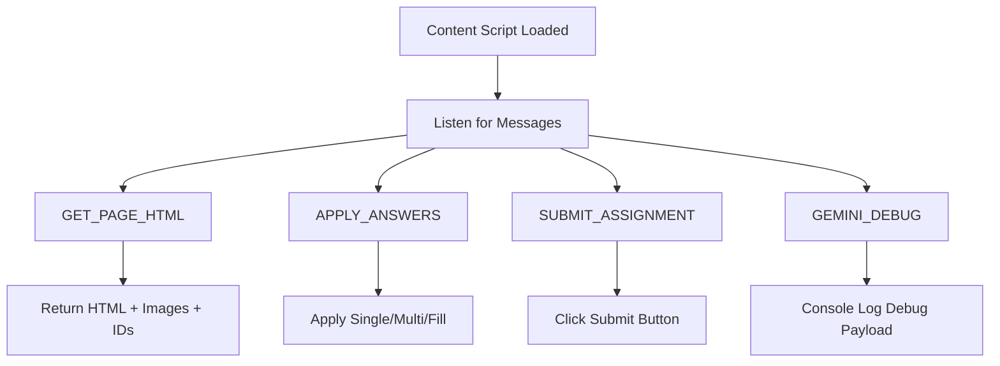
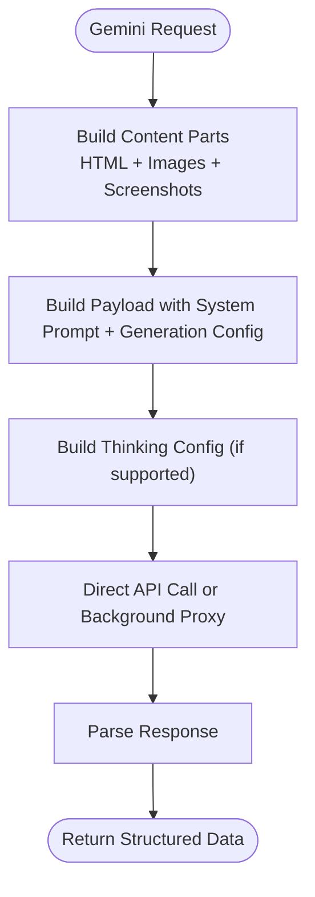
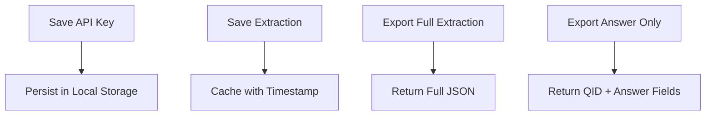
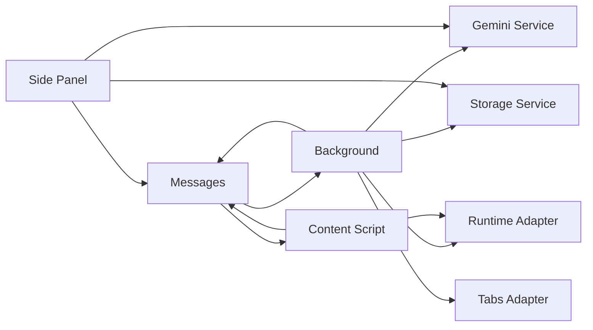

# Extension overview

## Introduction
The Assignment Solver is a browser extension designed to assist with online assignments on MOOC platforms such as NPTEL and Coursera. It integrates with Google's Gemini AI to extract, analyze, and solve assessment questions. The extension supports dual modes, Study Hints and Auto-Solve, and handles multiple question types (single-choice, multi-choice, fill-in-the-blank, and image-based). It emphasizes privacy by keeping processing client-side and allowing users to bring their own API key (BYOK). Additional capabilities include full-page screenshot capture, export functionality, and cross-browser compatibility for Chrome and Firefox.

## Project structure
The extension follows a modular architecture organized by responsibility:
- src/background: Service worker and message routing
- src/content: Content script for DOM extraction and answer application
- src/ui: Side panel UI and controllers
- src/services: Business logic (Gemini integration, storage)
- src/platform: Cross-browser adapters and runtime utilities
- src/core: Shared types, messages, and logging
- public: Static assets (side panel HTML/CSS/icons)

```mermaid
graph TB
subgraph "Browser Extension"
BG["Background (service worker)"]
CS["Content Script"]
SP["Side Panel UI"]
end
subgraph "Platform Adapters"
RT["Runtime Adapter"]
TB["Tabs Adapter"]
BR["Browser Adapter"]
end
subgraph "Services"
GS["Gemini Service"]
ST["Storage Service"]
end
SP --> RT
SP --> ST
SP --> GS
BG --> RT
BG --> TB
BG --> BR
BG --> GS
CS --> RT
CS --> GS
```

## Core components
- Dual-mode operation:
  - Study Hints: Retrieve explanations and reasoning without revealing direct answers.
  - Auto-Solve: Automatically extract, analyze, fill, and submit assignments.
- Supported question types:
  - Single-choice (radio)
  - Multi-choice (checkbox)
  - Fill-in-the-blank (text/number input)
  - Image-based (full-page screenshots and embedded images are included in prompts)
- Privacy-first client-side processing:
  - API key stored locally and never sent to third-party servers.
  - All AI requests are made directly to Google's Gemini endpoints.
- BYOK and export:
  - Users configure their own Gemini API key in the side panel.
  - Export options include full extraction and answer-only exports.
- Cross-browser compatibility:
  - Unified browser API via webextension-polyfill.
  - Separate manifests for Chrome (side panel) and Firefox (sidebar action).

## Architecture overview
The extension communicates through a well-defined message bus between the side panel, background service worker, and content script. The background worker coordinates tasks, captures screenshots, and orchestrates Gemini API calls. The content script interacts with the assignment page to extract HTML and apply answers. The side panel provides user controls and displays progress/results.

```mermaid
sequenceDiagram
participant User as "User"
participant SidePanel as "Side Panel UI"
participant BG as "Background Worker"
participant CS as "Content Script"
participant Gemini as "Gemini API"
User->>SidePanel : "Click Solve Assignment"
SidePanel->>BG : "EXTRACT_HTML"
BG->>CS : "GET_PAGE_HTML"
CS-->>BG : "Page HTML + Images"
SidePanel->>BG : "CAPTURE_FULL_PAGE"
BG-->>SidePanel : "Screenshots"
SidePanel->>BG : "GEMINI_REQUEST (Extract)"
BG->>Gemini : "Generate Content (Extraction)"
Gemini-->>BG : "Structured Questions"
SidePanel->>BG : "GEMINI_REQUEST (Solve)"
BG->>Gemini : "Generate Content (Solve)"
Gemini-->>BG : "Answers with Confidence"
SidePanel->>BG : "APPLY_ANSWERS"
BG->>CS : "APPLY_ANSWERS"
CS-->>BG : "Success"
SidePanel->>BG : "SUBMIT_ASSIGNMENT (optional)"
BG->>CS : "SUBMIT_ASSIGNMENT"
CS-->>BG : "Success"
SidePanel-->>User : "Results and Summary"
```

## Detailed component analysis

### Side panel UI and controllers
The side panel provides a guided workflow:
- Assignment detection and display of title/count
- Solve button with auto-submit toggle
- Progress steps (Extract → Analyze → Fill → Submit)
- Results display with AI reasoning and confidence
- Settings modal for API key and model selection

```mermaid
flowchart TD
Start(["Open Side Panel"]) --> Detect["Detect Assignment on Page"]
Detect --> IsDetected{"Assignment Found?"}
IsDetected --> |Yes| ShowInfo["Show Title + Question Count"]
IsDetected --> |No| ShowEmpty["Show Empty State"]
ShowInfo --> Ready["Ready to Solve"]
ShowEmpty --> Ready
Ready --> ClickSolve["Click Solve Assignment"]
ClickSolve --> Extract["Extract HTML + Images"]
Extract --> Screenshots["Capture Full-Page Screenshots"]
Screenshots --> GeminiExtract["Call Gemini Extract"]
GeminiExtract --> GeminiSolve["Call Gemini Solve"]
GeminiSolve --> Apply["Apply Answers to Page"]
Apply --> AutoSubmit{"Auto-Submit Enabled?"}
AutoSubmit --> |Yes| Submit["Submit Assignment"]
AutoSubmit --> |No| ManualSubmit["Review and Submit Manually"]
Submit --> Results["Show Results"]
ManualSubmit --> Results
Results --> End(["Done"])
```

### Background service worker
The background worker initializes platform adapters, registers message handlers, and manages extension lifecycle:
- Health checks, page info retrieval, screenshot capture
- Routing messages to appropriate handlers
- Opening/closing the side panel and responding to icon clicks

```mermaid
classDiagram
class BackgroundWorker {
+initializeAdapters()
+registerHandlers()
+openPanel()
+handleMessage()
}
class MessageRouter {
+onMessage(handler)
}
class GeminiService {
+extract()
+solve()
+directAPICall()
}
class ScreenshotService {
+capture()
}
BackgroundWorker --> MessageRouter : "routes"
BackgroundWorker --> GeminiService : "uses"
BackgroundWorker --> ScreenshotService : "uses"
```

### Content script
The content script runs on assignment pages and handles DOM interactions:
- Extracts page HTML and images
- Captures scroll info and scrolls to positions for screenshots
- Applies answers (radio, checkbox, text input)
- Submits assignments and relays debug info

```mermaid
flowchart TD
Init["Content Script Loaded"] --> Listen["Listen for Messages"]
Listen --> OnExtract["GET_PAGE_HTML"]
OnExtract --> ReturnHTML["Return HTML + Images + IDs"]
Listen --> OnApply["APPLY_ANSWERS"]
OnApply --> ApplyLogic["Apply Single/Multi/Fill"]
Listen --> OnSubmit["SUBMIT_ASSIGNMENT"]
OnSubmit --> ClickSubmit["Click Submit Button"]
Listen --> OnDebug["GEMINI_DEBUG"]
OnDebug --> ConsoleLog["Console Log Debug Payload"]
```

### Gemini service
The Gemini service constructs prompts and payloads, manages thinking budgets, and performs direct API calls:
- Builds content parts from HTML, images, screenshots, and extracted data
- Configures reasoning levels and thinking budgets per model family
- Calls Gemini with extraction and solving schemas
- Parses responses and surfaces errors

```mermaid
flowchart TD
Start(["Gemini Request"]) --> BuildParts["Build Content Parts<br/>HTML + Images + Screenshots"]
BuildParts --> BuildPayload["Build Payload with System Prompt + Generation Config"]
BuildPayload --> ThinkConfig["Build Thinking Config (if supported)"]
ThinkConfig --> APICall["Direct API Call or Background Proxy"]
APICall --> Parse["Parse Response"]
Parse --> Done(["Return Structured Data"])
```

### Storage and export
The storage service persists keys, caches extractions, and supports export:
- API key storage in local storage
- Extraction cache with timestamps
- Export formats: full extraction and answer-only export

```mermaid
flowchart TD
SaveKey["Save API Key"] --> LocalStore["Persist in Local Storage"]
CacheExtraction["Save Extraction"] --> CacheStore["Cache with Timestamp"]
ExportFull["Export Full Extraction"] --> JSONFull["Return Full JSON"]
ExportAnswers["Export Answer Only"] --> JSONAnswers["Return QID + Answer Fields"]
```

## Dependency analysis
- Cross-browser compatibility is achieved via webextension-polyfill and platform adapters.
- Message routing centralizes background handlers and ensures async responses are handled safely.
- UI state management tracks processing state and current extraction for rendering.

```mermaid
graph LR
SP["Side Panel"] --> MSG["Messages"]
BG["Background"] --> MSG
CS["Content Script"] --> MSG
MSG --> BG
MSG --> CS
BG --> GS["Gemini Service"]
BG --> ST["Storage Service"]
BG --> RT["Runtime Adapter"]
BG --> TB["Tabs Adapter"]
CS --> RT
SP --> ST
SP --> GS
```

## Performance considerations
- Rate limiting and delays:
  - 500ms delay between answer API calls
  - 200ms delay between DOM operations
- Recursive splitting:
  - Automatic splitting of HTML and question sets to avoid MAX_TOKENS errors
- Thinking budgets:
  - Configurable reasoning levels mapped to token budgets per model family
- Screenshot capture:
  - Full-page screenshots are captured and sent to Gemini to improve accuracy for image-based questions

[No sources needed since this section provides general guidance]

## Troubleshooting guide
Common issues and resolutions:
- Could not get page HTML: Ensure you are on a valid assignment page and refresh.
- Question container not found: Re-extract questions; check console for details.
- API Key invalid: Verify the key at Google AI Studio and ensure it has Gemini access.
- Answers not being applied: Some platforms use custom components; inspect console and apply answers individually.
- Rate limit errors: Wait before retrying, consider upgrading quota, or reduce concurrent questions.

## Conclusion
The Assignment Solver extension provides a reliable, privacy-focused solution for automated assignment assistance on MOOC platforms. Its dual-mode operation, multi-format question support, and client-side processing with BYOK make it suitable for both learning and automation. The modular architecture, cross-browser compatibility, and thoughtful error handling contribute to a reliable user experience.
