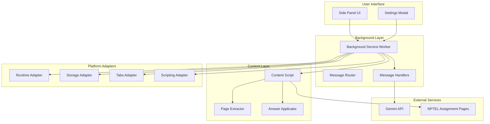

# Installation and Setup

<cite>
**Referenced Files in This Document**
- [README.md](file://assignment-solver/README.md)
- [package.json](file://assignment-solver/package.json)
- [vite.config.js](file://assignment-solver/vite.config.js)
- [manifest.config.js](file://assignment-solver/manifest.config.js)
- [manifest.json](file://assignment-solver/manifest.json)
- [sidepanel.html](file://assignment-solver/public/sidepanel.html)
- [index.js](file://assignment-solver/src/ui/index.js)
- [index.js](file://assignment-solver/src/background/index.js)
- [index.js](file://assignment-solver/src/content/index.js)
- [index.js](file://assignment-solver/src/services/gemini/index.js)
- [browser.js](file://assignment-solver/src/platform/browser.js)
- [runtime.js](file://assignment-solver/src/platform/runtime.js)
- [storage.js](file://assignment-solver/src/platform/storage.js)
</cite>

## Table of Contents
1. [Introduction](#introduction)
2. [Prerequisites](#prerequisites)
3. [Step-by-Step Installation](#step-by-step-installation)
4. [Build System and Cross-Browser Compatibility](#build-system-and-cross-browser-compatibility)
5. [API Key Configuration](#api-key-configuration)
6. [Permissions and Security](#permissions-and-security)
7. [Development Mode](#development-mode)
8. [Troubleshooting Common Issues](#troubleshooting-common-issues)
9. [Architecture Overview](#architecture-overview)
10. [Conclusion](#conclusion)

## Introduction
This guide provides comprehensive installation and setup instructions for the Assignment Solver browser extension. It covers prerequisites, step-by-step installation for Chrome and Firefox, build system details using Vite, dynamic manifest generation for cross-browser compatibility, API key configuration, permissions, and troubleshooting.

## Prerequisites
Before installing the extension, ensure you have:
- Bun package manager installed
- A Gemini API key from Google AI Studio
- Chrome (version 116+) or Firefox (version 121+) for development and testing

These requirements are documented in the project's README under the prerequisites section.

**Section sources**
- [README.md](file://assignment-solver/README.md#L24-L28)

## Step-by-Step Installation

### 1. Clone and Setup
- Clone the repository and navigate to the assignment-solver directory
- Install dependencies using Bun

```bash
git clone <repository-url>
cd assignment-solver
bun install
```

**Section sources**
- [README.md](file://assignment-solver/README.md#L32-L38)

### 2. Build the Extension
The project supports building for both browsers or individually:
- Build for both browsers
- Build for Chrome only
- Build for Firefox only

```bash
# Build for both browsers
bun run build

# Build for Chrome
bun run build:chrome

# Build for Firefox
bun run build:firefox
```

The build scripts are defined in the package.json file.

**Section sources**
- [README.md](file://assignment-solver/README.md#L40-L49)
- [package.json](file://assignment-solver/package.json#L6-L13)

### 3. Load in Browser

#### Chrome
- Open Chrome and navigate to chrome://extensions/
- Enable Developer mode (toggle in top-right corner)
- Click Load unpacked
- Select the dist/chrome/ folder

#### Firefox
- Open Firefox and navigate to about:debugging
- Click This Firefox
- Click Load Temporary Add-on
- Select any file from the dist/firefox/ folder (e.g., manifest.json)

**Section sources**
- [README.md](file://assignment-solver/README.md#L51-L66)

### 4. Configure API Key
- Click the extension icon to open the side panel
- Click Settings button
- Enter your Gemini API key
- Click Save Key

The side panel UI initializes and loads the API key on startup. The settings controller manages saving and retrieving the key from local storage.

**Section sources**
- [README.md](file://assignment-solver/README.md#L67-L73)
- [index.js](file://assignment-solver/src/ui/index.js#L91-L96)
- [index.js](file://assignment-solver/src/ui/index.js#L102-L106)

## Build System and Cross-Browser Compatibility

### Vite Configuration
The project uses Vite for building the extension with a custom plugin system:
- Dynamic manifest generation based on browser target
- Transformations for sidepanel.html script paths
- Aliased module resolution for clean imports
- Environment-specific defines for browser and version

Key aspects of the Vite configuration:
- Mode-based browser selection (chrome or firefox)
- Conditional input selection for background, content, and UI bundles
- Asset output configuration with CSS and JS bundling
- Define constants for browser and version information

**Section sources**
- [vite.config.js](file://assignment-solver/vite.config.js#L54-L107)

### Dynamic Manifest Generation
The build system generates separate manifests for Chrome and Firefox:
- Chrome uses side_panel API and action defaults
- Firefox uses sidebar_action API and gecko settings
- Host permissions include both NPTEL domains and Gemini API endpoints
- Content security policy restricts connections to Gemini API

The manifest generator creates browser-specific configurations while maintaining shared base properties.

**Section sources**
- [manifest.config.js](file://assignment-solver/manifest.config.js#L14-L104)
- [manifest.json](file://assignment-solver/manifest.json#L1-L44)

### Cross-Browser Compatibility
The extension achieves compatibility through:
- Unified browser API via webextension-polyfill
- Platform adapters for runtime, storage, tabs, and scripting
- Optional API detection for browser-specific features
- Conditional logic in platform detection utilities

**Section sources**
- [browser.js](file://assignment-solver/src/platform/browser.js#L1-L86)
- [runtime.js](file://assignment-solver/src/platform/runtime.js#L1-L32)
- [storage.js](file://assignment-solver/src/platform/storage.js#L1-L42)

## API Key Configuration

### Storage and Retrieval
The extension stores the Gemini API key securely in browser storage:
- Uses webextension-polyfill for cross-browser storage compatibility
- Retrieves key on side panel initialization
- Provides settings interface for updating the key

### Gemini Service Integration
The Gemini service handles API communication:
- Direct API calls bypassing message channels for reliability
- Configurable models and reasoning levels
- Response parsing and error handling
- Content assembly supporting HTML, images, and screenshots

**Section sources**
- [index.js](file://assignment-solver/src/services/gemini/index.js#L302-L339)
- [index.js](file://assignment-solver/src/services/gemini/index.js#L145-L217)
- [index.js](file://assignment-solver/src/services/gemini/index.js#L228-L297)

## Permissions and Security

### Required Permissions
The extension requests minimal, justified permissions:
- activeTab: Access current tab for content extraction and modification
- scripting: Inject content script for page interaction
- storage: Store API key locally
- sidePanel (Chrome) / sidebarAction (Firefox): Display the extension UI
- host_permissions: Connect to NPTEL domains and Gemini API

### Security Considerations
- API key stored locally only (browser.storage.local)
- All processing occurs client-side or via official Gemini API
- Content Security Policy restricts connections to Gemini API
- BYOK (Bring Your Own Key) model ensures no server-side data collection

**Section sources**
- [README.md](file://assignment-solver/README.md#L291-L311)
- [manifest.config.js](file://assignment-solver/manifest.config.js#L25-L46)

## Development Mode

### Watch Mode
The project supports hot reloading for both browsers:
- Chrome development: bun run dev:chrome
- Firefox development: bun run dev:firefox

The development scripts use Vite's watch mode with browser-specific builds.

### Build Process Details
The build process involves:
1. Background script compilation (service worker)
2. Content script compilation (DOM interaction)
3. UI bundle compilation (side panel)
4. Manifest generation for target browser
5. Asset optimization and output to dist/{browser}

**Section sources**
- [README.md](file://assignment-solver/README.md#L74-L84)
- [package.json](file://assignment-solver/package.json#L7-L10)
- [vite.config.js](file://assignment-solver/vite.config.js#L58-L66)

## Troubleshooting Common Issues

### API Key Problems
- Verify key validity in Google AI Studio
- Ensure Gemini API access is enabled for the key
- Check for extra spaces when pasting the key
- Confirm the key is saved in the extension settings

### Browser-Specific Issues
- Chrome: Ensure Developer mode is enabled in chrome://extensions/
- Firefox: Use about:debugging to load temporary add-on
- Both: Clear browser cache and reload extension after updates

### Content Extraction Failures
- Verify you're on an actual assignment page
- Ensure the page is fully loaded before extraction
- Check console for detailed error information
- Some platforms may require selector adjustments

### Performance and Rate Limiting
- Free Gemini API has usage limits
- Consider upgrading quota for heavy usage
- Reduce concurrent operations during peak hours
- Monitor rate limit warnings in the UI

**Section sources**
- [README.md](file://assignment-solver/README.md#L259-L289)

## Architecture Overview

The extension follows a modular architecture with clear separation of concerns:



**Diagram sources**
- [index.js](file://assignment-solver/src/ui/index.js#L54-L112)
- [index.js](file://assignment-solver/src/background/index.js#L21-L134)
- [index.js](file://assignment-solver/src/content/index.js#L12-L98)

The architecture ensures clean separation between UI, background logic, content interaction, and external services while maintaining cross-browser compatibility through platform adapters.

## Conclusion
This installation and setup guide provides everything needed to develop and deploy the Assignment Solver extension. The build system using Vite with dynamic manifest generation ensures seamless cross-browser compatibility, while the modular architecture promotes maintainability and extensibility. By following these steps and understanding the underlying architecture, developers can effectively contribute to and customize the extension for various educational platforms.