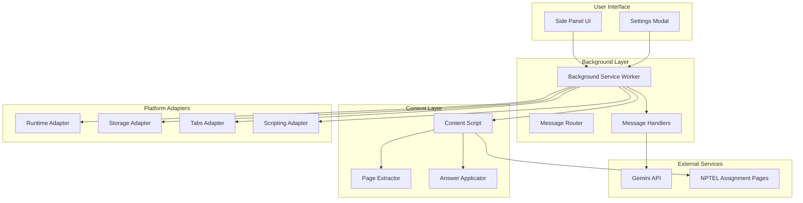

# Installation and setup

## Introduction
Install and build the Assignment Solver extension for Chrome and Firefox. Prerequisites, Vite builds, dynamic manifests, API key setup, permissions, and common install failures.

## Prerequisites
Before installing the extension, ensure you have:
- Bun package manager installed
- A Gemini API key from Google AI Studio
- Chrome (version 116+) or Firefox (version 121+) for development and testing

These requirements are documented in the project's README under the prerequisites section.

## Step-by-Step installation

### 1. clone and setup
- Clone the repository and navigate to the assignment-solver directory
- Install dependencies using Bun

```bash
git clone https://github.com/tashifkhan/MOOC-utils
cd MOOC-utils/assignment-solver
bun install
```

### 2. build the extension
The project supports building for both browsers or individually:
- Build for both browsers
- Build for Chrome only
- Build for Firefox only

```bash
# Build for both browsers
bun run build

# Build for Chrome
bun run build:chrome

# Build for Firefox
bun run build:firefox
```

The build scripts are defined in the package.json file.

### 3. load in browser

#### Chrome
- Open Chrome and navigate to chrome://extensions/
- Enable Developer mode (toggle in top-right corner)
- Click Load unpacked
- Select the dist/chrome/ folder

#### Firefox
- Open Firefox and navigate to about:debugging
- Click This Firefox
- Click Load Temporary Add-on
- Select any file from the dist/firefox/ folder (e.g., manifest.json)

### 4. configure API key
- Click the extension icon to open the side panel
- Click Settings button
- Enter your Gemini API key
- Click Save Key

The side panel UI initializes and loads the API key on startup. The settings controller manages saving and retrieving the key from local storage.

## Build system and cross-browser compatibility

### Vite configuration
The project uses Vite for building the extension with a custom plugin system:
- Dynamic manifest generation based on browser target
- Transformations for sidepanel.html script paths
- Aliased module resolution for clean imports
- Environment-specific defines for browser and version

Key aspects of the Vite configuration:
- Mode-based browser selection (chrome or firefox)
- Conditional input selection for background, content, and UI bundles
- Asset output configuration with CSS and JS bundling
- Define constants for browser and version information

### Dynamic manifest generation
The build system generates separate manifests for Chrome and Firefox:
- Chrome uses side_panel API and action defaults
- Firefox uses sidebar_action API and gecko settings
- Host permissions include both NPTEL domains and Gemini API endpoints
- Content security policy restricts connections to Gemini API

The manifest generator creates browser-specific configurations and keeps shared base properties.

### Cross-Browser compatibility
The extension achieves compatibility through:
- Unified browser API via webextension-polyfill
- Platform adapters for runtime, storage, tabs, and scripting
- Optional API detection for browser-specific features
- Conditional logic in platform detection utilities

## API key configuration

### Storage and retrieval
The extension stores the Gemini API key securely in browser storage:
- Uses webextension-polyfill for cross-browser storage compatibility
- Retrieves key on side panel initialization
- Provides settings interface for updating the key

### Gemini service integration
The Gemini service handles API communication:
- Direct API calls bypassing message channels for reliability
- Configurable models and reasoning levels
- Response parsing and error handling
- Content assembly supporting HTML, images, and screenshots

## Permissions and security

### Required permissions
The extension requests minimal, justified permissions:
- activeTab: Access current tab for content extraction and modification
- scripting: Inject content script for page interaction
- storage: Store API key locally
- sidePanel (Chrome) / sidebarAction (Firefox): Display the extension UI
- host_permissions: Connect to NPTEL domains and Gemini API

### Security considerations
- API key stored locally only (browser.storage.local)
- All processing occurs client-side or via official Gemini API
- Content Security Policy restricts connections to Gemini API
- BYOK (Bring Your Own Key) model keeps no server-side data collection

## Development mode

### Watch mode
The project supports hot reloading for both browsers:
- Chrome development: bun run dev:chrome
- Firefox development: bun run dev:firefox

The development scripts use Vite's watch mode with browser-specific builds.

### Build process details
The build process involves:
1. Background script compilation (service worker)
2. Content script compilation (DOM interaction)
3. UI bundle compilation (side panel)
4. Manifest generation for target browser
5. Asset optimization and output to dist/{browser}

## Troubleshooting common issues

### API key problems
- Verify key validity in Google AI Studio
- Ensure Gemini API access is enabled for the key
- Check for extra spaces when pasting the key
- Confirm the key is saved in the extension settings

### Browser-Specific issues
- Chrome: Ensure Developer mode is enabled in chrome://extensions/
- Firefox: Use about:debugging to load temporary add-on
- Both: Clear browser cache and reload extension after updates

### Content extraction failures
- Verify you're on an actual assignment page
- Ensure the page is fully loaded before extraction
- Check console for detailed error information
- Some platforms may require selector adjustments

### Performance and rate limiting
- Free Gemini API has usage limits
- Consider upgrading quota for heavy usage
- Reduce concurrent operations during peak hours
- Monitor rate limit warnings in the UI

## Architecture overview

Extension layers:


```mermaid
graph TB
subgraph "User Interface"
SP[Side Panel UI]
Settings[Settings Modal]
end
subgraph "Background Layer"
BG[Background Service Worker]
Router[Message Router]
Handlers[Message Handlers]
end
subgraph "Content Layer"
CS[Content Script]
Extractor[Page Extractor]
Applicator[Answer Applicator]
end
subgraph "Platform Adapters"
Runtime[Runtime Adapter]
Storage[Storage Adapter]
Tabs[Tabs Adapter]
Scripting[Scripting Adapter]
end
subgraph "External Services"
Gemini[Gemini API]
NPTEL[NPTEL Assignment Pages]
end
SP --> BG
Settings --> BG
BG --> CS
BG --> Runtime
BG --> Storage
BG --> Tabs
BG --> Scripting
CS --> Extractor
CS --> Applicator
BG --> Handlers
Handlers --> Gemini
CS --> NPTEL
```

UI, background, content, and services stay separate. Platform adapters carry Chrome vs Firefox differences.

## Conclusion
Build with Vite, load the dist folder, set the Gemini key in the panel. Manifest generation is what keeps Chrome and Firefox packs in sync.
