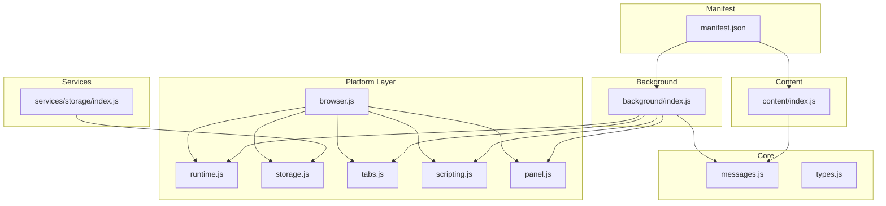
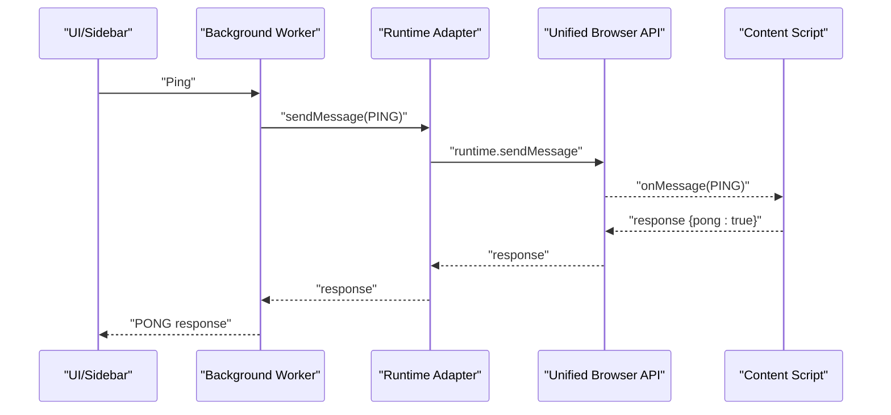
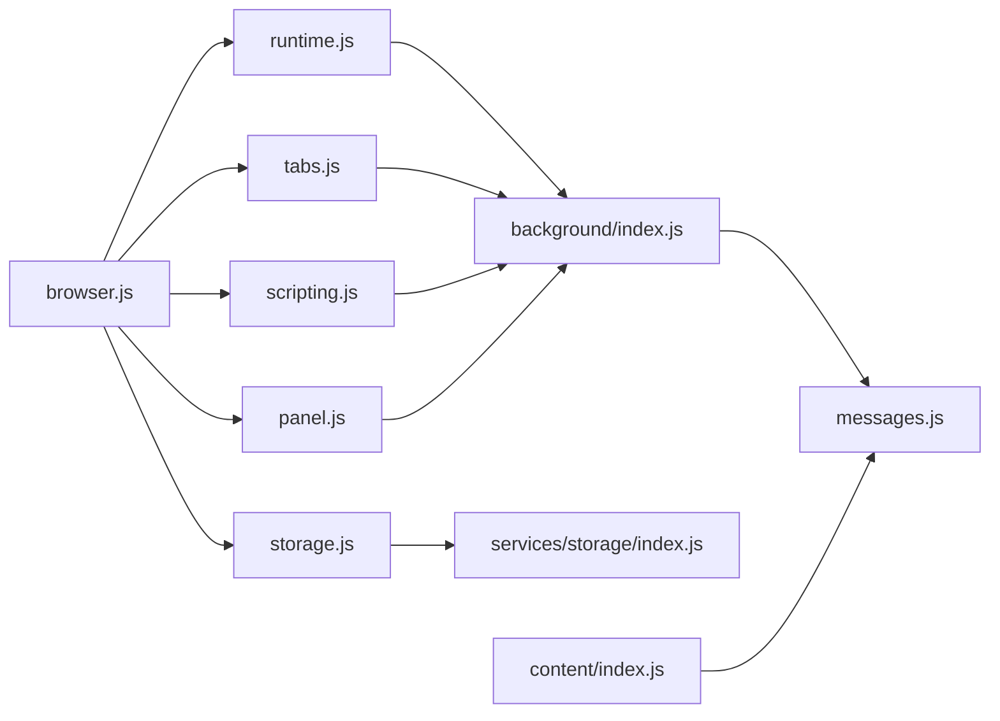

# Platform Abstraction

<cite>
**Referenced Files in This Document**
- [browser.js](file://assignment-solver/src/platform/browser.js)
- [runtime.js](file://assignment-solver/src/platform/runtime.js)
- [storage.js](file://assignment-solver/src/platform/storage.js)
- [tabs.js](file://assignment-solver/src/platform/tabs.js)
- [scripting.js](file://assignment-solver/src/platform/scripting.js)
- [panel.js](file://assignment-solver/src/platform/panel.js)
- [messages.js](file://assignment-solver/src/core/messages.js)
- [types.js](file://assignment-solver/src/core/types.js)
- [index.js (Background)](file://assignment-solver/src/background/index.js)
- [index.js (Content)](file://assignment-solver/src/content/index.js)
- [manifest.json](file://assignment-solver/manifest.json)
- [package.json](file://assignment-solver/package.json)
- [storage-service.js](file://assignment-solver/src/services/storage/index.js)
</cite>

## Table of Contents
1. [Introduction](#introduction)
2. [Project Structure](#project-structure)
3. [Core Components](#core-components)
4. [Architecture Overview](#architecture-overview)
5. [Detailed Component Analysis](#detailed-component-analysis)
6. [Dependency Analysis](#dependency-analysis)
7. [Performance Considerations](#performance-considerations)
8. [Troubleshooting Guide](#troubleshooting-guide)
9. [Conclusion](#conclusion)
10. [Appendices](#appendices)

## Introduction
This document describes the platform abstraction layer that ensures cross-browser compatibility for the extension. It documents the browser API adapters for Chrome and Firefox, the storage abstraction using webextension-polyfill, tab management utilities, and runtime communication. The layer hides browser-specific differences behind a unified interface, enabling consistent functionality across Chrome and Firefox while allowing future extensions to additional browsers.

## Project Structure
The platform abstraction resides under the platform directory and integrates with core messaging, background workers, content scripts, and services. The manifest defines permissions and entry points, while the package file includes the webextension-polyfill dependency.

**Diagram sources**
- [browser.js](file://assignment-solver/src/platform/browser.js#L1-L86)
- [runtime.js](file://assignment-solver/src/platform/runtime.js#L1-L32)
- [storage.js](file://assignment-solver/src/platform/storage.js#L1-L42)
- [tabs.js](file://assignment-solver/src/platform/tabs.js#L1-L53)
- [scripting.js](file://assignment-solver/src/platform/scripting.js#L1-L28)
- [panel.js](file://assignment-solver/src/platform/panel.js#L1-L119)
- [messages.js](file://assignment-solver/src/core/messages.js#L1-L96)
- [types.js](file://assignment-solver/src/core/types.js#L1-L64)
- [index.js (Background)](file://assignment-solver/src/background/index.js#L1-L135)
- [index.js (Content)](file://assignment-solver/src/content/index.js#L1-L99)
- [manifest.json](file://assignment-solver/manifest.json#L1-L44)

**Section sources**
- [browser.js](file://assignment-solver/src/platform/browser.js#L1-L86)
- [manifest.json](file://assignment-solver/manifest.json#L1-L44)
- [package.json](file://assignment-solver/package.json#L1-L30)

## Core Components
- Unified browser API via webextension-polyfill
- Runtime adapter for message passing
- Storage adapter for local persistence
- Tabs adapter for tab queries and content messaging
- Scripting adapter for programmatic script execution
- Panel adapter abstracting side panel vs sidebar differences
- Message types and retry logic for robust runtime communication

Key responsibilities:
- Hide browser-specific APIs behind a stable interface
- Provide safe API access helpers and availability checks
- Encapsulate cross-browser differences (e.g., side panel vs sidebar)
- Offer dependency injection-friendly adapters for background/content services

**Section sources**
- [browser.js](file://assignment-solver/src/platform/browser.js#L1-L86)
- [runtime.js](file://assignment-solver/src/platform/runtime.js#L1-L32)
- [storage.js](file://assignment-solver/src/platform/storage.js#L1-L42)
- [tabs.js](file://assignment-solver/src/platform/tabs.js#L1-L53)
- [scripting.js](file://assignment-solver/src/platform/scripting.js#L1-L28)
- [panel.js](file://assignment-solver/src/platform/panel.js#L1-L119)
- [messages.js](file://assignment-solver/src/core/messages.js#L1-L96)

## Architecture Overview
The platform abstraction layer sits between the background/service worker and content scripts, and between services and the browser APIs. It exposes adapters that encapsulate browser differences and provide a uniform contract for higher-level components.

**Diagram sources**
- [runtime.js](file://assignment-solver/src/platform/runtime.js#L12-L31)
- [messages.js](file://assignment-solver/src/core/messages.js#L47-L95)
- [index.js (Background)](file://assignment-solver/src/background/index.js#L46-L50)
- [index.js (Content)](file://assignment-solver/src/content/index.js#L20-L30)

## Detailed Component Analysis

### Browser API Polyfill and Detection
- Provides a unified browser.* API via webextension-polyfill
- Detects Chrome vs Firefox using optional API presence
- Offers safe accessors for optional APIs and availability checks

Implementation highlights:
- Browser detection uses feature checks for sidePanel and sidebarAction
- Optional API accessor resolves dot-separated paths safely
- Availability checker returns boolean for optional APIs

Guidelines:
- Always import the polyfilled browser instance
- Use availability checks for optional APIs
- Prefer optional API accessors for forward compatibility

**Section sources**
- [browser.js](file://assignment-solver/src/platform/browser.js#L1-L86)

### Runtime Communication Adapter
- Wraps browser.runtime.sendMessage and onMessage
- Enables dependency injection for background/content communication
- Used by higher-level services and UI components

Usage pattern:
- Inject runtime adapter into services
- Send typed messages and handle responses
- Register listeners for incoming messages

**Section sources**
- [runtime.js](file://assignment-solver/src/platform/runtime.js#L1-L32)
- [messages.js](file://assignment-solver/src/core/messages.js#L1-L96)
- [index.js (Background)](file://assignment-solver/src/background/index.js#L46-L50)
- [index.js (Content)](file://assignment-solver/src/content/index.js#L20-L30)

### Storage Abstraction
- Wraps browser.storage.local for get/set/remove
- Provides a stable interface for persistent data
- Used by the storage service for API keys, caches, and user answers

Best practices:
- Use the adapter for all storage operations
- Keep payloads small and structured
- Clear caches when appropriate

**Section sources**
- [storage.js](file://assignment-solver/src/platform/storage.js#L1-L42)
- [storage-service.js](file://assignment-solver/src/services/storage/index.js#L1-L119)

### Tabs Management Utilities
- Queries tabs and retrieves individual tab metadata
- Sends messages to content scripts in target tabs
- Captures visible tab screenshots

Integration:
- Background uses tabs adapter to target content scripts
- Content script listens for tab-specific commands
- Supports capture-visible-tab for screenshot workflows

**Section sources**
- [tabs.js](file://assignment-solver/src/platform/tabs.js#L1-L53)
- [index.js (Background)](file://assignment-solver/src/background/index.js#L61-L64)
- [index.js (Content)](file://assignment-solver/src/content/index.js#L32-L41)

### Scripting API Adapter
- Executes scripts in target tabs or frames
- Supports function execution and external file injection
- Used for DOM manipulation and answer application

Operational notes:
- Options include target, func, args, and files
- Returns execution results per target

**Section sources**
- [scripting.js](file://assignment-solver/src/platform/scripting.js#L1-L28)
- [index.js (Background)](file://assignment-solver/src/background/index.js#L103-L112)

### Panel Abstraction (Side Panel vs Sidebar)
- Unifies Chrome sidePanel and Firefox sidebarAction
- Provides open/close operations and behavior configuration
- Includes availability checks and browser-specific type identification

Behavioral differences handled:
- Chrome supports sidePanel.open with tab targeting and optional close
- Firefox uses sidebarAction.open/close; behavior setting is Chrome-only
- Panel type returned as "sidepanel" or "sidebar" for UI logic

**Section sources**
- [panel.js](file://assignment-solver/src/platform/panel.js#L1-L119)
- [browser.js](file://assignment-solver/src/platform/browser.js#L19-L39)

### Runtime Communication and Message Flow
- Defines message types and helpers for constructing messages
- Implements retry logic for transient connection errors
- Ensures robust communication between UI, background, and content scripts

Retry logic specifics:
- Retries on specific connection error patterns
- Exponential backoff-like delays
- Fails fast for non-transient errors

**Section sources**
- [messages.js](file://assignment-solver/src/core/messages.js#L1-L96)
- [index.js (Background)](file://assignment-solver/src/background/index.js#L46-L50)
- [index.js (Content)](file://assignment-solver/src/content/index.js#L20-L30)

### Cross-Browser Differences and Consistency
- Manifest permissions and entry points differ slightly between browsers
- Side panel vs sidebar requires adapter abstraction
- Optional APIs are guarded with availability checks

Consistency guarantees:
- Same adapter interfaces across browsers
- Feature detection for optional capabilities
- Stable message contracts and types

**Section sources**
- [panel.js](file://assignment-solver/src/platform/panel.js#L98-L114)
- [browser.js](file://assignment-solver/src/platform/browser.js#L57-L85)
- [manifest.json](file://assignment-solver/manifest.json#L6-L29)

## Dependency Analysis
The platform adapters depend on the unified browser API and are consumed by background workers, content scripts, and services. The storage service depends on the storage adapter. The runtime adapter is central to message routing.

**Diagram sources**
- [browser.js](file://assignment-solver/src/platform/browser.js#L1-L86)
- [runtime.js](file://assignment-solver/src/platform/runtime.js#L1-L32)
- [storage.js](file://assignment-solver/src/platform/storage.js#L1-L42)
- [tabs.js](file://assignment-solver/src/platform/tabs.js#L1-L53)
- [scripting.js](file://assignment-solver/src/platform/scripting.js#L1-L28)
- [panel.js](file://assignment-solver/src/platform/panel.js#L1-L119)
- [index.js (Background)](file://assignment-solver/src/background/index.js#L1-L135)
- [index.js (Content)](file://assignment-solver/src/content/index.js#L1-L99)
- [storage-service.js](file://assignment-solver/src/services/storage/index.js#L1-L119)
- [messages.js](file://assignment-solver/src/core/messages.js#L1-L96)

**Section sources**
- [package.json](file://assignment-solver/package.json#L15-L20)
- [browser.js](file://assignment-solver/src/platform/browser.js#L1-L16)

## Performance Considerations
- Prefer batching storage writes when possible
- Use tab queries with narrow filters to reduce overhead
- Avoid repeated availability checks in tight loops; cache results if needed
- Leverage retry logic judiciously to avoid excessive delays during initialization

## Troubleshooting Guide
Common issues and resolutions:
- Connection errors during message sending: The retry mechanism handles transient failures; inspect logs for repeated "Receiving end does not exist" patterns
- Missing side panel/sidebar: Verify availability via adapter and ensure correct permissions in the manifest
- Optional API unavailability: Guard with hasAPI checks and provide fallback behavior
- Initialization timing: Firefox background may require extra time; rely on retry logic and ensure proper message routing registration

**Section sources**
- [messages.js](file://assignment-solver/src/core/messages.js#L35-L95)
- [panel.js](file://assignment-solver/src/platform/panel.js#L98-L114)
- [browser.js](file://assignment-solver/src/platform/browser.js#L57-L85)
- [manifest.json](file://assignment-solver/manifest.json#L6-L12)

## Conclusion
The platform abstraction layer successfully isolates browser-specific concerns behind stable adapters. By using webextension-polyfill and feature detection, it maintains consistent functionality across Chrome and Firefox. The design supports dependency injection, robust messaging, and graceful handling of optional features, laying a solid foundation for extending support to additional browsers.

## Appendices

### Extending Support to Additional Browsers
Guidelines:
- Add feature detection for new browser APIs alongside existing checks
- Introduce a new adapter or extend an existing one if semantics differ
- Update availability checks and fallback logic
- Verify manifest permissions and entry points for the target browser
- Test messaging, panel/sidebar behavior, and optional API usage

Reference points:
- Browser detection and optional API accessors
- Panel adapter as a model for handling differing APIs
- Manifest permissions and entry points

**Section sources**
- [browser.js](file://assignment-solver/src/platform/browser.js#L19-L85)
- [panel.js](file://assignment-solver/src/platform/panel.js#L1-L119)
- [manifest.json](file://assignment-solver/manifest.json#L6-L29)