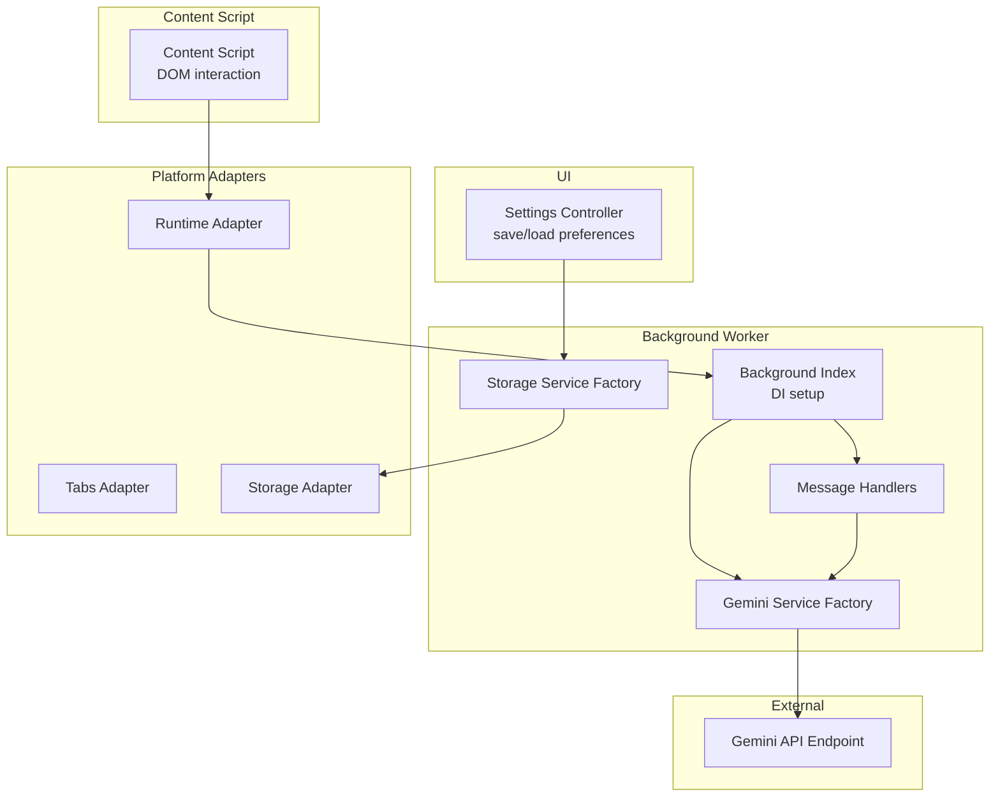
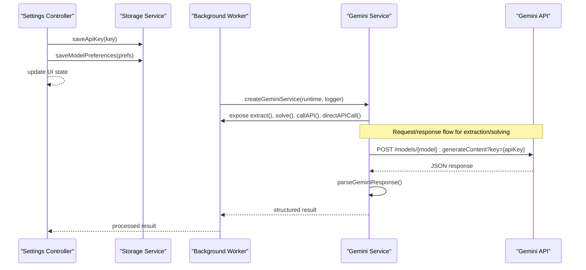
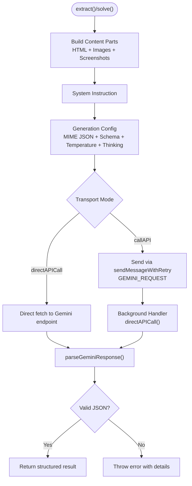
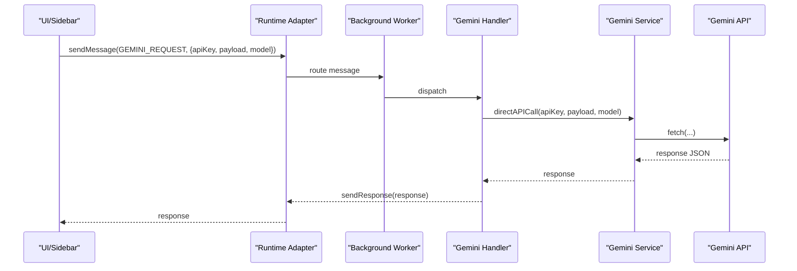
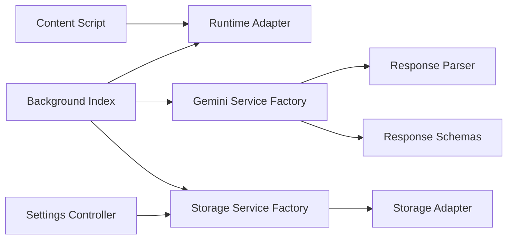

# Services Layer

<cite>
**Referenced Files in This Document**
- [index.js](file://assignment-solver/src/services/gemini/index.js)
- [parser.js](file://assignment-solver/src/services/gemini/parser.js)
- [schema.js](file://assignment-solver/src/services/gemini/schema.js)
- [storage/index.js](file://assignment-solver/src/services/storage/index.js)
- [messages.js](file://assignment-solver/src/core/messages.js)
- [background/index.js](file://assignment-solver/src/background/index.js)
- [handlers/gemini.js](file://assignment-solver/src/background/handlers/gemini.js)
- [storage.js](file://assignment-solver/src/platform/storage.js)
- [runtime.js](file://assignment-solver/src/platform/runtime.js)
- [tabs.js](file://assignment-solver/src/platform/tabs.js)
- [content/index.js](file://assignment-solver/src/content/index.js)
- [settings.js](file://assignment-solver/src/ui/controllers/settings.js)
</cite>

## Table of Contents
1. [Introduction](#introduction)
2. [Project Structure](#project-structure)
3. [Core Components](#core-components)
4. [Architecture Overview](#architecture-overview)
5. [Detailed Component Analysis](#detailed-component-analysis)
6. [Dependency Analysis](#dependency-analysis)
7. [Performance Considerations](#performance-considerations)
8. [Troubleshooting Guide](#troubleshooting-guide)
9. [Conclusion](#conclusion)
10. [Appendices](#appendices)

## Introduction
This document describes the services layer responsible for business logic in the assignment solver extension. It covers:
- Gemini AI integration: API key management, model selection, request/response handling, and answer parsing
- Local storage service for persisting user preferences and cached data
- Service architecture using factory patterns, dependency injection, and robust error handling
- Configuration options, rate limiting considerations, and integration examples with core extension components

## Project Structure
The services layer is organized around two primary service factories:
- Gemini service: orchestrates extraction and solving workflows with Google Generative Language API
- Storage service: manages API keys, cached extractions, user answers, and model preferences

These services integrate with platform adapters (browser APIs), background workers, content scripts, and UI controllers.

**Diagram sources**
- [background/index.js](file://assignment-solver/src/background/index.js#L32-L42)
- [storage/index.js](file://assignment-solver/src/services/storage/index.js#L12-L118)
- [index.js](file://assignment-solver/src/services/gemini/index.js#L60-L341)
- [storage.js](file://assignment-solver/src/platform/storage.js#L12-L41)
- [runtime.js](file://assignment-solver/src/platform/runtime.js#L12-L31)
- [tabs.js](file://assignment-solver/src/platform/tabs.js#L12-L52)
- [content/index.js](file://assignment-solver/src/content/index.js#L19-L96)

**Section sources**
- [background/index.js](file://assignment-solver/src/background/index.js#L32-L42)
- [storage/index.js](file://assignment-solver/src/services/storage/index.js#L12-L118)
- [index.js](file://assignment-solver/src/services/gemini/index.js#L60-L341)
- [storage.js](file://assignment-solver/src/platform/storage.js#L12-L41)
- [runtime.js](file://assignment-solver/src/platform/runtime.js#L12-L31)
- [tabs.js](file://assignment-solver/src/platform/tabs.js#L12-L52)
- [content/index.js](file://assignment-solver/src/content/index.js#L19-L96)

## Core Components
- Gemini Service Factory
  - Builds content with HTML, images, and screenshots
  - Configures reasoning budgets per model family
  - Sends requests via background worker or direct API
  - Parses structured JSON responses with multiple fallback strategies
- Storage Service Factory
  - Persists API key, cached extractions, user answers, and model preferences
  - Exports formatted answer sets for submission
- Platform Adapters
  - Runtime adapter for cross-browser messaging
  - Tabs adapter for tab queries and content messaging
  - Storage adapter for browser local storage
- Background Worker and Handlers
  - Initializes services and registers message handlers
  - Routes GEMINI_REQUEST to Gemini service
- UI Settings Controller
  - Loads and saves API key and model preferences
  - Updates UI to reflect reasoning budget mapping

**Section sources**
- [index.js](file://assignment-solver/src/services/gemini/index.js#L60-L341)
- [parser.js](file://assignment-solver/src/services/gemini/parser.js#L11-L102)
- [schema.js](file://assignment-solver/src/services/gemini/schema.js#L5-L135)
- [storage/index.js](file://assignment-solver/src/services/storage/index.js#L12-L118)
- [storage.js](file://assignment-solver/src/platform/storage.js#L12-L41)
- [runtime.js](file://assignment-solver/src/platform/runtime.js#L12-L31)
- [tabs.js](file://assignment-solver/src/platform/tabs.js#L12-L52)
- [background/index.js](file://assignment-solver/src/background/index.js#L32-L117)
- [handlers/gemini.js](file://assignment-solver/src/background/handlers/gemini.js#L12-L34)
- [settings.js](file://assignment-solver/src/ui/controllers/settings.js#L13-L127)

## Architecture Overview
The services layer follows a factory pattern with explicit dependency injection. Background worker initializes platform adapters and services, then registers message handlers. Content scripts communicate via the runtime adapter. The Gemini service encapsulates API concerns and response parsing, while the storage service centralizes persistence.

**Diagram sources**
- [background/index.js](file://assignment-solver/src/background/index.js#L32-L42)
- [index.js](file://assignment-solver/src/services/gemini/index.js#L145-L297)
- [parser.js](file://assignment-solver/src/services/gemini/parser.js#L11-L102)
- [settings.js](file://assignment-solver/src/ui/controllers/settings.js#L73-L94)

## Detailed Component Analysis

### Gemini Service Factory
Responsibilities:
- Build content parts from HTML, images, and screenshots
- Configure thinking/budget reasoning per model family
- Generate structured payloads with system instructions and response schemas
- Send requests via background worker with retry logic or directly for background-only calls
- Parse responses with multiple strategies and error reporting

Key behaviors:
- Reasoning budget mapping and model filtering for thinking support
- Payload construction with system instructions and response schemas
- Two transport modes:
  - callAPI: routed through background worker for UI-initiated requests
  - directAPICall: used by background worker to avoid message channel timeouts
- Robust parsing with multiple fallbacks and truncation repair

**Diagram sources**
- [index.js](file://assignment-solver/src/services/gemini/index.js#L145-L297)
- [index.js](file://assignment-solver/src/services/gemini/index.js#L302-L339)
- [parser.js](file://assignment-solver/src/services/gemini/parser.js#L11-L102)
- [messages.js](file://assignment-solver/src/core/messages.js#L47-L95)
- [handlers/gemini.js](file://assignment-solver/src/background/handlers/gemini.js#L15-L32)

**Section sources**
- [index.js](file://assignment-solver/src/services/gemini/index.js#L60-L341)
- [parser.js](file://assignment-solver/src/services/gemini/parser.js#L11-L102)
- [schema.js](file://assignment-solver/src/services/gemini/schema.js#L5-L135)
- [messages.js](file://assignment-solver/src/core/messages.js#L47-L95)
- [handlers/gemini.js](file://assignment-solver/src/background/handlers/gemini.js#L12-L34)

### Storage Service Factory
Responsibilities:
- Persist and retrieve API key
- Manage extraction cache with URL and timestamp
- Store and load user answers
- Save and load model preferences with defaults
- Export formatted answer sets for submission

Design highlights:
- Centralized persistence via storage adapter
- Defaults for model preferences if missing
- Export helpers for answer-only datasets

```mermaid
flowchart TD
SStart(["Storage Service Methods"]) --> APIKey{"API Key Ops"}
APIKey --> |Save| SaveKey["storage.set({geminiApiKey})"]
APIKey --> |Get| GetKey["storage.get('geminiApiKey')"]
APIKey --> |Remove| RemoveKey["storage.remove('geminiApiKey')"]
SStart --> Cache{"Extraction Cache"}
Cache --> |Save| SaveCache["storage.set({currentExtraction: {data, timestamp, url}})"]
Cache --> |Get| GetCache["storage.get('currentExtraction').data"]
Cache --> |Clear| ClearCache["storage.remove('currentExtraction')"]
SStart --> Answers{"User Answers"}
Answers --> |Save| SaveAns["storage.set({userAnswers})"]
Answers --> |Get| GetAns["storage.get('userAnswers') || {}"]
Answers --> |Clear| ClearAns["storage.remove('userAnswers')"]
SStart --> Pref{"Model Preferences"}
Pref --> |Save| SavePref["storage.set({modelPreferences})"]
Pref --> |Get| GetPref["storage.get('modelPreferences') || defaults"]
Pref --> Defaults["Default preferences if missing"]
SStart --> Export{"Exports"}
Export --> Full["getFullExtraction()"]
Export --> AnswerOnly["getAnswerOnlyExport()"]
```

**Diagram sources**
- [storage/index.js](file://assignment-solver/src/services/storage/index.js#L12-L118)
- [storage.js](file://assignment-solver/src/platform/storage.js#L12-L41)

**Section sources**
- [storage/index.js](file://assignment-solver/src/services/storage/index.js#L12-L118)
- [storage.js](file://assignment-solver/src/platform/storage.js#L12-L41)

### Background Worker and Handlers
Responsibilities:
- Initialize logger and platform adapters
- Create and wire services (Gemini, Screenshot)
- Register message router and handlers
- Route GEMINI_REQUEST to Gemini service for direct API calls

Integration points:
- Runtime adapter for cross-browser messaging
- Tabs adapter for tab queries and content messaging
- Gemini handler executes direct API calls from background context

**Diagram sources**
- [background/index.js](file://assignment-solver/src/background/index.js#L65-L68)
- [handlers/gemini.js](file://assignment-solver/src/background/handlers/gemini.js#L15-L32)
- [index.js](file://assignment-solver/src/services/gemini/index.js#L324-L339)
- [runtime.js](file://assignment-solver/src/platform/runtime.js#L19-L29)

**Section sources**
- [background/index.js](file://assignment-solver/src/background/index.js#L32-L117)
- [handlers/gemini.js](file://assignment-solver/src/background/handlers/gemini.js#L12-L34)
- [runtime.js](file://assignment-solver/src/platform/runtime.js#L12-L31)

### UI Settings Controller
Responsibilities:
- Load stored API key and model preferences into form controls
- Save API key and model preferences to storage
- Update UI labels reflecting reasoning budget mapping

Integration:
- Depends on storage service for persistence
- Drives model preference updates used by Gemini service

**Section sources**
- [settings.js](file://assignment-solver/src/ui/controllers/settings.js#L13-L127)
- [storage/index.js](file://assignment-solver/src/services/storage/index.js#L70-L85)

## Dependency Analysis
The services layer uses a clean dependency injection pattern:
- Background worker composes services with platform adapters
- Gemini service depends on runtime adapter for messaging and on parser/schema for response handling
- Storage service depends on storage adapter for persistence
- UI controller depends on storage service for settings

**Diagram sources**
- [background/index.js](file://assignment-solver/src/background/index.js#L24-L42)
- [index.js](file://assignment-solver/src/services/gemini/index.js#L60-L341)
- [parser.js](file://assignment-solver/src/services/gemini/parser.js#L11-L102)
- [schema.js](file://assignment-solver/src/services/gemini/schema.js#L5-L135)
- [storage/index.js](file://assignment-solver/src/services/storage/index.js#L12-L118)
- [storage.js](file://assignment-solver/src/platform/storage.js#L12-L41)
- [settings.js](file://assignment-solver/src/ui/controllers/settings.js#L13-L127)
- [content/index.js](file://assignment-solver/src/content/index.js#L19-L96)

**Section sources**
- [background/index.js](file://assignment-solver/src/background/index.js#L32-L42)
- [index.js](file://assignment-solver/src/services/gemini/index.js#L60-L341)
- [storage/index.js](file://assignment-solver/src/services/storage/index.js#L12-L118)
- [storage.js](file://assignment-solver/src/platform/storage.js#L12-L41)
- [settings.js](file://assignment-solver/src/ui/controllers/settings.js#L13-L127)
- [content/index.js](file://assignment-solver/src/content/index.js#L19-L96)

## Performance Considerations
- Thinking budget and reasoning levels
  - Gemini supports reasoning budgets for supported models; unsupported models skip thinking configuration
  - Budget mapping caps maximum thinking budget per reasoning level
- Image size handling
  - Large images are skipped to prevent exceeding API constraints
- Retry and connection resilience
  - Message sending includes exponential backoff for transient connection errors
- Direct API calls from background
  - Background worker uses direct fetch to bypass message channel timeouts

Recommendations:
- Prefer background-only direct calls for heavy payloads
- Monitor finish reasons and adjust reasoning levels to balance quality and cost
- Cache extractions to reduce redundant API calls

**Section sources**
- [index.js](file://assignment-solver/src/services/gemini/index.js#L32-L51)
- [index.js](file://assignment-solver/src/services/gemini/index.js#L112-L128)
- [messages.js](file://assignment-solver/src/core/messages.js#L47-L95)
- [handlers/gemini.js](file://assignment-solver/src/background/handlers/gemini.js#L20-L25)

## Troubleshooting Guide
Common issues and resolutions:
- API key errors
  - Ensure API key is saved via settings and retrieved by storage service
  - Verify model preferences are set appropriately
- Parsing failures
  - Parser attempts multiple strategies; check logs for trimmed content and finish reasons
  - For MAX_TOKENS, truncated JSON repair is attempted
- Connection errors
  - sendMessageWithRetry handles transient connection failures; inspect logs for repeated errors
- Blocked or empty responses
  - Blocked prompts surface block reasons; empty candidates trigger errors

Operational tips:
- Use GEMINI_DEBUG messages to inspect payloads in content scripts
- Confirm background worker initialization and handler registration
- Validate browser compatibility via platform adapters

**Section sources**
- [parser.js](file://assignment-solver/src/services/gemini/parser.js#L11-L102)
- [messages.js](file://assignment-solver/src/core/messages.js#L47-L95)
- [background/index.js](file://assignment-solver/src/background/index.js#L69-L102)
- [content/index.js](file://assignment-solver/src/content/index.js#L80-L86)

## Conclusion
The services layer cleanly separates AI orchestration, persistence, and platform integration through factory patterns and dependency injection. The Gemini service encapsulates API complexity with robust parsing and configuration, while the storage service centralizes user preferences and caches. The architecture supports cross-browser compatibility, resilient messaging, and extensible configuration for model selection and reasoning budgets.

## Appendices

### Configuration Options
- Model selection
  - Extraction model and solving model IDs
  - Reasoning levels: none, low, medium, high
- Defaults
  - Extraction model defaults to a supported 2.5-family model
  - Solving model defaults to a supported 3.0-family model
  - Reasoning levels default to high for both tasks

**Section sources**
- [storage/index.js](file://assignment-solver/src/services/storage/index.js#L70-L85)
- [index.js](file://assignment-solver/src/services/gemini/index.js#L16-L21)
- [index.js](file://assignment-solver/src/services/gemini/index.js#L151-L152)
- [index.js](file://assignment-solver/src/services/gemini/index.js#L233-L234)

### Rate Limiting Implementation
- Client-side retry with backoff for transient connection errors
- No explicit external API rate limiter is implemented in the services layer
- Consider server-side quotas and adjust request frequency accordingly

**Section sources**
- [messages.js](file://assignment-solver/src/core/messages.js#L47-L95)

### Integration Examples with Core Extension Components
- Settings controller
  - Saves API key and model preferences to storage service
  - Loads stored values into UI controls
- Background worker
  - Creates Gemini service with runtime adapter and logger
  - Registers GEMINI_REQUEST handler for direct API calls
- Content script
  - Receives UI commands and interacts with page DOM
  - Supports debug relaying for Gemini payloads

**Section sources**
- [settings.js](file://assignment-solver/src/ui/controllers/settings.js#L73-L94)
- [background/index.js](file://assignment-solver/src/background/index.js#L32-L68)
- [content/index.js](file://assignment-solver/src/content/index.js#L19-L96)