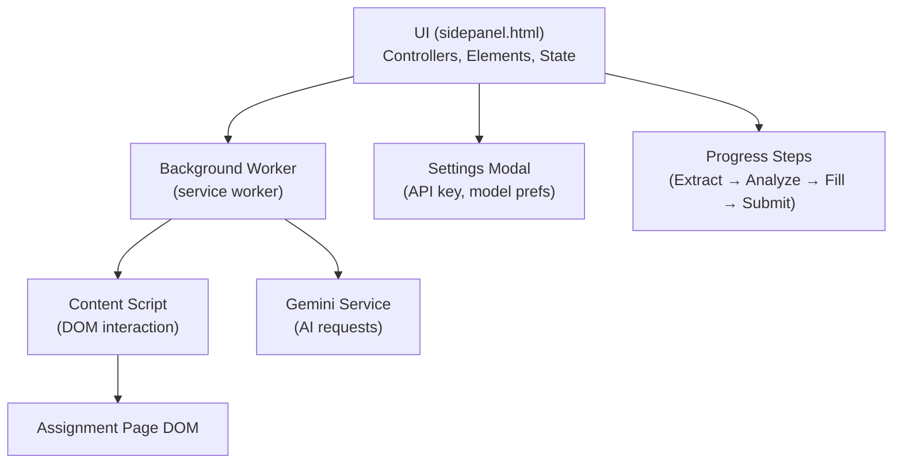
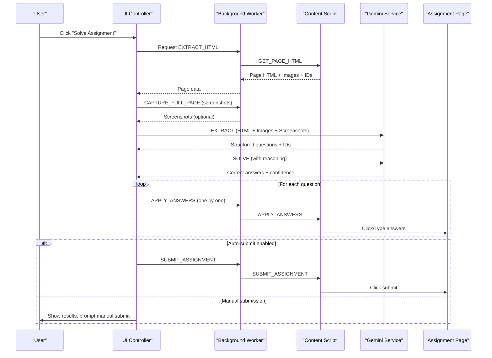
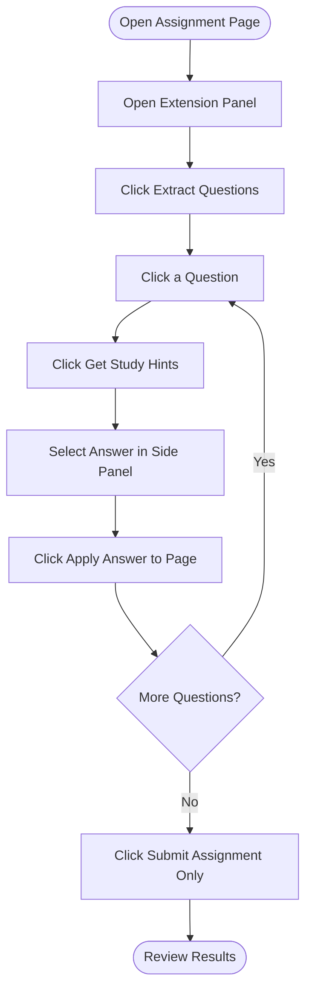
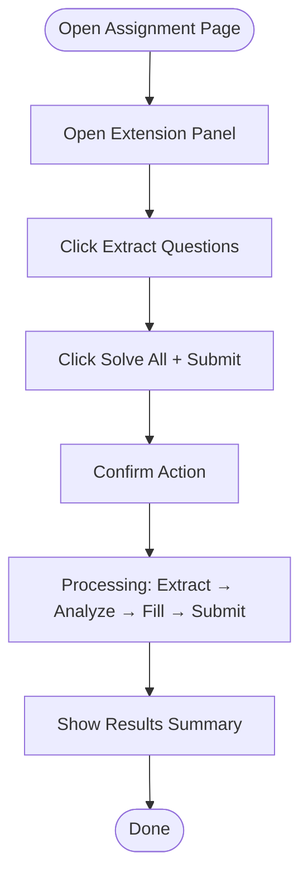
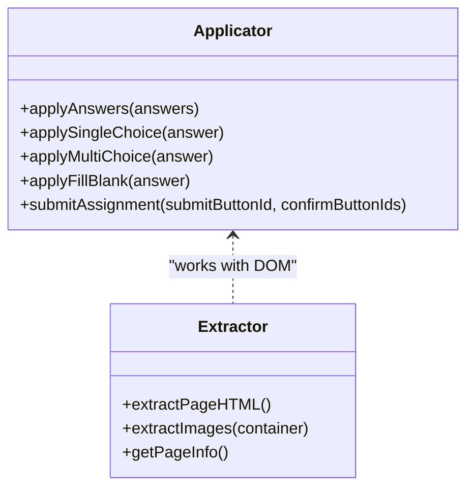
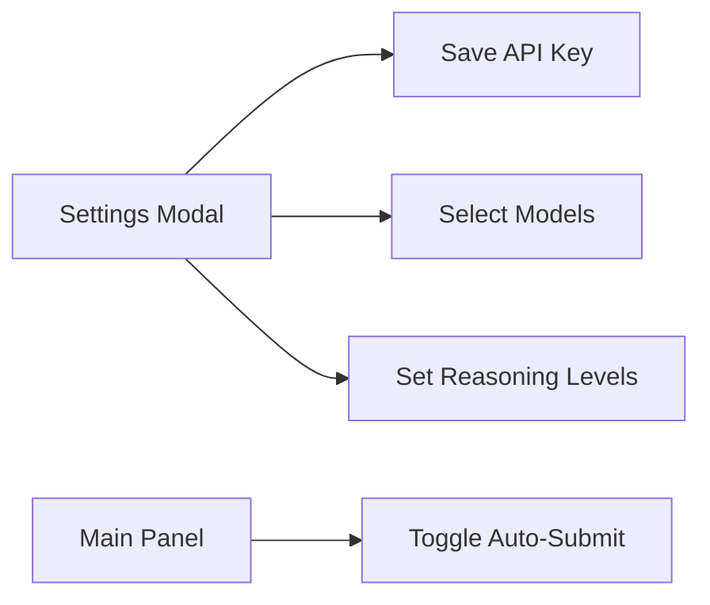
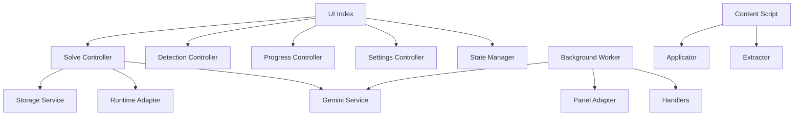

# Usage Guide

<cite>
**Referenced Files in This Document**
- [README.md](file://assignment-solver/README.md)
- [sidepanel.html](file://assignment-solver/public/sidepanel.html)
- [index.js](file://assignment-solver/src/ui/index.js)
- [elements.js](file://assignment-solver/src/ui/elements.js)
- [solve.js](file://assignment-solver/src/ui/controllers/solve.js)
- [settings.js](file://assignment-solver/src/ui/controllers/settings.js)
- [detection.js](file://assignment-solver/src/ui/controllers/detection.js)
- [state.js](file://assignment-solver/src/ui/state.js)
- [background/index.js](file://assignment-solver/src/background/index.js)
- [content/index.js](file://assignment-solver/src/content/index.js)
- [extractor.js](file://assignment-solver/src/content/extractor.js)
- [applicator.js](file://assignment-solver/src/content/applicator.js)
- [gemini/index.js](file://assignment-solver/src/services/gemini/index.js)
- [browser.js](file://assignment-solver/src/platform/browser.js)
- [page.tsx](file://website/app/assignment-solver/page.tsx)
- [extension-download.tsx](file://website/components/assignment-solver/extension-download.tsx)
</cite>

## Table of Contents
1. [Introduction](#introduction)
2. [Project Structure](#project-structure)
3. [Core Components](#core-components)
4. [Architecture Overview](#architecture-overview)
5. [Detailed Component Analysis](#detailed-component-analysis)
6. [Dependency Analysis](#dependency-analysis)
7. [Performance Considerations](#performance-considerations)
8. [Troubleshooting Guide](#troubleshooting-guide)
9. [Conclusion](#conclusion)
10. [Appendices](#appendices)

## Introduction
This guide explains how to use the Assignment Solver browser extension for MOOC platforms like NPTEL and SWAYAM. It covers both Manual Mode (recommended for learning) and Auto Mode (full automation), including step-by-step workflows, supported question types, configuration options, and best practices.

## Project Structure
The extension consists of:
- A side panel UI (React-like structure in HTML/CSS/JS) for user controls
- A background service worker orchestrating tasks and messaging
- A content script interacting with the assignment page
- Services for Gemini AI integration and local storage
- Platform adapters for cross-browser compatibility

**Diagram sources**
- [sidepanel.html](file://assignment-solver/public/sidepanel.html#L1-L392)
- [index.js](file://assignment-solver/src/ui/index.js#L1-L113)
- [background/index.js](file://assignment-solver/src/background/index.js#L1-L135)
- [content/index.js](file://assignment-solver/src/content/index.js#L1-L99)
- [gemini/index.js](file://assignment-solver/src/services/gemini/index.js#L1-L342)

**Section sources**
- [README.md](file://assignment-solver/README.md#L142-L160)
- [sidepanel.html](file://assignment-solver/public/sidepanel.html#L1-L392)

## Core Components
- UI entry and initialization: Sets up logging, adapters, services, state, and controllers; waits for background readiness; initializes event listeners and assignment detection.
- Controllers:
  - Solve controller: Orchestrates extraction, AI solving, answer filling, and optional submission.
  - Settings controller: Manages API key and model preferences.
  - Detection controller: Determines if the current page is an assignment and updates UI accordingly.
- Background worker: Routes messages to appropriate handlers, manages panel behavior, and coordinates with content script.
- Content script: Extracts page HTML/images, applies answers, and submits forms.
- Gemini service: Builds prompts, attaches images/screenshots, and calls the Gemini API.
- Platform adapters: Unified browser API access for Chrome/Firefox.

**Section sources**
- [index.js](file://assignment-solver/src/ui/index.js#L1-L113)
- [solve.js](file://assignment-solver/src/ui/controllers/solve.js#L1-L778)
- [settings.js](file://assignment-solver/src/ui/controllers/settings.js#L1-L128)
- [detection.js](file://assignment-solver/src/ui/controllers/detection.js#L1-L111)
- [background/index.js](file://assignment-solver/src/background/index.js#L1-L135)
- [content/index.js](file://assignment-solver/src/content/index.js#L1-L99)
- [gemini/index.js](file://assignment-solver/src/services/gemini/index.js#L1-L342)
- [browser.js](file://assignment-solver/src/platform/browser.js#L1-L86)

## Architecture Overview
End-to-end flow from UI to page automation:

**Diagram sources**
- [solve.js](file://assignment-solver/src/ui/controllers/solve.js#L44-L240)
- [background/index.js](file://assignment-solver/src/background/index.js#L44-L117)
- [content/index.js](file://assignment-solver/src/content/index.js#L20-L96)
- [gemini/index.js](file://assignment-solver/src/services/gemini/index.js#L145-L297)

## Detailed Component Analysis

### Manual Mode (Recommended for Learning)
Manual Mode lets you review each question, get hints, choose answers, and apply them one by one.

Basic steps:
1. Navigate to an assignment page on a supported MOOC platform.
2. Open the extension side panel.
3. Click Extract Questions to scan the page.
4. Click on a question to view details.
5. Click Get Study Hints to receive:
   - Key concepts being tested
   - Elimination tips for wrong answers
   - Common traps to avoid
   - What to verify before answering
6. Select your answer in the side panel.
7. Click Apply Answer to Page to fill it on the actual page.
8. Click Back to List and repeat for other questions.
9. When done, click Submit Assignment Only.

Supported question types:
- Single Choice: Radio button questions
- Multi Choice: Checkbox questions
- Fill-in-the-Blank: Text/number input fields

**Diagram sources**
- [README.md](file://assignment-solver/README.md#L109-L122)
- [sidepanel.html](file://assignment-solver/public/sidepanel.html#L64-L94)
- [solve.js](file://assignment-solver/src/ui/controllers/solve.js#L675-L775)
- [applicator.js](file://assignment-solver/src/content/applicator.js#L21-L48)

**Section sources**
- [README.md](file://assignment-solver/README.md#L102-L122)
- [sidepanel.html](file://assignment-solver/public/sidepanel.html#L64-L94)
- [applicator.js](file://assignment-solver/src/content/applicator.js#L21-L194)

### Auto Mode (Full Automation)
Auto Mode automatically solves all questions, fills answers, and submits (optional).

Basic steps:
1. Navigate to an assignment page.
2. Open the extension side panel.
3. Click Extract Questions to scan the page.
4. Click Solve All + Submit.
5. Confirm the action when prompted.
6. Wait for the process to complete:
   - AI analyzes each question
   - Answers are filled on the page
   - Submit button is clicked automatically
7. Review the summary and check the page.

**Diagram sources**
- [README.md](file://assignment-solver/README.md#L123-L133)
- [sidepanel.html](file://assignment-solver/public/sidepanel.html#L64-L94)
- [solve.js](file://assignment-solver/src/ui/controllers/solve.js#L44-L240)

**Section sources**
- [README.md](file://assignment-solver/README.md#L123-L133)
- [sidepanel.html](file://assignment-solver/public/sidepanel.html#L64-L94)
- [solve.js](file://assignment-solver/src/ui/controllers/solve.js#L44-L240)

### Supported Question Types and Application
- Single Choice: The content script clicks the correct radio button.
- Multi Choice: The content script checks all correct checkboxes and unchecks wrong ones.
- Fill-in-the-Blank: The content script types the answer and triggers input/change events.

**Diagram sources**
- [applicator.js](file://assignment-solver/src/content/applicator.js#L12-L221)
- [extractor.js](file://assignment-solver/src/content/extractor.js#L12-L241)

**Section sources**
- [README.md](file://assignment-solver/README.md#L134-L141)
- [applicator.js](file://assignment-solver/src/content/applicator.js#L21-L194)

### Configuration Options
- API Key Management:
  - Store your Gemini API key in the Settings modal.
  - The key is persisted locally and never sent to third-party servers.
- Model Selection:
  - Choose extraction and solving models from the Settings modal.
  - Adjust reasoning levels for extraction and solving.
- Auto-Submit:
  - Toggle Auto-submit answers in the main panel.

**Diagram sources**
- [settings.js](file://assignment-solver/src/ui/controllers/settings.js#L73-L94)
- [sidepanel.html](file://assignment-solver/public/sidepanel.html#L192-L380)

**Section sources**
- [README.md](file://assignment-solver/README.md#L240-L258)
- [settings.js](file://assignment-solver/src/ui/controllers/settings.js#L1-L128)
- [sidepanel.html](file://assignment-solver/public/sidepanel.html#L192-L380)

### Best Practices for Optimal Results
- Use Manual Mode for learning: Review AI hints and reasoning to understand concepts.
- Keep the assignment page fully loaded before extracting.
- Prefer stable models for extraction and higher-performance models for solving.
- If rate limits occur, reduce concurrent operations or upgrade your API quota.
- For platforms with custom UI components, apply answers one by one to isolate issues.

**Section sources**
- [README.md](file://assignment-solver/README.md#L253-L289)
- [gemini/index.js](file://assignment-solver/src/services/gemini/index.js#L14-L51)

## Dependency Analysis
- UI depends on:
  - State manager for processing flags and extraction data
  - Settings controller for API key and model preferences
  - Progress controller for step tracking
  - Detection controller for assignment presence
- Background worker depends on:
  - Message routing to handlers
  - Panel adapter for opening the side panel
  - Gemini service for AI requests
  - Content script handlers for DOM operations
- Content script depends on:
  - Extractor for page HTML and images
  - Applicator for applying answers and submitting

**Diagram sources**
- [index.js](file://assignment-solver/src/ui/index.js#L54-L112)
- [solve.js](file://assignment-solver/src/ui/controllers/solve.js#L74-L84)
- [background/index.js](file://assignment-solver/src/background/index.js#L24-L42)
- [content/index.js](file://assignment-solver/src/content/index.js#L15-L17)

**Section sources**
- [index.js](file://assignment-solver/src/ui/index.js#L1-L113)
- [background/index.js](file://assignment-solver/src/background/index.js#L1-L135)
- [content/index.js](file://assignment-solver/src/content/index.js#L1-L99)

## Performance Considerations
- Rate limiting:
  - 500 ms delay between answer API calls
  - 200 ms delay between DOM operations
- Recursive splitting:
  - Extraction and solving are retried with smaller chunks when exceeding token limits.
- Image and screenshot handling:
  - Large images are skipped to avoid API size limits.
- Model selection:
  - Choose models aligned with your needs and quotas.

**Section sources**
- [README.md](file://assignment-solver/README.md#L253-L257)
- [solve.js](file://assignment-solver/src/ui/controllers/solve.js#L252-L319)
- [gemini/index.js](file://assignment-solver/src/services/gemini/index.js#L112-L132)

## Troubleshooting Guide
Common issues and resolutions:
- Could not get page HTML:
  - Ensure you are on an actual assignment page and it is fully loaded.
  - Refresh the page and re-extract.
- Question container not found:
  - Re-extract questions; check console for detailed error info.
- API Key invalid:
  - Verify your key at Google AI Studio and ensure it has Gemini API access enabled.
- Answers not being applied:
  - Some platforms use custom input components; check browser console for errors.
  - Apply answers one at a time to identify problematic questions.
- Rate limit errors:
  - Wait a few minutes before retrying.
  - Consider upgrading your API quota or reducing the number of questions per session.

**Section sources**
- [README.md](file://assignment-solver/README.md#L259-L289)

## Conclusion
The Assignment Solver extension automates MOOC assignment completion while offering Manual Mode for deeper learning. By configuring your API key and models, you can tailor the extension to your workflow—either reviewing AI hints and answers step-by-step or fully automating extraction, solving, and submission.

## Appendices

### Installation and Setup
- Install the extension from the Chrome Web Store or load it manually from GitHub releases.
- After installation, open the side panel, go to Settings, enter your Gemini API key, and save.

**Section sources**
- [README.md](file://assignment-solver/README.md#L30-L73)
- [extension-download.tsx](file://website/components/assignment-solver/extension-download.tsx#L13-L114)
- [page.tsx](file://website/app/assignment-solver/page.tsx#L21-L43)

### UI Controls Reference
- Main panel:
  - Solve Assignment: Start the full automation pipeline.
  - Auto-submit answers: Toggle automatic submission.
- Settings modal:
  - Gemini API Key: Enter your API key.
  - Extraction Model and Solving Model: Choose models and reasoning levels.
- Progress steps:
  - Extract → Analyze → Fill → Submit

**Section sources**
- [sidepanel.html](file://assignment-solver/public/sidepanel.html#L64-L147)
- [settings.js](file://assignment-solver/src/ui/controllers/settings.js#L73-L94)