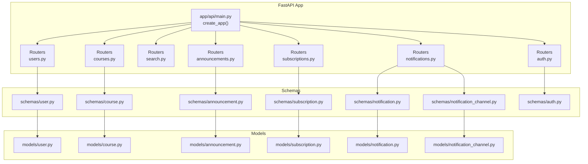
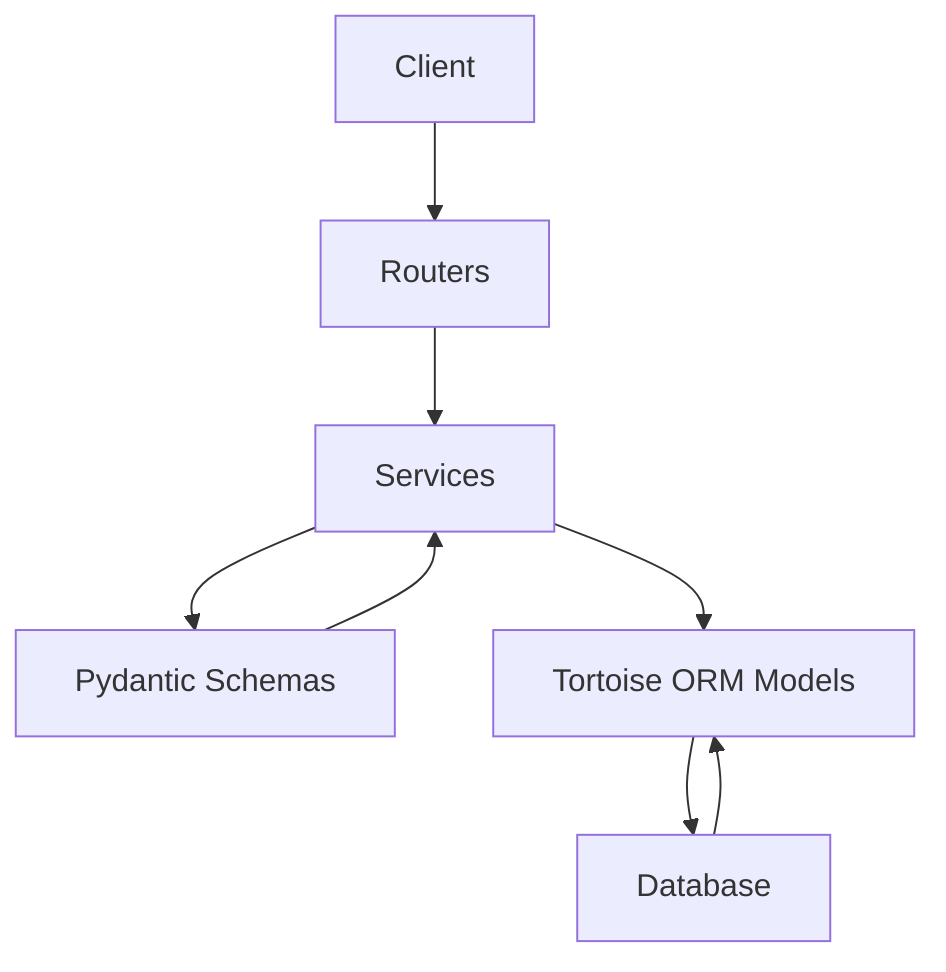
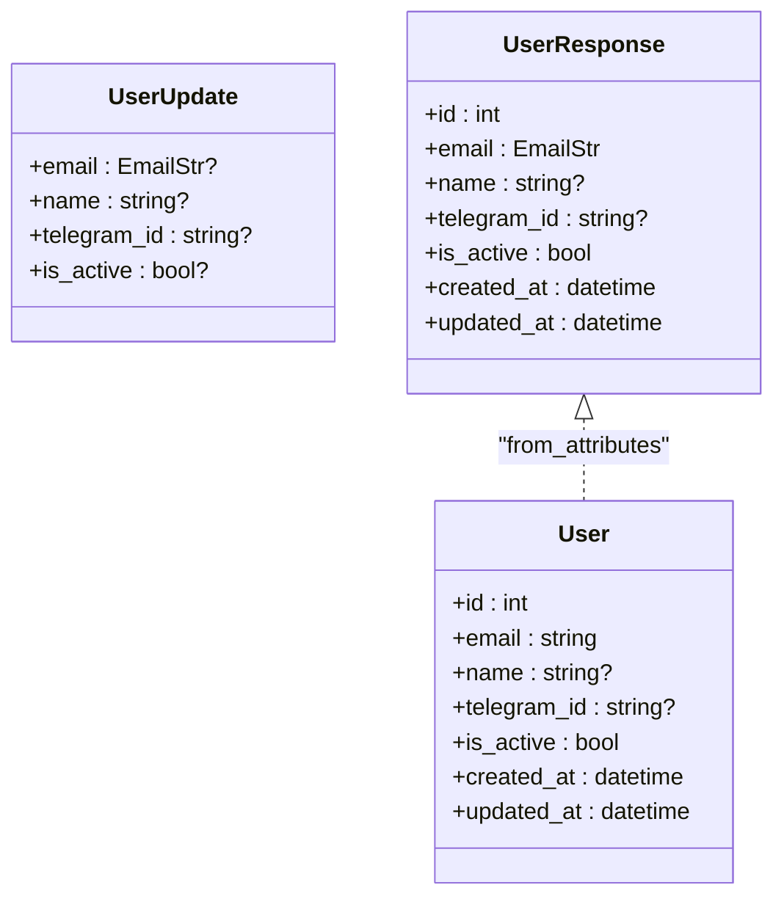
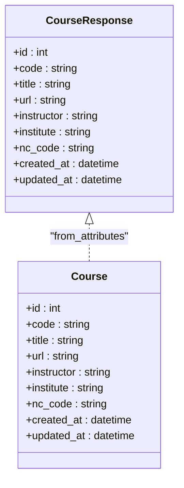
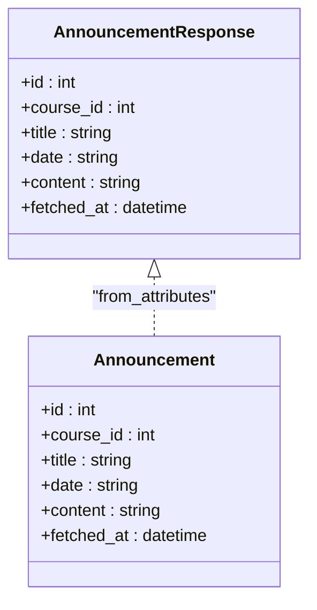
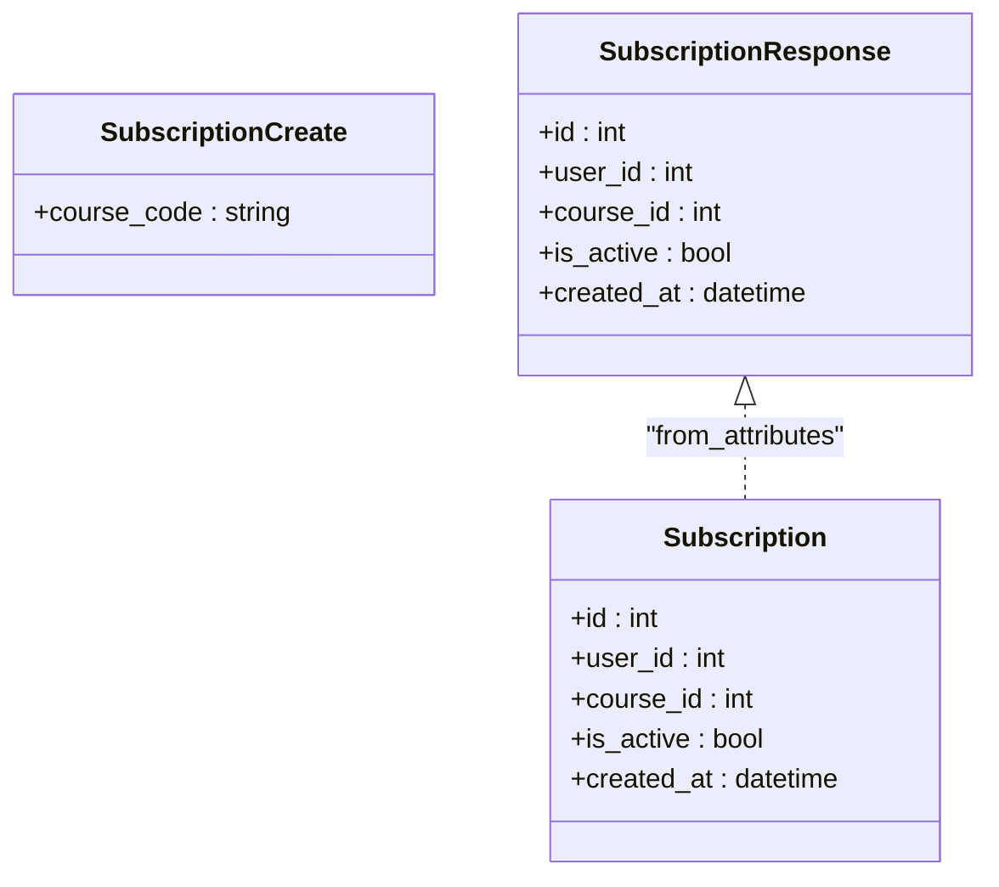
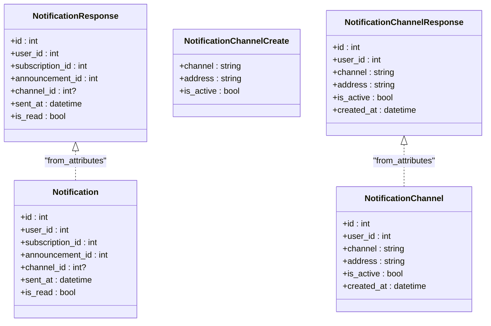
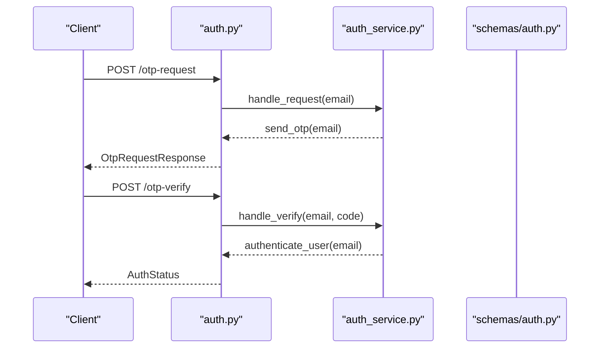
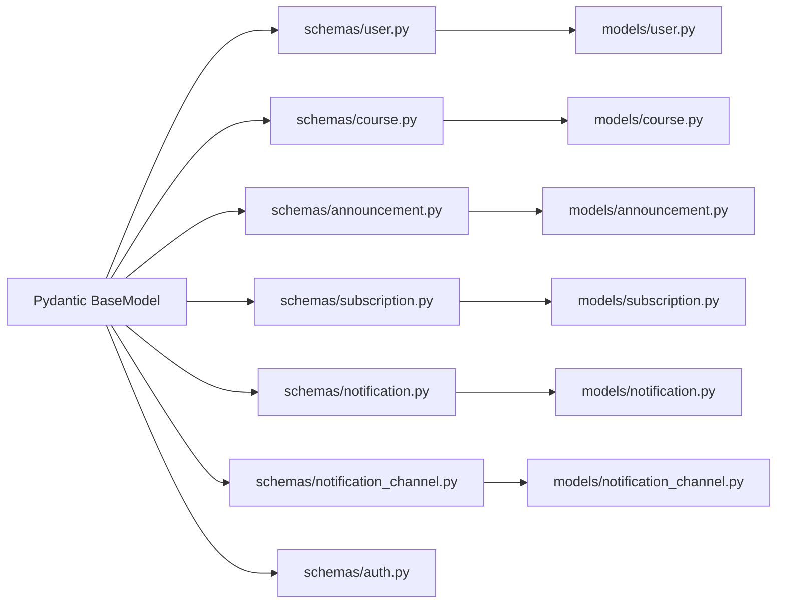

# API Schemas

<cite>
**Referenced Files in This Document**
- [app/api/main.py](file://notice-reminders/app/api/main.py)
- [pyproject.toml](file://notice-reminders/pyproject.toml)
- [app/schemas/__init__.py](file://notice-reminders/app/schemas/__init__.py)
- [app/schemas/user.py](file://notice-reminders/app/schemas/user.py)
- [app/schemas/course.py](file://notice-reminders/app/schemas/course.py)
- [app/schemas/announcement.py](file://notice-reminders/app/schemas/announcement.py)
- [app/schemas/subscription.py](file://notice-reminders/app/schemas/subscription.py)
- [app/schemas/notification.py](file://notice-reminders/app/schemas/notification.py)
- [app/schemas/notification_channel.py](file://notice-reminders/app/schemas/notification_channel.py)
- [app/schemas/auth.py](file://notice-reminders/app/schemas/auth.py)
- [app/models/user.py](file://notice-reminders/app/models/user.py)
- [app/models/course.py](file://notice-reminders/app/models/course.py)
- [app/models/announcement.py](file://notice-reminders/app/models/announcement.py)
- [app/models/subscription.py](file://notice-reminders/app/models/subscription.py)
- [app/models/notification.py](file://notice-reminders/app/models/notification.py)
- [app/models/notification_channel.py](file://notice-reminders/app/models/notification_channel.py)
</cite>

## Table of Contents
1. [Introduction](#introduction)
2. [Project Structure](#project-structure)
3. [Core Components](#core-components)
4. [Architecture Overview](#architecture-overview)
5. [Detailed Component Analysis](#detailed-component-analysis)
6. [Dependency Analysis](#dependency-analysis)
7. [Performance Considerations](#performance-considerations)
8. [Troubleshooting Guide](#troubleshooting-guide)
9. [Conclusion](#conclusion)
10. [Appendices](#appendices)

## Introduction
This document provides detailed API schema documentation for the Notice Reminders API built with FastAPI and Pydantic. It covers request and response schemas for:
- User operations
- Course search and management
- Announcement retrieval and filtering
- Subscription CRUD operations
- Notification delivery and status tracking
- Authentication flows

It also documents field validation rules, serialization/deserialization behavior, optional versus required fields, schema inheritance patterns, example payloads, validation error responses, schema evolution considerations, the relationship between database models and API schemas, data transformation patterns, and API versioning strategies.

## Project Structure
The API is organized around routers and schemas. The application factory registers routers and sets up CORS and database initialization. Schemas define request/response contracts, while Tortoise ORM models define persistence.

**Diagram sources**
- [app/api/main.py](file://notice-reminders/app/api/main.py#L17-L42)
- [app/schemas/user.py](file://notice-reminders/app/schemas/user.py#L1-L24)
- [app/schemas/course.py](file://notice-reminders/app/schemas/course.py#L1-L19)
- [app/schemas/announcement.py](file://notice-reminders/app/schemas/announcement.py#L1-L16)
- [app/schemas/subscription.py](file://notice-reminders/app/schemas/subscription.py#L1-L19)
- [app/schemas/notification.py](file://notice-reminders/app/schemas/notification.py#L1-L17)
- [app/schemas/notification_channel.py](file://notice-reminders/app/schemas/notification_channel.py#L1-L22)
- [app/schemas/auth.py](file://notice-reminders/app/schemas/auth.py#L1-L26)
- [app/models/user.py](file://notice-reminders/app/models/user.py#L1-L20)
- [app/models/course.py](file://notice-reminders/app/models/course.py#L1-L22)
- [app/models/announcement.py](file://notice-reminders/app/models/announcement.py#L1-L25)
- [app/models/subscription.py](file://notice-reminders/app/models/subscription.py#L1-L28)
- [app/models/notification.py](file://notice-reminders/app/models/notification.py#L1-L37)
- [app/models/notification_channel.py](file://notice-reminders/app/models/notification_channel.py#L1-L26)

**Section sources**
- [app/api/main.py](file://notice-reminders/app/api/main.py#L1-L46)
- [pyproject.toml](file://notice-reminders/pyproject.toml#L1-L41)

## Core Components
This section summarizes the primary Pydantic models grouped by functional area. Each model’s role, validation rules, and serialization behavior are described.

- User schemas
  - UserUpdate: Partial updates for user profile fields with optional fields for email, name, telegram_id, and is_active.
  - UserResponse: Complete user representation including identifiers, contact info, activity flag, and timestamps. Uses attribute-based serialization.

- Course schemas
  - CourseResponse: Course metadata including code, title, URL, instructor, institute, and NC code, plus creation/update timestamps. Uses attribute-based serialization.

- Announcement schemas
  - AnnouncementResponse: Announcement details linked to a course, including title, ISO date string, content, and fetch timestamp. Uses attribute-based serialization.

- Subscription schemas
  - SubscriptionCreate: Minimal input to subscribe to a course by course code.
  - SubscriptionResponse: Subscription record with foreign keys, activation flag, and timestamps. Uses attribute-based serialization.

- Notification schemas
  - NotificationResponse: Notification record with foreign keys to user, subscription, and announcement, optional channel reference, sent timestamp, and read flag. Uses attribute-based serialization.

- Notification Channel schemas
  - NotificationChannelCreate: Input to create a channel with channel type, address, and optional activation flag.
  - NotificationChannelResponse: Full channel record with foreign key, channel type, address, activation flag, and timestamps. Uses attribute-based serialization.

- Authentication schemas
  - OtpRequest: Request to initiate OTP for an email.
  - OtpVerify: Request to verify OTP with email and code.
  - AuthStatus: Response indicating authenticated user and whether the user was newly registered.
  - OtpRequestResponse: Confirmation of OTP initiation with message, new user flag, and expiration timestamp.

Validation rules and behaviors:
- Email fields use validated email types.
- Optional fields are union types with None where applicable.
- Attribute-based serialization is enabled via model configuration, aligning schema fields with ORM attributes.
- Unique constraints and indexes are defined in the database models (e.g., unique email, unique telegram_id, unique course code, unique channel+address per user).

**Section sources**
- [app/schemas/user.py](file://notice-reminders/app/schemas/user.py#L1-L24)
- [app/schemas/course.py](file://notice-reminders/app/schemas/course.py#L1-L19)
- [app/schemas/announcement.py](file://notice-reminders/app/schemas/announcement.py#L1-L16)
- [app/schemas/subscription.py](file://notice-reminders/app/schemas/subscription.py#L1-L19)
- [app/schemas/notification.py](file://notice-reminders/app/schemas/notification.py#L1-L17)
- [app/schemas/notification_channel.py](file://notice-reminders/app/schemas/notification_channel.py#L1-L22)
- [app/schemas/auth.py](file://notice-reminders/app/schemas/auth.py#L1-L26)

## Architecture Overview
The API follows a layered architecture:
- Routers expose endpoints and delegate to services.
- Schemas define request/response contracts and enable automatic validation and serialization.
- Services orchestrate business logic and interact with repositories backed by Tortoise ORM models.
- Models define database tables, relationships, and constraints.

**Diagram sources**
- [app/api/main.py](file://notice-reminders/app/api/main.py#L29-L35)
- [app/schemas/__init__.py](file://notice-reminders/app/schemas/__init__.py#L1-L2)
- [app/models/user.py](file://notice-reminders/app/models/user.py#L1-L20)

## Detailed Component Analysis

### User Operations
- Schema: UserUpdate and UserResponse
- Validation rules
  - Optional fields allow partial updates.
  - Email is validated; other fields are string-based.
- Serialization/deserialization
  - Attribute-based serialization enabled; schema fields mirror ORM attributes.
- Example payloads
  - Request (partial update): {"email": "updated@example.com", "name": "Updated Name"}
  - Response: {"id": 1, "email": "user@example.com", "name": "John Doe", "telegram_id": "tg123", "is_active": true, "created_at": "...", "updated_at": "..."}

**Diagram sources**
- [app/schemas/user.py](file://notice-reminders/app/schemas/user.py#L6-L23)
- [app/models/user.py](file://notice-reminders/app/models/user.py#L8-L19)

**Section sources**
- [app/schemas/user.py](file://notice-reminders/app/schemas/user.py#L1-L24)
- [app/models/user.py](file://notice-reminders/app/models/user.py#L1-L20)

### Course Management
- Schema: CourseResponse
- Validation rules
  - String fields with length constraints reflected in ORM.
- Serialization/deserialization
  - Attribute-based serialization enabled; schema fields mirror ORM attributes.
- Example payload
  - Response: {"id": 1, "code": "CS101", "title": "Intro to CS", "url": "https://example.com/cs101", "instructor": "Dr. Smith", "institute": "Example U", "nc_code": "NC123", "created_at": "...", "updated_at": "..."}

**Diagram sources**
- [app/schemas/course.py](file://notice-reminders/app/schemas/course.py#L6-L18)
- [app/models/course.py](file://notice-reminders/app/models/course.py#L8-L21)

**Section sources**
- [app/schemas/course.py](file://notice-reminders/app/schemas/course.py#L1-L19)
- [app/models/course.py](file://notice-reminders/app/models/course.py#L1-L22)

### Announcement Retrieval and Filtering
- Schema: AnnouncementResponse
- Validation rules
  - Date stored as string; content as text; fetch timestamp auto-generated.
- Serialization/deserialization
  - Attribute-based serialization enabled; schema fields mirror ORM attributes.
- Example payload
  - Response: {"id": 1, "course_id": 1, "title": "Quiz Announced", "date": "2025-04-01", "content": "Details...", "fetched_at": "..."}

**Diagram sources**
- [app/schemas/announcement.py](file://notice-reminders/app/schemas/announcement.py#L6-L15)
- [app/models/announcement.py](file://notice-reminders/app/models/announcement.py#L12-L24)

**Section sources**
- [app/schemas/announcement.py](file://notice-reminders/app/schemas/announcement.py#L1-L16)
- [app/models/announcement.py](file://notice-reminders/app/models/announcement.py#L1-L25)

### Subscription CRUD Operations
- Schemas: SubscriptionCreate and SubscriptionResponse
- Validation rules
  - SubscriptionCreate requires course code; SubscriptionResponse includes activation flag and timestamps.
- Serialization/deserialization
  - Attribute-based serialization enabled; schema fields mirror ORM attributes.
- Example payloads
  - Request: {"course_code": "CS101"}
  - Response: {"id": 1, "user_id": 1, "course_id": 1, "is_active": true, "created_at": "..."}

**Diagram sources**
- [app/schemas/subscription.py](file://notice-reminders/app/schemas/subscription.py#L6-L18)
- [app/models/subscription.py](file://notice-reminders/app/models/subscription.py#L13-L27)

**Section sources**
- [app/schemas/subscription.py](file://notice-reminders/app/schemas/subscription.py#L1-L19)
- [app/models/subscription.py](file://notice-reminders/app/models/subscription.py#L1-L28)

### Notification Delivery and Status Tracking
- Schemas: NotificationResponse and NotificationChannel schemas
- Validation rules
  - NotificationResponse includes optional channel reference; channel address and channel type constrained by model.
- Serialization/deserialization
  - Attribute-based serialization enabled; schema fields mirror ORM attributes.
- Example payloads
  - Notification response: {"id": 1, "user_id": 1, "subscription_id": 1, "announcement_id": 1, "channel_id": 1, "sent_at": "...", "is_read": false}
  - Channel create: {"channel": "email", "address": "user@example.com", "is_active": true}
  - Channel response: {"id": 1, "user_id": 1, "channel": "email", "address": "user@example.com", "is_active": true, "created_at": "..."}

**Diagram sources**
- [app/schemas/notification.py](file://notice-reminders/app/schemas/notification.py#L6-L16)
- [app/schemas/notification_channel.py](file://notice-reminders/app/schemas/notification_channel.py#L6-L21)
- [app/models/notification.py](file://notice-reminders/app/models/notification.py#L15-L36)
- [app/models/notification_channel.py](file://notice-reminders/app/models/notification_channel.py#L12-L25)

**Section sources**
- [app/schemas/notification.py](file://notice-reminders/app/schemas/notification.py#L1-L17)
- [app/schemas/notification_channel.py](file://notice-reminders/app/schemas/notification_channel.py#L1-L22)
- [app/models/notification.py](file://notice-reminders/app/models/notification.py#L1-L37)
- [app/models/notification_channel.py](file://notice-reminders/app/models/notification_channel.py#L1-L26)

### Authentication Flows
- Schemas: OtpRequest, OtpVerify, AuthStatus, OtpRequestResponse
- Validation rules
  - Email fields are validated; OTP code is a string.
- Example payloads
  - OTP request: {"email": "user@example.com"}
  - OTP verify: {"email": "user@example.com", "code": "123456"}
  - OTP request response: {"message": "OTP sent", "is_new_user": false, "expires_at": "..."}
  - Auth status: {"user": {...UserResponse...}, "is_new_user": false}

**Diagram sources**
- [app/schemas/auth.py](file://notice-reminders/app/schemas/auth.py#L8-L25)
- [app/api/main.py](file://notice-reminders/app/api/main.py#L29-L35)

**Section sources**
- [app/schemas/auth.py](file://notice-reminders/app/schemas/auth.py#L1-L26)

## Dependency Analysis
The schemas depend on Pydantic for validation and serialization. They are consumed by routers and services, and mapped onto Tortoise ORM models for persistence. The application factory wires routers into the FastAPI app.

**Diagram sources**
- [app/schemas/user.py](file://notice-reminders/app/schemas/user.py#L1-L24)
- [app/schemas/course.py](file://notice-reminders/app/schemas/course.py#L1-L19)
- [app/schemas/announcement.py](file://notice-reminders/app/schemas/announcement.py#L1-L16)
- [app/schemas/subscription.py](file://notice-reminders/app/schemas/subscription.py#L1-L19)
- [app/schemas/notification.py](file://notice-reminders/app/schemas/notification.py#L1-L17)
- [app/schemas/notification_channel.py](file://notice-reminders/app/schemas/notification_channel.py#L1-L22)
- [app/schemas/auth.py](file://notice-reminders/app/schemas/auth.py#L1-L26)
- [app/models/user.py](file://notice-reminders/app/models/user.py#L1-L20)
- [app/models/course.py](file://notice-reminders/app/models/course.py#L1-L22)
- [app/models/announcement.py](file://notice-reminders/app/models/announcement.py#L1-L25)
- [app/models/subscription.py](file://notice-reminders/app/models/subscription.py#L1-L28)
- [app/models/notification.py](file://notice-reminders/app/models/notification.py#L1-L37)
- [app/models/notification_channel.py](file://notice-reminders/app/models/notification_channel.py#L1-L26)

**Section sources**
- [app/api/main.py](file://notice-reminders/app/api/main.py#L1-L46)

## Performance Considerations
- Attribute-based serialization reduces mapping overhead by aligning schema fields with ORM attributes.
- Unique constraints in models minimize duplicate writes and improve lookup performance.
- Consider pagination for listing endpoints (courses, announcements, notifications) to limit payload sizes.
- Use selective field projection in queries to avoid loading unnecessary data.

## Troubleshooting Guide
Common validation errors and their likely causes:
- Email validation failures: Ensure the email field matches the validated email type.
- Missing required fields: SubscriptionCreate requires course_code; Auth requests require email and code where applicable.
- Type mismatches: Confirm numeric fields (IDs, booleans) match expected types.

Operational checks:
- Verify attribute-based serialization is enabled in schemas to prevent missing fields during ORM mapping.
- Confirm unique constraints are respected to avoid duplicate entries.

**Section sources**
- [app/schemas/user.py](file://notice-reminders/app/schemas/user.py#L22-L23)
- [app/schemas/course.py](file://notice-reminders/app/schemas/course.py#L17-L18)
- [app/schemas/announcement.py](file://notice-reminders/app/schemas/announcement.py#L14-L15)
- [app/schemas/subscription.py](file://notice-reminders/app/schemas/subscription.py#L17-L18)
- [app/schemas/notification.py](file://notice-reminders/app/schemas/notification.py#L15-L16)
- [app/schemas/notification_channel.py](file://notice-reminders/app/schemas/notification_channel.py#L20-L21)
- [app/schemas/auth.py](file://notice-reminders/app/schemas/auth.py#L22-L25)

## Conclusion
The Notice Reminders API employs a clean separation of concerns with Pydantic schemas defining strict request/response contracts and Tortoise ORM models encapsulating persistence. Attribute-based serialization simplifies mapping between schemas and models. The schemas support robust validation, optional fields for partial updates, and clear inheritance patterns via shared base models. Together with unique constraints and indexes, these designs provide a solid foundation for reliable user, course, announcement, subscription, and notification workflows.

## Appendices

### Relationship Between Database Models and API Schemas
- User: UserResponse mirrors User model fields; attribute-based serialization enables seamless conversion.
- Course: CourseResponse mirrors Course model fields; attribute-based serialization enables seamless conversion.
- Announcement: AnnouncementResponse mirrors Announcement model fields; attribute-based serialization enables seamless conversion.
- Subscription: SubscriptionResponse mirrors Subscription model fields; attribute-based serialization enables seamless conversion.
- Notification: NotificationResponse mirrors Notification model fields; attribute-based serialization enables seamless conversion.
- NotificationChannel: NotificationChannelResponse mirrors NotificationChannel model fields; attribute-based serialization enables seamless conversion.

**Section sources**
- [app/models/user.py](file://notice-reminders/app/models/user.py#L8-L19)
- [app/models/course.py](file://notice-reminders/app/models/course.py#L8-L21)
- [app/models/announcement.py](file://notice-reminders/app/models/announcement.py#L12-L24)
- [app/models/subscription.py](file://notice-reminders/app/models/subscription.py#L13-L27)
- [app/models/notification.py](file://notice-reminders/app/models/notification.py#L15-L36)
- [app/models/notification_channel.py](file://notice-reminders/app/models/notification_channel.py#L12-L25)
- [app/schemas/user.py](file://notice-reminders/app/schemas/user.py#L22-L23)
- [app/schemas/course.py](file://notice-reminders/app/schemas/course.py#L17-L18)
- [app/schemas/announcement.py](file://notice-reminders/app/schemas/announcement.py#L14-L15)
- [app/schemas/subscription.py](file://notice-reminders/app/schemas/subscription.py#L17-L18)
- [app/schemas/notification.py](file://notice-reminders/app/schemas/notification.py#L15-L16)
- [app/schemas/notification_channel.py](file://notice-reminders/app/schemas/notification_channel.py#L20-L21)

### Data Transformation Patterns
- Schemas act as adapters between external clients and internal ORM models.
- Attribute-based serialization eliminates manual field mapping in most cases.
- Services receive validated models and convert them to ORM instances for persistence.

### API Versioning Strategies
- Current project version: 0.1.0
- Recommendation: Introduce a version prefix in route paths (e.g., /api/v1/) and maintain backward compatibility by deprecating older endpoints rather than removing them immediately. This allows clients to migrate gradually.

**Section sources**
- [pyproject.toml](file://notice-reminders/pyproject.toml#L3-L3)