# Data Models and Schema

<cite>
**Referenced Files in This Document**
- [database.py](file://notice-reminders/app/core/database.py)
- [user.py](file://notice-reminders/app/models/user.py)
- [course.py](file://notice-reminders/app/models/course.py)
- [announcement.py](file://notice-reminders/app/models/announcement.py)
- [subscription.py](file://notice-reminders/app/models/subscription.py)
- [notification.py](file://notice-reminders/app/models/notification.py)
- [notification_channel.py](file://notice-reminders/app/models/notification_channel.py)
- [otp.py](file://notice-reminders/app/models/otp.py)
- [refresh_token.py](file://notice-reminders/app/models/refresh_token.py)
- [user.py (schema)](file://notice-reminders/app/schemas/user.py)
- [course.py (schema)](file://notice-reminders/app/schemas/course.py)
- [announcement.py (schema)](file://notice-reminders/app/schemas/announcement.py)
- [subscription.py (schema)](file://notice-reminders/app/schemas/subscription.py)
- [notification.py (schema)](file://notice-reminders/app/schemas/notification.py)
</cite>

## Table of Contents
1. [Introduction](#introduction)
2. [Project Structure](#project-structure)
3. [Core Components](#core-components)
4. [Architecture Overview](#architecture-overview)
5. [Detailed Component Analysis](#detailed-component-analysis)
6. [Dependency Analysis](#dependency-analysis)
7. [Performance Considerations](#performance-considerations)
8. [Troubleshooting Guide](#troubleshooting-guide)
9. [Conclusion](#conclusion)
10. [Appendices](#appendices)

## Introduction
This document describes the data models and schema for the Notice Reminders system. It covers all database entities, their fields, data types, primary and foreign keys, indexes, constraints, and Tortoise ORM model definitions. It also explains how the database models relate to API schemas, outlines data validation rules, and provides guidance on data lifecycle and migrations.

## Project Structure
The data layer is implemented using Tortoise ORM within the notice-reminders application. Models are defined under app/models and registered with FastAPI via app/core/database.py. API schemas are defined under app/schemas and are used to validate and serialize requests and responses.

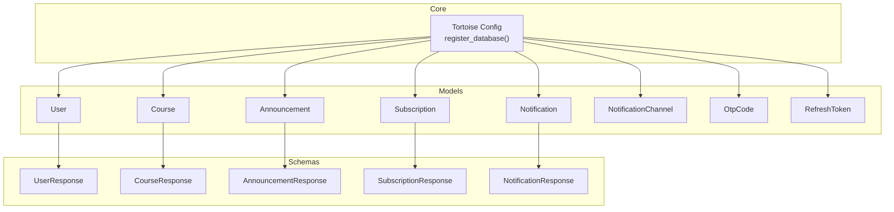

**Diagram sources**
- [database.py](file://notice-reminders/app/core/database.py#L7-L25)
- [user.py](file://notice-reminders/app/models/user.py#L8-L19)
- [course.py](file://notice-reminders/app/models/course.py#L8-L21)
- [announcement.py](file://notice-reminders/app/models/announcement.py#L12-L24)
- [subscription.py](file://notice-reminders/app/models/subscription.py#L13-L27)
- [notification.py](file://notice-reminders/app/models/notification.py#L15-L36)
- [notification_channel.py](file://notice-reminders/app/models/notification_channel.py#L12-L25)
- [otp.py](file://notice-reminders/app/models/otp.py#L8-L18)
- [refresh_token.py](file://notice-reminders/app/models/refresh_token.py#L8-L22)
- [user.py (schema)](file://notice-reminders/app/schemas/user.py#L13-L23)
- [course.py (schema)](file://notice-reminders/app/schemas/course.py#L6-L18)
- [announcement.py (schema)](file://notice-reminders/app/schemas/announcement.py#L6-L15)
- [subscription.py (schema)](file://notice-reminders/app/schemas/subscription.py#L10-L18)
- [notification.py (schema)](file://notice-reminders/app/schemas/notification.py#L6-L16)

**Section sources**
- [database.py](file://notice-reminders/app/core/database.py#L7-L25)

## Core Components
This section documents each database entity, including fields, data types, primary keys, foreign keys, indexes, and constraints. It also explains how the models are registered and initialized.

- User
  - Fields: id (IntField, pk), email (CharField, unique, indexed), name (CharField, nullable), telegram_id (CharField, unique, nullable), is_active (BooleanField), created_at (DatetimeField), updated_at (DatetimeField)
  - Indexes: email, telegram_id
  - Constraints: unique(email), unique(telegram_id)
  - Table: users

- Course
  - Fields: id (IntField, pk), code (CharField, unique, indexed), title (CharField), url (CharField), instructor (CharField), institute (CharField), nc_code (CharField), created_at (DatetimeField), updated_at (DatetimeField)
  - Indexes: code
  - Constraints: unique(code)
  - Table: courses

- Announcement
  - Fields: id (IntField, pk), course (ForeignKey to Course, related_name: announcements), title (CharField), date (CharField), content (TextField), fetched_at (DatetimeField)
  - Table: announcements

- Subscription
  - Fields: id (IntField, pk), user (ForeignKey to User, related_name: subscriptions), course (ForeignKey to Course, related_name: subscriptions), created_at (DatetimeField), is_active (BooleanField)
  - Constraints: unique(user, course)
  - Table: subscriptions

- NotificationChannel
  - Fields: id (IntField, pk), user (ForeignKey to User, related_name: notification_channels), channel (CharField), address (CharField), is_active (BooleanField), created_at (DatetimeField)
  - Constraints: unique(user, channel, address)
  - Table: notification_channels

- Notification
  - Fields: id (IntField, pk), user (ForeignKey to User, related_name: notifications), subscription (ForeignKey to Subscription, related_name: notifications), announcement (ForeignKey to Announcement, related_name: notifications), channel (ForeignKey to NotificationChannel, nullable, related_name: notifications), sent_at (DatetimeField), is_read (BooleanField)
  - Table: notifications

- OtpCode
  - Fields: id (IntField, pk), email (CharField, indexed), code (CharField), expires_at (DatetimeField), is_used (BooleanField), created_at (DatetimeField)
  - Indexes: email
  - Table: otp_codes

- RefreshToken
  - Fields: id (IntField, pk), user (ForeignKey to User, related_name: refresh_tokens, on_delete=CASCADE), token (CharField, unique, indexed), expires_at (DatetimeField), is_revoked (BooleanField), created_at (DatetimeField)
  - Indexes: token
  - Constraints: unique(token)
  - Table: refresh_tokens

**Section sources**
- [user.py](file://notice-reminders/app/models/user.py#L8-L19)
- [course.py](file://notice-reminders/app/models/course.py#L8-L21)
- [announcement.py](file://notice-reminders/app/models/announcement.py#L12-L24)
- [subscription.py](file://notice-reminders/app/models/subscription.py#L13-L27)
- [notification_channel.py](file://notice-reminders/app/models/notification_channel.py#L12-L25)
- [notification.py](file://notice-reminders/app/models/notification.py#L15-L36)
- [otp.py](file://notice-reminders/app/models/otp.py#L8-L18)
- [refresh_token.py](file://notice-reminders/app/models/refresh_token.py#L8-L22)

## Architecture Overview
The data model architecture follows a relational design with explicit foreign key relationships. Tortoise ORM is configured to auto-generate schemas when the SQLite file does not exist and registers all models with the FastAPI application.

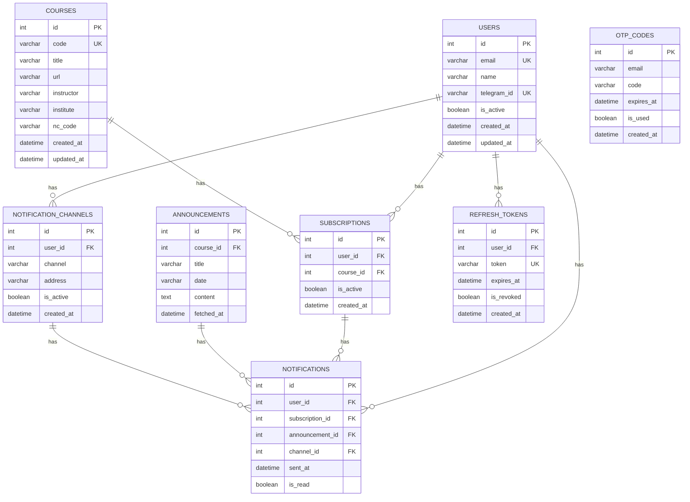

**Diagram sources**
- [user.py](file://notice-reminders/app/models/user.py#L8-L19)
- [course.py](file://notice-reminders/app/models/course.py#L8-L21)
- [announcement.py](file://notice-reminders/app/models/announcement.py#L12-L24)
- [subscription.py](file://notice-reminders/app/models/subscription.py#L13-L27)
- [notification_channel.py](file://notice-reminders/app/models/notification_channel.py#L12-L25)
- [notification.py](file://notice-reminders/app/models/notification.py#L15-L36)
- [otp.py](file://notice-reminders/app/models/otp.py#L8-L18)
- [refresh_token.py](file://notice-reminders/app/models/refresh_token.py#L8-L22)

## Detailed Component Analysis

### User Model
- Purpose: Stores user account information and profile metadata.
- Key constraints: unique(email), unique(telegram_id)
- Indexes: email, telegram_id
- Related models: Subscriptions, NotificationChannels, Notifications, RefreshTokens

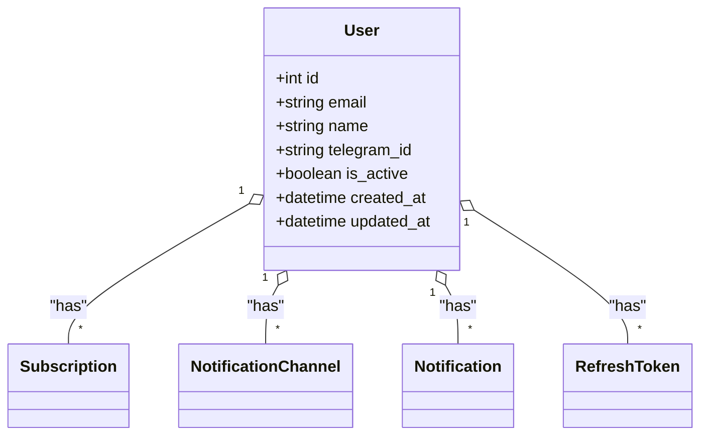

**Diagram sources**
- [user.py](file://notice-reminders/app/models/user.py#L8-L19)
- [subscription.py](file://notice-reminders/app/models/subscription.py#L13-L27)
- [notification_channel.py](file://notice-reminders/app/models/notification_channel.py#L12-L25)
- [notification.py](file://notice-reminders/app/models/notification.py#L15-L36)
- [refresh_token.py](file://notice-reminders/app/models/refresh_token.py#L8-L22)

**Section sources**
- [user.py](file://notice-reminders/app/models/user.py#L8-L19)

### Course Model
- Purpose: Represents MOOC courses with metadata.
- Key constraints: unique(code)
- Indexes: code
- Related models: Announcements, Subscriptions

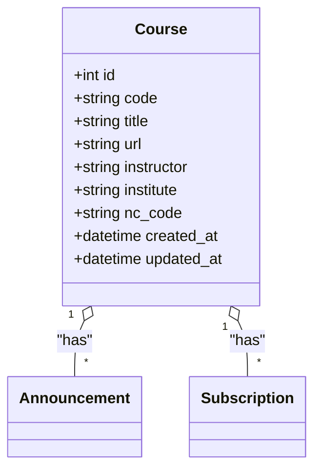

**Diagram sources**
- [course.py](file://notice-reminders/app/models/course.py#L8-L21)
- [announcement.py](file://notice-reminders/app/models/announcement.py#L12-L24)
- [subscription.py](file://notice-reminders/app/models/subscription.py#L13-L27)

**Section sources**
- [course.py](file://notice-reminders/app/models/course.py#L8-L21)

### Announcement Model
- Purpose: Stores scraped course announcements with course linkage.
- Related model: Notifications
- Notes: fetched_at indicates when the record was inserted after scraping.

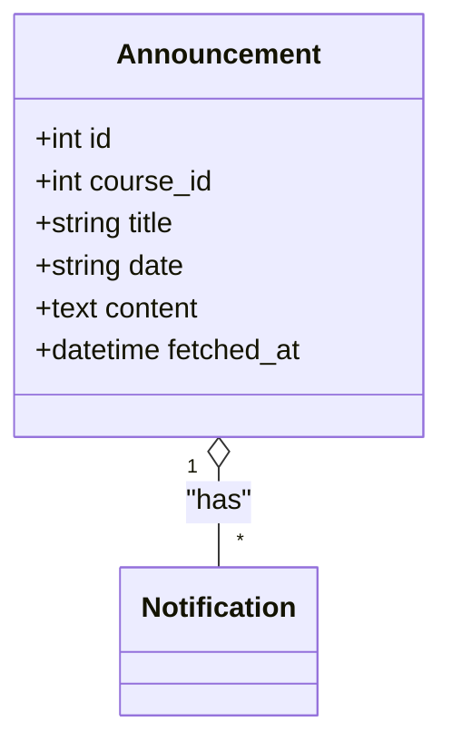

**Diagram sources**
- [announcement.py](file://notice-reminders/app/models/announcement.py#L12-L24)
- [notification.py](file://notice-reminders/app/models/notification.py#L15-L36)

**Section sources**
- [announcement.py](file://notice-reminders/app/models/announcement.py#L12-L24)

### Subscription Model
- Purpose: Links users to courses they follow.
- Unique constraint: (user, course)
- Related models: Notifications

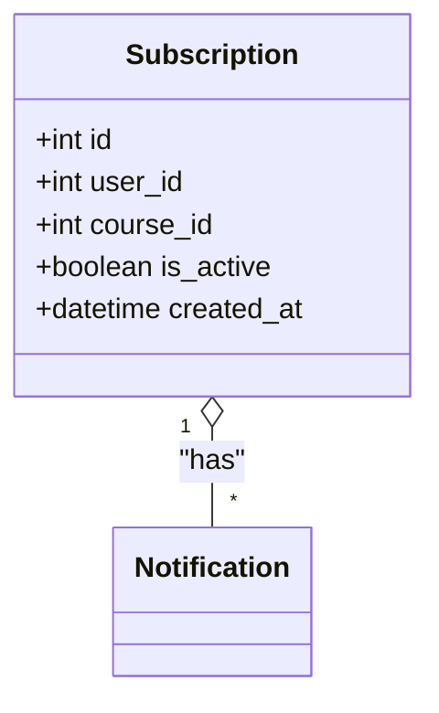

**Diagram sources**
- [subscription.py](file://notice-reminders/app/models/subscription.py#L13-L27)
- [notification.py](file://notice-reminders/app/models/notification.py#L15-L36)

**Section sources**
- [subscription.py](file://notice-reminders/app/models/subscription.py#L13-L27)

### NotificationChannel Model
- Purpose: Defines per-user channels (e.g., Telegram) for delivery.
- Unique constraint: (user, channel, address)
- Related model: Notifications

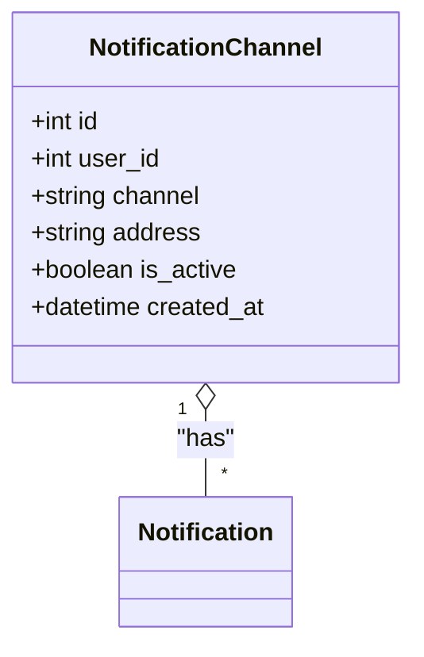

**Diagram sources**
- [notification_channel.py](file://notice-reminders/app/models/notification_channel.py#L12-L25)
- [notification.py](file://notice-reminders/app/models/notification.py#L15-L36)

**Section sources**
- [notification_channel.py](file://notice-reminders/app/models/notification_channel.py#L12-L25)

### Notification Model
- Purpose: Records sent notifications with optional channel association and read state.
- Foreign keys: user, subscription, announcement, channel (nullable)
- Related models: User, Subscription, Announcement, NotificationChannel

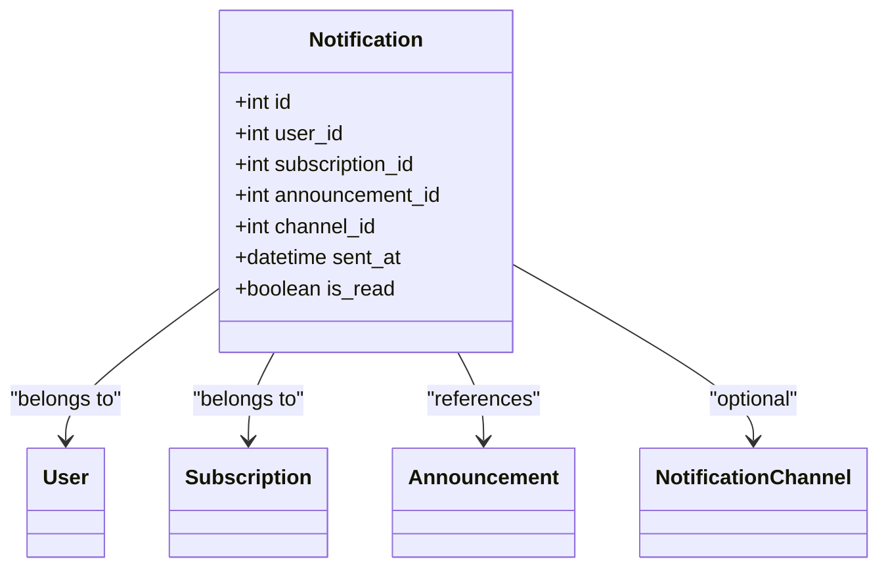

**Diagram sources**
- [notification.py](file://notice-reminders/app/models/notification.py#L15-L36)
- [user.py](file://notice-reminders/app/models/user.py#L8-L19)
- [subscription.py](file://notice-reminders/app/models/subscription.py#L13-L27)
- [announcement.py](file://notice-reminders/app/models/announcement.py#L12-L24)
- [notification_channel.py](file://notice-reminders/app/models/notification_channel.py#L12-L25)

**Section sources**
- [notification.py](file://notice-reminders/app/models/notification.py#L15-L36)

### OtpCode Model
- Purpose: Stores OTP codes for email-based authentication.
- Indexes: email
- Lifecycle: expires_at determines validity; is_used marks consumption.

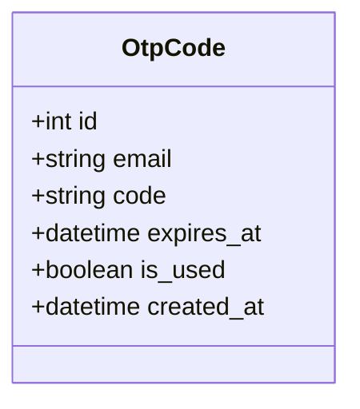

**Diagram sources**
- [otp.py](file://notice-reminders/app/models/otp.py#L8-L18)

**Section sources**
- [otp.py](file://notice-reminders/app/models/otp.py#L8-L18)

### RefreshToken Model
- Purpose: Manages refresh tokens for secure sessions.
- Constraints: unique(token)
- Behavior: CASCADE delete on user removal; is_revoked flag supports revocation.

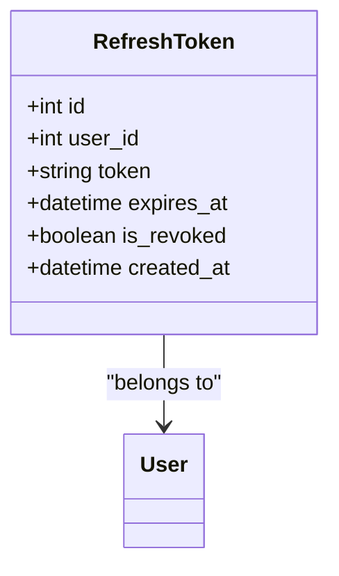

**Diagram sources**
- [refresh_token.py](file://notice-reminders/app/models/refresh_token.py#L8-L22)
- [user.py](file://notice-reminders/app/models/user.py#L8-L19)

**Section sources**
- [refresh_token.py](file://notice-reminders/app/models/refresh_token.py#L8-L22)

## Dependency Analysis
The models form a cohesive relational graph. The following diagram highlights foreign key dependencies and uniqueness constraints.

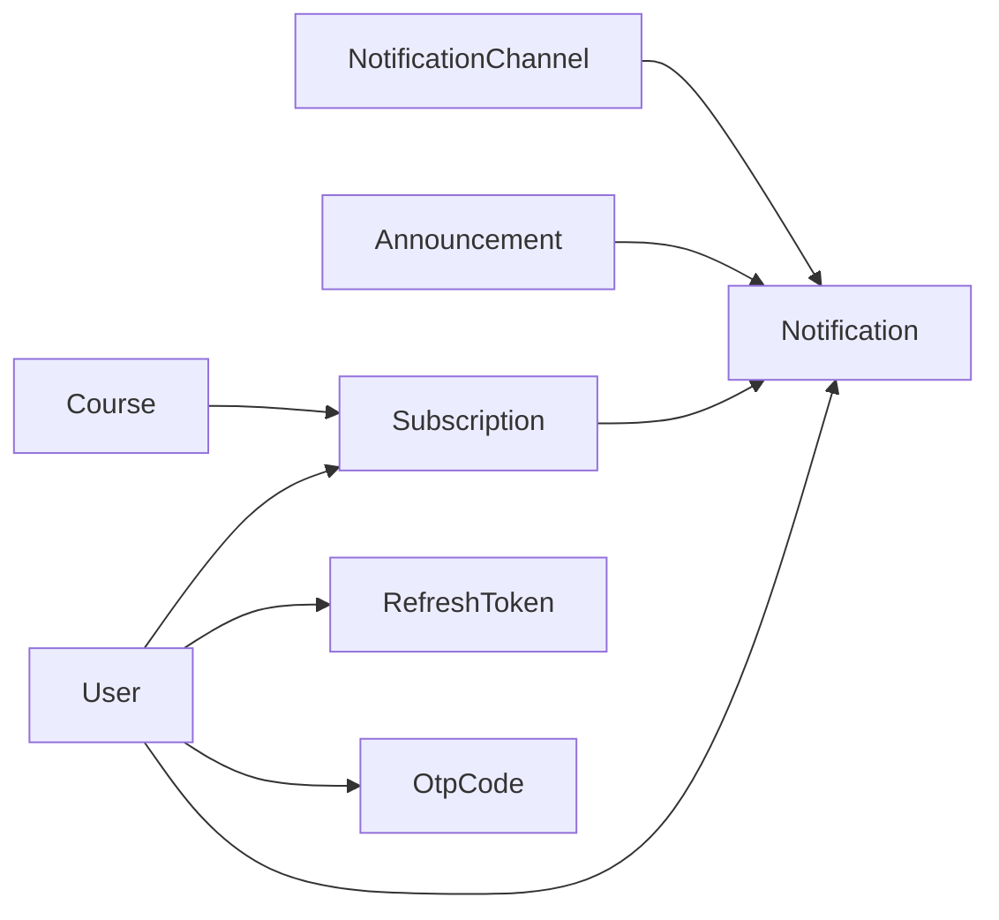

**Diagram sources**
- [user.py](file://notice-reminders/app/models/user.py#L8-L19)
- [course.py](file://notice-reminders/app/models/course.py#L8-L21)
- [announcement.py](file://notice-reminders/app/models/announcement.py#L12-L24)
- [subscription.py](file://notice-reminders/app/models/subscription.py#L13-L27)
- [notification.py](file://notice-reminders/app/models/notification.py#L15-L36)
- [notification_channel.py](file://notice-reminders/app/models/notification_channel.py#L12-L25)
- [otp.py](file://notice-reminders/app/models/otp.py#L8-L18)
- [refresh_token.py](file://notice-reminders/app/models/refresh_token.py#L8-L22)

**Section sources**
- [subscription.py](file://notice-reminders/app/models/subscription.py#L27-L27)
- [notification_channel.py](file://notice-reminders/app/models/notification_channel.py#L25-L25)

## Performance Considerations
- Indexes: email and telegram_id on User; code on Course; email on OtpCode; token on RefreshToken. These support frequent lookups and uniqueness checks.
- Unique constraints: reduce duplicate entries and simplify join conditions.
- Auto timestamps: created_at and updated_at enable efficient sorting and filtering.
- Recommendations:
  - Add composite indexes for frequently filtered pairs (e.g., user+is_active on Subscription).
  - Consider partitioning or soft-deleted views for Notification if volume grows large.
  - Use pagination and limit clauses in queries to avoid large result sets.

## Troubleshooting Guide
- Registration and schema generation:
  - The database is registered via a configuration that lists all models. If the SQLite file does not exist, schemas are generated automatically.
  - Ensure the database URL points to a writable path for SQLite.
- Common issues:
  - Integrity errors on unique fields (email, telegram_id, code, token): validate inputs before creation.
  - Expiration handling: ensure background jobs or scheduled tasks invalidate expired OTPs and refresh tokens.
  - Cascade deletes: removing a user will remove dependent refresh tokens; confirm intended behavior.

**Section sources**
- [database.py](file://notice-reminders/app/core/database.py#L39-L53)

## Conclusion
The Notice Reminders data model is a well-structured relational schema built with Tortoise ORM. It supports user profiles, course catalogs, subscription management, notification delivery, and authentication tokens. The schema enforces referential integrity and uniqueness constraints, while indexes optimize common queries. API schemas align with models to ensure validated and consistent data transfer.

## Appendices

### API Schemas and Validation Rules
- UserResponse mirrors User fields and enables ORM-to-Pydantic conversion.
- CourseResponse mirrors Course fields.
- AnnouncementResponse exposes course_id for clarity.
- SubscriptionCreate accepts course_code; SubscriptionResponse exposes user_id and course_id.
- NotificationResponse exposes channel_id as optional.

These schemas enforce type safety and validation for incoming/outgoing data.

**Section sources**
- [user.py (schema)](file://notice-reminders/app/schemas/user.py#L13-L23)
- [course.py (schema)](file://notice-reminders/app/schemas/course.py#L6-L18)
- [announcement.py (schema)](file://notice-reminders/app/schemas/announcement.py#L6-L15)
- [subscription.py (schema)](file://notice-reminders/app/schemas/subscription.py#L10-L18)
- [notification.py (schema)](file://notice-reminders/app/schemas/notification.py#L6-L16)

### Data Access Patterns and Business Rules
- User CRUD: update profile fields; toggle is_active; link Telegram ID.
- Course lookup: filter by code for subscription creation.
- Subscription lifecycle: create unique (user, course); toggle is_active; cascade reads into notifications.
- Notification lifecycle: mark is_read; associate channel for delivery; track sent_at.
- OTP lifecycle: generate with expiry; mark is_used upon verification; reject expired codes.
- Refresh token lifecycle: generate with expiry; revoke by setting is_revoked; enforce CASCADE on user deletion.

**Section sources**
- [subscription.py](file://notice-reminders/app/models/subscription.py#L13-L27)
- [notification.py](file://notice-reminders/app/models/notification.py#L15-L36)
- [otp.py](file://notice-reminders/app/models/otp.py#L8-L18)
- [refresh_token.py](file://notice-reminders/app/models/refresh_token.py#L8-L22)

### Migration Considerations
- Initial schema generation occurs when the SQLite file is missing; subsequent runs reuse existing tables.
- For production databases (PostgreSQL/MySQL), use Tortoise migrations to evolve schema safely.
- When altering unique constraints or indexes, plan downtime or use online DDL where supported.
- Back up before major schema changes; test rollback procedures.

**Section sources**
- [database.py](file://notice-reminders/app/core/database.py#L39-L53)