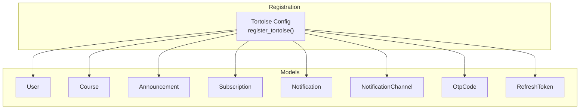
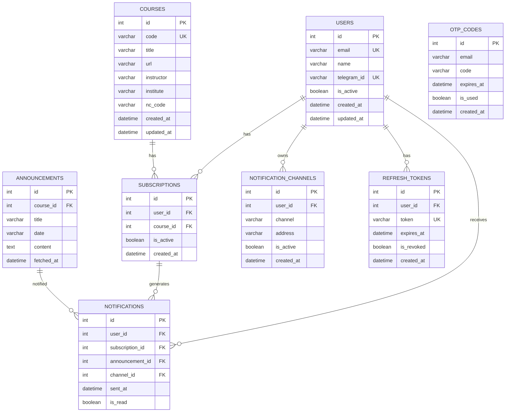
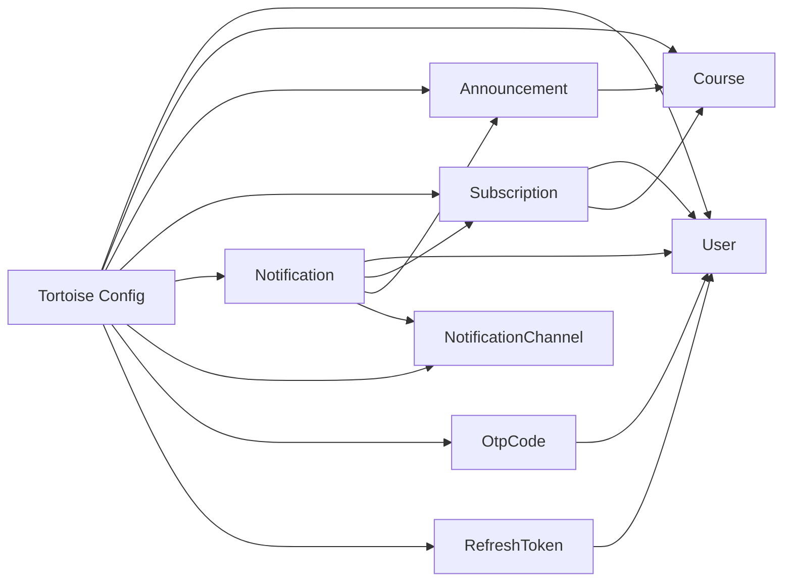

# Database Models

<cite>
**Referenced Files in This Document**
- [user.py](file://notice-reminders/app/models/user.py)
- [course.py](file://notice-reminders/app/models/course.py)
- [announcement.py](file://notice-reminders/app/models/announcement.py)
- [subscription.py](file://notice-reminders/app/models/subscription.py)
- [notification.py](file://notice-reminders/app/models/notification.py)
- [notification_channel.py](file://notice-reminders/app/models/notification_channel.py)
- [otp.py](file://notice-reminders/app/models/otp.py)
- [refresh_token.py](file://notice-reminders/app/models/refresh_token.py)
- [database.py](file://notice-reminders/app/core/database.py)
- [schemas_user.py](file://notice-reminders/app/schemas/user.py)
- [schemas_course.py](file://notice-reminders/app/schemas/course.py)
- [schemas_announcement.py](file://notice-reminders/app/schemas/announcement.py)
</cite>

## Table of Contents
1. [Introduction](#introduction)
2. [Project Structure](#project-structure)
3. [Core Components](#core-components)
4. [Architecture Overview](#architecture-overview)
5. [Detailed Component Analysis](#detailed-component-analysis)
6. [Dependency Analysis](#dependency-analysis)
7. [Performance Considerations](#performance-considerations)
8. [Troubleshooting Guide](#troubleshooting-guide)
9. [Conclusion](#conclusion)

## Introduction
This document describes the complete database model layer for the Notice Reminders system built with Tortoise ORM. It covers each persistent model, including fields, data types, constraints, indexes, and relationships. It also documents validation rules enforced at the Pydantic schema level, and provides examples of model instantiation and common query patterns.

## Project Structure
The database models are defined under the notice-reminders application as Tortoise ORM models. The FastAPI integration registers these models with Tortoise and can optionally generate database schemas.

**Diagram sources**
- [database.py](file://notice-reminders/app/core/database.py#L7-L25)

**Section sources**
- [database.py](file://notice-reminders/app/core/database.py#L1-L54)

## Core Components
This section documents each model’s structure, fields, constraints, and indexes.

- User
  - Fields: id (primary key), email (unique, indexed), name, telegram_id (unique, nullable), is_active, created_at, updated_at
  - Indexing: email, telegram_id
  - Constraints: unique(email), unique(telegram_id)
  - Notes: Uses auto timestamps for created_at and updated_at

- Course
  - Fields: id (primary key), code (unique, indexed), title, url, instructor, institute, nc_code, created_at, updated_at
  - Indexing: code
  - Constraints: unique(code)
  - Notes: Uses auto timestamps

- Announcement
  - Fields: id (primary key), course (foreign key to Course), title, date, content (text), fetched_at
  - Relationships: belongs to Course via ForeignKeyField
  - Indexing: none declared
  - Notes: Uses auto timestamps

- Subscription
  - Fields: id (primary key), user (foreign key to User), course (foreign key to Course), created_at, is_active
  - Relationships: belongs to User and Course via ForeignKeyField
  - Constraints: unique_together(user, course)
  - Notes: Uses auto timestamps

- Notification
  - Fields: id (primary key), user (foreign key to User), subscription (foreign key to Subscription), announcement (foreign key to Announcement), channel (nullable foreign key to NotificationChannel), sent_at, is_read
  - Relationships: belongs to User, Subscription, Announcement, and optionally NotificationChannel
  - Notes: Uses auto timestamps

- NotificationChannel
  - Fields: id (primary key), user (foreign key to User), channel, address, is_active, created_at
  - Relationships: belongs to User via ForeignKeyField
  - Constraints: unique_together(user, channel, address)
  - Notes: Uses auto timestamps

- OtpCode
  - Fields: id (primary key), email (indexed), code, expires_at, is_used, created_at
  - Indexing: email
  - Notes: Uses auto timestamps

- RefreshToken
  - Fields: id (primary key), user (foreign key to User, CASCADE delete), token (unique, indexed), expires_at, is_revoked, created_at
  - Relationships: belongs to User via ForeignKeyField with CASCADE deletion
  - Constraints: unique(token)
  - Notes: Uses auto timestamps

Validation rules enforced at the schema level:
- UserUpdate and UserResponse define allowable updates and response shapes for User, including optional fields and required types.
- CourseResponse defines the shape for Course responses.
- AnnouncementResponse defines the shape for Announcement responses.

**Section sources**
- [user.py](file://notice-reminders/app/models/user.py#L1-L20)
- [course.py](file://notice-reminders/app/models/course.py#L1-L22)
- [announcement.py](file://notice-reminders/app/models/announcement.py#L1-L25)
- [subscription.py](file://notice-reminders/app/models/subscription.py#L1-L28)
- [notification.py](file://notice-reminders/app/models/notification.py#L1-L37)
- [notification_channel.py](file://notice-reminders/app/models/notification_channel.py#L1-L26)
- [otp.py](file://notice-reminders/app/models/otp.py#L1-L19)
- [refresh_token.py](file://notice-reminders/app/models/refresh_token.py#L1-L23)
- [schemas_user.py](file://notice-reminders/app/schemas/user.py#L1-L24)
- [schemas_course.py](file://notice-reminders/app/schemas/course.py#L1-L19)
- [schemas_announcement.py](file://notice-reminders/app/schemas/announcement.py#L1-L16)

## Architecture Overview
The models form a normalized relational schema centered around Users, Courses, and Announcements. Subscriptions link Users to Courses. Notifications track delivery of Announcements to Users via NotificationChannels. OTP and RefreshToken support authentication flows.

**Diagram sources**
- [user.py](file://notice-reminders/app/models/user.py#L8-L19)
- [course.py](file://notice-reminders/app/models/course.py#L8-L22)
- [subscription.py](file://notice-reminders/app/models/subscription.py#L13-L27)
- [announcement.py](file://notice-reminders/app/models/announcement.py#L12-L24)
- [notification.py](file://notice-reminders/app/models/notification.py#L15-L36)
- [notification_channel.py](file://notice-reminders/app/models/notification_channel.py#L12-L25)
- [otp.py](file://notice-reminders/app/models/otp.py#L8-L18)
- [refresh_token.py](file://notice-reminders/app/models/refresh_token.py#L8-L22)

## Detailed Component Analysis

### User Model
- Purpose: Stores user account information and profile attributes.
- Authentication-related fields: email (unique), telegram_id (unique), plus refresh tokens managed separately.
- Validation: Pydantic schema allows partial updates and enforces email format and optional fields.
- Typical queries:
  - Retrieve by email: filter by unique email index.
  - Retrieve by telegram_id: filter by unique telegram_id index.
  - List active users: filter by is_active.

**Section sources**
- [user.py](file://notice-reminders/app/models/user.py#L8-L19)
- [schemas_user.py](file://notice-reminders/app/schemas/user.py#L6-L23)

### Course Model
- Purpose: Represents MOOC course metadata.
- Platform and metadata fields: code (unique), title, url, instructor, institute, nc_code.
- Typical queries:
  - Find course by code: leverages unique index on code.
  - Bulk fetch with pagination.

**Section sources**
- [course.py](file://notice-reminders/app/models/course.py#L8-L21)
- [schemas_course.py](file://notice-reminders/app/schemas/course.py#L6-L18)

### Announcement Model
- Purpose: Stores parsed course announcements with content and fetch metadata.
- Content parsing fields: title, date, content (text), fetched_at.
- Relationship: ForeignKey to Course.
- Typical queries:
  - Get latest announcements per course: order by fetched_at desc.
  - Filter by date range using fetched_at.

**Section sources**
- [announcement.py](file://notice-reminders/app/models/announcement.py#L12-L24)
- [schemas_announcement.py](file://notice-reminders/app/schemas/announcement.py#L6-L15)

### Subscription Model
- Purpose: Links users to courses for notification delivery.
- Relationships: ForeignKey to User and Course.
- Constraint: unique_together(user, course) ensures a user cannot subscribe to the same course twice.
- Typical queries:
  - List a user’s active subscriptions.
  - Remove duplicates by checking unique constraint before insert.

**Section sources**
- [subscription.py](file://notice-reminders/app/models/subscription.py#L13-L27)

### Notification Model
- Purpose: Tracks notification deliveries to users and marks read state.
- Relationships: ForeignKey to User, Subscription, Announcement, and optional NotificationChannel.
- Delivery tracking: sent_at and is_read flags.
- Typical queries:
  - Mark as read: update is_read.
  - Inbox view: filter by user and order by sent_at desc.

**Section sources**
- [notification.py](file://notice-reminders/app/models/notification.py#L15-L36)

### NotificationChannel Model
- Purpose: Defines user-specific delivery channels (e.g., email, Telegram) with addresses.
- Relationships: ForeignKey to User.
- Constraint: unique_together(user, channel, address) prevents duplicate channel/address pairs per user.
- Typical queries:
  - List a user’s channels.
  - Find channel by type and address.

**Section sources**
- [notification_channel.py](file://notice-reminders/app/models/notification_channel.py#L12-L25)

### OTP Model
- Purpose: Supports one-time code verification flows.
- Fields: email (indexed), code, expires_at, is_used, created_at.
- Typical queries:
  - Lookup unexpired, unused OTP by email.
  - Invalidate after use by setting is_used.

**Section sources**
- [otp.py](file://notice-reminders/app/models/otp.py#L8-L18)

### RefreshToken Model
- Purpose: Manages long-lived refresh tokens for secure sessions.
- Relationships: ForeignKey to User with CASCADE delete.
- Constraints: unique(token), index(token), expires_at, is_revoked.
- Typical queries:
  - Validate token existence and non-revocation.
  - Revoke by setting is_revoked.

**Section sources**
- [refresh_token.py](file://notice-reminders/app/models/refresh_token.py#L8-L22)

## Dependency Analysis
The models are organized with explicit foreign keys and related names. The registration module wires Tortoise to load all models.

**Diagram sources**
- [database.py](file://notice-reminders/app/core/database.py#L10-L23)

**Section sources**
- [database.py](file://notice-reminders/app/core/database.py#L1-L54)

## Performance Considerations
- Indexes: email and telegram_id on User; code on Course; email on OtpCode; token on RefreshToken. These indexes optimize lookups for authentication and user-centric operations.
- Unique constraints: email and telegram_id on User; code on Course; unique(token) and unique_together(user, course) on Subscription; unique_together(user, channel, address) on NotificationChannel. These prevent duplicates and enforce business rules efficiently at the RDBMS level.
- Auto timestamps: created_at and updated_at reduce application-level timestamp management overhead.
- Text fields: content in Announcement uses TextField to accommodate large content sizes.

[No sources needed since this section provides general guidance]

## Troubleshooting Guide
- Integrity errors on inserts:
  - Unique violations on email or telegram_id in User.
  - Unique violations on code in Course.
  - Unique violations on token in RefreshToken.
  - Duplicate Subscription entries due to unique_together(user, course).
  - Duplicate NotificationChannel entries due to unique_together(user, channel, address).
- Cascade behavior:
  - Deleting a User deletes associated RefreshTokens due to CASCADE on RefreshToken.user.
- Query pitfalls:
  - Ensure proper ordering by timestamps (e.g., fetched_at, sent_at) for recent items.
  - Use related filters via Tortoise relations (e.g., user.subscriptions, course.announcements) to avoid N+1 queries.

**Section sources**
- [user.py](file://notice-reminders/app/models/user.py#L10-L12)
- [course.py](file://notice-reminders/app/models/course.py#L10-L15)
- [refresh_token.py](file://notice-reminders/app/models/refresh_token.py#L15-L17)
- [subscription.py](file://notice-reminders/app/models/subscription.py#L27-L27)
- [notification_channel.py](file://notice-reminders/app/models/notification_channel.py#L25-L25)

## Conclusion
The Notice Reminders database models provide a clean, normalized schema optimized for user management, course discovery, announcement ingestion, and notification delivery. Constraints and indexes ensure data integrity and efficient lookups. Together with Pydantic schemas, the system enforces validation at both persistence and API boundaries.